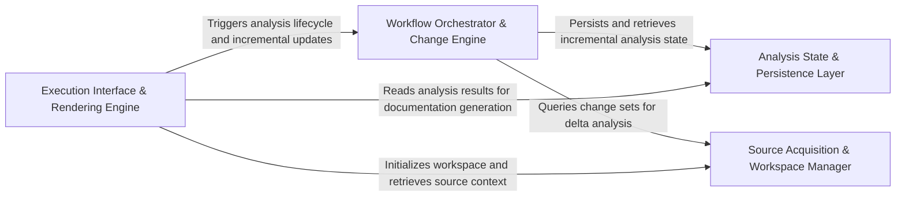

## Details

The primary orchestrator that sequences high-level tasks, coordinates source code acquisition, triggers the analysis engine, and manages the final rendering of architectural documentation.

### Workflow Orchestrator & Change Engine [[Expand]](./Workflow_Orchestrator_Change_Engine.md)
Primary controller for the analysis lifecycle, implementing incremental processing logic and sequencing analysis generators.

**Related Classes/Methods**:

- `codeboarding_workflows.analysis.run_incremental_workflow`:193-216
- `codeboarding_workflows.analysis.build_generator`:27-46

**Source Files:**

- [`codeboarding_cli/commands/partial_analysis.py`](https://github.com/CodeBoarding/CodeBoarding/blob/main/.codeboardingcodeboarding_cli/commands/partial_analysis.py)
  - `codeboarding_cli.commands.partial_analysis.run_from_args.scope` ([L51-L56](https://github.com/CodeBoarding/CodeBoarding/blob/main/.codeboardingcodeboarding_cli/commands/partial_analysis.py#L51-L56)) - Function
- [`codeboarding_workflows/analysis.py`](https://github.com/CodeBoarding/CodeBoarding/blob/main/.codeboardingcodeboarding_workflows/analysis.py)
  - `codeboarding_workflows.analysis.build_generator` ([L27-L46](https://github.com/CodeBoarding/CodeBoarding/blob/main/.codeboardingcodeboarding_workflows/analysis.py#L27-L46)) - Function
  - `codeboarding_workflows.analysis.run_partial` ([L77-L151](https://github.com/CodeBoarding/CodeBoarding/blob/main/.codeboardingcodeboarding_workflows/analysis.py#L77-L151)) - Function
  - `codeboarding_workflows.analysis.run_incremental` ([L154-L199](https://github.com/CodeBoarding/CodeBoarding/blob/main/.codeboardingcodeboarding_workflows/analysis.py#L154-L199)) - Function
  - `codeboarding_workflows.analysis.run_incremental_workflow` ([L202-L225](https://github.com/CodeBoarding/CodeBoarding/blob/main/.codeboardingcodeboarding_workflows/analysis.py#L202-L225)) - Function
- [`diagram_analysis/io_utils.py`](https://github.com/CodeBoarding/CodeBoarding/blob/main/.codeboardingdiagram_analysis/io_utils.py)
  - `diagram_analysis.io_utils.load_full_analysis` ([L322-L332](https://github.com/CodeBoarding/CodeBoarding/blob/main/.codeboardingdiagram_analysis/io_utils.py#L322-L332)) - Function
  - `diagram_analysis.io_utils.load_analysis_metadata` ([L335-L340](https://github.com/CodeBoarding/CodeBoarding/blob/main/.codeboardingdiagram_analysis/io_utils.py#L335-L340)) - Function
  - `diagram_analysis.io_utils.read_fingerprint` ([L368-L377](https://github.com/CodeBoarding/CodeBoarding/blob/main/.codeboardingdiagram_analysis/io_utils.py#L368-L377)) - Function
- [`repo_utils/change_detector.py`](https://github.com/CodeBoarding/CodeBoarding/blob/main/.codeboardingrepo_utils/change_detector.py)
  - `repo_utils.change_detector.ChangeDetectionError` ([L22-L23](https://github.com/CodeBoarding/CodeBoarding/blob/main/.codeboardingrepo_utils/change_detector.py#L22-L23)) - Class
  - `repo_utils.change_detector.ChangeType` ([L26-L43](https://github.com/CodeBoarding/CodeBoarding/blob/main/.codeboardingrepo_utils/change_detector.py#L26-L43)) - Class
  - `repo_utils.change_detector.DiffHunk` ([L47-L54](https://github.com/CodeBoarding/CodeBoarding/blob/main/.codeboardingrepo_utils/change_detector.py#L47-L54)) - Class
  - `repo_utils.change_detector.FileChange` ([L72-L221](https://github.com/CodeBoarding/CodeBoarding/blob/main/.codeboardingrepo_utils/change_detector.py#L72-L221)) - Class
  - `repo_utils.change_detector.ChangeSet` ([L225-L304](https://github.com/CodeBoarding/CodeBoarding/blob/main/.codeboardingrepo_utils/change_detector.py#L225-L304)) - Class
  - `repo_utils.change_detector.ChangeSet.is_empty` ([L242-L243](https://github.com/CodeBoarding/CodeBoarding/blob/main/.codeboardingrepo_utils/change_detector.py#L242-L243)) - Method
  - `repo_utils.change_detector.ChangeSet.to_dict` ([L278-L289](https://github.com/CodeBoarding/CodeBoarding/blob/main/.codeboardingrepo_utils/change_detector.py#L278-L289)) - Method
  - `repo_utils.change_detector.ChangeSet.from_changed_files` ([L292-L304](https://github.com/CodeBoarding/CodeBoarding/blob/main/.codeboardingrepo_utils/change_detector.py#L292-L304)) - Method
- [`repo_utils/fingerprint_diff.py`](https://github.com/CodeBoarding/CodeBoarding/blob/main/.codeboardingrepo_utils/fingerprint_diff.py)
  - `repo_utils.fingerprint_diff.BaselineUnavailableError` ([L21-L31](https://github.com/CodeBoarding/CodeBoarding/blob/main/.codeboardingrepo_utils/fingerprint_diff.py#L21-L31)) - Class
  - `repo_utils.fingerprint_diff.diff_file_maps` ([L34-L43](https://github.com/CodeBoarding/CodeBoarding/blob/main/.codeboardingrepo_utils/fingerprint_diff.py#L34-L43)) - Function
  - `repo_utils.fingerprint_diff.detect_changes_from_fingerprints` ([L46-L50](https://github.com/CodeBoarding/CodeBoarding/blob/main/.codeboardingrepo_utils/fingerprint_diff.py#L46-L50)) - Function
  - `repo_utils.fingerprint_diff.detect_changes_from_fingerprint` ([L53-L71](https://github.com/CodeBoarding/CodeBoarding/blob/main/.codeboardingrepo_utils/fingerprint_diff.py#L53-L71)) - Function

### Analysis State & Persistence Layer [[Expand]](./Analysis_State_Persistence_Layer.md)
Manages the Analysis File Store to persist and retrieve static analysis and LLM reasoning results, enabling incremental analysis.

**Related Classes/Methods**:

- `diagram_analysis.io_utils._AnalysisFileStore`:38-251
- `diagram_analysis.io_utils.load_root_analysis`:274-276
- `diagram_analysis.io_utils.save_sub_analysis`:375-382

**Source Files:**

- [`diagram_analysis/io_utils.py`](https://github.com/CodeBoarding/CodeBoarding/blob/main/.codeboardingdiagram_analysis/io_utils.py)
  - `diagram_analysis.io_utils._AnalysisFileStore` ([L40-L287](https://github.com/CodeBoarding/CodeBoarding/blob/main/.codeboardingdiagram_analysis/io_utils.py#L40-L287)) - Class
  - `diagram_analysis.io_utils._AnalysisFileStore._repo_dir_for_source_lookup` ([L65-L72](https://github.com/CodeBoarding/CodeBoarding/blob/main/.codeboardingdiagram_analysis/io_utils.py#L65-L72)) - Method
  - `diagram_analysis.io_utils._AnalysisFileStore.read` ([L74-L92](https://github.com/CodeBoarding/CodeBoarding/blob/main/.codeboardingdiagram_analysis/io_utils.py#L74-L92)) - Method
  - `diagram_analysis.io_utils._AnalysisFileStore.read_root` ([L94-L97](https://github.com/CodeBoarding/CodeBoarding/blob/main/.codeboardingdiagram_analysis/io_utils.py#L94-L97)) - Method
  - `diagram_analysis.io_utils._AnalysisFileStore.exists` ([L99-L101](https://github.com/CodeBoarding/CodeBoarding/blob/main/.codeboardingdiagram_analysis/io_utils.py#L99-L101)) - Method
  - `diagram_analysis.io_utils._AnalysisFileStore.read_sub` ([L103-L113](https://github.com/CodeBoarding/CodeBoarding/blob/main/.codeboardingdiagram_analysis/io_utils.py#L103-L113)) - Method
  - `diagram_analysis.io_utils._AnalysisFileStore.write_sub` ([L147-L186](https://github.com/CodeBoarding/CodeBoarding/blob/main/.codeboardingdiagram_analysis/io_utils.py#L147-L186)) - Method
  - `diagram_analysis.io_utils._AnalysisFileStore.detect_expanded_components` ([L188-L195](https://github.com/CodeBoarding/CodeBoarding/blob/main/.codeboardingdiagram_analysis/io_utils.py#L188-L195)) - Method
  - `diagram_analysis.io_utils._get_store` ([L297-L302](https://github.com/CodeBoarding/CodeBoarding/blob/main/.codeboardingdiagram_analysis/io_utils.py#L297-L302)) - Function
  - `diagram_analysis.io_utils.load_root_analysis` ([L310-L312](https://github.com/CodeBoarding/CodeBoarding/blob/main/.codeboardingdiagram_analysis/io_utils.py#L310-L312)) - Function
  - `diagram_analysis.io_utils.analysis_exists` ([L315-L319](https://github.com/CodeBoarding/CodeBoarding/blob/main/.codeboardingdiagram_analysis/io_utils.py#L315-L319)) - Function
  - `diagram_analysis.io_utils.load_sub_analysis` ([L412-L414](https://github.com/CodeBoarding/CodeBoarding/blob/main/.codeboardingdiagram_analysis/io_utils.py#L412-L414)) - Function
  - `diagram_analysis.io_utils.save_sub_analysis` ([L417-L424](https://github.com/CodeBoarding/CodeBoarding/blob/main/.codeboardingdiagram_analysis/io_utils.py#L417-L424)) - Function

### Source Acquisition & Workspace Manager [[Expand]](./Source_Acquisition_Workspace_Manager.md)
Handles version control interactions, repository cloning, and workspace management for source code extraction.

**Related Classes/Methods**:

- `repo_utils.__init__.clone_repository`:104-126
- `repo_utils.git_ops.get_changed_files_since`:113-135
- `codeboarding_workflows.sources.local.SourceContext`:8-18

**Source Files:**

- [`codeboarding_workflows/sources/local.py`](https://github.com/CodeBoarding/CodeBoarding/blob/main/.codeboardingcodeboarding_workflows/sources/local.py)
  - `codeboarding_workflows.sources.local.SourceContext` ([L8-L18](https://github.com/CodeBoarding/CodeBoarding/blob/main/.codeboardingcodeboarding_workflows/sources/local.py#L8-L18)) - Class
- [`codeboarding_workflows/sources/remote.py`](https://github.com/CodeBoarding/CodeBoarding/blob/main/.codeboardingcodeboarding_workflows/sources/remote.py)
  - `codeboarding_workflows.sources.remote.onboarding_materials_exist` ([L18-L28](https://github.com/CodeBoarding/CodeBoarding/blob/main/.codeboardingcodeboarding_workflows/sources/remote.py#L18-L28)) - Function
  - `codeboarding_workflows.sources.remote.remote_source` ([L32-L71](https://github.com/CodeBoarding/CodeBoarding/blob/main/.codeboardingcodeboarding_workflows/sources/remote.py#L32-L71)) - Function
- [`repo_utils/__init__.py`](https://github.com/CodeBoarding/CodeBoarding/blob/main/.codeboardingrepo_utils/__init__.py)
  - `repo_utils.__init__.sanitize_repo_url` ([L64-L78](https://github.com/CodeBoarding/CodeBoarding/blob/main/.codeboardingrepo_utils/__init__.py#L64-L78)) - Function
  - `repo_utils.__init__.remote_repo_exists` ([L82-L93](https://github.com/CodeBoarding/CodeBoarding/blob/main/.codeboardingrepo_utils/__init__.py#L82-L93)) - Function
  - `repo_utils.__init__.get_repo_name` ([L96-L100](https://github.com/CodeBoarding/CodeBoarding/blob/main/.codeboardingrepo_utils/__init__.py#L96-L100)) - Function
  - `repo_utils.__init__.clone_repository` ([L104-L126](https://github.com/CodeBoarding/CodeBoarding/blob/main/.codeboardingrepo_utils/__init__.py#L104-L126)) - Function
  - `repo_utils.__init__.store_token` ([L140-L144](https://github.com/CodeBoarding/CodeBoarding/blob/main/.codeboardingrepo_utils/__init__.py#L140-L144)) - Function
  - `repo_utils.__init__.upload_onboarding_materials` ([L148-L177](https://github.com/CodeBoarding/CodeBoarding/blob/main/.codeboardingrepo_utils/__init__.py#L148-L177)) - Function
  - `repo_utils.__init__.is_repo_dirty` ([L181-L184](https://github.com/CodeBoarding/CodeBoarding/blob/main/.codeboardingrepo_utils/__init__.py#L181-L184)) - Function
- [`repo_utils/errors.py`](https://github.com/CodeBoarding/CodeBoarding/blob/main/.codeboardingrepo_utils/errors.py)
  - `repo_utils.errors.NoGithubTokenFoundError` ([L1-L2](https://github.com/CodeBoarding/CodeBoarding/blob/main/.codeboardingrepo_utils/errors.py#L1-L2)) - Class
  - `repo_utils.errors.RepoDontExistError` ([L5-L6](https://github.com/CodeBoarding/CodeBoarding/blob/main/.codeboardingrepo_utils/errors.py#L5-L6)) - Class
- [`repo_utils/git_ops.py`](https://github.com/CodeBoarding/CodeBoarding/blob/main/.codeboardingrepo_utils/git_ops.py)
  - `repo_utils.git_ops._git_argv` ([L34-L42](https://github.com/CodeBoarding/CodeBoarding/blob/main/.codeboardingrepo_utils/git_ops.py#L34-L42)) - Function
  - `repo_utils.git_ops.require_current_commit` ([L65-L74](https://github.com/CodeBoarding/CodeBoarding/blob/main/.codeboardingrepo_utils/git_ops.py#L65-L74)) - Function
  - `repo_utils.git_ops.is_git_repository` ([L77-L89](https://github.com/CodeBoarding/CodeBoarding/blob/main/.codeboardingrepo_utils/git_ops.py#L77-L89)) - Function
  - `repo_utils.git_ops.has_uncommitted_changes` ([L92-L110](https://github.com/CodeBoarding/CodeBoarding/blob/main/.codeboardingrepo_utils/git_ops.py#L92-L110)) - Function
  - `repo_utils.git_ops.get_changed_files_since` ([L113-L135](https://github.com/CodeBoarding/CodeBoarding/blob/main/.codeboardingrepo_utils/git_ops.py#L113-L135)) - Function
  - `repo_utils.git_ops.approve_https_credentials` ([L138-L144](https://github.com/CodeBoarding/CodeBoarding/blob/main/.codeboardingrepo_utils/git_ops.py#L138-L144)) - Function
  - `repo_utils.git_ops._list_uncommitted_changed_files` ([L147-L170](https://github.com/CodeBoarding/CodeBoarding/blob/main/.codeboardingrepo_utils/git_ops.py#L147-L170)) - Function
  - `repo_utils.git_ops._parse_name_status_paths` ([L173-L187](https://github.com/CodeBoarding/CodeBoarding/blob/main/.codeboardingrepo_utils/git_ops.py#L173-L187)) - Function
- [`utils.py`](https://github.com/CodeBoarding/CodeBoarding/blob/main/.codeboardingutils.py)
  - `utils.create_temp_repo_folder` ([L24-L28](https://github.com/CodeBoarding/CodeBoarding/blob/main/.codeboardingutils.py#L24-L28)) - Function
  - `utils.remove_temp_repo_folder` ([L31-L35](https://github.com/CodeBoarding/CodeBoarding/blob/main/.codeboardingutils.py#L31-L35)) - Function
  - `utils.copy_files` ([L101-L107](https://github.com/CodeBoarding/CodeBoarding/blob/main/.codeboardingutils.py#L101-L107)) - Function

### Execution Interface & Rendering Engine [[Expand]](./Execution_Interface_Rendering_Engine.md)
Manages entry/exit points for CLI and GitHub Actions, and transforms internal models into documentation artifacts.

**Related Classes/Methods**:

- `codeboarding_workflows.rendering.render_docs`:104-139
- `github_action.generate_analysis`:87-131

**Source Files:**

- [`codeboarding_cli/commands/full_analysis.py`](https://github.com/CodeBoarding/CodeBoarding/blob/main/.codeboardingcodeboarding_cli/commands/full_analysis.py)
  - `codeboarding_cli.commands.full_analysis._run_local.scope` ([L97-L105](https://github.com/CodeBoarding/CodeBoarding/blob/main/.codeboardingcodeboarding_cli/commands/full_analysis.py#L97-L105)) - Function
  - `codeboarding_cli.commands.full_analysis._process_one_remote.scope` ([L168-L201](https://github.com/CodeBoarding/CodeBoarding/blob/main/.codeboardingcodeboarding_cli/commands/full_analysis.py#L168-L201)) - Function
- [`codeboarding_workflows/analysis.py`](https://github.com/CodeBoarding/CodeBoarding/blob/main/.codeboardingcodeboarding_workflows/analysis.py)
  - `codeboarding_workflows.analysis.run_full` ([L49-L74](https://github.com/CodeBoarding/CodeBoarding/blob/main/.codeboardingcodeboarding_workflows/analysis.py#L49-L74)) - Function
- [`codeboarding_workflows/rendering.py`](https://github.com/CodeBoarding/CodeBoarding/blob/main/.codeboardingcodeboarding_workflows/rendering.py)
  - `codeboarding_workflows.rendering.render_docs` ([L104-L139](https://github.com/CodeBoarding/CodeBoarding/blob/main/.codeboardingcodeboarding_workflows/rendering.py#L104-L139)) - Function
- [`github_action.py`](https://github.com/CodeBoarding/CodeBoarding/blob/main/.codeboardinggithub_action.py)
  - `github_action.generate_markdown` ([L16-L30](https://github.com/CodeBoarding/CodeBoarding/blob/main/.codeboardinggithub_action.py#L16-L30)) - Function
  - `github_action.generate_html` ([L33-L42](https://github.com/CodeBoarding/CodeBoarding/blob/main/.codeboardinggithub_action.py#L33-L42)) - Function
  - `github_action.generate_mdx` ([L45-L59](https://github.com/CodeBoarding/CodeBoarding/blob/main/.codeboardinggithub_action.py#L45-L59)) - Function
  - `github_action.generate_rst` ([L62-L76](https://github.com/CodeBoarding/CodeBoarding/blob/main/.codeboardinggithub_action.py#L62-L76)) - Function
  - `github_action._seed_existing_analysis` ([L79-L85](https://github.com/CodeBoarding/CodeBoarding/blob/main/.codeboardinggithub_action.py#L79-L85)) - Function
  - `github_action.generate_analysis` ([L99-L143](https://github.com/CodeBoarding/CodeBoarding/blob/main/.codeboardinggithub_action.py#L99-L143)) - Function
- [`monitoring/context.py`](https://github.com/CodeBoarding/CodeBoarding/blob/main/.codeboardingmonitoring/context.py)
  - `monitoring.context.monitor_execution.DummyContext.step` ([L33-L34](https://github.com/CodeBoarding/CodeBoarding/blob/main/.codeboardingmonitoring/context.py#L33-L34)) - Method
  - `monitoring.context.monitor_execution.MonitorContext.step` ([L77-L81](https://github.com/CodeBoarding/CodeBoarding/blob/main/.codeboardingmonitoring/context.py#L77-L81)) - Method
- [`monitoring/paths.py`](https://github.com/CodeBoarding/CodeBoarding/blob/main/.codeboardingmonitoring/paths.py)
  - `monitoring.paths.get_monitoring_base_dir` ([L8-L12](https://github.com/CodeBoarding/CodeBoarding/blob/main/.codeboardingmonitoring/paths.py#L8-L12)) - Function
  - `monitoring.paths.get_monitoring_run_dir` ([L15-L22](https://github.com/CodeBoarding/CodeBoarding/blob/main/.codeboardingmonitoring/paths.py#L15-L22)) - Function
  - `monitoring.paths.get_latest_run_dir` ([L30-L50](https://github.com/CodeBoarding/CodeBoarding/blob/main/.codeboardingmonitoring/paths.py#L30-L50)) - Function
- [`repo_utils/__init__.py`](https://github.com/CodeBoarding/CodeBoarding/blob/main/.codeboardingrepo_utils/__init__.py)
  - `repo_utils.__init__.checkout_repo` ([L130-L137](https://github.com/CodeBoarding/CodeBoarding/blob/main/.codeboardingrepo_utils/__init__.py#L130-L137)) - Function
  - `repo_utils.__init__.get_branch` ([L222-L227](https://github.com/CodeBoarding/CodeBoarding/blob/main/.codeboardingrepo_utils/__init__.py#L222-L227)) - Function
- [`repo_utils/git_ops.py`](https://github.com/CodeBoarding/CodeBoarding/blob/main/.codeboardingrepo_utils/git_ops.py)
  - `repo_utils.git_ops.get_current_commit` ([L45-L62](https://github.com/CodeBoarding/CodeBoarding/blob/main/.codeboardingrepo_utils/git_ops.py#L45-L62)) - Function
- [`utils.py`](https://github.com/CodeBoarding/CodeBoarding/blob/main/.codeboardingutils.py)
  - `utils.get_project_root` ([L59-L64](https://github.com/CodeBoarding/CodeBoarding/blob/main/.codeboardingutils.py#L59-L64)) - Function

### [FAQ](https://github.com/CodeBoarding/GeneratedOnBoardings/tree/main?tab=readme-ov-file#faq)