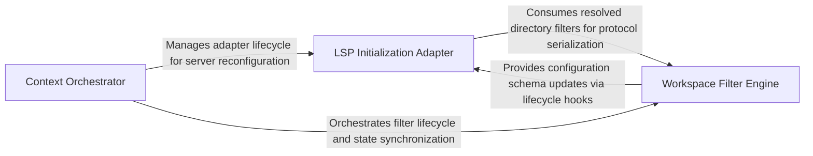

## Details

Translates repository ignore rules into LSP initialization options to prevent indexing of irrelevant or massive directories.

### LSP Initialization Adapter
Translates internal workspace filtering logic into JSON-RPC initialization options for Language Servers, bridging project ignore states with server-side indexing.

**Related Classes/Methods**: _None_

**Source Files:**

- [`repo_utils/ignore.py`](https://github.com/CodeBoarding/CodeBoarding/blob/main/.codeboardingrepo_utils/ignore.py)
  - `repo_utils.ignore.RepoIgnoreManager.__init__` ([L175-L177](https://github.com/CodeBoarding/CodeBoarding/blob/main/.codeboardingrepo_utils/ignore.py#L175-L177)) - Method
  - `repo_utils.ignore.RepoIgnoreManager._load_codeboardingignore_patterns` ([L206-L223](https://github.com/CodeBoarding/CodeBoarding/blob/main/.codeboardingrepo_utils/ignore.py#L206-L223)) - Method

### Workspace Filter Engine
Evaluates the repository file system against ignore patterns, resolving complex exclusion rules into a flat list of directory filters.

**Related Classes/Methods**: _None_

**Source Files:**

- [`repo_utils/ignore.py`](https://github.com/CodeBoarding/CodeBoarding/blob/main/.codeboardingrepo_utils/ignore.py)
  - `repo_utils.ignore.RepoIgnoreManager.reload` ([L179-L191](https://github.com/CodeBoarding/CodeBoarding/blob/main/.codeboardingrepo_utils/ignore.py#L179-L191)) - Method
  - `repo_utils.ignore.RepoIgnoreManager._load_gitignore_patterns` ([L193-L204](https://github.com/CodeBoarding/CodeBoarding/blob/main/.codeboardingrepo_utils/ignore.py#L193-L204)) - Method

### Context Orchestrator
Manages the lifecycle of workspace state and coordinates filter application to ensure consistent scoping across the analysis pipeline.

**Related Classes/Methods**: _None_

**Source Files:**

- [`static_analyzer/engine/adapters/go_adapter.py`](https://github.com/CodeBoarding/CodeBoarding/blob/main/.codeboardingstatic_analyzer/engine/adapters/go_adapter.py)
  - `static_analyzer.engine.adapters.go_adapter._directory_filters_from_ignore_manager` ([L22-L70](https://github.com/CodeBoarding/CodeBoarding/blob/main/.codeboardingstatic_analyzer/engine/adapters/go_adapter.py#L22-L70)) - Function
  - `static_analyzer.engine.adapters.go_adapter.GoAdapter.get_lsp_init_options` ([L153-L180](https://github.com/CodeBoarding/CodeBoarding/blob/main/.codeboardingstatic_analyzer/engine/adapters/go_adapter.py#L153-L180)) - Method

### [FAQ](https://github.com/CodeBoarding/GeneratedOnBoardings/tree/main?tab=readme-ov-file#faq)