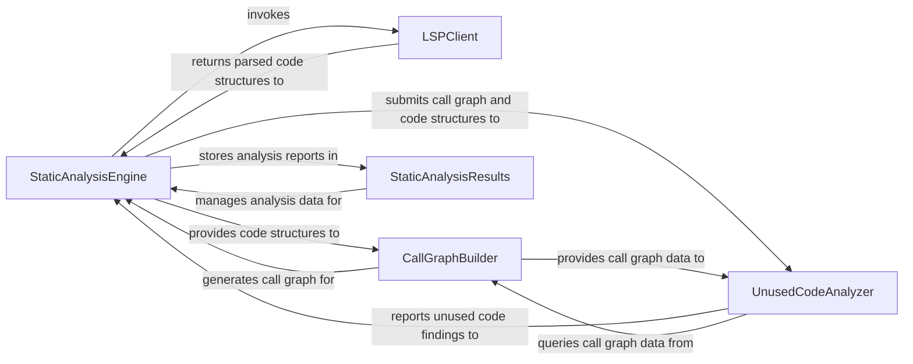

## Details

Performs deep structural and behavioral analysis of the codebase across multiple programming languages. It extracts information like call graphs, code structure, and identifies code quality issues, including unused code.

### StaticAnalysisEngine
Orchestrates the entire static analysis process, coordinating code retrieval, call graph construction, quality checks, and aggregation of findings.

**Related Classes/Methods**:

- <a href="https://github.com/CodeBoarding/CodeBoarding/blob/main/.codeboardingstatic_analyzer/java_config_scanner.py" target="_blank" rel="noopener noreferrer">`repos.codeboarding.static_analysis.StaticAnalysisEngine`</a>

### LSPClient
Communicates with Language Server Protocol servers to extract language‑specific structural information such as ASTs, symbol definitions, and references.

**Related Classes/Methods**:

- <a href="https://github.com/CodeBoarding/CodeBoarding/blob/main/.codeboardingstatic_analyzer/java_config_scanner.py" target="_blank" rel="noopener noreferrer">`repos.codeboarding.static_analysis.LSPClient`</a>

### CallGraphBuilder
Constructs and maintains the call graph of the analyzed codebase by processing structural and semantic information obtained from the LSPClient.

**Related Classes/Methods**:

- <a href="https://github.com/CodeBoarding/CodeBoarding/blob/main/.codeboardingstatic_analyzer/java_config_scanner.py" target="_blank" rel="noopener noreferrer">`repos.codeboarding.static_analysis.CallGraphBuilder`</a>

### UnusedCodeAnalyzer
Identifies and reports code elements that are defined but never invoked or referenced, leveraging the call graph and structural information.

**Related Classes/Methods**:

- <a href="https://github.com/CodeBoarding/CodeBoarding/blob/main/.codeboardingstatic_analyzer/java_config_scanner.py" target="_blank" rel="noopener noreferrer">`repos.codeboarding.static_analysis.UnusedCodeAnalyzer`</a>

### StaticAnalysisResults
Acts as a data repository for all outputs generated during static analysis, storing call graphs, code structures, and analyzer findings.

**Related Classes/Methods**:

- <a href="https://github.com/CodeBoarding/CodeBoarding/blob/main/.codeboardingstatic_analyzer/java_config_scanner.py" target="_blank" rel="noopener noreferrer">`repos.codeboarding.static_analysis.StaticAnalysisResults`</a>

### [FAQ](https://github.com/CodeBoarding/GeneratedOnBoardings/tree/main?tab=readme-ov-file#faq)