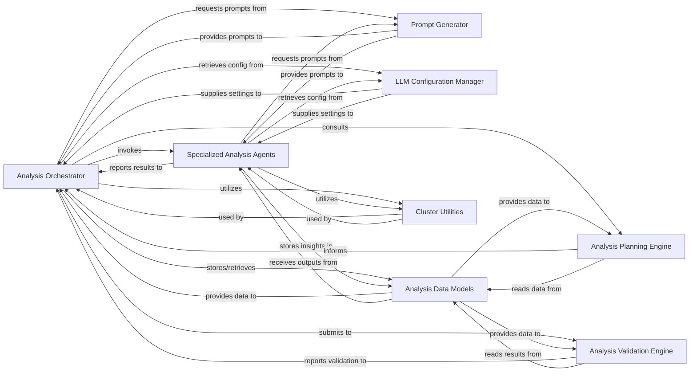

## Details

The intelligent core responsible for driving the code analysis and documentation generation using large language models. It orchestrates agent workflows, manages interactions with various tools, and structures the analysis insights.

### Analysis Orchestrator
Primary coordinator of the entire code analysis and documentation generation workflow, managing operation sequencing, invoking specialized agents, integrating outputs, and overseeing pipeline state.

**Related Classes/Methods**: _None_

### Prompt Generator
Dynamically generates and manages context‑specific prompts for various LLMs and analysis tasks, ensuring precise instructions for effective code interpretation.

**Related Classes/Methods**:

- <a href="https://github.com/CodeBoarding/CodeBoarding/blob/main/.codeboardingagents/prompts/__init__.py" target="_blank" rel="noopener noreferrer">`repos.codeboarding.prompts.PromptGenerator`</a>

### LLM Configuration Manager
Handles configuration, initialization, and management of different LLMs, storing API keys, model names, temperature settings, and provider‑specific parameters.

**Related Classes/Methods**:

- <a href="https://github.com/CodeBoarding/CodeBoarding/blob/main/.codeboardingagents/llm_config.py" target="_blank" rel="noopener noreferrer">`agents.llm_config`</a>

### Specialized Analysis Agents
Collection of distinct agents (Metadata, Abstraction, Details) each focused on a specific phase or type of code analysis, leveraging LLMs to extract domain‑specific insights.

**Related Classes/Methods**:

- <a href="https://github.com/CodeBoarding/CodeBoarding/blob/main/.codeboardingagents/meta_agent.py" target="_blank" rel="noopener noreferrer">`agents.meta_agent`</a>
- <a href="https://github.com/CodeBoarding/CodeBoarding/blob/main/.codeboardingagents/abstraction_agent.py" target="_blank" rel="noopener noreferrer">`agents.abstraction_agent`</a>
- <a href="https://github.com/CodeBoarding/CodeBoarding/blob/main/.codeboardingagents/details_agent.py" target="_blank" rel="noopener noreferrer">`agents.details_agent`</a>

### Analysis Planning Engine
Strategically determines the optimal plan and sequence for the analysis workflow, deciding which code entities need deeper investigation based on current insights and goals.

**Related Classes/Methods**:

- <a href="https://github.com/CodeBoarding/CodeBoarding/blob/main/.codeboardingagents/planner_agent.py" target="_blank" rel="noopener noreferrer">`agents.planner_agent`</a>

### Analysis Data Models
Defines canonical data structures and schemas for representing analysis results, intermediate states, and architectural insights, ensuring consistent data exchange across the subsystem.

**Related Classes/Methods**:

- <a href="https://github.com/CodeBoarding/CodeBoarding/blob/main/.codeboardingagents/agent_responses.py" target="_blank" rel="noopener noreferrer">`repos.codeboarding.models.AnalysisInsights`</a>

### Analysis Validation Engine
Performs comprehensive validation of generated analysis results, checking consistency, completeness, and correctness, including cluster coverage and component relationship integrity.

**Related Classes/Methods**:

- <a href="https://github.com/CodeBoarding/CodeBoarding/blob/main/.codeboardingagents/validation.py" target="_blank" rel="noopener noreferrer">`agents.validation`</a>

### Cluster Utilities
Provides reusable utility functions for manipulating and processing clusters of code entities, supporting assignment, representation building, and data integrity maintenance.

**Related Classes/Methods**:

- <a href="https://github.com/CodeBoarding/CodeBoarding/blob/main/.codeboardingagents/cluster_methods_mixin.py" target="_blank" rel="noopener noreferrer">`agents.cluster_methods_mixin`</a>

### [FAQ](https://github.com/CodeBoarding/GeneratedOnBoardings/tree/main?tab=readme-ov-file#faq)