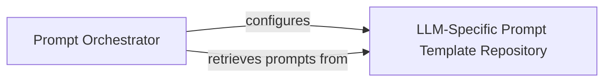

## Details

Dynamically generates and manages context‑specific prompts for various LLMs and analysis tasks, ensuring precise instructions for effective code interpretation.

### Prompt Orchestrator
Dynamically selects and manages LLM‑specific prompt factories, providing a central interface for retrieving tailored prompts for various analysis tasks. It acts as the entry point for the system to obtain the correct prompt based on the target LLM.

**Related Classes/Methods**:

- <a href="https://github.com/CodeBoarding/CodeBoarding/blob/main/.codeboardingagents/prompts/prompt_factory.py" target="_blank" rel="noopener noreferrer">`agents.prompts.prompt_factory.PromptFactory`</a>
- <a href="https://github.com/CodeBoarding/CodeBoarding/blob/main/.codeboardingagents/prompts/prompt_factory.py" target="_blank" rel="noopener noreferrer">`agents.prompts.prompt_factory.LLMType`</a>
- <a href="https://github.com/CodeBoarding/CodeBoarding/blob/main/.codeboardingagents/prompts/prompt_factory.py" target="_blank" rel="noopener noreferrer">`agents.prompts.prompt_factory.PromptFactory._create_prompt_factory`</a>
- <a href="https://github.com/CodeBoarding/CodeBoarding/blob/main/.codeboardingagents/prompts/prompt_factory.py" target="_blank" rel="noopener noreferrer">`agents.prompts.prompt_factory.PromptFactory.get_prompt`</a>
- <a href="https://github.com/CodeBoarding/CodeBoarding/blob/main/.codeboardingagents/prompts/prompt_factory.py" target="_blank" rel="noopener noreferrer">`agents.prompts.prompt_factory.initialize_global_factory`</a>

### LLM‑Specific Prompt Template Repository
Manages a collection of predefined prompt templates, each specifically designed and formatted for different Large Language Models, ensuring optimal interaction and performance. This component encapsulates the actual prompt content and its LLM‑specific structure.

**Related Classes/Methods**:

- <a href="https://github.com/CodeBoarding/CodeBoarding/blob/main/.codeboardingagents/prompts/abstract_prompt_factory.py" target="_blank" rel="noopener noreferrer">`agents.prompts.abstract_prompt_factory.AbstractPromptFactory`</a>
- <a href="https://github.com/CodeBoarding/CodeBoarding/blob/main/.codeboardingagents/prompts/gemini_flash_prompts.py" target="_blank" rel="noopener noreferrer">`agents.prompts.gemini_flash_prompts.GeminiFlashPromptFactory`</a>
- <a href="https://github.com/CodeBoarding/CodeBoarding/blob/main/.codeboardingagents/prompts/gpt_prompts.py" target="_blank" rel="noopener noreferrer">`agents.prompts.gpt_prompts.GPTPromptFactory`</a>
- <a href="https://github.com/CodeBoarding/CodeBoarding/blob/main/.codeboardingagents/prompts/claude_prompts.py" target="_blank" rel="noopener noreferrer">`agents.prompts.claude_prompts.ClaudePromptFactory`</a>
- <a href="https://github.com/CodeBoarding/CodeBoarding/blob/main/.codeboardingagents/prompts/abstract_prompt_factory.py" target="_blank" rel="noopener noreferrer">`agents.prompts.abstract_prompt_factory.AbstractPromptFactory.get_system_message`</a>

### [FAQ](https://github.com/CodeBoarding/GeneratedOnBoardings/tree/main?tab=readme-ov-file#faq)