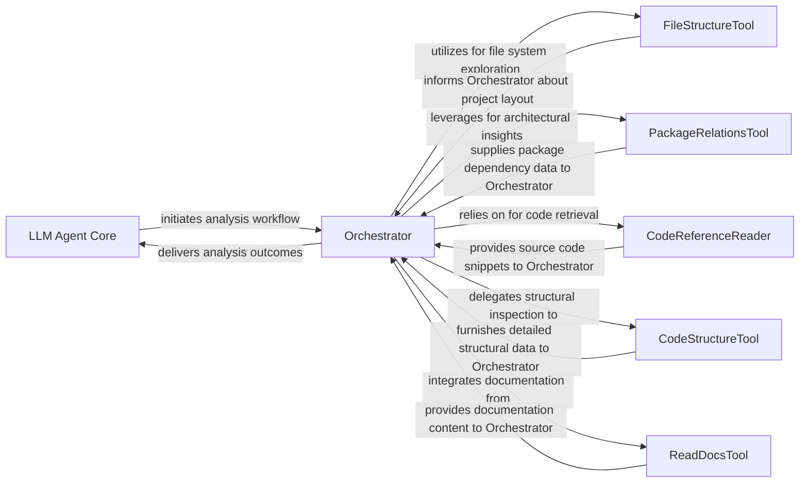

## Details

Allows the LLM Agent Core to access high‑level code structure information, such as class hierarchies, package relationships, and source snippets. It interfaces with the Code Structure Analysis Engine.

### LLM Agent Core
The primary consumer of code structure analysis. It initiates requests for structural information to understand the codebase and inform its decision-making processes.

**Related Classes/Methods**: _None_

### Orchestrator
Manages the workflow of code analysis requests. It determines which tools to invoke, in what sequence, and aggregates their outputs to fulfill the LLM Agent Core's requests.

**Related Classes/Methods**: _None_

### FileStructureTool
Provides a hierarchical tree view of the project's directory structure, respecting specified depth limits and ignore patterns. Essential for initial project exploration and locating relevant files.

**Related Classes/Methods**:

- <a href="https://github.com/CodeBoarding/CodeBoarding/blob/main/.codeboardingagents/tools/read_file_structure.py" target="_blank" rel="noopener noreferrer">`agents.tools.read_file_structure.FileStructureTool._run`</a>

### PackageRelationsTool
Analyzes and presents high-level package-level dependencies, offering an architectural map of the codebase. Provides essential architectural context beyond individual files.

**Related Classes/Methods**:

- <a href="https://github.com/CodeBoarding/CodeBoarding/blob/main/.codeboardingagents/tools/read_packages.py" target="_blank" rel="noopener noreferrer">`agents.tools.read_packages.PackageRelationsTool._run`</a>

### CodeReferenceReader
Resolves fully-qualified code references and retrieves the corresponding source code snippets. Primary mechanism for obtaining raw code for other analysis tools.

**Related Classes/Methods**:

- <a href="https://github.com/CodeBoarding/CodeBoarding/blob/main/.codeboardingagents/tools/read_source.py" target="_blank" rel="noopener noreferrer">`agents.tools.read_source.CodeReferenceReader._run`</a>

### CodeStructureTool
Inspects a given class (identified by its fully-qualified name) and extracts detailed structural information, including inheritance hierarchy, methods, and attributes.

**Related Classes/Methods**:

- <a href="https://github.com/CodeBoarding/CodeBoarding/blob/main/.codeboardingagents/tools/read_structure.py" target="_blank" rel="noopener noreferrer">`agents.tools.read_structure.CodeStructureTool._run`</a>

### ReadDocsTool
Extracts content from documentation files based on supplied paths and line ranges. Supports the LLM by providing human-written context.

**Related Classes/Methods**:

- <a href="https://github.com/CodeBoarding/CodeBoarding/blob/main/.codeboardingagents/tools/read_docs.py" target="_blank" rel="noopener noreferrer">`agents.tools.read_docs.ReadDocsTool._run`</a>

### [FAQ](https://github.com/CodeBoarding/GeneratedOnBoardings/tree/main?tab=readme-ov-file#faq)