```mermaid
graph LR
    Application_Orchestrator["Application Orchestrator"]
    Repository_Manager["Repository Manager"]
    Static_Analysis_Engine["Static Analysis Engine"]
    LLM_Prompt_Factory["LLM Prompt Factory"]
    LLM_Provider_Gateway["LLM Provider Gateway"]
    AI_Interpretation_Layer["AI Interpretation Layer"]
    Output_Generation_Engine["Output Generation Engine"]
    Unclassified["Unclassified"]
    User_External_Systems -- "Initiates Request" --> Application_Orchestrator
    Application_Orchestrator -- "Manages Repository Access" --> Repository_Manager
    Application_Orchestrator -- "Triggers Analysis" --> AI_Interpretation_Layer
    Application_Orchestrator -- "Coordinates Documentation Generation" --> Output_Generation_Engine
    Repository_Manager -- "Provides Source Code" --> Static_Analysis_Engine
    Static_Analysis_Engine -- "Delivers Analysis Data" --> AI_Interpretation_Layer
    AI_Interpretation_Layer -- "Requests Formatted Prompts" --> LLM_Prompt_Factory
    LLM_Prompt_Factory -- "Returns Formatted Prompts" --> AI_Interpretation_Layer
    AI_Interpretation_Layer -- "Sends LLM Queries" --> LLM_Provider_Gateway
    LLM_Provider_Gateway -- "Returns LLM Responses" --> AI_Interpretation_Layer
    AI_Interpretation_Layer -- "Provides Architectural Insights" --> Output_Generation_Engine
    Output_Generation_Engine -- "Delivers Documentation & Diagrams" --> User_External_Systems
    click Application_Orchestrator href "https://github.com/CodeBoarding/CodeBoarding/blob/main/.codeboarding/Application_Orchestrator.md" "Details"
    click Repository_Manager href "https://github.com/CodeBoarding/CodeBoarding/blob/main/.codeboarding/Repository_Manager.md" "Details"
    click Static_Analysis_Engine href "https://github.com/CodeBoarding/CodeBoarding/blob/main/.codeboarding/Static_Analysis_Engine.md" "Details"
    click LLM_Prompt_Factory href "https://github.com/CodeBoarding/CodeBoarding/blob/main/.codeboarding/LLM_Prompt_Factory.md" "Details"
    click LLM_Provider_Gateway href "https://github.com/CodeBoarding/CodeBoarding/blob/main/.codeboarding/LLM_Provider_Gateway.md" "Details"
    click AI_Interpretation_Layer href "https://github.com/CodeBoarding/CodeBoarding/blob/main/.codeboarding/AI_Interpretation_Layer.md" "Details"
    click Output_Generation_Engine href "https://github.com/CodeBoarding/CodeBoarding/blob/main/.codeboarding/Output_Generation_Engine.md" "Details"
```

## Details

The system operates with the Application Orchestrator as its central control, initiated by User/External Systems. This orchestrator first interacts with the Repository Manager to access the target codebase. The core intelligence resides within the AI Interpretation Layer, which is triggered by the orchestrator to perform architectural analysis. This layer leverages the Static Analysis Engine for structural code data and dynamically generates prompts via the LLM Prompt Factory before querying external LLM Provider Gateway for insights. Once architectural insights are derived, the Output Generation Engine transforms these into consumable documentation and diagrams, which are then delivered back to User/External Systems. The orchestrator also directly coordinates with the Output Generation Engine for the final documentation output.

### Application Orchestrator [[Expand]](./Application_Orchestrator.md)
The central control unit that manages the overall execution flow, handling repository input, orchestrating analysis, and coordinating documentation generation. It serves as the main entry point for the application.

**Related Classes/Methods**:

- <a href="https://github.com/CodeBoarding/CodeBoarding/blob/main/.codeboardingmain.py" target="_blank" rel="noopener noreferrer">`main.py`</a>

### Repository Manager [[Expand]](./Repository_Manager.md)
Manages all interactions with code repositories, including cloning, reading files, and navigating the project structure. It provides the raw source code for analysis.

**Related Classes/Methods**:

- <a href="https://github.com/CodeBoarding/CodeBoarding/blob/main/.codeboardingrepo_utils/__init__.py" target="_blank" rel="noopener noreferrer">`repo_utils/__init__.py`</a>
- <a href="https://github.com/CodeBoarding/CodeBoarding/blob/main/.codeboardingrepo_utils/git_diff.py" target="_blank" rel="noopener noreferrer">`repo_utils/git_diff.py`</a>

### Static Analysis Engine [[Expand]](./Static_Analysis_Engine.md)
Performs in-depth static analysis on the codebase to extract structural information, control flow graphs (CFG), abstract syntax trees (AST), and dependencies.

**Related Classes/Methods**:

- <a href="https://github.com/CodeBoarding/CodeBoarding/blob/main/.codeboardingstatic_analyzer/__init__.py" target="_blank" rel="noopener noreferrer">`static_analyzer/__init__.py`</a>
- <a href="https://github.com/CodeBoarding/CodeBoarding/blob/main/.codeboardingstatic_analyzer/scanner.py" target="_blank" rel="noopener noreferrer">`static_analyzer/scanner.py`</a>
- <a href="https://github.com/CodeBoarding/CodeBoarding/blob/main/.codeboardingstatic_analyzer/graph.py" target="_blank" rel="noopener noreferrer">`static_analyzer/graph.py`</a>

### LLM Prompt Factory [[Expand]](./LLM_Prompt_Factory.md)
Dynamically generates and formats prompts tailored for various Large Language Models (LLMs) and specific analysis tasks.

**Related Classes/Methods**:

- <a href="https://github.com/CodeBoarding/CodeBoarding/blob/main/.codeboardingagents/prompts/__init__.py" target="_blank" rel="noopener noreferrer">`agents/prompts/__init__.py`</a>
- <a href="https://github.com/CodeBoarding/CodeBoarding/blob/main/.codeboardingagents/prompts/prompt_factory.py" target="_blank" rel="noopener noreferrer">`agents/prompts/prompt_factory.py`</a>
- <a href="https://github.com/CodeBoarding/CodeBoarding/blob/main/.codeboardingagents/prompts/abstract_prompt_factory.py" target="_blank" rel="noopener noreferrer">`agents/prompts/abstract_prompt_factory.py`</a>

### LLM Provider Gateway [[Expand]](./LLM_Provider_Gateway.md)
Manages communication and interaction with external Large Language Model (LLM) providers, handling API calls and model selection.

**Related Classes/Methods**:

- <a href="https://github.com/CodeBoarding/CodeBoarding/blob/main/.codeboardingagents/prompts/claude_prompts_bidirectional.py" target="_blank" rel="noopener noreferrer">`agents/prompts/claude_prompts_bidirectional.py`</a>
- <a href="https://github.com/CodeBoarding/CodeBoarding/blob/main/.codeboardingagents/prompts/gpt_prompts_unidirectional.py" target="_blank" rel="noopener noreferrer">`agents/prompts/gpt_prompts_unidirectional.py`</a>
- <a href="https://github.com/CodeBoarding/CodeBoarding/blob/main/.codeboardingagents/prompts/gemini_flash_prompts_bidirectional.py" target="_blank" rel="noopener noreferrer">`agents/prompts/gemini_flash_prompts_bidirectional.py`</a>

### AI Interpretation Layer [[Expand]](./AI_Interpretation_Layer.md)
The core intelligence component that orchestrates AI-driven analysis, interprets LLM responses, and derives architectural insights. This layer utilizes various agents to perform its tasks, with agents/agent.py being central to its logic.

**Related Classes/Methods**:

- <a href="https://github.com/CodeBoarding/CodeBoarding/blob/main/.codeboardingagents/__init__.py" target="_blank" rel="noopener noreferrer">`agents/__init__.py`</a>
- <a href="https://github.com/CodeBoarding/CodeBoarding/blob/main/.codeboardingagents/agent.py" target="_blank" rel="noopener noreferrer">`agents/agent.py`</a>
- <a href="https://github.com/CodeBoarding/CodeBoarding/blob/main/.codeboardingagents/meta_agent.py" target="_blank" rel="noopener noreferrer">`agents/meta_agent.py`</a>
- <a href="https://github.com/CodeBoarding/CodeBoarding/blob/main/.codeboardingagents/abstraction_agent.py" target="_blank" rel="noopener noreferrer">`agents/abstraction_agent.py`</a>
- <a href="https://github.com/CodeBoarding/CodeBoarding/blob/main/.codeboardingagents/details_agent.py" target="_blank" rel="noopener noreferrer">`agents/details_agent.py`</a>
- <a href="https://github.com/CodeBoarding/CodeBoarding/blob/main/.codeboardingagents/planner_agent.py" target="_blank" rel="noopener noreferrer">`agents/planner_agent.py`</a>
- <a href="https://github.com/CodeBoarding/CodeBoarding/blob/main/.codeboardingagents/validator_agent.py" target="_blank" rel="noopener noreferrer">`agents/validator_agent.py`</a>

### Output Generation Engine [[Expand]](./Output_Generation_Engine.md)
Transforms architectural insights into various consumable formats, including human-readable documentation and visual diagrams.

**Related Classes/Methods**:

- <a href="https://github.com/CodeBoarding/CodeBoarding/blob/main/.codeboardingoutput_generators/__init__.py" target="_blank" rel="noopener noreferrer">`output_generators/__init__.py`</a>
- <a href="https://github.com/CodeBoarding/CodeBoarding/blob/main/.codeboardingoutput_generators/markdown.py" target="_blank" rel="noopener noreferrer">`output_generators/markdown.py`</a>
- <a href="https://github.com/CodeBoarding/CodeBoarding/blob/main/.codeboardingoutput_generators/html.py" target="_blank" rel="noopener noreferrer">`output_generators/html.py`</a>
- <a href="https://github.com/CodeBoarding/CodeBoarding/blob/main/.codeboardingdiagram_analysis/__init__.py" target="_blank" rel="noopener noreferrer">`diagram_analysis/__init__.py`</a>
- <a href="https://github.com/CodeBoarding/CodeBoarding/blob/main/.codeboardingdiagram_analysis/diagram_generator.py" target="_blank" rel="noopener noreferrer">`diagram_analysis/diagram_generator.py`</a>

### Unclassified
Component for all unclassified files and utility functions (Utility functions/External Libraries/Dependencies)

**Related Classes/Methods**: _None_

### [FAQ](https://github.com/CodeBoarding/GeneratedOnBoardings/tree/main?tab=readme-ov-file#faq)
