```mermaid
graph LR
    Application_Orchestrator_Repository_Manager["Application Orchestrator & Repository Manager"]
    LLM_Agent_Core["LLM Agent Core"]
    Static_Code_Analyzer["Static Code Analyzer"]
    Agent_Tooling_Interface["Agent Tooling Interface"]
    Incremental_Analysis_Engine["Incremental Analysis Engine"]
    Documentation_Diagram_Generator["Documentation & Diagram Generator"]
    Application_Orchestrator_Repository_Manager -- "Orchestrator initiates analysis workflow, leveraging incremental updates based on detected code changes." --> Incremental_Analysis_Engine
    Application_Orchestrator_Repository_Manager -- "Orchestrator passes project context and triggers the main analysis workflow for the LLM Agent." --> LLM_Agent_Core
    Incremental_Analysis_Engine -- "Incremental engine requests static analysis for specific code segments (new or changed)." --> Static_Code_Analyzer
    Static_Code_Analyzer -- "Static analyzer provides analysis results to the incremental engine for caching." --> Incremental_Analysis_Engine
    LLM_Agent_Core -- "LLM Agent invokes specialized tools to interact with the codebase and analysis data." --> Agent_Tooling_Interface
    Agent_Tooling_Interface -- "Agent tools query the static analysis engine for detailed code insights." --> Static_Code_Analyzer
    Static_Code_Analyzer -- "Static analysis engine provides requested data to the agent tools." --> Agent_Tooling_Interface
    LLM_Agent_Core -- "LLM Agent delivers structured analysis insights for documentation and diagram generation." --> Documentation_Diagram_Generator
    click Application_Orchestrator_Repository_Manager href "https://github.com/CodeBoarding/CodeBoarding/blob/main/.codeboarding/Application_Orchestrator_Repository_Manager.md" "Details"
    click LLM_Agent_Core href "https://github.com/CodeBoarding/CodeBoarding/blob/main/.codeboarding/LLM_Agent_Core.md" "Details"
    click Static_Code_Analyzer href "https://github.com/CodeBoarding/CodeBoarding/blob/main/.codeboarding/Static_Code_Analyzer.md" "Details"
    click Agent_Tooling_Interface href "https://github.com/CodeBoarding/CodeBoarding/blob/main/.codeboarding/Agent_Tooling_Interface.md" "Details"
    click Incremental_Analysis_Engine href "https://github.com/CodeBoarding/CodeBoarding/blob/main/.codeboarding/Incremental_Analysis_Engine.md" "Details"
    click Documentation_Diagram_Generator href "https://github.com/CodeBoarding/CodeBoarding/blob/main/.codeboarding/Documentation_Diagram_Generator.md" "Details"
```

## Details

The CodeBoarding system orchestrates a comprehensive code analysis and documentation generation workflow. It begins with the Application Orchestrator & Repository Manager initializing projects, managing code repositories, and detecting changes. This orchestrator leverages the Incremental Analysis Engine to optimize performance by caching and re-analyzing only modified code. The core intelligence resides in the LLM Agent Core, which uses large language models to interpret code and analysis results. The agent interacts with the codebase and static analysis data through the Agent Tooling Interface, which in turn queries the Static Code Analyzer for deep structural and behavioral insights. Finally, the LLM Agent's findings are passed to the Documentation & Diagram Generator to produce user-friendly documentation and visual architectural diagrams.

### Application Orchestrator & Repository Manager [[Expand]](./Application_Orchestrator_Repository_Manager.md)
Manages the overall application lifecycle, including project initialization, repository operations (cloning, updating), change detection, and orchestrating the analysis workflow. It also handles the initial setup and environment configuration for the analysis tools.

**Related Classes/Methods**:

- `repos.codeboarding.main.main`
- `repos.codeboarding.repository.RepositoryManager`
- `repos.codeboarding.repository.ChangeDetector`

### LLM Agent Core [[Expand]](./LLM_Agent_Core.md)
The intelligent core responsible for driving the code analysis and documentation generation using large language models. It orchestrates agent workflows, manages interactions with various tools, and structures the analysis insights.

**Related Classes/Methods**:

- `repos.codeboarding.agent.CodeBoardingAgent`
- `repos.codeboarding.prompts.PromptGenerator`
- `repos.codeboarding.models.AnalysisInsights`

### Static Code Analyzer [[Expand]](./Static_Code_Analyzer.md)
Performs deep structural and behavioral analysis of the codebase across multiple programming languages. It extracts information like call graphs, code structure, and identifies code quality issues, including unused code.

**Related Classes/Methods**:

- `repos.codeboarding.static_analysis.LSPClient`
- `repos.codeboarding.static_analysis.CallGraphBuilder`
- `repos.codeboarding.static_analysis.StaticAnalysisResults`
- `repos.codeboarding.static_analysis.UnusedCodeAnalyzer`

### Agent Tooling Interface [[Expand]](./Agent_Tooling_Interface.md)
Provides a set of specialized tools that allow the LLM Agent Core to interact with the codebase, query static analysis results, and perform specific actions within the project context.

**Related Classes/Methods**:

- `repos.codeboarding.tools.ReadFileTool`
- `repos.codeboarding.tools.GetCFGTool`
- `repos.codeboarding.tools.CodeStructureTool`

### Incremental Analysis Engine [[Expand]](./Incremental_Analysis_Engine.md)
Optimizes analysis performance by managing the caching of static analysis results and orchestrating re-analysis only for changed parts of the codebase, ensuring efficiency and speed.

**Related Classes/Methods**:

- `repos.codeboarding.incremental.IncrementalUpdater`
- `repos.codeboarding.incremental.AnalysisCache`
- `repos.codeboarding.incremental.ClusterChangeAnalyzer`

### Documentation & Diagram Generator [[Expand]](./Documentation_Diagram_Generator.md)
Transforms the processed analysis data and insights into user-friendly documentation formats (e.g., Markdown, HTML) and generates visual representations like architectural diagrams.

**Related Classes/Methods**:

- `repos.codeboarding.output.DiagramGenerator`
- `repos.codeboarding.output.MarkdownOutputGenerator`

### [FAQ](https://github.com/CodeBoarding/GeneratedOnBoardings/tree/main?tab=readme-ov-file#faq)