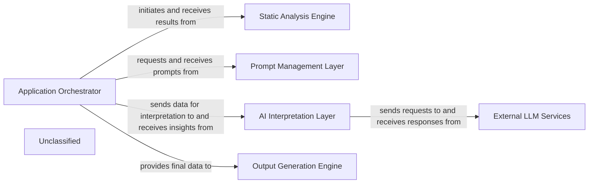

## Details

The CodeBoarding project is an AI-driven code analysis and documentation system. The Application Orchestrator manages the overall workflow, initiating static code analysis, generating prompts, and coordinating AI interpretation. The Static Analysis Engine provides code insights, which the AI Interpretation Layer processes using External LLM Services. The Prompt Management Layer optimizes LLM interactions, and the Output Generation Engine creates documentation and diagrams from the processed insights. This modular design ensures efficient processing and flexible integration with various AI models.

### Application Orchestrator [[Expand]](./Application_Orchestrator.md)
The central control unit managing the entire workflow, from initiating analysis to integrating results and coordinating output generation.

**Related Classes/Methods**:

- <a href="https://github.com/CodeBoarding/CodeBoarding/blob/main/.codeboardingagents/planner_agent.py" target="_blank" rel="noopener noreferrer">`agents.planner_agent`</a>
- <a href="https://github.com/CodeBoarding/CodeBoarding/blob/main/.codeboardingagents/agent.py" target="_blank" rel="noopener noreferrer">`agents.agent`</a>

### Static Analysis Engine [[Expand]](./Static_Analysis_Engine.md)
Performs in-depth static code analysis across multiple languages, extracting structural and semantic information.

**Related Classes/Methods**:

- <a href="https://github.com/CodeBoarding/CodeBoarding/blob/main/.codeboardingstatic_analyzer/scanner.py" target="_blank" rel="noopener noreferrer">`static_analyzer.scanner`</a>
- <a href="https://github.com/CodeBoarding/CodeBoarding/blob/main/.codeboardingstatic_analyzer/lsp_client/client.py" target="_blank" rel="noopener noreferrer">`static_analyzer.lsp_client.client`</a>

### Prompt Management Layer [[Expand]](./Prompt_Management_Layer.md)
Dynamically creates, selects, and contextualizes prompts for various LLMs based on the analysis phase.

**Related Classes/Methods**:

- <a href="https://github.com/CodeBoarding/CodeBoarding/blob/main/.codeboardingagents/prompts/prompt_factory.py" target="_blank" rel="noopener noreferrer">`agents.prompts.prompt_factory`</a>
- <a href="https://github.com/CodeBoarding/CodeBoarding/blob/main/.codeboardingagents/prompts/abstract_prompt_factory.py" target="_blank" rel="noopener noreferrer">`agents.prompts.abstract_prompt_factory`</a>
- <a href="https://github.com/CodeBoarding/CodeBoarding/blob/main/.codeboardingagents/prompts/claude_prompts_bidirectional.py" target="_blank" rel="noopener noreferrer">`agents.prompts.claude_prompts_bidirectional`</a>

### AI Interpretation Layer [[Expand]](./AI_Interpretation_Layer.md)
Interprets static analysis results using LLMs, processing responses to extract insights, classifications, and explanations.

**Related Classes/Methods**:

- <a href="https://github.com/CodeBoarding/CodeBoarding/blob/main/.codeboardingagents/abstraction_agent.py" target="_blank" rel="noopener noreferrer">`agents.abstraction_agent`</a>
- <a href="https://github.com/CodeBoarding/CodeBoarding/blob/main/.codeboardingagents/details_agent.py" target="_blank" rel="noopener noreferrer">`agents.details_agent`</a>
- <a href="https://github.com/CodeBoarding/CodeBoarding/blob/main/.codeboardingagents/meta_agent.py" target="_blank" rel="noopener noreferrer">`agents.meta_agent`</a>
- <a href="https://github.com/CodeBoarding/CodeBoarding/blob/main/.codeboardingagents/validator_agent.py" target="_blank" rel="noopener noreferrer">`agents.validator_agent`</a>

### Output Generation Engine [[Expand]](./Output_Generation_Engine.md)
Transforms interpreted analysis results into human-readable documentation and visual diagrams.

**Related Classes/Methods**:

- <a href="https://github.com/CodeBoarding/CodeBoarding/blob/main/.codeboardingoutput_generators/markdown.py" target="_blank" rel="noopener noreferrer">`output_generators.markdown`</a>
- <a href="https://github.com/CodeBoarding/CodeBoarding/blob/main/.codeboardingoutput_generators/html.py" target="_blank" rel="noopener noreferrer">`output_generators.html`</a>
- <a href="https://github.com/CodeBoarding/CodeBoarding/blob/main/.codeboardingdiagram_analysis/diagram_generator.py" target="_blank" rel="noopener noreferrer">`diagram_analysis.diagram_generator`</a>

### External LLM Services [[Expand]](./External_LLM_Services.md)
Represents the various third-party Large Language Model services (e.g., OpenAI, Anthropic, Google Gemini) integrated with the system.

**Related Classes/Methods**:

- `ExternalLLMServiceAPI`

### Unclassified
Component for all unclassified files and utility functions (Utility functions/External Libraries/Dependencies)

**Related Classes/Methods**: _None_

### [FAQ](https://github.com/CodeBoarding/GeneratedOnBoardings/tree/main?tab=readme-ov-file#faq)
