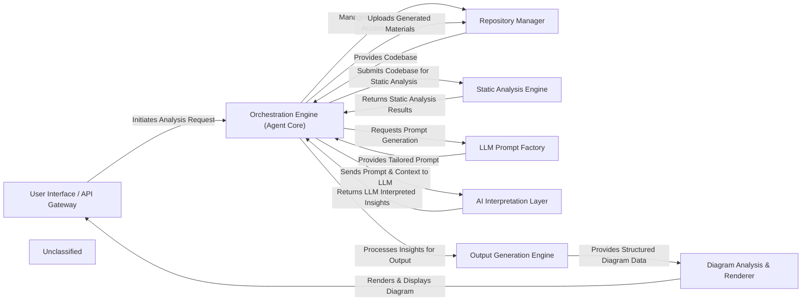

## Details

The system operates with a clear separation of concerns, orchestrated by the `Orchestration Engine (Agent Core)`. User requests are handled by the `User Interface / API Gateway`, which then directs the `Orchestration Engine` to initiate the analysis. The `Orchestration Engine` interacts with the `Repository Manager` to fetch and manage codebases, including cloning, checking out branches, and handling temporary folders. The fetched code is then passed to the `Static Analysis Engine` for structural analysis. Prompts for AI interpretation are generated by the `LLM Prompt Factory` and sent to the `AI Interpretation Layer` along with analysis context. The interpreted insights are then processed by the `Output Generation Engine` to create structured data, which the `Diagram Analysis & Renderer` uses to generate and display visual architectural diagrams. The `Repository Manager` also facilitates the uploading of generated onboarding materials back to the repositories.

### User Interface / API Gateway [[Expand]](./User_Interface_API_Gateway.md)
The system's primary interface for users, handling analysis requests and displaying results, with expanded integration for VS Code.

**Related Classes/Methods**:

- <a href="https://github.com/CodeBoarding/CodeBoarding/blob/main/.codeboardinglocal_app.py" target="_blank" rel="noopener noreferrer">`local_app.app`</a>

### Orchestration Engine (Agent Core) [[Expand]](./Orchestration_Engine_Agent_Core_.md)
The central control unit, dynamically managing the entire analysis workflow. It coordinates all components, maintains a sophisticated analysis state, and leverages refined internal logic to orchestrate enhanced capabilities and the overall analysis process.

**Related Classes/Methods**:

- <a href="https://github.com/CodeBoarding/CodeBoarding/blob/main/.codeboardingagents/agent.py" target="_blank" rel="noopener noreferrer">`agents.agent.CodeBoardingAgent`</a>

### Repository Manager [[Expand]](./Repository_Manager.md)
Manages all interactions with code repositories, providing a standardized interface for source code access, temporary folder management, cloning, branch management, and uploading generated content.

**Related Classes/Methods**:

- <a href="https://github.com/CodeBoarding/CodeBoarding/blob/main/.codeboardingrepo_utils/__init__.py" target="_blank" rel="noopener noreferrer">`repo_utils.clone_repository`</a>
- <a href="https://github.com/CodeBoarding/CodeBoarding/blob/main/.codeboardingrepo_utils/__init__.py" target="_blank" rel="noopener noreferrer">`repo_utils.checkout_repo`</a>
- <a href="https://github.com/CodeBoarding/CodeBoarding/blob/main/.codeboardingrepo_utils/__init__.py" target="_blank" rel="noopener noreferrer">`repo_utils.upload_onboarding_materials`</a>
- <a href="https://github.com/CodeBoarding/CodeBoarding/blob/main/.codeboardingutils.py" target="_blank" rel="noopener noreferrer">`utils.create_temp_repo_folder`</a>
- <a href="https://github.com/CodeBoarding/CodeBoarding/blob/main/.codeboardingutils.py" target="_blank" rel="noopener noreferrer">`utils.remove_temp_repo_folder`</a>

### Static Analysis Engine [[Expand]](./Static_Analysis_Engine.md)
Performs in-depth static analysis on source code to extract structural information like CFGs and ASTs, now with significantly enhanced programming language support, more robust scanning mechanisms, and improved interaction with Language Server Protocols (LSP).

**Related Classes/Methods**:

- <a href="https://github.com/CodeBoarding/CodeBoarding/blob/main/.codeboardingstatic_analyzer/scanner.py" target="_blank" rel="noopener noreferrer">`static_analyzer.scanner.Scanner`</a>

### LLM Prompt Factory [[Expand]](./LLM_Prompt_Factory.md)
Dynamically generates and manages prompts tailored for various LLMs and code analysis tasks.

**Related Classes/Methods**:

- <a href="https://github.com/CodeBoarding/CodeBoarding/blob/main/.codeboardingagents/prompts/prompt_factory.py" target="_blank" rel="noopener noreferrer">`agents.prompts.prompt_factory.PromptFactory`</a>

### AI Interpretation Layer [[Expand]](./AI_Interpretation_Layer.md)
Interfaces with LLM providers to process analysis results and prompts, interpreting code context and generating architectural insights with more sophisticated logic for processing analysis results and prompts.

**Related Classes/Methods**:

- <a href="https://github.com/CodeBoarding/CodeBoarding/blob/main/.codeboardingagents/abstraction_agent.py" target="_blank" rel="noopener noreferrer">`agents.abstraction_agent.AbstractionAgent`</a>
- <a href="https://github.com/CodeBoarding/CodeBoarding/blob/main/.codeboardingagents/details_agent.py" target="_blank" rel="noopener noreferrer">`agents.details_agent.DetailsAgent`</a>

### Output Generation Engine [[Expand]](./Output_Generation_Engine.md)
Transforms AI-interpreted insights into structured output formats for diagram generation and documentation.

**Related Classes/Methods**:

- <a href="https://github.com/CodeBoarding/CodeBoarding/blob/main/.codeboardingoutput_generators/markdown.py" target="_blank" rel="noopener noreferrer">`output_generators.markdown.MarkdownGenerator`</a>
- <a href="https://github.com/CodeBoarding/CodeBoarding/blob/main/.codeboardingoutput_generators/html.py" target="_blank" rel="noopener noreferrer">`output_generators.html.HTMLGenerator`</a>

### Diagram Analysis & Renderer [[Expand]](./Diagram_Analysis_Renderer.md)
Refines structured output into diagram-specific formats and renders visual architectural diagrams, with enhanced capabilities for transforming AI-interpreted insights and rendering.

**Related Classes/Methods**:

- <a href="https://github.com/CodeBoarding/CodeBoarding/blob/main/.codeboardingdiagram_analysis/diagram_generator.py" target="_blank" rel="noopener noreferrer">`diagram_analysis.diagram_generator.DiagramGenerator`</a>

### Unclassified
Component for all unclassified files and utility functions (Utility functions/External Libraries/Dependencies)

**Related Classes/Methods**: _None_

### [FAQ](https://github.com/CodeBoarding/GeneratedOnBoardings/tree/main?tab=readme-ov-file#faq)
