```mermaid
graph LR
    Repository_Manager["Repository Manager"]
    Static_Analysis_Engine["Static Analysis Engine"]
    LLM_Prompt_Factory["LLM Prompt Factory"]
    AI_Interpretation_Layer["AI Interpretation Layer"]
    LLM_Provider_Gateway["LLM Provider Gateway"]
    Diagram_Generation_Engine["Diagram Generation Engine"]
    Documentation_Report_Generator["Documentation & Report Generator"]
    Unclassified["Unclassified"]
    Repository_Manager -- "Provides Source Code" --> Static_Analysis_Engine
    Static_Analysis_Engine -- "Outputs CFG Data & Metrics" --> AI_Interpretation_Layer
    AI_Interpretation_Layer -- "Requests Prompts" --> LLM_Prompt_Factory
    LLM_Prompt_Factory -- "Supplies LLM Prompts" --> AI_Interpretation_Layer
    AI_Interpretation_Layer -- "Sends LLM Queries" --> LLM_Provider_Gateway
    LLM_Provider_Gateway -- "Returns LLM Responses" --> AI_Interpretation_Layer
    AI_Interpretation_Layer -- "Generates Architectural Insights" --> Diagram_Generation_Engine
    AI_Interpretation_Layer -- "Produces Analysis Results" --> Documentation_Report_Generator
    Diagram_Generation_Engine -- "Embeds Diagrams" --> Documentation_Report_Generator
    click Repository_Manager href "https://github.com/CodeBoarding/CodeBoarding/blob/main/.codeboarding/Repository_Manager.md" "Details"
    click Static_Analysis_Engine href "https://github.com/CodeBoarding/CodeBoarding/blob/main/.codeboarding/Static_Analysis_Engine.md" "Details"
    click LLM_Prompt_Factory href "https://github.com/CodeBoarding/CodeBoarding/blob/main/.codeboarding/LLM_Prompt_Factory.md" "Details"
    click AI_Interpretation_Layer href "https://github.com/CodeBoarding/CodeBoarding/blob/main/.codeboarding/AI_Interpretation_Layer.md" "Details"
    click LLM_Provider_Gateway href "https://github.com/CodeBoarding/CodeBoarding/blob/main/.codeboarding/LLM_Provider_Gateway.md" "Details"
    click Diagram_Generation_Engine href "https://github.com/CodeBoarding/CodeBoarding/blob/main/.codeboarding/Diagram_Generation_Engine.md" "Details"
    click Documentation_Report_Generator href "https://github.com/CodeBoarding/CodeBoarding/blob/main/.codeboarding/Documentation_Report_Generator.md" "Details"
```

## Details

The CodeBoarding project is structured around a core `AI Interpretation Layer` that orchestrates the analysis of software repositories. This layer initiates the process by interacting with the `Repository Manager` to obtain source code. The retrieved code is then fed into the `Static Analysis Engine`, which extracts crucial structural information and Control Flow Graphs (CFGs). The `AI Interpretation Layer` leverages these static analysis results and dynamically generates prompts through the `LLM Prompt Factory` to query various Large Language Models via the `LLM Provider Gateway`. The insights derived from these LLM interactions are then passed to the `Diagram Generation Engine` for visual representation and to the `Documentation & Report Generator` for comprehensive textual outputs. This modular design ensures clear separation of concerns, facilitating maintainability and extensibility, and provides a robust framework for automated software architecture analysis and documentation.

### Repository Manager [[Expand]](./Repository_Manager.md)
Manages access to source code repositories, including fetching, cloning, and organizing project files for analysis.

**Related Classes/Methods**:

- <a href="https://github.com/CodeBoarding/CodeBoarding/blob/main/.codeboardingrepo_utils/__init__.py" target="_blank" rel="noopener noreferrer">`repo_utils.__init__.clone_repository`</a>

### Static Analysis Engine [[Expand]](./Static_Analysis_Engine.md)
Performs static analysis on the retrieved source code to extract structural information, control flow graphs (CFGs), and other code metrics.

**Related Classes/Methods**:

- <a href="https://github.com/CodeBoarding/CodeBoarding/blob/main/.codeboardingstatic_analyzer/scanner.py" target="_blank" rel="noopener noreferrer">`static_analyzer.scanner.ProjectScanner`</a>

### LLM Prompt Factory [[Expand]](./LLM_Prompt_Factory.md)
Centralized component for generating and managing LLM prompts, adapting to different LLM providers and specific analysis contexts.

**Related Classes/Methods**:

- <a href="https://github.com/CodeBoarding/CodeBoarding/blob/main/.codeboardingagents/prompts/abstract_prompt_factory.py" target="_blank" rel="noopener noreferrer">`agents.prompts.abstract_prompt_factory.AbstractPromptFactory`</a>

### AI Interpretation Layer [[Expand]](./AI_Interpretation_Layer.md)
The core intelligence layer that orchestrates the analysis workflow, interprets static analysis results, and interacts with LLMs to derive architectural insights.

**Related Classes/Methods**:

- <a href="https://github.com/CodeBoarding/CodeBoarding/blob/main/.codeboardingagents/agent.py" target="_blank" rel="noopener noreferrer">`agents.agent.CodeBoardingAgent`</a>

### LLM Provider Gateway [[Expand]](./LLM_Provider_Gateway.md)
Provides a unified interface for interacting with various Large Language Model providers, handling API calls, authentication, and response parsing.

**Related Classes/Methods**:

- <a href="https://github.com/CodeBoarding/CodeBoarding/blob/main/.codeboardingagents/agent.py" target="_blank" rel="noopener noreferrer">`agents.agent.CodeBoardingAgent._initialize_llm`</a>

### Diagram Generation Engine [[Expand]](./Diagram_Generation_Engine.md)
Transforms interpreted architectural insights and data flow information into visual diagrams, primarily using tools like Mermaid.js.

**Related Classes/Methods**:

- <a href="https://github.com/CodeBoarding/CodeBoarding/blob/main/.codeboardingdiagram_analysis/diagram_generator.py" target="_blank" rel="noopener noreferrer">`diagram_analysis.diagram_generator.DiagramGenerator`</a>

### Documentation & Report Generator [[Expand]](./Documentation_Report_Generator.md)
Generates comprehensive documentation and reports based on the AI's analysis, including textual summaries, structured data, and embedded diagrams.

**Related Classes/Methods**:

- <a href="https://github.com/CodeBoarding/CodeBoarding/blob/main/.codeboardingoutput_generators/markdown.py" target="_blank" rel="noopener noreferrer">`output_generators.markdown`</a>

### Unclassified
Component for all unclassified files and utility functions (Utility functions/External Libraries/Dependencies)

**Related Classes/Methods**: _None_

### [FAQ](https://github.com/CodeBoarding/GeneratedOnBoardings/tree/main?tab=readme-ov-file#faq)
