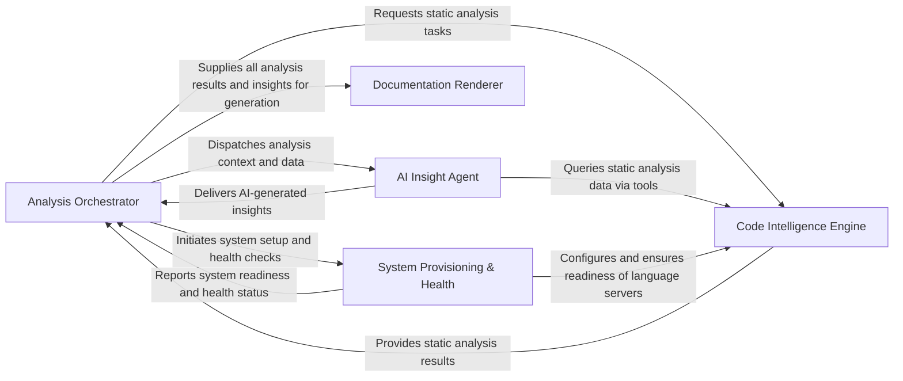

## Details

The `CodeBoarding` project operates as a sophisticated code analysis and documentation generation pipeline. The `Analysis Orchestrator` acts as the central control, initiating the process, managing repository changes, and coordinating tasks across other components. It first interacts with the `System Provisioning & Health` component to ensure the environment, including language servers, is correctly set up. Subsequently, it dispatches code analysis requests to the `Code Intelligence Engine`, which performs deep static analysis and returns structured results. These results, along with additional context, are then provided to the `AI Insight Agent` for intelligent interpretation and insight generation. The `AI Insight Agent` can also directly query the `Code Intelligence Engine` for specific code details. Finally, the `Analysis Orchestrator` aggregates all analysis data and AI-generated insights, passing them to the `Documentation Renderer` to produce various human-readable documentation formats.

### Analysis Orchestrator [[Expand]](./Analysis_Orchestrator.md)
This component serves as the central control plane, managing the entire analysis workflow from project initialization and repository change detection to orchestrating static analysis, AI-driven insights, and output generation. It handles job execution, incremental updates, and collects monitoring metrics.

**Related Classes/Methods**:

- <a href="https://github.com/CodeBoarding/CodeBoarding/blob/main/.codeboardingdiagram_analysis/diagram_generator.py" target="_blank" rel="noopener noreferrer">`diagram_analysis.diagram_generator.DiagramGenerator`</a>
- <a href="https://github.com/CodeBoarding/CodeBoarding/blob/main/.codeboardingmain.py" target="_blank" rel="noopener noreferrer">`main.main`</a>
- <a href="https://github.com/CodeBoarding/CodeBoarding/blob/main/.codeboardingrepo_utils/change_detector.py" target="_blank" rel="noopener noreferrer">`repo_utils.change_detector.detect_changes`</a>
- <a href="https://github.com/CodeBoarding/CodeBoarding/blob/main/.codeboardingdiagram_analysis/incremental/updater.py" target="_blank" rel="noopener noreferrer">`diagram_analysis.incremental.updater.analyze`</a>
- <a href="https://github.com/CodeBoarding/CodeBoarding/blob/main/.codeboardingmonitoring/callbacks.py" target="_blank" rel="noopener noreferrer">`monitoring.callbacks.MonitoringCallback`</a>

### Code Intelligence Engine [[Expand]](./Code_Intelligence_Engine.md)
This component performs deep code understanding by leveraging Language Server Protocol (LSP) clients for various languages. It extracts Control Flow Graphs (CFGs), class hierarchies, and diagnostics, manages analysis caching, and clusters code entities to identify relationships and track changes.

**Related Classes/Methods**:

- <a href="https://github.com/CodeBoarding/CodeBoarding/blob/main/.codeboardingstatic_analyzer/lsp_client/client.py" target="_blank" rel="noopener noreferrer">`static_analyzer.lsp_client.client.LSPClient`</a>
- <a href="https://github.com/CodeBoarding/CodeBoarding/blob/main/.codeboardingstatic_analyzer/graph.py" target="_blank" rel="noopener noreferrer">`static_analyzer.graph.CallGraph`</a>
- <a href="https://github.com/CodeBoarding/CodeBoarding/blob/main/.codeboardingstatic_analyzer/analysis_cache.py" target="_blank" rel="noopener noreferrer">`static_analyzer.analysis_cache.AnalysisCacheManager`</a>
- <a href="https://github.com/CodeBoarding/CodeBoarding/blob/main/.codeboardingstatic_analyzer/analysis_result.py" target="_blank" rel="noopener noreferrer">`static_analyzer.analysis_result.StaticAnalysisResults`</a>
- <a href="https://github.com/CodeBoarding/CodeBoarding/blob/main/.codeboardingstatic_analyzer/cluster_change_analyzer.py" target="_blank" rel="noopener noreferrer">`static_analyzer.cluster_change_analyzer.ClusterChangeAnalyzer`</a>

### AI Insight Agent [[Expand]](./AI_Insight_Agent.md)
This component provides the AI intelligence, housing the core agent logic that plans, executes, and validates analysis tasks using Large Language Models (LLMs). It includes a comprehensive toolkit for agents to interact with the codebase and static analysis results, and a robust prompt management system for effective LLM communication.

**Related Classes/Methods**:

- <a href="https://github.com/CodeBoarding/CodeBoarding/blob/main/.codeboardingagents/agent.py" target="_blank" rel="noopener noreferrer">`agents.agent.CodeBoardingAgent`</a>
- <a href="https://github.com/CodeBoarding/CodeBoarding/blob/main/.codeboardingagents/tools/toolkit.py" target="_blank" rel="noopener noreferrer">`agents.tools.toolkit.CodeBoardingToolkit`</a>
- <a href="https://github.com/CodeBoarding/CodeBoarding/blob/main/.codeboardingagents/prompts/prompt_factory.py" target="_blank" rel="noopener noreferrer">`agents.prompts.prompt_factory.PromptFactory`</a>
- <a href="https://github.com/CodeBoarding/CodeBoarding/blob/main/.codeboardingagents/agent_responses.py" target="_blank" rel="noopener noreferrer">`agents.agent_responses.LLMBaseModel`</a>

### Documentation Renderer [[Expand]](./Documentation_Renderer.md)
This component is responsible for transforming the processed analysis data and AI-generated insights into various human-readable documentation formats, including HTML, Markdown, MDX, and reStructuredText, ensuring clear and effective presentation of architectural insights.

**Related Classes/Methods**:

- <a href="https://github.com/CodeBoarding/CodeBoarding/blob/main/.codeboardingoutput_generators/html.py" target="_blank" rel="noopener noreferrer">`output_generators.html.generate_html`</a>
- <a href="https://github.com/CodeBoarding/CodeBoarding/blob/main/.codeboardingoutput_generators/markdown.py" target="_blank" rel="noopener noreferrer">`output_generators.markdown.generate_markdown`</a>
- <a href="https://github.com/CodeBoarding/CodeBoarding/blob/main/.codeboardingoutput_generators/mdx.py" target="_blank" rel="noopener noreferrer">`output_generators.mdx.generate_mdx`</a>
- <a href="https://github.com/CodeBoarding/CodeBoarding/blob/main/.codeboardingoutput_generators/sphinx.py" target="_blank" rel="noopener noreferrer">`output_generators.sphinx.generate_rst`</a>

### System Provisioning & Health [[Expand]](./System_Provisioning_Health.md)
This component ensures the operational readiness and quality of the CodeBoarding system. It manages the installation and configuration of essential language server binaries and other dependencies, and performs health checks, such as identifying unused code diagnostics, to maintain code quality and system integrity.

**Related Classes/Methods**:

- <a href="https://github.com/CodeBoarding/CodeBoarding/blob/main/.codeboardinginstall.py" target="_blank" rel="noopener noreferrer">`install.download_binaries`</a>
- <a href="https://github.com/CodeBoarding/CodeBoarding/blob/main/.codeboardinginstall.py" target="_blank" rel="noopener noreferrer">`install.update_static_analysis_config`</a>
- <a href="https://github.com/CodeBoarding/CodeBoarding/blob/main/.codeboardinghealth/checks/unused_code_diagnostics.py" target="_blank" rel="noopener noreferrer">`health.checks.unused_code_diagnostics.LSPDiagnosticsCollector`</a>
- <a href="https://github.com/CodeBoarding/CodeBoarding/blob/main/.codeboardinghealth/checks/unused_code_diagnostics.py" target="_blank" rel="noopener noreferrer">`health.checks.unused_code_diagnostics.check_unused_code_diagnostics`</a>

### [FAQ](https://github.com/CodeBoarding/GeneratedOnBoardings/tree/main?tab=readme-ov-file#faq)
