```mermaid
graph LR
    Orchestration_Engine["Orchestration Engine"]
    Static_Analysis_Engine["Static Analysis Engine"]
    AI_Processing_Layer["AI Processing Layer"]
    Output_Generation_Engine["Output Generation Engine"]
    Diagram_Generation_Service["Diagram Generation Service"]
    CodeBoardingAgent["CodeBoardingAgent"]
    CodeBoardingToolkit["CodeBoardingToolkit"]
    LLM_Providers["LLM Providers"]
    Unclassified["Unclassified"]
    Unclassified["Unclassified"]
    Orchestration_Engine -- "delegates tasks to" --> CodeBoardingAgent
    CodeBoardingAgent -- "utilizes" --> CodeBoardingToolkit
    CodeBoardingAgent -- "interacts with" --> LLM_Providers
    Static_Analysis_Engine -- "provides data to" --> CodeBoardingAgent
    CodeBoardingAgent -- "powers" --> AI_Processing_Layer
    AI_Processing_Layer -- "sends interpreted architectural data to" --> Output_Generation_Engine
    Output_Generation_Engine -- "provides diagram data to" --> Diagram_Generation_Service
    click Orchestration_Engine href "https://github.com/CodeBoarding/CodeBoarding/blob/main/.codeboarding/Orchestration_Engine.md" "Details"
    click Static_Analysis_Engine href "https://github.com/CodeBoarding/CodeBoarding/blob/main/.codeboarding/Static_Analysis_Engine.md" "Details"
    click AI_Processing_Layer href "https://github.com/CodeBoarding/CodeBoarding/blob/main/.codeboarding/AI_Processing_Layer.md" "Details"
    click Output_Generation_Engine href "https://github.com/CodeBoarding/CodeBoarding/blob/main/.codeboarding/Output_Generation_Engine.md" "Details"
    click Diagram_Generation_Service href "https://github.com/CodeBoarding/CodeBoarding/blob/main/.codeboarding/Diagram_Generation_Service.md" "Details"
    click CodeBoardingAgent href "https://github.com/CodeBoarding/CodeBoarding/blob/main/.codeboarding/CodeBoardingAgent.md" "Details"
    click CodeBoardingToolkit href "https://github.com/CodeBoarding/CodeBoarding/blob/main/.codeboarding/CodeBoardingToolkit.md" "Details"
```

## Details

The system's architecture is centered around the CodeBoardingAgent, which acts as the primary orchestrator for all code analysis and documentation generation tasks. The Orchestration Engine initiates and manages the overall workflow, delegating specific analytical and generative tasks to the CodeBoardingAgent. This agent, in turn, leverages the Static Analysis Engine for structured code data and utilizes an integrated CodeBoardingToolkit to perform detailed code inspections. For intelligent interpretation and content generation, the CodeBoardingAgent interacts directly with various LLM Providers, forming the core of the AI Processing Layer. Finally, the processed insights are passed to the Output Generation Engine and subsequently to the Diagram Generation Service for comprehensive documentation and visual representation.

### Orchestration Engine [[Expand]](./Orchestration_Engine.md)
The central control unit managing the entire code analysis and documentation generation pipeline. It coordinates the execution flow, from static analysis to AI interpretation and final output generation, primarily by delegating to the `CodeBoardingAgent`.

**Related Classes/Methods**:

- <a href="https://github.com/CodeBoarding/CodeBoarding/blob/main/.codeboardingagents/meta_agent.py" target="_blank" rel="noopener noreferrer">`agents.meta_agent.MetaAgent`</a>
- <a href="https://github.com/CodeBoarding/CodeBoarding/blob/main/.codeboardingagents/planner_agent.py" target="_blank" rel="noopener noreferrer">`agents.planner_agent.PlannerAgent`</a>
- <a href="https://github.com/CodeBoarding/CodeBoarding/blob/main/.codeboardingagents/agent.py" target="_blank" rel="noopener noreferrer">`agents.agent.CodeBoardingAgent`</a>

### Static Analysis Engine [[Expand]](./Static_Analysis_Engine.md)
Responsible for parsing source code, building Abstract Syntax Trees (ASTs), generating Control Flow Graphs (CFGs), and applying adaptive clustering algorithms to abstract these graphs into logical architectural components. It now also incorporates a filtering mechanism to refine the scope of code analysis based on ignore rules, providing structured, clustered, and filtered code representations.

**Related Classes/Methods**:

- <a href="https://github.com/CodeBoarding/CodeBoarding/blob/main/.codeboardingstatic_analyzer" target="_blank" rel="noopener noreferrer">`static_analyzer`</a>
- <a href="https://github.com/CodeBoarding/CodeBoarding/blob/main/.codeboardingstatic_analyzer/graph.py" target="_blank" rel="noopener noreferrer">`static_analyzer.graph.Graph`</a>
- <a href="https://github.com/CodeBoarding/CodeBoarding/blob/main/.codeboardingrepo_utils/ignore.py" target="_blank" rel="noopener noreferrer">`repo_utils/ignore.py`</a>

### AI Processing Layer [[Expand]](./AI_Processing_Layer.md)
This integrated layer processes structured code data using Large Language Models (LLMs) to derive architectural insights, identify components, and understand relationships. It relies on the `CodeBoardingAgent` for prompt generation, LLM interaction, and response parsing.

**Related Classes/Methods**:

- <a href="https://github.com/CodeBoarding/CodeBoarding/blob/main/.codeboardingagents/abstraction_agent.py" target="_blank" rel="noopener noreferrer">`agents.abstraction_agent.AbstractionAgent`</a>
- <a href="https://github.com/CodeBoarding/CodeBoarding/blob/main/.codeboardingagents/details_agent.py" target="_blank" rel="noopener noreferrer">`agents.details_agent.DetailsAgent`</a>
- <a href="https://github.com/CodeBoarding/CodeBoarding/blob/main/.codeboardingagents/prompts/prompt_factory.py" target="_blank" rel="noopener noreferrer">`agents.prompts.prompt_factory.PromptFactory`</a>
- <a href="https://github.com/CodeBoarding/CodeBoarding/blob/main/.codeboardingagents/llm_config.py#L14-L52" target="_blank" rel="noopener noreferrer">`agents.llm_config.LLMConfig`:14-52</a>
- <a href="https://github.com/CodeBoarding/CodeBoarding/blob/main/.codeboardingagents/agent.py" target="_blank" rel="noopener noreferrer">`agents.agent.CodeBoardingAgent`</a>

### Output Generation Engine [[Expand]](./Output_Generation_Engine.md)
Takes the structured architectural insights from the AI Processing Layer and formats them into various output types, such as documentation files (Markdown, JSON), reports, or raw data suitable for diagram generation.

**Related Classes/Methods**:

- <a href="https://github.com/CodeBoarding/CodeBoarding/blob/main/.codeboardingoutput_generators" target="_blank" rel="noopener noreferrer">`output_generators`</a>

### Diagram Generation Service [[Expand]](./Diagram_Generation_Service.md)
Specializes in converting structured architectural data into visual diagrams, potentially using tools like Mermaid.js. It enhances comprehension by providing interactive and visual representations of the analyzed architecture.

**Related Classes/Methods**:

- <a href="https://github.com/CodeBoarding/CodeBoarding/blob/main/.codeboardingdiagram_analysis" target="_blank" rel="noopener noreferrer">`diagram_analysis`</a>

### CodeBoardingAgent [[Expand]](./CodeBoardingAgent.md)
The primary orchestrator for all code analysis and documentation generation tasks, managing the overall workflow and delegating specific analytical and generative tasks. It leverages the Static Analysis Engine, utilizes the CodeBoardingToolkit, and interacts with LLM Providers.

**Related Classes/Methods**:

- <a href="https://github.com/CodeBoarding/CodeBoarding/blob/main/.codeboardingagents/agent.py" target="_blank" rel="noopener noreferrer">`agents.agent.CodeBoardingAgent`</a>

### CodeBoardingToolkit [[Expand]](./CodeBoardingToolkit.md)
An integrated toolkit utilized by the CodeBoardingAgent to perform detailed code inspections.

**Related Classes/Methods**:

- <a href="https://github.com/CodeBoarding/CodeBoarding/blob/main/.codeboardingagents/tools/toolkit.py#L20-L117" target="_blank" rel="noopener noreferrer">`agents.tools.toolkit.CodeBoardingToolkit`:20-117</a>

### LLM Providers
Provides Large Language Models for intelligent interpretation and content generation, interacting with the CodeBoardingAgent as part of the AI Processing Layer.

**Related Classes/Methods**:

- <a href="https://github.com/CodeBoarding/CodeBoarding/blob/main/.codeboardingagents/llm_config.py#L14-L52" target="_blank" rel="noopener noreferrer">`agents.llm_config.LLMConfig`:14-52</a>

### Unclassified
Component for all unclassified files and utility functions (Utility functions/External Libraries/Dependencies)

**Related Classes/Methods**:

- `utils.helpers`

### Unclassified
Component for all unclassified files and utility functions (Utility functions/External Libraries/Dependencies)

**Related Classes/Methods**: _None_

### [FAQ](https://github.com/CodeBoarding/GeneratedOnBoardings/tree/main?tab=readme-ov-file#faq)
