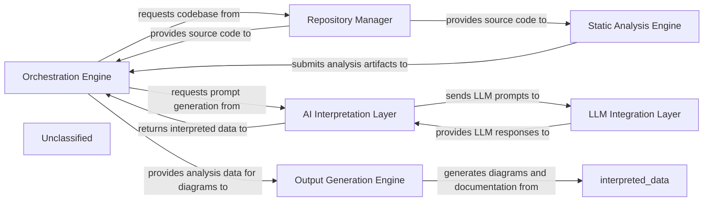

## Details

The CodeBoarding project operates through a sophisticated multi-component architecture designed for automated code analysis and documentation generation. At its core, the Orchestration Engine acts as the central control unit, managing the entire workflow from initial code ingestion to final output. It delegates tasks to specialized components: the Repository Manager handles all interactions with the codebase, providing raw source files and structural information. The Static Analysis Engine then processes this code to extract critical structural and control flow data. This analyzed data, along with user queries, is fed into the AI Interpretation Layer, which dynamically crafts prompts for various Large Language Models (LLMs). The LLM Integration Layer facilitates secure communication with these external LLMs, retrieving their responses. These responses are then processed by the AI Interpretation Layer and returned to the Orchestration Engine. Finally, the Output Generation Engine takes the interpreted data and analysis artifacts to produce comprehensive documentation, including diagrams, ensuring a cohesive and informative output.

### Orchestration Engine [[Expand]](./Orchestration_Engine.md)
The central coordinator managing the entire code analysis and documentation generation workflow, orchestrating tasks and data flow.

**Related Classes/Methods**:

- <a href="https://github.com/CodeBoarding/CodeBoarding/blob/main/.codeboardingagents/agent.py" target="_blank" rel="noopener noreferrer">`agents.agent`</a>
- <a href="https://github.com/CodeBoarding/CodeBoarding/blob/main/.codeboardingagents/meta_agent.py" target="_blank" rel="noopener noreferrer">`agents.meta_agent`</a>

### Repository Manager [[Expand]](./Repository_Manager.md)
Handles all interactions with code repositories, including fetching source code and managing file system access.

**Related Classes/Methods**:

- <a href="https://github.com/CodeBoarding/CodeBoarding/blob/main/.codeboardingagents/tools/read_file.py" target="_blank" rel="noopener noreferrer">`agents.tools.read_file`</a>
- <a href="https://github.com/CodeBoarding/CodeBoarding/blob/main/.codeboardingagents/tools/read_file_structure.py" target="_blank" rel="noopener noreferrer">`agents.tools.read_file_structure`</a>

### Static Analysis Engine [[Expand]](./Static_Analysis_Engine.md)
Performs in-depth static analysis on source code to extract structural, control flow, and semantic information.

**Related Classes/Methods**:

- <a href="https://github.com/CodeBoarding/CodeBoarding/blob/main/.codeboardingagents/tools/read_cfg.py" target="_blank" rel="noopener noreferrer">`agents.tools.read_cfg`</a>

### AI Interpretation Layer [[Expand]](./AI_Interpretation_Layer.md)
Dynamically constructs and manages prompts tailored for various Large Language Models (LLMs) and specific analysis tasks.

**Related Classes/Methods**:

- <a href="https://github.com/CodeBoarding/CodeBoarding/blob/main/.codeboardingagents/prompts/prompt_factory.py" target="_blank" rel="noopener noreferrer">`agents.prompts.prompt_factory`</a>
- <a href="https://github.com/CodeBoarding/CodeBoarding/blob/main/.codeboardingagents/prompts/claude_prompts_bidirectional.py" target="_blank" rel="noopener noreferrer">`agents.prompts.claude_prompts_bidirectional`</a>

### LLM Integration Layer [[Expand]](./LLM_Integration_Layer.md)
Manages secure and efficient communication with various external Large Language Model providers.

**Related Classes/Methods**:

- <a href="https://github.com/CodeBoarding/CodeBoarding/blob/main/.codeboardingagents/llm_config.py" target="_blank" rel="noopener noreferrer">`agents.llm_config`</a>
- <a href="https://github.com/CodeBoarding/CodeBoarding/blob/main/.codeboardingagents/tools/external_deps.py" target="_blank" rel="noopener noreferrer">`agents.tools.external_deps`</a>

### Output Generation Engine
Formats and produces the final documentation, reports, or other output artifacts based on processed analysis and LLM interpretations, including the generation of diagrams.

**Related Classes/Methods**:

- <a href="https://github.com/CodeBoarding/CodeBoarding/blob/main/.codeboardingagents/agent_responses.py" target="_blank" rel="noopener noreferrer">`agents.agent_responses`</a>

### Unclassified
Component for all unclassified files and utility functions (Utility functions/External Libraries/Dependencies)

**Related Classes/Methods**: _None_

### Unclassified
Component for all unclassified files and utility functions (Utility functions/External Libraries/Dependencies)

**Related Classes/Methods**: _None_

### [FAQ](https://github.com/CodeBoarding/GeneratedOnBoardings/tree/main?tab=readme-ov-file#faq)
