```mermaid
graph LR
    AI_Agent_Orchestration["AI Agent Orchestration"]
    Prompt_LLM_Configuration["Prompt & LLM Configuration"]
    Static_Analysis_Engine["Static Analysis Engine"]
    Analysis_Data_Management["Analysis Data Management"]
    Project_Environment_Setup["Project & Environment Setup"]
    Application_Orchestration_Output["Application Orchestration & Output"]
    Validation_Health_Checks["Validation & Health Checks"]
    Monitoring_Telemetry["Monitoring & Telemetry"]
    Application_Orchestration_Output -- "Initiates project setup." --> Project_Environment_Setup
    Project_Environment_Setup -- "Configures static analysis." --> Static_Analysis_Engine
    Static_Analysis_Engine -- "Stores analysis data." --> Analysis_Data_Management
    Analysis_Data_Management -- "Provides cached data." --> Static_Analysis_Engine
    Analysis_Data_Management -- "Supplies analysis insights." --> AI_Agent_Orchestration
    AI_Agent_Orchestration -- "Requests code details." --> Static_Analysis_Engine
    AI_Agent_Orchestration -- "Utilizes LLM configurations." --> Prompt_LLM_Configuration
    AI_Agent_Orchestration -- "Delivers generated content." --> Application_Orchestration_Output
    Static_Analysis_Engine -- "Provides analysis for validation." --> Validation_Health_Checks
    AI_Agent_Orchestration -- "Provides agent output for validation." --> Validation_Health_Checks
    Application_Orchestration_Output -- "Consumes validation reports." --> Validation_Health_Checks
    AI_Agent_Orchestration -- "Reports agent activity." --> Monitoring_Telemetry
    Application_Orchestration_Output -- "Reports workflow metrics." --> Monitoring_Telemetry
    click AI_Agent_Orchestration href "https://github.com/CodeBoarding/CodeBoarding/blob/main/.codeboarding/AI_Agent_Orchestration.md" "Details"
    click Prompt_LLM_Configuration href "https://github.com/CodeBoarding/CodeBoarding/blob/main/.codeboarding/Prompt_LLM_Configuration.md" "Details"
    click Static_Analysis_Engine href "https://github.com/CodeBoarding/CodeBoarding/blob/main/.codeboarding/Static_Analysis_Engine.md" "Details"
    click Analysis_Data_Management href "https://github.com/CodeBoarding/CodeBoarding/blob/main/.codeboarding/Analysis_Data_Management.md" "Details"
    click Project_Environment_Setup href "https://github.com/CodeBoarding/CodeBoarding/blob/main/.codeboarding/Project_Environment_Setup.md" "Details"
    click Application_Orchestration_Output href "https://github.com/CodeBoarding/CodeBoarding/blob/main/.codeboarding/Application_Orchestration_Output.md" "Details"
    click Validation_Health_Checks href "https://github.com/CodeBoarding/CodeBoarding/blob/main/.codeboarding/Validation_Health_Checks.md" "Details"
    click Monitoring_Telemetry href "https://github.com/CodeBoarding/CodeBoarding/blob/main/.codeboarding/Monitoring_Telemetry.md" "Details"
```

## Details

The CodeBoarding application orchestrates a sophisticated analysis pipeline, starting with Project & Environment Setup to configure the codebase and detect changes. The Static Analysis Engine then performs deep structural analysis, with results managed by Analysis Data Management for caching and incremental updates. AI Agent Orchestration leverages these analysis results, guided by Prompt & LLM Configuration, to interpret code and generate insights. All analysis and agent outputs are subject to Validation & Health Checks to ensure quality, while Monitoring & Telemetry tracks performance. Finally, Application Orchestration & Output manages the overall workflow, exposes an API, and generates comprehensive documentation and diagrams.

### AI Agent Orchestration [[Expand]](./AI_Agent_Orchestration.md)
Manages the lifecycle, coordination, and execution of various AI agents, providing them with tools, prompts, and LLM configurations to perform codebase analysis and generate insights. This component includes the core agent logic, specific tools for interaction, and the overall strategy for agent-based analysis.

**Related Classes/Methods**:

- <a href="https://github.com/CodeBoarding/CodeBoarding/blob/main/.codeboardingagents/tools/read_git_diff.py" target="_blank" rel="noopener noreferrer">`agents.codeboarding_agent.CodeBoardingAgent`</a>
- <a href="https://github.com/CodeBoarding/CodeBoarding/blob/main/.codeboardingagents/abstraction_agent.py" target="_blank" rel="noopener noreferrer">`agents.abstraction_agent.AbstractionAgent`</a>
- <a href="https://github.com/CodeBoarding/CodeBoarding/blob/main/.codeboardingagents/meta_agent.py" target="_blank" rel="noopener noreferrer">`agents.meta_agent.MetaAgent`</a>
- <a href="https://github.com/CodeBoarding/CodeBoarding/blob/main/.codeboardingagents/tools/toolkit.py" target="_blank" rel="noopener noreferrer">`agents.tools.toolkit.CodeBoardingToolkit`</a>
- <a href="https://github.com/CodeBoarding/CodeBoarding/blob/main/.codeboardingagents/planner_agent.py" target="_blank" rel="noopener noreferrer">`agents.planner_agent.plan_analysis`</a>

### Prompt & LLM Configuration [[Expand]](./Prompt_LLM_Configuration.md)
Manages the generation of prompts for various Large Language Models (LLMs) and handles their configuration, including API key retrieval and argument resolution. It ensures that AI agents can correctly interact with different LLM providers.

**Related Classes/Methods**:

- <a href="https://github.com/CodeBoarding/CodeBoarding/blob/main/.codeboardingagents/prompts/prompt_factory.py" target="_blank" rel="noopener noreferrer">`agents.prompts.prompt_factory.LLMType`</a>
- <a href="https://github.com/CodeBoarding/CodeBoarding/blob/main/.codeboardingagents/prompts/prompt_factory.py" target="_blank" rel="noopener noreferrer">`agents.prompts.prompt_factory.PromptFactory`</a>
- <a href="https://github.com/CodeBoarding/CodeBoarding/blob/main/.codeboardingagents/llm_config.py" target="_blank" rel="noopener noreferrer">`agents.llm_config.get_llm_api_key`</a>
- <a href="https://github.com/CodeBoarding/CodeBoarding/blob/main/.codeboardingagents/llm_config.py" target="_blank" rel="noopener noreferrer">`agents.llm_config.resolve_llm_extra_args`</a>

### Static Analysis Engine [[Expand]](./Static_Analysis_Engine.md)
Performs deep static analysis of the codebase using Language Server Protocols (LSPs) to extract symbols, build call graphs, and identify logical code clusters. It handles communication with various language servers and provides the foundational structural analysis of the code.

**Related Classes/Methods**:

- <a href="https://github.com/CodeBoarding/CodeBoarding/blob/main/.codeboardingstatic_analyzer/cluster_change_analyzer.py" target="_blank" rel="noopener noreferrer">`static_analyzer.lsp_client.LSPClient`</a>
- <a href="https://github.com/CodeBoarding/CodeBoarding/blob/main/.codeboardingstatic_analyzer/cluster_change_analyzer.py" target="_blank" rel="noopener noreferrer">`static_analyzer.call_graph.CallGraph`</a>
- <a href="https://github.com/CodeBoarding/CodeBoarding/blob/main/.codeboardingstatic_analyzer/cluster_change_analyzer.py" target="_blank" rel="noopener noreferrer">`static_analyzer.cluster_change_analyzer.ClusterChangeAnalyzer`</a>
- <a href="https://github.com/CodeBoarding/CodeBoarding/blob/main/.codeboardingstatic_analyzer/cluster_change_analyzer.py" target="_blank" rel="noopener noreferrer">`static_analyzer.lsp_client.TypeScriptClient`</a>
- <a href="https://github.com/CodeBoarding/CodeBoarding/blob/main/.codeboardingstatic_analyzer/cluster_change_analyzer.py" target="_blank" rel="noopener noreferrer">`static_analyzer.lsp_client.JavaClient`</a>

### Analysis Data Management [[Expand]](./Analysis_Data_Management.md)
Manages the caching, persistence, and incremental updates of static analysis results, ensuring efficient storage and retrieval of codebase insights. This component is crucial for optimizing performance by only re-analyzing changed parts of the codebase.

**Related Classes/Methods**:

- <a href="https://github.com/CodeBoarding/CodeBoarding/blob/main/.codeboardingdiagram_analysis/incremental/io_utils.py" target="_blank" rel="noopener noreferrer">`static_analyzer.analysis_cache_manager.AnalysisCacheManager`</a>
- <a href="https://github.com/CodeBoarding/CodeBoarding/blob/main/.codeboardingdiagram_analysis/incremental/io_utils.py" target="_blank" rel="noopener noreferrer">`static_analyzer.static_analysis_results.StaticAnalysisResults`</a>
- <a href="https://github.com/CodeBoarding/CodeBoarding/blob/main/.codeboardingdiagram_analysis/incremental/io_utils.py" target="_blank" rel="noopener noreferrer">`diagram_analysis.incremental.incremental_updater.IncrementalUpdater`</a>
- <a href="https://github.com/CodeBoarding/CodeBoarding/blob/main/.codeboardingdiagram_analysis/incremental/io_utils.py" target="_blank" rel="noopener noreferrer">`diagram_analysis.incremental.analysis_file_store._AnalysisFileStore`</a>

### Project & Environment Setup [[Expand]](./Project_Environment_Setup.md)
Handles the initial project setup, language-specific configurations, installation of necessary tools, and detection of code changes within the repository to prepare for analysis. It ensures the application is correctly configured and capable of supporting various programming languages.

**Related Classes/Methods**:

- <a href="https://github.com/CodeBoarding/CodeBoarding/blob/main/.codeboardingstatic_analyzer/programming_language.py" target="_blank" rel="noopener noreferrer">`static_analyzer.install.install`</a>
- <a href="https://github.com/CodeBoarding/CodeBoarding/blob/main/.codeboardingstatic_analyzer/programming_language.py" target="_blank" rel="noopener noreferrer">`repo_utils.change_set.ChangeSet`</a>
- <a href="https://github.com/CodeBoarding/CodeBoarding/blob/main/.codeboardingstatic_analyzer/programming_language.py" target="_blank" rel="noopener noreferrer">`static_analyzer.programming_language.ProgrammingLanguageBuilder`</a>
- <a href="https://github.com/CodeBoarding/CodeBoarding/blob/main/.codeboardingstatic_analyzer/java_config_scanner.py" target="_blank" rel="noopener noreferrer">`static_analyzer.java_config_scanner.JavaConfigScanner`</a>

### Application Orchestration & Output [[Expand]](./Application_Orchestration_Output.md)
Orchestrates the main application workflow, manages analysis jobs, provides an API for external interaction, and generates diverse documentation and diagram outputs from analysis results. This component ties together the analysis results with user-consumable documentation and diagrams.

**Related Classes/Methods**:

- <a href="https://github.com/CodeBoarding/CodeBoarding/blob/main/.codeboardingmain.py" target="_blank" rel="noopener noreferrer">`main.main`</a>
- <a href="https://github.com/CodeBoarding/CodeBoarding/blob/main/.codeboardingdiagram_analysis/diagram_generator.py" target="_blank" rel="noopener noreferrer">`diagram_analysis.diagram_generator.diagram_generator`</a>
- <a href="https://github.com/CodeBoarding/CodeBoarding/blob/main/.codeboardingmain.py" target="_blank" rel="noopener noreferrer">`local_app.local_app`</a>
- <a href="https://github.com/CodeBoarding/CodeBoarding/blob/main/.codeboardingmain.py" target="_blank" rel="noopener noreferrer">`duckdb_crud.duckdb_crud`</a>

### Validation & Health Checks [[Expand]](./Validation_Health_Checks.md)
Validates the integrity and correctness of analysis results, including cluster coverage and component relationships, and performs various code health checks. This component ensures the quality and reliability of the generated analysis and documentation.

**Related Classes/Methods**:

- <a href="https://github.com/CodeBoarding/CodeBoarding/blob/main/.codeboardingstatic_analyzer/lsp_client/diagnostics.py" target="_blank" rel="noopener noreferrer">`static_analyzer.lsp_client.diagnostics.LSPDiagnosticsCollector`</a>
- <a href="https://github.com/CodeBoarding/CodeBoarding/blob/main/.codeboardinghealth/runner.py" target="_blank" rel="noopener noreferrer">`health.runner.run_all_checks`</a>
- <a href="https://github.com/CodeBoarding/CodeBoarding/blob/main/.codeboardingagents/validation.py" target="_blank" rel="noopener noreferrer">`agents.validation.validate_agent_output`</a>

### Monitoring & Telemetry [[Expand]](./Monitoring_Telemetry.md)
Collects and reports runtime statistics and usage data, particularly for LLM and tool interactions. This component is vital for understanding the performance, cost, and behavior of the AI agents and the overall analysis pipeline.

**Related Classes/Methods**:

- <a href="https://github.com/CodeBoarding/CodeBoarding/blob/main/.codeboardingmonitoring/context.py" target="_blank" rel="noopener noreferrer">`monitoring.context.MonitoringCallback`</a>
- <a href="https://github.com/CodeBoarding/CodeBoarding/blob/main/.codeboardingmonitoring/stats.py" target="_blank" rel="noopener noreferrer">`monitoring.stats.StatsManager`</a>
- <a href="https://github.com/CodeBoarding/CodeBoarding/blob/main/.codeboardingmonitoring/writers.py" target="_blank" rel="noopener noreferrer">`monitoring.writers.ConsoleWriter`</a>

### [FAQ](https://github.com/CodeBoarding/GeneratedOnBoardings/tree/main?tab=readme-ov-file#faq)
