```mermaid
graph LR
    Orchestration_Engine["Orchestration Engine"]
    Static_Analysis_Engine["Static Analysis Engine"]
    AI_Processing_Layer["AI Processing Layer"]
    Output_Generation_Engine["Output Generation Engine"]
    Diagram_Generation_Service["Diagram Generation Service"]
    Unclassified["Unclassified"]
    Orchestration_Engine -- "initiates code analysis in" --> Static_Analysis_Engine
    Static_Analysis_Engine -- "provides structured code data to" --> AI_Processing_Layer
    AI_Processing_Layer -- "sends interpreted architectural data to" --> Output_Generation_Engine
    Output_Generation_Engine -- "provides diagram data to" --> Diagram_Generation_Service
    Orchestration_Engine -- "triggers the interpretation phase in" --> AI_Processing_Layer
    Orchestration_Engine -- "commands output generation from" --> Output_Generation_Engine
    click Orchestration_Engine href "https://github.com/CodeBoarding/CodeBoarding/blob/main/.codeboarding/Orchestration_Engine.md" "Details"
    click Static_Analysis_Engine href "https://github.com/CodeBoarding/CodeBoarding/blob/main/.codeboarding/Static_Analysis_Engine.md" "Details"
    click AI_Processing_Layer href "https://github.com/CodeBoarding/CodeBoarding/blob/main/.codeboarding/AI_Processing_Layer.md" "Details"
    click Output_Generation_Engine href "https://github.com/CodeBoarding/CodeBoarding/blob/main/.codeboarding/Output_Generation_Engine.md" "Details"
    click Diagram_Generation_Service href "https://github.com/CodeBoarding/CodeBoarding/blob/main/.codeboarding/Diagram_Generation_Service.md" "Details"
```

## Details

The CodeBoarding project is structured around a pipeline that orchestrates code analysis, AI-driven interpretation, and documentation/diagram generation. The Orchestration Engine initiates and manages this entire process, delegating tasks to specialized components. The Static Analysis Engine first processes the raw source code to generate structural representations like CFGs. This data is then fed into the AI Processing Layer, which leverages LLMs to derive high-level architectural insights. These insights are subsequently transformed into various documentation formats by the Output Generation Engine and visual diagrams by the Diagram Generation Service. This modular design ensures clear separation of concerns and a streamlined flow from raw code to comprehensive architectural documentation and visualizations.

### Orchestration Engine [[Expand]](./Orchestration_Engine.md)
The central control unit managing the entire code analysis and documentation generation pipeline. It coordinates the execution flow, from static analysis to AI interpretation and final output generation.

**Related Classes/Methods**:

- <a href="https://github.com/CodeBoarding/CodeBoarding/blob/main/.codeboardingagents/meta_agent.py" target="_blank" rel="noopener noreferrer">`agents/meta_agent.py`</a>
- <a href="https://github.com/CodeBoarding/CodeBoarding/blob/main/.codeboardingagents/planner_agent.py" target="_blank" rel="noopener noreferrer">`agents/planner_agent.py`</a>

### Static Analysis Engine [[Expand]](./Static_Analysis_Engine.md)
Responsible for parsing source code, building Abstract Syntax Trees (ASTs), and generating Control Flow Graphs (CFGs) and other structural code representations. It provides the foundational, raw code structure data.

**Related Classes/Methods**:

- <a href="https://github.com/CodeBoarding/CodeBoarding/blob/main/.codeboardingstatic_analyzer" target="_blank" rel="noopener noreferrer">`static_analyzer/`</a>

### AI Processing Layer [[Expand]](./AI_Processing_Layer.md)
This integrated layer processes structured code data using Large Language Models (LLMs) to derive architectural insights, identify components, and understand relationships. It includes prompt generation and management, and handles interactions with various LLM providers.

**Related Classes/Methods**:

- <a href="https://github.com/CodeBoarding/CodeBoarding/blob/main/.codeboardingagents/abstraction_agent.py" target="_blank" rel="noopener noreferrer">`agents/abstraction_agent.py`</a>
- <a href="https://github.com/CodeBoarding/CodeBoarding/blob/main/.codeboardingagents/details_agent.py" target="_blank" rel="noopener noreferrer">`agents/details_agent.py`</a>
- <a href="https://github.com/CodeBoarding/CodeBoarding/blob/main/.codeboardingagents/prompts/prompt_factory.py" target="_blank" rel="noopener noreferrer">`agents/prompts/prompt_factory.py`</a>
- <a href="https://github.com/CodeBoarding/CodeBoarding/blob/main/.codeboardingagents/llm_config.py" target="_blank" rel="noopener noreferrer">`agents/llm_config.py`</a>

### Output Generation Engine [[Expand]](./Output_Generation_Engine.md)
Takes the structured architectural insights from the AI Processing Layer and formats them into various output types, such as documentation files (Markdown, JSON), reports, or raw data suitable for diagram generation.

**Related Classes/Methods**:

- <a href="https://github.com/CodeBoarding/CodeBoarding/blob/main/.codeboardingoutput_generators" target="_blank" rel="noopener noreferrer">`output_generators/`</a>

### Diagram Generation Service [[Expand]](./Diagram_Generation_Service.md)
Specializes in converting structured architectural data into visual diagrams, potentially using tools like Mermaid.js. It enhances comprehension by providing interactive and visual representations of the analyzed architecture.

**Related Classes/Methods**:

- <a href="https://github.com/CodeBoarding/CodeBoarding/blob/main/.codeboardingdiagram_analysis" target="_blank" rel="noopener noreferrer">`diagram_analysis/`</a>

### Unclassified
Component for all unclassified files and utility functions (Utility functions/External Libraries/Dependencies)

**Related Classes/Methods**: _None_

### [FAQ](https://github.com/CodeBoarding/GeneratedOnBoardings/tree/main?tab=readme-ov-file#faq)
