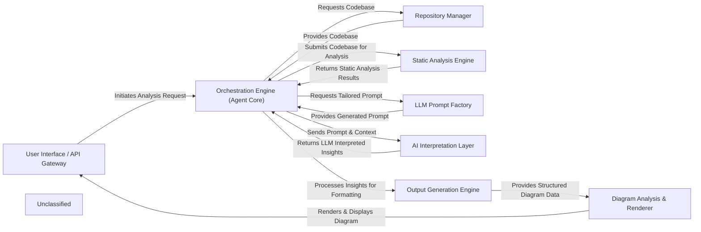

## Details

The system is designed around a central `Orchestration Engine` that manages the entire code analysis and documentation generation workflow. User requests are initiated through the `User Interface / API Gateway`, which then delegates the processing to the `Orchestration Engine`. This engine interacts with the `Repository Manager` to access code, the `Static Analysis Engine` to extract structural information, and the `LLM Prompt Factory` to prepare prompts for AI. The `AI Interpretation Layer` processes these prompts and analysis results to generate architectural insights. Finally, the `Output Generation Engine` formats these insights, and the `Diagram Analysis & Renderer` visualizes them, with the results being delivered back through the `User Interface / API Gateway`.

### User Interface / API Gateway [[Expand]](./User_Interface_API_Gateway.md)
The primary interface for users to initiate code analysis and view the generated architectural diagrams. It acts as the system's entry and exit point, handling API requests and responses.

**Related Classes/Methods**:

- <a href="https://github.com/CodeBoarding/CodeBoarding/blob/main/.codeboardinglocal_app.py" target="_blank" rel="noopener noreferrer">`local_app.app`</a>

### Orchestration Engine (Agent Core) [[Expand]](./Orchestration_Engine_Agent_Core_.md)
The central control unit that manages the entire analysis workflow, coordinating interactions between all other components and maintaining the state of the analysis. It orchestrates the various agents to perform their tasks.

**Related Classes/Methods**:

- <a href="https://github.com/CodeBoarding/CodeBoarding/blob/main/.codeboardingagents/meta_agent.py" target="_blank" rel="noopener noreferrer">`agents.meta_agent.MetaAgent`</a>

### Repository Manager [[Expand]](./Repository_Manager.md)
Handles all interactions with code repositories, including cloning, fetching, and providing a standardized interface for accessing the source code. It also manages temporary repository folders.

**Related Classes/Methods**:

- <a href="https://github.com/CodeBoarding/CodeBoarding/blob/main/.codeboardingutils.py" target="_blank" rel="noopener noreferrer">`utils.create_temp_repo_folder`</a>
- <a href="https://github.com/CodeBoarding/CodeBoarding/blob/main/.codeboardingutils.py" target="_blank" rel="noopener noreferrer">`utils.remove_temp_repo_folder`</a>

### Static Analysis Engine
Performs in-depth static analysis on the source code to extract structural information such as Control Flow Graphs (CFGs) and Abstract Syntax Trees (ASTs).

**Related Classes/Methods**:

- <a href="https://github.com/CodeBoarding/CodeBoarding/blob/main/.codeboardingstatic_analyzer/scanner.py" target="_blank" rel="noopener noreferrer">`static_analyzer.scanner.Scanner`</a>

### LLM Prompt Factory [[Expand]](./LLM_Prompt_Factory.md)
Dynamically generates and manages prompts specifically tailored for various Large Language Models (LLMs) and different code analysis tasks.

**Related Classes/Methods**:

- <a href="https://github.com/CodeBoarding/CodeBoarding/blob/main/.codeboardingagents/prompts/prompt_factory.py" target="_blank" rel="noopener noreferrer">`agents.prompts.prompt_factory.PromptFactory`</a>

### AI Interpretation Layer [[Expand]](./AI_Interpretation_Layer.md)
Interfaces with diverse LLM providers to process static analysis results and prompts, interpreting code context and generating architectural insights. This layer includes agents responsible for abstraction and detailed analysis.

**Related Classes/Methods**:

- <a href="https://github.com/CodeBoarding/CodeBoarding/blob/main/.codeboardingagents/abstraction_agent.py" target="_blank" rel="noopener noreferrer">`agents.abstraction_agent.AbstractionAgent`</a>
- <a href="https://github.com/CodeBoarding/CodeBoarding/blob/main/.codeboardingagents/details_agent.py" target="_blank" rel="noopener noreferrer">`agents.details_agent.DetailsAgent`</a>

### Output Generation Engine [[Expand]](./Output_Generation_Engine.md)
Transforms the AI-interpreted insights into structured output formats, preparing the data for diagram generation and other documentation purposes (e.g., Markdown, HTML).

**Related Classes/Methods**:

- <a href="https://github.com/CodeBoarding/CodeBoarding/blob/main/.codeboardingoutput_generators/markdown.py" target="_blank" rel="noopener noreferrer">`output_generators.markdown.MarkdownGenerator`</a>
- <a href="https://github.com/CodeBoarding/CodeBoarding/blob/main/.codeboardingoutput_generators/html.py" target="_blank" rel="noopener noreferrer">`output_generators.html.HTMLGenerator`</a>

### Diagram Analysis & Renderer [[Expand]](./Diagram_Analysis_Renderer.md)
Refines the structured output into a diagram-specific format (e.g., Mermaid.js syntax) and renders it into visual architectural diagrams.

**Related Classes/Methods**:

- <a href="https://github.com/CodeBoarding/CodeBoarding/blob/main/.codeboardingdiagram_analysis/diagram_generator.py" target="_blank" rel="noopener noreferrer">`diagram_analysis.diagram_generator.DiagramGenerator`</a>

### Unclassified
Component for all unclassified files and utility functions (Utility functions/External Libraries/Dependencies)

**Related Classes/Methods**: _None_

### Unclassified
Component for all unclassified files and utility functions (Utility functions/External Libraries/Dependencies)

**Related Classes/Methods**: _None_

### Unclassified
Component for all unclassified files and utility functions (Utility functions/External Libraries/Dependencies)

**Related Classes/Methods**: _None_

### [FAQ](https://github.com/CodeBoarding/GeneratedOnBoardings/tree/main?tab=readme-ov-file#faq)
