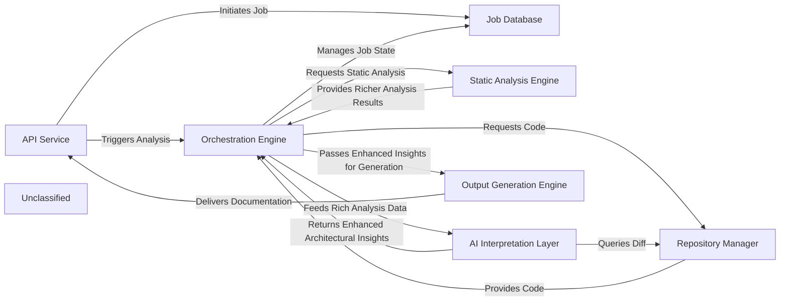
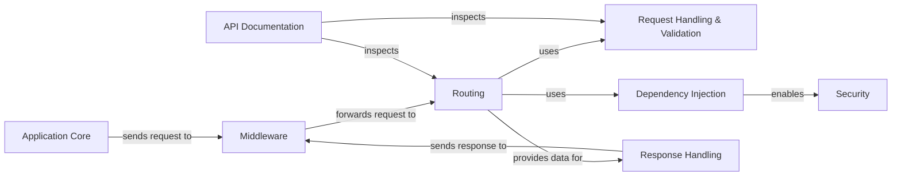
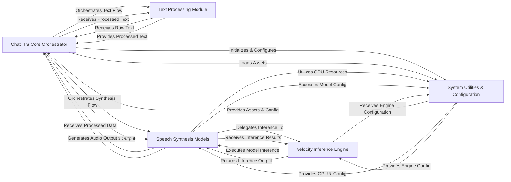

#  CodeBoarding

[](https://codeboarding.org)
[](https://discord.gg/T5zHTJYFuy)
[](https://marketplace.visualstudio.com/items?itemName=Codeboarding.codeboarding)
[](https://open-vsx.org/extension/CodeBoarding/codeboarding)


**Supported Languages:**

[](https://www.python.org/)
[](https://www.typescriptlang.org/)
[](https://developer.mozilla.org/en-US/docs/Web/JavaScript)
[](https://www.java.com/)
[](https://go.dev/)
[](https://www.php.net/)

**CodeBoarding** is an open-source codebase analysis tool that generates high-level diagram representations of codebases
using static analysis and LLM agents, that humans and agents can interact with.  
It’s designed to support onboarding, documentation, and comprehension for large, complex systems.

- Extract modules and their relationships based on the control flow graph of the project.
- Builds different levels of abstraction with an LLM agent (multi-provider support) using remote or local inference.
- Outputs interactive diagrams (Mermaid.js) for integration into docs, IDEs, CI/CD.

📄 Existing visual generations: [GeneratedOnBoardings](https://github.com/CodeBoarding/GeneratedOnBoardings)  
🌐 Try for your open-source project: [www.codeboarding.org/diagrams](https://www.codeboarding.org/diagrams)

## 🧩 How it works

For detailed architecture information, see our [diagram documentation](.codeboarding/overview.md).



## 📌 Setup

First, make sure you have uv installed. Check official installation guide [Installing UV](https://docs.astral.sh/uv/getting-started/installation/).

Setup the environment:

```bash
uv sync --frozen
source .venv/bin/activate  # On Windows: .venv\Scripts\activate
python setup.py
```

> [!IMPORTANT]  
> The setup script installs a language server for Python and TypeScript/JavaScript. In order to successfully install
> the TypeScript Language Server, you need to have `npm` installed. If `npm` is not found, the script will skip the
> installation of the TypeScript Language Server and you will need to install it manually later if you want to analyze
> TypeScript/JavaScript projects.


Configure the environment variables in a `.env` file (you can copy from `.env.example`):
The `python setup.py` command creates a `.env` file if it doesn't exist with a default value for `REPO_ROOT` and `ROOT_RESULT` as well as OLLAMA_BASE_URL for local LLM inference. If you want to use a different LLM provider, you need to set the corresponding API key in the `.env` file.

### Environment Variables

```bash
# LLM Provider (choose one)
OPENAI_API_KEY=
ANTHROPIC_API_KEY=
GOOGLE_API_KEY=
VERCEL_API_KEY=
AWS_BEARER_TOKEN_BEDROCK=
OLLAMA_BASE_URL=
OPENAI_BASE_URL=                   # Optional: Custom OpenAI endpoint
VERCEL_BASE_URL=                   # Optional: Custom Vercel endpoint
CEREBRAS_API_KEY=
AGENT_MODEL=                      # Optional: Specify model to use for the main agent (e.g., gpt-4o, claude-3-7-sonnet)
PARSING_MODEL=                    # Optional: Specify model to use for parsing tasks (e.g., gpt-4o-mini, claude-3-haiku)

# Core Configuration
CACHING_DOCUMENTATION=false        # Enable/disable documentation caching
REPO_ROOT=./repos                  # Directory for downloaded repositories
ROOT_RESULT=./results              # Directory for generated outputs
PROJECT_ROOT=/path/to/CodeBoarding # Source project root (must end with /CodeBoarding)
DIAGRAM_DEPTH_LEVEL=1              # Max depth level for diagram generation
STATIC_ANALYSIS_CONFIG=./static_analysis_config.yml # Path to static analysis config

# Optional
GITHUB_TOKEN=                     # For accessing private repositories
LANGSMITH_TRACING=false           # Optional: Enable LangSmith tracing
LANGSMITH_ENDPOINT=               # Optional: LangSmith endpoint
LANGSMITH_PROJECT=                # Optional: LangSmith project name
LANGCHAIN_API_KEY=                # Optional: LangChain API key
```

> 💡 **Tip:** Our experience has shown that using **Google Gemini‑2.5‑Pro** yields the best results for complex diagram
> generation tasks.

### Run it

#### Basic Usage

```bash
# Analyze a remote repository
python main.py <github_repo_url> --output-dir <output_path>

# Analyze a local repository
python main.py --local /path/to/repo --project-name MyProject --output-dir <output_path>
```

#### Command-Line Arguments

**Repository Selection (required, choose one):**
- `<repository_url>` - One or more GitHub repository URLs to analyze
- `--local <path>` - Path to a local repository for analysis

**Output Configuration:**
- `--output-dir <path>` - Directory where generated documentation will be saved (optional, defaults to `./analysis` for local repos)

**Local Repository Options:**
- `--project-name <name>` - Name of the project (required when using `--local`)

**Partial Update Options (local repos only):**
- `--partial-component <name>` - Specific component to update in existing analysis
- `--partial-analysis <name>` - Analysis file name to update (both component and analysis must be specified together)

**Advanced Options:**
- `--depth-level <int>` - Depth level for diagram generation (default: 1)
- `--prompt-type <type>` - Prompt type: `bidirectional` or `unidirectional` (default: bidirectional for remote, unidirectional for local)
- `--binary-location <path>` - Custom path to language server binaries
- `--project-root <path>` - Project root directory (default: current directory)
- `--upload` - Upload onboarding materials to GeneratedOnBoardings repo (remote repos only)
- `--no-cache-check` - Skip checking if documentation already exists (remote repos only)

#### Examples

```bash
# Analyze a single remote repository
python main.py https://github.com/pytorch/pytorch --output-dir ./pytorch-docs

# Analyze multiple remote repositories
python main.py https://github.com/user/repo1 https://github.com/user/repo2 --output-dir ./docs

# Analyze a local repository
python main.py --local ./my-project --project-name MyProject --output-dir ./analysis

# Partial update of a specific component
python main.py --local ./my-project --project-name MyProject --output-dir ./analysis \
               --partial-component "API Service" --partial-analysis on_boarding

# Use custom depth level and disable caching
python main.py https://github.com/user/repo --depth-level 2 --no-cache-check --output-dir ./deep-analysis
```

## 🖥️ Examples:

We have visualized **over 800+ popular open-source projects**. See examples:

### PyTorch:

```mermaid
graph LR
    Tensor_Operations_Core["Tensor Operations & Core"]
    Automatic_Differentiation_Autograd_Engine_["Automatic Differentiation (Autograd Engine)"]
    Neural_Network_Modules_torch_nn_["Neural Network Modules (torch.nn)"]
    Optimizers_torch_optim_["Optimizers (torch.optim)"]
    Data_Utilities_torch_utils_data_["Data Utilities (torch.utils.data)"]
    JIT_Compiler_Scripting_TorchScript_["JIT Compiler & Scripting (TorchScript)"]
    Hardware_Backends["Hardware Backends"]
    Data_Utilities_torch_utils_data_ -- " provides data to " --> Tensor_Operations_Core
    Tensor_Operations_Core -- " provides primitives for " --> Neural_Network_Modules_torch_nn_
    Tensor_Operations_Core -- " leverages " --> Hardware_Backends
    Neural_Network_Modules_torch_nn_ -- " performs operations on " --> Tensor_Operations_Core
    Neural_Network_Modules_torch_nn_ -- " operations recorded by " --> Automatic_Differentiation_Autograd_Engine_
    Neural_Network_Modules_torch_nn_ -- " exported to " --> JIT_Compiler_Scripting_TorchScript_
    Automatic_Differentiation_Autograd_Engine_ -- " computes gradients for " --> Optimizers_torch_optim_
    Optimizers_torch_optim_ -- " updates parameters of " --> Neural_Network_Modules_torch_nn_
    Hardware_Backends -- " executes computations for " --> Tensor_Operations_Core
    click Tensor_Operations_Core href "https://github.com/CodeBoarding/GeneratedOnBoardings/blob/main/pytorch/Tensor_Operations_Core.md" "Details"
    click Automatic_Differentiation_Autograd_Engine_ href "https://github.com/CodeBoarding/GeneratedOnBoardings/blob/main/pytorch/Automatic_Differentiation_Autograd_Engine_.md" "Details"
    click Neural_Network_Modules_torch_nn_ href "https://github.com/CodeBoarding/GeneratedOnBoardings/blob/main/pytorch/Neural_Network_Modules_torch_nn_.md" "Details"
    click Optimizers_torch_optim_ href "https://github.com/CodeBoarding/GeneratedOnBoardings/blob/main/pytorch/Optimizers_torch_optim_.md" "Details"
    click Data_Utilities_torch_utils_data_ href "https://github.com/CodeBoarding/GeneratedOnBoardings/blob/main/pytorch/Data_Utilities_torch_utils_data_.md" "Details"
    click JIT_Compiler_Scripting_TorchScript_ href "https://github.com/CodeBoarding/GeneratedOnBoardings/blob/main/pytorch/JIT_Compiler_Scripting_TorchScript_.md" "Details"
    click Hardware_Backends href "https://github.com/CodeBoarding/GeneratedOnBoardings/blob/main/pytorch/Hardware_Backends.md" "Details"
```



### FastAPI:



### ChatTTS:



Browse more examples: [GeneratedOnBoardings Repository](https://github.com/CodeBoarding/GeneratedOnBoardings)

## 🚀 Integrations

Codeboarding is integrated with everything we use:

- 📦 [**VS Code Extension**](https://marketplace.visualstudio.com/items?itemName=Codeboarding.codeboarding): Interact
  with the diagram directly in your IDE.
- ⚙️ [**GitHub Action**](https://github.com/marketplace/actions/codeboarding-diagram-first-documentation): Automate
  diagram generation in CI/CD.
- 🔗 [**MCP Server**](https://github.com/CodeBoarding/CodeBoarding-MCP): Serves the concise documentation to your AI
  Agent assistant (ClaudeCode, VSCode, Cursor, etc.)

## 🤝 Contributing

We’re just getting started and would love your help!
If you have ideas, spot bugs, or want to improve anything -
please [open an issue](https://github.com/CodeBoarding/CodeBoarding/issues) or tackle an existing one.
We actively track suggestions and welcome pull requests of all sizes.

## 🔮 Vision

**Unified high-level representation for codebases that is accurate** (hence static analysis). This representation is
used by both people and agents → fully integrated in IDEs, MCP servers, and development workflows.
