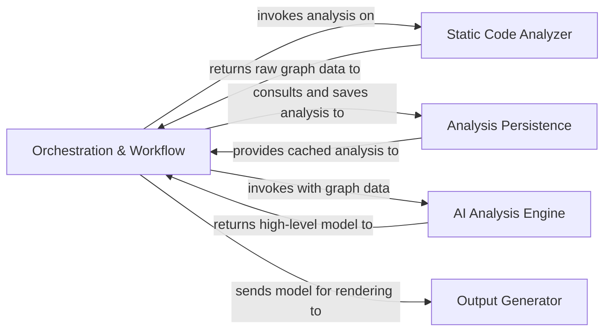
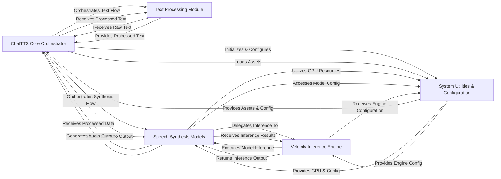
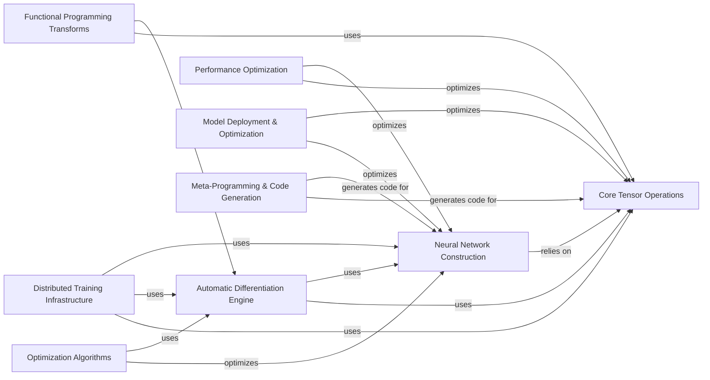
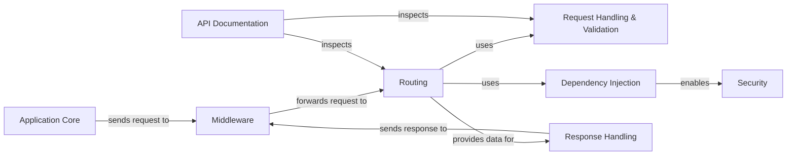

#  CodeBoarding

CodeBoarding - Automated diagram code visualzation.
Generate accurate diagram representations of your project. To ensure accuracy and scalability we use both static analysis and LLM Agents.

🌐 **Website**: [www.codeboarding.org](https://www.codeboarding.org)

## 🚀 Try It Now

The **fastest and easiest** way to try CodeBoarding is through our online demo: [codeboarding.org/demo](https://www.codeboarding.org/demo)

## 🧱 Architecture

For detailed architecture information, see our [diagram documentation](.codeboarding/on_boarding).


## Setup

Setup the environment:

```bash
uv venv --python 3.11
uv pip sync
```

### Environment Variables

You need **only one** API key from the supported LLM providers. We support:
- **OpenAI** (GPT-4o)
- **Anthropic** (Claude-3.5-Sonnet)
- **Google** (Gemini-2.5-Flash)
- **AWS Bedrock** (Claude-3.7-Sonnet)

Required environment variables:

```bash
# LLM Provider (choose one)
OPENAI_API_KEY=                    # OpenAI API key
ANTHROPIC_API_KEY=                 # Anthropic API key  
GOOGLE_API_KEY=                    # Google API key
AWS_BEARER_TOKEN_BEDROCK=          # AWS Bedrock token

# Core Configuration
CACHING_DOCUMENTATION=false        # Enable/disable documentation caching
REPO_ROOT=./repos                  # Directory for downloaded repositories
ROOT_RESULT=./results              # Directory for generated outputs
PROJECT_ROOT=/path/to/CodeBoarding # Source project root (must end with /CodeBoarding)
DIAGRAM_DEPTH_LEVEL=1              # Max depth level for diagram generation

# Optional
GITHUB_TOKEN=                     # For accessing private repositories
LANGSMITH_TRACING=false           # Optional: Enable LangSmith tracing
LANGSMITH_ENDPOINT=               # Optional: LangSmith endpoint
LANGSMITH_PROJECT=                # Optional: LangSmith project name
LANGCHAIN_API_KEY=                # Optional: LangChain API key
```


## Demos:
Check out our generated diagram examples: [GeneratedOnBoardings Repository](https://github.com/CodeBoarding/GeneratedOnBoardings)

We've visualized for **300+ projects** already - check if your favorite project is there!


Here are few examples 

### ChatTTS:


## PyTorch:


### FastAPI:



## 🔮 Vision

**Unified high-level representation for codebases that is accurate** (hence static analysis). This representation is used by both people and agents → fully integrated in IDEs, MCP servers, and development workflows.

🔌 **Integrations**:
- [VS Code Extension](https://marketplace.visualstudio.com/items?itemName=Codeboarding.codeboarding) - Generate onboarding docs directly in your IDE
- [GitHub Action](https://github.com/marketplace/actions/codeboarding-diagram-first-documentation) - Automate documentation generation in CI/CD
- [MCP Server](https://github.com/CodeBoarding/mcp-server) - Your vibe code assistant get latest docs for your dependencies in a concise matter which won't blow the context window
