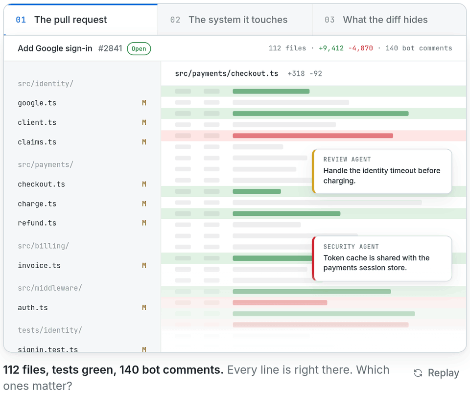

# CodeBoarding

**Review the change, not the diff.**

See what a pull request does to your system before you merge it. CodeBoarding turns code into interactive architecture maps so you can explore components, follow their dependencies, and review analyzed pull requests alongside code diffs.

This repository contains the open-source analysis engine and CLI. Static analysis extracts code relationships; language models help name and describe the components. Use the resulting map in the web platform, your editor, CI, or generated documentation.

[Discord](https://discord.gg/T5zHTJYFuy) · [VS Code extension](https://marketplace.visualstudio.com/items?itemName=Codeboarding.codeboarding)  · [Open VSX extension](https://open-vsx.org/extension/CodeBoarding/codeboarding)  · [Web platform](https://app.codeboarding.org) · [Website](https://codeboarding.org)  · [Getting started](https://codeboarding.org/getting-started)

[](https://codeboarding.org)

*The website's illustrative animation (plays once, about 18 seconds). [View the static map](docs/images/codeboarding-story-static.png) or [replay the interactive story on the website](https://codeboarding.org).*

The example starts with a large pull-request diff, then shows the six components it touches. Identity and Payments have changed: a new dependency means a Google sign-in outage can block card payments.

[](https://developer.mozilla.org/en-US/docs/Web/JavaScript)
[](https://www.typescriptlang.org/)
[](https://www.java.com/)
[](https://www.python.org/)
[](https://go.dev/)
[](https://www.php.net/)
[](https://www.rust-lang.org/)
[](https://learn.microsoft.com/en-us/dotnet/csharp/)

## Explore the system. Review the change

- **Explore:** start with the architecture map, expand components, and navigate to the source behind them. Open prepared public repositories without signing in.
- **Review:** see changed components and dependencies, read changes grouped by component, and inspect code diffs. PR review requires an available analysis from the GitHub Action; architecture comparisons also need a baseline.
- **Bring your own analysis:** open an `analysis.json` or compare two local analysis files. Files are parsed and compared in your browser.
- **Share context:** use component descriptions and diagrams in documentation, reviews, and your coding agent's next prompt.

## What CodeBoarding generates

- An `analysis.json` containing the architecture, component descriptions, relationships, and source references.
- Nested component diagrams for exploring subsystems.
- Markdown with Mermaid diagrams, HTML, MDX, or reStructuredText documentation when you request rendering.
- Incremental updates against a previous analysis, or updates to a selected component.

## How it works

1. **Analyze the code.** The engine scans the repository and extracts symbols and relationships with static analysis.
2. **Build the map.** It groups code into components and uses your configured model provider to describe their responsibilities. Analysis can send code excerpts to that provider.
3. **Explore or review.** Load the analysis in the web platform or editor, render it as documentation, or use the GitHub Action to publish architecture changes on pull requests.

The engine's top-level architecture, generated from the [committed analysis](https://github.com/CodeBoarding/CodeBoarding/blob/58291a48b2a609f68e0d19dccd0f3a605907ed28/.codeboarding/analysis.json) dated September 21, 2026:


```mermaid
graph LR
    Static_Analysis_Engine["Static Analysis Engine"]
    Diagram_Generation_and_Health_Orchestration["Diagram Generation and Health Orchestration"]
    LLM_Planning_and_Analysis_Agents["LLM Planning and Analysis Agents"]
    CLI_Workflows_and_Output_Generators["CLI, Workflows, and Output Generators"]
    Repository_and_File_Utilities["Repository and File Utilities"]
    Application_Entry_Points_and_Runtime_Configuration["Application Entry Points and Runtime Configuration"]
    Execution_Monitoring_and_Metrics["Execution Monitoring and Metrics"]
    Tool_Registry_and_Environment_Installer["Tool Registry and Environment Installer"]
    Static_Analysis_Engine -- "tracks telemetry events" --> Diagram_Generation_and_Health_Orchestration
    Static_Analysis_Engine -- "checks repository ignores and git changes" --> Repository_and_File_Utilities
    Static_Analysis_Engine -- "locates tool binaries and runtime directories" --> Tool_Registry_and_Environment_Installer
    Static_Analysis_Engine -- "builds agent insight models" --> LLM_Planning_and_Analysis_Agents
    Static_Analysis_Engine -- "formats cluster identifiers" --> Application_Entry_Points_and_Runtime_Configuration
    Diagram_Generation_and_Health_Orchestration -- "queries static analysis graphs and specs" --> Static_Analysis_Engine
    Diagram_Generation_and_Health_Orchestration -- "configures LLMs and models file index entries" --> LLM_Planning_and_Analysis_Agents
    Diagram_Generation_and_Health_Orchestration -- "normalizes paths and checks git changes" --> Repository_and_File_Utilities
    Diagram_Generation_and_Health_Orchestration -- "resolves cluster hierarchy and ordering" --> Application_Entry_Points_and_Runtime_Configuration
    Diagram_Generation_and_Health_Orchestration -- "initializes stats writers and logs runs" --> Execution_Monitoring_and_Metrics
    Diagram_Generation_and_Health_Orchestration -- "executes plugin health checks" --> CLI_Workflows_and_Output_Generators
    LLM_Planning_and_Analysis_Agents -- "reads call graph edges and nodes" --> Static_Analysis_Engine
    LLM_Planning_and_Analysis_Agents -- "filters repository files and normalizes paths" --> Repository_and_File_Utilities
    LLM_Planning_and_Analysis_Agents -- "checks cluster hierarchy and loads user configuration" --> Application_Entry_Points_and_Runtime_Configuration
    LLM_Planning_and_Analysis_Agents -- "attaches monitoring callbacks and mixins" --> Execution_Monitoring_and_Metrics
    CLI_Workflows_and_Output_Generators -- "resolves execution context and loads analysis metadata" --> Diagram_Generation_and_Health_Orchestration
    CLI_Workflows_and_Output_Generators -- "initializes LLM credentials and computes source hashes" --> LLM_Planning_and_Analysis_Agents
    CLI_Workflows_and_Output_Generators -- "manages ignore files and repository git operations" --> Repository_and_File_Utilities
    CLI_Workflows_and_Output_Generators -- "loads user configuration and sets up logging" --> Application_Entry_Points_and_Runtime_Configuration
    CLI_Workflows_and_Output_Generators -- "wraps workflow execution in monitoring context" --> Execution_Monitoring_and_Metrics
    CLI_Workflows_and_Output_Generators -- "ensures required tool binaries are installed" --> Tool_Registry_and_Environment_Installer
    CLI_Workflows_and_Output_Generators -- "retrieves node type definitions for output rendering" --> Static_Analysis_Engine
    Repository_and_File_Utilities -- "builds tool configurations from manifest" --> Tool_Registry_and_Environment_Installer
    Repository_and_File_Utilities -- "reads fingerprint data for change detection" --> Diagram_Generation_and_Health_Orchestration
    Repository_and_File_Utilities -- "hashes repository source files for fingerprint comparison" --> LLM_Planning_and_Analysis_Agents
    Application_Entry_Points_and_Runtime_Configuration -- "loads analysis metadata and resolves run context" --> Diagram_Generation_and_Health_Orchestration
    Application_Entry_Points_and_Runtime_Configuration -- "triggers incremental analysis and renders documentation formats" --> CLI_Workflows_and_Output_Generators
    Application_Entry_Points_and_Runtime_Configuration -- "clones and checks out repositories in temporary folders" --> Repository_and_File_Utilities
    Execution_Monitoring_and_Metrics -- "resolves project root directory for monitoring storage" --> Repository_and_File_Utilities
    Tool_Registry_and_Environment_Installer -- "inspects language definitions and runtime environments" --> Static_Analysis_Engine
    Tool_Registry_and_Environment_Installer -- "locates executable runnables and initializes configuration templates" --> Application_Entry_Points_and_Runtime_Configuration
```

For the engine's own architecture, [open its interactive map](https://app.codeboarding.org/CodeBoarding/CodeBoarding).

## Quick start

To try the product without installing anything, [open a public map](https://app.codeboarding.org/CodeBoarding/CodeBoarding). To connect your own repositories, [sign in to the web platform](https://app.codeboarding.org) and choose which repositories CodeBoarding can access. See the [getting-started guide](https://codeboarding.org/getting-started) for the GitHub and editor workflows.

To run the analysis engine yourself, use either option below. Both require **Python 3.12** and a [configured model provider](#configuration).

### Run from source

```bash
git clone https://github.com/CodeBoarding/CodeBoarding.git
cd CodeBoarding
uv sync --frozen
source .venv/bin/activate  # On Windows: .venv\Scripts\activate
python install.py
python main.py full --local /path/to/repo
```

### Use the packaged CLI

The recommended install method is [pipx](https://pipx.pypa.io), which keeps the CLI in its own isolated environment:

```bash
pipx install codeboarding --python python3.12
codeboarding-setup
codeboarding full --local /path/to/repo
```

Or, if you prefer pip, install into a virtual environment (not the global Python):

```bash
pip install codeboarding --extra-index-url https://pip.codeboarding.org/simple/
codeboarding-setup
codeboarding full --local /path/to/repo
```

Output is written to `/path/to/repo/.codeboarding/`. To explore it interactively, open the
[web platform](https://app.codeboarding.org) and load the generated `analysis.json` through
the viewer's **Switch source** → **File** picker.
Local analysis files are parsed and compared in your browser; this is separate from generating
the analysis with your configured model provider.

To also generate `overview` and one file per expanded component, pass `--render` with one of
`md`, `html`, `mdx`, or `rst`. Rendering is available after full, incremental, and partial local analyses;
previously generated files for the selected format are reconciled from a renderer-owned manifest:

```bash
codeboarding full --local /path/to/repo --render md
codeboarding incremental --local /path/to/repo --render html
codeboarding partial --local /path/to/repo --component-id "1.2" --render rst
```

You can render an existing analysis without rerunning analysis or configuring an LLM:

```bash
codeboarding-render /path/to/repo/.codeboarding/analysis.json
# Select a format or output directory:
codeboarding-render /path/to/analysis.json --format mdx --output-dir /path/to/docs

# From a source checkout in development:
python codeboarding_cli/render.py ../../demo/markitdown/.codeboarding/analysis.json --format md
```

`python install.py` and `codeboarding-setup` download language server binaries to `~/.codeboarding/servers/`, shared across projects. Node.js (and its bundled `npm`) is required for the Python, TypeScript, JavaScript, and PHP language servers; if neither `node` nor `CODEBOARDING_NODE_PATH` is set, setup downloads a pinned Node.js runtime into `~/.codeboarding/servers/nodeenv/` automatically.

## Configuration

On first run, CodeBoarding creates `~/.codeboarding/config.toml`. Set one provider there or use environment variables.

```toml
[provider]
# openai_api_key            = "sk-..."
# openai_base_url           = "https://api.example.com/v1"  # any OpenAI-compatible gateway
# anthropic_api_key         = "sk-ant-..."
# anthropic_base_url        = "https://resource.services.ai.azure.com/anthropic"  # Azure Foundry
# google_api_key            = "AIza..."
# vercel_api_key            = "vck_..."
# aws_bearer_token_bedrock  = "..."
# ollama_base_url           = "http://localhost:11434"
# openrouter_api_key        = "sk-..."
# orcarouter_api_key        = "sk-orca-..."   # model routing gateway (https://www.orcarouter.ai)
# litellm_base_url          = "http://localhost:4000"  # LiteLLM proxy server URL (required)
# litellm_api_key           = "sk-..."           # LiteLLM proxy server key (optional)

[llm]
# agent_model = "gemini-3.8-flash"
```

`openai_base_url` points CodeBoarding at any OpenAI-compatible gateway, including LM Studio. Set its model ID with `agent_model`; CodeBoarding adapts its prompts for the model families already represented by its provider defaults, including Qwen. The equivalent shell variables are `OPENAI_BASE_URL`, `OPENAI_API_KEY`, and `AGENT_MODEL`.

`anthropic_base_url` points the Anthropic client at a compatible Messages API, including Azure Foundry Claude deployments. Set the deployment key as `anthropic_api_key` and use canonical Anthropic model IDs such as `claude-sonnet-5` for `agent_model` so CodeBoarding selects the correct model capabilities and prompts.

Shell environment variables such as `OPENAI_API_KEY`, `ANTHROPIC_API_KEY`, `GOOGLE_API_KEY`, and `OLLAMA_BASE_URL` take precedence over the config file. For private repositories, set `GITHUB_TOKEN` in your environment.

Two environment variables tune the static analysis itself:

| Variable | Effect |
| --- | --- |
| `CODEBOARDING_LSP_REQUEST_TIMEOUT` | Seconds a language-server request may block *when it uses the per-language default* (120s for C#, 60s elsewhere). Not a hard cap on every request: the indexing and didOpen-drain probes pass their own scaled budget (60s plus 2s per file, capped at 1800s) and are unaffected. Applies to every language in the run. Unset or empty leaves the defaults alone; any other unusable value fails the run rather than falling back. |
| `CODEBOARDING_MAX_CONCURRENT_ENGINES` | How many language servers may be resident at once. `0` (the default) leaves the bound off. |

## Common commands

```bash
# Analyze a local repository
python main.py full --local ./my-project

# Raise the depth ceiling to auto-expand deeper (rarely needed — a component that
# outgrows the leaf ceiling is flagged expandable at whatever depth the run stops
# and can be expanded on demand; --depth-cap is a safety-valve cap, default 3)
python main.py full --local ./my-project --depth-cap 5

# Re-analyze only changed parts when possible
python main.py incremental --local ./my-project

# Update a single component by ID
python main.py partial --local ./my-project --component-id "1.2"

# Analyze a remote GitHub repository
python main.py full https://github.com/pytorch/pytorch
```

`--depth-cap` configures `metadata.depth_cap`; `metadata.depth_level` records the
depth actually reached. The cap is a maximum, not a target depth. `--depth-level`
is rejected; there is no compatibility alias.

Python callers must use `run_full(..., depth_cap=...)`,
`build_generator(..., depth_cap=...)`, and `DiagramGenerator(..., depth_cap=...)`.
The generator attribute is `depth_cap` and the exported default is
`diagram_analysis.DEFAULT_DEPTH_CAP` (3). The GitHub helper uses `DIAGRAM_DEPTH_CAP`
and rejects `DIAGRAM_DEPTH_LEVEL`. Telemetry reports configured `depth_cap`, not
`depth_level`. Readers of analysis results must keep reading `metadata.depth_level`
for the actual depth. Existing baseline loading behavior is unchanged: prefer
`metadata.depth_cap`, fall back to legacy `metadata.depth_level`, then use
`DEFAULT_DEPTH_CAP` if neither exists. This metadata fallback is not a CLI alias.

> **Incremental needs a baseline.** `incremental` diffs the working tree against the previous
> analysis in `.codeboarding/` (`analysis.json` + `fingerprint.json`). That baseline can live
> purely locally — a prior `full`/`incremental` run in the same output dir is enough. Commit
> `.codeboarding/` only if you want the baseline to travel with the branch (so a teammate or a
> fresh checkout can run incremental too). With no baseline at all — or one that predates content
> versioning — `incremental` fails fast with "run a full analysis first" rather than silently
> doing a full run. Static-analysis caches are versioned but not migrated; after a cache-version
> upgrade, run a full analysis once to reindex.

### Run diagnostics

Not every failure stops a run. A language server that never starts, a language nothing
indexed under, an LLM that stopped answering during naming — each of these leaves the run
able to finish and write an `analysis.json` that looks exactly like a good one. Those are
recorded in `metadata.run_diagnostics`:

```json
"run_diagnostics": {
  "version": 1,
  "degraded": 1,
  "notices": 0,
  "entries": [
    {
      "code": "static.language_server_unavailable",
      "severity": "degraded",
      "title": "CSharp could not be analyzed",
      "detail": "Its language server failed to start (csharp-ls not found), so no CSharp file contributed a component, a call or a relation to this diagram.",
      "remedy": "Check the run log for the server's own error and confirm the CSharp toolchain is installed where the analysis ran, then run the analysis again.",
      "subject": "CSharp",
      "count": 1
    }
  ]
}
```

`severity` is `degraded` when the diagram is missing structure a clean run would have had,
and `notice` when it is whole but something about how it was produced is worth knowing. An
empty `remedy` means nothing the reader does would have changed the outcome — consumers
offer "report this" there rather than an instruction nobody can follow. The report describes
the run that wrote the document and is never inherited from a previous one; an analysis
written before the field existed simply has no `run_diagnostics` key.

Every surface that renders an analysis is expected to say when `degraded` is non-zero —
the GitHub Action annotates its run and its review comment, and the webview banners the
diagram. Wording lives in `run_diagnostics/catalog.py`, one builder per code.

Two LLM failures are not survivable and stop the run instead: a rejected API key (exit code
2) and an exhausted token or credit quota (HTTP 402, or a 429 that says the quota is gone;
exit code 3). Naming every component after its folder is not a result worth writing, so no
`analysis.json` is left behind (a previous one is restored). `full`, `incremental` and
`partial` all print one JSON object on stdout for callers to branch on:

```json
{"mode": "full", "error": "...", "kind": "llm_quota_exhausted", "statusCode": 402, "provider": "openai", "requiresFullAnalysis": false}
```

`kind` is `llm_auth` for a rejected key. `requiresFullAnalysis` is false because a full run
would be refused the same way.

## Where to use it

- **CLI:** [CodeBoarding CLI](#quick-start) — this repository — for local analysis, automation, and documentation generation.
- **Browser:** [web platform](https://app.codeboarding.org) for Explore and Review, public maps, and local analysis files.
- **Editor:** [VS Code Marketplace](https://marketplace.visualstudio.com/items?itemName=Codeboarding.codeboarding) or [Open VSX](https://open-vsx.org/extension/CodeBoarding/codeboarding) for in-editor architecture exploration.
- **CI:** [GitHub Action](https://github.com/marketplace/actions/codeboarding-action) to keep analysis updated and post architecture change maps on pull requests.

## Supported stack

- Languages: Python, TypeScript, JavaScript, Java, Go, PHP, Rust, C#.
- LLM providers: OpenAI, Anthropic, Google, Vercel AI Gateway, AWS Bedrock, Ollama, OpenRouter, OrcaRouter, LiteLLM proxy, and more.

## Examples

- [Explore CodeBoarding's architecture](https://app.codeboarding.org/CodeBoarding/CodeBoarding) — the engine, drawn from its own code.
- [Review CodeBoarding pull request #586](https://app.codeboarding.org/CodeBoarding/CodeBoarding/pull/586) — component changes and code diffs together.
- [Browse example diagrams](https://codeboarding.org/diagrams).
- [Awesome Architecture MDs](https://github.com/CodeBoarding/awesome-architecture-mds) — generated architecture documentation for open-source repositories (formerly GeneratedOnBoardings).

Public maps need a committed `.codeboarding/analysis.json` at the selected branch or commit.
Open one at `https://app.codeboarding.org/<owner>/<repo>` without signing in; opening a URL does not generate a new analysis.

## Telemetry

CodeBoarding collects usage telemetry (which command ran, success/failure,
duration, token cost, repository size and languages, and the account the
repository belongs to) to help us improve the tool. It is on by default and
never collects source code, file names, repository names, paths, prompts, model
outputs, or API keys. Opt out anytime:

```bash
export CODEBOARDING_TELEMETRY=false   # or: export DO_NOT_TRACK=1
```

See [TELEMETRY.md](TELEMETRY.md) for the full list of events and properties.

## Contributing

If you want to improve CodeBoarding, open an [issue](https://github.com/CodeBoarding/CodeBoarding/issues) or send a pull request. We welcome improvements to analysis quality, output generators, integrations, and developer experience.

See [CONTRIBUTING.md](CONTRIBUTING.md) for development setup and testing guidance.

## License

The analysis engine and CLI in this repository are released under the [MIT License](LICENSE).
