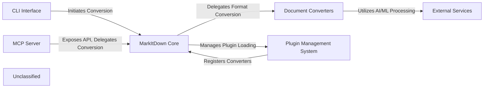

# CodeBoarding Evaluation Report

**Last Updated:** 2025-10-14T21:58:50.435576

**Total Evaluation Duration:** 2171.10 seconds

## Overview

- **Total Projects Tested:** 3
- **Static Analysis Success Rate:** 3/3 (100.0%)
- **End-to-End Success Rate:** 1/3 (33.3%)
- **Total Tokens Consumed:** 0
- **Total Tool Calls:** 20
- **Total Files Analyzed:** 70
- **Total Errors Found:** 0

---

## 1. Static Analysis Performance Evaluation

**Timestamp:** 2025-10-14T21:24:33.544776

**Evaluation Time:** 114.22 seconds

### Summary

| Project | Language | Status | Time (s) | Files | Errors |
|---------|----------|--------|----------|-------|--------|
| markitdown | Python | ✅ Success | 9.97 | 43 | 0 |
| tsoa | TypeScript | ✅ Success | 96.28 | 8 | 0 |
| cobra | Go | ✅ Success | 7.97 | 19 | 0 |

### Detailed Results

#### markitdown

- **URL:** https://github.com/microsoft/markitdown
- **Expected Language:** Python
- **Total Time:** 9.97s
- **Status:** ✅ Success

**Performance Metrics:**

| Language | Time (s) | Files | Errors |
|----------|----------|-------|--------|
| Python | 8.18 | 43 | 0 |

#### tsoa

- **URL:** https://github.com/lukeautry/tsoa
- **Expected Language:** TypeScript
- **Total Time:** 96.28s
- **Status:** ✅ Success

**Performance Metrics:**

| Language | Time (s) | Files | Errors |
|----------|----------|-------|--------|
| TypeScript | 7.49 | 8 | 0 |

#### cobra

- **URL:** https://github.com/spf13/cobra
- **Expected Language:** Go
- **Total Time:** 7.97s
- **Status:** ✅ Success

**Performance Metrics:**

| Language | Time (s) | Files | Errors |
|----------|----------|-------|--------|
| Go | 7.19 | 19 | 0 |

---

## 2. End-to-End Pipeline Evaluation

**Timestamp:** 2025-10-14T21:58:50.431750

**Evaluation Time:** 2056.88 seconds

### Summary

| Project | Language | Status | Time (s) | Total Tokens | Tool Calls |
|---------|----------|--------|----------|--------------|------------|
| markitdown | Python | ✅ Success | 456.42 | 0 | 20 |
| tsoa | TypeScript | ❌ Failed | 964.67 | 0 | 0 |
| cobra | Go | ❌ Failed | 635.77 | 0 | 0 |

### Project Details

#### markitdown

**Tool Usage:**

| Tool | Calls |
|------|-------|
| getSourceCode | 6 |
| readFile | 6 |
| getPackageDependencies | 3 |
| getClassHierarchy | 3 |
| readDocs | 1 |
| getFileStructure | 1 |

**Architecture Diagram:**

---

## Aggregate Metrics

- **Total Evaluation Time:** 2171.10 seconds
- **Total Projects Tested:** 3
- **Overall Success Rate:** 66.7%
- **Total Tokens Consumed:** 0
- **Total Tool Calls:** 0
- **Total Files Analyzed:** 70
- **Total Errors Found:** 0
- **Average Time per Project:** 723.70 seconds
- **Average Tokens per Project:** 0
- **Average Tool Calls per Project:** 0.0
