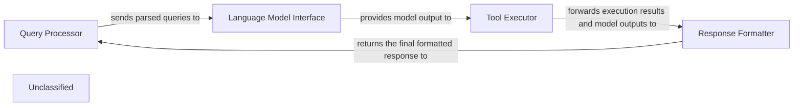
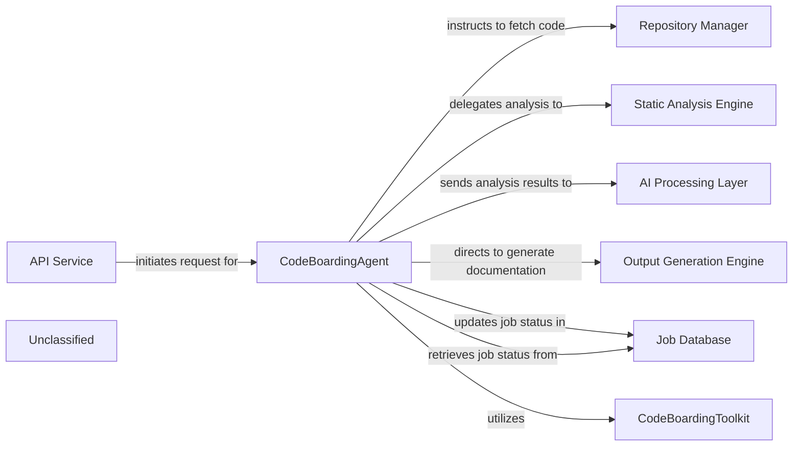
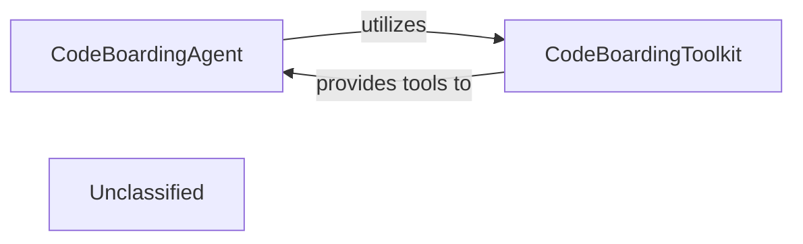
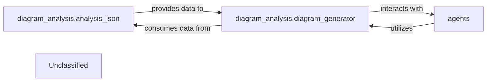
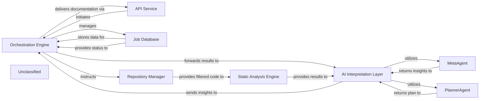
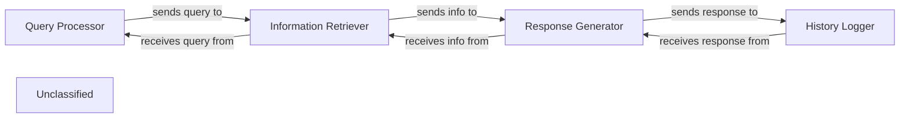
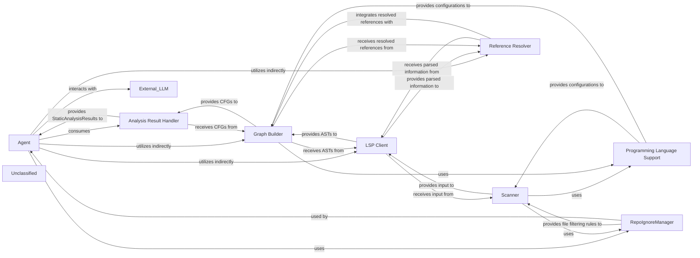

```mermaid
graph LR
    Orchestration_Engine["Orchestration Engine"]
    Static_Analysis_Engine["Static Analysis Engine"]
    AI_Processing_Layer["AI Processing Layer"]
    Output_Generation_Engine["Output Generation Engine"]
    Diagram_Generation_Service["Diagram Generation Service"]
    CodeBoardingAgent["CodeBoardingAgent"]
    CodeBoardingToolkit["CodeBoardingToolkit"]
    LLM_Providers["LLM Providers"]
    Unclassified["Unclassified"]
    Unclassified["Unclassified"]
    Orchestration_Engine -- "delegates tasks to" --> CodeBoardingAgent
    CodeBoardingAgent -- "utilizes" --> CodeBoardingToolkit
    CodeBoardingAgent -- "interacts with" --> LLM_Providers
    Static_Analysis_Engine -- "provides data to" --> CodeBoardingAgent
    CodeBoardingAgent -- "powers" --> AI_Processing_Layer
    AI_Processing_Layer -- "sends interpreted architectural data to" --> Output_Generation_Engine
    Output_Generation_Engine -- "provides diagram data to" --> Diagram_Generation_Service
    click Orchestration_Engine href "https://github.com/CodeBoarding/CodeBoarding/blob/main/.codeboarding/Orchestration_Engine.md" "Details"
    click Static_Analysis_Engine href "https://github.com/CodeBoarding/CodeBoarding/blob/main/.codeboarding/Static_Analysis_Engine.md" "Details"
    click AI_Processing_Layer href "https://github.com/CodeBoarding/CodeBoarding/blob/main/.codeboarding/AI_Processing_Layer.md" "Details"
    click Output_Generation_Engine href "https://github.com/CodeBoarding/CodeBoarding/blob/main/.codeboarding/Output_Generation_Engine.md" "Details"
    click Diagram_Generation_Service href "https://github.com/CodeBoarding/CodeBoarding/blob/main/.codeboarding/Diagram_Generation_Service.md" "Details"
    click CodeBoardingAgent href "https://github.com/CodeBoarding/CodeBoarding/blob/main/.codeboarding/CodeBoardingAgent.md" "Details"
    click CodeBoardingToolkit href "https://github.com/CodeBoarding/CodeBoarding/blob/main/.codeboarding/CodeBoardingToolkit.md" "Details"
```

## Details

The system's core architecture revolves around processing user queries through a sequence of specialized components. The Query Processor initiates the flow by parsing incoming requests. These parsed queries are then forwarded to the Language Model Interface, which handles communication with the underlying language model. The output from the language model, which may include instructions for tool usage, is then managed by the Tool Executor. This component is responsible for orchestrating the invocation of various tools, incorporating sophisticated decision-making and execution logic. Finally, the Response Formatter aggregates and structures the information from both the language model and tool executions to construct a coherent and user-friendly response, which is then returned to the Query Processor. This design ensures a clear separation of concerns, enabling efficient and adaptable query processing and tool integration.

### Query Processor
Handles incoming user queries, including parsing and initial validation.

**Related Classes/Methods**:

### Language Model Interface
Manages interactions with the underlying language model, sending prompts and receiving generated text.

**Related Classes/Methods**:

- `LLMClient:send_prompt`

### Tool Executor
Orchestrates the execution of specific tools, incorporating complex decision-making and execution flows based on the language model's output. It manages tool invocation, result retrieval, and potentially iterative processing or re-prompting.

**Related Classes/Methods**:

- <a href="https://github.com/CodeBoarding/CodeBoarding/blob/main/.codeboardingagents/tools/toolkit.py" target="_blank" rel="noopener noreferrer">`ToolRegistry:get_tool`</a>
- <a href="https://github.com/CodeBoarding/CodeBoarding/blob/main/.codeboardingagents/tools/base.py#L57-L96" target="_blank" rel="noopener noreferrer">`Tool:execute`:57-96</a>

### Response Formatter
Formats the final response to be sent back to the user, combining information from the language model and tool outputs.

**Related Classes/Methods**:

- `ResponseBuilder:build`

### Unclassified
Component for all unclassified files and utility functions (Utility functions/External Libraries/Dependencies)

**Related Classes/Methods**: _None_

### [FAQ](https://github.com/CodeBoarding/GeneratedOnBoardings/tree/main?tab=readme-ov-file#faq)

## Details

The CodeBoarding system is designed around a central `CodeBoardingAgent` that orchestrates the entire code analysis and documentation workflow. External requests are received via an `API Service`, which initiates the agent's operations. The `CodeBoardingAgent` first interacts with the `Repository Manager` to fetch source code. This code is then processed by the `Static Analysis Engine` for foundational analysis, with results subsequently interpreted by the `AI Processing Layer` using LLMs to derive high-level insights. Finally, the `Output Generation Engine` formats these insights into various documentation outputs. Throughout this process, the `CodeBoardingAgent` maintains job state and data integrity by interacting with a `Job Database` and utilizes a `CodeBoardingToolkit` for specialized analytical tasks.

### CodeBoardingAgent [[Expand]](./CodeBoardingAgent.md)
The primary orchestrator for all code analysis and documentation generation tasks. It manages the overall workflow, delegates specific analytical and generative tasks, and coordinates the sequence of operations from code retrieval to final documentation.

**Related Classes/Methods**:

- <a href="https://github.com/CodeBoarding/CodeBoarding/blob/main/.codeboardingagents/agent.py" target="_blank" rel="noopener noreferrer">`agents.agent.CodeBoardingAgent`</a>

### API Service
The external entry point for analysis requests, responsible for receiving user commands and initiating the code analysis workflow within the system.

**Related Classes/Methods**:

- `conceptual.APIService`

### Repository Manager
Manages the fetching and preparation of source code from various repositories, making it available for subsequent analysis steps.

**Related Classes/Methods**:

- `repo_utils.RepositoryManager`:1-10

### Static Analysis Engine [[Expand]](./Static_Analysis_Engine.md)
Performs foundational code analysis, extracting structural, syntactic, and semantic information from the source code.

**Related Classes/Methods**:

- <a href="https://github.com/CodeBoarding/CodeBoarding/blob/main/.codeboardingstatic_analyzer/scanner.py" target="_blank" rel="noopener noreferrer">`static_analyzer.scanner.StaticAnalysisEngine`</a>

### AI Processing Layer [[Expand]](./AI_Processing_Layer.md)
Utilizes Large Language Models (LLMs) to interpret the results from the Static Analysis Engine, generating higher-level insights, summaries, and contextual understanding of the code.

**Related Classes/Methods**:

- `conceptual.AIProcessingLayer`:1-10

### Output Generation Engine [[Expand]](./Output_Generation_Engine.md)
Formats the interpreted data and insights into various desired documentation outputs, such as Markdown, diagrams (e.g., Mermaid.js), or other structured formats.

**Related Classes/Methods**:

- <a href="https://github.com/CodeBoarding/CodeBoarding/blob/main/.codeboardingoutput_generators/__init__.py" target="_blank" rel="noopener noreferrer">`output_generators.OutputGenerationEngine`</a>

### Job Database
Persists the state of ongoing analysis jobs, stores intermediate results, and archives final documentation, ensuring job tracking and data integrity.

**Related Classes/Methods**:

- `conceptual.JobDatabase`:1-10

### CodeBoardingToolkit [[Expand]](./CodeBoardingToolkit.md)
Provides a collection of specialized tools and utilities that the CodeBoardingAgent leverages to perform specific operations, enhancing its capabilities.

**Related Classes/Methods**:

- <a href="https://github.com/CodeBoarding/CodeBoarding/blob/main/.codeboardingagents/tools/toolkit.py#L20-L117" target="_blank" rel="noopener noreferrer">`agents.tools.toolkit.CodeBoardingToolkit`:20-117</a>

### Unclassified
Component for all unclassified files and utility functions (Utility functions/External Libraries/Dependencies)

**Related Classes/Methods**: _None_

### [FAQ](https://github.com/CodeBoarding/GeneratedOnBoardings/tree/main?tab=readme-ov-file#faq)

## Details

The `CodeBoardingAgent` acts as the intelligent core of the code inspection subsystem, orchestrating the analysis process. It leverages the `CodeBoardingToolkit` to access a suite of specialized tools for in-depth code examination. This interaction allows the agent to dynamically select and apply the most relevant analysis capabilities, transforming raw code data into structured insights. The `CodeBoardingToolkit`, in turn, provides the foundational static analysis functionalities, making it a critical dependency for the agent's operations.

### CodeBoardingAgent [[Expand]](./CodeBoardingAgent.md)
This component acts as the orchestrator for code inspection. It interprets the specific requirements for a code analysis task, intelligently selects and applies the necessary tools from the `CodeBoardingToolkit`, and then synthesizes the raw analysis results into a structured report or actionable data. It embodies the "AI Interpretation Layer" aspect by making decisions on how to analyze code.

**Related Classes/Methods**:

- <a href="https://github.com/CodeBoarding/CodeBoarding/blob/main/.codeboardingagents/agent.py#L36-L341" target="_blank" rel="noopener noreferrer">`CodeBoardingAgent`:36-341</a>

### CodeBoardingToolkit [[Expand]](./CodeBoardingToolkit.md)
This component is a library of specialized utilities and functionalities designed for in-depth code analysis. It provides the foundational capabilities for parsing code constructs, identifying patterns, extracting semantic information, and preparing code snippets for further processing. It serves as the "Static Analysis Engine" component, offering the granular tools for code examination.

**Related Classes/Methods**:

- <a href="https://github.com/CodeBoarding/CodeBoarding/blob/main/.codeboardingagents/tools/toolkit.py#L20-L117" target="_blank" rel="noopener noreferrer">`CodeBoardingToolkit`:20-117</a>

### Unclassified
Component for all unclassified files and utility functions (Utility functions/External Libraries/Dependencies)

**Related Classes/Methods**: _None_

### [FAQ](https://github.com/CodeBoarding/GeneratedOnBoardings/tree/main?tab=readme-ov-file#faq)

## Details

The system's architecture is centered around the `diagram_analysis` subsystem, which comprises `analysis_json` for data preparation and `diagram_generator` for visual output. A newly integrated `agents` component introduces intelligent agent capabilities, exhibiting a strong, bidirectional interaction with the `diagram_analysis` components. The `analysis_json` component processes raw architectural data into a structured format, which is then consumed by the `diagram_generator` to create visual representations. The `agents` component, responsible for agent behavior and orchestration, either provides input to the diagram generation process or leverages the diagram analysis for its operations, indicating a tightly coupled relationship for enhanced system understanding and control.

### diagram_analysis.analysis_json
This component is responsible for processing and structuring raw architectural data into a standardized, machine-readable format (likely JSON). It acts as a crucial data preparation layer, ensuring that the input for diagram generation is consistent and well-formed.

**Related Classes/Methods**:

- <a href="https://github.com/CodeBoarding/CodeBoarding/blob/main/.codeboardingdiagram_analysis/analysis_json.py" target="_blank" rel="noopener noreferrer">`diagram_analysis.analysis_json`</a>

### diagram_analysis.diagram_generator
This is the core engine of the subsystem, tasked with taking the structured architectural data (prepared by `analysis_json`) and transforming it into a visual diagram format. It likely leverages external tools like Mermaid.js for rendering the visual output. It also interacts with the `agents` component, potentially to visualize agent-related information or to be driven by agent decisions.

**Related Classes/Methods**:

- <a href="https://github.com/CodeBoarding/CodeBoarding/blob/main/.codeboardingdiagram_analysis/diagram_generator.py" target="_blank" rel="noopener noreferrer">`diagram_analysis.diagram_generator`</a>

### agents
This component encapsulates the core logic for various agents within the system. It defines agent behavior, manages their state, and orchestrates their interactions. It leverages `langchain_core` for foundational AI functionalities and interacts with `diagram_analysis` for visualization or analysis purposes, potentially providing data to or receiving instructions from the diagram generation process.

**Related Classes/Methods**:

- <a href="https://github.com/CodeBoarding/CodeBoarding/blob/main/.codeboardingagents/agent.py" target="_blank" rel="noopener noreferrer">`agents.agent`</a>

### Unclassified
This component serves as a placeholder for all unclassified files, utility functions, and external libraries/dependencies that support the primary components but are not central to the core architectural flow.

**Related Classes/Methods**:

- `unclassified.code`

### Unclassified
Component for all unclassified files and utility functions (Utility functions/External Libraries/Dependencies)

**Related Classes/Methods**: _None_

### [FAQ](https://github.com/CodeBoarding/GeneratedOnBoardings/tree/main?tab=readme-ov-file#faq)

## Details

The system's architecture is centered around an `Orchestration Engine` that manages the entire code analysis and documentation generation workflow. It interfaces with an `API Service` for job initiation and delivery, and a `Job Database` for status management. Code acquisition and filtering are handled by the `Repository Manager`, which then feeds into the `Static Analysis Engine` for initial code analysis. The core intelligence resides in the `AI Interpretation Layer`, which, leveraging a recently updated agent framework, employs specialized `MetaAgent` and `PlannerAgent` components to derive architectural insights and strategic analysis plans from the static analysis results. These insights are then relayed back to the `Orchestration Engine` for final documentation generation and delivery.

### Orchestration Engine [[Expand]](./Orchestration_Engine.md)
The central control unit managing the entire code analysis and documentation generation pipeline. It coordinates the execution flow, from static analysis to AI interpretation and final output generation.

**Related Classes/Methods**:

### API Service
Handles external job requests and delivers final documentation.

**Related Classes/Methods**:

- `API Service`

### Job Database
Stores and manages job status and metadata.

**Related Classes/Methods**:

- `Job Database`

### Repository Manager
Responsible for fetching code from repositories and managing file and directory exclusions based on `.gitignore` patterns and default ignored paths.

**Related Classes/Methods**:

- `Repository Manager`:1-10

### Static Analysis Engine [[Expand]](./Static_Analysis_Engine.md)
Performs static analysis on the provided code, receiving a filtered set of files from the Repository Manager.

**Related Classes/Methods**:

- `Static Analysis Engine`:1-10

### AI Interpretation Layer
Interprets static analysis results and generates insights, encompassing specialized agents like `MetaAgent` and `PlannerAgent`. This layer is now built upon a significantly modified agent framework, impacting the internal workings and interactions of its constituent agents.

**Related Classes/Methods**:

- <a href="https://github.com/CodeBoarding/CodeBoarding/blob/main/.codeboardingagents/agent.py" target="_blank" rel="noopener noreferrer">`AI Interpretation Layer`</a>

### MetaAgent
Analyzes project-level metadata to extract high-level architectural context, project type, domain, and technological biases, guiding subsequent analysis and interpretation. Its behavior is now influenced by the updated agent framework in `agents/agent.py`.

**Related Classes/Methods**:

- <a href="https://github.com/CodeBoarding/CodeBoarding/blob/main/.codeboardingagents/agent.py" target="_blank" rel="noopener noreferrer">`MetaAgent`</a>

### PlannerAgent
Generates a strategic plan for deeper code analysis based on initial analysis and metadata, identifying key components for detailed examination and determining their expansion scope. Its design and behavior are now influenced by the updated agent framework in `agents/agent.py`.

**Related Classes/Methods**:

- <a href="https://github.com/CodeBoarding/CodeBoarding/blob/main/.codeboardingagents/agent.py" target="_blank" rel="noopener noreferrer">`PlannerAgent`</a>

### Unclassified
Component for all unclassified files and utility functions (Utility functions/External Libraries/Dependencies)

**Related Classes/Methods**: _None_

### [FAQ](https://github.com/CodeBoarding/GeneratedOnBoardings/tree/main?tab=readme-ov-file#faq)

## Details

This graph represents the core functionality of a system that processes user queries, generates responses using a language model, and stores interaction history. The main flow involves receiving a query, retrieving relevant information, generating a response, and then saving the interaction. Its purpose is to provide an interactive question-answering system with memory.

### Query Processor
Handles incoming user queries and prepares them for further processing.

**Related Classes/Methods**:

- `QueryHandler.process`

### Information Retriever
Fetches relevant information based on the processed query from a knowledge base.

**Related Classes/Methods**:

- `KnowledgeBase.retrieve`

### Response Generator
Utilizes a language model to generate a natural language response.

**Related Classes/Methods**:

- `LanguageModel.generate_response`

### History Logger
Stores the user query and the generated response for future reference.

**Related Classes/Methods**:

- <a href="https://github.com/CodeBoarding/CodeBoarding/blob/main/.codeboardingmonitoring/callbacks.py#L16-L166" target="_blank" rel="noopener noreferrer">`InteractionLogger.log`:16-166</a>

### Unclassified
Component for all unclassified files and utility functions (Utility functions/External Libraries/Dependencies)

**Related Classes/Methods**: _None_

### [FAQ](https://github.com/CodeBoarding/GeneratedOnBoardings/tree/main?tab=readme-ov-file#faq)

## Details

The system's core functionality revolves around the Agent component, which orchestrates code analysis and interaction. The process begins with the Scanner performing lexical analysis on files, with its scope refined by the RepoIgnoreManager. The LSP Client then provides detailed parsed information, including ASTs, which are used by the Reference Resolver to link symbolic references. Both ASTs and resolved references are fed into the Graph Builder to construct Control Flow Graphs. The Programming Language Support component provides essential language-specific configurations throughout these stages. All generated analysis data is managed by the Analysis Result Handler, which then provides StaticAnalysisResults to the Agent. The Agent utilizes these results, along with a CodeBoardingToolkit (which interacts with the LSP Client, Reference Resolver, and Graph Builder indirectly), and an external LLM to process prompts, perform actions, and generate intelligent responses, effectively driving the code understanding and interaction workflow.

### Agent [[Expand]](./Agent.md)
The `Agent` component, specifically `CodeBoardingAgent`, acts as the central orchestrator. It leverages static analysis results and a toolkit of specialized tools to interact with the codebase, process information using an LLM, and generate responses. It manages the overall workflow, including prompt processing, tool invocation, and response parsing.

**Related Classes/Methods**:

- <a href="https://github.com/CodeBoarding/CodeBoarding/blob/main/.codeboardingagents/agent.py#L36-L341" target="_blank" rel="noopener noreferrer">`agents.agent.CodeBoardingAgent`:36-341</a>

### Scanner
The `Scanner` initiates the process with lexical analysis, potentially on a filtered set of files determined by the `RepoIgnoreManager`.

**Related Classes/Methods**:

- <a href="https://github.com/CodeBoarding/CodeBoarding/blob/main/.codeboardingstatic_analyzer/__init__.py" target="_blank" rel="noopener noreferrer">`Scanner`</a>

### LSP Client
The `LSP Client` then provides rich parsed information, including Abstract Syntax Trees (ASTs), by interacting with external Language Servers.

**Related Classes/Methods**:

- <a href="https://github.com/CodeBoarding/CodeBoarding/blob/main/.codeboardingstatic_analyzer/lsp_client/client.py#L58-L1105" target="_blank" rel="noopener noreferrer">`LSPClient`:58-1105</a>

### Reference Resolver
This parsed data is crucial for the `Reference Resolver` to identify and link symbolic references within the code.

**Related Classes/Methods**:

- <a href="https://github.com/CodeBoarding/CodeBoarding/blob/main/.codeboardingstatic_analyzer/reference_resolve_mixin.py#L15-L151" target="_blank" rel="noopener noreferrer">`ReferenceResolver`:15-151</a>

### Graph Builder
Both the ASTs from the `LSP Client` and the resolved references from the `Reference Resolver` feed into the `Graph Builder`, which constructs Control Flow Graphs (CFGs).

**Related Classes/Methods**:

- `GraphBuilder`

### Programming Language Support
Throughout this process, the `Programming Language Support` component provides language-specific configurations and rules, ensuring accurate analysis.

**Related Classes/Methods**:

- `ProgrammingLanguageSupport`

### Analysis Result Handler
The `Analysis Result Handler` manages and stores the various outputs, such as CFGs and other static analysis results, making them accessible for further processing or consumption.

**Related Classes/Methods**:

- `AnalysisResultHandler`

### RepoIgnoreManager
The `RepoIgnoreManager` handles the logic for ignoring files and directories based on project-specific configurations, influencing the scope of analysis for other components.

**Related Classes/Methods**:

- <a href="https://github.com/CodeBoarding/CodeBoarding/blob/main/.codeboardingrepo_utils/ignore.py#L8-L107" target="_blank" rel="noopener noreferrer">`repo_utils.ignore.RepoIgnoreManager`:8-107</a>

### Unclassified
Component for all unclassified files and utility functions (Utility functions/External Libraries/Dependencies)

**Related Classes/Methods**: _None_

### [FAQ](https://github.com/CodeBoarding/GeneratedOnBoardings/tree/main?tab=readme-ov-file#faq)

## Details

The system's architecture is centered around the CodeBoardingAgent, which acts as the primary orchestrator for all code analysis and documentation generation tasks. The Orchestration Engine initiates and manages the overall workflow, delegating specific analytical and generative tasks to the CodeBoardingAgent. This agent, in turn, leverages the Static Analysis Engine for structured code data and utilizes an integrated CodeBoardingToolkit to perform detailed code inspections. For intelligent interpretation and content generation, the CodeBoardingAgent interacts directly with various LLM Providers, forming the core of the AI Processing Layer. Finally, the processed insights are passed to the Output Generation Engine and subsequently to the Diagram Generation Service for comprehensive documentation and visual representation.

### Orchestration Engine [[Expand]](./Orchestration_Engine.md)
The central control unit managing the entire code analysis and documentation generation pipeline. It coordinates the execution flow, from static analysis to AI interpretation and final output generation, primarily by delegating to the `CodeBoardingAgent`.

**Related Classes/Methods**:

- <a href="https://github.com/CodeBoarding/CodeBoarding/blob/main/.codeboardingagents/meta_agent.py" target="_blank" rel="noopener noreferrer">`agents.meta_agent.MetaAgent`</a>
- <a href="https://github.com/CodeBoarding/CodeBoarding/blob/main/.codeboardingagents/planner_agent.py" target="_blank" rel="noopener noreferrer">`agents.planner_agent.PlannerAgent`</a>
- <a href="https://github.com/CodeBoarding/CodeBoarding/blob/main/.codeboardingagents/agent.py" target="_blank" rel="noopener noreferrer">`agents.agent.CodeBoardingAgent`</a>

### Static Analysis Engine [[Expand]](./Static_Analysis_Engine.md)
Responsible for parsing source code, building Abstract Syntax Trees (ASTs), generating Control Flow Graphs (CFGs), and applying adaptive clustering algorithms to abstract these graphs into logical architectural components. It now also incorporates a filtering mechanism to refine the scope of code analysis based on ignore rules, providing structured, clustered, and filtered code representations.

**Related Classes/Methods**:

- <a href="https://github.com/CodeBoarding/CodeBoarding/blob/main/.codeboardingstatic_analyzer" target="_blank" rel="noopener noreferrer">`static_analyzer`</a>
- <a href="https://github.com/CodeBoarding/CodeBoarding/blob/main/.codeboardingstatic_analyzer/graph.py" target="_blank" rel="noopener noreferrer">`static_analyzer.graph.Graph`</a>
- <a href="https://github.com/CodeBoarding/CodeBoarding/blob/main/.codeboardingrepo_utils/ignore.py" target="_blank" rel="noopener noreferrer">`repo_utils/ignore.py`</a>

### AI Processing Layer [[Expand]](./AI_Processing_Layer.md)
This integrated layer processes structured code data using Large Language Models (LLMs) to derive architectural insights, identify components, and understand relationships. It relies on the `CodeBoardingAgent` for prompt generation, LLM interaction, and response parsing.

**Related Classes/Methods**:

- <a href="https://github.com/CodeBoarding/CodeBoarding/blob/main/.codeboardingagents/abstraction_agent.py" target="_blank" rel="noopener noreferrer">`agents.abstraction_agent.AbstractionAgent`</a>
- <a href="https://github.com/CodeBoarding/CodeBoarding/blob/main/.codeboardingagents/details_agent.py" target="_blank" rel="noopener noreferrer">`agents.details_agent.DetailsAgent`</a>
- <a href="https://github.com/CodeBoarding/CodeBoarding/blob/main/.codeboardingagents/prompts/prompt_factory.py" target="_blank" rel="noopener noreferrer">`agents.prompts.prompt_factory.PromptFactory`</a>
- <a href="https://github.com/CodeBoarding/CodeBoarding/blob/main/.codeboardingagents/llm_config.py#L14-L52" target="_blank" rel="noopener noreferrer">`agents.llm_config.LLMConfig`:14-52</a>
- <a href="https://github.com/CodeBoarding/CodeBoarding/blob/main/.codeboardingagents/agent.py" target="_blank" rel="noopener noreferrer">`agents.agent.CodeBoardingAgent`</a>

### Output Generation Engine [[Expand]](./Output_Generation_Engine.md)
Takes the structured architectural insights from the AI Processing Layer and formats them into various output types, such as documentation files (Markdown, JSON), reports, or raw data suitable for diagram generation.

**Related Classes/Methods**:

- <a href="https://github.com/CodeBoarding/CodeBoarding/blob/main/.codeboardingoutput_generators" target="_blank" rel="noopener noreferrer">`output_generators`</a>

### Diagram Generation Service [[Expand]](./Diagram_Generation_Service.md)
Specializes in converting structured architectural data into visual diagrams, potentially using tools like Mermaid.js. It enhances comprehension by providing interactive and visual representations of the analyzed architecture.

**Related Classes/Methods**:

- <a href="https://github.com/CodeBoarding/CodeBoarding/blob/main/.codeboardingdiagram_analysis" target="_blank" rel="noopener noreferrer">`diagram_analysis`</a>

### CodeBoardingAgent [[Expand]](./CodeBoardingAgent.md)
The primary orchestrator for all code analysis and documentation generation tasks, managing the overall workflow and delegating specific analytical and generative tasks. It leverages the Static Analysis Engine, utilizes the CodeBoardingToolkit, and interacts with LLM Providers.

**Related Classes/Methods**:

- <a href="https://github.com/CodeBoarding/CodeBoarding/blob/main/.codeboardingagents/agent.py" target="_blank" rel="noopener noreferrer">`agents.agent.CodeBoardingAgent`</a>

### CodeBoardingToolkit [[Expand]](./CodeBoardingToolkit.md)
An integrated toolkit utilized by the CodeBoardingAgent to perform detailed code inspections.

**Related Classes/Methods**:

- <a href="https://github.com/CodeBoarding/CodeBoarding/blob/main/.codeboardingagents/tools/toolkit.py#L20-L117" target="_blank" rel="noopener noreferrer">`agents.tools.toolkit.CodeBoardingToolkit`:20-117</a>

### LLM Providers
Provides Large Language Models for intelligent interpretation and content generation, interacting with the CodeBoardingAgent as part of the AI Processing Layer.

**Related Classes/Methods**:

- <a href="https://github.com/CodeBoarding/CodeBoarding/blob/main/.codeboardingagents/llm_config.py#L14-L52" target="_blank" rel="noopener noreferrer">`agents.llm_config.LLMConfig`:14-52</a>

### Unclassified
Component for all unclassified files and utility functions (Utility functions/External Libraries/Dependencies)

**Related Classes/Methods**:

- `utils.helpers`

### Unclassified
Component for all unclassified files and utility functions (Utility functions/External Libraries/Dependencies)

**Related Classes/Methods**: _None_

### [FAQ](https://github.com/CodeBoarding/GeneratedOnBoardings/tree/main?tab=readme-ov-file#faq)

