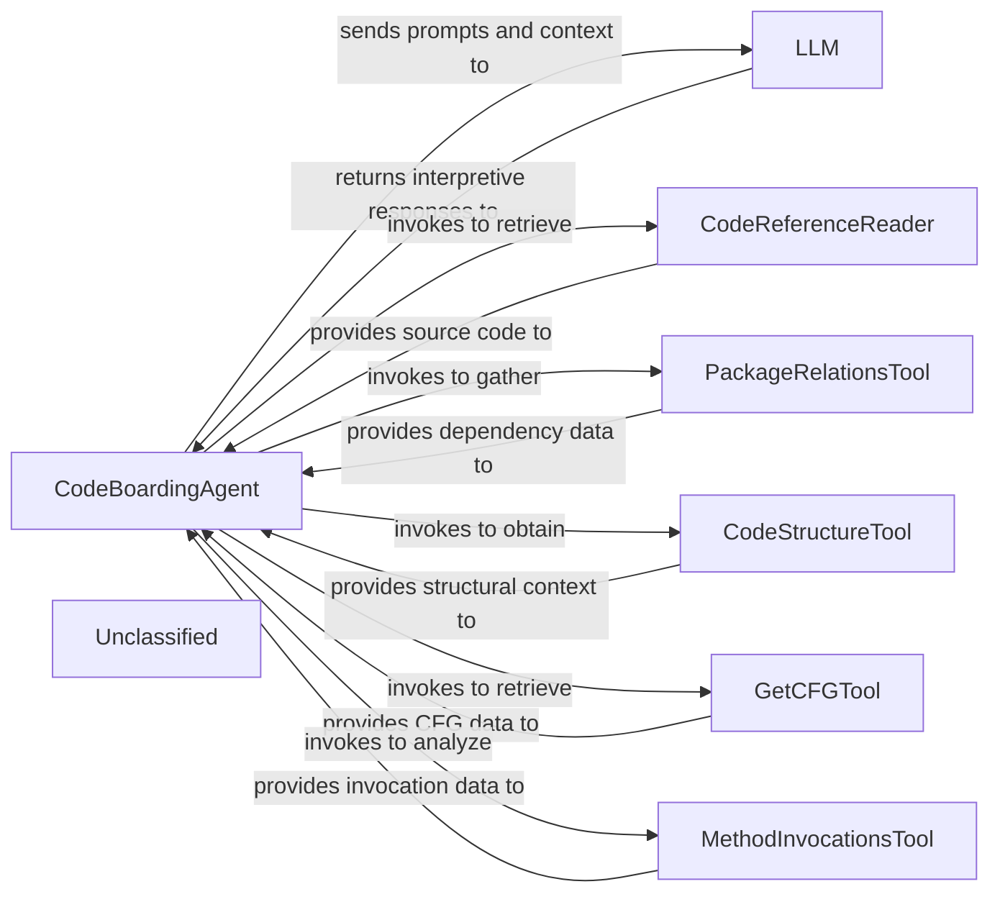
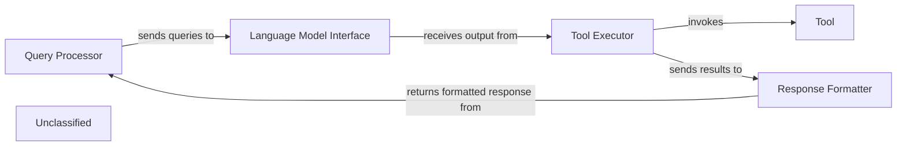
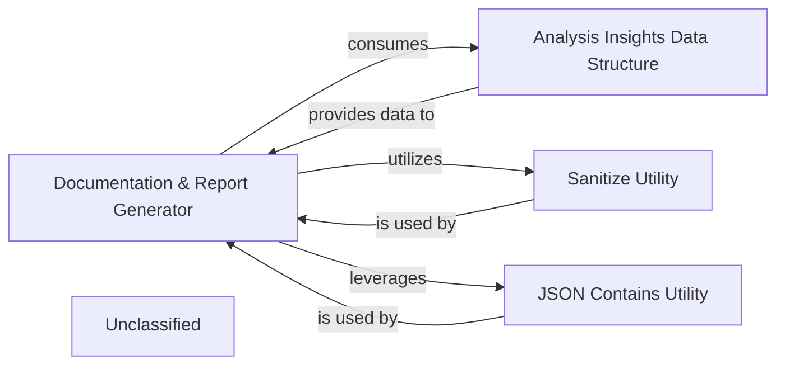
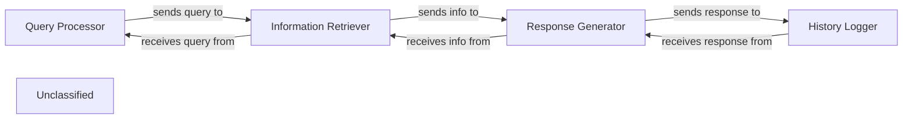
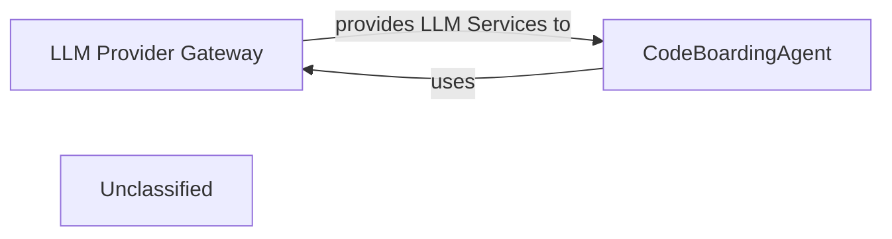
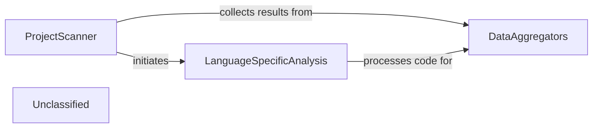

```mermaid
graph LR
    Repository_Manager["Repository Manager"]
    Static_Analysis_Engine["Static Analysis Engine"]
    LLM_Prompt_Factory["LLM Prompt Factory"]
    AI_Interpretation_Layer["AI Interpretation Layer"]
    LLM_Provider_Gateway["LLM Provider Gateway"]
    Diagram_Generation_Engine["Diagram Generation Engine"]
    Documentation_Report_Generator["Documentation & Report Generator"]
    Unclassified["Unclassified"]
    Repository_Manager -- "Provides Source Code" --> Static_Analysis_Engine
    Static_Analysis_Engine -- "Outputs CFG Data & Metrics" --> AI_Interpretation_Layer
    AI_Interpretation_Layer -- "Requests Prompts" --> LLM_Prompt_Factory
    LLM_Prompt_Factory -- "Supplies LLM Prompts" --> AI_Interpretation_Layer
    AI_Interpretation_Layer -- "Sends LLM Queries" --> LLM_Provider_Gateway
    LLM_Provider_Gateway -- "Returns LLM Responses" --> AI_Interpretation_Layer
    AI_Interpretation_Layer -- "Generates Architectural Insights" --> Diagram_Generation_Engine
    AI_Interpretation_Layer -- "Produces Analysis Results" --> Documentation_Report_Generator
    Diagram_Generation_Engine -- "Embeds Diagrams" --> Documentation_Report_Generator
    click Repository_Manager href "https://github.com/CodeBoarding/CodeBoarding/blob/main/.codeboarding/Repository_Manager.md" "Details"
    click Static_Analysis_Engine href "https://github.com/CodeBoarding/CodeBoarding/blob/main/.codeboarding/Static_Analysis_Engine.md" "Details"
    click LLM_Prompt_Factory href "https://github.com/CodeBoarding/CodeBoarding/blob/main/.codeboarding/LLM_Prompt_Factory.md" "Details"
    click AI_Interpretation_Layer href "https://github.com/CodeBoarding/CodeBoarding/blob/main/.codeboarding/AI_Interpretation_Layer.md" "Details"
    click LLM_Provider_Gateway href "https://github.com/CodeBoarding/CodeBoarding/blob/main/.codeboarding/LLM_Provider_Gateway.md" "Details"
    click Diagram_Generation_Engine href "https://github.com/CodeBoarding/CodeBoarding/blob/main/.codeboarding/Diagram_Generation_Engine.md" "Details"
    click Documentation_Report_Generator href "https://github.com/CodeBoarding/CodeBoarding/blob/main/.codeboarding/Documentation_Report_Generator.md" "Details"
```

## Details

The `CodeBoardingAgent` acts as the central intelligence, orchestrating the entire code interpretation process. It interacts with the `LLM` to process and interpret architectural patterns from code. To gather the necessary context for the `LLM`, the `CodeBoardingAgent` leverages a suite of specialized tools: `CodeReferenceReader` for source code retrieval, `PackageRelationsTool` for dependency analysis, `CodeStructureTool` for understanding code organization, `GetCFGTool` for control flow analysis, and `MethodInvocationsTool` for method interaction insights. This modular design allows the `CodeBoardingAgent` to dynamically gather and feed comprehensive code context to the `LLM`, enabling robust architectural analysis and insight generation.

### CodeBoardingAgent
The central orchestrator of the AI interpretation process. It manages LLM selection, prompt engineering, tool invocation for gathering context, and parsing of LLM responses. It translates raw static analysis data into actionable architectural insights.

**Related Classes/Methods**:

- <a href="https://github.com/CodeBoarding/CodeBoarding/blob/main/.codeboardingagents/agent.py" target="_blank" rel="noopener noreferrer">`CodeBoardingAgent`</a>

### LLM
The core AI engine responsible for performing the actual interpretation of code context. It identifies architectural patterns, generates explanations, and responds to prompts provided by the `CodeBoardingAgent`.

**Related Classes/Methods**:

- <a href="https://github.com/CodeBoarding/CodeBoarding/blob/main/.codeboardingagents/agent.py#L86-L153" target="_blank" rel="noopener noreferrer">`LLM`:86-153</a>

### CodeReferenceReader
A specialized tool that abstracts the retrieval of source code based on fully qualified names. It provides the `CodeBoardingAgent` with specific code snippets for detailed LLM analysis.

**Related Classes/Methods**:

- <a href="https://github.com/CodeBoarding/CodeBoarding/blob/main/.codeboardingagents/tools/read_source.py#L26-L114" target="_blank" rel="noopener noreferrer">`CodeReferenceReader`:26-114</a>

### PackageRelationsTool
A specialized tool that abstracts the analysis of package dependencies. It supplies the `CodeBoardingAgent` with data on how modules and packages relate, enabling architectural pattern identification.

**Related Classes/Methods**:

- <a href="https://github.com/CodeBoarding/CodeBoarding/blob/main/.codeboardingagents/tools/read_packages.py#L29-L69" target="_blank" rel="noopener noreferrer">`PackageRelationsTool`:29-69</a>

### CodeStructureTool
A specialized tool that abstracts the understanding of code structure, such as class hierarchies and internal organization. It provides structural context to the `CodeBoardingAgent` for LLM interpretation.

**Related Classes/Methods**:

- <a href="https://github.com/CodeBoarding/CodeBoarding/blob/main/.codeboardingagents/tools/read_structure.py#L17-L58" target="_blank" rel="noopener noreferrer">`CodeStructureTool`:17-58</a>

### GetCFGTool
A specialized tool that abstracts the retrieval of Control Flow Graphs (CFGs). It provides the `CodeBoardingAgent` with data on execution paths, enabling the `LLM` to interpret behavioral patterns.

**Related Classes/Methods**:

- <a href="https://github.com/CodeBoarding/CodeBoarding/blob/main/.codeboardingagents/tools/read_cfg.py#L11-L68" target="_blank" rel="noopener noreferrer">`GetCFGTool`:11-68</a>

### MethodInvocationsTool
A specialized tool that abstracts the analysis of method invocation patterns. It delivers data on how methods interact, assisting the `CodeBoardingAgent` and `LLM` in understanding component interactions and data flow.

**Related Classes/Methods**:

- <a href="https://github.com/CodeBoarding/CodeBoarding/blob/main/.codeboardingagents/tools/get_method_invocations.py#L17-L54" target="_blank" rel="noopener noreferrer">`MethodInvocationsTool`:17-54</a>

### Unclassified
Component for all unclassified files and utility functions (Utility functions/External Libraries/Dependencies)

**Related Classes/Methods**: _None_

### [FAQ](https://github.com/CodeBoarding/GeneratedOnBoardings/tree/main?tab=readme-ov-file#faq)

## Details

This graph represents the core functionality of a system that processes user queries, generates responses using a language model, and interacts with external tools. The main flow involves receiving a query, parsing it, invoking a language model to determine the appropriate action, executing that action (which might involve using a tool), and finally formatting and returning the response to the user. Its purpose is to provide a flexible and extensible framework for building AI-powered applications that can understand and act upon user requests.

### Query Processor
Handles incoming user queries, including parsing and initial validation.

**Related Classes/Methods**:

- `QueryParser:parse`

### Language Model Interface
Manages interactions with the underlying language model, sending prompts and receiving generated text.

**Related Classes/Methods**:

- `LLMClient:send_prompt`
- `LLMClient:receive_response`

### Tool Executor
Executes specific tools based on the language model's output, handling tool invocation and result retrieval.

**Related Classes/Methods**:

- `ToolRegistry:get_tool`
- `Tool:execute`

### Response Formatter
Formats the final response to be sent back to the user, potentially combining information from the language model and tool outputs.

**Related Classes/Methods**:

- `ResponseBuilder:build`

### Unclassified
Component for all unclassified files and utility functions (Utility functions/External Libraries/Dependencies)

**Related Classes/Methods**: _None_

### [FAQ](https://github.com/CodeBoarding/GeneratedOnBoardings/tree/main?tab=readme-ov-file#faq)

## Details

This system is designed to process analysis insights and generate comprehensive documentation and reports, primarily in Markdown format. The main flow involves the 'Documentation & Report Generator' component taking structured analysis data from the 'Analysis Insights Data Structure', utilizing the 'Sanitize Utility' for data cleaning, and leveraging the 'JSON Contains Utility' to handle JSON content. Its purpose is to transform raw analysis findings into readable and well-formatted reports.

### Documentation & Report Generator [[Expand]](./Documentation_Report_Generator.md)
This is the core component of the subsystem, responsible for taking processed analysis insights and transforming them into various documentation formats, primarily Markdown. It orchestrates the generation of textual summaries, structured data, and embedded diagrams (e.g., Mermaid.js diagrams) to create comprehensive reports.

**Related Classes/Methods**:

- <a href="https://github.com/CodeBoarding/CodeBoarding/blob/main/.codeboardingoutput_generators/markdown.py" target="_blank" rel="noopener noreferrer">`output_generators.markdown`</a>

### Analysis Insights Data Structure
This component defines the standardized data model for the insights derived from the AI's analysis. It encapsulates information about identified components, their relationships, and descriptive details, serving as the crucial input for the Documentation & Report Generator.

**Related Classes/Methods**:

- <a href="https://github.com/CodeBoarding/CodeBoarding/blob/main/.codeboardingagents/agent_responses.py" target="_blank" rel="noopener noreferrer">`agents.agent_responses`</a>

### Sanitize Utility
Provides essential utility functions for cleaning and validating data, such as names and strings, before they are incorporated into the final documentation. This ensures data integrity and proper formatting within the generated reports.

**Related Classes/Methods**:

- <a href="https://github.com/CodeBoarding/CodeBoarding/blob/main/.codeboardingoutput_generators/__init__.py" target="_blank" rel="noopener noreferrer">`output_generators.sanitize`</a>

### JSON Contains Utility
This utility is responsible for detecting and managing JSON content within various data sources or files. It likely assists the Documentation & Report Generator in identifying and correctly embedding or referencing JSON-formatted data within the documentation.

**Related Classes/Methods**:

- <a href="https://github.com/CodeBoarding/CodeBoarding/blob/main/.codeboardingutils.py#L37-L41" target="_blank" rel="noopener noreferrer">`utils.contains_json`:37-41</a>

### Unclassified
Component for all unclassified files and utility functions (Utility functions/External Libraries/Dependencies)

**Related Classes/Methods**: _None_

### [FAQ](https://github.com/CodeBoarding/GeneratedOnBoardings/tree/main?tab=readme-ov-file#faq)

## Details

This graph represents the core functionality of a system that processes user queries, generates responses using a language model, and stores interaction history. The main flow involves receiving a query, retrieving relevant information, generating a response, and then saving the interaction. Its purpose is to provide an interactive question-answering system with memory.

### Query Processor
Handles incoming user queries and prepares them for further processing.

**Related Classes/Methods**:

- `QueryHandler.process`

### Information Retriever
Fetches relevant information based on the processed query from a knowledge base.

**Related Classes/Methods**:

- `KnowledgeBase.retrieve`

### Response Generator
Utilizes a language model to generate a natural language response.

**Related Classes/Methods**:

- `LanguageModel.generate_response`

### History Logger
Stores the user query and the generated response for future reference.

**Related Classes/Methods**:

- `InteractionLogger.log`

### Unclassified
Component for all unclassified files and utility functions (Utility functions/External Libraries/Dependencies)

**Related Classes/Methods**: _None_

### [FAQ](https://github.com/CodeBoarding/GeneratedOnBoardings/tree/main?tab=readme-ov-file#faq)

## Details

The system's core functionality revolves around the CodeBoardingAgent within the AI Interpretation Layer, which intelligently processes code and generates documentation. This agent relies heavily on the LLM Provider Gateway to abstract and manage interactions with various Large Language Models. The gateway ensures a standardized interface for LLM communication, handling provider-specific complexities, authentication, and response parsing, thereby enabling the CodeBoardingAgent to focus on its primary task of code interpretation and documentation generation.

### LLM Provider Gateway [[Expand]](./LLM_Provider_Gateway.md)
Provides a unified and consistent API for the AI Interpretation Layer to interact with various Large Language Model providers. It encapsulates provider-specific APIs, manages authentication, executes API calls, parses responses into a standardized format, and implements error handling and retry logic. This component is crucial for abstracting away the complexities of different LLM services, allowing the rest of the system to interact with LLMs uniformly.

**Related Classes/Methods**: _None_

### CodeBoardingAgent
A key component within the AI Interpretation Layer responsible for orchestrating the code analysis and documentation generation process using LLMs. It relies on the LLM Provider Gateway to set up and configure the appropriate LLM instance for its operations, enabling it to interpret code, generate insights, and facilitate the creation of architectural documentation. This agent represents the intelligent core that leverages LLMs for understanding and transforming code.

**Related Classes/Methods**: _None_

### Unclassified
Component for all unclassified files and utility functions (Utility functions/External Libraries/Dependencies)

**Related Classes/Methods**: _None_

### [FAQ](https://github.com/CodeBoarding/GeneratedOnBoardings/tree/main?tab=readme-ov-file#faq)

## Details

This graph represents the core functionality of a system that processes user queries, generates responses using a language model, and stores interaction history. The main flow involves receiving a query, retrieving relevant information, generating a response, and then saving the interaction. Its purpose is to provide an interactive question-answering system with memory.

### Query Processor
Handles incoming user queries and prepares them for further processing.

**Related Classes/Methods**:

- `QueryHandler.process`

### Information Retriever
Fetches relevant information based on the processed query from a knowledge base.

**Related Classes/Methods**:

- `KnowledgeBase.retrieve`

### Response Generator
Utilizes a language model to generate a natural language response.

**Related Classes/Methods**:

- `LanguageModel.generate_response`

### History Logger
Stores the user query and the generated response for future reference.

**Related Classes/Methods**:

- `InteractionLogger.log`

### Unclassified
Component for all unclassified files and utility functions (Utility functions/External Libraries/Dependencies)

**Related Classes/Methods**: _None_

### [FAQ](https://github.com/CodeBoarding/GeneratedOnBoardings/tree/main?tab=readme-ov-file#faq)

## Details

The static analysis subsystem is centered around the ProjectScanner, which serves as the primary entry point for initiating code analysis. The ProjectScanner is responsible for identifying the programming languages present in a repository and preparing the codebase for deeper inspection. It delegates the actual file traversal and initial language identification to external tools. Following this, the LanguageSpecificAnalysis component, represented by LSPClient and its specialized implementations, takes over to perform detailed parsing, AST generation, CFG construction, and metric extraction for each identified language. Finally, the DataAggregators, exemplified by AnalysisResult, collect and consolidate all the generated analysis data into a coherent and structured report, making it ready for further consumption or visualization. This architecture emphasizes a clear separation of concerns, with the ProjectScanner orchestrating the overall flow and LanguageSpecificAnalysis handling the intricate details of code understanding, all culminating in a unified output from DataAggregators.

### ProjectScanner
The orchestrator of the entire static analysis process. It initiates scanning, manages the flow of files, invokes language-specific parsing, and coordinates the collection of analysis results. It acts as the primary interface for the subsystem.

**Related Classes/Methods**:

- <a href="https://github.com/CodeBoarding/CodeBoarding/blob/main/.codeboardingstatic_analyzer/scanner.py" target="_blank" rel="noopener noreferrer">`static_analyzer.scanner.ProjectScanner`</a>

### LanguageSpecificAnalysis
This component represents the collective functionality for language-specific processing, including parsing source code into Abstract Syntax Trees (ASTs), generating Control Flow Graphs (CFGs), and extracting various code metrics. It leverages Language Server Protocol (LSP) clients for detailed language understanding.

**Related Classes/Methods**:

- <a href="https://github.com/CodeBoarding/CodeBoarding/blob/main/.codeboardingstatic_analyzer/lsp_client/client.py" target="_blank" rel="noopener noreferrer">`static_analyzer.lsp_client.client.LSPClient`</a>

### DataAggregators
Gathers and consolidates the diverse outputs from the language-specific analysis (ASTs, CFGs, metrics) into a unified, structured analysis report. This component ensures a consistent data format for downstream processing.

**Related Classes/Methods**:

- <a href="https://github.com/CodeBoarding/CodeBoarding/blob/main/.codeboardingstatic_analyzer/analysis_result.py" target="_blank" rel="noopener noreferrer">`static_analyzer.analysis_result.AnalysisResult`</a>

### Unclassified
Component for all unclassified files and utility functions (Utility functions/External Libraries/Dependencies)

**Related Classes/Methods**: _None_

### [FAQ](https://github.com/CodeBoarding/GeneratedOnBoardings/tree/main?tab=readme-ov-file#faq)

## Details

The CodeBoarding project is structured around a core `AI Interpretation Layer` that orchestrates the analysis of software repositories. This layer initiates the process by interacting with the `Repository Manager` to obtain source code. The retrieved code is then fed into the `Static Analysis Engine`, which extracts crucial structural information and Control Flow Graphs (CFGs). The `AI Interpretation Layer` leverages these static analysis results and dynamically generates prompts through the `LLM Prompt Factory` to query various Large Language Models via the `LLM Provider Gateway`. The insights derived from these LLM interactions are then passed to the `Diagram Generation Engine` for visual representation and to the `Documentation & Report Generator` for comprehensive textual outputs. This modular design ensures clear separation of concerns, facilitating maintainability and extensibility, and provides a robust framework for automated software architecture analysis and documentation.

### Repository Manager [[Expand]](./Repository_Manager.md)
Manages access to source code repositories, including fetching, cloning, and organizing project files for analysis.

**Related Classes/Methods**:

- <a href="https://github.com/CodeBoarding/CodeBoarding/blob/main/.codeboardingrepo_utils/__init__.py" target="_blank" rel="noopener noreferrer">`repo_utils.__init__.clone_repository`</a>

### Static Analysis Engine [[Expand]](./Static_Analysis_Engine.md)
Performs static analysis on the retrieved source code to extract structural information, control flow graphs (CFGs), and other code metrics.

**Related Classes/Methods**:

- <a href="https://github.com/CodeBoarding/CodeBoarding/blob/main/.codeboardingstatic_analyzer/scanner.py" target="_blank" rel="noopener noreferrer">`static_analyzer.scanner.ProjectScanner`</a>

### LLM Prompt Factory [[Expand]](./LLM_Prompt_Factory.md)
Centralized component for generating and managing LLM prompts, adapting to different LLM providers and specific analysis contexts.

**Related Classes/Methods**:

- <a href="https://github.com/CodeBoarding/CodeBoarding/blob/main/.codeboardingagents/prompts/abstract_prompt_factory.py" target="_blank" rel="noopener noreferrer">`agents.prompts.abstract_prompt_factory.AbstractPromptFactory`</a>

### AI Interpretation Layer [[Expand]](./AI_Interpretation_Layer.md)
The core intelligence layer that orchestrates the analysis workflow, interprets static analysis results, and interacts with LLMs to derive architectural insights.

**Related Classes/Methods**:

- <a href="https://github.com/CodeBoarding/CodeBoarding/blob/main/.codeboardingagents/agent.py" target="_blank" rel="noopener noreferrer">`agents.agent.CodeBoardingAgent`</a>

### LLM Provider Gateway [[Expand]](./LLM_Provider_Gateway.md)
Provides a unified interface for interacting with various Large Language Model providers, handling API calls, authentication, and response parsing.

**Related Classes/Methods**:

- <a href="https://github.com/CodeBoarding/CodeBoarding/blob/main/.codeboardingagents/agent.py" target="_blank" rel="noopener noreferrer">`agents.agent.CodeBoardingAgent._initialize_llm`</a>

### Diagram Generation Engine [[Expand]](./Diagram_Generation_Engine.md)
Transforms interpreted architectural insights and data flow information into visual diagrams, primarily using tools like Mermaid.js.

**Related Classes/Methods**:

- <a href="https://github.com/CodeBoarding/CodeBoarding/blob/main/.codeboardingdiagram_analysis/diagram_generator.py" target="_blank" rel="noopener noreferrer">`diagram_analysis.diagram_generator.DiagramGenerator`</a>

### Documentation & Report Generator [[Expand]](./Documentation_Report_Generator.md)
Generates comprehensive documentation and reports based on the AI's analysis, including textual summaries, structured data, and embedded diagrams.

**Related Classes/Methods**:

- <a href="https://github.com/CodeBoarding/CodeBoarding/blob/main/.codeboardingoutput_generators/markdown.py" target="_blank" rel="noopener noreferrer">`output_generators.markdown`</a>

### Unclassified
Component for all unclassified files and utility functions (Utility functions/External Libraries/Dependencies)

**Related Classes/Methods**: _None_

### [FAQ](https://github.com/CodeBoarding/GeneratedOnBoardings/tree/main?tab=readme-ov-file#faq)

