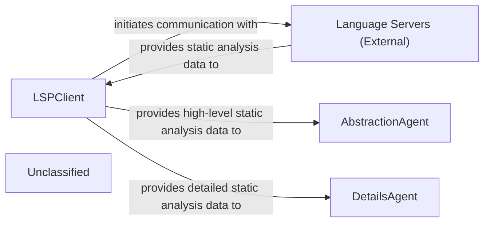
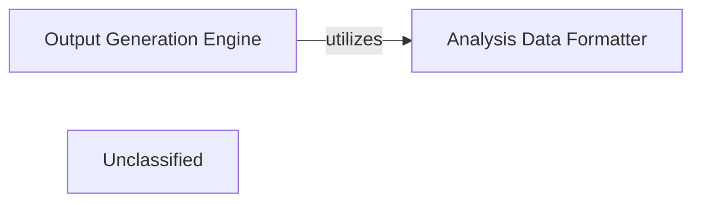
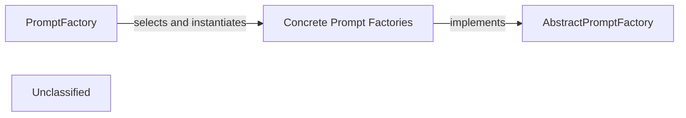
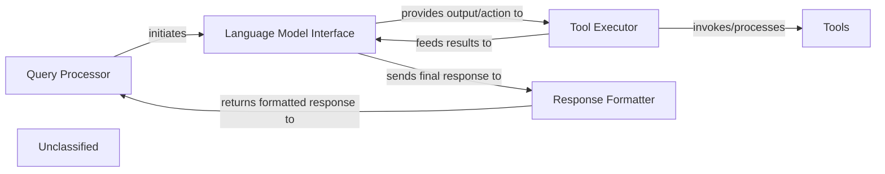
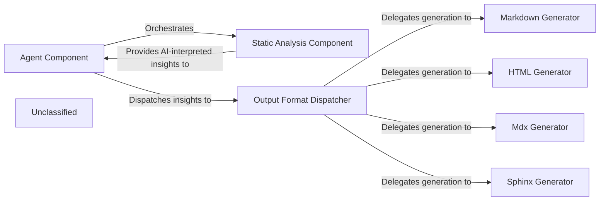
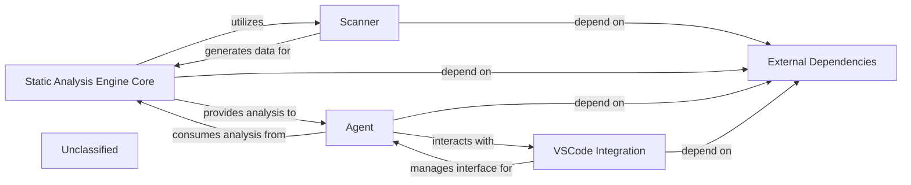
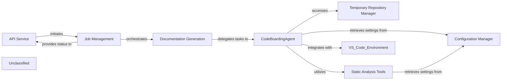
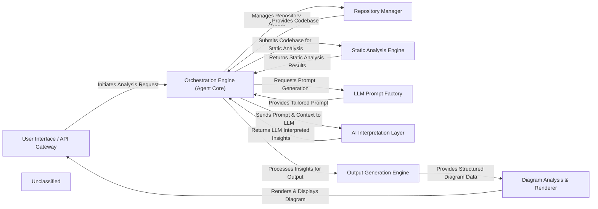

## Details

The system's primary function is to acquire and process static analysis data from codebases. The LSPClient acts as the central data acquisition hub, establishing and managing communication with external Language Servers via the Language Server Protocol. These Language Servers provide raw code intelligence, which the LSPClient then processes and makes available. This processed data is consumed by two specialized agents: the AbstractionAgent, which focuses on generating high-level architectural representations, and the DetailsAgent, which performs in-depth, granular analysis of specific code sections. The LSPClient also incorporates enhanced integration capabilities for environments like VSCode, optimizing its operation within development workflows. Project-wide external dependencies and packaging configurations are managed by the Unclassified component, supporting the overall system's operational integrity.

### LSPClient
Establishes and manages communication with external Language Servers using the Language Server Protocol (LSP). It orchestrates the collection of comprehensive static analysis data, including call graphs, class hierarchies, package relations, and symbol references. It filters source files and handles language-specific configurations, acting as a robust data acquisition layer. It also features enhanced integration with the VSCode environment, leveraging specific configurations and data structures for refined interaction within a VSCode context.

**Related Classes/Methods**:

- <a href="https://github.com/CodeBoarding/CodeBoarding/blob/main/.codeboardingstatic_analyzer/lsp_client/client.py#L58-L1097" target="_blank" rel="noopener noreferrer">`LSPClient`:58-1097</a>

### AbstractionAgent
Consumes high-level static analysis data provided by the LSPClient to identify major system components, their primary responsibilities, and interconnections, forming an abstract architectural representation. It distills complex codebases into understandable, high-level architectural views.

**Related Classes/Methods**:

- <a href="https://github.com/CodeBoarding/CodeBoarding/blob/main/.codeboardingagents/agent.py" target="_blank" rel="noopener noreferrer">`AbstractionAgent`</a>

### DetailsAgent
Utilizes detailed static analysis data from the LSPClient to perform granular analysis within specific architectural components or code sections. It delves into implementation details, identifies specific design patterns, explains the rationale behind code structures, and highlights areas of interest or concern.

**Related Classes/Methods**:

- <a href="https://github.com/CodeBoarding/CodeBoarding/blob/main/.codeboardingagents/agent.py" target="_blank" rel="noopener noreferrer">`DetailsAgent`</a>

### Language Servers (External)
External processes that provide static analysis capabilities for specific programming languages. They respond to LSP requests from the LSPClient with code intelligence data such as symbol definitions, references, call hierarchies, and type information.

**Related Classes/Methods**:

- `LSP_Protocol`:1-10

### Unclassified
Component for all unclassified files, utility functions, and external libraries/dependencies. This includes managing project dependencies and packaging configurations as defined in `setup.py`.

**Related Classes/Methods**:

- <a href="https://github.com/CodeBoarding/CodeBoarding/blob/main/.codeboardingsetup.py" target="_blank" rel="noopener noreferrer">`setup.py`</a>

### Unclassified
Component for all unclassified files and utility functions (Utility functions/External Libraries/Dependencies)

**Related Classes/Methods**: _None_

### [FAQ](https://github.com/CodeBoarding/GeneratedOnBoardings/tree/main?tab=readme-ov-file#faq)

## Details

The Output Generation Engine serves as the central orchestrator for transforming raw code analysis into structured, human-readable outputs, primarily in JSON format for subsequent diagram generation. It leverages a suite of specialized agents to perform detailed analysis, abstraction, planning, and validation. The engine's primary responsibility is to manage the workflow of these agents, process components in a multi-level, parallel fashion, and persist the generated analysis in a structured format that can be consumed by external rendering tools to visualize architectural diagrams.

### Output Generation Engine [[Expand]](./Output_Generation_Engine.md)
Orchestrates the entire process of generating structured analysis outputs from interpreted code. It coordinates various agents to perform detailed analysis, abstraction, planning, and validation, ultimately producing JSON files that serve as the basis for architectural diagrams.

**Related Classes/Methods**:

- <a href="https://github.com/CodeBoarding/CodeBoarding/blob/main/.codeboardingdiagram_analysis/diagram_generator.py#L23-L196" target="_blank" rel="noopener noreferrer">`diagram_analysis.diagram_generator.DiagramGenerator`:23-196</a>

### Analysis Data Formatter
Responsible for converting the internal analysis objects into a standardized JSON format. This component ensures that the output is structured consistently, making it suitable for consumption by external diagram rendering tools.

**Related Classes/Methods**:

- <a href="https://github.com/CodeBoarding/CodeBoarding/blob/main/.codeboardingdiagram_analysis/analysis_json.py" target="_blank" rel="noopener noreferrer">`diagram_analysis.analysis_json.from_analysis_to_json`</a>

### Unclassified
Component for all unclassified files and utility functions (Utility functions/External Libraries/Dependencies)

**Related Classes/Methods**: _None_

### [FAQ](https://github.com/CodeBoarding/GeneratedOnBoardings/tree/main?tab=readme-ov-file#faq)

## Details

The prompt management subsystem provides a clear separation of concerns, with PromptFactory acting as a facade for prompt retrieval. An external agent initiates the process by requesting a prompt from PromptFactory, specifying the desired LLMType and PromptType. PromptFactory then uses this information to dynamically select and instantiate the appropriate Concrete Prompt Factory. This concrete factory, which adheres to the AbstractPromptFactory interface, then generates and returns the specific prompt. This design allows for easy addition of new LLM types or prompt interaction patterns by simply creating new concrete factory implementations without altering the core PromptFactory logic.

### PromptFactory
The central orchestrator for creating and managing LLM prompts. It acts as the primary entry point, dynamically selecting and instantiating the appropriate concrete prompt factory based on the desired LLMType (e.g., GEMINI_FLASH, CLAUDE, GPT4) and PromptType (e.g., BIDIRECTIONAL, UNIDIRECTIONAL).

**Related Classes/Methods**:

- <a href="https://github.com/CodeBoarding/CodeBoarding/blob/main/.codeboardingagents/prompts/prompt_factory.py#L26-L32" target="_blank" rel="noopener noreferrer">`LLMType`:26-32</a>
- <a href="https://github.com/CodeBoarding/CodeBoarding/blob/main/.codeboardingagents/prompts/prompt_factory.py#L19-L23" target="_blank" rel="noopener noreferrer">`PromptType`:19-23</a>
- <a href="https://github.com/CodeBoarding/CodeBoarding/blob/main/.codeboardingagents/prompts/abstract_prompt_factory.py" target="_blank" rel="noopener noreferrer">`AbstractPromptFactory`</a>
- <a href="https://github.com/CodeBoarding/CodeBoarding/blob/main/.codeboardingagents/prompts/gemini_flash_prompts_bidirectional.py#L369-L433" target="_blank" rel="noopener noreferrer">`GeminiFlashBidirectionalPromptFactory`:369-433</a>

### AbstractPromptFactory
An abstract base class that defines the contract for all concrete prompt factories. It establishes the interface for retrieving prompts, ensuring a consistent API across different LLM and prompt interaction type implementations.

**Related Classes/Methods**:

- <a href="https://github.com/CodeBoarding/CodeBoarding/blob/main/.codeboardingagents/prompts/abstract_prompt_factory.py" target="_blank" rel="noopener noreferrer">`AbstractPromptFactory`</a>

### Concrete Prompt Factories
A group of specialized implementations of AbstractPromptFactory. Each concrete factory is responsible for encapsulating the specific prompt templates and logic for a particular LLMType and PromptType combination.

**Related Classes/Methods**:

- <a href="https://github.com/CodeBoarding/CodeBoarding/blob/main/.codeboardingagents/prompts/abstract_prompt_factory.py" target="_blank" rel="noopener noreferrer">`AbstractPromptFactory`</a>
- <a href="https://github.com/CodeBoarding/CodeBoarding/blob/main/.codeboardingagents/prompts/gemini_flash_prompts_bidirectional.py#L369-L433" target="_blank" rel="noopener noreferrer">`GeminiFlashBidirectionalPromptFactory`:369-433</a>
- <a href="https://github.com/CodeBoarding/CodeBoarding/blob/main/.codeboardingagents/prompts/claude_prompts_bidirectional.py#L382-L446" target="_blank" rel="noopener noreferrer">`ClaudeBidirectionalPromptFactory`:382-446</a>
- <a href="https://github.com/CodeBoarding/CodeBoarding/blob/main/.codeboardingagents/prompts/gpt_prompts_bidirectional.py#L571-L635" target="_blank" rel="noopener noreferrer">`GPTBidirectionalPromptFactory`:571-635</a>

### Unclassified
Component for all unclassified files and utility functions (Utility functions/External Libraries/Dependencies)

**Related Classes/Methods**: _None_

### [FAQ](https://github.com/CodeBoarding/GeneratedOnBoardings/tree/main?tab=readme-ov-file#faq)

## Details

The system is structured around a core agentic loop, starting with the `Query Processor` which handles user input and orchestrates the overall flow. It passes the query to the `Language Model Interface`, responsible for interacting with the underlying LLM. The LLM's output, which may include a decision to use external capabilities, is then directed to the `Tool Executor`. This component is central to the system's extensibility, managing the invocation of various `Tools` and processing their outcomes. Recent modifications in `agents/agent.py` highlight ongoing enhancements to the `Tool Executor`'s logic, improving how tools are executed and their results handled. After tool execution, results are fed back to the `Language Model Interface` for further reasoning or to generate a conclusive response. Finally, the `Response Formatter` synthesizes and formats the LLM's output into a user-friendly message, which is then returned via the `Query Processor`. This architecture ensures a clear separation of concerns, enabling flexible interaction with LLMs and external tools.

### Query Processor
Handles user input and orchestrates the overall flow.

**Related Classes/Methods**:

- `QueryProcessor`:1-10

### Language Model Interface
Responsible for interacting with the underlying LLM.

**Related Classes/Methods**:

- `LanguageModelInterface`:1-10

### Tool Executor
Manages the invocation of various `Tools` and processing their outcomes. Recent modifications in `agents/agent.py` highlight ongoing enhancements to the `Tool Executor`'s logic, improving how tools are executed and their results handled.

**Related Classes/Methods**:

- <a href="https://github.com/CodeBoarding/CodeBoarding/blob/main/.codeboardingagents/agent.py" target="_blank" rel="noopener noreferrer">`ToolExecutor`</a>

### Tools
External functionalities invoked by the Tool Executor.

**Related Classes/Methods**:

- <a href="https://github.com/CodeBoarding/CodeBoarding/blob/main/.codeboardingagents/diff_analyzer.py" target="_blank" rel="noopener noreferrer">`Tool`</a>

### Response Formatter
Synthesizes and formats the LLM's output into a user-friendly message.

**Related Classes/Methods**:

### Unclassified
Component for all unclassified files and utility functions (Utility functions/External Libraries/Dependencies)

**Related Classes/Methods**: _None_

### [FAQ](https://github.com/CodeBoarding/GeneratedOnBoardings/tree/main?tab=readme-ov-file#faq)

## Details

The system is designed around a core `Agent Component` that orchestrates the static analysis and documentation generation workflow. It leverages the `Static Analysis Component` to acquire AI-interpreted insights from the codebase, which are then channeled to the `Output Format Dispatcher`. This dispatcher intelligently routes the insights to specialized generators, such as `Markdown Generator`, `HTML Generator`, `Mdx Generator`, and `Sphinx Generator`, to produce documentation in various formats. The `Static Analysis Component` has been significantly enhanced with robust IDE integration, particularly for VS Code, improving the delivery of insights directly within the development environment. Supporting infrastructure and utilities are managed under the `Unclassified` component.

### Agent Component
This component acts as the primary orchestrator, driving the overall process of static analysis and documentation generation. It interacts with the `Static Analysis Component` to obtain AI-interpreted insights and then directs these insights to the `Output Format Dispatcher` for conversion into various documentation formats. This component embodies the core workflow logic, coordinating the different stages of the documentation pipeline.

**Related Classes/Methods**:

- <a href="https://github.com/CodeBoarding/CodeBoarding/blob/main/.codeboardingagents/agent.py" target="_blank" rel="noopener noreferrer">`agents/agent.py`</a>

### Static Analysis Component
This component is responsible for performing static analysis on the codebase and generating "AI-interpreted insights." It acts as a crucial upstream dependency, providing the raw, processed data that the `Agent Component` then utilizes. Significantly, it now features enhanced IDE integration, particularly with VS Code, allowing for more robust interaction and delivery of insights within the development environment. The updates in its LSP client highlight its active development and importance in the overall system.

**Related Classes/Methods**:

- <a href="https://github.com/CodeBoarding/CodeBoarding/blob/main/.codeboardingstatic_analyzer/lsp_client/client.py" target="_blank" rel="noopener noreferrer">`static_analyzer/lsp_client/client.py`</a>

### Output Format Dispatcher
This component serves as the central orchestrator within the Output Generation Engine. It receives AI-interpreted insights along with the desired output format from the `Agent Component` and dispatches the data to the appropriate specialized generator (e.g., Markdown, HTML, MDX, Sphinx). This component is crucial for maintaining a clear separation of concerns and supporting the "Pipeline/Workflow" architectural pattern by managing the flow to specific formatters.

**Related Classes/Methods**:

- <a href="https://github.com/CodeBoarding/CodeBoarding/blob/main/.codeboardingoutput_generators/markdown.py" target="_blank" rel="noopener noreferrer">`output_generators/markdown.py`</a>
- <a href="https://github.com/CodeBoarding/CodeBoarding/blob/main/.codeboardingoutput_generators/html.py" target="_blank" rel="noopener noreferrer">`output_generators/html.py`</a>
- <a href="https://github.com/CodeBoarding/CodeBoarding/blob/main/.codeboardingoutput_generators/mdx.py" target="_blank" rel="noopener noreferrer">`output_generators/mdx.py`</a>
- <a href="https://github.com/CodeBoarding/CodeBoarding/blob/main/.codeboardingoutput_generators/sphinx.py" target="_blank" rel="noopener noreferrer">`output_generators/sphinx.py`</a>

### Markdown Generator
Specializes in converting AI-interpreted insights into a well-structured Markdown format. This output is ideal for human-readable documentation, README files, and integration with Markdown-based rendering tools. It is a fundamental component for generating textual documentation, a primary output of a "Code Analysis and Documentation Generation Tool."

**Related Classes/Methods**:

- <a href="https://github.com/CodeBoarding/CodeBoarding/blob/main/.codeboardingoutput_generators/markdown.py" target="_blank" rel="noopener noreferrer">`output_generators/markdown.py`</a>

### HTML Generator
Focuses on transforming AI-interpreted insights into HTML format. This enables rich, web-based documentation, interactive reports, and seamless integration with web platforms or tools. This component provides an alternative, often more visually rich, documentation output, supporting diverse presentation needs.

**Related Classes/Methods**:

- <a href="https://github.com/CodeBoarding/CodeBoarding/blob/main/.codeboardingoutput_generators/html.py" target="_blank" rel="noopener noreferrer">`output_generators/html.py`</a>

### Mdx Generator
Specializes in converting AI-interpreted insights into MDX (Markdown with JSX) format. This enables the creation of interactive and dynamic documentation, leveraging the power of React components within Markdown.

**Related Classes/Methods**:

- <a href="https://github.com/CodeBoarding/CodeBoarding/blob/main/.codeboardingoutput_generators/mdx.py" target="_blank" rel="noopener noreferrer">`output_generators/mdx.py`</a>

### Sphinx Generator
Focuses on transforming AI-interpreted insights into a format compatible with Sphinx, a popular documentation generator. This allows for the creation of comprehensive and structured documentation, often used for large software projects.

**Related Classes/Methods**:

- <a href="https://github.com/CodeBoarding/CodeBoarding/blob/main/.codeboardingoutput_generators/sphinx.py" target="_blank" rel="noopener noreferrer">`output_generators/sphinx.py`</a>

### Unclassified
Component for all unclassified files and utility functions, including project setup (`setup.py`) and IDE-specific constants (`vscode_constants.py`) that support the enhanced integration capabilities of other components, particularly the `Static Analysis Component`.

**Related Classes/Methods**:

- <a href="https://github.com/CodeBoarding/CodeBoarding/blob/main/.codeboardingsetup.py" target="_blank" rel="noopener noreferrer">`setup.py`</a>
- <a href="https://github.com/CodeBoarding/CodeBoarding/blob/main/.codeboardingvscode_constants.py" target="_blank" rel="noopener noreferrer">`vscode_constants.py`</a>

### Unclassified
Component for all unclassified files and utility functions (Utility functions/External Libraries/Dependencies)

**Related Classes/Methods**: _None_

### [FAQ](https://github.com/CodeBoarding/GeneratedOnBoardings/tree/main?tab=readme-ov-file#faq)

## Details

The system's architecture is centered around a `Static Analysis Engine Core` that orchestrates in-depth code analysis, building upon the initial parsing performed by the `Scanner`. An `Agent` component leverages these analytical capabilities to execute higher-level tasks. A dedicated `VSCode Integration` component facilitates seamless interaction with the VSCode environment, providing a specialized interface for the `Agent`. The entire system's functionality is supported by `External Dependencies`, which are managed through project packaging.

### Static Analysis Engine Core
Orchestrates the static analysis process, performing deeper analysis and providing structured outputs.

**Related Classes/Methods**:

- `AnalysisEngine.analyze`:1-10

### Scanner
Responsible for the initial parsing of source code, generating fundamental data.

**Related Classes/Methods**:

- <a href="https://github.com/CodeBoarding/CodeBoarding/blob/main/.codeboarding." target="_blank" rel="noopener noreferrer">`SourceScanner.scan`</a>

### Agent
Interacts with the Static Analysis Engine Core, utilizing its analytical services to perform specific, higher-level tasks, and coordinates with the VSCode Integration for IDE-specific operations.

**Related Classes/Methods**:

- <a href="https://github.com/CodeBoarding/CodeBoarding/blob/main/.codeboardingagents/abstraction_agent.py#L183-L187" target="_blank" rel="noopener noreferrer">`AnalysisAgent.execute`:183-187</a>

### VSCode Integration
Manages all interactions, configurations, and communication specific to the VSCode environment, acting as an interface between the core system and the IDE.

**Related Classes/Methods**:

- `VSCodeIntegration`:1-10

### External Dependencies
Encompasses all external libraries, frameworks, and third-party packages that the project relies on, managed through packaging configurations.

**Related Classes/Methods**:

- `ExternalDependencies`

### Unclassified
Component for all unclassified files and utility functions (Utility functions/External Libraries/Dependencies)

**Related Classes/Methods**: _None_

### [FAQ](https://github.com/CodeBoarding/GeneratedOnBoardings/tree/main?tab=readme-ov-file#faq)

## Details

The system's architecture is centered around the `CodeBoardingAgent`, an intelligent orchestrator for documentation generation. User requests are initially handled by the `API Service`, which then passes them to `Job Management` for lifecycle tracking. `Job Management` subsequently triggers `Documentation Generation`, which delegates the core analysis and content creation to the `CodeBoardingAgent`. The `CodeBoardingAgent` performs its tasks by utilizing `Static Analysis Tools` for code understanding, managing temporary repositories via the `Temporary Repository Manager`, and retrieving all necessary operational and VS Code-specific configurations from the `Configuration Manager`. This refined architecture highlights the expanded integration with the VS Code environment, making the `CodeBoardingAgent` a more deeply embedded component within the developer's IDE workflow.

### API Service
Handles all incoming API requests, validates inputs, initiates background jobs, and serves job status and results.

**Related Classes/Methods**:

### Job Management
Manages the persistence and state transitions of documentation generation jobs (e.g., PENDING, RUNNING, COMPLETED, FAILED) using a database.

**Related Classes/Methods**:

- `job_management.JobManager:create_job`:1-10

### Documentation Generation
Orchestrates the overall documentation generation process, delegating the core analysis and content creation to the `CodeBoardingAgent`.

**Related Classes/Methods**:

- `doc_generation.DocGenerator:generate`

### CodeBoardingAgent
An intelligent agent responsible for orchestrating code analysis, information retrieval, and documentation content generation using LLMs and specialized tools. It now includes enhanced integration with VS Code, utilizing `vscode_constants.py` for new commands, configuration options, and interaction patterns within the IDE environment. It interacts with static analysis tools, reads code references, and manages file structures, with its capabilities potentially expanded by new external dependencies.

**Related Classes/Methods**:

- <a href="https://github.com/CodeBoarding/CodeBoarding/blob/main/.codeboardingagents/agent.py" target="_blank" rel="noopener noreferrer">`agents.agent.CodeBoardingAgent`</a>

### Temporary Repository Manager
Handles the creation and cleanup of temporary directories used for cloning repositories and storing intermediate analysis results.

**Related Classes/Methods**:

- `temp_repo_manager.TempRepoManager:clone_repository`:1-10

### Static Analysis Tools
Provides enhanced language server functionalities (TypeScript, Pyright) and code analysis tools (tokei, gopls) used by the `CodeBoardingAgent` for in-depth code understanding.

**Related Classes/Methods**:

- <a href="https://github.com/CodeBoarding/CodeBoarding/blob/main/.codeboardingstatic_analyzer/scanner.py#L17-L70" target="_blank" rel="noopener noreferrer">`static_analysis.Analyzer:run_analysis`:17-70</a>

### Configuration Manager
Manages system configuration, including paths to static analysis tools, LLM provider settings, repository roots, and new VS Code-related configurations, primarily through `static_analysis_config.yml` and `.env` files.

**Related Classes/Methods**:

- `config_manager.ConfigManager:load_config`:1-10

### Unclassified
Component for all unclassified files and utility functions (Utility functions/External Libraries/Dependencies)

**Related Classes/Methods**: _None_

### [FAQ](https://github.com/CodeBoarding/GeneratedOnBoardings/tree/main?tab=readme-ov-file#faq)

## Details

The system employs a modular, agent-based architecture designed for automated code analysis and architectural diagram generation. The `User Interface / API Gateway` serves as the primary entry point, handling user requests and displaying results, including expanded integration with VS Code. The `Orchestration Engine` acts as the central coordinator, managing the workflow from code acquisition via the `Repository Manager` to static analysis by the `Static Analysis Engine`. It dynamically generates LLM prompts through the `LLM Prompt Factory` and leverages the `AI Interpretation Layer` for deriving architectural insights. These insights are then transformed into structured outputs by the `Output Generation Engine` and visualized by the `Diagram Analysis & Renderer`, completing the analysis cycle.

### User Interface / API Gateway [[Expand]](./User_Interface_API_Gateway.md)
The system's primary interface for users, handling analysis requests and displaying results, with expanded integration for VS Code.

**Related Classes/Methods**:

- <a href="https://github.com/CodeBoarding/CodeBoarding/blob/main/.codeboardinglocal_app.py" target="_blank" rel="noopener noreferrer">`local_app.app`</a>

### Orchestration Engine (Agent Core) [[Expand]](./Orchestration_Engine_Agent_Core_.md)
The central control unit managing the entire analysis workflow, coordinating all components and maintaining analysis state.

**Related Classes/Methods**:

- <a href="https://github.com/CodeBoarding/CodeBoarding/blob/main/.codeboardingagents/agent.py" target="_blank" rel="noopener noreferrer">`agents.agent.CodeBoardingAgent`</a>

### Repository Manager
Manages all interactions with code repositories, providing a standardized interface for source code access and temporary folder management.

**Related Classes/Methods**:

- <a href="https://github.com/CodeBoarding/CodeBoarding/blob/main/.codeboardingutils.py" target="_blank" rel="noopener noreferrer">`utils.create_temp_repo_folder`</a>
- <a href="https://github.com/CodeBoarding/CodeBoarding/blob/main/.codeboardingutils.py" target="_blank" rel="noopener noreferrer">`utils.remove_temp_repo_folder`</a>

### Static Analysis Engine [[Expand]](./Static_Analysis_Engine.md)
Performs in-depth static analysis on source code to extract structural information like CFGs and ASTs.

**Related Classes/Methods**:

- <a href="https://github.com/CodeBoarding/CodeBoarding/blob/main/.codeboardingstatic_analyzer/scanner.py" target="_blank" rel="noopener noreferrer">`static_analyzer.scanner.Scanner`</a>

### LLM Prompt Factory [[Expand]](./LLM_Prompt_Factory.md)
Dynamically generates and manages prompts tailored for various LLMs and code analysis tasks.

**Related Classes/Methods**:

- <a href="https://github.com/CodeBoarding/CodeBoarding/blob/main/.codeboardingagents/prompts/prompt_factory.py" target="_blank" rel="noopener noreferrer">`agents.prompts.prompt_factory.PromptFactory`</a>

### AI Interpretation Layer [[Expand]](./AI_Interpretation_Layer.md)
Interfaces with LLM providers to process analysis results and prompts, interpreting code context and generating architectural insights.

**Related Classes/Methods**:

- <a href="https://github.com/CodeBoarding/CodeBoarding/blob/main/.codeboardingagents/abstraction_agent.py" target="_blank" rel="noopener noreferrer">`agents.abstraction_agent.AbstractionAgent`</a>
- <a href="https://github.com/CodeBoarding/CodeBoarding/blob/main/.codeboardingagents/details_agent.py" target="_blank" rel="noopener noreferrer">`agents.details_agent.DetailsAgent`</a>

### Output Generation Engine [[Expand]](./Output_Generation_Engine.md)
Transforms AI-interpreted insights into structured output formats for diagram generation and documentation.

**Related Classes/Methods**:

- <a href="https://github.com/CodeBoarding/CodeBoarding/blob/main/.codeboardingoutput_generators/markdown.py" target="_blank" rel="noopener noreferrer">`output_generators.markdown.MarkdownGenerator`</a>
- <a href="https://github.com/CodeBoarding/CodeBoarding/blob/main/.codeboardingoutput_generators/html.py" target="_blank" rel="noopener noreferrer">`output_generators.html.HTMLGenerator`</a>

### Diagram Analysis & Renderer [[Expand]](./Diagram_Analysis_Renderer.md)
Refines structured output into diagram-specific formats and renders visual architectural diagrams.

**Related Classes/Methods**:

- <a href="https://github.com/CodeBoarding/CodeBoarding/blob/main/.codeboardingdiagram_analysis/diagram_generator.py" target="_blank" rel="noopener noreferrer">`diagram_analysis.diagram_generator.DiagramGenerator`</a>

### Unclassified
Component for all unclassified files and utility functions (Utility functions/External Libraries/Dependencies)

**Related Classes/Methods**: _None_

### [FAQ](https://github.com/CodeBoarding/GeneratedOnBoardings/tree/main?tab=readme-ov-file#faq)

