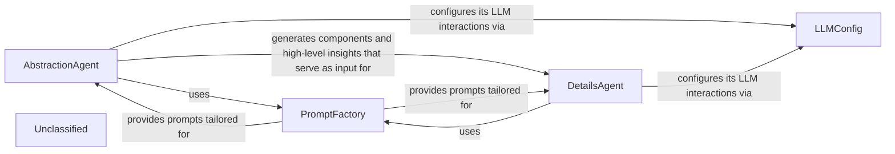
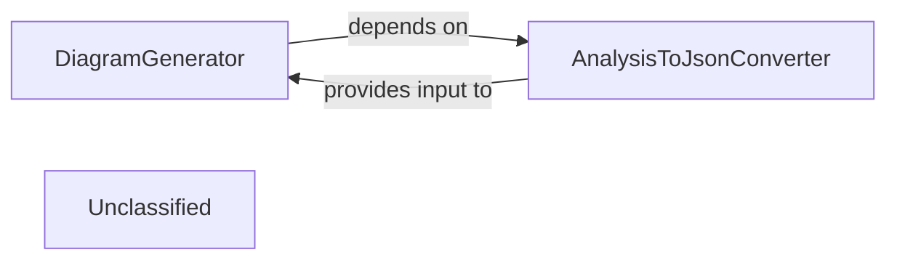
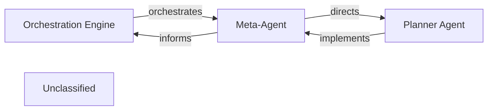
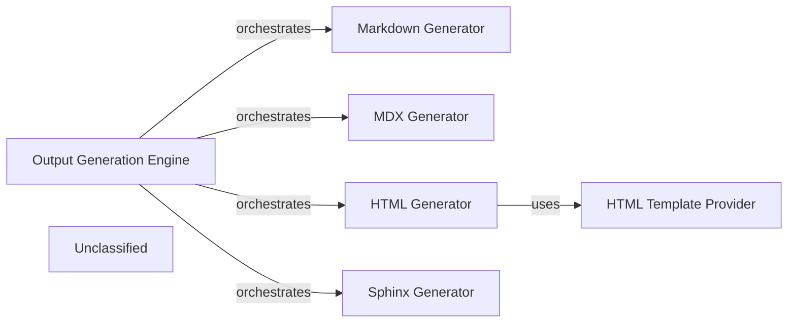
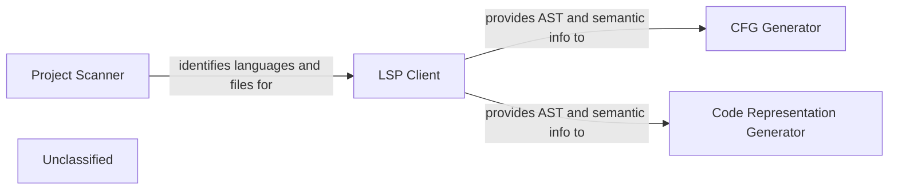

```mermaid
graph LR
    Orchestration_Engine["Orchestration Engine"]
    Static_Analysis_Engine["Static Analysis Engine"]
    AI_Processing_Layer["AI Processing Layer"]
    Output_Generation_Engine["Output Generation Engine"]
    Diagram_Generation_Service["Diagram Generation Service"]
    Unclassified["Unclassified"]
    Orchestration_Engine -- "initiates code analysis in" --> Static_Analysis_Engine
    Static_Analysis_Engine -- "provides structured code data to" --> AI_Processing_Layer
    AI_Processing_Layer -- "sends interpreted architectural data to" --> Output_Generation_Engine
    Output_Generation_Engine -- "provides diagram data to" --> Diagram_Generation_Service
    Orchestration_Engine -- "triggers the interpretation phase in" --> AI_Processing_Layer
    Orchestration_Engine -- "commands output generation from" --> Output_Generation_Engine
    click Orchestration_Engine href "https://github.com/CodeBoarding/CodeBoarding/blob/main/.codeboarding/Orchestration_Engine.md" "Details"
    click Static_Analysis_Engine href "https://github.com/CodeBoarding/CodeBoarding/blob/main/.codeboarding/Static_Analysis_Engine.md" "Details"
    click AI_Processing_Layer href "https://github.com/CodeBoarding/CodeBoarding/blob/main/.codeboarding/AI_Processing_Layer.md" "Details"
    click Output_Generation_Engine href "https://github.com/CodeBoarding/CodeBoarding/blob/main/.codeboarding/Output_Generation_Engine.md" "Details"
    click Diagram_Generation_Service href "https://github.com/CodeBoarding/CodeBoarding/blob/main/.codeboarding/Diagram_Generation_Service.md" "Details"
```

## Details

The core of the system revolves around two primary agents, `AbstractionAgent` and `DetailsAgent`, which collaboratively perform a multi-stage analysis of a project. The `AbstractionAgent` initiates the process by conducting a high-level architectural analysis, identifying abstract components, and classifying files. This initial analysis then feeds into the `DetailsAgent`, which performs a more granular, in-depth examination of each identified component. Both agents rely on the `PromptFactory` for dynamic prompt generation tailored to specific LLM providers and tasks, ensuring consistent and flexible interaction with Large Language Models. The `LLMConfig` component provides a centralized configuration for these LLM interactions, managing model selection and API parameters. This structured approach allows for a comprehensive understanding of the project's architecture, from abstract components to detailed internal structures.

### AbstractionAgent
Performs initial, high-level architectural analysis of the entire project. This includes analyzing Control Flow Graphs (CFGs) and source code to identify abstract components and generate overall project insights. It also classifies files into these high-level components.

**Related Classes/Methods**:

- <a href="https://github.com/CodeBoarding/CodeBoarding/blob/main/.codeboardingagents/abstraction_agent.py" target="_blank" rel="noopener noreferrer">`agents.abstraction_agent.AbstractionAgent`</a>

### DetailsAgent
Conducts in-depth, granular analysis of specific components identified by the AbstractionAgent. It refines the structural understanding of individual components, generates detailed documentation, and further classifies files within those components.

**Related Classes/Methods**:

- <a href="https://github.com/CodeBoarding/CodeBoarding/blob/main/.codeboardingagents/details_agent.py" target="_blank" rel="noopener noreferrer">`agents.details_agent.DetailsAgent`</a>

### PromptFactory
Acts as a central manager for all LLM prompts. It dynamically selects and provides the correct prompt templates based on the chosen LLM provider and the desired prompt type (e.g., bidirectional, unidirectional). This ensures consistency and flexibility in prompt management.

**Related Classes/Methods**:

- <a href="https://github.com/CodeBoarding/CodeBoarding/blob/main/.codeboardingagents/prompts/prompt_factory.py" target="_blank" rel="noopener noreferrer">`agents.prompts.prompt_factory.PromptFactory`</a>

### LLMConfig
Provides a centralized and extensible configuration for integrating with various Large Language Model (LLM) providers. It defines the specific models to be used for different tasks (e.g., "agent" model for complex reasoning, "parsing" model for structured output), API keys, and other provider-specific parameters.

**Related Classes/Methods**:

- <a href="https://github.com/CodeBoarding/CodeBoarding/blob/main/.codeboardingagents/llm_config.py#L14-L52" target="_blank" rel="noopener noreferrer">`agents.llm_config.LLMConfig`:14-52</a>

### Unclassified
Component for all unclassified files and utility functions (Utility functions/External Libraries/Dependencies)

**Related Classes/Methods**: _None_

### [FAQ](https://github.com/CodeBoarding/GeneratedOnBoardings/tree/main?tab=readme-ov-file#faq)

## Details

The Diagram Generation Service subsystem is responsible for converting structured architectural data into visual diagrams, enhancing comprehension through interactive and visual representations. It takes processed data and produces a final, consumable output, potentially integrating with external tools like Mermaid.js.

### DiagramGenerator
Within the Diagram Generation Service, this component orchestrates the process of transforming structured architectural analysis data into visual diagrams. It coordinates the serialization of analysis results and manages the invocation of diagramming logic, potentially integrating with external tools like Mermaid.js to produce the final visual representations.

**Related Classes/Methods**:

- <a href="https://github.com/CodeBoarding/CodeBoarding/blob/main/.codeboardingdiagram_analysis/diagram_generator.py" target="_blank" rel="noopener noreferrer">`DiagramGenerator`</a>

### AnalysisToJsonConverter
This utility component is responsible for serializing complex architectural analysis objects into a standardized JSON format. This conversion is a crucial preparatory step, ensuring the structured data is in a consumable format for diagramming tools and the DiagramGenerator.

**Related Classes/Methods**:

- <a href="https://github.com/CodeBoarding/CodeBoarding/blob/main/.codeboardingdiagram_analysis/analysis_json.py" target="_blank" rel="noopener noreferrer">`AnalysisToJsonConverter`</a>

### Unclassified
Component for all unclassified files and utility functions (Utility functions/External Libraries/Dependencies)

**Related Classes/Methods**: _None_

### [FAQ](https://github.com/CodeBoarding/GeneratedOnBoardings/tree/main?tab=readme-ov-file#faq)

## Details

The Orchestration Engine serves as the central control point, initiating and overseeing the entire code analysis and documentation generation process. It delegates strategic planning to the Meta-Agent, which defines high-level goals and approaches. The Meta-Agent then directs the Planner Agent to translate these strategies into concrete, executable tasks. The Planner Agent is responsible for the tactical execution, reporting its progress and outcomes back to the Meta-Agent, which in turn provides updates to the Orchestration Engine. This hierarchical delegation ensures a clear separation of concerns, with the Orchestration Engine managing the overall workflow, the Meta-Agent handling strategic decisions, and the Planner Agent focusing on tactical execution.

### Orchestration Engine [[Expand]](./Orchestration_Engine.md)
The central control unit managing the entire code analysis and documentation generation pipeline. It defines and executes the end-to-end analysis workflow, coordinates specialized components, manages data flow, dynamically adjusts the analysis plan, and oversees the job lifecycle. It delegates the strategic and tactical planning to dedicated agents.

**Related Classes/Methods**:

- `conceptual.OrchestrationLogic`

### Meta-Agent
Embodies higher-level strategic decision-making within the Orchestration Engine. It is responsible for understanding overall analysis goals, defining the broad strategy, and selecting appropriate high-level analysis playbooks. It acts as the 'brain' that determines what needs to be done at a strategic level.

**Related Classes/Methods**:

- <a href="https://github.com/CodeBoarding/CodeBoarding/blob/main/.codeboardingagents/meta_agent.py" target="_blank" rel="noopener noreferrer">`agents.meta_agent`</a>

### Planner Agent
Translates strategic directives from the Meta-Agent into concrete, executable steps. It breaks down complex analysis tasks, identifies specific tools or services required for each step, and manages the tactical execution flow. It acts as the 'executor' that determines how to achieve the strategic goals.

**Related Classes/Methods**:

- <a href="https://github.com/CodeBoarding/CodeBoarding/blob/main/.codeboardingagents/planner_agent.py" target="_blank" rel="noopener noreferrer">`agents.planner_agent`</a>

### Unclassified
Component for all unclassified files and utility functions (Utility functions/External Libraries/Dependencies)

**Related Classes/Methods**: _None_

### [FAQ](https://github.com/CodeBoarding/GeneratedOnBoardings/tree/main?tab=readme-ov-file#faq)

## Details

The Output Generation Engine subsystem is defined by the output_generators directory and its contained modules. It encompasses all functionality related to transforming structured architectural insights into various documentation and report formats. The Output Generation Engine acts as a central hub, coordinating various specialized generator components. Each generator is a distinct module responsible for a specific output format. This structure exemplifies a modular design where the Output Generation Engine provides a unified interface to a suite of pluggable output formatters.

### Output Generation Engine [[Expand]](./Output_Generation_Engine.md)
The primary orchestrator for the entire output generation process. It acts as a facade, coordinating the activities of individual format-specific generators to produce diverse documentation and report types from processed architectural insights.

**Related Classes/Methods**:

- <a href="https://github.com/CodeBoarding/CodeBoarding/blob/main/.codeboardingoutput_generators/__init__.py" target="_blank" rel="noopener noreferrer">`output_generators.__init__`</a>

### Markdown Generator
Specializes in converting structured architectural data into Markdown format, suitable for general documentation, READMEs, and simple reports.

**Related Classes/Methods**:

- <a href="https://github.com/CodeBoarding/CodeBoarding/blob/main/.codeboardingoutput_generators/markdown.py" target="_blank" rel="noopener noreferrer">`output_generators.markdown`</a>

### MDX Generator
Responsible for generating documentation in MDX (Markdown with JSX) format, enabling richer, interactive content within Markdown files.

**Related Classes/Methods**:

- <a href="https://github.com/CodeBoarding/CodeBoarding/blob/main/.codeboardingoutput_generators/mdx.py" target="_blank" rel="noopener noreferrer">`output_generators.mdx`</a>

### HTML Generator
Focuses on producing comprehensive documentation in HTML format, often used for web-based documentation portals or detailed reports.

**Related Classes/Methods**:

- <a href="https://github.com/CodeBoarding/CodeBoarding/blob/main/.codeboardingoutput_generators/html.py" target="_blank" rel="noopener noreferrer">`output_generators.html`</a>

### Sphinx Generator
Generates documentation compatible with the Sphinx documentation generator, commonly used for Python projects, supporting reStructuredText and other formats.

**Related Classes/Methods**:

- <a href="https://github.com/CodeBoarding/CodeBoarding/blob/main/.codeboardingoutput_generators/sphinx.py" target="_blank" rel="noopener noreferrer">`output_generators.sphinx`</a>

### HTML Template Provider
Manages and provides HTML templates and potentially utility functions specifically tailored for the `HTML Generator`, ensuring consistent styling and structure.

**Related Classes/Methods**:

- <a href="https://github.com/CodeBoarding/CodeBoarding/blob/main/.codeboardingoutput_generators/html_template.py" target="_blank" rel="noopener noreferrer">`output_generators.html_template`</a>

### Unclassified
Component for all unclassified files and utility functions (Utility functions/External Libraries/Dependencies)

**Related Classes/Methods**: _None_

### [FAQ](https://github.com/CodeBoarding/GeneratedOnBoardings/tree/main?tab=readme-ov-file#faq)

## Details

The static analysis subsystem of `CodeBoarding` is responsible for processing source code to extract various structural and semantic representations. This subsystem is composed of four main components: the `Project Scanner`, which identifies the programming languages and files within a repository; the `LSP Client`, which communicates with external Language Servers to obtain detailed semantic information, including Abstract Syntax Trees (ASTs); the `CFG Generator`, which constructs Control Flow Graphs from the ASTs; and the `Code Representation Generator`, which extracts additional structural representations like symbol tables and dependency graphs. These components work in concert to transform raw source code into a rich set of data structures suitable for further analysis and interpretation.

### Project Scanner
This component is the initial entry point for source code analysis. It scans the repository to identify the programming languages present and their associated files, preparing the groundwork for deeper analysis.

**Related Classes/Methods**:

- <a href="https://github.com/CodeBoarding/CodeBoarding/blob/main/.codeboardingstatic_analyzer/scanner.py" target="_blank" rel="noopener noreferrer">`static_analyzer.scanner.ProjectScanner`</a>

### LSP Client
Acts as a client for the Language Server Protocol (LSP), enabling communication with external Language Servers. This allows the static analysis engine to retrieve rich, semantic code information (e.g., definitions, references, type information, diagnostics, and Abstract Syntax Trees) that might not be easily derivable from static analysis alone, thereby augmenting the analysis process.

**Related Classes/Methods**:

- <a href="https://github.com/CodeBoarding/CodeBoarding/blob/main/.codeboardingstatic_analyzer/lsp_client/client.py" target="_blank" rel="noopener noreferrer">`static_analyzer.lsp_client.client.LSPClient`</a>

### CFG Generator
Analyzes the Abstract Syntax Tree (AST) and other semantic information to identify all possible execution paths within the code. It then constructs a Control Flow Graph (CFG), which is a graphical representation of all paths that might be traversed through a program during its execution. This component likely leverages graph data structures and algorithms.

**Related Classes/Methods**:

- <a href="https://github.com/CodeBoarding/CodeBoarding/blob/main/.codeboardingstatic_analyzer/graph.py" target="_blank" rel="noopener noreferrer">`static_analyzer.graph.ControlFlowGraph`</a>

### Code Representation Generator
This component extends the analysis beyond ASTs and CFGs by extracting other valuable structural representations from the code's semantic information. This includes generating symbol tables (mapping identifiers to their properties), call graphs (showing function/method invocation relationships), and dependency graphs (illustrating module or component dependencies).

**Related Classes/Methods**:

- <a href="https://github.com/CodeBoarding/CodeBoarding/blob/main/.codeboardingstatic_analyzer/analysis_result.py" target="_blank" rel="noopener noreferrer">`static_analyzer.analysis_result.AnalysisResult`</a>

### Unclassified
Component for all unclassified files and utility functions (Utility functions/External Libraries/Dependencies)

**Related Classes/Methods**: _None_

### [FAQ](https://github.com/CodeBoarding/GeneratedOnBoardings/tree/main?tab=readme-ov-file#faq)

## Details

The CodeBoarding project is structured around a pipeline that orchestrates code analysis, AI-driven interpretation, and documentation/diagram generation. The Orchestration Engine initiates and manages this entire process, delegating tasks to specialized components. The Static Analysis Engine first processes the raw source code to generate structural representations like CFGs. This data is then fed into the AI Processing Layer, which leverages LLMs to derive high-level architectural insights. These insights are subsequently transformed into various documentation formats by the Output Generation Engine and visual diagrams by the Diagram Generation Service. This modular design ensures clear separation of concerns and a streamlined flow from raw code to comprehensive architectural documentation and visualizations.

### Orchestration Engine [[Expand]](./Orchestration_Engine.md)
The central control unit managing the entire code analysis and documentation generation pipeline. It coordinates the execution flow, from static analysis to AI interpretation and final output generation.

**Related Classes/Methods**:

- <a href="https://github.com/CodeBoarding/CodeBoarding/blob/main/.codeboardingagents/meta_agent.py" target="_blank" rel="noopener noreferrer">`agents/meta_agent.py`</a>
- <a href="https://github.com/CodeBoarding/CodeBoarding/blob/main/.codeboardingagents/planner_agent.py" target="_blank" rel="noopener noreferrer">`agents/planner_agent.py`</a>

### Static Analysis Engine [[Expand]](./Static_Analysis_Engine.md)
Responsible for parsing source code, building Abstract Syntax Trees (ASTs), and generating Control Flow Graphs (CFGs) and other structural code representations. It provides the foundational, raw code structure data.

**Related Classes/Methods**:

- <a href="https://github.com/CodeBoarding/CodeBoarding/blob/main/.codeboardingstatic_analyzer" target="_blank" rel="noopener noreferrer">`static_analyzer/`</a>

### AI Processing Layer [[Expand]](./AI_Processing_Layer.md)
This integrated layer processes structured code data using Large Language Models (LLMs) to derive architectural insights, identify components, and understand relationships. It includes prompt generation and management, and handles interactions with various LLM providers.

**Related Classes/Methods**:

- <a href="https://github.com/CodeBoarding/CodeBoarding/blob/main/.codeboardingagents/abstraction_agent.py" target="_blank" rel="noopener noreferrer">`agents/abstraction_agent.py`</a>
- <a href="https://github.com/CodeBoarding/CodeBoarding/blob/main/.codeboardingagents/details_agent.py" target="_blank" rel="noopener noreferrer">`agents/details_agent.py`</a>
- <a href="https://github.com/CodeBoarding/CodeBoarding/blob/main/.codeboardingagents/prompts/prompt_factory.py" target="_blank" rel="noopener noreferrer">`agents/prompts/prompt_factory.py`</a>
- <a href="https://github.com/CodeBoarding/CodeBoarding/blob/main/.codeboardingagents/llm_config.py" target="_blank" rel="noopener noreferrer">`agents/llm_config.py`</a>

### Output Generation Engine [[Expand]](./Output_Generation_Engine.md)
Takes the structured architectural insights from the AI Processing Layer and formats them into various output types, such as documentation files (Markdown, JSON), reports, or raw data suitable for diagram generation.

**Related Classes/Methods**:

- <a href="https://github.com/CodeBoarding/CodeBoarding/blob/main/.codeboardingoutput_generators" target="_blank" rel="noopener noreferrer">`output_generators/`</a>

### Diagram Generation Service [[Expand]](./Diagram_Generation_Service.md)
Specializes in converting structured architectural data into visual diagrams, potentially using tools like Mermaid.js. It enhances comprehension by providing interactive and visual representations of the analyzed architecture.

**Related Classes/Methods**:

- <a href="https://github.com/CodeBoarding/CodeBoarding/blob/main/.codeboardingdiagram_analysis" target="_blank" rel="noopener noreferrer">`diagram_analysis/`</a>

### Unclassified
Component for all unclassified files and utility functions (Utility functions/External Libraries/Dependencies)

**Related Classes/Methods**: _None_

### [FAQ](https://github.com/CodeBoarding/GeneratedOnBoardings/tree/main?tab=readme-ov-file#faq)

