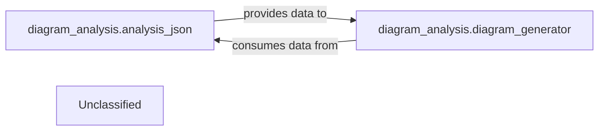
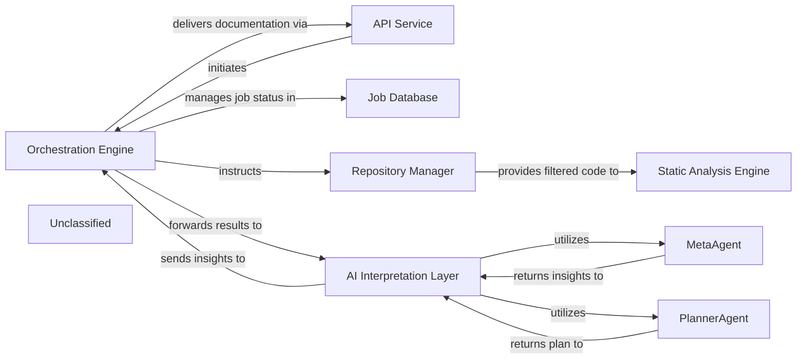
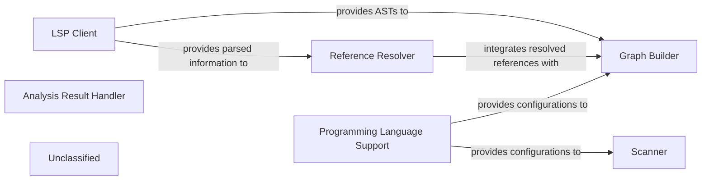

```mermaid
graph LR
    Static_Analyzer["Static Analyzer"]
    LSP_Client["LSP Client"]
    Ignore_Utility["Ignore Utility"]
    Orchestration_Engine["Orchestration Engine"]
    Output_Generation_Engine["Output Generation Engine"]
    HTML_Generator["HTML Generator"]
    HTML_Template_Processor["HTML Template Processor"]
    Markdown_MDX_Sphinx_Generators["Markdown/MDX/Sphinx Generators"]
    Unclassified["Unclassified"]
    Static_Analyzer -- "processes code using" --> LSP_Client
    Static_Analyzer -- "controls scope with" --> Ignore_Utility
    Static_Analyzer -- "sends interpreted results to" --> Orchestration_Engine
    LSP_Client -- "provides analysis to" --> Static_Analyzer
    Ignore_Utility -- "defines scope for" --> Static_Analyzer
    Orchestration_Engine -- "receives results from" --> Static_Analyzer
    Orchestration_Engine -- "sends processed results to" --> Output_Generation_Engine
    Output_Generation_Engine -- "dispatches data to" --> HTML_Generator
    Output_Generation_Engine -- "dispatches data to" --> Markdown_MDX_Sphinx_Generators
    Output_Generation_Engine -- "receives processed results from" --> Orchestration_Engine
    HTML_Generator -- "utilizes" --> HTML_Template_Processor
    HTML_Template_Processor -- "provides templating services to" --> HTML_Generator
    Markdown_MDX_Sphinx_Generators -- "receives data from" --> Output_Generation_Engine
    click Orchestration_Engine href "https://github.com/CodeBoarding/CodeBoarding/blob/main/.codeboarding/Orchestration_Engine.md" "Details"
    click Output_Generation_Engine href "https://github.com/CodeBoarding/CodeBoarding/blob/main/.codeboarding/Output_Generation_Engine.md" "Details"
```

```mermaid
graph LR
    Orchestration_Engine["Orchestration Engine"]
    Static_Analysis_Engine["Static Analysis Engine"]
    AI_Processing_Layer["AI Processing Layer"]
    Output_Generation_Engine["Output Generation Engine"]
    Diagram_Generation_Service["Diagram Generation Service"]
    Unclassified["Unclassified"]
    Orchestration_Engine -- "initiates code analysis in" --> Static_Analysis_Engine
    Orchestration_Engine -- "triggers the interpretation phase in" --> AI_Processing_Layer
    Orchestration_Engine -- "commands output generation from" --> Output_Generation_Engine
    Static_Analysis_Engine -- "provides clustered architectural components to" --> AI_Processing_Layer
    AI_Processing_Layer -- "sends interpreted architectural data to" --> Output_Generation_Engine
    Output_Generation_Engine -- "provides diagram data to" --> Diagram_Generation_Service
    click Orchestration_Engine href "https://github.com/CodeBoarding/CodeBoarding/blob/main/.codeboarding/Orchestration_Engine.md" "Details"
    click Static_Analysis_Engine href "https://github.com/CodeBoarding/CodeBoarding/blob/main/.codeboarding/Static_Analysis_Engine.md" "Details"
    click AI_Processing_Layer href "https://github.com/CodeBoarding/CodeBoarding/blob/main/.codeboarding/AI_Processing_Layer.md" "Details"
    click Output_Generation_Engine href "https://github.com/CodeBoarding/CodeBoarding/blob/main/.codeboarding/Output_Generation_Engine.md" "Details"
    click Diagram_Generation_Service href "https://github.com/CodeBoarding/CodeBoarding/blob/main/.codeboarding/Diagram_Generation_Service.md" "Details"
```

## Details

The system operates through a clear, sequential flow beginning with the Query Processor handling incoming user requests. These requests are then forwarded to the Language Model Interface, which manages communication with the underlying language model to generate responses or identify necessary actions. Based on the language model's output, the Tool Executor dynamically selects and invokes external tools to gather additional information or perform specific operations. The results from these tools, along with the language model's output, are then consolidated and structured by the Response Formatter to create a coherent and user-friendly final response. This response is ultimately delivered back to the user via the Query Processor. Supporting these core functions, the Unclassified component encompasses various utility functions, external libraries, and project configuration elements, including new capabilities for managing repository ignore patterns, which contribute to the overall system's functionality and maintainability without directly participating in the primary query-response workflow.

### Query Processor
Handles incoming user queries, including parsing and initial validation.

**Related Classes/Methods**:

### Language Model Interface
Manages interactions with the underlying language model, sending prompts and receiving generated text.

**Related Classes/Methods**:

### Tool Executor
Executes specific tools based on the language model's output, handling tool invocation and result retrieval.

**Related Classes/Methods**:

- <a href="https://github.com/CodeBoarding/CodeBoarding/blob/main/.codeboardingagents/tools/toolkit.py" target="_blank" rel="noopener noreferrer">`ToolRegistry:get_tool`</a>
- `Tool:execute`

### Response Formatter
Formats the final response to be sent back to the user, potentially combining information from the language model and tool outputs.

**Related Classes/Methods**:

### Unclassified
Component for all unclassified files, utility functions, and external dependencies, now including repository ignore pattern handling and reflecting project configuration updates.

**Related Classes/Methods**:

- <a href="https://github.com/CodeBoarding/CodeBoarding/blob/main/.codeboardingrepo_utils/ignore.py" target="_blank" rel="noopener noreferrer">`repo_utils.ignore`</a>

### Unclassified
Component for all unclassified files and utility functions (Utility functions/External Libraries/Dependencies)

**Related Classes/Methods**: _None_

### [FAQ](https://github.com/CodeBoarding/GeneratedOnBoardings/tree/main?tab=readme-ov-file#faq)

## Details

The Diagram Generation Service subsystem is encapsulated within the diagram_analysis package. Its primary function is to transform structured architectural data into visual diagrams, enhancing comprehension through interactive representations.

### diagram_analysis.analysis_json
This component is responsible for processing and structuring raw architectural data into a standardized, machine-readable format (likely JSON). It acts as a crucial data preparation layer, ensuring that the input for diagram generation is consistent and well-formed.

**Related Classes/Methods**:

- <a href="https://github.com/CodeBoarding/CodeBoarding/blob/main/.codeboardingdiagram_analysis/analysis_json.py" target="_blank" rel="noopener noreferrer">`diagram_analysis.analysis_json`</a>

### diagram_analysis.diagram_generator
This is the core engine of the subsystem, tasked with taking the structured architectural data (prepared by analysis_json) and transforming it into a visual diagram format. It likely leverages external tools like Mermaid.js for rendering the visual output.

**Related Classes/Methods**:

- <a href="https://github.com/CodeBoarding/CodeBoarding/blob/main/.codeboardingdiagram_analysis/diagram_generator.py" target="_blank" rel="noopener noreferrer">`diagram_analysis.diagram_generator`</a>

### Unclassified
Component for all unclassified files and utility functions (Utility functions/External Libraries/Dependencies)

**Related Classes/Methods**: _None_

### [FAQ](https://github.com/CodeBoarding/GeneratedOnBoardings/tree/main?tab=readme-ov-file#faq)

## Details

The system operates with the `Orchestration Engine` as its central control, initiating and managing the entire code analysis and documentation generation workflow. External requests are handled by the `API Service`, which triggers the `Orchestration Engine`. The `Orchestration Engine` interacts with the `Job Database` to maintain job status and metadata. It instructs the `Repository Manager` to fetch code, which now includes filtering files based on ignore patterns. The `Repository Manager` then provides this filtered code to the `Static Analysis Engine` for detailed analysis. The results are forwarded to the `AI Interpretation Layer`, where specialized agents like the `MetaAgent` and `PlannerAgent` collaborate to interpret the analysis and generate insights. Finally, the `Orchestration Engine` receives these insights and delivers the generated documentation back through the `API Service`.

### Orchestration Engine [[Expand]](./Orchestration_Engine.md)
The central control unit managing the entire code analysis and documentation generation pipeline. It coordinates the execution flow, from static analysis to AI interpretation and final output generation.

**Related Classes/Methods**:

- <a href="https://github.com/CodeBoarding/CodeBoarding/blob/main/.codeboardingmain.py#L55-L72" target="_blank" rel="noopener noreferrer">`main.generate_analysis`:55-72</a>

### API Service
Handles external job requests and delivers final documentation.

**Related Classes/Methods**:

- <a href="https://github.com/CodeBoarding/CodeBoarding/blob/main/.codeboardinglocal_app.py" target="_blank" rel="noopener noreferrer">`local_app.start_generation_job`</a>

### Job Database
Stores and manages job status and metadata.

**Related Classes/Methods**:

- <a href="https://github.com/CodeBoarding/CodeBoarding/blob/main/.codeboardingduckdb_crud.py" target="_blank" rel="noopener noreferrer">`duckdb_crud.update_job`</a>

### Repository Manager
Responsible for fetching code from repositories and managing file and directory exclusions based on `.gitignore` patterns and default ignored paths.

**Related Classes/Methods**:

- <a href="https://github.com/CodeBoarding/CodeBoarding/blob/main/.codeboardingrepo_utils/__init__.py" target="_blank" rel="noopener noreferrer">`repo_utils.clone_repository`</a>
- <a href="https://github.com/CodeBoarding/CodeBoarding/blob/main/.codeboardingrepo_utils/ignore.py#L8-L107" target="_blank" rel="noopener noreferrer">`repo_utils.ignore.RepoIgnoreManager`:8-107</a>

### Static Analysis Engine [[Expand]](./Static_Analysis_Engine.md)
Performs static analysis on the provided code, receiving a filtered set of files from the Repository Manager.

**Related Classes/Methods**:

- <a href="https://github.com/CodeBoarding/CodeBoarding/blob/main/.codeboardingstatic_analyzer/scanner.py" target="_blank" rel="noopener noreferrer">`static_analyzer.scanner.StaticAnalysisEngine.analyze_code`</a>

### AI Interpretation Layer
Interprets static analysis results and generates insights, encompassing specialized agents like MetaAgent and PlannerAgent. This layer is orchestrated by the `DiagramGenerator`.

**Related Classes/Methods**:

- <a href="https://github.com/CodeBoarding/CodeBoarding/blob/main/.codeboardingdiagram_analysis/diagram_generator.py" target="_blank" rel="noopener noreferrer">`diagram_analysis.diagram_generator.DiagramGenerator.generate_analysis`</a>

### MetaAgent
Analyzes project-level metadata to extract high-level architectural context, project type, domain, and technological biases, guiding subsequent analysis and interpretation.

**Related Classes/Methods**:

- <a href="https://github.com/CodeBoarding/CodeBoarding/blob/main/.codeboardingagents/meta_agent.py#L31-L40" target="_blank" rel="noopener noreferrer">`agents.meta_agent.MetaAgent.analyze_metadata`:31-40</a>

### PlannerAgent
Generates a strategic plan for deeper code analysis based on initial analysis and metadata, identifying key components for detailed examination and determining their expansion scope.

**Related Classes/Methods**:

- <a href="https://github.com/CodeBoarding/CodeBoarding/blob/main/.codeboardingagents/planner_agent.py#L22-L33" target="_blank" rel="noopener noreferrer">`agents.planner_agent.PlannerAgent.generate_plan`:22-33</a>

### Unclassified
Component for all unclassified files and utility functions (Utility functions/External Libraries/Dependencies)

**Related Classes/Methods**: _None_

### [FAQ](https://github.com/CodeBoarding/GeneratedOnBoardings/tree/main?tab=readme-ov-file#faq)

## Details

The system's architecture is structured around a pipeline that begins with the Static Analyzer. This component is responsible for in-depth code analysis, leveraging an LSP Client for language-specific insights and an Ignore Utility to precisely control the scope of its operations. The "interpreted results" from the Static Analyzer are then passed to the Orchestration Engine, which acts as an intermediary, preparing the data for the final output stage. The Output Generation Engine serves as the central coordinator for documentation generation, dispatching the processed insights to various specialized generators, including the HTML Generator, Markdown Generator, MDX Generator, and Sphinx Generator. The HTML Generator further relies on an HTML Template Processor to ensure consistent styling and structure in its output. This modular design ensures a clear separation of concerns, from code analysis and scope management to the final rendering of diverse documentation formats.

### Static Analyzer
Responsible for analyzing source code and generating "interpreted results." It integrates with LSP clients for language-specific analysis and uses an ignore mechanism to control the scope of its operations.

**Related Classes/Methods**:

### LSP Client
Facilitates communication between the Static Analyzer and Language Server Protocols to perform detailed code analysis.

**Related Classes/Methods**:

- <a href="https://github.com/CodeBoarding/CodeBoarding/blob/main/.codeboardingstatic_analyzer/lsp_client/client.py" target="_blank" rel="noopener noreferrer">`lsp_client.client.LSPClient`</a>

### Ignore Utility
Manages rules for including or excluding files and directories from the Static Analyzer's processing scope.

**Related Classes/Methods**:

- <a href="https://github.com/CodeBoarding/CodeBoarding/blob/main/.codeboardingrepo_utils/ignore.py" target="_blank" rel="noopener noreferrer">`repo_utils.ignore.IgnoreUtility`</a>

### Orchestration Engine [[Expand]](./Orchestration_Engine.md)
Receives "interpreted results" from the Static Analyzer, performs further processing, and prepares them for output generation.

**Related Classes/Methods**:

- `orchestration.engine.OrchestrationEngine`:1-10

### Output Generation Engine [[Expand]](./Output_Generation_Engine.md)
The primary entry point for the subsystem, coordinating the selection and execution of specific format generators based on the desired output type.

**Related Classes/Methods**:

### HTML Generator
Transforms architectural insights into well-structured HTML documentation.

**Related Classes/Methods**:

- <a href="https://github.com/CodeBoarding/CodeBoarding/blob/main/.codeboardingoutput_generators/html.py#L61-L122" target="_blank" rel="noopener noreferrer">`html_generator.generator.HTMLGenerator`:61-122</a>

### HTML Template Processor
Manages and applies HTML templates to the data provided by the HTML Generator.

**Related Classes/Methods**:

- `html_template_processor.processor.HTMLTemplateProcessor`

### Markdown/MDX/Sphinx Generators
Convert architectural insights into Markdown, MDX, or Sphinx-compatible formats.

**Related Classes/Methods**:

- `format_generators.unified.UnifiedGenerator`

### Unclassified
Component for all unclassified files and utility functions (Utility functions/External Libraries/Dependencies)

**Related Classes/Methods**: _None_

### [FAQ](https://github.com/CodeBoarding/GeneratedOnBoardings/tree/main?tab=readme-ov-file#faq)

## Details

The static analysis subsystem is designed around a modular pipeline that transforms raw source code into structured graph representations. The `Scanner` initiates the process with lexical analysis, followed by the `LSP Client` which leverages external language servers to provide rich parsed data, including Abstract Syntax Trees (ASTs). The `Reference Resolver` then identifies and resolves symbolic links within this parsed information. Both the ASTs and resolved references are consumed by the `Graph Builder` to construct Control Flow Graphs (CFGs), forming the core analytical output. `Programming Language Support` underpins these operations by supplying language-specific configurations and rules. The `Analysis Result Handler` serves as the interface for managing and storing the diverse outputs of this analysis. The `Unclassified` component houses supporting utilities, such as `repo_utils/ignore.py`, which can influence the initial file processing scope for components like the `Scanner` and `LSP Client`, without altering their fundamental responsibilities. This architecture prioritizes clear separation of concerns and leverages external language services for robust parsing capabilities.

### Scanner
The `Scanner` initiates the process with lexical analysis, potentially on a filtered set of files determined by utility modules.

**Related Classes/Methods**:

- <a href="https://github.com/CodeBoarding/CodeBoarding/blob/main/.codeboardingstatic_analyzer/__init__.py" target="_blank" rel="noopener noreferrer">`Scanner`</a>

### LSP Client
The `LSP Client` then provides rich parsed information, including Abstract Syntax Trees (ASTs), by interacting with external Language Servers.

**Related Classes/Methods**:

- <a href="https://github.com/CodeBoarding/CodeBoarding/blob/main/.codeboardingstatic_analyzer/lsp_client/client.py#L58-L1105" target="_blank" rel="noopener noreferrer">`LSPClient`:58-1105</a>

### Reference Resolver
This parsed data is crucial for the `Reference Resolver` to identify and link symbolic references within the code.

**Related Classes/Methods**:

- <a href="https://github.com/CodeBoarding/CodeBoarding/blob/main/.codeboardingstatic_analyzer/reference_resolve_mixin.py#L15-L151" target="_blank" rel="noopener noreferrer">`ReferenceResolver`:15-151</a>

### Graph Builder
Both the ASTs from the `LSP Client` and the resolved references from the `Reference Resolver` feed into the `Graph Builder`, which constructs Control Flow Graphs (CFGs).

**Related Classes/Methods**:

- `GraphBuilder`

### Programming Language Support
Throughout this process, the `Programming Language Support` component provides language-specific configurations and rules, ensuring accurate analysis.

**Related Classes/Methods**:

- `ProgrammingLanguageSupport`

### Analysis Result Handler
Finally, the `Analysis Result Handler` manages and stores the various outputs, making them accessible for further processing or consumption.

**Related Classes/Methods**:

- `AnalysisResultHandler`

### Unclassified
The `Unclassified` component houses supporting utilities, such as `repo_utils/ignore.py`, which can influence the initial file processing scope for components like the `Scanner` and `LSP Client`, without altering their fundamental responsibilities.

**Related Classes/Methods**:

- <a href="https://github.com/CodeBoarding/CodeBoarding/blob/main/.codeboardingrepo_utils/ignore.py" target="_blank" rel="noopener noreferrer">`repo_utils.ignore`</a>

### Unclassified
Component for all unclassified files and utility functions (Utility functions/External Libraries/Dependencies)

**Related Classes/Methods**: _None_

### [FAQ](https://github.com/CodeBoarding/GeneratedOnBoardings/tree/main?tab=readme-ov-file#faq)

## Details

The system operates as a multi-stage pipeline, orchestrated by the `Orchestration Engine`. It begins by directing the `Static Analysis Engine` to perform comprehensive code analysis, including parsing, graph generation, and now, intelligent filtering of analysis targets. The structured output from this stage is then fed into the `AI Processing Layer`, which leverages large language models to derive deep architectural insights and identify key components and their relationships. These insights are subsequently passed to the `Output Generation Engine` for formatting into various documentation types. Finally, the `Diagram Generation Service` transforms the structured architectural data into visual diagrams, enhancing comprehension and navigation of the analyzed codebase.

### Orchestration Engine [[Expand]](./Orchestration_Engine.md)
The central control unit managing the entire code analysis and documentation generation pipeline. It coordinates the execution flow, from static analysis to AI interpretation and final output generation.

**Related Classes/Methods**:

- <a href="https://github.com/CodeBoarding/CodeBoarding/blob/main/.codeboardingagents/meta_agent.py" target="_blank" rel="noopener noreferrer">`agents.meta_agent.MetaAgent`</a>
- <a href="https://github.com/CodeBoarding/CodeBoarding/blob/main/.codeboardingagents/planner_agent.py" target="_blank" rel="noopener noreferrer">`agents.planner_agent.PlannerAgent`</a>

### Static Analysis Engine [[Expand]](./Static_Analysis_Engine.md)
Responsible for parsing source code, building Abstract Syntax Trees (ASTs), generating Control Flow Graphs (CFGs), and applying adaptive clustering algorithms to abstract these graphs into logical architectural components. It now also incorporates a filtering mechanism to refine the scope of code analysis based on ignore rules, providing structured, clustered, and filtered code representations.

**Related Classes/Methods**:

- <a href="https://github.com/CodeBoarding/CodeBoarding/blob/main/.codeboardingstatic_analyzer" target="_blank" rel="noopener noreferrer">`static_analyzer`</a>
- <a href="https://github.com/CodeBoarding/CodeBoarding/blob/main/.codeboardingstatic_analyzer/graph.py" target="_blank" rel="noopener noreferrer">`static_analyzer.graph.Graph`</a>
- <a href="https://github.com/CodeBoarding/CodeBoarding/blob/main/.codeboardingrepo_utils/ignore.py" target="_blank" rel="noopener noreferrer">`repo_utils/ignore.py`</a>

### AI Processing Layer [[Expand]](./AI_Processing_Layer.md)
This integrated layer processes structured code data using Large Language Models (LLMs) to derive architectural insights, identify components, and understand relationships. It includes prompt generation and management, and handles interactions with various LLM providers.

**Related Classes/Methods**:

- <a href="https://github.com/CodeBoarding/CodeBoarding/blob/main/.codeboardingagents/abstraction_agent.py" target="_blank" rel="noopener noreferrer">`agents.abstraction_agent.AbstractionAgent`</a>
- <a href="https://github.com/CodeBoarding/CodeBoarding/blob/main/.codeboardingagents/details_agent.py" target="_blank" rel="noopener noreferrer">`agents.details_agent.DetailsAgent`</a>
- <a href="https://github.com/CodeBoarding/CodeBoarding/blob/main/.codeboardingagents/prompts/prompt_factory.py" target="_blank" rel="noopener noreferrer">`agents.prompts.prompt_factory.PromptFactory`</a>
- <a href="https://github.com/CodeBoarding/CodeBoarding/blob/main/.codeboardingagents/llm_config.py#L14-L52" target="_blank" rel="noopener noreferrer">`agents.llm_config.LLMConfig`:14-52</a>

### Output Generation Engine [[Expand]](./Output_Generation_Engine.md)
Takes the structured architectural insights from the AI Processing Layer and formats them into various output types, such as documentation files (Markdown, JSON), reports, or raw data suitable for diagram generation.

**Related Classes/Methods**:

- <a href="https://github.com/CodeBoarding/CodeBoarding/blob/main/.codeboardingoutput_generators" target="_blank" rel="noopener noreferrer">`output_generators`</a>

### Diagram Generation Service [[Expand]](./Diagram_Generation_Service.md)
Specializes in converting structured architectural data into visual diagrams, potentially using tools like Mermaid.js. It enhances comprehension by providing interactive and visual representations of the analyzed architecture.

**Related Classes/Methods**:

- <a href="https://github.com/CodeBoarding/CodeBoarding/blob/main/.codeboardingdiagram_analysis" target="_blank" rel="noopener noreferrer">`diagram_analysis`</a>

### Unclassified
Component for all unclassified files and utility functions (Utility functions/External Libraries/Dependencies)

**Related Classes/Methods**: _None_

### [FAQ](https://github.com/CodeBoarding/GeneratedOnBoardings/tree/main?tab=readme-ov-file#faq)

