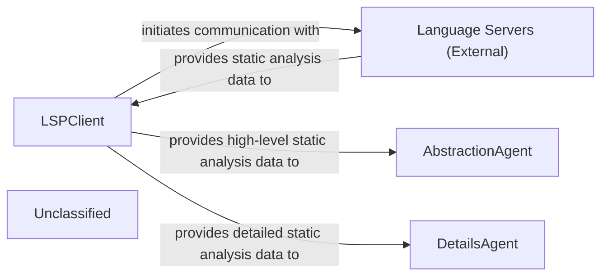
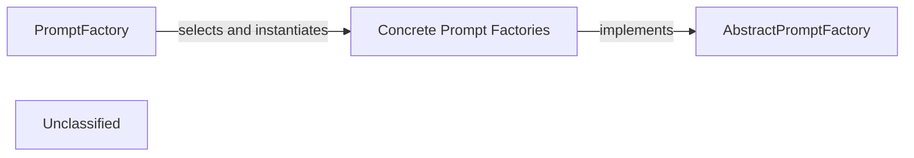
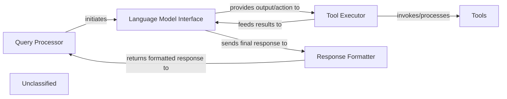
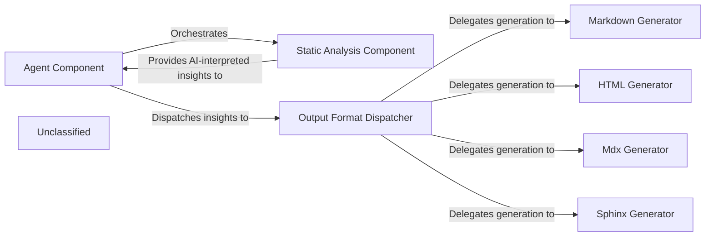
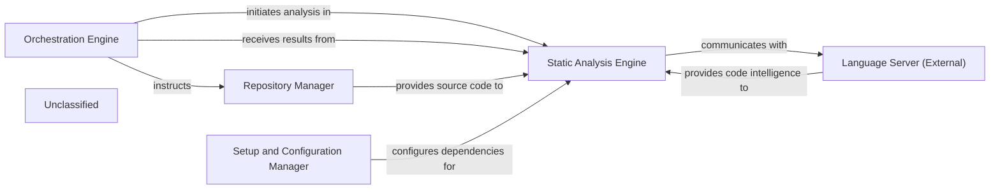
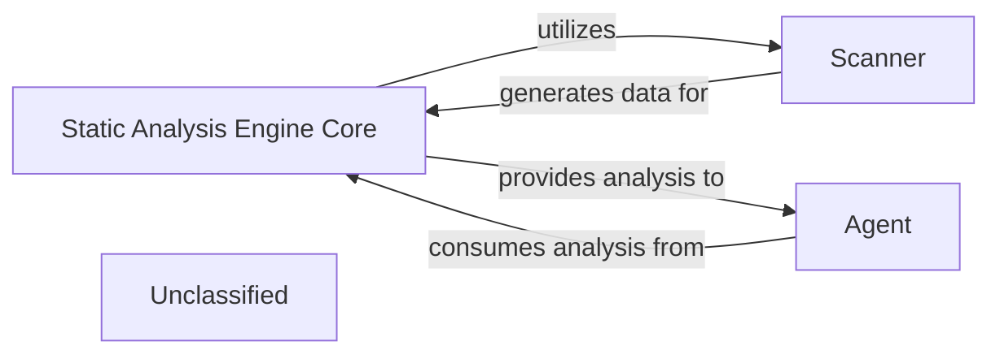
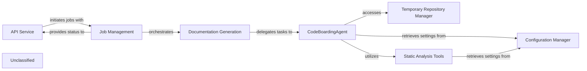
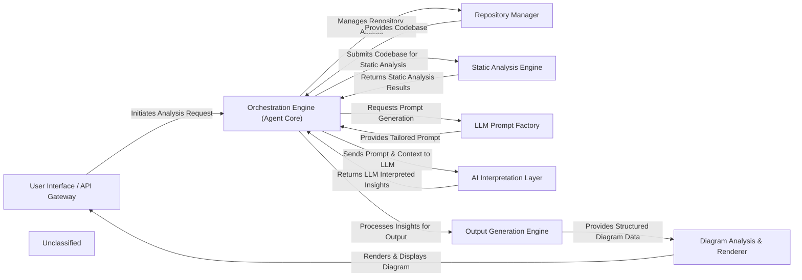

```mermaid
graph LR
    API_Service_User_Interface["API Service / User Interface"]
    Orchestration_Engine["Orchestration Engine"]
    Job_Database["Job Database"]
    Repository_Manager["Repository Manager"]
    Static_Analysis_Engine["Static Analysis Engine"]
    AI_Interpretation_Layer["AI Interpretation Layer"]
    Output_Generation_Engine["Output Generation Engine"]
    Diagram_Analysis_Renderer["Diagram Analysis & Renderer"]
    Unclassified["Unclassified"]
    API_Service_User_Interface -- "initiates analysis requests to" --> Orchestration_Engine
    API_Service_User_Interface -- "retrieves analysis status and results from" --> Orchestration_Engine
    Orchestration_Engine -- "dispatches tasks to" --> Repository_Manager
    Orchestration_Engine -- "manages analysis workflow with" --> Diagram_Analysis_Renderer
    Orchestration_Engine -- "provides interpreted results to" --> Output_Generation_Engine
    Orchestration_Engine -- "updates job status in" --> Job_Database
    Job_Database -- "stores job details and status for" --> Orchestration_Engine
    Job_Database -- "provides job history and state to" --> Orchestration_Engine
    Repository_Manager -- "provides source code to" --> Static_Analysis_Engine
    Static_Analysis_Engine -- "provides raw analysis data to" --> AI_Interpretation_Layer
    AI_Interpretation_Layer -- "generates architectural insights for" --> Diagram_Analysis_Renderer
    Diagram_Analysis_Renderer -- "produces interpreted analysis results for" --> Orchestration_Engine
    Output_Generation_Engine -- "consumes interpreted analysis results from" --> Orchestration_Engine
    click Repository_Manager href "https://github.com/CodeBoarding/CodeBoarding/blob/main/.codeboarding/Repository_Manager.md" "Details"
    click Static_Analysis_Engine href "https://github.com/CodeBoarding/CodeBoarding/blob/main/.codeboarding/Static_Analysis_Engine.md" "Details"
    click AI_Interpretation_Layer href "https://github.com/CodeBoarding/CodeBoarding/blob/main/.codeboarding/AI_Interpretation_Layer.md" "Details"
    click Output_Generation_Engine href "https://github.com/CodeBoarding/CodeBoarding/blob/main/.codeboarding/Output_Generation_Engine.md" "Details"
    click Diagram_Analysis_Renderer href "https://github.com/CodeBoarding/CodeBoarding/blob/main/.codeboarding/Diagram_Analysis_Renderer.md" "Details"
```

## Details

The system's architecture is centered around the LSPClient, which acts as the primary interface for interacting with Language Servers (External) to gather comprehensive static analysis data. This data is then channeled to two specialized agents: the AbstractionAgent and the DetailsAgent. The AbstractionAgent is responsible for synthesizing high-level architectural views from the static analysis, while the DetailsAgent performs in-depth, granular analysis of specific code sections. Recent internal enhancements to the agents, particularly within agents/agent.py, indicate a continuous refinement of their analytical capabilities, ensuring a more robust and capable analysis process without altering the fundamental architectural structure or inter-component communication.

### LSPClient
Establishes and manages communication with external Language Servers using the Language Server Protocol (LSP). It orchestrates the collection of comprehensive static analysis data, including call graphs, class hierarchies, package relations, and symbol references. It filters source files and handles language-specific configurations, acting as a robust data acquisition layer.

**Related Classes/Methods**:

- <a href="https://github.com/CodeBoarding/CodeBoarding/blob/main/.codeboardingstatic_analyzer/lsp_client/client.py#L58-L1097" target="_blank" rel="noopener noreferrer">`LSPClient`:58-1097</a>

### AbstractionAgent
Consumes high-level static analysis data provided by the LSPClient to identify major system components, their primary responsibilities, and interconnections, forming an abstract architectural representation. It distills complex codebases into understandable, high-level architectural views.

**Related Classes/Methods**:

- <a href="https://github.com/CodeBoarding/CodeBoarding/blob/main/.codeboardingagents/agent.py" target="_blank" rel="noopener noreferrer">`AbstractionAgent`</a>

### DetailsAgent
Utilizes detailed static analysis data from the LSPClient to perform granular analysis within specific architectural components or code sections. It delves into implementation details, identifies specific design patterns, explains the rationale behind code structures, and highlights areas of interest or concern.

**Related Classes/Methods**:

- <a href="https://github.com/CodeBoarding/CodeBoarding/blob/main/.codeboardingagents/agent.py" target="_blank" rel="noopener noreferrer">`DetailsAgent`</a>

### Language Servers (External)
External processes that provide static analysis capabilities for specific programming languages. They respond to LSP requests from the LSPClient with code intelligence data such as symbol definitions, references, call hierarchies, and type information.

**Related Classes/Methods**:

- `LSP_Protocol`:1-10

### Unclassified
Component for all unclassified files and utility functions (Utility functions/External Libraries/Dependencies)

**Related Classes/Methods**: _None_

### [FAQ](https://github.com/CodeBoarding/GeneratedOnBoardings/tree/main?tab=readme-ov-file#faq)

## Details

The CodeBoarding system is designed to generate architectural documentation and diagrams from source code repositories. The process begins with the API Service / User Interface, which allows users to initiate analysis jobs and retrieve results. The Orchestration Engine acts as the central coordinator, managing the lifecycle of each analysis job, dispatching tasks to other components, and updating job statuses in the Job Database. The Repository Manager is responsible for fetching and managing source code from various repositories. The retrieved code is then processed by the Static Analysis Engine, which extracts structural and semantic information. This raw analysis data is fed into the AI Interpretation Layer, where AI/ML models interpret it into high-level architectural insights. The Diagram Analysis & Renderer component utilizes these insights to produce structured analysis results, which are then consumed by the Output Generation Engine to generate documentation in various formats, including visual diagrams.

### API Service / User Interface
Provides the external interface for users and other systems to interact with the tool. It exposes API endpoints for initiating analysis, retrieving results, and managing configurations.

**Related Classes/Methods**:

- <a href="https://github.com/CodeBoarding/CodeBoarding/blob/main/.codeboardinglocal_app.py#L47-L51" target="_blank" rel="noopener noreferrer">`local_app.app`:47-51</a>

### Orchestration Engine
Acts as the central coordinator for the entire analysis workflow. It manages the sequence of operations, dispatches tasks to other components, and handles the overall lifecycle of an analysis job.

**Related Classes/Methods**:

- <a href="https://github.com/CodeBoarding/CodeBoarding/blob/main/.codeboardinglocal_app.py#L95-L166" target="_blank" rel="noopener noreferrer">`local_app.generate_onboarding`:95-166</a>

### Job Database
Stores persistent information regarding analysis jobs, including their status, parameters, intermediate results, and historical data. It supports the asynchronous and pipeline-driven nature of the system.

**Related Classes/Methods**:

- <a href="https://github.com/CodeBoarding/CodeBoarding/blob/main/.codeboardingduckdb_crud.py#L16-L45" target="_blank" rel="noopener noreferrer">`duckdb_crud.init_db`:16-45</a>

### Repository Manager [[Expand]](./Repository_Manager.md)
Responsible for interacting with various code repositories (e.g., Git, local file systems) to retrieve and manage source code. It ensures that the correct code versions are available for analysis.

**Related Classes/Methods**:

- <a href="https://github.com/CodeBoarding/CodeBoarding/blob/main/.codeboardinggithub_action.py" target="_blank" rel="noopener noreferrer">`repo_utils.clone_repository`</a>

### Static Analysis Engine [[Expand]](./Static_Analysis_Engine.md)
Performs in-depth static analysis on the retrieved source code to extract structural, syntactic, and semantic information. This includes parsing code, building Abstract Syntax Trees (ASTs), and identifying code patterns.

**Related Classes/Methods**:

- <a href="https://github.com/CodeBoarding/CodeBoarding/blob/main/.codeboardingstatic_analyzer/scanner.py#L13-L70" target="_blank" rel="noopener noreferrer">`static_analyzer.scanner.ProjectScanner`:13-70</a>

### AI Interpretation Layer [[Expand]](./AI_Interpretation_Layer.md)
Utilizes AI/ML models (e.g., LLMs) to interpret the output from the Static Analysis Engine. It translates low-level code insights into higher-level architectural concepts, relationships, and potential design patterns.

**Related Classes/Methods**:

- <a href="https://github.com/CodeBoarding/CodeBoarding/blob/main/.codeboardingagents/agent.py#L41-L70" target="_blank" rel="noopener noreferrer">`agents.agent.CodeBoardingAgent`:41-70</a>

### Output Generation Engine [[Expand]](./Output_Generation_Engine.md)
Manages the transformation of interpreted analysis results into various output formats. It acts as a hub for different output types, including structured data, reports, and visual diagram specifications.

**Related Classes/Methods**:

- <a href="https://github.com/CodeBoarding/CodeBoarding/blob/main/.codeboardingoutput_generators/markdown.py#L103-L116" target="_blank" rel="noopener noreferrer">`output_generators.markdown.generate_markdown_file`:103-116</a>

### Diagram Analysis & Renderer [[Expand]](./Diagram_Analysis_Renderer.md)
Refines structured analysis output into a diagram-specific format (e.g., Mermaid.js syntax) and renders it into visual architectural diagrams. It focuses on the visualization aspect of the tool.

**Related Classes/Methods**:

- <a href="https://github.com/CodeBoarding/CodeBoarding/blob/main/.codeboardingdiagram_analysis/diagram_generator.py#L23-L196" target="_blank" rel="noopener noreferrer">`diagram_analysis.diagram_generator.DiagramGenerator`:23-196</a>

### Unclassified
Component for all unclassified files and utility functions (Utility functions/External Libraries/Dependencies)

**Related Classes/Methods**: _None_

### [FAQ](https://github.com/CodeBoarding/GeneratedOnBoardings/tree/main?tab=readme-ov-file#faq)

## Details

The prompt management subsystem provides a clear separation of concerns, with PromptFactory acting as a facade for prompt retrieval. An external agent initiates the process by requesting a prompt from PromptFactory, specifying the desired LLMType and PromptType. PromptFactory then uses this information to dynamically select and instantiate the appropriate Concrete Prompt Factory. This concrete factory, which adheres to the AbstractPromptFactory interface, then generates and returns the specific prompt. This design allows for easy addition of new LLM types or prompt interaction patterns by simply creating new concrete factory implementations without altering the core PromptFactory logic.

### PromptFactory
The central orchestrator for creating and managing LLM prompts. It acts as the primary entry point, dynamically selecting and instantiating the appropriate concrete prompt factory based on the desired LLMType (e.g., GEMINI_FLASH, CLAUDE, GPT4) and PromptType (e.g., BIDIRECTIONAL, UNIDIRECTIONAL).

**Related Classes/Methods**:

- <a href="https://github.com/CodeBoarding/CodeBoarding/blob/main/.codeboardingagents/prompts/prompt_factory.py#L26-L32" target="_blank" rel="noopener noreferrer">`LLMType`:26-32</a>
- <a href="https://github.com/CodeBoarding/CodeBoarding/blob/main/.codeboardingagents/prompts/prompt_factory.py#L19-L23" target="_blank" rel="noopener noreferrer">`PromptType`:19-23</a>
- <a href="https://github.com/CodeBoarding/CodeBoarding/blob/main/.codeboardingagents/prompts/abstract_prompt_factory.py" target="_blank" rel="noopener noreferrer">`AbstractPromptFactory`</a>
- <a href="https://github.com/CodeBoarding/CodeBoarding/blob/main/.codeboardingagents/prompts/gemini_flash_prompts_bidirectional.py#L369-L433" target="_blank" rel="noopener noreferrer">`GeminiFlashBidirectionalPromptFactory`:369-433</a>

### AbstractPromptFactory
An abstract base class that defines the contract for all concrete prompt factories. It establishes the interface for retrieving prompts, ensuring a consistent API across different LLM and prompt interaction type implementations.

**Related Classes/Methods**:

- <a href="https://github.com/CodeBoarding/CodeBoarding/blob/main/.codeboardingagents/prompts/abstract_prompt_factory.py" target="_blank" rel="noopener noreferrer">`AbstractPromptFactory`</a>

### Concrete Prompt Factories
A group of specialized implementations of AbstractPromptFactory. Each concrete factory is responsible for encapsulating the specific prompt templates and logic for a particular LLMType and PromptType combination.

**Related Classes/Methods**:

- <a href="https://github.com/CodeBoarding/CodeBoarding/blob/main/.codeboardingagents/prompts/abstract_prompt_factory.py" target="_blank" rel="noopener noreferrer">`AbstractPromptFactory`</a>
- <a href="https://github.com/CodeBoarding/CodeBoarding/blob/main/.codeboardingagents/prompts/gemini_flash_prompts_bidirectional.py#L369-L433" target="_blank" rel="noopener noreferrer">`GeminiFlashBidirectionalPromptFactory`:369-433</a>
- <a href="https://github.com/CodeBoarding/CodeBoarding/blob/main/.codeboardingagents/prompts/claude_prompts_bidirectional.py#L382-L446" target="_blank" rel="noopener noreferrer">`ClaudeBidirectionalPromptFactory`:382-446</a>
- <a href="https://github.com/CodeBoarding/CodeBoarding/blob/main/.codeboardingagents/prompts/gpt_prompts_bidirectional.py#L571-L635" target="_blank" rel="noopener noreferrer">`GPTBidirectionalPromptFactory`:571-635</a>

### Unclassified
Component for all unclassified files and utility functions (Utility functions/External Libraries/Dependencies)

**Related Classes/Methods**: _None_

### [FAQ](https://github.com/CodeBoarding/GeneratedOnBoardings/tree/main?tab=readme-ov-file#faq)

## Details

The system is structured around a core agentic loop, starting with the `Query Processor` which handles user input and orchestrates the overall flow. It passes the query to the `Language Model Interface`, responsible for interacting with the underlying LLM. The LLM's output, which may include a decision to use external capabilities, is then directed to the `Tool Executor`. This component is central to the system's extensibility, managing the invocation of various `Tools` and processing their outcomes. Recent modifications in `agents/agent.py` highlight ongoing enhancements to the `Tool Executor`'s logic, improving how tools are executed and their results handled. After tool execution, results are fed back to the `Language Model Interface` for further reasoning or to generate a conclusive response. Finally, the `Response Formatter` synthesizes and formats the LLM's output into a user-friendly message, which is then returned via the `Query Processor`. This architecture ensures a clear separation of concerns, enabling flexible interaction with LLMs and external tools.

### Query Processor
Handles user input and orchestrates the overall flow.

**Related Classes/Methods**:

- `QueryProcessor`:1-10

### Language Model Interface
Responsible for interacting with the underlying LLM.

**Related Classes/Methods**:

- `LanguageModelInterface`:1-10

### Tool Executor
Manages the invocation of various `Tools` and processing their outcomes. Recent modifications in `agents/agent.py` highlight ongoing enhancements to the `Tool Executor`'s logic, improving how tools are executed and their results handled.

**Related Classes/Methods**:

- <a href="https://github.com/CodeBoarding/CodeBoarding/blob/main/.codeboardingagents/agent.py" target="_blank" rel="noopener noreferrer">`ToolExecutor`</a>

### Tools
External functionalities invoked by the Tool Executor.

**Related Classes/Methods**:

- <a href="https://github.com/CodeBoarding/CodeBoarding/blob/main/.codeboardingagents/diff_analyzer.py" target="_blank" rel="noopener noreferrer">`Tool`</a>

### Response Formatter
Synthesizes and formats the LLM's output into a user-friendly message.

**Related Classes/Methods**:

### Unclassified
Component for all unclassified files and utility functions (Utility functions/External Libraries/Dependencies)

**Related Classes/Methods**: _None_

### [FAQ](https://github.com/CodeBoarding/GeneratedOnBoardings/tree/main?tab=readme-ov-file#faq)

## Details

The system's architecture is centered around the `Agent Component`, which serves as the primary orchestrator for the entire documentation generation process. This `Agent Component` initiates the workflow by interacting with the `Static Analysis Component` to retrieve AI-interpreted insights from the codebase. Once these insights are obtained, the `Agent Component` then dispatches them, along with the desired output format, to the `Output Format Dispatcher`. The `Output Format Dispatcher` acts as a central hub, delegating the task of converting these insights into specific documentation formats to specialized generators such as the `Markdown Generator`, `HTML Generator`, `Mdx Generator`, and `Sphinx Generator`. This design ensures a clear separation of concerns, allowing for flexible and extensible documentation generation capabilities.

### Agent Component
This component acts as the primary orchestrator, driving the overall process of static analysis and documentation generation. It interacts with the `Static Analysis Component` to obtain AI-interpreted insights and then directs these insights to the `Output Format Dispatcher` for conversion into various documentation formats. This component embodies the core workflow logic, coordinating the different stages of the documentation pipeline.

**Related Classes/Methods**:

- <a href="https://github.com/CodeBoarding/CodeBoarding/blob/main/.codeboardingagents/agent.py" target="_blank" rel="noopener noreferrer">`agents/agent.py`</a>

### Static Analysis Component
This component is responsible for performing static analysis on the codebase and generating "AI-interpreted insights." It acts as a crucial upstream dependency, providing the raw, processed data that the `Agent Component` then utilizes. The significant updates in its LSP client highlight its active development and importance in the overall system.

**Related Classes/Methods**:

- <a href="https://github.com/CodeBoarding/CodeBoarding/blob/main/.codeboardingstatic_analyzer/lsp_client/client.py" target="_blank" rel="noopener noreferrer">`static_analyzer/lsp_client/client.py`</a>

### Output Format Dispatcher
This component serves as the central orchestrator within the Output Generation Engine. It receives AI-interpreted insights along with the desired output format from the `Agent Component` and dispatches the data to the appropriate specialized generator (e.g., Markdown, HTML, MDX, Sphinx). This component is crucial for maintaining a clear separation of concerns and supporting the "Pipeline/Workflow" architectural pattern by managing the flow to specific formatters.

**Related Classes/Methods**:

- <a href="https://github.com/CodeBoarding/CodeBoarding/blob/main/.codeboardingoutput_generators/markdown.py" target="_blank" rel="noopener noreferrer">`output_generators/markdown.py`</a>
- <a href="https://github.com/CodeBoarding/CodeBoarding/blob/main/.codeboardingoutput_generators/html.py" target="_blank" rel="noopener noreferrer">`output_generators/html.py`</a>
- <a href="https://github.com/CodeBoarding/CodeBoarding/blob/main/.codeboardingoutput_generators/mdx.py" target="_blank" rel="noopener noreferrer">`output_generators/mdx.py`</a>
- <a href="https://github.com/CodeBoarding/CodeBoarding/blob/main/.codeboardingoutput_generators/sphinx.py" target="_blank" rel="noopener noreferrer">`output_generators/sphinx.py`</a>

### Markdown Generator
Specializes in converting AI-interpreted insights into a well-structured Markdown format. This output is ideal for human-readable documentation, README files, and integration with Markdown-based rendering tools. It is a fundamental component for generating textual documentation, a primary output of a "Code Analysis and Documentation Generation Tool."

**Related Classes/Methods**:

- <a href="https://github.com/CodeBoarding/CodeBoarding/blob/main/.codeboardingoutput_generators/markdown.py" target="_blank" rel="noopener noreferrer">`output_generators/markdown.py`</a>

### HTML Generator
Focuses on transforming AI-interpreted insights into HTML format. This enables rich, web-based documentation, interactive reports, and seamless integration with web platforms or tools. This component provides an alternative, often more visually rich, documentation output, supporting diverse presentation needs.

**Related Classes/Methods**:

- <a href="https://github.com/CodeBoarding/CodeBoarding/blob/main/.codeboardingoutput_generators/html.py" target="_blank" rel="noopener noreferrer">`output_generators/html.py`</a>

### Mdx Generator
Specializes in converting AI-interpreted insights into MDX (Markdown with JSX) format. This enables the creation of interactive and dynamic documentation, leveraging the power of React components within Markdown.

**Related Classes/Methods**:

- <a href="https://github.com/CodeBoarding/CodeBoarding/blob/main/.codeboardingoutput_generators/mdx.py" target="_blank" rel="noopener noreferrer">`output_generators/mdx.py`</a>

### Sphinx Generator
Focuses on transforming AI-interpreted insights into a format compatible with Sphinx, a popular documentation generator. This allows for the creation of comprehensive and structured documentation, often used for large software projects.

**Related Classes/Methods**:

- <a href="https://github.com/CodeBoarding/CodeBoarding/blob/main/.codeboardingoutput_generators/sphinx.py" target="_blank" rel="noopener noreferrer">`output_generators/sphinx.py`</a>

### Unclassified
Component for all unclassified files and utility functions (Utility functions/External Libraries/Dependencies)

**Related Classes/Methods**: _None_

### Unclassified
Component for all unclassified files and utility functions (Utility functions/External Libraries/Dependencies)

**Related Classes/Methods**: _None_

### [FAQ](https://github.com/CodeBoarding/GeneratedOnBoardings/tree/main?tab=readme-ov-file#faq)

## Details

The system is designed around a core `Orchestration Engine` that manages the entire static analysis workflow. This engine directs the `Repository Manager` to access project source files, which are then provided to the `Static Analysis Engine`. The `Static Analysis Engine` is responsible for performing detailed code analysis by interacting with an external `Language Server` through the Language Server Protocol. The `Setup and Configuration Manager` plays a crucial role in ensuring all necessary external dependencies for the analysis process are correctly installed and configured. Ultimately, the `Orchestration Engine` aggregates and processes the results from the `Static Analysis Engine`, completing the analysis cycle. Recent internal updates to agents managed by the `Orchestration Engine` and dependency configurations handled by the `Setup and Configuration Manager` have enhanced the system's capabilities without altering its fundamental high-level architecture.

### Orchestration Engine
Coordinates the entire static analysis workflow, directing and managing various internal agents to perform specific tasks, and receiving final results.

**Related Classes/Methods**:

- `OrchestrationEngine`

### Repository Manager [[Expand]](./Repository_Manager.md)
Manages and provides project source files and context to the Static Analysis Engine.

**Related Classes/Methods**:

- `RepositoryManager`:1-10

### Static Analysis Engine [[Expand]](./Static_Analysis_Engine.md)
The core component for gathering code intelligence, primarily through its `LspClient` which communicates with external Language Servers using the Language Server Protocol (LSP) to perform detailed code analysis.

**Related Classes/Methods**:

- <a href="https://github.com/CodeBoarding/CodeBoarding/blob/main/.codeboardingstatic_analyzer/lsp_client/client.py" target="_blank" rel="noopener noreferrer">`LspClient`</a>

### Setup and Configuration Manager
Responsible for ensuring that all necessary external Language Server dependencies and project configurations are correctly installed and maintained for the Static Analysis Engine.

**Related Classes/Methods**:

### Language Server (External)
An external component that provides language-specific code intelligence and analysis capabilities via the Language Server Protocol.

**Related Classes/Methods**:

- `LanguageServer`:1-10

### Unclassified
Component for all unclassified files and utility functions (Utility functions/External Libraries/Dependencies)

**Related Classes/Methods**: _None_

### [FAQ](https://github.com/CodeBoarding/GeneratedOnBoardings/tree/main?tab=readme-ov-file#faq)

## Details

The system is structured around a Static Analysis Engine Core that orchestrates the static analysis process. The Scanner component is responsible for the initial parsing of source code, generating fundamental data that feeds into the Static Analysis Engine Core. The Static Analysis Engine Core then processes this data, performing deeper analysis and providing structured outputs. A newly identified Agent component interacts with the Static Analysis Engine Core, utilizing its analytical services to perform specific, higher-level tasks. This architecture allows for a modular approach where the core analysis engine can be leveraged by various agents for different purposes.

### Static Analysis Engine Core
Orchestrates the static analysis process, performing deeper analysis and providing structured outputs.

**Related Classes/Methods**:

- `AnalysisEngine.analyze`:1-10

### Scanner
Responsible for the initial parsing of source code, generating fundamental data.

**Related Classes/Methods**:

### Agent
Interacts with the Static Analysis Engine Core, utilizing its analytical services to perform specific, higher-level tasks.

**Related Classes/Methods**:

- <a href="https://github.com/CodeBoarding/CodeBoarding/blob/main/.codeboardingagents/abstraction_agent.py#L183-L187" target="_blank" rel="noopener noreferrer">`AnalysisAgent.execute`:183-187</a>

### Unclassified
Component for all unclassified files and utility functions (Utility functions/External Libraries/Dependencies)

**Related Classes/Methods**: _None_

### [FAQ](https://github.com/CodeBoarding/GeneratedOnBoardings/tree/main?tab=readme-ov-file#faq)

## Details

The system is structured around an `API Service` that manages incoming requests and initiates documentation generation workflows. These workflows are handled by `Job Management`, which orchestrates the `Documentation Generation` component. The core of the documentation process is driven by the `CodeBoardingAgent`, an intelligent component that leverages various `Static Analysis Tools` for deep code understanding, interacts with the `Temporary Repository Manager` for repository handling, and retrieves essential settings from the `Configuration Manager`. This agent-centric approach allows for dynamic and comprehensive documentation generation, with job statuses and results reported back through `Job Management` to the `API Service`.

### API Service
Handles all incoming API requests, validates inputs, initiates background jobs, and serves job status and results.

**Related Classes/Methods**:

- `api_service.APIService:handle_request`:1-10

### Job Management
Manages the persistence and state transitions of documentation generation jobs (e.g., PENDING, RUNNING, COMPLETED, FAILED) using a database.

**Related Classes/Methods**:

- `job_management.JobManager:create_job`:1-10

### Documentation Generation
Orchestrates the overall documentation generation process, delegating the core analysis and content creation to the `CodeBoardingAgent`.

**Related Classes/Methods**:

- `doc_generation.DocGenerator:generate`:1-10

### CodeBoardingAgent
An intelligent agent responsible for orchestrating code analysis, information retrieval, and documentation content generation using LLMs and specialized tools. It interacts with static analysis tools, reads code references, and manages file structures.

**Related Classes/Methods**:

- <a href="https://github.com/CodeBoarding/CodeBoarding/blob/main/.codeboardingagents/agent.py" target="_blank" rel="noopener noreferrer">`agents.agent.CodeBoardingAgent`</a>

### Temporary Repository Manager
Handles the creation and cleanup of temporary directories used for cloning repositories and storing intermediate analysis results.

**Related Classes/Methods**:

- `temp_repo_manager.TempRepoManager:clone_repository`:1-10

### Static Analysis Tools
Provides enhanced language server functionalities (TypeScript, Pyright) and code analysis tools (tokei, gopls) used by the `CodeBoardingAgent` for in-depth code understanding.

**Related Classes/Methods**:

- <a href="https://github.com/CodeBoarding/CodeBoarding/blob/main/.codeboardingstatic_analyzer/scanner.py#L17-L70" target="_blank" rel="noopener noreferrer">`static_analysis.Analyzer:run_analysis`:17-70</a>

### Configuration Manager
Manages system configuration, including paths to static analysis tools, LLM provider settings, and repository roots, primarily through `static_analysis_config.yml` and `.env` files.

**Related Classes/Methods**:

- `config_manager.ConfigManager:load_config`:1-10

### Unclassified
Component for all unclassified files and utility functions (Utility functions/External Libraries/Dependencies)

**Related Classes/Methods**: _None_

### [FAQ](https://github.com/CodeBoarding/GeneratedOnBoardings/tree/main?tab=readme-ov-file#faq)

## Details

The system is designed around a central Orchestration Engine (Agent Core), embodied by the `CodeBoardingAgent`, which manages the entire code analysis workflow. User requests originate from the User Interface / API Gateway, triggering the orchestration process. The `CodeBoardingAgent` interacts with the Repository Manager to access the codebase and then dispatches the code to the Static Analysis Engine for structural analysis. The results from static analysis, along with dynamically generated prompts from the LLM Prompt Factory, are fed to the AI Interpretation Layer for deep code understanding and insight generation using various Large Language Models. Finally, the interpreted insights are processed by the Output Generation Engine and transformed into visual architectural diagrams by the Diagram Analysis & Renderer, which are then presented back through the User Interface / API Gateway.

### User Interface / API Gateway [[Expand]](./User_Interface_API_Gateway.md)
The primary interface for users to initiate code analysis and view the generated architectural diagrams. It acts as the system's entry and exit point, handling API requests and responses.

**Related Classes/Methods**:

- <a href="https://github.com/CodeBoarding/CodeBoarding/blob/main/.codeboardinglocal_app.py" target="_blank" rel="noopener noreferrer">`local_app.app`</a>

### Orchestration Engine (Agent Core) [[Expand]](./Orchestration_Engine_Agent_Core_.md)
The central control unit that manages the entire analysis workflow, coordinating interactions between all other components and maintaining the state of the analysis. It orchestrates the various agents to perform their tasks, initializes LLMs and various code analysis tools.

**Related Classes/Methods**:

- <a href="https://github.com/CodeBoarding/CodeBoarding/blob/main/.codeboardingagents/agent.py" target="_blank" rel="noopener noreferrer">`agents.agent.CodeBoardingAgent`</a>

### Repository Manager [[Expand]](./Repository_Manager.md)
Handles all interactions with code repositories, including cloning, fetching, and providing a standardized interface for accessing the source code. It also manages temporary repository folders.

**Related Classes/Methods**:

- <a href="https://github.com/CodeBoarding/CodeBoarding/blob/main/.codeboardingutils.py" target="_blank" rel="noopener noreferrer">`utils.create_temp_repo_folder`</a>
- <a href="https://github.com/CodeBoarding/CodeBoarding/blob/main/.codeboardingutils.py" target="_blank" rel="noopener noreferrer">`utils.remove_temp_repo_folder`</a>

### Static Analysis Engine [[Expand]](./Static_Analysis_Engine.md)
Performs in-depth static analysis on the source code to extract structural information such as Control Flow Graphs (CFGs) and Abstract Syntax Trees (ASTs).

**Related Classes/Methods**:

- <a href="https://github.com/CodeBoarding/CodeBoarding/blob/main/.codeboardingstatic_analyzer/scanner.py" target="_blank" rel="noopener noreferrer">`static_analyzer.scanner.Scanner`</a>

### LLM Prompt Factory [[Expand]](./LLM_Prompt_Factory.md)
Dynamically generates and manages prompts specifically tailored for various Large Language Models (LLMs) and different code analysis tasks.

**Related Classes/Methods**:

- <a href="https://github.com/CodeBoarding/CodeBoarding/blob/main/.codeboardingagents/prompts/prompt_factory.py" target="_blank" rel="noopener noreferrer">`agents.prompts.prompt_factory.PromptFactory`</a>

### AI Interpretation Layer [[Expand]](./AI_Interpretation_Layer.md)
Interfaces with diverse LLM providers to process static analysis results and prompts, interpreting code context and generating architectural insights. This layer includes agents responsible for abstraction and detailed analysis.

**Related Classes/Methods**:

- <a href="https://github.com/CodeBoarding/CodeBoarding/blob/main/.codeboardingagents/abstraction_agent.py" target="_blank" rel="noopener noreferrer">`agents.abstraction_agent.AbstractionAgent`</a>
- <a href="https://github.com/CodeBoarding/CodeBoarding/blob/main/.codeboardingagents/details_agent.py" target="_blank" rel="noopener noreferrer">`agents.details_agent.DetailsAgent`</a>

### Output Generation Engine [[Expand]](./Output_Generation_Engine.md)
Transforms the AI-interpreted insights into structured output formats, preparing the data for diagram generation and other documentation purposes (e.g., Markdown, HTML).

**Related Classes/Methods**:

- <a href="https://github.com/CodeBoarding/CodeBoarding/blob/main/.codeboardingoutput_generators/markdown.py" target="_blank" rel="noopener noreferrer">`output_generators.markdown.MarkdownGenerator`</a>
- <a href="https://github.com/CodeBoarding/CodeBoarding/blob/main/.codeboardingoutput_generators/html.py" target="_blank" rel="noopener noreferrer">`output_generators.html.HTMLGenerator`</a>

### Diagram Analysis & Renderer [[Expand]](./Diagram_Analysis_Renderer.md)
Refines the structured output into a diagram-specific format (e.g., Mermaid.js syntax) and renders it into visual architectural diagrams.

**Related Classes/Methods**:

- <a href="https://github.com/CodeBoarding/CodeBoarding/blob/main/.codeboardingdiagram_analysis/diagram_generator.py" target="_blank" rel="noopener noreferrer">`diagram_analysis.diagram_generator.DiagramGenerator`</a>

### Unclassified
Component for all unclassified files and utility functions (Utility functions/External Libraries/Dependencies)

**Related Classes/Methods**: _None_

### [FAQ](https://github.com/CodeBoarding/GeneratedOnBoardings/tree/main?tab=readme-ov-file#faq)

