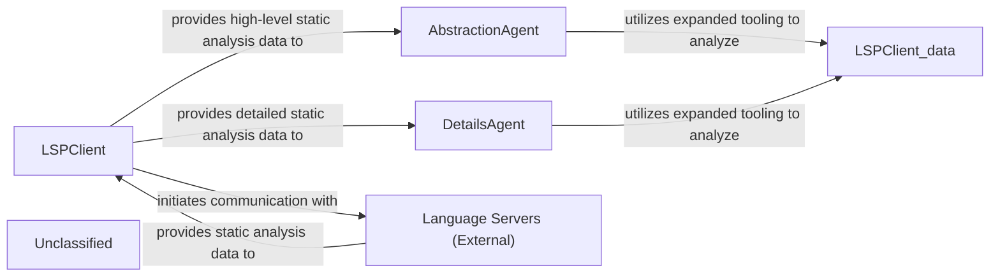
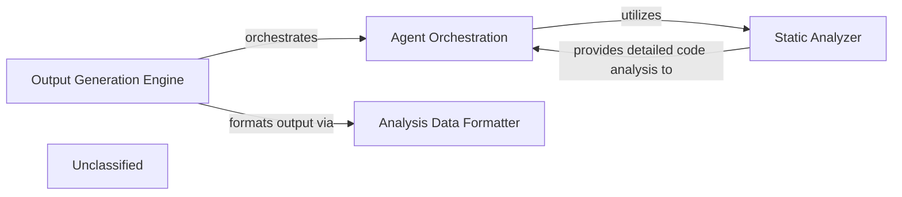
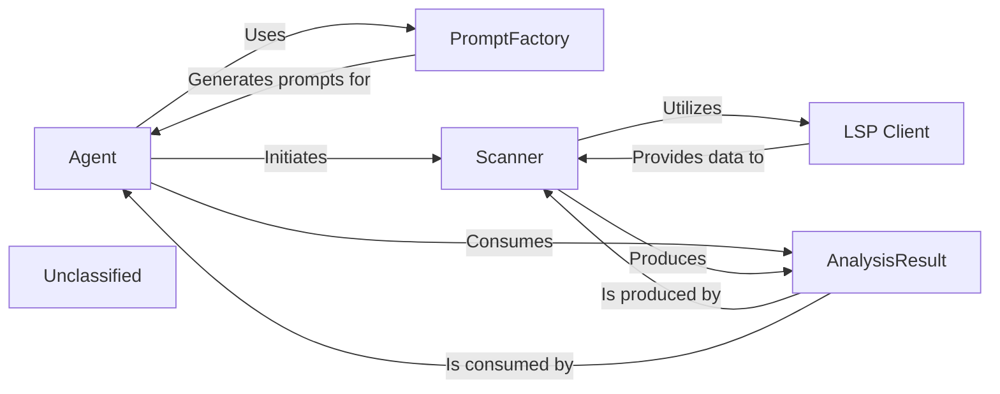
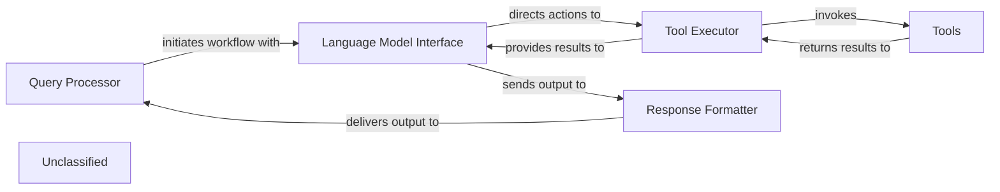
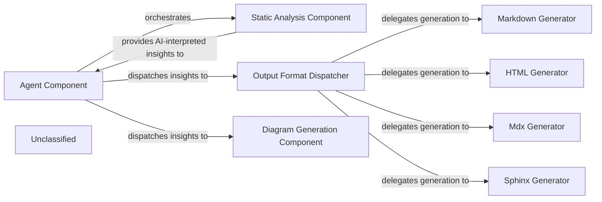
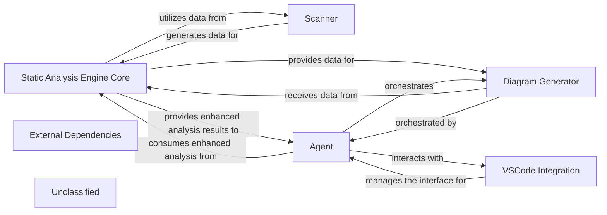
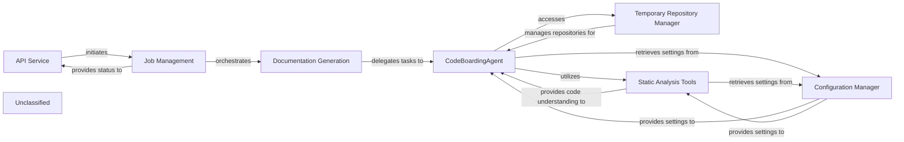
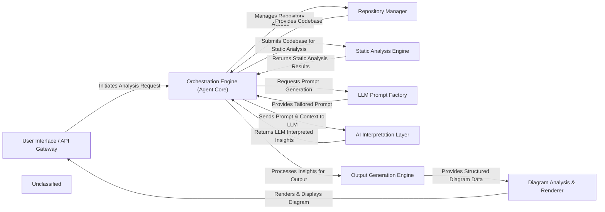

## Details

The system's architecture is centered around the LSPClient, which serves as a robust data acquisition layer, orchestrating communication with various Language Servers (External) to gather comprehensive static analysis data. This client, now enhanced with flexible language configuration and VSCode integration, efficiently collects diverse code intelligence. The collected data is then channeled to two specialized analytical components: the AbstractionAgent and the DetailsAgent. The AbstractionAgent consumes high-level data to identify major system components and their interconnections, forming an abstract architectural representation. Concurrently, the DetailsAgent utilizes detailed data to perform granular analysis, uncovering implementation specifics and design patterns. Both agents leverage expanded internal tooling to process this data, ensuring a thorough and multi-faceted understanding of the codebase. This design facilitates a clear separation of concerns, enabling efficient and scalable architectural analysis.

### LSPClient
Acts as the central data acquisition and orchestration layer, establishing robust communication with various Language Servers (External). It is enhanced with flexible language detection and configuration mechanisms, alongside deeper integration with the VSCode environment, making it a sophisticated data provider.

**Related Classes/Methods**:

- <a href="https://github.com/CodeBoarding/CodeBoarding/blob/main/.codeboardingstatic_analyzer/lsp_client/client.py#L57-L1102" target="_blank" rel="noopener noreferrer">`LSPClient`:57-1102</a>

### AbstractionAgent
Focuses on synthesizing high-level architectural views, identifying major components and their responsibilities. It processes data using expanded tooling to synthesize high-level architectural views.

**Related Classes/Methods**:

- <a href="https://github.com/CodeBoarding/CodeBoarding/blob/main/.codeboardingagents/abstraction_agent.py#L30-L206" target="_blank" rel="noopener noreferrer">`AbstractionAgent`:30-206</a>

### DetailsAgent
Delves into specific code sections, uncovering design patterns and explaining implementation rationale. It processes data using expanded tooling to perform in-depth analysis of code structures.

**Related Classes/Methods**:

- <a href="https://github.com/CodeBoarding/CodeBoarding/blob/main/.codeboardingagents/details_agent.py#L31-L191" target="_blank" rel="noopener noreferrer">`DetailsAgent`:31-191</a>

### Language Servers (External)
External services that provide comprehensive static analysis data and code intelligence (e.g., call graphs, symbol references) to the LSPClient.

**Related Classes/Methods**:

- `LanguageServer`:1-10

### Unclassified
Component for all unclassified files and utility functions (Utility functions/External Libraries/Dependencies)

**Related Classes/Methods**: _None_

### [FAQ](https://github.com/CodeBoarding/GeneratedOnBoardings/tree/main?tab=readme-ov-file#faq)

## Details

The system is orchestrated by the Output Generation Engine, which initiates the analysis process. It delegates detailed code interpretation, abstraction, planning, and validation to the Agent Orchestration component. The Agent Orchestration component, in turn, relies heavily on the Static Analyzer for foundational code understanding. The Static Analyzer has been significantly enhanced with a deeper integration of the Language Server Protocol (LSP) through its LSPClient, enabling it to extract comprehensive structural and semantic information, including call graphs, class hierarchies, and package dependencies. This rich data is then consumed by the Agent Orchestration's expanded toolset to perform sophisticated analysis. Finally, the Output Generation Engine uses the Analysis Data Formatter to convert the processed analysis into a standardized JSON format for architectural diagram generation.

### Output Generation Engine [[Expand]](./Output_Generation_Engine.md)
Orchestrates the entire process of generating structured analysis outputs from interpreted code. It coordinates `Agent Orchestration` to perform detailed analysis, abstraction, planning, and validation, ultimately producing JSON files that serve as the basis for architectural diagrams. It also utilizes the `Analysis Data Formatter`.

**Related Classes/Methods**:

- `OutputGenerationEngine`

### Agent Orchestration
Manages and coordinates various specialized agents responsible for interpreting code, performing detailed analysis, abstraction, planning, and validation. These agents rely on the `Static Analyzer` for foundational code understanding, leveraging its enhanced capabilities through a sophisticated toolset for reading documentation, file content, file structures, and package information.

**Related Classes/Methods**:

- <a href="https://github.com/CodeBoarding/CodeBoarding/blob/main/.codeboardingagents/tools/utils.py" target="_blank" rel="noopener noreferrer">`AgentOrchestration`</a>

### Static Analyzer
Provides foundational capabilities for understanding and processing source code across different programming languages. It has been significantly enhanced with a deeper integration of the Language Server Protocol (LSP) via its `LSPClient`, enabling it to extract comprehensive structural and semantic information, including call graphs, class hierarchies, and package dependencies. This rich data is then consumed by `Agent Orchestration` for deeper analysis.

**Related Classes/Methods**:

- <a href="https://github.com/CodeBoarding/CodeBoarding/blob/main/.codeboardingstatic_analyzer/programming_language.py" target="_blank" rel="noopener noreferrer">`static_analyzer.programming_language.ProgrammingLanguage`</a>
- <a href="https://github.com/CodeBoarding/CodeBoarding/blob/main/.codeboardingstatic_analyzer/scanner.py" target="_blank" rel="noopener noreferrer">`static_analyzer.scanner.Scanner`</a>
- <a href="https://github.com/CodeBoarding/CodeBoarding/blob/main/.codeboardingstatic_analyzer/lsp_client/client.py" target="_blank" rel="noopener noreferrer">`static_analyzer.lsp_client.client.LSPClient`</a>

### Analysis Data Formatter
Responsible for converting the internal analysis objects into a standardized JSON format. This component ensures that the output is structured consistently, making it suitable for consumption by external diagram rendering tools.

**Related Classes/Methods**:

- <a href="https://github.com/CodeBoarding/CodeBoarding/blob/main/.codeboarding." target="_blank" rel="noopener noreferrer">`AnalysisDataFormatter`</a>

### Unclassified
Component for all unclassified files and utility functions (Utility functions/External Libraries/Dependencies)

**Related Classes/Methods**: _None_

### [FAQ](https://github.com/CodeBoarding/GeneratedOnBoardings/tree/main?tab=readme-ov-file#faq)

## Details

The system's architecture is centered around an Agent that orchestrates static code analysis and decision-making. The Agent utilizes a PromptFactory to dynamically generate context-aware prompts, guiding its interactions and analysis tasks. To perform code analysis, the Agent invokes the Scanner, which acts as the primary interface for static analysis. The Scanner relies on the LSP Client to communicate with external Language Servers, thereby acquiring rich, language-specific code insights. All findings from the static analysis are then structured and encapsulated within an AnalysisResult object, which the Agent subsequently consumes to inform its actions and refine its understanding of the codebase. This modular design ensures clear separation of concerns, enabling flexible integration with various language servers and adaptable agent behaviors.

### Agent
Drives the overall analysis process, makes decisions based on analysis results, and orchestrates interactions with other components. It utilizes PromptFactory for dynamic prompt generation and Scanner to initiate code analysis.

**Related Classes/Methods**:

- <a href="https://github.com/CodeBoarding/CodeBoarding/blob/main/.codeboardingagents/abstraction_agent.py" target="_blank" rel="noopener noreferrer">`agents.abstraction_agent`</a>
- <a href="https://github.com/CodeBoarding/CodeBoarding/blob/main/.codeboardingagents/agent.py" target="_blank" rel="noopener noreferrer">`agents.agent`</a>
- <a href="https://github.com/CodeBoarding/CodeBoarding/blob/main/.codeboardingagents/agent_responses.py" target="_blank" rel="noopener noreferrer">`agents.agent_responses`</a>
- <a href="https://github.com/CodeBoarding/CodeBoarding/blob/main/.codeboardingagents/details_agent.py" target="_blank" rel="noopener noreferrer">`agents.details_agent`</a>
- <a href="https://github.com/CodeBoarding/CodeBoarding/blob/main/.codeboardingagents/tools/" target="_blank" rel="noopener noreferrer">`agents.tools`</a>
- <a href="https://github.com/CodeBoarding/CodeBoarding/blob/main/.codeboardingagents/prompts/" target="_blank" rel="noopener noreferrer">`agents.prompts`</a>

### PromptFactory
Dynamically generates LLM prompts based on specified types and models, providing structured input for the Agent.

**Related Classes/Methods**:

- <a href="https://github.com/CodeBoarding/CodeBoarding/blob/main/.codeboardingagents/prompts/" target="_blank" rel="noopener noreferrer">`agents.prompts`</a>

### Scanner
Acts as the entry point for static analysis, parsing source code, extracting relevant information, and orchestrating the data gathering from language servers.

**Related Classes/Methods**:

- <a href="https://github.com/CodeBoarding/CodeBoarding/blob/main/.codeboardingstatic_analyzer/scanner.py" target="_blank" rel="noopener noreferrer">`static_analyzer.scanner`</a>

### LSP Client
Integrates with Language Server Protocol (LSP) to communicate with external language servers, obtaining rich analysis data such as definitions, references, and diagnostics.

**Related Classes/Methods**:

- <a href="https://github.com/CodeBoarding/CodeBoarding/blob/main/.codeboardingstatic_analyzer/lsp_client/client.py" target="_blank" rel="noopener noreferrer">`static_analyzer.lsp_client.client`</a>

### AnalysisResult
Encapsulates the structured output of the static analysis, including code graphs, findings, and other relevant data, providing a standardized format for consumption.

**Related Classes/Methods**:

- <a href="https://github.com/CodeBoarding/CodeBoarding/blob/main/.codeboardingstatic_analyzer/analysis_result.py" target="_blank" rel="noopener noreferrer">`static_analyzer.analysis_result`</a>

### Unclassified
Component for all unclassified files and utility functions (Utility functions/External Libraries/Dependencies)

**Related Classes/Methods**: _None_

### [FAQ](https://github.com/CodeBoarding/GeneratedOnBoardings/tree/main?tab=readme-ov-file#faq)

## Details

The system's architecture is designed around a Query Processor that manages user interactions and orchestrates the overall workflow. It interfaces with the Language Model Interface, which is responsible for communicating with the underlying Large Language Model and directing actions to the Tool Executor. A key strength of this architecture lies in its Tools component, which has been substantially enhanced to provide advanced information gathering, static code analysis, and LSP client interactions, significantly improving the system's analytical depth. The Tool Executor processes the rich data from these Tools and feeds it back to the Language Model Interface. Finally, the Response Formatter takes the LLM's output and transforms it into a user-friendly format, which is then returned to the Query Processor. This refined architecture underscores a robust and highly capable Tools component, driving a significant evolution in the system's ability to process and respond to complex queries.

### Query Processor
Manages user interactions and initiates the overall workflow.

**Related Classes/Methods**:

- `QueryProcessor.handle_request`:10-20

### Language Model Interface
Acts as the primary conduit to the Large Language Model (LLM), orchestrates communication with the LLM and directs necessary actions to the Tool Executor.

**Related Classes/Methods**:

- `LanguageModelInterface.communicate_with_llm`

### Tool Executor
Processes the outcomes from the Tools and feeds the enriched results back to the Language Model Interface. Directs invocation of Tools for specialized tasks.

**Related Classes/Methods**:

- `ToolExecutor.execute_tool`

### Tools
Has undergone substantial modifications to its `read_` tools and `lsp_client`. Executes advanced static code analysis and data retrieval. Performs advanced information gathering and static analysis.

**Related Classes/Methods**:

- `Tools.lsp_client`:1-10

### Response Formatter
Crafts a user-friendly message for the Query Processor. Formats LLM output.

**Related Classes/Methods**:

- `ResponseFormatter.format_response`:1-10

### Unclassified
Component for all unclassified files and utility functions (Utility functions/External Libraries/Dependencies)

**Related Classes/Methods**: _None_

### [FAQ](https://github.com/CodeBoarding/GeneratedOnBoardings/tree/main?tab=readme-ov-file#faq)

## Details

The system's architecture is centered around the `Agent Component`, which acts as the primary orchestrator for static analysis and documentation generation. This component leverages its enhanced information-gathering capabilities to interact with the `Static Analysis Component`, a crucial upstream dependency responsible for performing robust code analysis and generating "AI-interpreted insights." These insights, enriched by the `Static Analysis Component`'s strengthened LSP client integration and sophisticated language understanding, are then dispatched by the `Agent Component` to two distinct pathways: the `Output Format Dispatcher` and the `Diagram Generation Component`. The `Output Format Dispatcher` delegates the conversion of insights into various textual documentation formats (Markdown, HTML, MDX, Sphinx) via specialized generators, while the newly recognized `Diagram Generation Component` provides visual representations of the analysis results. This modular design ensures a clear separation of concerns, supporting a flexible and extensible pipeline for both comprehensive documentation and insightful visualizations.

### Agent Component
This component acts as the primary orchestrator, driving the overall process of static analysis and documentation generation. It has significantly enhanced capabilities for gathering information from the codebase through its internal tools. It interacts with the `Static Analysis Component` to obtain AI-interpreted insights and then directs these insights to the `Output Format Dispatcher` for conversion into various documentation formats, and to the `Diagram Generation Component` for visualization. This component embodies the core workflow logic, coordinating the different stages of the documentation pipeline.

**Related Classes/Methods**:

- <a href="https://github.com/CodeBoarding/CodeBoarding/blob/main/.codeboardingagents/agent.py" target="_blank" rel="noopener noreferrer">`agents/agent.py`</a>

### Static Analysis Component
This component is responsible for performing robust static analysis on the codebase and generating "AI-interpreted insights." It acts as a crucial upstream dependency, providing the raw, processed data that the `Agent Component` then utilizes. Its strengthened LSP client integration and sophisticated understanding of various programming languages enhance its ability to identify, parse, and process code, delivering deeper insights within the development environment.

**Related Classes/Methods**:

- <a href="https://github.com/CodeBoarding/CodeBoarding/blob/main/.codeboardingstatic_analyzer/lsp_client/client.py" target="_blank" rel="noopener noreferrer">`static_analyzer/lsp_client/client.py`</a>

### Output Format Dispatcher
This component serves as the central orchestrator within the Output Generation Engine. It receives AI-interpreted insights along with the desired output format from the `Agent Component` and dispatches the data to the appropriate specialized generator (e.g., Markdown, HTML, MDX, Sphinx). This component is crucial for maintaining a clear separation of concerns and supporting the "Pipeline/Workflow" architectural pattern by managing the flow to specific formatters.

**Related Classes/Methods**:

- <a href="https://github.com/CodeBoarding/CodeBoarding/blob/main/.codeboardingoutput_generators/markdown.py" target="_blank" rel="noopener noreferrer">`output_generators/markdown.py`</a>
- <a href="https://github.com/CodeBoarding/CodeBoarding/blob/main/.codeboardingoutput_generators/html.py" target="_blank" rel="noopener noreferrer">`output_generators/html.py`</a>
- <a href="https://github.com/CodeBoarding/CodeBoarding/blob/main/.codeboardingoutput_generators/mdx.py" target="_blank" rel="noopener noreferrer">`output_generators/mdx.py`</a>
- <a href="https://github.com/CodeBoarding/CodeBoarding/blob/main/.codeboardingoutput_generators/sphinx.py" target="_blank" rel="noopener noreferrer">`output_generators/sphinx.py`</a>

### Markdown Generator
Specializes in converting AI-interpreted insights into a well-structured Markdown format. This output is ideal for human-readable documentation, README files, and integration with Markdown-based rendering tools. It is a fundamental component for generating textual documentation, a primary output of a "Code Analysis and Documentation Generation Tool."

**Related Classes/Methods**:

- <a href="https://github.com/CodeBoarding/CodeBoarding/blob/main/.codeboardingoutput_generators/markdown.py" target="_blank" rel="noopener noreferrer">`output_generators/markdown.py`</a>

### HTML Generator
Focuses on transforming AI-interpreted insights into HTML format. This enables rich, web-based documentation, interactive reports, and seamless integration with web platforms or tools. This component provides an alternative, often more visually rich, documentation output, supporting diverse presentation needs.

**Related Classes/Methods**:

- <a href="https://github.com/CodeBoarding/CodeBoarding/blob/main/.codeboardingoutput_generators/html.py" target="_blank" rel="noopener noreferrer">`output_generators/html.py`</a>

### Mdx Generator
Specializes in converting AI-interpreted insights into MDX (Markdown with JSX) format. This enables the creation of interactive and dynamic documentation, leveraging the power of React components within Markdown.

**Related Classes/Methods**:

- <a href="https://github.com/CodeBoarding/CodeBoarding/blob/main/.codeboardingoutput_generators/mdx.py" target="_blank" rel="noopener noreferrer">`output_generators/mdx.py`</a>

### Sphinx Generator
Focuses on transforming AI-interpreted insights into a format compatible with Sphinx, a popular documentation generator. This allows for the creation of comprehensive and structured documentation, often used for large software projects.

**Related Classes/Methods**:

- <a href="https://github.com/CodeBoarding/CodeBoarding/blob/main/.codeboardingoutput_generators/sphinx.py" target="_blank" rel="noopener noreferrer">`output_generators/sphinx.py`</a>

### Diagram Generation Component
This component is responsible for generating diagrams and visualizations from the AI-interpreted insights. It provides a new way to present and understand the analysis results, complementing the textual documentation outputs.

**Related Classes/Methods**:

- <a href="https://github.com/CodeBoarding/CodeBoarding/blob/main/.codeboardingdiagram_analysis/diagram_generator.py" target="_blank" rel="noopener noreferrer">`diagram_analysis/diagram_generator.py`</a>

### Unclassified
Component for all unclassified files and utility functions (Utility functions/External Libraries/Dependencies)

**Related Classes/Methods**: _None_

### [FAQ](https://github.com/CodeBoarding/GeneratedOnBoardings/tree/main?tab=readme-ov-file#faq)

## Details

The system's architecture is centered around the `Static Analysis Engine Core`, which performs deep code analysis, leveraging data from the `Scanner` for initial parsing. The `Agent` acts as the primary orchestrator, consuming enhanced analysis results from the `Static Analysis Engine Core` to perform higher-level tasks, understand project context, and refine its outputs. A new `Diagram Generator` component, orchestrated by the `Agent` and fed data by the `Static Analysis Engine Core`, provides visual representations of the analysis. The `VSCode Integration` manages the interface with the IDE, facilitating seamless interaction for the `Agent`. All these core components rely on `External Dependencies` for foundational support. This updated architecture reflects a significant evolution in the system's analytical depth, agent intelligence, and output capabilities, particularly with the introduction of diagram generation.

### Static Analysis Engine Core
Orchestrates the static analysis process, performing deeper analysis and providing structured outputs. It now incorporates enhanced language definition and processing capabilities through its refined LSP client, allowing for deeper and more accurate static analysis. Its analysis outputs may also have evolved in structure, impacting how the Agent consumes these results.

**Related Classes/Methods**:

- `StaticAnalysisEngineCore`

### Scanner
Responsible for the initial parsing of source code, generating fundamental data. Its scanning logic has been adapted to accommodate new or modified language definitions.

**Related Classes/Methods**:

- <a href="https://github.com/CodeBoarding/CodeBoarding/blob/main/.codeboardingstatic_analyzer/__init__.py" target="_blank" rel="noopener noreferrer">`Scanner`</a>

### Agent
Interacts with the Static Analysis Engine Core, utilizing its analytical services to perform specific, higher-level tasks. The Agent has undergone substantial enhancements, particularly in its ability to gather and process information, understand project context more deeply, and refine how it formulates and communicates its outputs. It also coordinates with the VSCode Integration for IDE-specific operations and can orchestrate diagram generation.

**Related Classes/Methods**:

- <a href="https://github.com/CodeBoarding/CodeBoarding/blob/main/.codeboardingagents/diff_analyzer.py#L21-L149" target="_blank" rel="noopener noreferrer">`Agent`:21-149</a>

### VSCode Integration
Manages all interactions, configurations, and communication specific to the VSCode environment, acting as an interface between the core system and the IDE.

**Related Classes/Methods**:

- `VSCodeIntegration`:1-10

### Diagram Generator
A new functional block responsible for generating diagrams. This component likely derives data from the Static Analysis Engine Core's analysis results and is orchestrated by the Agent to produce visual representations.

**Related Classes/Methods**:

- <a href="https://github.com/CodeBoarding/CodeBoarding/blob/main/.codeboardingdiagram_analysis/diagram_generator.py" target="_blank" rel="noopener noreferrer">`DiagramGenerator`</a>

### External Dependencies
Encompasses all external libraries, frameworks, and third-party packages that the project relies on, managed through packaging configurations.

**Related Classes/Methods**:

- `ExternalDependencies`

### Unclassified
Component for all unclassified files and utility functions (Utility functions/External Libraries/Dependencies)

**Related Classes/Methods**: _None_

### [FAQ](https://github.com/CodeBoarding/GeneratedOnBoardings/tree/main?tab=readme-ov-file#faq)

## Details

The system's core flow begins with the API Service receiving requests, which are then managed by Job Management. Job Management orchestrates the Documentation Generation process. The Documentation Generation component delegates the crucial task of understanding the codebase and generating content to the CodeBoardingAgent. The CodeBoardingAgent, acting as the central intelligence, leverages the Static Analysis Tools for deep code understanding, which has been significantly enhanced through an updated LSP client. It also uses the Temporary Repository Manager to access and manage the codebase. All components rely on the Configuration Manager for system settings. The refined internal mechanisms of CodeBoardingAgent and the enhanced Static Analysis Tools lead to more robust and accurate documentation generation.

### API Service
Acts as the external entry point for the system, initiating and monitoring documentation generation jobs.

**Related Classes/Methods**:

### Job Management
Manages the lifecycle of documentation jobs, tracking their progress, status, and orchestrating the overall generation process.

**Related Classes/Methods**:

- `job_management.JobManager`:1-10

### Documentation Generation
Orchestrates the detailed process of generating documentation content by delegating specific tasks to the CodeBoardingAgent.

**Related Classes/Methods**:

### CodeBoardingAgent
The central intelligence component, now with significantly refined internal mechanisms, responsible for deeply understanding the codebase, efficiently retrieving information, and generating robust documentation content. Its internal tools for information retrieval and response formulation have been substantially enhanced.

**Related Classes/Methods**:

- <a href="https://github.com/CodeBoarding/CodeBoarding/blob/main/.codeboardingagents/abstraction_agent.py" target="_blank" rel="noopener noreferrer">`None`</a>
- <a href="https://github.com/CodeBoarding/CodeBoarding/blob/main/.codeboardingagents/agent.py" target="_blank" rel="noopener noreferrer">`None`</a>
- <a href="https://github.com/CodeBoarding/CodeBoarding/blob/main/.codeboardingagents/agent_responses.py" target="_blank" rel="noopener noreferrer">`None`</a>
- <a href="https://github.com/CodeBoarding/CodeBoarding/blob/main/.codeboardingagents/details_agent.py" target="_blank" rel="noopener noreferrer">`None`</a>
- <a href="https://github.com/CodeBoarding/CodeBoarding/blob/main/.codeboardingagents/tools/read_docs.py" target="_blank" rel="noopener noreferrer">`None`</a>
- <a href="https://github.com/CodeBoarding/CodeBoarding/blob/main/.codeboardingagents/tools/read_file.py" target="_blank" rel="noopener noreferrer">`None`</a>
- <a href="https://github.com/CodeBoarding/CodeBoarding/blob/main/.codeboardingagents/tools/read_file_structure.py" target="_blank" rel="noopener noreferrer">`None`</a>

### Temporary Repository Manager
Supports the CodeBoardingAgent by managing the cloning of repositories and handling temporary file storage for analysis.

**Related Classes/Methods**:

- `temp_repo_manager.TemporaryRepositoryManager`

### Static Analysis Tools
Provides enhanced, in-depth code understanding capabilities to the CodeBoardingAgent through a significantly overhauled Language Server Protocol (LSP) client, improving the quality and depth of code analysis for various programming languages.

**Related Classes/Methods**:

- <a href="https://github.com/CodeBoarding/CodeBoarding/blob/main/.codeboardingstatic_analyzer/lsp_client/client.py" target="_blank" rel="noopener noreferrer">`None`</a>
- <a href="https://github.com/CodeBoarding/CodeBoarding/blob/main/.codeboardingstatic_analyzer/programming_language.py" target="_blank" rel="noopener noreferrer">`static_analyzer.programming_language`</a>

### Configuration Manager
Centralized component for providing all system settings and configurations to other components, ensuring consistent operational parameters.

**Related Classes/Methods**:

- `config_manager.ConfigurationManager`:1-10

### Unclassified
Component for all unclassified files and utility functions (Utility functions/External Libraries/Dependencies)

**Related Classes/Methods**: _None_

### [FAQ](https://github.com/CodeBoarding/GeneratedOnBoardings/tree/main?tab=readme-ov-file#faq)

## Details

The system operates as a sophisticated code analysis and architectural diagram generation tool, centered around an Orchestration Engine (Agent Core). This engine initiates analysis requests received from the User Interface / API Gateway, then interacts with the Repository Manager to access the codebase. The codebase is subsequently submitted to the Static Analysis Engine for in-depth structural analysis. Results from static analysis inform the LLM Prompt Factory, which generates tailored prompts for the AI Interpretation Layer. This layer processes prompts and context using LLMs to derive architectural insights. These insights are then passed to the Output Generation Engine for structured formatting, and finally to the Diagram Analysis & Renderer to produce visual architectural diagrams, which are displayed back through the User Interface / API Gateway. This core flow is preserved, with internal enhancements across key components improving overall robustness and capability.

### User Interface / API Gateway [[Expand]](./User_Interface_API_Gateway.md)
The system's primary interface for users, handling analysis requests and displaying results, with expanded integration for VS Code.

**Related Classes/Methods**:

- <a href="https://github.com/CodeBoarding/CodeBoarding/blob/main/.codeboardinglocal_app.py" target="_blank" rel="noopener noreferrer">`local_app.app`</a>

### Orchestration Engine (Agent Core) [[Expand]](./Orchestration_Engine_Agent_Core_.md)
The central control unit managing the entire analysis workflow, coordinating all components, maintaining analysis state, and effectively managing enhanced capabilities and analysis workflow.

**Related Classes/Methods**:

- <a href="https://github.com/CodeBoarding/CodeBoarding/blob/main/.codeboardingagents/agent.py" target="_blank" rel="noopener noreferrer">`agents.agent.CodeBoardingAgent`</a>

### Repository Manager
Manages all interactions with code repositories, providing a standardized interface for source code access and temporary folder management.

**Related Classes/Methods**:

- <a href="https://github.com/CodeBoarding/CodeBoarding/blob/main/.codeboardingutils.py" target="_blank" rel="noopener noreferrer">`utils.create_temp_repo_folder`</a>
- <a href="https://github.com/CodeBoarding/CodeBoarding/blob/main/.codeboardingutils.py" target="_blank" rel="noopener noreferrer">`utils.remove_temp_repo_folder`</a>

### Static Analysis Engine [[Expand]](./Static_Analysis_Engine.md)
Performs in-depth static analysis on source code to extract structural information like CFGs and ASTs, now with significantly enhanced programming language support, more robust scanning mechanisms, and improved interaction with Language Server Protocols (LSP).

**Related Classes/Methods**:

- <a href="https://github.com/CodeBoarding/CodeBoarding/blob/main/.codeboardingstatic_analyzer/scanner.py" target="_blank" rel="noopener noreferrer">`static_analyzer.scanner.Scanner`</a>

### LLM Prompt Factory [[Expand]](./LLM_Prompt_Factory.md)
Dynamically generates and manages prompts tailored for various LLMs and code analysis tasks.

**Related Classes/Methods**:

- <a href="https://github.com/CodeBoarding/CodeBoarding/blob/main/.codeboardingagents/prompts/prompt_factory.py" target="_blank" rel="noopener noreferrer">`agents.prompts.prompt_factory.PromptFactory`</a>

### AI Interpretation Layer [[Expand]](./AI_Interpretation_Layer.md)
Interfaces with LLM providers to process analysis results and prompts, interpreting code context and generating architectural insights with more sophisticated logic for processing analysis results and prompts.

**Related Classes/Methods**:

- <a href="https://github.com/CodeBoarding/CodeBoarding/blob/main/.codeboardingagents/abstraction_agent.py" target="_blank" rel="noopener noreferrer">`agents.abstraction_agent.AbstractionAgent`</a>
- <a href="https://github.com/CodeBoarding/CodeBoarding/blob/main/.codeboardingagents/details_agent.py" target="_blank" rel="noopener noreferrer">`agents.details_agent.DetailsAgent`</a>

### Output Generation Engine [[Expand]](./Output_Generation_Engine.md)
Transforms AI-interpreted insights into structured output formats for diagram generation and documentation.

**Related Classes/Methods**:

- <a href="https://github.com/CodeBoarding/CodeBoarding/blob/main/.codeboardingoutput_generators/markdown.py" target="_blank" rel="noopener noreferrer">`output_generators.markdown.MarkdownGenerator`</a>
- <a href="https://github.com/CodeBoarding/CodeBoarding/blob/main/.codeboardingoutput_generators/html.py" target="_blank" rel="noopener noreferrer">`output_generators.html.HTMLGenerator`</a>

### Diagram Analysis & Renderer [[Expand]](./Diagram_Analysis_Renderer.md)
Refines structured output into diagram-specific formats and renders visual architectural diagrams, with enhanced capabilities for transforming AI-interpreted insights and rendering.

**Related Classes/Methods**:

- <a href="https://github.com/CodeBoarding/CodeBoarding/blob/main/.codeboardingdiagram_analysis/diagram_generator.py" target="_blank" rel="noopener noreferrer">`diagram_analysis.diagram_generator.DiagramGenerator`</a>

### Unclassified
Component for all unclassified files and utility functions (Utility functions/External Libraries/Dependencies)

**Related Classes/Methods**: _None_

### [FAQ](https://github.com/CodeBoarding/GeneratedOnBoardings/tree/main?tab=readme-ov-file#faq)

