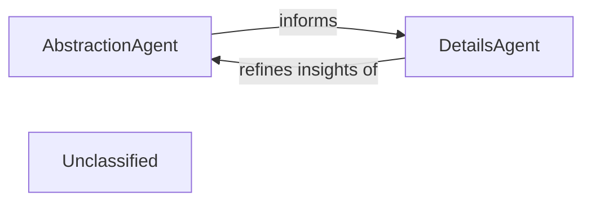
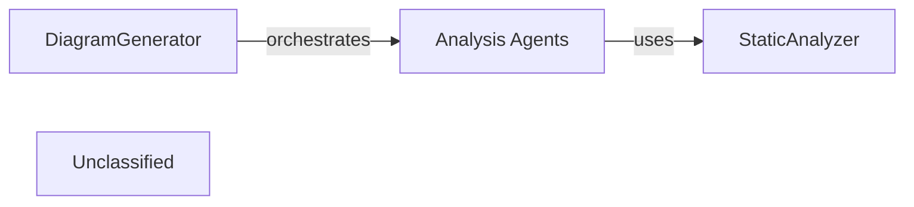
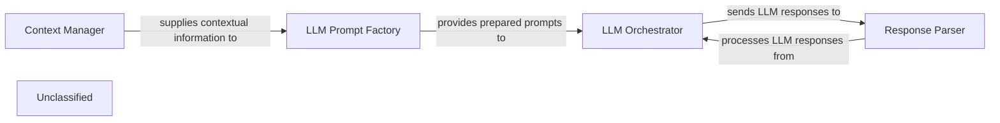
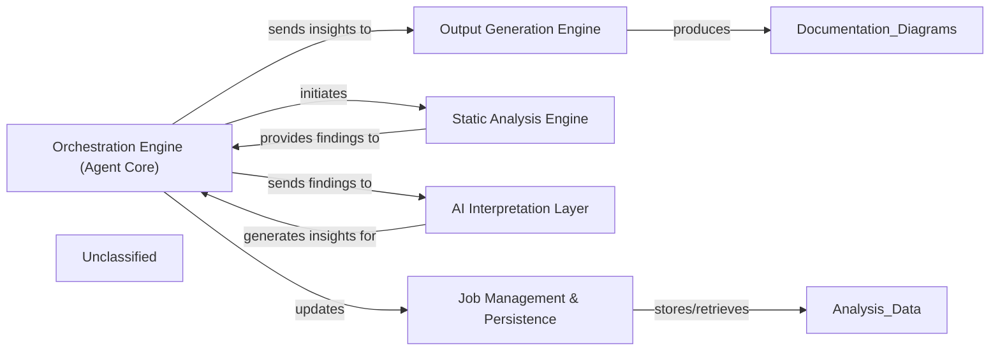
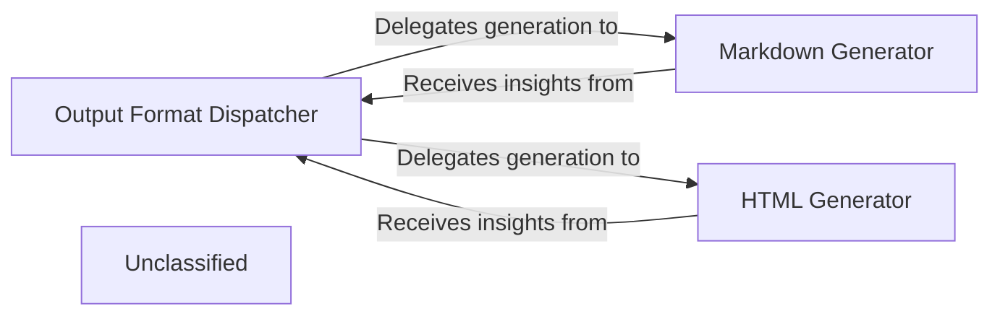
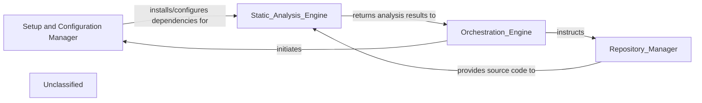
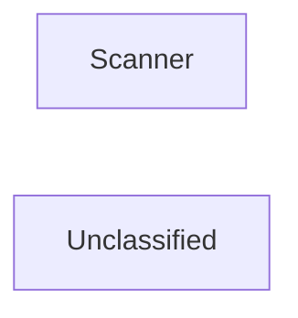
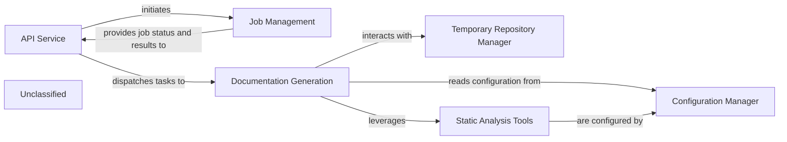
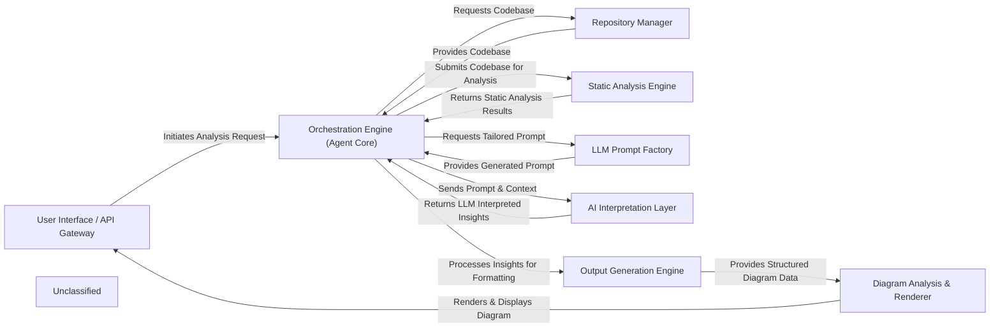

## Details

The AI Interpretation Layer is responsible for interfacing with various Large Language Model (LLM) providers to process static analysis results and user prompts. Its primary function is to interpret code context and generate architectural insights, encompassing both high-level abstraction and detailed analysis. The core components defining this layer are AbstractionAgent and DetailsAgent. The layer operates as a two-stage process where the AbstractionAgent first establishes a foundational, high-level understanding of the codebase. This abstract view then serves as input and context for the DetailsAgent, which performs a more granular analysis on specific parts. The detailed insights from the DetailsAgent can then feedback to refine or validate the initial abstractions, creating a complementary and iterative analytical workflow.

### AbstractionAgent
This agent focuses on generating high-level architectural views from the detailed static analysis data. It identifies major system components, their primary responsibilities, and their interconnections, distilling complex codebases into understandable, abstract architectural representations. This component is crucial for establishing the initial architectural blueprint.

**Related Classes/Methods**:

- <a href="https://github.com/CodeBoarding/CodeBoarding/blob/main/.codeboardingagents/abstraction_agent.py" target="_blank" rel="noopener noreferrer">`abstraction_agent`</a>

### DetailsAgent
This agent provides granular insights and detailed analysis within specific architectural components or code sections, often identified or guided by the AbstractionAgent. It delves into implementation details, identifies specific design patterns, explains the rationale behind code structures, and highlights areas of interest or concern. This component adds depth and specificity to the architectural understanding.

**Related Classes/Methods**:

- <a href="https://github.com/CodeBoarding/CodeBoarding/blob/main/.codeboardingagents/details_agent.py" target="_blank" rel="noopener noreferrer">`details_agent`</a>

### Unclassified
Component for all unclassified files and utility functions (Utility functions/External Libraries/Dependencies)

**Related Classes/Methods**: _None_

### [FAQ](https://github.com/CodeBoarding/GeneratedOnBoardings/tree/main?tab=readme-ov-file#faq)

## Details

The diagram_analysis subsystem is centered around the DiagramGenerator, which acts as the primary orchestrator for generating architectural insights. It initiates and manages a suite of Analysis Agents, each specialized in a particular aspect of code analysis, such as metadata extraction, detailed component examination, abstraction, and validation. These agents rely on the StaticAnalyzer to obtain fundamental structural information about the codebase. The DiagramGenerator coordinates the parallel execution of these agents across different levels of architectural depth, iteratively refining the analysis based on feedback. The final output of this orchestrated process is a set of structured Analysis Files, which serve as a persistent record of the derived architectural components and their relationships, ready for consumption by documentation or visualization tools.

### DiagramGenerator
This is the core orchestrator of the architectural analysis process. It initializes, configures, and coordinates various specialized Analysis Agents to perform a multi-stage analysis of the codebase. It manages the parallel execution of component analysis, applies feedback for iterative refinement, and ultimately persists the generated architectural insights into structured Analysis Files.

**Related Classes/Methods**:

- <a href="https://github.com/CodeBoarding/CodeBoarding/blob/main/.codeboardingdiagram_analysis/diagram_generator.py" target="_blank" rel="noopener noreferrer">`diagram_analysis.diagram_generator.DiagramGenerator`</a>

### Analysis Agents
This component represents a collection of intelligent agents (MetaAgent, DetailsAgent, AbstractionAgent, PlannerAgent, ValidatorAgent, DiffAnalyzingAgent) that perform specific tasks within the analysis pipeline. They are responsible for gathering project metadata, conducting detailed code analysis, abstracting architectural components, planning subsequent analysis steps, validating the accuracy of the analysis, and managing incremental updates based on code changes.

**Related Classes/Methods**:

- <a href="https://github.com/CodeBoarding/CodeBoarding/blob/main/.codeboardingagents/meta_agent.py" target="_blank" rel="noopener noreferrer">`agents.meta_agent.MetaAgent`</a>
- <a href="https://github.com/CodeBoarding/CodeBoarding/blob/main/.codeboardingagents/details_agent.py" target="_blank" rel="noopener noreferrer">`agents.details_agent.DetailsAgent`</a>
- <a href="https://github.com/CodeBoarding/CodeBoarding/blob/main/.codeboardingagents/abstraction_agent.py" target="_blank" rel="noopener noreferrer">`agents.abstraction_agent.AbstractionAgent`</a>
- <a href="https://github.com/CodeBoarding/CodeBoarding/blob/main/.codeboardingagents/planner_agent.py" target="_blank" rel="noopener noreferrer">`agents.planner_agent.PlannerAgent`</a>
- <a href="https://github.com/CodeBoarding/CodeBoarding/blob/main/.codeboardingagents/validator_agent.py" target="_blank" rel="noopener noreferrer">`agents.validator_agent.ValidatorAgent`</a>
- <a href="https://github.com/CodeBoarding/CodeBoarding/blob/main/.codeboardingagents/diff_analyzer.py" target="_blank" rel="noopener noreferrer">`agents.diff_analyzer.DiffAnalyzingAgent`</a>

### StaticAnalyzer
Provides foundational static code analysis capabilities. It extracts structural and semantic information from the codebase without executing it, which is then consumed by the Analysis Agents to inform their analytical tasks.

**Related Classes/Methods**:

### Unclassified
Component for all unclassified files and utility functions (Utility functions/External Libraries/Dependencies)

**Related Classes/Methods**: _None_

### [FAQ](https://github.com/CodeBoarding/GeneratedOnBoardings/tree/main?tab=readme-ov-file#faq)

## Details

This system describes a workflow for interacting with Large Language Models (LLMs) for code analysis. The main flow involves a Context Manager preparing relevant information, which is then used by an LLM Prompt Factory to generate tailored prompts. These prompts are passed to an LLM Orchestrator, responsible for managing interactions with various LLM providers and sending the prompts. Finally, a Response Parser processes the raw LLM responses, extracting and structuring the necessary information for further use.

### LLM Prompt Factory [[Expand]](./LLM_Prompt_Factory.md)
Dynamically generates and manages prompts specifically tailored for various Large Language Models (LLMs) and different code analysis tasks. It creates tailored prompts based on specific code analysis tasks, integrates relevant static analysis data and contextual information, adapts prompt structure for different LLM providers, and manages prompt templates.

**Related Classes/Methods**:

- <a href="https://github.com/CodeBoarding/CodeBoarding/blob/main/.codeboardingagents/prompts/prompt_factory.py" target="_blank" rel="noopener noreferrer">`agents.prompts.prompt_factory.PromptFactory`</a>

### LLM Orchestrator
Manages the interaction with different LLM providers (e.g., OpenAI, Anthropic, Google Gemini, AWS Bedrock, Ollama), handling API calls, model selection, and response routing.

**Related Classes/Methods**:

### Response Parser
Extracts and structures relevant information from the raw text responses generated by LLMs. This component is vital for transforming unstructured LLM output into a format usable by subsequent components, such as the Output Generation Engine.

**Related Classes/Methods**:

- `Response Parser`

### Context Manager
Prepares and manages the contextual information (e.g., code snippets, static analysis results, architectural patterns) that is fed into the prompts. It aggregates and organizes data from various sources to enrich the LLM's understanding.

**Related Classes/Methods**:

- `Context Manager`

### Unclassified
Component for all unclassified files and utility functions (Utility functions/External Libraries/Dependencies)

**Related Classes/Methods**: _None_

### [FAQ](https://github.com/CodeBoarding/GeneratedOnBoardings/tree/main?tab=readme-ov-file#faq)

## Details

The system operates around a central Orchestration Engine (Agent Core), embodied by `agents.meta_agent.MetaAgent`, which directs the entire code analysis and documentation generation process. This engine initiates the Static Analysis Engine (`static_analyzer.scanner.Scanner`) to extract raw code findings. These findings are then passed back to the Orchestration Engine, which subsequently dispatches them to the AI Interpretation Layer (`agents.abstraction_agent.AbstractionAgent`). This layer leverages AI to transform raw data into meaningful architectural insights. The interpreted insights are returned to the Orchestration Engine, which then feeds them into the Output Generation Engine (`output_generators.markdown.MarkdownOutputGenerator`) to produce various documentation and diagram formats. Throughout this workflow, the Job Management & Persistence component (`duckdb_crud.DuckDBCRUD`) is responsible for maintaining the state of analysis jobs and persisting all relevant data, ensuring continuity and retrievability of results.

### Orchestration Engine (Agent Core) [[Expand]](./Orchestration_Engine_Agent_Core_.md)
The central control unit that manages the entire analysis workflow. It initiates, sequences, and manages the end-to-end code analysis and documentation generation workflow, orchestrating the execution of distinct analysis stages, maintaining the current state and progress of each analysis job, and managing data transfer between components.

**Related Classes/Methods**:

- <a href="https://github.com/CodeBoarding/CodeBoarding/blob/main/.codeboardingagents/meta_agent.py" target="_blank" rel="noopener noreferrer">`agents.meta_agent.MetaAgent`</a>

### Job Management & Persistence
Manages the lifecycle and state of analysis jobs, including their initiation, progress tracking, and the storage of results. It acts as the system's memory for ongoing and completed analysis tasks.

**Related Classes/Methods**:

- <a href="https://github.com/CodeBoarding/CodeBoarding/blob/main/.codeboardingduckdb_crud.py" target="_blank" rel="noopener noreferrer">`duckdb_crud.DuckDBCRUD`</a>

### Static Analysis Engine [[Expand]](./Static_Analysis_Engine.md)
Performs in-depth static code analysis on the provided codebase, extracting structural, syntactical, and semantic information without executing the code. It provides raw findings to the Orchestration Engine.

**Related Classes/Methods**:

- <a href="https://github.com/CodeBoarding/CodeBoarding/blob/main/.codeboardingstatic_analyzer/scanner.py" target="_blank" rel="noopener noreferrer">`static_analyzer.scanner.Scanner`</a>

### AI Interpretation Layer [[Expand]](./AI_Interpretation_Layer.md)
Utilizes AI/LLMs to process and interpret the raw findings from the Static Analysis Engine, transforming them into higher-level architectural insights, relationships, and contextual understanding.

**Related Classes/Methods**:

- <a href="https://github.com/CodeBoarding/CodeBoarding/blob/main/.codeboardingagents/abstraction_agent.py" target="_blank" rel="noopener noreferrer">`agents.abstraction_agent.AbstractionAgent`</a>

### Output Generation Engine [[Expand]](./Output_Generation_Engine.md)
Responsible for transforming the architectural insights into various consumable output formats, such as architectural diagrams (e.g., Mermaid.js), documentation, or reports.

**Related Classes/Methods**:

- <a href="https://github.com/CodeBoarding/CodeBoarding/blob/main/.codeboardingoutput_generators/markdown.py" target="_blank" rel="noopener noreferrer">`output_generators.markdown.MarkdownOutputGenerator`</a>

### Unclassified
Component for all unclassified files and utility functions (Utility functions/External Libraries/Dependencies)

**Related Classes/Methods**: _None_

### [FAQ](https://github.com/CodeBoarding/GeneratedOnBoardings/tree/main?tab=readme-ov-file#faq)

## Details

The Output Generation Engine is orchestrated by the Output Format Dispatcher, a conceptual component responsible for directing AI-interpreted insights to the appropriate specialized output generators based on the desired format. This dispatcher ensures a clear separation of concerns, adhering to a pipeline architectural pattern. Key specialized generators include the Markdown Generator, which produces human-readable documentation, and the HTML Generator, which creates rich, web-based reports. These components collectively transform raw insights into various structured documentation formats, enabling flexible integration and presentation.

### Output Format Dispatcher
This component serves as the central orchestrator within the Output Generation Engine. It receives AI-interpreted insights along with the desired output format and dispatches the data to the appropriate specialized generator (e.g., Markdown, HTML). This component is crucial for maintaining a clear separation of concerns and supporting the "Pipeline/Workflow" architectural pattern by managing the flow to specific formatters.

**Related Classes/Methods**:

- <a href="https://github.com/CodeBoarding/CodeBoarding/blob/main/.codeboardingoutput_generators/markdown.py" target="_blank" rel="noopener noreferrer">`output_generators.markdown.MarkdownGenerator`</a>
- <a href="https://github.com/CodeBoarding/CodeBoarding/blob/main/.codeboardingoutput_generators/html.py" target="_blank" rel="noopener noreferrer">`output_generators.html.HTMLGenerator`</a>

### Markdown Generator
Specializes in converting AI-interpreted insights into a well-structured Markdown format. This output is ideal for human-readable documentation, README files, and integration with Markdown-based rendering tools. It is a fundamental component for generating textual documentation, a primary output of a "Code Analysis and Documentation Generation Tool."

**Related Classes/Methods**:

- <a href="https://github.com/CodeBoarding/CodeBoarding/blob/main/.codeboardingoutput_generators/markdown.py" target="_blank" rel="noopener noreferrer">`output_generators.markdown.MarkdownGenerator`</a>

### HTML Generator
Focuses on transforming AI-interpreted insights into HTML format. This enables rich, web-based documentation, interactive reports, and seamless integration with web platforms or tools. This component provides an alternative, often more visually rich, documentation output, supporting diverse presentation needs.

**Related Classes/Methods**:

- <a href="https://github.com/CodeBoarding/CodeBoarding/blob/main/.codeboardingoutput_generators/html.py" target="_blank" rel="noopener noreferrer">`output_generators.html.HTMLGenerator`</a>

### Unclassified
Component for all unclassified files and utility functions (Utility functions/External Libraries/Dependencies)

**Related Classes/Methods**: _None_

### [FAQ](https://github.com/CodeBoarding/GeneratedOnBoardings/tree/main?tab=readme-ov-file#faq)

## Details

The system is orchestrated by the Orchestration Engine, which manages the entire analysis workflow. Before any code analysis begins, the Orchestration Engine delegates to the Setup and Configuration Manager to prepare the environment by installing essential language servers (e.g., Pyright, TypeScript Language Server) and static analysis tools (e.g., Tokei, Gopls), and configuring their paths. Once the environment is ready, the Orchestration Engine directs the Repository Manager to handle all interactions with code repositories, including cloning and fetching updates. The Repository Manager then provides the retrieved source code to the Static Analysis Engine, which performs in-depth code analysis using the pre-configured tools and language servers. This modular architecture ensures a clear separation of concerns, enabling efficient setup, repository management, and static code analysis.

### Setup and Configuration Manager
responsible for preparing the environment and configuring external tools and language servers that are essential for the Static Analysis Engine.

**Related Classes/Methods**:

- <a href="https://github.com/CodeBoarding/CodeBoarding/blob/main/.codeboardingsetup.py" target="_blank" rel="noopener noreferrer">`check_uv_environment`</a>
- <a href="https://github.com/CodeBoarding/CodeBoarding/blob/main/.codeboardingsetup.py" target="_blank" rel="noopener noreferrer">`check_npm`</a>
- <a href="https://github.com/CodeBoarding/CodeBoarding/blob/main/.codeboardingsetup.py" target="_blank" rel="noopener noreferrer">`install_node_servers`</a>
- <a href="https://github.com/CodeBoarding/CodeBoarding/blob/main/.codeboardingsetup.py" target="_blank" rel="noopener noreferrer">`download_binary_from_gdrive`</a>
- <a href="https://github.com/CodeBoarding/CodeBoarding/blob/main/.codeboardingsetup.py" target="_blank" rel="noopener noreferrer">`update_static_analysis_config`</a>
- <a href="https://github.com/CodeBoarding/CodeBoarding/blob/main/.codeboardingsetup.py" target="_blank" rel="noopener noreferrer">`init_dot_env_file`</a>

### Unclassified
Component for all unclassified files and utility functions (Utility functions/External Libraries/Dependencies)

**Related Classes/Methods**: _None_

### [FAQ](https://github.com/CodeBoarding/GeneratedOnBoardings/tree/main?tab=readme-ov-file#faq)

## Details

The static analysis subsystem is designed around two core components: the `Static Analysis Engine (Orchestrator)` and the `Scanner`. The `Static Analysis Engine` acts as the central coordinator, managing the overall flow of static analysis tasks. It initiates the process by utilizing the `Scanner` component. The `Scanner`, implemented by the `ProjectScanner` class in `static_analyzer/scanner.py`, is responsible for the initial codebase assessment, identifying programming languages and their key metrics. The results from the `Scanner` are then provided back to the `Static Analysis Engine`, which uses this information to guide subsequent, more detailed analysis phases. This clear separation of concerns ensures that the initial code discovery is distinct from the overarching orchestration of the analysis process.

### Scanner
The Scanner is a core internal component responsible for the initial parsing of source code. It extracts fundamental structural elements, tokenizes the input, and prepares the code for deeper analysis, serving as the first step in generating ASTs and CFGs.

**Related Classes/Methods**:

- <a href="https://github.com/CodeBoarding/CodeBoarding/blob/main/.codeboardingstatic_analyzer/scanner.py" target="_blank" rel="noopener noreferrer">`static_analyzer.scanner.ProjectScanner`</a>

### Unclassified
Component for all unclassified files and utility functions (Utility functions/External Libraries/Dependencies)

**Related Classes/Methods**: _None_

### [FAQ](https://github.com/CodeBoarding/GeneratedOnBoardings/tree/main?tab=readme-ov-file#faq)

## Details

The system is centered around an API Service that handles user requests and orchestrates Job Management for documentation generation tasks. The Documentation Generation component, a core processing unit, performs code analysis and documentation creation. It relies on a Temporary Repository Manager for handling temporary files and repositories. Crucially, the Documentation Generation component now leverages a suite of Static Analysis Tools (including TypeScript Language Server, Pyright, tokei, and gopls) and is configured through a Configuration Manager that manages static_analysis_config.yml and .env files, ensuring the correct setup and operation of the analysis tools and LLM integrations.

### API Service
Handles all incoming API requests, validates inputs, initiates background jobs, and serves job status and results.

**Related Classes/Methods**:

- <a href="https://github.com/CodeBoarding/CodeBoarding/blob/main/.codeboardinglocal_app.py" target="_blank" rel="noopener noreferrer">`local_app.app`</a>

### Job Management
Manages the persistence and state transitions of documentation generation jobs (e.g., PENDING, RUNNING, COMPLETED, FAILED).

**Related Classes/Methods**:

- <a href="https://github.com/CodeBoarding/CodeBoarding/blob/main/.codeboardinglocal_app.py#L80-L92" target="_blank" rel="noopener noreferrer">`make_job`:80-92</a>
- <a href="https://github.com/CodeBoarding/CodeBoarding/blob/main/.codeboardingduckdb_crud.py#L49-L65" target="_blank" rel="noopener noreferrer">`insert_job`:49-65</a>
- <a href="https://github.com/CodeBoarding/CodeBoarding/blob/main/.codeboardingduckdb_crud.py#L80-L99" target="_blank" rel="noopener noreferrer">`fetch_job`:80-99</a>

### Documentation Generation
Executes the core logic of cloning repositories, analyzing code, and generating documentation files, leveraging static analysis tools and configuration.

**Related Classes/Methods**:

- <a href="https://github.com/CodeBoarding/CodeBoarding/blob/main/.codeboardinglocal_app.py#L95-L166" target="_blank" rel="noopener noreferrer">`generate_onboarding`:95-166</a>
- <a href="https://github.com/CodeBoarding/CodeBoarding/blob/main/.codeboardinglocal_app.py#L362-L440" target="_blank" rel="noopener noreferrer">`process_docs_generation_job`:362-440</a>

### Temporary Repository Manager
Handles the creation and cleanup of temporary directories used for cloning repositories and storing intermediate analysis results.

**Related Classes/Methods**:

- `manage_temp_repo`:1-10

### Static Analysis Tools
Provides language server functionalities (TypeScript, Pyright) and code analysis tools (tokei, gopls) used by the Documentation Generation component.

**Related Classes/Methods**:

- <a href="https://github.com/CodeBoarding/CodeBoarding/blob/main/.codeboardingsetup.py" target="_blank" rel="noopener noreferrer">`setup.py`</a>
- <a href="https://github.com/CodeBoarding/CodeBoarding/blob/main/.codeboardingstatic_analysis_config.yml" target="_blank" rel="noopener noreferrer">`static_analysis_config.yml`</a>

### Configuration Manager
Manages system configuration, including paths to static analysis tools, LLM provider settings, and repository roots, primarily through static_analysis_config.yml and .env files.

**Related Classes/Methods**:

- <a href="https://github.com/CodeBoarding/CodeBoarding/blob/main/.codeboardingsetup.py" target="_blank" rel="noopener noreferrer">`setup.py`</a>
- <a href="https://github.com/CodeBoarding/CodeBoarding/blob/main/.codeboardingstatic_analysis_config.yml" target="_blank" rel="noopener noreferrer">`static_analysis_config.yml`</a>
- `.env`

### Unclassified
Component for all unclassified files and utility functions (Utility functions/External Libraries/Dependencies)

**Related Classes/Methods**: _None_

### [FAQ](https://github.com/CodeBoarding/GeneratedOnBoardings/tree/main?tab=readme-ov-file#faq)

## Details

The system is designed around a central `Orchestration Engine` that manages the entire code analysis and documentation generation workflow. User requests are initiated through the `User Interface / API Gateway`, which then delegates the processing to the `Orchestration Engine`. This engine interacts with the `Repository Manager` to access code, the `Static Analysis Engine` to extract structural information, and the `LLM Prompt Factory` to prepare prompts for AI. The `AI Interpretation Layer` processes these prompts and analysis results to generate architectural insights. Finally, the `Output Generation Engine` formats these insights, and the `Diagram Analysis & Renderer` visualizes them, with the results being delivered back through the `User Interface / API Gateway`.

### User Interface / API Gateway [[Expand]](./User_Interface_API_Gateway.md)
The primary interface for users to initiate code analysis and view the generated architectural diagrams. It acts as the system's entry and exit point, handling API requests and responses.

**Related Classes/Methods**:

- <a href="https://github.com/CodeBoarding/CodeBoarding/blob/main/.codeboardinglocal_app.py" target="_blank" rel="noopener noreferrer">`local_app.app`</a>

### Orchestration Engine (Agent Core) [[Expand]](./Orchestration_Engine_Agent_Core_.md)
The central control unit that manages the entire analysis workflow, coordinating interactions between all other components and maintaining the state of the analysis. It orchestrates the various agents to perform their tasks.

**Related Classes/Methods**:

- <a href="https://github.com/CodeBoarding/CodeBoarding/blob/main/.codeboardingagents/meta_agent.py" target="_blank" rel="noopener noreferrer">`agents.meta_agent.MetaAgent`</a>

### Repository Manager [[Expand]](./Repository_Manager.md)
Handles all interactions with code repositories, including cloning, fetching, and providing a standardized interface for accessing the source code. It also manages temporary repository folders.

**Related Classes/Methods**:

- <a href="https://github.com/CodeBoarding/CodeBoarding/blob/main/.codeboardingutils.py" target="_blank" rel="noopener noreferrer">`utils.create_temp_repo_folder`</a>
- <a href="https://github.com/CodeBoarding/CodeBoarding/blob/main/.codeboardingutils.py" target="_blank" rel="noopener noreferrer">`utils.remove_temp_repo_folder`</a>

### Static Analysis Engine [[Expand]](./Static_Analysis_Engine.md)
Performs in-depth static analysis on the source code to extract structural information such as Control Flow Graphs (CFGs) and Abstract Syntax Trees (ASTs).

**Related Classes/Methods**:

- <a href="https://github.com/CodeBoarding/CodeBoarding/blob/main/.codeboardingstatic_analyzer/scanner.py" target="_blank" rel="noopener noreferrer">`static_analyzer.scanner.Scanner`</a>

### LLM Prompt Factory [[Expand]](./LLM_Prompt_Factory.md)
Dynamically generates and manages prompts specifically tailored for various Large Language Models (LLMs) and different code analysis tasks.

**Related Classes/Methods**:

- <a href="https://github.com/CodeBoarding/CodeBoarding/blob/main/.codeboardingagents/prompts/prompt_factory.py" target="_blank" rel="noopener noreferrer">`agents.prompts.prompt_factory.PromptFactory`</a>

### AI Interpretation Layer [[Expand]](./AI_Interpretation_Layer.md)
Interfaces with diverse LLM providers to process static analysis results and prompts, interpreting code context and generating architectural insights. This layer includes agents responsible for abstraction and detailed analysis.

**Related Classes/Methods**:

- <a href="https://github.com/CodeBoarding/CodeBoarding/blob/main/.codeboardingagents/abstraction_agent.py" target="_blank" rel="noopener noreferrer">`agents.abstraction_agent.AbstractionAgent`</a>
- <a href="https://github.com/CodeBoarding/CodeBoarding/blob/main/.codeboardingagents/details_agent.py" target="_blank" rel="noopener noreferrer">`agents.details_agent.DetailsAgent`</a>

### Output Generation Engine [[Expand]](./Output_Generation_Engine.md)
Transforms the AI-interpreted insights into structured output formats, preparing the data for diagram generation and other documentation purposes (e.g., Markdown, HTML).

**Related Classes/Methods**:

- <a href="https://github.com/CodeBoarding/CodeBoarding/blob/main/.codeboardingoutput_generators/markdown.py" target="_blank" rel="noopener noreferrer">`output_generators.markdown.MarkdownGenerator`</a>
- <a href="https://github.com/CodeBoarding/CodeBoarding/blob/main/.codeboardingoutput_generators/html.py" target="_blank" rel="noopener noreferrer">`output_generators.html.HTMLGenerator`</a>

### Diagram Analysis & Renderer [[Expand]](./Diagram_Analysis_Renderer.md)
Refines the structured output into a diagram-specific format (e.g., Mermaid.js syntax) and renders it into visual architectural diagrams.

**Related Classes/Methods**:

- <a href="https://github.com/CodeBoarding/CodeBoarding/blob/main/.codeboardingdiagram_analysis/diagram_generator.py" target="_blank" rel="noopener noreferrer">`diagram_analysis.diagram_generator.DiagramGenerator`</a>

### Unclassified
Component for all unclassified files and utility functions (Utility functions/External Libraries/Dependencies)

**Related Classes/Methods**: _None_

### Unclassified
Component for all unclassified files and utility functions (Utility functions/External Libraries/Dependencies)

**Related Classes/Methods**: _None_

### [FAQ](https://github.com/CodeBoarding/GeneratedOnBoardings/tree/main?tab=readme-ov-file#faq)

