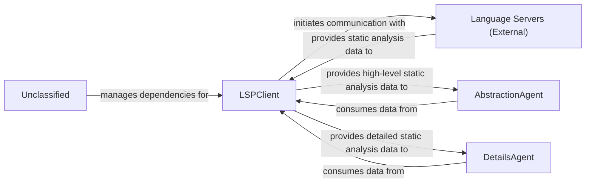
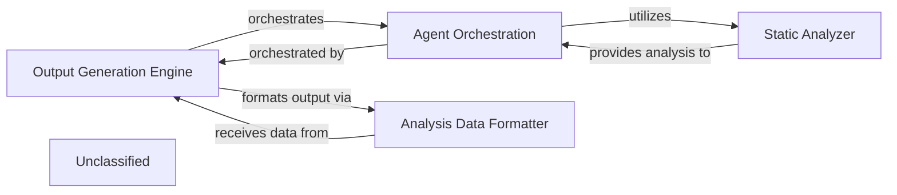
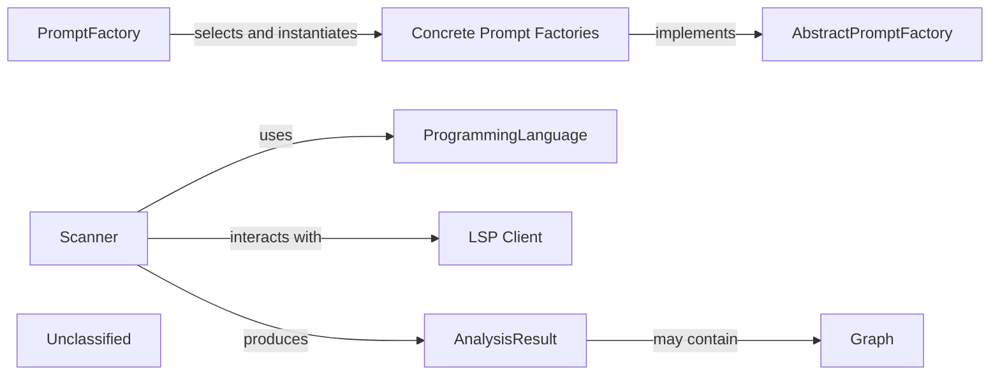
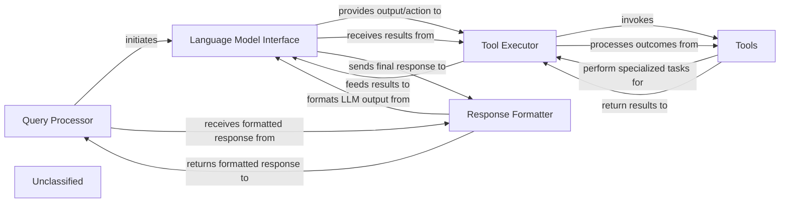
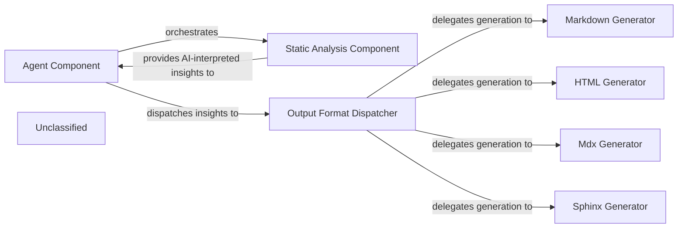
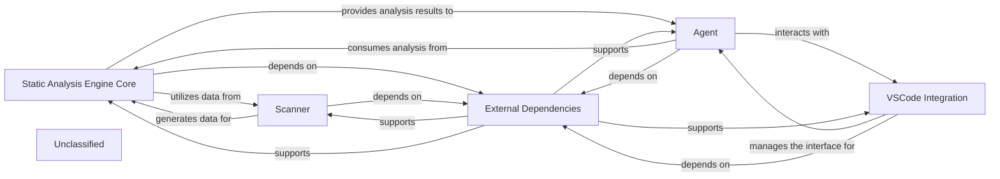
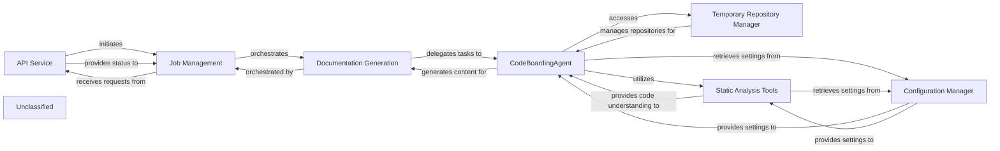
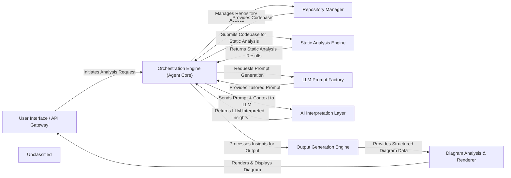

## Details

The system's core revolves around the LSPClient, which establishes and manages communication with external Language Servers to gather comprehensive static analysis data. This client now incorporates enhanced mechanisms for defining, detecting, and configuring programming languages, making it a more sophisticated and flexible data acquisition layer. The collected data is then channeled to two specialized agents: the AbstractionAgent, which distills high-level architectural views, and the DetailsAgent, which performs granular analysis of specific code sections. External Language Servers provide the raw code intelligence, while the Unclassified component manages project dependencies and packaging, ensuring the operational integrity of the entire system.

### LSPClient
Establishes and manages communication with external Language Servers using the Language Server Protocol (LSP). It orchestrates the collection of comprehensive static analysis data, including call graphs, class hierarchies, package relations, and symbol references. It now features enhanced and more flexible mechanisms for defining, detecting, and configuring programming languages, acting as a robust data acquisition layer with sophisticated language-specific configuration handling. It also features enhanced integration with the VSCode environment, leveraging specific configurations and data structures for refined interaction within a VSCode context.

**Related Classes/Methods**:

- <a href="https://github.com/CodeBoarding/CodeBoarding/blob/main/.codeboardingstatic_analyzer/lsp_client/client.py#L58-L1097" target="_blank" rel="noopener noreferrer">`LSPClient`:58-1097</a>

### AbstractionAgent
Consumes high-level static analysis data provided by the LSPClient to identify major system components, their primary responsibilities, and interconnections, forming an abstract architectural representation. It distills complex codebases into understandable, high-level architectural views.

**Related Classes/Methods**:

- <a href="https://github.com/CodeBoarding/CodeBoarding/blob/main/.codeboardingagents/agent.py" target="_blank" rel="noopener noreferrer">`AbstractionAgent`</a>

### DetailsAgent
Utilizes detailed static analysis data from the LSPClient to perform granular analysis within specific architectural components or code sections. It delves into implementation details, identifies specific design patterns, explains the rationale behind code structures, and highlights areas of interest or concern.

**Related Classes/Methods**:

- <a href="https://github.com/CodeBoarding/CodeBoarding/blob/main/.codeboardingagents/agent.py" target="_blank" rel="noopener noreferrer">`DetailsAgent`</a>

### Language Servers (External)
External processes that provide static analysis capabilities for specific programming languages. They respond to LSP requests from the LSPClient with code intelligence data such as symbol definitions, references, call hierarchies, and type information.

**Related Classes/Methods**:

### Unclassified
Component for all unclassified files, utility functions, and external libraries/dependencies. This includes managing project dependencies and packaging configurations as defined in `setup.py`, which may introduce new external libraries or alter project build and deployment characteristics.

**Related Classes/Methods**:

- <a href="https://github.com/CodeBoarding/CodeBoarding/blob/main/.codeboardingsetup.py" target="_blank" rel="noopener noreferrer">`setup.py`</a>

### Unclassified
Component for all unclassified files and utility functions (Utility functions/External Libraries/Dependencies)

**Related Classes/Methods**: _None_

### [FAQ](https://github.com/CodeBoarding/GeneratedOnBoardings/tree/main?tab=readme-ov-file#faq)

## Details

The system's architecture is composed of four key components: the `Output Generation Engine`, `Agent Orchestration`, `Static Analyzer`, and `Analysis Data Formatter`. The `Output Generation Engine` acts as the central control, orchestrating the entire analysis workflow from initial code processing to final output generation. It delegates the complex task of code interpretation and insight generation to the `Agent Orchestration` component, which in turn leverages the `Static Analyzer` for fundamental, language-specific source code analysis. Once the `Agent Orchestration` completes its tasks, the `Output Generation Engine` directs the results to the `Analysis Data Formatter`, ensuring that all generated architectural insights are consistently structured into a standardized JSON format, ready for seamless integration with diagramming tools and comprehensive documentation.

### Output Generation Engine [[Expand]](./Output_Generation_Engine.md)
Orchestrates the entire process of generating structured analysis outputs from interpreted code. It coordinates `Agent Orchestration` to perform detailed analysis, abstraction, planning, and validation, ultimately producing JSON files that serve as the basis for architectural diagrams. It also utilizes the `Analysis Data Formatter`.

**Related Classes/Methods**:

- `OutputGenerationEngine`

### Agent Orchestration
Manages and coordinates various specialized agents responsible for interpreting code, performing detailed analysis, abstraction, planning, and validation. These agents rely on the `Static Analyzer` for foundational code understanding.

**Related Classes/Methods**:

- `AgentOrchestration`:1-10

### Static Analyzer
Provides foundational capabilities for understanding and processing source code across different programming languages. It extracts structural and semantic information, which is then consumed by `Agent Orchestration` for deeper analysis.

**Related Classes/Methods**:

- <a href="https://github.com/CodeBoarding/CodeBoarding/blob/main/.codeboardingstatic_analyzer/programming_language.py" target="_blank" rel="noopener noreferrer">`static_analyzer.programming_language.ProgrammingLanguage`</a>
- <a href="https://github.com/CodeBoarding/CodeBoarding/blob/main/.codeboardingstatic_analyzer/scanner.py" target="_blank" rel="noopener noreferrer">`static_analyzer.scanner.Scanner`</a>

### Analysis Data Formatter
Responsible for converting the internal analysis objects into a standardized JSON format. This component ensures that the output is structured consistently, making it suitable for consumption by external diagram rendering tools.

**Related Classes/Methods**:

### Unclassified
Component for all unclassified files and utility functions (Utility functions/External Libraries/Dependencies)

**Related Classes/Methods**: _None_

### [FAQ](https://github.com/CodeBoarding/GeneratedOnBoardings/tree/main?tab=readme-ov-file#faq)

## Details

The project's architecture now encompasses two primary subsystems: the `PromptFactory` and the `Static Analyzer`. The `PromptFactory` subsystem is responsible for dynamically generating LLM prompts based on specified types and models, utilizing an abstract factory pattern to manage concrete prompt implementations. The newly introduced `Static Analyzer` subsystem focuses on source code analysis, employing a `Scanner` to parse code, leveraging `ProgrammingLanguage` abstractions for language-specific handling, and potentially interacting with an `LSP Client` for enhanced analysis capabilities. The output of this analysis is encapsulated in an `AnalysisResult`, which may include `Graph` representations of the code. These two subsystems operate independently but contribute to the overall functionality of the project, with the `Static Analyzer` providing insights into code structure and behavior that could potentially inform or be utilized by other parts of the system.

### PromptFactory
Responsible for dynamically generating LLM prompts based on specified types and models.

**Related Classes/Methods**:

- <a href="https://github.com/CodeBoarding/CodeBoarding/blob/main/.codeboardingagents/prompts/claude_prompts_bidirectional.py#L382-L446" target="_blank" rel="noopener noreferrer">`PromptFactory`:382-446</a>

### AbstractPromptFactory
Defines the interface for prompt factories.

**Related Classes/Methods**:

- <a href="https://github.com/CodeBoarding/CodeBoarding/blob/main/.codeboardingagents/prompts/abstract_prompt_factory.py#L10-L95" target="_blank" rel="noopener noreferrer">`AbstractPromptFactory`:10-95</a>

### Concrete Prompt Factories
Implementations of the AbstractPromptFactory for specific prompt types and models.

**Related Classes/Methods**:

- `ConcretePromptFactory`:1-10

### Scanner
Responsible for parsing source code and extracting relevant information, acting as the entry point for static analysis.

**Related Classes/Methods**:

- <a href="https://github.com/CodeBoarding/CodeBoarding/blob/main/.codeboardingstatic_analyzer/scanner.py" target="_blank" rel="noopener noreferrer">`static_analyzer.scanner.Scanner`</a>

### ProgrammingLanguage
Defines the interfaces or base classes for handling different programming languages, allowing the Scanner to be extensible.

**Related Classes/Methods**:

- <a href="https://github.com/CodeBoarding/CodeBoarding/blob/main/.codeboardingstatic_analyzer/programming_language.py" target="_blank" rel="noopener noreferrer">`static_analyzer.programming_language.ProgrammingLanguage`</a>

### LSP Client
Integrates with Language Server Protocol (LSP) for interacting with language servers to obtain analysis data.

**Related Classes/Methods**:

### AnalysisResult
Encapsulates the output of the static analysis, providing a structured representation of the findings.

**Related Classes/Methods**:

- <a href="https://github.com/CodeBoarding/CodeBoarding/blob/main/.codeboardingstatic_analyzer/analysis_result.py" target="_blank" rel="noopener noreferrer">`static_analyzer.analysis_result.AnalysisResult`</a>

### Graph
Used to represent the relationships within the analyzed code, such as control flow graphs or dependency graphs.

**Related Classes/Methods**:

- <a href="https://github.com/CodeBoarding/CodeBoarding/blob/main/.codeboardingstatic_analyzer/graph.py" target="_blank" rel="noopener noreferrer">`static_analyzer.graph.Graph`</a>

### Unclassified
Component for all unclassified files and utility functions (Utility functions/External Libraries/Dependencies)

**Related Classes/Methods**: _None_

### [FAQ](https://github.com/CodeBoarding/GeneratedOnBoardings/tree/main?tab=readme-ov-file#faq)

## Details

The system's architecture is centered around a `Query Processor` that manages user interactions and orchestrates the overall workflow. It communicates with a `Language Model Interface` to leverage the capabilities of an underlying Large Language Model. For specialized tasks, the `Language Model Interface` directs the `Tool Executor` to invoke various `Tools`, including a newly enhanced `Static Analyzer` for in-depth code analysis. After processing, the `Tool Executor` returns results to the `Language Model Interface`. Finally, the `Response Formatter` takes the LLM's output and formats it into a user-friendly message, which is then delivered back to the `Query Processor`. This design ensures a clear separation of concerns, allowing for flexible integration of new tools and output formats.

### Query Processor
Manages user interactions and orchestrates the overall workflow, initiating communication with the language model and receiving formatted responses.

**Related Classes/Methods**:

- `query_processor.QueryProcessor`:1-10

### Language Model Interface
Facilitates communication with the underlying Large Language Model, providing output/actions to the Tool Executor and receiving results.

**Related Classes/Methods**:

- `language_model_interface.LanguageModelInterface`:1-10

### Tool Executor
Directs the invocation of various tools, processes their outcomes, and feeds results back to the Language Model Interface.

**Related Classes/Methods**:

- `tool_executor.ToolExecutor`:1-10

### Tools
A collection of specialized functionalities that perform tasks for the Tool Executor, including static code analysis.

**Related Classes/Methods**:

- <a href="https://github.com/CodeBoarding/CodeBoarding/blob/main/.codeboardingstatic_analyzer/programming_language.py" target="_blank" rel="noopener noreferrer">`static_analyzer.programming_language`</a>
- <a href="https://github.com/CodeBoarding/CodeBoarding/blob/main/.codeboardingstatic_analyzer/scanner.py" target="_blank" rel="noopener noreferrer">`static_analyzer.scanner`</a>
- <a href="https://github.com/CodeBoarding/CodeBoarding/blob/main/.codeboardingstatic_analyzer/lsp_client" target="_blank" rel="noopener noreferrer">`static_analyzer.lsp_client`</a>

### Response Formatter
Takes the LLM's output and formats it into a user-friendly message in various formats.

**Related Classes/Methods**:

- <a href="https://github.com/CodeBoarding/CodeBoarding/blob/main/.codeboardingoutput_generators/html.py" target="_blank" rel="noopener noreferrer">`output_generators.html`</a>
- <a href="https://github.com/CodeBoarding/CodeBoarding/blob/main/.codeboardingoutput_generators/markdown.py" target="_blank" rel="noopener noreferrer">`output_generators.markdown`</a>
- <a href="https://github.com/CodeBoarding/CodeBoarding/blob/main/.codeboardingoutput_generators/mdx.py" target="_blank" rel="noopener noreferrer">`output_generators.mdx`</a>
- <a href="https://github.com/CodeBoarding/CodeBoarding/blob/main/.codeboardingoutput_generators/sphinx.py" target="_blank" rel="noopener noreferrer">`output_generators.sphinx`</a>

### Unclassified
Component for all unclassified files and utility functions (Utility functions/External Libraries/Dependencies)

**Related Classes/Methods**: _None_

### [FAQ](https://github.com/CodeBoarding/GeneratedOnBoardings/tree/main?tab=readme-ov-file#faq)

## Details

The system's architecture is centered around a pipeline-driven approach, with the Agent Component serving as the primary orchestrator. It initiates the static analysis process by engaging the Static Analysis Component, which has been significantly enhanced to provide sophisticated AI-interpreted insights across various programming languages. Once these insights are generated, the Agent Component directs them to the Output Format Dispatcher. This dispatcher then intelligently delegates the task of transforming these insights into diverse documentation formats, such as Markdown, HTML, MDX, or Sphinx, to specialized generator components. This design ensures a modular, extensible, and efficient workflow for code analysis and documentation generation.

### Agent Component
This component acts as the primary orchestrator, driving the overall process of static analysis and documentation generation. It interacts with the `Static Analysis Component` to obtain AI-interpreted insights and then directs these insights to the `Output Format Dispatcher` for conversion into various documentation formats. This component embodies the core workflow logic, coordinating the different stages of the documentation pipeline.

**Related Classes/Methods**:

- <a href="https://github.com/CodeBoarding/CodeBoarding/blob/main/.codeboardingagents/agent.py" target="_blank" rel="noopener noreferrer">`agents/agent.py`</a>

### Static Analysis Component
This component is responsible for performing static analysis on the codebase and generating "AI-interpreted insights." It acts as a crucial upstream dependency, providing the raw, processed data that the `Agent Component` then utilizes. Due to significant architectural changes in `static_analyzer/programming_language.py`, this component now features a deeper and more sophisticated understanding of various programming languages, enhancing its ability to identify, parse, and process code. It also features enhanced IDE integration, particularly with VS Code, allowing for more robust interaction and delivery of insights within the development environment. The updates in its LSP client and scanning logic (`static_analyzer/scanner.py`) highlight its active development and importance in the overall system.

**Related Classes/Methods**:

- <a href="https://github.com/CodeBoarding/CodeBoarding/blob/main/.codeboardingstatic_analyzer/lsp_client/client.py" target="_blank" rel="noopener noreferrer">`static_analyzer/lsp_client/client.py`</a>

### Output Format Dispatcher
This component serves as the central orchestrator within the Output Generation Engine. It receives AI-interpreted insights along with the desired output format from the `Agent Component` and dispatches the data to the appropriate specialized generator (e.g., Markdown, HTML, MDX, Sphinx). This component is crucial for maintaining a clear separation of concerns and supporting the "Pipeline/Workflow" architectural pattern by managing the flow to specific formatters.

**Related Classes/Methods**:

- <a href="https://github.com/CodeBoarding/CodeBoarding/blob/main/.codeboardingoutput_generators/markdown.py" target="_blank" rel="noopener noreferrer">`output_generators/markdown.py`</a>
- <a href="https://github.com/CodeBoarding/CodeBoarding/blob/main/.codeboardingoutput_generators/html.py" target="_blank" rel="noopener noreferrer">`output_generators/html.py`</a>
- <a href="https://github.com/CodeBoarding/CodeBoarding/blob/main/.codeboardingoutput_generators/mdx.py" target="_blank" rel="noopener noreferrer">`output_generators/mdx.py`</a>
- <a href="https://github.com/CodeBoarding/CodeBoarding/blob/main/.codeboardingoutput_generators/sphinx.py" target="_blank" rel="noopener noreferrer">`output_generators/sphinx.py`</a>

### Markdown Generator
Specializes in converting AI-interpreted insights into a well-structured Markdown format. This output is ideal for human-readable documentation, README files, and integration with Markdown-based rendering tools. It is a fundamental component for generating textual documentation, a primary output of a "Code Analysis and Documentation Generation Tool."

**Related Classes/Methods**:

- <a href="https://github.com/CodeBoarding/CodeBoarding/blob/main/.codeboardingoutput_generators/markdown.py" target="_blank" rel="noopener noreferrer">`output_generators/markdown.py`</a>

### HTML Generator
Focuses on transforming AI-interpreted insights into HTML format. This enables rich, web-based documentation, interactive reports, and seamless integration with web platforms or tools. This component provides an alternative, often more visually rich, documentation output, supporting diverse presentation needs.

**Related Classes/Methods**:

- <a href="https://github.com/CodeBoarding/CodeBoarding/blob/main/.codeboardingoutput_generators/html.py" target="_blank" rel="noopener noreferrer">`output_generators/html.py`</a>

### Mdx Generator
Specializes in converting AI-interpreted insights into MDX (Markdown with JSX) format. This enables the creation of interactive and dynamic documentation, leveraging the power of React components within Markdown.

**Related Classes/Methods**:

- <a href="https://github.com/CodeBoarding/CodeBoarding/blob/main/.codeboardingoutput_generators/mdx.py" target="_blank" rel="noopener noreferrer">`output_generators/mdx.py`</a>

### Sphinx Generator
Focuses on transforming AI-interpreted insights into a format compatible with Sphinx, a popular documentation generator. This allows for the creation of comprehensive and structured documentation, often used for large software projects.

**Related Classes/Methods**:

- <a href="https://github.com/CodeBoarding/CodeBoarding/blob/main/.codeboardingoutput_generators/sphinx.py" target="_blank" rel="noopener noreferrer">`output_generators/sphinx.py`</a>

### Unclassified
Component for all unclassified files and utility functions (Utility functions/External Libraries/Dependencies)

**Related Classes/Methods**: _None_

### [FAQ](https://github.com/CodeBoarding/GeneratedOnBoardings/tree/main?tab=readme-ov-file#faq)

## Details

The system's architecture is centered around a robust static analysis pipeline. The Scanner initiates the process by parsing source code, leveraging enhanced language definitions to generate fundamental data. This data is then consumed by the Static Analysis Engine Core, which performs deeper analysis and produces structured outputs. An Agent component utilizes these analytical services to execute higher-level tasks and seamlessly integrates with the VSCode environment through the VSCode Integration component, managing IDE-specific interactions and configurations. All these core components rely on a set of External Dependencies for their functionality, ensuring a modular and extensible design. The main flow involves the Scanner feeding parsed data to the Static Analysis Engine Core, which then processes it and provides insights to the Agent. The Agent, in turn, coordinates with the VSCode Integration for IDE interactions, with all components underpinned by External Dependencies.

### Static Analysis Engine Core
Orchestrates the static analysis process, performing deeper analysis and providing structured outputs. It now incorporates enhanced language definition and processing capabilities.

**Related Classes/Methods**:

- `StaticAnalysisEngineCore`

### Scanner
Responsible for the initial parsing of source code, generating fundamental data. Its scanning logic has been adapted to accommodate new or modified language definitions.

**Related Classes/Methods**:

- <a href="https://github.com/CodeBoarding/CodeBoarding/blob/main/.codeboardingstatic_analyzer/__init__.py" target="_blank" rel="noopener noreferrer">`Scanner`</a>

### Agent
Interacts with the Static Analysis Engine Core, utilizing its analytical services to perform specific, higher-level tasks, and coordinates with the VSCode Integration for IDE-specific operations.

**Related Classes/Methods**:

- <a href="https://github.com/CodeBoarding/CodeBoarding/blob/main/.codeboardingagents/diff_analyzer.py#L21-L149" target="_blank" rel="noopener noreferrer">`Agent`:21-149</a>

### VSCode Integration
Manages all interactions, configurations, and communication specific to the VSCode environment, acting as an interface between the core system and the IDE.

**Related Classes/Methods**:

- `VSCodeIntegration`:1-10

### External Dependencies
Encompasses all external libraries, frameworks, and third-party packages that the project relies on, managed through packaging configurations.

**Related Classes/Methods**:

- `ExternalDependencies`

### Unclassified
Component for all unclassified files and utility functions (Utility functions/External Libraries/Dependencies)

**Related Classes/Methods**: _None_

### [FAQ](https://github.com/CodeBoarding/GeneratedOnBoardings/tree/main?tab=readme-ov-file#faq)

## Details

The system is designed around a robust documentation generation pipeline. The `API Service` acts as the entry point, initiating and monitoring documentation jobs managed by the `Job Management` component. The `Documentation Generation` orchestrates the overall process, delegating the core analysis and content creation to the `CodeBoardingAgent`. This intelligent agent leverages enhanced `Static Analysis Tools` for in-depth code understanding, now with expanded capabilities for handling various programming languages. It also utilizes the `Temporary Repository Manager` for managing code repositories and relies on the `Configuration Manager` for all system settings, including those for static analysis and agent behavior. This architecture ensures a clear separation of concerns, enabling efficient and scalable documentation generation.

### API Service
Acts as the entry point for the system, initiating and monitoring documentation jobs.

**Related Classes/Methods**:

### Job Management
Manages the lifecycle of documentation jobs, tracking their progress and status.

**Related Classes/Methods**:

- `job_management.JobManager`

### Documentation Generation
Orchestrates the overall process of generating documentation, delegating tasks to other components.

**Related Classes/Methods**:

- `doc_generation.DocumentationGenerator`

### CodeBoardingAgent
The central intelligence responsible for understanding the codebase, retrieving information, and generating documentation content.

**Related Classes/Methods**:

- `codeboarding_agent.CodeBoardingAgent`

### Temporary Repository Manager
Assists the CodeBoardingAgent by handling repository cloning and temporary file storage.

**Related Classes/Methods**:

- `temp_repo_manager.TemporaryRepositoryManager`:1-10

### Static Analysis Tools
Provides in-depth code understanding to the CodeBoardingAgent, with enhanced capabilities for defining and processing various programming languages.

**Related Classes/Methods**:

- <a href="https://github.com/CodeBoarding/CodeBoarding/blob/main/.codeboardingstatic_analyzer/programming_language.py" target="_blank" rel="noopener noreferrer">`static_analyzer.programming_language`</a>

### Configuration Manager
Provides all system settings and configurations to other components.

**Related Classes/Methods**:

- `config_manager.ConfigurationManager`:1-10

### Unclassified
Component for all unclassified files and utility functions (Utility functions/External Libraries/Dependencies)

**Related Classes/Methods**: _None_

### [FAQ](https://github.com/CodeBoarding/GeneratedOnBoardings/tree/main?tab=readme-ov-file#faq)

## Details

The system provides a comprehensive code analysis platform, initiated via the `User Interface / API Gateway`. The `Orchestration Engine (Agent Core)` centrally manages the analysis workflow, coordinating interactions with other components. It leverages the `Repository Manager` for seamless access to codebases. A critical component, the `Static Analysis Engine`, performs in-depth code analysis, now featuring significantly enhanced programming language support and more robust scanning mechanisms to extract detailed structural information. This data, combined with dynamic prompts from the `LLM Prompt Factory`, is fed to the `AI Interpretation Layer` for advanced contextual understanding and insight generation. Finally, the `Output Generation Engine` processes these insights into structured formats, which the `Diagram Analysis & Renderer` transforms into visual architectural diagrams for display back to the user.

### User Interface / API Gateway [[Expand]](./User_Interface_API_Gateway.md)
The system's primary interface for users, handling analysis requests and displaying results, with expanded integration for VS Code.

**Related Classes/Methods**:

- <a href="https://github.com/CodeBoarding/CodeBoarding/blob/main/.codeboardinglocal_app.py" target="_blank" rel="noopener noreferrer">`local_app.app`</a>

### Orchestration Engine (Agent Core) [[Expand]](./Orchestration_Engine_Agent_Core_.md)
The central control unit managing the entire analysis workflow, coordinating all components and maintaining analysis state.

**Related Classes/Methods**:

- <a href="https://github.com/CodeBoarding/CodeBoarding/blob/main/.codeboardingagents/agent.py" target="_blank" rel="noopener noreferrer">`agents.agent.CodeBoardingAgent`</a>

### Repository Manager
Manages all interactions with code repositories, providing a standardized interface for source code access and temporary folder management.

**Related Classes/Methods**:

- <a href="https://github.com/CodeBoarding/CodeBoarding/blob/main/.codeboardingutils.py" target="_blank" rel="noopener noreferrer">`utils.create_temp_repo_folder`</a>
- <a href="https://github.com/CodeBoarding/CodeBoarding/blob/main/.codeboardingutils.py" target="_blank" rel="noopener noreferrer">`utils.remove_temp_repo_folder`</a>

### Static Analysis Engine [[Expand]](./Static_Analysis_Engine.md)
Performs in-depth static analysis on source code to extract structural information like CFGs and ASTs, now with significantly enhanced programming language support and more robust scanning mechanisms.

**Related Classes/Methods**:

- <a href="https://github.com/CodeBoarding/CodeBoarding/blob/main/.codeboardingstatic_analyzer/scanner.py" target="_blank" rel="noopener noreferrer">`static_analyzer.scanner.Scanner`</a>

### LLM Prompt Factory [[Expand]](./LLM_Prompt_Factory.md)
Dynamically generates and manages prompts tailored for various LLMs and code analysis tasks.

**Related Classes/Methods**:

- <a href="https://github.com/CodeBoarding/CodeBoarding/blob/main/.codeboardingagents/prompts/prompt_factory.py" target="_blank" rel="noopener noreferrer">`agents.prompts.prompt_factory.PromptFactory`</a>

### AI Interpretation Layer [[Expand]](./AI_Interpretation_Layer.md)
Interfaces with LLM providers to process analysis results and prompts, interpreting code context and generating architectural insights.

**Related Classes/Methods**:

- <a href="https://github.com/CodeBoarding/CodeBoarding/blob/main/.codeboardingagents/abstraction_agent.py" target="_blank" rel="noopener noreferrer">`agents.abstraction_agent.AbstractionAgent`</a>
- <a href="https://github.com/CodeBoarding/CodeBoarding/blob/main/.codeboardingagents/details_agent.py" target="_blank" rel="noopener noreferrer">`agents.details_agent.DetailsAgent`</a>

### Output Generation Engine [[Expand]](./Output_Generation_Engine.md)
Transforms AI-interpreted insights into structured output formats for diagram generation and documentation.

**Related Classes/Methods**:

- <a href="https://github.com/CodeBoarding/CodeBoarding/blob/main/.codeboardingoutput_generators/markdown.py" target="_blank" rel="noopener noreferrer">`output_generators.markdown.MarkdownGenerator`</a>
- <a href="https://github.com/CodeBoarding/CodeBoarding/blob/main/.codeboardingoutput_generators/html.py" target="_blank" rel="noopener noreferrer">`output_generators.html.HTMLGenerator`</a>

### Diagram Analysis & Renderer [[Expand]](./Diagram_Analysis_Renderer.md)
Refines structured output into diagram-specific formats and renders visual architectural diagrams.

**Related Classes/Methods**:

- <a href="https://github.com/CodeBoarding/CodeBoarding/blob/main/.codeboardingdiagram_analysis/diagram_generator.py" target="_blank" rel="noopener noreferrer">`diagram_analysis.diagram_generator.DiagramGenerator`</a>

### Unclassified
Component for all unclassified files and utility functions (Utility functions/External Libraries/Dependencies)

**Related Classes/Methods**: _None_

### [FAQ](https://github.com/CodeBoarding/GeneratedOnBoardings/tree/main?tab=readme-ov-file#faq)

