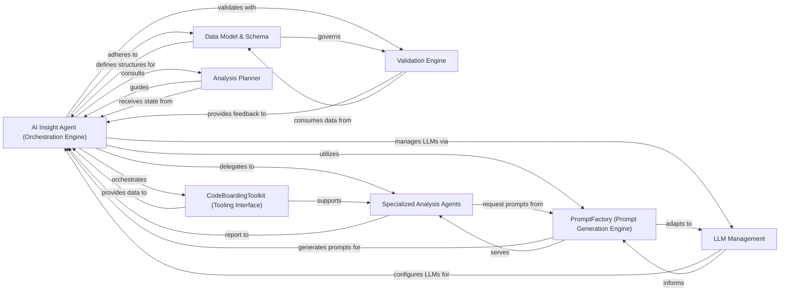
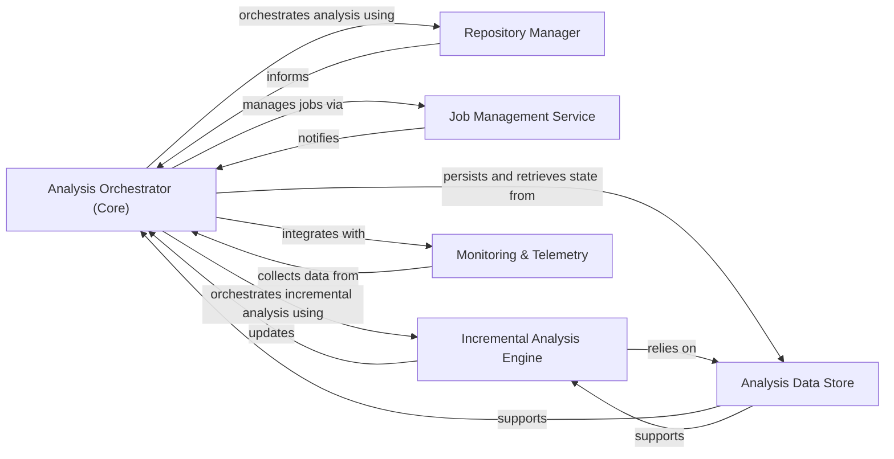
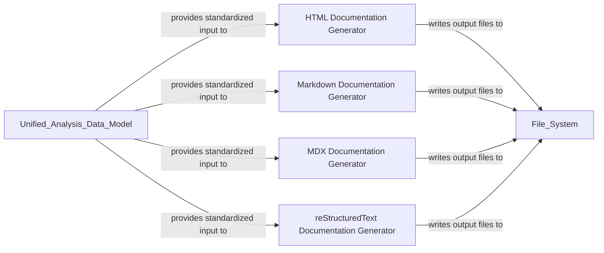
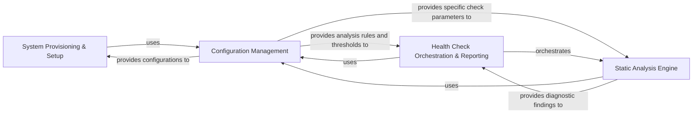
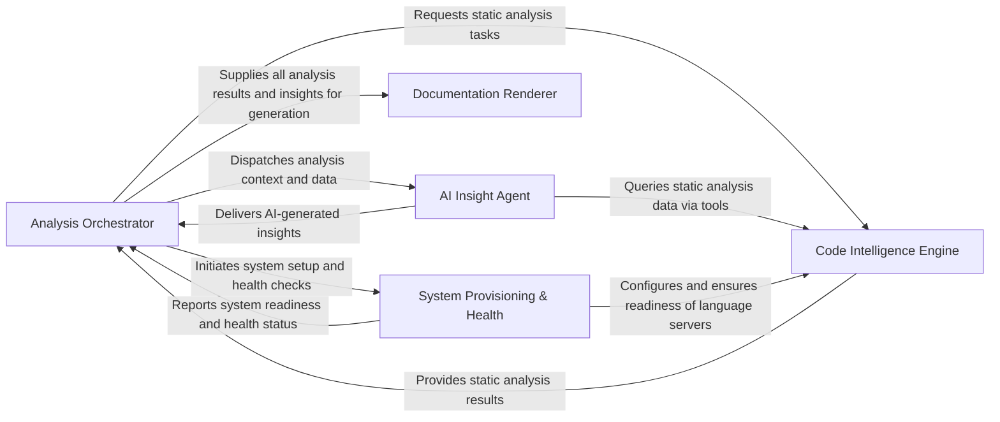

```mermaid
graph LR
    Project_Scanner_Configurer["Project Scanner & Configurer"]
    LSP_Client_Core["LSP Client Core"]
    Language_Specific_LSP_Adapters["Language-Specific LSP Adapters"]
    LSP_Environment_Manager["LSP Environment Manager"]
    Code_Graph_Reference_Management["Code Graph & Reference Management"]
    Analysis_Results_Repository["Analysis Results Repository"]
    Incremental_Analysis_Manager["Incremental Analysis Manager"]
    Cluster_Change_Analyzer["Cluster Change Analyzer"]
    Project_Scanner_Configurer -- "configures" --> LSP_Environment_Manager
    Project_Scanner_Configurer -- "provides language settings to" --> Language_Specific_LSP_Adapters
    LSP_Environment_Manager -- "manages LSP setup for" --> Language_Specific_LSP_Adapters
    Language_Specific_LSP_Adapters -- "uses" --> LSP_Client_Core
    LSP_Client_Core -- "provides code intelligence to" --> Code_Graph_Reference_Management
    Code_Graph_Reference_Management -- "stores results in" --> Analysis_Results_Repository
    Analysis_Results_Repository -- "provides analysis data to" --> Incremental_Analysis_Manager
    Incremental_Analysis_Manager -- "informs" --> Code_Graph_Reference_Management
    Incremental_Analysis_Manager -- "provides change context to" --> Cluster_Change_Analyzer
    Cluster_Change_Analyzer -- "queries" --> Analysis_Results_Repository
```

## Details

This component provides the AI intelligence, housing the core agent logic that plans, executes, and validates analysis tasks using Large Language Models (LLMs). It includes a comprehensive toolkit for agents to interact with the codebase and static analysis results, and a robust prompt management system for effective LLM communication.

### AI Insight Agent (Orchestration Engine)
Manages the overall workflow of code analysis, including file classification, component grouping, and validation. It coordinates the execution of specialized agents and tools, acting as the central intelligence for planning and executing analysis tasks.

**Related Classes/Methods**:

- <a href="https://github.com/CodeBoarding/CodeBoarding/blob/main/.codeboardingagents/agent.py" target="_blank" rel="noopener noreferrer">`agents.agent.CodeBoardingAgent`</a>

### CodeBoardingToolkit (Tooling Interface)
Provides a unified interface to a suite of tools for accessing and analyzing the codebase (e.g., reading files, CFG, file structure, external dependencies, method invocations). It enables agents to interact with the codebase effectively.

**Related Classes/Methods**:

- <a href="https://github.com/CodeBoarding/CodeBoarding/blob/main/.codeboardingagents/tools/toolkit.py" target="_blank" rel="noopener noreferrer">`agents.tools.toolkit.CodeBoardingToolkit`</a>

### PromptFactory (Prompt Generation Engine)
Generates and manages LLM prompts, adapting them for different analysis tasks and specific LLM models. It ensures effective communication with LLMs by providing tailored prompts.

**Related Classes/Methods**:

- <a href="https://github.com/CodeBoarding/CodeBoarding/blob/main/.codeboardingagents/prompts/prompt_factory.py" target="_blank" rel="noopener noreferrer">`agents.prompts.prompt_factory.PromptFactory`</a>

### LLM Management
Handles the configuration, initialization, and lifecycle of various Large Language Models (LLMs) used throughout the analysis process, ensuring agents can interact with the appropriate LLM.

**Related Classes/Methods**:

- <a href="https://github.com/CodeBoarding/CodeBoarding/blob/main/.codeboardingagents/llm_config.py" target="_blank" rel="noopener noreferrer">`agents.llm.LLMManager`</a>
- <a href="https://github.com/CodeBoarding/CodeBoarding/blob/main/.codeboardingagents/llm_config.py" target="_blank" rel="noopener noreferrer">`agents.llm.LLMConfigurator`</a>

### Data Model & Schema
Defines the structured data formats (Pydantic models) for representing inputs, intermediate results, and final outputs of the code analysis, ensuring consistency across components and LLM interactions.

**Related Classes/Methods**:

- <a href="https://github.com/CodeBoarding/CodeBoarding/blob/main/.codeboardingagents/agent_responses.py" target="_blank" rel="noopener noreferrer">`agents.agent_responses.LLMBaseModel`</a>

### Validation Engine
Ensures the consistency and correctness of the generated analysis results, including file classifications, component relationships, and cluster coverage, providing a feedback mechanism for the agent's output.

**Related Classes/Methods**:

- <a href="https://github.com/CodeBoarding/CodeBoarding/blob/main/.codeboardingagents/validation.py" target="_blank" rel="noopener noreferrer">`agents.validation.ResultValidator`</a>
- <a href="https://github.com/CodeBoarding/CodeBoarding/blob/main/.codeboardingagents/validation.py" target="_blank" rel="noopener noreferrer">`agents.validation.SchemaValidator`</a>

### Analysis Planner
Determines the scope and depth of analysis for individual components or clusters, advising the Orchestration Engine on whether further expansion or detailed examination is required.

**Related Classes/Methods**:

- <a href="https://github.com/CodeBoarding/CodeBoarding/blob/main/.codeboardingagents/planner_agent.py" target="_blank" rel="noopener noreferrer">`agents.planner.AnalysisPlanner`</a>
- <a href="https://github.com/CodeBoarding/CodeBoarding/blob/main/.codeboardingagents/planner_agent.py" target="_blank" rel="noopener noreferrer">`agents.planner.AnalysisStrategy`</a>

### Specialized Analysis Agents
A group of specialized agents responsible for performing specific types of analysis: detailed insights, abstract representations, and metadata extraction. They report their findings to the Orchestration Engine.

**Related Classes/Methods**:

- <a href="https://github.com/CodeBoarding/CodeBoarding/blob/main/.codeboardingagents/abstraction_agent.py" target="_blank" rel="noopener noreferrer">`agents.agent.DetailedAnalysisAgent`</a>
- <a href="https://github.com/CodeBoarding/CodeBoarding/blob/main/.codeboardingagents/abstraction_agent.py" target="_blank" rel="noopener noreferrer">`agents.agent.AbstractionAgent`</a>
- <a href="https://github.com/CodeBoarding/CodeBoarding/blob/main/.codeboardingagents/abstraction_agent.py" target="_blank" rel="noopener noreferrer">`agents.agent.MetadataAnalysisAgent`</a>

### [FAQ](https://github.com/CodeBoarding/GeneratedOnBoardings/tree/main?tab=readme-ov-file#faq)

## Details

This component serves as the central control plane, managing the entire analysis workflow from project initialization and repository change detection to orchestrating static analysis, AI-driven insights, and output generation. It handles job execution, incremental updates, and collects monitoring metrics.

### Analysis Orchestrator (Core)
This component serves as the central control plane, managing the entire analysis workflow from project initialization and repository change detection to orchestrating static analysis, AI-driven insights, and output generation. It handles job execution, incremental updates, and collects monitoring metrics. It is the primary coordinator of the analysis pipeline.

**Related Classes/Methods**:

- <a href="https://github.com/CodeBoarding/CodeBoarding/blob/main/.codeboardingmain.py" target="_blank" rel="noopener noreferrer">`main.main`</a>
- <a href="https://github.com/CodeBoarding/CodeBoarding/blob/main/.codeboardingdiagram_analysis/diagram_generator.py" target="_blank" rel="noopener noreferrer">`diagram_analysis.diagram_generator.DiagramGenerator`</a>
- <a href="https://github.com/CodeBoarding/CodeBoarding/blob/main/.codeboardingmain.py" target="_blank" rel="noopener noreferrer">`orchestrator.workflow_manager.WorkflowManager`</a>
- <a href="https://github.com/CodeBoarding/CodeBoarding/blob/main/.codeboardingmain.py" target="_blank" rel="noopener noreferrer">`orchestrator.cli_parser.CLIParser`</a>

### Repository Manager
Handles all interactions with the code repository, such as cloning, fetching changes, managing ignore rules, detecting file modifications, and generating git diffs. It provides the raw data for analysis.

**Related Classes/Methods**:

- <a href="https://github.com/CodeBoarding/CodeBoarding/blob/main/.codeboardingrepo_utils/change_detector.py" target="_blank" rel="noopener noreferrer">`repo_utils.change_detector.detect_changes`</a>
- <a href="https://github.com/CodeBoarding/CodeBoarding/blob/main/.codeboardingrepo_utils/change_detector.py" target="_blank" rel="noopener noreferrer">`repo_utils.git_manager.GitManager`</a>
- <a href="https://github.com/CodeBoarding/CodeBoarding/blob/main/.codeboardingrepo_utils/change_detector.py" target="_blank" rel="noopener noreferrer">`repo_utils.ignore_rules.IgnoreRules`</a>
- <a href="https://github.com/CodeBoarding/CodeBoarding/blob/main/.codeboardingrepo_utils/change_detector.py" target="_blank" rel="noopener noreferrer">`repo_utils.diff_generator.DiffGenerator`</a>

### Job Management Service
Provides an API and backend for managing asynchronous documentation generation jobs, tracking their status and results, and persisting job data using DuckDB. It also includes general utilities for temporary file management and configuration.

**Related Classes/Methods**:

- <a href="https://github.com/CodeBoarding/CodeBoarding/blob/main/.codeboardingduckdb_crud.py" target="_blank" rel="noopener noreferrer">`job_management.job_manager.JobManager`</a>
- <a href="https://github.com/CodeBoarding/CodeBoarding/blob/main/.codeboardingduckdb_crud.py" target="_blank" rel="noopener noreferrer">`job_management.duckdb_store.DuckDBJobStore`</a>
- <a href="https://github.com/CodeBoarding/CodeBoarding/blob/main/.codeboardingduckdb_crud.py" target="_blank" rel="noopener noreferrer">`job_management.job_status_tracker.JobStatusTracker`</a>
- <a href="https://github.com/CodeBoarding/CodeBoarding/blob/main/.codeboardingduckdb_crud.py" target="_blank" rel="noopener noreferrer">`job_management.temp_file_manager.TempFileManager`</a>

### Incremental Analysis Engine
Optimizes analysis by detecting code changes, analyzing their impact on existing components, classifying new files, re-expanding affected components, patching paths in analysis data, and validating the integrity of incremental updates. It defines the models and logic for incremental processing.

**Related Classes/Methods**:

- <a href="https://github.com/CodeBoarding/CodeBoarding/blob/main/.codeboardingdiagram_analysis/incremental/updater.py" target="_blank" rel="noopener noreferrer">`diagram_analysis.incremental.updater.analyze`</a>
- <a href="https://github.com/CodeBoarding/CodeBoarding/blob/main/.codeboardingdiagram_analysis/incremental/updater.py" target="_blank" rel="noopener noreferrer">`incremental.change_detector.IncrementalChangeDetector`</a>
- <a href="https://github.com/CodeBoarding/CodeBoarding/blob/main/.codeboardingdiagram_analysis/incremental/updater.py" target="_blank" rel="noopener noreferrer">`incremental.component_reexpander.ComponentReexpander`</a>
- <a href="https://github.com/CodeBoarding/CodeBoarding/blob/main/.codeboardingdiagram_analysis/incremental/updater.py" target="_blank" rel="noopener noreferrer">`incremental.path_patcher.PathPatcher`</a>

### Analysis Data Store
Persists and retrieves the structural metadata of the codebase analysis, including component definitions, file-to-component mappings, and repository state. It also tracks which files have been processed, identifies skipped or not yet analyzed files, and manages file coverage data.

**Related Classes/Methods**:

- <a href="https://github.com/CodeBoarding/CodeBoarding/blob/main/.codeboardingdiagram_analysis/file_coverage.py" target="_blank" rel="noopener noreferrer">`data_store.analysis_repository.AnalysisRepository`</a>
- <a href="https://github.com/CodeBoarding/CodeBoarding/blob/main/.codeboardingdiagram_analysis/file_coverage.py" target="_blank" rel="noopener noreferrer">`data_store.component_definitions_store.ComponentDefinitionsStore`</a>
- <a href="https://github.com/CodeBoarding/CodeBoarding/blob/main/.codeboardingdiagram_analysis/file_coverage.py" target="_blank" rel="noopener noreferrer">`data_store.file_mapping_store.FileMappingStore`</a>
- <a href="https://github.com/CodeBoarding/CodeBoarding/blob/main/.codeboardingdiagram_analysis/file_coverage.py" target="_blank" rel="noopener noreferrer">`data_store.file_coverage_tracker.FileCoverageTracker`</a>

### Monitoring & Telemetry
Collects, aggregates, and reports operational metrics, LLM usage, and performance data from the analysis pipeline. It provides callbacks for capturing events, writers for persisting data, and a mixin for easy integration into other components.

**Related Classes/Methods**:

- <a href="https://github.com/CodeBoarding/CodeBoarding/blob/main/.codeboardingmonitoring/callbacks.py" target="_blank" rel="noopener noreferrer">`monitoring.callbacks.MonitoringCallback`</a>
- <a href="https://github.com/CodeBoarding/CodeBoarding/blob/main/.codeboardingmonitoring/callbacks.py" target="_blank" rel="noopener noreferrer">`monitoring.metric_aggregator.MetricAggregator`</a>
- <a href="https://github.com/CodeBoarding/CodeBoarding/blob/main/.codeboardingmonitoring/callbacks.py" target="_blank" rel="noopener noreferrer">`monitoring.data_writer.DataWriter`</a>
- <a href="https://github.com/CodeBoarding/CodeBoarding/blob/main/.codeboardingmonitoring/callbacks.py" target="_blank" rel="noopener noreferrer">`monitoring.llm_usage_tracker.LLMUsageTracker`</a>

### [FAQ](https://github.com/CodeBoarding/GeneratedOnBoardings/tree/main?tab=readme-ov-file#faq)

## Details

This component performs deep code understanding by leveraging Language Server Protocol (LSP) clients for various languages. It extracts Control Flow Graphs (CFGs), class hierarchies, and diagnostics, manages analysis caching, and clusters code entities to identify relationships and track changes.

### Project Scanner & Configurer
Scans the project to identify relevant files, determines programming languages, and builds language-specific configurations required for LSP clients and analysis. This component is essential for the initial setup and context building for the entire static analysis pipeline.

**Related Classes/Methods**:

- <a href="https://github.com/CodeBoarding/CodeBoarding/blob/main/.codeboardingstatic_analyzer/__init__.py" target="_blank" rel="noopener noreferrer">`static_analyzer.project_scanner.ProjectScanner`</a>
- <a href="https://github.com/CodeBoarding/CodeBoarding/blob/main/.codeboardingstatic_analyzer/__init__.py" target="_blank" rel="noopener noreferrer">`static_analyzer.project_scanner.LanguageDetector`</a>
- <a href="https://github.com/CodeBoarding/CodeBoarding/blob/main/.codeboardingstatic_analyzer/__init__.py" target="_blank" rel="noopener noreferrer">`static_analyzer.project_scanner.LSPConfigurationBuilder`</a>

### LSP Client Core
Provides the foundational communication layer for interacting with Language Server Protocol (LSP) servers, handling message passing, requests, and notifications to extract raw code intelligence data.

**Related Classes/Methods**:

- <a href="https://github.com/CodeBoarding/CodeBoarding/blob/main/.codeboardingstatic_analyzer/lsp_client/client.py" target="_blank" rel="noopener noreferrer">`static_analyzer.lsp_client.client.LSPClient`</a>

### Language-Specific LSP Adapters
Extends the `LSP Client Core` to provide specialized initialization, configuration, and interaction logic tailored for specific programming languages (e.g., Java, TypeScript), adapting to their unique LSP server requirements.

**Related Classes/Methods**:

- <a href="https://github.com/CodeBoarding/CodeBoarding/blob/main/.codeboardingstatic_analyzer/java_utils.py" target="_blank" rel="noopener noreferrer">`static_analyzer.lsp_client.adapters.JavaLSPAdapter`</a>
- <a href="https://github.com/CodeBoarding/CodeBoarding/blob/main/.codeboardingstatic_analyzer/java_utils.py" target="_blank" rel="noopener noreferrer">`static_analyzer.lsp_client.adapters.TypeScriptLSPAdapter`</a>
- <a href="https://github.com/CodeBoarding/CodeBoarding/blob/main/.codeboardingstatic_analyzer/java_utils.py" target="_blank" rel="noopener noreferrer">`static_analyzer.lsp_client.adapters.LSPAdapterFactory`</a>

### LSP Environment Manager
Manages the setup and configuration of language-specific LSP environments, including detecting language installations and retrieving necessary settings for LSP server operation.

**Related Classes/Methods**:

- <a href="https://github.com/CodeBoarding/CodeBoarding/blob/main/.codeboardingstatic_analyzer/lsp_client/language_settings.py" target="_blank" rel="noopener noreferrer">`static_analyzer.lsp_environment.EnvironmentDetector`</a>
- <a href="https://github.com/CodeBoarding/CodeBoarding/blob/main/.codeboardingstatic_analyzer/lsp_client/language_settings.py" target="_blank" rel="noopener noreferrer">`static_analyzer.lsp_environment.LanguageConfigManager`</a>
- <a href="https://github.com/CodeBoarding/CodeBoarding/blob/main/.codeboardingstatic_analyzer/lsp_client/language_settings.py" target="_blank" rel="noopener noreferrer">`static_analyzer.lsp_environment.LSPEnvironment`</a>

### Code Graph & Reference Management
Processes raw code intelligence data from LSP clients to construct and manage the project's call graph, representing function/method calls, class hierarchies, and relationships. It also performs initial clustering of code entities and ensures the accuracy and integrity of the graph by resolving all identified code references.

**Related Classes/Methods**:

- <a href="https://github.com/CodeBoarding/CodeBoarding/blob/main/.codeboardingstatic_analyzer/graph.py" target="_blank" rel="noopener noreferrer">`static_analyzer.graph.CallGraph`</a>
- <a href="https://github.com/CodeBoarding/CodeBoarding/blob/main/.codeboardingstatic_analyzer/graph.py" target="_blank" rel="noopener noreferrer">`static_analyzer.graph.ReferenceResolver`</a>
- <a href="https://github.com/CodeBoarding/CodeBoarding/blob/main/.codeboardingstatic_analyzer/graph.py" target="_blank" rel="noopener noreferrer">`static_analyzer.graph.EntityLinker`</a>
- <a href="https://github.com/CodeBoarding/CodeBoarding/blob/main/.codeboardingstatic_analyzer/graph.py" target="_blank" rel="noopener noreferrer">`static_analyzer.graph.CallGraphBuilder`</a>

### Analysis Results Repository
Aggregates, stores, and provides access to all static analysis outputs, including the call graph, class hierarchies, diagnostics, and other extracted code intelligence data.

**Related Classes/Methods**:

- <a href="https://github.com/CodeBoarding/CodeBoarding/blob/main/.codeboardingstatic_analyzer/analysis_result.py" target="_blank" rel="noopener noreferrer">`static_analyzer.analysis_result.StaticAnalysisResults`</a>

### Incremental Analysis Manager
Optimizes analysis performance by managing the incremental analysis workflow, leveraging Git diffs to identify changes, and caching previous analysis results to avoid redundant computations.

**Related Classes/Methods**:

- <a href="https://github.com/CodeBoarding/CodeBoarding/blob/main/.codeboardingstatic_analyzer/analysis_cache.py" target="_blank" rel="noopener noreferrer">`static_analyzer.analysis_cache.AnalysisCacheManager`</a>

### Cluster Change Analyzer
Evaluates and classifies structural changes within code clusters between different analysis runs, providing insights into the evolution of the codebase's modularity and identifying significant architectural shifts.

**Related Classes/Methods**:

- <a href="https://github.com/CodeBoarding/CodeBoarding/blob/main/.codeboardingstatic_analyzer/cluster_change_analyzer.py" target="_blank" rel="noopener noreferrer">`static_analyzer.cluster_change_analyzer.ClusterChangeAnalyzer`</a>

### [FAQ](https://github.com/CodeBoarding/GeneratedOnBoardings/tree/main?tab=readme-ov-file#faq)

## Details

This component is responsible for transforming the processed analysis data and AI-generated insights into various human-readable documentation formats, including HTML, Markdown, MDX, and reStructuredText, ensuring clear and effective presentation of architectural insights.

### HTML Documentation Generator
Produces interactive HTML documentation. This involves generating Cytoscape graph data, constructing the HTML structure, and populating HTML templates with dynamic elements like CSS styles, Cytoscape scripts, and interactive control functions for rich visualization.

**Related Classes/Methods**:

- <a href="https://github.com/CodeBoarding/CodeBoarding/blob/main/.codeboardingoutput_generators/html.py" target="_blank" rel="noopener noreferrer">`output_generators.html.generate_html`</a>

### Markdown Documentation Generator
Generates documentation content in standard Markdown format. This includes creating component headers, producing Markdown content, writing to files, and incorporating Mermaid diagrams for visualization.

**Related Classes/Methods**:

- <a href="https://github.com/CodeBoarding/CodeBoarding/blob/main/.codeboardingoutput_generators/markdown.py" target="_blank" rel="noopener noreferrer">`output_generators.markdown.generate_markdown`</a>

### MDX Documentation Generator
Generates documentation in MDX (Markdown with JSX) format, allowing for embedding interactive components and richer content within Markdown. This includes creating component headers, generating frontmatter, producing MDX content, writing to files, and embedding Mermaid diagrams.

**Related Classes/Methods**:

- <a href="https://github.com/CodeBoarding/CodeBoarding/blob/main/.codeboardingoutput_generators/mdx.py" target="_blank" rel="noopener noreferrer">`output_generators.mdx.generate_mdx`</a>

### reStructuredText Documentation Generator
Creates documentation in reStructuredText (RST) format, specifically tailored for projects that use Sphinx for their documentation generation. This includes generating component headers, RST content, writing to files, and incorporating Mermaid diagrams.

**Related Classes/Methods**:

- <a href="https://github.com/CodeBoarding/CodeBoarding/blob/main/.codeboardingoutput_generators/sphinx.py" target="_blank" rel="noopener noreferrer">`output_generators.sphinx.generate_rst`</a>

### [FAQ](https://github.com/CodeBoarding/GeneratedOnBoardings/tree/main?tab=readme-ov-file#faq)

## Details

This component ensures the operational readiness and quality of the CodeBoarding system. It manages the installation and configuration of essential language server binaries and other dependencies, and performs health checks, such as identifying unused code diagnostics, to maintain code quality and system integrity.

### System Provisioning & Setup
This component is responsible for the initial setup and configuration of the CodeBoarding environment. It handles the downloading and installation of essential language server binaries and updates the configuration for static analysis tools, ensuring the system has the necessary dependencies to operate.

**Related Classes/Methods**:

- <a href="https://github.com/CodeBoarding/CodeBoarding/blob/main/.codeboardinginstall.py" target="_blank" rel="noopener noreferrer">`install.download_binaries`</a>
- <a href="https://github.com/CodeBoarding/CodeBoarding/blob/main/.codeboardinginstall.py" target="_blank" rel="noopener noreferrer">`install.update_static_analysis_config`</a>

### Configuration Management
This component centralizes the loading and provision of all configuration settings, thresholds, and exclusion patterns required by the System Provisioning & Health subsystem. It ensures consistent behavior across provisioning tasks and health checks by managing inputs from files like health_config.toml and .healthignore.

**Related Classes/Methods**:

- <a href="https://github.com/CodeBoarding/CodeBoarding/blob/main/.codeboardinghealth/config.py" target="_blank" rel="noopener noreferrer">`config.ConfigurationManager`</a>
- <a href="https://github.com/CodeBoarding/CodeBoarding/blob/main/.codeboardinghealth/config.py#L128-L172" target="_blank" rel="noopener noreferrer">`config.load_health_config`:128-172</a>
- <a href="https://github.com/CodeBoarding/CodeBoarding/blob/main/.codeboardinghealth/config.py" target="_blank" rel="noopener noreferrer">`config.load_ignore_patterns`</a>

### Health Check Orchestration & Reporting
This component orchestrates the entire health analysis workflow. It invokes individual static analysis checkers, applies exclusion patterns based on configuration, and aggregates their results into a comprehensive health report. It also defines the data structures (CodeMetricModels) for consistently representing these findings.

**Related Classes/Methods**:

- <a href="https://github.com/CodeBoarding/CodeBoarding/blob/main/.codeboardinghealth/__init__.py" target="_blank" rel="noopener noreferrer">`HealthCheckRunner`</a>
- <a href="https://github.com/CodeBoarding/CodeBoarding/blob/main/.codeboardinghealth/__init__.py" target="_blank" rel="noopener noreferrer">`CodeMetricModels`</a>

### Static Analysis Engine
This component comprises all specialized static analysis checkers that perform distinct types of code quality evaluations. It identifies issues such as unused code, "God Classes", measures cohesion/coupling, checks inheritance depth, detects circular dependencies, and analyzes function size, collecting LSP diagnostics to contribute specific findings to the overall health report.

**Related Classes/Methods**:

- <a href="https://github.com/CodeBoarding/CodeBoarding/blob/main/.codeboardinghealth/checks/unused_code_diagnostics.py" target="_blank" rel="noopener noreferrer">`health.checks.unused_code_diagnostics.LSPDiagnosticsCollector`</a>
- <a href="https://github.com/CodeBoarding/CodeBoarding/blob/main/.codeboardinghealth/checks/unused_code_diagnostics.py" target="_blank" rel="noopener noreferrer">`health.checks.unused_code_diagnostics.check_unused_code_diagnostics`</a>

### [FAQ](https://github.com/CodeBoarding/GeneratedOnBoardings/tree/main?tab=readme-ov-file#faq)

## Details

The `CodeBoarding` project operates as a sophisticated code analysis and documentation generation pipeline. The `Analysis Orchestrator` acts as the central control, initiating the process, managing repository changes, and coordinating tasks across other components. It first interacts with the `System Provisioning & Health` component to ensure the environment, including language servers, is correctly set up. Subsequently, it dispatches code analysis requests to the `Code Intelligence Engine`, which performs deep static analysis and returns structured results. These results, along with additional context, are then provided to the `AI Insight Agent` for intelligent interpretation and insight generation. The `AI Insight Agent` can also directly query the `Code Intelligence Engine` for specific code details. Finally, the `Analysis Orchestrator` aggregates all analysis data and AI-generated insights, passing them to the `Documentation Renderer` to produce various human-readable documentation formats.

### Analysis Orchestrator [[Expand]](./Analysis_Orchestrator.md)
This component serves as the central control plane, managing the entire analysis workflow from project initialization and repository change detection to orchestrating static analysis, AI-driven insights, and output generation. It handles job execution, incremental updates, and collects monitoring metrics.

**Related Classes/Methods**:

- <a href="https://github.com/CodeBoarding/CodeBoarding/blob/main/.codeboardingdiagram_analysis/diagram_generator.py" target="_blank" rel="noopener noreferrer">`diagram_analysis.diagram_generator.DiagramGenerator`</a>
- <a href="https://github.com/CodeBoarding/CodeBoarding/blob/main/.codeboardingmain.py" target="_blank" rel="noopener noreferrer">`main.main`</a>
- <a href="https://github.com/CodeBoarding/CodeBoarding/blob/main/.codeboardingrepo_utils/change_detector.py" target="_blank" rel="noopener noreferrer">`repo_utils.change_detector.detect_changes`</a>
- <a href="https://github.com/CodeBoarding/CodeBoarding/blob/main/.codeboardingdiagram_analysis/incremental/updater.py" target="_blank" rel="noopener noreferrer">`diagram_analysis.incremental.updater.analyze`</a>
- <a href="https://github.com/CodeBoarding/CodeBoarding/blob/main/.codeboardingmonitoring/callbacks.py" target="_blank" rel="noopener noreferrer">`monitoring.callbacks.MonitoringCallback`</a>

### Code Intelligence Engine [[Expand]](./Code_Intelligence_Engine.md)
This component performs deep code understanding by leveraging Language Server Protocol (LSP) clients for various languages. It extracts Control Flow Graphs (CFGs), class hierarchies, and diagnostics, manages analysis caching, and clusters code entities to identify relationships and track changes.

**Related Classes/Methods**:

- <a href="https://github.com/CodeBoarding/CodeBoarding/blob/main/.codeboardingstatic_analyzer/lsp_client/client.py" target="_blank" rel="noopener noreferrer">`static_analyzer.lsp_client.client.LSPClient`</a>
- <a href="https://github.com/CodeBoarding/CodeBoarding/blob/main/.codeboardingstatic_analyzer/graph.py" target="_blank" rel="noopener noreferrer">`static_analyzer.graph.CallGraph`</a>
- <a href="https://github.com/CodeBoarding/CodeBoarding/blob/main/.codeboardingstatic_analyzer/analysis_cache.py" target="_blank" rel="noopener noreferrer">`static_analyzer.analysis_cache.AnalysisCacheManager`</a>
- <a href="https://github.com/CodeBoarding/CodeBoarding/blob/main/.codeboardingstatic_analyzer/analysis_result.py" target="_blank" rel="noopener noreferrer">`static_analyzer.analysis_result.StaticAnalysisResults`</a>
- <a href="https://github.com/CodeBoarding/CodeBoarding/blob/main/.codeboardingstatic_analyzer/cluster_change_analyzer.py" target="_blank" rel="noopener noreferrer">`static_analyzer.cluster_change_analyzer.ClusterChangeAnalyzer`</a>

### AI Insight Agent [[Expand]](./AI_Insight_Agent.md)
This component provides the AI intelligence, housing the core agent logic that plans, executes, and validates analysis tasks using Large Language Models (LLMs). It includes a comprehensive toolkit for agents to interact with the codebase and static analysis results, and a robust prompt management system for effective LLM communication.

**Related Classes/Methods**:

- <a href="https://github.com/CodeBoarding/CodeBoarding/blob/main/.codeboardingagents/agent.py" target="_blank" rel="noopener noreferrer">`agents.agent.CodeBoardingAgent`</a>
- <a href="https://github.com/CodeBoarding/CodeBoarding/blob/main/.codeboardingagents/tools/toolkit.py" target="_blank" rel="noopener noreferrer">`agents.tools.toolkit.CodeBoardingToolkit`</a>
- <a href="https://github.com/CodeBoarding/CodeBoarding/blob/main/.codeboardingagents/prompts/prompt_factory.py" target="_blank" rel="noopener noreferrer">`agents.prompts.prompt_factory.PromptFactory`</a>
- <a href="https://github.com/CodeBoarding/CodeBoarding/blob/main/.codeboardingagents/agent_responses.py" target="_blank" rel="noopener noreferrer">`agents.agent_responses.LLMBaseModel`</a>

### Documentation Renderer [[Expand]](./Documentation_Renderer.md)
This component is responsible for transforming the processed analysis data and AI-generated insights into various human-readable documentation formats, including HTML, Markdown, MDX, and reStructuredText, ensuring clear and effective presentation of architectural insights.

**Related Classes/Methods**:

- <a href="https://github.com/CodeBoarding/CodeBoarding/blob/main/.codeboardingoutput_generators/html.py" target="_blank" rel="noopener noreferrer">`output_generators.html.generate_html`</a>
- <a href="https://github.com/CodeBoarding/CodeBoarding/blob/main/.codeboardingoutput_generators/markdown.py" target="_blank" rel="noopener noreferrer">`output_generators.markdown.generate_markdown`</a>
- <a href="https://github.com/CodeBoarding/CodeBoarding/blob/main/.codeboardingoutput_generators/mdx.py" target="_blank" rel="noopener noreferrer">`output_generators.mdx.generate_mdx`</a>
- <a href="https://github.com/CodeBoarding/CodeBoarding/blob/main/.codeboardingoutput_generators/sphinx.py" target="_blank" rel="noopener noreferrer">`output_generators.sphinx.generate_rst`</a>

### System Provisioning & Health [[Expand]](./System_Provisioning_Health.md)
This component ensures the operational readiness and quality of the CodeBoarding system. It manages the installation and configuration of essential language server binaries and other dependencies, and performs health checks, such as identifying unused code diagnostics, to maintain code quality and system integrity.

**Related Classes/Methods**:

- <a href="https://github.com/CodeBoarding/CodeBoarding/blob/main/.codeboardinginstall.py" target="_blank" rel="noopener noreferrer">`install.download_binaries`</a>
- <a href="https://github.com/CodeBoarding/CodeBoarding/blob/main/.codeboardinginstall.py" target="_blank" rel="noopener noreferrer">`install.update_static_analysis_config`</a>
- <a href="https://github.com/CodeBoarding/CodeBoarding/blob/main/.codeboardinghealth/checks/unused_code_diagnostics.py" target="_blank" rel="noopener noreferrer">`health.checks.unused_code_diagnostics.LSPDiagnosticsCollector`</a>
- <a href="https://github.com/CodeBoarding/CodeBoarding/blob/main/.codeboardinghealth/checks/unused_code_diagnostics.py" target="_blank" rel="noopener noreferrer">`health.checks.unused_code_diagnostics.check_unused_code_diagnostics`</a>

### [FAQ](https://github.com/CodeBoarding/GeneratedOnBoardings/tree/main?tab=readme-ov-file#faq)

