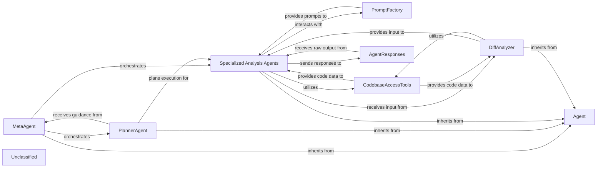
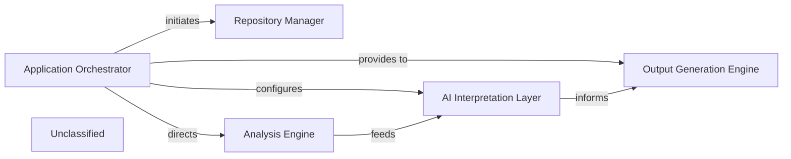
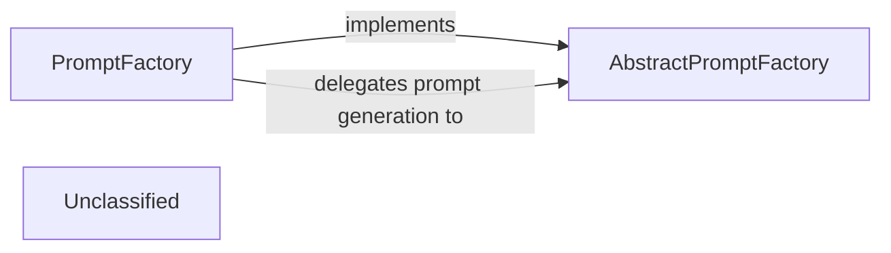
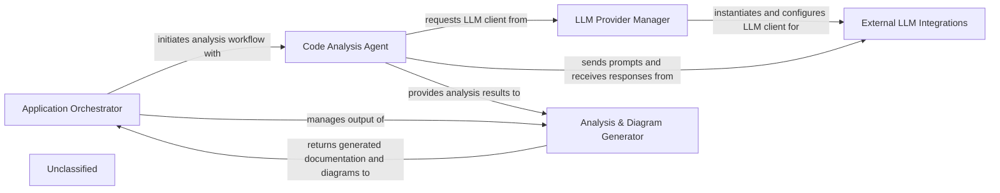
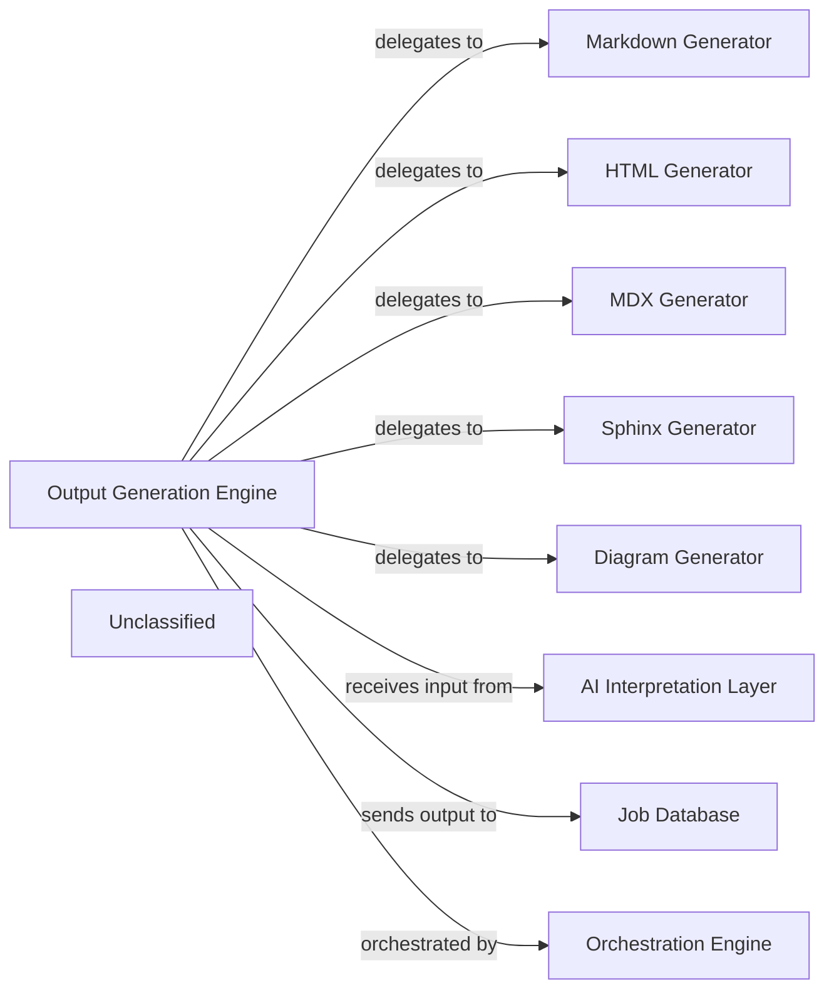
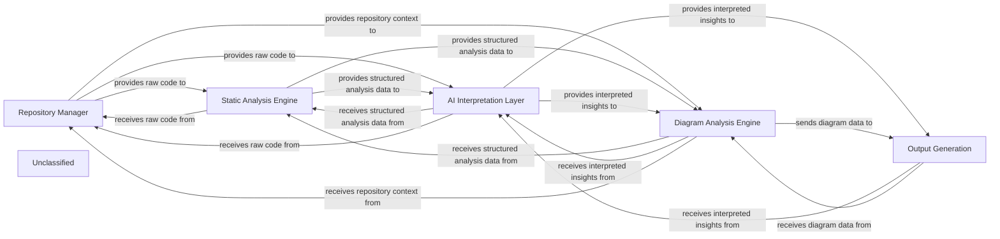
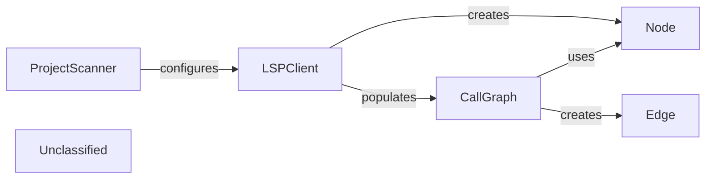

```mermaid
graph LR
    Application_Orchestrator["Application Orchestrator"]
    Repository_Manager["Repository Manager"]
    Static_Analysis_Engine["Static Analysis Engine"]
    LLM_Prompt_Factory["LLM Prompt Factory"]
    LLM_Provider_Gateway["LLM Provider Gateway"]
    AI_Interpretation_Layer["AI Interpretation Layer"]
    Output_Generation_Engine["Output Generation Engine"]
    Unclassified["Unclassified"]
    User_External_Systems -- "Initiates Request" --> Application_Orchestrator
    Application_Orchestrator -- "Manages Repository Access" --> Repository_Manager
    Application_Orchestrator -- "Triggers Analysis" --> AI_Interpretation_Layer
    Application_Orchestrator -- "Coordinates Documentation Generation" --> Output_Generation_Engine
    Repository_Manager -- "Provides Source Code" --> Static_Analysis_Engine
    Static_Analysis_Engine -- "Delivers Enhanced Analysis Data" --> AI_Interpretation_Layer
    AI_Interpretation_Layer -- "Requests Formatted Prompts" --> LLM_Prompt_Factory
    LLM_Prompt_Factory -- "Returns Formatted Prompts" --> AI_Interpretation_Layer
    AI_Interpretation_Layer -- "Sends LLM Queries" --> LLM_Provider_Gateway
    LLM_Provider_Gateway -- "Returns LLM Responses" --> AI_Interpretation_Layer
    AI_Interpretation_Layer -- "Provides Architectural Insights" --> Output_Generation_Engine
    Output_Generation_Engine -- "Delivers Documentation & Diagrams" --> User_External_Systems
    click Application_Orchestrator href "https://github.com/CodeBoarding/CodeBoarding/blob/main/.codeboarding/Application_Orchestrator.md" "Details"
    click Repository_Manager href "https://github.com/CodeBoarding/CodeBoarding/blob/main/.codeboarding/Repository_Manager.md" "Details"
    click Static_Analysis_Engine href "https://github.com/CodeBoarding/CodeBoarding/blob/main/.codeboarding/Static_Analysis_Engine.md" "Details"
    click LLM_Prompt_Factory href "https://github.com/CodeBoarding/CodeBoarding/blob/main/.codeboarding/LLM_Prompt_Factory.md" "Details"
    click LLM_Provider_Gateway href "https://github.com/CodeBoarding/CodeBoarding/blob/main/.codeboarding/LLM_Provider_Gateway.md" "Details"
    click AI_Interpretation_Layer href "https://github.com/CodeBoarding/CodeBoarding/blob/main/.codeboarding/AI_Interpretation_Layer.md" "Details"
    click Output_Generation_Engine href "https://github.com/CodeBoarding/CodeBoarding/blob/main/.codeboarding/Output_Generation_Engine.md" "Details"
```

## Details

The system's architecture is centered around a hierarchy of AI agents designed for comprehensive code analysis. The MetaAgent orchestrates the overall analysis workflow, delegating tasks to the PlannerAgent which strategizes the execution sequence. Specialized Analysis Agents (AbstractionAgent, DetailsAgent, ValidatorAgent) perform the core AI-driven analysis, leveraging the CodebaseAccessTools for programmatic access to codebase information, including source code and CFGs. This access is significantly powered by an enhanced Language Server Protocol (LSP) client, improving the precision and scope of code interpretation. The DiffAnalyzer provides targeted input by analyzing code changes, while the PromptFactory dynamically generates prompts for various LLMs. Finally, AgentResponses processes and transforms raw LLM outputs into actionable architectural insights. This structure ensures a modular, extensible, and intelligent approach to code understanding and architectural analysis.

### Agent
The foundational component, defining the base interface and common functionalities for all specialized agents, acting as the core orchestrator for individual AI-driven analysis tasks.

**Related Classes/Methods**:

- <a href="https://github.com/CodeBoarding/CodeBoarding/blob/main/.codeboardingagents/agent.py" target="_blank" rel="noopener noreferrer">`Agent`</a>

### MetaAgent
Responsible for higher-level orchestration and coordination of multiple specialized agents, guiding the overall analysis workflow. It acts as the primary entry point for initiating complex analysis tasks.

**Related Classes/Methods**:

- <a href="https://github.com/CodeBoarding/CodeBoarding/blob/main/.codeboardingagents/meta_agent.py" target="_blank" rel="noopener noreferrer">`MetaAgent`</a>

### PlannerAgent
Determines the strategic sequence of analysis steps and the specific agents to be invoked based on the analysis goals, effectively creating an execution plan.

**Related Classes/Methods**:

- <a href="https://github.com/CodeBoarding/CodeBoarding/blob/main/.codeboardingagents/planner_agent.py" target="_blank" rel="noopener noreferrer">`PlannerAgent`</a>

### Specialized Analysis Agents
A group of agents (AbstractionAgent, DetailsAgent, ValidatorAgent) that perform specific AI-driven analysis tasks: identifying high-level architectural concepts, delving into granular code details, and verifying insights against architectural principles.

**Related Classes/Methods**:

- <a href="https://github.com/CodeBoarding/CodeBoarding/blob/main/.codeboardingagents/abstraction_agent.py" target="_blank" rel="noopener noreferrer">`AbstractionAgent`</a>
- <a href="https://github.com/CodeBoarding/CodeBoarding/blob/main/.codeboardingagents/details_agent.py" target="_blank" rel="noopener noreferrer">`DetailsAgent`</a>
- <a href="https://github.com/CodeBoarding/CodeBoarding/blob/main/.codeboardingagents/validator_agent.py" target="_blank" rel="noopener noreferrer">`ValidatorAgent`</a>

### DiffAnalyzer
Analyzes code differences (e.g., from Git commits) to provide targeted input for agents, enabling incremental analysis and integration with CI/CD pipelines.

**Related Classes/Methods**:

- <a href="https://github.com/CodeBoarding/CodeBoarding/blob/main/.codeboardingagents/diff_analyzer.py" target="_blank" rel="noopener noreferrer">`DiffAnalyzer`</a>

### PromptFactory
Manages the dynamic generation and selection of appropriate prompts for interacting with various Large Language Models (LLMs), adapting to different LLM providers and analysis contexts.

**Related Classes/Methods**:

- <a href="https://github.com/CodeBoarding/CodeBoarding/blob/main/.codeboardingagents/prompts/prompt_factory.py" target="_blank" rel="noopener noreferrer">`PromptFactory`</a>

### CodebaseAccessTools
Provides agents with the capability to programmatically access and interpret different aspects of the codebase, including source code, Control Flow Graphs, and file structures. This component has been significantly enhanced with an updated Language Server Protocol (LSP) client (`static_analyzer/lsp_client/client.py`), which is crucial for its ability to programmatically access and interpret codebase information, leading to improved performance, accuracy, or expanded capabilities in code analysis.

**Related Classes/Methods**:

- <a href="https://github.com/CodeBoarding/CodeBoarding/blob/main/.codeboardingagents/tools/read_source.py" target="_blank" rel="noopener noreferrer">`read_source`</a>
- <a href="https://github.com/CodeBoarding/CodeBoarding/blob/main/.codeboardingagents/tools/read_cfg.py" target="_blank" rel="noopener noreferrer">`read_cfg`</a>
- <a href="https://github.com/CodeBoarding/CodeBoarding/blob/main/.codeboardingagents/tools/read_file_structure.py" target="_blank" rel="noopener noreferrer">`read_file_structure`</a>
- <a href="https://github.com/CodeBoarding/CodeBoarding/blob/main/.codeboardingstatic_analyzer/lsp_client/client.py" target="_blank" rel="noopener noreferrer">`static_analyzer/lsp_client/client.py`</a>

### AgentResponses
Handles the structured parsing, interpretation, and transformation of raw LLM outputs into actionable architectural insights or data structures.

**Related Classes/Methods**:

- <a href="https://github.com/CodeBoarding/CodeBoarding/blob/main/.codeboardingagents/agent_responses.py" target="_blank" rel="noopener noreferrer">`AgentResponses`</a>

### Unclassified
Component for all unclassified files and utility functions (Utility functions/External Libraries/Dependencies)

**Related Classes/Methods**: _None_

### [FAQ](https://github.com/CodeBoarding/GeneratedOnBoardings/tree/main?tab=readme-ov-file#faq)

## Details

The CodeBoarding system operates through a centralized Application Orchestrator that manages the entire documentation generation workflow. It begins by interacting with the Repository Manager to acquire the source code, either by cloning remote repositories or processing local ones. Once the code is available, the Orchestrator directs it to the Analysis Engine, which is responsible for parsing the code, generating an intermediate representation, and performing static analysis. The results from the Analysis Engine are then fed into the AI Interpretation Layer, where AI models process the IR for semantic understanding. Finally, the Output Generation Engine takes the interpreted insights and produces comprehensive documentation. The Application Orchestrator also configures the AI Interpretation Layer, ensuring proper integration with underlying LLM providers. This modular design ensures a clear separation of concerns and a streamlined process for generating code documentation.

### Application Orchestrator [[Expand]](./Application_Orchestrator.md)
Manages the overall execution pipeline and workflow. Handles initial repository input (local or remote). Orchestrates the sequence of analysis steps, including repository cloning, analysis generation, and documentation output. Serves as the main entry point for the CLI.

**Related Classes/Methods**:

- <a href="https://github.com/CodeBoarding/CodeBoarding/blob/main/.codeboardingmain.py#L340-L431" target="_blank" rel="noopener noreferrer">`main`:340-431</a>
- <a href="https://github.com/CodeBoarding/CodeBoarding/blob/main/.codeboardingmain.py#L162-L216" target="_blank" rel="noopener noreferrer">`process_remote_repository`:162-216</a>
- <a href="https://github.com/CodeBoarding/CodeBoarding/blob/main/.codeboardingmain.py#L219-L247" target="_blank" rel="noopener noreferrer">`process_local_repository`:219-247</a>

### Repository Manager [[Expand]](./Repository_Manager.md)
Handles fetching and managing code repositories, including cloning remote repositories and preparing local ones for analysis.

**Related Classes/Methods**:

- <a href="https://github.com/CodeBoarding/CodeBoarding/blob/main/.codeboardingrepo_utils/__init__.py#L94-L111" target="_blank" rel="noopener noreferrer">`clone_repository`:94-111</a>

### Analysis Engine [[Expand]](./Analysis_Engine.md)
This component encapsulates the functionality previously split into "Code Parser", "Intermediate Representation (IR) Generator", and "Static Analysis Engine". It is responsible for transforming raw code into structured representations, generating a unified intermediate representation, and performing detailed code analysis on it.

**Related Classes/Methods**:

- <a href="https://github.com/CodeBoarding/CodeBoarding/blob/main/.codeboardingmain.py#L53-L66" target="_blank" rel="noopener noreferrer">`generate_analysis`:53-66</a>

### AI Interpretation Layer [[Expand]](./AI_Interpretation_Layer.md)
Processes the intermediate representation for semantic understanding using AI/LLMs. It leverages the LLM Provider Gateway to interact with various language models.

**Related Classes/Methods**:

- <a href="https://github.com/CodeBoarding/CodeBoarding/blob/main/.codeboardingagents/prompts/prompt_factory.py#L117-L122" target="_blank" rel="noopener noreferrer">`initialize_global_factory`:117-122</a>

### Output Generation Engine [[Expand]](./Output_Generation_Engine.md)
Produces documentation and other outputs based on the analysis results.

**Related Classes/Methods**:

- <a href="https://github.com/CodeBoarding/CodeBoarding/blob/main/.codeboardingmain.py#L69-L96" target="_blank" rel="noopener noreferrer">`generate_markdown_docs`:69-96</a>

### Unclassified
Component for all unclassified files and utility functions (Utility functions/External Libraries/Dependencies)

**Related Classes/Methods**: _None_

### [FAQ](https://github.com/CodeBoarding/GeneratedOnBoardings/tree/main?tab=readme-ov-file#faq)

## Details

The `agents.prompts` subsystem provides a flexible and extensible mechanism for generating LLM-specific prompts. It is centered around the `AbstractPromptFactory`, which establishes a common interface for all prompt creation logic. The `PromptFactory` serves as the concrete implementation, dynamically selecting and instantiating specialized prompt factories based on the target LLM and desired prompt characteristics. This design pattern enables the system to seamlessly integrate with diverse LLM providers and prompt variations, ensuring consistent and adaptable prompt generation throughout the application. The `PromptFactory` delegates the actual retrieval of prompt messages to the chosen concrete `AbstractPromptFactory` implementation, effectively decoupling prompt content from the prompt selection mechanism.

### AbstractPromptFactory
Defines the standardized interface and contract for all prompt generation implementations. This component ensures consistency and allows for polymorphic prompt creation strategies, aligning with the modular design pattern of the project.

**Related Classes/Methods**:

- <a href="https://github.com/CodeBoarding/CodeBoarding/blob/main/.codeboardingagents/prompts/abstract_prompt_factory.py#L9-L94" target="_blank" rel="noopener noreferrer">`agents.prompts.abstract_prompt_factory.AbstractPromptFactory`:9-94</a>

### PromptFactory
The concrete implementation that dynamically selects, constructs, and formats prompts with contextual information for different LLM providers. It acts as the central orchestrator for prompt creation within the AI Interpretation Layer.

**Related Classes/Methods**:

- <a href="https://github.com/CodeBoarding/CodeBoarding/blob/main/.codeboardingagents/prompts/prompt_factory.py#L33-L109" target="_blank" rel="noopener noreferrer">`agents.prompts.prompt_factory.PromptFactory`:33-109</a>

### Unclassified
Component for all unclassified files and utility functions (Utility functions/External Libraries/Dependencies)

**Related Classes/Methods**: _None_

### [FAQ](https://github.com/CodeBoarding/GeneratedOnBoardings/tree/main?tab=readme-ov-file#faq)

## Details

The system's architecture is orchestrated by the Application Orchestrator, which manages the end-to-end workflow from processing local or remote repositories to generating final architectural documentation. Central to its operation is the Code Analysis Agent, an intelligent core that leverages an enhanced internal LSP Client for deep static analysis, extracting detailed code structure, call graphs, and class hierarchies. This rich code understanding, combined with insights from External LLM Integrations managed by the LLM Provider Manager, allows the agent to generate comprehensive architectural insights. These insights are then processed by the Analysis & Diagram Generator to produce structured documentation and visual diagrams, completing the analysis cycle under the guidance of the Application Orchestrator.

### Application Orchestrator [[Expand]](./Application_Orchestrator.md)
Manages the overall application lifecycle, handling user input, repository setup, and coordinating the analysis and documentation generation. It oversees the end-to-end workflow.

**Related Classes/Methods**:

- `ApplicationOrchestrator`

### Code Analysis Agent
Responsible for in-depth code understanding, performing detailed static analysis using its internal LSP Client, formulating prompts for external LLMs, and generating architectural insights.

**Related Classes/Methods**:

- `CodeAnalysisAgent`

### Analysis & Diagram Generator
Takes comprehensive analysis results from the Code Analysis Agent and transforms them into structured documentation and visual diagrams.

**Related Classes/Methods**:

- `AnalysisDiagramGenerator`

### LLM Provider Manager
Dynamically selects and configures the appropriate External LLM Integration based on the Code Analysis Agent's needs.

**Related Classes/Methods**:

- `LLMProviderManager`

### External LLM Integrations
Represents the various external Large Language Models (e.g., OpenAI, Anthropic, Google Gemini) that the Code Analysis Agent interacts with to send prompts and receive responses.

**Related Classes/Methods**:

- `ExternalLLMIntegration`

### Unclassified
Component for all unclassified files and utility functions (Utility functions/External Libraries/Dependencies)

**Related Classes/Methods**: _None_

### [FAQ](https://github.com/CodeBoarding/GeneratedOnBoardings/tree/main?tab=readme-ov-file#faq)

## Details

The Output Generation Subsystem is responsible for transforming raw architectural insights into various structured documentation and visual diagrams. At its core, the Output Generation Engine acts as an orchestrator, receiving architectural insights from an external AI Interpretation Layer. It then delegates the task of generating specific output formats to a suite of specialized generators, including the Markdown Generator, HTML Generator, MDX Generator, Sphinx Generator for diverse documentation needs, and the Diagram Generator for visual representations. Once generated, these outputs are delivered to an external Job Database for storage. The entire process within this subsystem is initiated and managed by an external Orchestration Engine, ensuring a streamlined workflow from insight to deliverable.

### Output Generation Engine [[Expand]](./Output_Generation_Engine.md)
The primary orchestrator, responsible for coordinating the generation of various documentation and diagram formats. It acts as the facade for the entire output generation process.

**Related Classes/Methods**:

- <a href="https://github.com/CodeBoarding/CodeBoarding/blob/main/.codeboardingoutput_generators/__init__.py" target="_blank" rel="noopener noreferrer">`output_generators`</a>
- <a href="https://github.com/CodeBoarding/CodeBoarding/blob/main/.codeboardingdiagram_analysis/__init__.py" target="_blank" rel="noopener noreferrer">`diagram_analysis`</a>

### Markdown Generator
Specializes in generating documentation in Markdown format.

**Related Classes/Methods**:

- <a href="https://github.com/CodeBoarding/CodeBoarding/blob/main/.codeboardingoutput_generators/markdown.py" target="_blank" rel="noopener noreferrer">`output_generators.markdown`</a>

### HTML Generator
Specializes in generating documentation in HTML format.

**Related Classes/Methods**:

- <a href="https://github.com/CodeBoarding/CodeBoarding/blob/main/.codeboardingoutput_generators/html.py" target="_blank" rel="noopener noreferrer">`output_generators.html`</a>

### MDX Generator
Specializes in generating documentation in MDX (Markdown with JSX) format.

**Related Classes/Methods**:

- <a href="https://github.com/CodeBoarding/CodeBoarding/blob/main/.codeboardingoutput_generators/mdx.py" target="_blank" rel="noopener noreferrer">`output_generators.mdx`</a>

### Sphinx Generator
Specializes in generating documentation compatible with Sphinx.

**Related Classes/Methods**:

- <a href="https://github.com/CodeBoarding/CodeBoarding/blob/main/.codeboardingoutput_generators/sphinx.py" target="_blank" rel="noopener noreferrer">`output_generators.sphinx`</a>

### Diagram Generator
Manages the creation of various visual diagrams from architectural insights.

**Related Classes/Methods**:

- <a href="https://github.com/CodeBoarding/CodeBoarding/blob/main/.codeboardingdiagram_analysis/diagram_generator.py" target="_blank" rel="noopener noreferrer">`diagram_analysis.diagram_generator`</a>

### AI Interpretation Layer [[Expand]](./AI_Interpretation_Layer.md)
An external component that provides architectural insights as input to the Output Generation Engine.

**Related Classes/Methods**:

- `AIInterpretationLayerInterface`:1-10

### Job Database
An external component that receives and stores the generated documentation and diagrams.

**Related Classes/Methods**:

- `JobDatabaseInterface`

### Orchestration Engine
An external component responsible for triggering and managing the Output Generation Engine.

**Related Classes/Methods**:

- `OrchestrationEngineInterface`

### Unclassified
Component for all unclassified files and utility functions (Utility functions/External Libraries/Dependencies)

**Related Classes/Methods**: _None_

### [FAQ](https://github.com/CodeBoarding/GeneratedOnBoardings/tree/main?tab=readme-ov-file#faq)

## Details

The system is structured around a core set of components designed for comprehensive code analysis, interpretation, and visualization. The Repository Manager serves as the foundational layer, providing access to the codebase. The Static Analysis Engine then processes this code to extract structural and relational information using an enhanced Language Server Protocol (LSP) client. This static analysis data is fed into the AI Interpretation Layer for deeper, AI-driven insights. A dedicated Diagram Analysis Engine leverages both static analysis and AI interpretations to generate visual representations of the codebase. Finally, the Output Generation component is responsible for formatting and presenting all analysis results, interpretations, and diagrams in various user-friendly formats. The overall application flow is orchestrated to ensure seamless data progression and transformation across these specialized components.

### Repository Manager [[Expand]](./Repository_Manager.md)
Manages local copies of code repositories, provides access to raw source code content, facilitates navigation within the repository's file system, and handles Git-specific operations, including diff generation. It acts as the primary interface for all repository-related data and operations, feeding raw code to subsequent analysis stages.

**Related Classes/Methods**:

- <a href="https://github.com/CodeBoarding/CodeBoarding/blob/main/.codeboardingrepo_utils/__init__.py" target="_blank" rel="noopener noreferrer">`repo_utils`</a>
- <a href="https://github.com/CodeBoarding/CodeBoarding/blob/main/.codeboardingrepo_utils/git_diff.py" target="_blank" rel="noopener noreferrer">`repo_utils.git_diff`</a>
- <a href="https://github.com/CodeBoarding/CodeBoarding/blob/main/.codeboardingrepo_utils/errors.py" target="_blank" rel="noopener noreferrer">`repo_utils.errors`</a>

### Static Analysis Engine [[Expand]](./Static_Analysis_Engine.md)
This component is responsible for performing various static code analyses on the source code provided by the Repository Manager. It utilizes an enhanced Language Server Protocol (LSP) client (static_analyzer/lsp_client/client.py) to extract symbols, generate call graphs, identify class hierarchies, and perform other structural analyses without executing the code.

**Related Classes/Methods**:

- <a href="https://github.com/CodeBoarding/CodeBoarding/blob/main/.codeboardingstatic_analyzer/lsp_client/client.py" target="_blank" rel="noopener noreferrer">`static_analyzer.lsp_client.client.LSPClient`</a>
- <a href="https://github.com/CodeBoarding/CodeBoarding/blob/main/.codeboardingstatic_analyzer/graph.py" target="_blank" rel="noopener noreferrer">`static_analyzer.graph.CallGraph`</a>

### AI Interpretation Layer [[Expand]](./AI_Interpretation_Layer.md)
This component consumes the output from the Static Analysis Engine and potentially raw code from the Repository Manager to apply AI/ML models for deeper understanding, code summarization, vulnerability prediction, and other intelligent insights. It has undergone significant refinement and feature development.

**Related Classes/Methods**:

- <a href="https://github.com/CodeBoarding/CodeBoarding/blob/main/.codeboardingagents/agent.py" target="_blank" rel="noopener noreferrer">`agents.agent`</a>
- <a href="https://github.com/CodeBoarding/CodeBoarding/blob/main/.codeboardingagents/details_agent.py" target="_blank" rel="noopener noreferrer">`agents.details_agent`</a>

### Diagram Analysis Engine
This newly identified component is responsible for generating or analyzing diagrams based on the structured analysis data from the Static Analysis Engine and the interpreted insights from the AI Interpretation Layer. It aims to provide visual representations that enhance the understanding of the codebase's architecture and relationships.

**Related Classes/Methods**:

- <a href="https://github.com/CodeBoarding/CodeBoarding/blob/main/.codeboardingdiagram_analysis/__init__.py" target="_blank" rel="noopener noreferrer">`diagram_analysis`</a>
- <a href="https://github.com/CodeBoarding/CodeBoarding/blob/main/.codeboardingtests/diagram_analysis/test_diagram_analysis.py" target="_blank" rel="noopener noreferrer">`tests.diagram_analysis.test_diagram_analysis`</a>

### Output Generation
This component is responsible for formatting and presenting the analysis results, AI-interpreted insights, and generated diagrams into various output formats, including HTML, MDX, and Sphinx documentation. It ensures that the system's findings are clearly and effectively communicated.

**Related Classes/Methods**:

- <a href="https://github.com/CodeBoarding/CodeBoarding/blob/main/.codeboardingoutput_generators/html.py" target="_blank" rel="noopener noreferrer">`output_generators.html`</a>
- <a href="https://github.com/CodeBoarding/CodeBoarding/blob/main/.codeboardingoutput_generators/mdx.py" target="_blank" rel="noopener noreferrer">`output_generators.mdx`</a>
- <a href="https://github.com/CodeBoarding/CodeBoarding/blob/main/.codeboardingoutput_generators/sphinx.py" target="_blank" rel="noopener noreferrer">`output_generators.sphinx`</a>

### Unclassified
Component for all unclassified files and utility functions (Utility functions/External Libraries/Dependencies)

**Related Classes/Methods**: _None_

### [FAQ](https://github.com/CodeBoarding/GeneratedOnBoardings/tree/main?tab=readme-ov-file#faq)

## Details

The Static Analysis Engine subsystem is responsible for performing in-depth static analysis of a codebase to extract structural and control flow information. It begins by scanning the project to identify programming languages and gather high-level metadata. Subsequently, it leverages Language Servers (LSPs) to obtain detailed code information, which is then used to construct and maintain a call graph representing the codebase's entities and their interdependencies. The primary purpose is to generate a comprehensive understanding of the code's structure and relationships, forming the basis for further analysis and documentation.

### ProjectScanner
Scans the project to identify programming languages, gather code statistics (lines of code, percentages), and extract file suffixes. It acts as the initial language detector and high-level metadata extractor.

**Related Classes/Methods**:

- <a href="https://github.com/CodeBoarding/CodeBoarding/blob/main/.codeboardingstatic_analyzer/scanner.py" target="_blank" rel="noopener noreferrer">`ProjectScanner`</a>

### LSPClient
Manages communication with Language Servers (LSPs) for various programming languages. It initiates LSP server processes, sends JSON-RPC requests for detailed code information (symbols, call hierarchy), and processes responses to extract data like symbols, call relationships, and class hierarchies.

**Related Classes/Methods**:

- <a href="https://github.com/CodeBoarding/CodeBoarding/blob/main/.codeboardingstatic_analyzer/lsp_client/client.py" target="_blank" rel="noopener noreferrer">`LSPClient`</a>

### CallGraph
Constructs and maintains the control flow graph (CFG) of the codebase. It stores code elements as `Node` objects and their interdependencies as `Edge` objects. It also provides functionalities to analyze and summarize these relationships, including generating clustered representations.

**Related Classes/Methods**:

- <a href="https://github.com/CodeBoarding/CodeBoarding/blob/main/.codeboardingstatic_analyzer/graph.py" target="_blank" rel="noopener noreferrer">`CallGraph`</a>

### Node
Represents a distinct code entity within the `CallGraph`, such as a class, function, or method. It encapsulates metadata like the fully qualified name, file path, and line number range.

**Related Classes/Methods**:

- <a href="https://github.com/CodeBoarding/CodeBoarding/blob/main/.codeboardingstatic_analyzer/graph.py" target="_blank" rel="noopener noreferrer">`Node`</a>

### Edge
Represents a directed relationship or dependency between two `Node` objects in the `CallGraph`, typically indicating a method call or other structural connection.

**Related Classes/Methods**:

- <a href="https://github.com/CodeBoarding/CodeBoarding/blob/main/.codeboardingstatic_analyzer/graph.py" target="_blank" rel="noopener noreferrer">`Edge`</a>

### Unclassified
Component for all unclassified files and utility functions (Utility functions/External Libraries/Dependencies)

**Related Classes/Methods**: _None_

### [FAQ](https://github.com/CodeBoarding/GeneratedOnBoardings/tree/main?tab=readme-ov-file#faq)

## Details

The system operates through a well-defined architectural flow, starting with the Application Orchestrator which serves as the central control unit, managing the overall execution, handling user requests, and coordinating the analysis and documentation generation processes. It now incorporates enhanced local execution and initialization capabilities. The Repository Manager provides the foundational raw source code by managing repository interactions. This code is then fed to the Static Analysis Engine, which performs in-depth static analysis, extracting crucial structural information, control flow graphs, and dependencies. A significant update to its LSP client now enables the delivery of richer, more detailed analysis data.

The core intelligence resides in the AI Interpretation Layer, which orchestrates AI-driven analysis, interprets responses from Large Language Models (LLMs), and derives architectural insights. This layer has been refactored for a more streamlined interaction with its internal tools. It dynamically interacts with the LLM Prompt Factory to generate tailored prompts and communicates with external LLMs via the LLM Provider Gateway to send queries and receive responses. Finally, the Output Generation Engine transforms these architectural insights into various consumable formats, including human-readable documentation and visual diagrams, with enhanced capabilities for MDX and Sphinx outputs. This comprehensive flow ensures a robust and adaptable system for architectural analysis and documentation.

### Application Orchestrator [[Expand]](./Application_Orchestrator.md)
The central control unit that manages the overall execution flow, handling repository input, orchestrating analysis, and coordinating documentation generation. It serves as the main entry point for the application, including enhanced local execution and initialization.

**Related Classes/Methods**:

- <a href="https://github.com/CodeBoarding/CodeBoarding/blob/main/.codeboardingmain.py" target="_blank" rel="noopener noreferrer">`main.py`</a>
- <a href="https://github.com/CodeBoarding/CodeBoarding/blob/main/.codeboardinglocal_app.py" target="_blank" rel="noopener noreferrer">`local_app.py`</a>

### Repository Manager [[Expand]](./Repository_Manager.md)
Manages all interactions with code repositories, including cloning, reading files, and navigating the project structure. It provides the raw source code for analysis.

**Related Classes/Methods**:

- <a href="https://github.com/CodeBoarding/CodeBoarding/blob/main/.codeboardingrepo_utils/__init__.py" target="_blank" rel="noopener noreferrer">`repo_utils/__init__.py`</a>
- <a href="https://github.com/CodeBoarding/CodeBoarding/blob/main/.codeboardingrepo_utils/git_diff.py" target="_blank" rel="noopener noreferrer">`repo_utils/git_diff.py`</a>

### Static Analysis Engine [[Expand]](./Static_Analysis_Engine.md)
Performs in-depth static analysis on the codebase to extract structural information, control flow graphs (CFG), abstract syntax trees (AST), and dependencies. It leverages an enhanced Language Server Protocol (LSP) client for gathering detailed code information, improving the quality and type of data provided for analysis.

**Related Classes/Methods**:

- <a href="https://github.com/CodeBoarding/CodeBoarding/blob/main/.codeboardingstatic_analyzer/__init__.py" target="_blank" rel="noopener noreferrer">`static_analyzer/__init__.py`</a>
- <a href="https://github.com/CodeBoarding/CodeBoarding/blob/main/.codeboardingstatic_analyzer/scanner.py" target="_blank" rel="noopener noreferrer">`static_analyzer/scanner.py`</a>
- <a href="https://github.com/CodeBoarding/CodeBoarding/blob/main/.codeboardingstatic_analyzer/graph.py" target="_blank" rel="noopener noreferrer">`static_analyzer/graph.py`</a>
- <a href="https://github.com/CodeBoarding/CodeBoarding/blob/main/.codeboardingstatic_analyzer/lsp_client/client.py" target="_blank" rel="noopener noreferrer">`static_analyzer/lsp_client/client.py`</a>

### LLM Prompt Factory [[Expand]](./LLM_Prompt_Factory.md)
Dynamically generates and formats prompts tailored for various Large Language Models (LLMs) and specific analysis tasks.

**Related Classes/Methods**:

- <a href="https://github.com/CodeBoarding/CodeBoarding/blob/main/.codeboardingagents/prompts/__init__.py" target="_blank" rel="noopener noreferrer">`agents/prompts/__init__.py`</a>
- <a href="https://github.com/CodeBoarding/CodeBoarding/blob/main/.codeboardingagents/prompts/prompt_factory.py" target="_blank" rel="noopener noreferrer">`agents/prompts/prompt_factory.py`</a>
- <a href="https://github.com/CodeBoarding/CodeBoarding/blob/main/.codeboardingagents/prompts/abstract_prompt_factory.py" target="_blank" rel="noopener noreferrer">`agents/prompts/abstract_prompt_factory.py`</a>

### LLM Provider Gateway [[Expand]](./LLM_Provider_Gateway.md)
Manages communication and interaction with external Large Language Model (LLM) providers, handling API calls and model selection.

**Related Classes/Methods**:

- <a href="https://github.com/CodeBoarding/CodeBoarding/blob/main/.codeboardingagents/prompts/claude_prompts_bidirectional.py" target="_blank" rel="noopener noreferrer">`agents/prompts/claude_prompts_bidirectional.py`</a>
- <a href="https://github.com/CodeBoarding/CodeBoarding/blob/main/.codeboardingagents/prompts/gpt_prompts_unidirectional.py" target="_blank" rel="noopener noreferrer">`agents/prompts/gpt_prompts_unidirectional.py`</a>
- <a href="https://github.com/CodeBoarding/CodeBoarding/blob/main/.codeboardingagents/prompts/gemini_flash_prompts_bidirectional.py" target="_blank" rel="noopener noreferrer">`agents/prompts/gemini_flash_prompts_bidirectional.py`</a>

### AI Interpretation Layer [[Expand]](./AI_Interpretation_Layer.md)
The core intelligence component that orchestrates AI-driven analysis, interprets LLM responses, and derives architectural insights. This layer utilizes various agents to perform its tasks, with agents/agent.py being central to its logic, and now features a streamlined or reorganized mechanism for agent tool interaction.

**Related Classes/Methods**:

- <a href="https://github.com/CodeBoarding/CodeBoarding/blob/main/.codeboardingagents/__init__.py" target="_blank" rel="noopener noreferrer">`agents/__init__.py`</a>
- <a href="https://github.com/CodeBoarding/CodeBoarding/blob/main/.codeboardingagents/agent.py" target="_blank" rel="noopener noreferrer">`agents/agent.py`</a>
- <a href="https://github.com/CodeBoarding/CodeBoarding/blob/main/.codeboardingagents/meta_agent.py" target="_blank" rel="noopener noreferrer">`agents/meta_agent.py`</a>
- <a href="https://github.com/CodeBoarding/CodeBoarding/blob/main/.codeboardingagents/abstraction_agent.py" target="_blank" rel="noopener noreferrer">`agents/abstraction_agent.py`</a>
- <a href="https://github.com/CodeBoarding/CodeBoarding/blob/main/.codeboardingagents/details_agent.py" target="_blank" rel="noopener noreferrer">`agents/details_agent.py`</a>
- <a href="https://github.com/CodeBoarding/CodeBoarding/blob/main/.codeboardingagents/planner_agent.py" target="_blank" rel="noopener noreferrer">`agents/planner_agent.py`</a>
- <a href="https://github.com/CodeBoarding/CodeBoarding/blob/main/.codeboardingagents/validator_agent.py" target="_blank" rel="noopener noreferrer">`agents/validator_agent.py`</a>

### Output Generation Engine [[Expand]](./Output_Generation_Engine.md)
Transforms architectural insights into various consumable formats, including human-readable documentation and visual diagrams. It has enhanced capabilities for generating MDX and Sphinx outputs, improving flexibility and quality.

**Related Classes/Methods**:

- <a href="https://github.com/CodeBoarding/CodeBoarding/blob/main/.codeboardingoutput_generators/__init__.py" target="_blank" rel="noopener noreferrer">`output_generators/__init__.py`</a>
- <a href="https://github.com/CodeBoarding/CodeBoarding/blob/main/.codeboardingoutput_generators/markdown.py" target="_blank" rel="noopener noreferrer">`output_generators/markdown.py`</a>
- <a href="https://github.com/CodeBoarding/CodeBoarding/blob/main/.codeboardingoutput_generators/html.py" target="_blank" rel="noopener noreferrer">`output_generators/html.py`</a>
- <a href="https://github.com/CodeBoarding/CodeBoarding/blob/main/.codeboardingoutput_generators/mdx.py" target="_blank" rel="noopener noreferrer">`output_generators/mdx.py`</a>
- <a href="https://github.com/CodeBoarding/CodeBoarding/blob/main/.codeboardingoutput_generators/sphinx.py" target="_blank" rel="noopener noreferrer">`output_generators/sphinx.py`</a>
- <a href="https://github.com/CodeBoarding/CodeBoarding/blob/main/.codeboardingdiagram_analysis/__init__.py" target="_blank" rel="noopener noreferrer">`diagram_analysis/__init__.py`</a>
- <a href="https://github.com/CodeBoarding/CodeBoarding/blob/main/.codeboardingdiagram_analysis/diagram_generator.py" target="_blank" rel="noopener noreferrer">`diagram_analysis/diagram_generator.py`</a>

### Unclassified
Component for all unclassified files and utility functions (Utility functions/External Libraries/Dependencies)

**Related Classes/Methods**: _None_

### [FAQ](https://github.com/CodeBoarding/GeneratedOnBoardings/tree/main?tab=readme-ov-file#faq)

