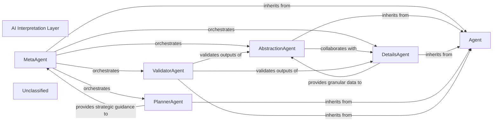
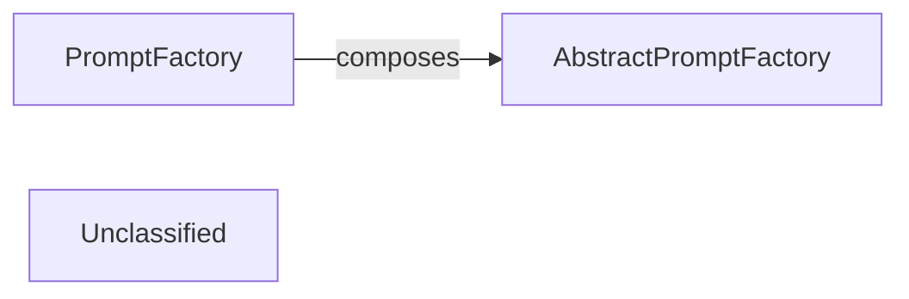
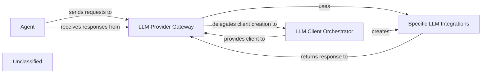
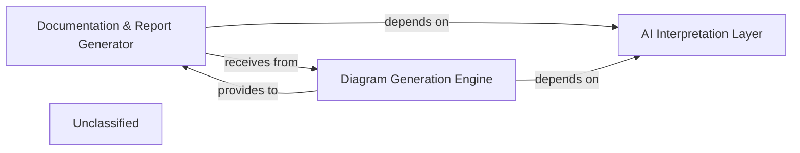
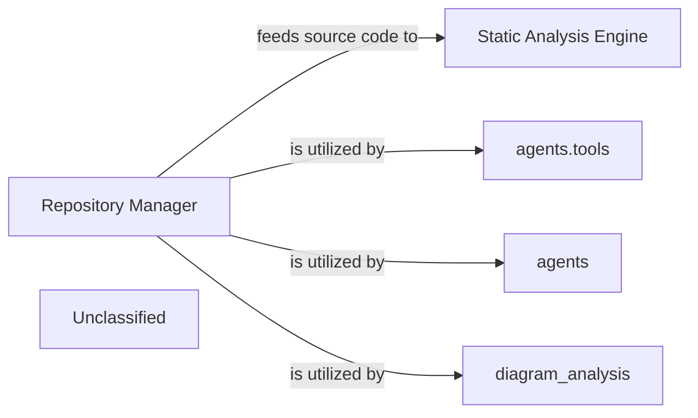
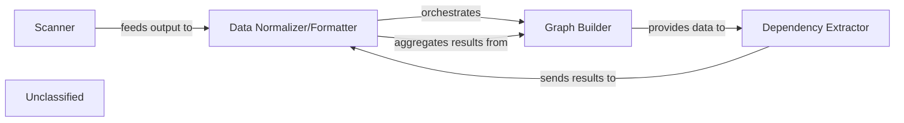

```mermaid
graph LR
    Repository_Manager["Repository Manager"]
    Static_Analysis_Engine["Static Analysis Engine"]
    LLM_Prompt_Factory["LLM Prompt Factory"]
    LLM_Provider_Gateway["LLM Provider Gateway"]
    AI_Interpretation_Layer["AI Interpretation Layer"]
    Output_Generation_Engine["Output Generation Engine"]
    User_External_Systems["User/External Systems"]
    Unclassified["Unclassified"]
    Repository_Manager -- "Provides Source Code" --> Static_Analysis_Engine
    Static_Analysis_Engine -- "Delivers Analysis Data: CFG, AST, Dependencies" --> AI_Interpretation_Layer
    AI_Interpretation_Layer -- "Requests Prompts with Analysis Data" --> LLM_Prompt_Factory
    LLM_Prompt_Factory -- "Returns Formatted LLM Prompts" --> AI_Interpretation_Layer
    AI_Interpretation_Layer -- "Sends LLM Queries" --> LLM_Provider_Gateway
    LLM_Provider_Gateway -- "Returns Raw LLM Responses" --> AI_Interpretation_Layer
    AI_Interpretation_Layer -- "Provides Architectural Insights: Components, Relationships" --> Output_Generation_Engine
    Output_Generation_Engine -- "Delivers Documentation & Diagrams" --> User_External_Systems
    click Repository_Manager href "https://github.com/CodeBoarding/CodeBoarding/blob/main/.codeboarding/Repository_Manager.md" "Details"
    click Static_Analysis_Engine href "https://github.com/CodeBoarding/CodeBoarding/blob/main/.codeboarding/Static_Analysis_Engine.md" "Details"
    click LLM_Prompt_Factory href "https://github.com/CodeBoarding/CodeBoarding/blob/main/.codeboarding/LLM_Prompt_Factory.md" "Details"
    click LLM_Provider_Gateway href "https://github.com/CodeBoarding/CodeBoarding/blob/main/.codeboarding/LLM_Provider_Gateway.md" "Details"
    click AI_Interpretation_Layer href "https://github.com/CodeBoarding/CodeBoarding/blob/main/.codeboarding/AI_Interpretation_Layer.md" "Details"
    click Output_Generation_Engine href "https://github.com/CodeBoarding/CodeBoarding/blob/main/.codeboarding/Output_Generation_Engine.md" "Details"
```

## Details

The AI Interpretation Layer subsystem is primarily defined by the `agents` package. It is the overarching core intelligence component that orchestrates AI-driven analysis, interprets LLM responses, and derives architectural insights. It acts as a multi-agent system, transforming raw LLM outputs and static analysis data into structured architectural knowledge, aligning with the project's AI-centric and pipeline-driven architectural bias.

### AI Interpretation Layer [[Expand]](./AI_Interpretation_Layer.md)
The overarching core intelligence component that orchestrates AI-driven analysis, interprets LLM responses, and derives architectural insights. It acts as a multi-agent system, transforming raw LLM outputs and static analysis data into structured architectural knowledge.

**Related Classes/Methods**:

- <a href="https://github.com/CodeBoarding/CodeBoarding/blob/main/.codeboardingagents/__init__.py" target="_blank" rel="noopener noreferrer">`agents`</a>

### Agent
Serves as the foundational base class or interface for all specialized agents within this layer, defining common methods and properties for agent behavior.

**Related Classes/Methods**:

- <a href="https://github.com/CodeBoarding/CodeBoarding/blob/main/.codeboardingagents/agent.py" target="_blank" rel="noopener noreferrer">`Agent`</a>

### MetaAgent
The primary orchestrator of the AI Interpretation Layer. It receives LLM responses and static analysis data, then delegates tasks to other agents to achieve comprehensive architectural insights, managing the overall workflow and interpretation strategy.

**Related Classes/Methods**:

- <a href="https://github.com/CodeBoarding/CodeBoarding/blob/main/.codeboardingagents/meta_agent.py" target="_blank" rel="noopener noreferrer">`MetaAgent`</a>

### AbstractionAgent
Responsible for synthesizing high-level architectural patterns, components, and relationships from raw LLM interpretations and static analysis data, focusing on deriving abstract insights.

**Related Classes/Methods**:

- <a href="https://github.com/CodeBoarding/CodeBoarding/blob/main/.codeboardingagents/abstraction_agent.py" target="_blank" rel="noopener noreferrer">`AbstractionAgent`</a>

### DetailsAgent
Extracts granular, specific details from LLM responses and code, complementing the AbstractionAgent by providing supporting evidence or finer-grained information.

**Related Classes/Methods**:

- <a href="https://github.com/CodeBoarding/CodeBoarding/blob/main/.codeboardingagents/details_agent.py" target="_blank" rel="noopener noreferrer">`DetailsAgent`</a>

### PlannerAgent
Determines the optimal sequence of analysis steps and the overall strategy for interpreting LLM responses, guiding the MetaAgent's orchestration.

**Related Classes/Methods**:

- <a href="https://github.com/CodeBoarding/CodeBoarding/blob/main/.codeboardingagents/planner_agent.py" target="_blank" rel="noopener noreferrer">`PlannerAgent`</a>

### ValidatorAgent
Responsible for reviewing and validating the architectural insights generated by other agents, ensuring accuracy, consistency, and completeness against static analysis data and predefined rules.

**Related Classes/Methods**:

- <a href="https://github.com/CodeBoarding/CodeBoarding/blob/main/.codeboardingagents/validator_agent.py" target="_blank" rel="noopener noreferrer">`ValidatorAgent`</a>

### Unclassified
Component for all unclassified files and utility functions (Utility functions/External Libraries/Dependencies)

**Related Classes/Methods**: _None_

### [FAQ](https://github.com/CodeBoarding/GeneratedOnBoardings/tree/main?tab=readme-ov-file#faq)

## Details

The prompt generation subsystem is centered around the `PromptFactory`, which serves as the primary interface for constructing LLM-optimized prompts. Instead of directly implementing prompt generation logic, `PromptFactory` leverages a composition pattern, utilizing an instance of `AbstractPromptFactory`. This `AbstractPromptFactory` defines the common interface for prompt creation, allowing various concrete prompt factories (e.g., for different LLMs like Gemini Flash or Claude) to provide specific implementations. This architectural choice ensures modularity, extensibility, and a consistent approach to prompt generation across diverse analysis tasks within the project's AI Interpretation Layer.

### AbstractPromptFactory
This component establishes the contract and defines the interface for prompt generation. It ensures a consistent and standardized approach to creating prompts, regardless of the specific LLM or analysis task. Concrete prompt factories (e.g., `GeminiFlashBidirectionalPromptFactory`, `ClaudeBidirectionalPromptFactory`) implement this interface to provide specific prompt generation logic. This aligns with the project's emphasis on modularity and extensibility.

**Related Classes/Methods**:

- <a href="https://github.com/CodeBoarding/CodeBoarding/blob/main/.codeboardingagents/prompts/abstract_prompt_factory.py" target="_blank" rel="noopener noreferrer">`AbstractPromptFactory`</a>

### PromptFactory
This component acts as the primary orchestrator for dynamically generating and formatting prompts. It interprets static analysis results, applies task-specific parameters, and constructs LLM-optimized prompts by *composing* and *delegating* the actual prompt generation to an instance of `AbstractPromptFactory`. This design allows `PromptFactory` to remain decoupled from the specifics of prompt generation, promoting flexibility and extensibility. As the central executor of prompt generation, it is crucial to the "AI Interpretation Layer" and the "pipeline-driven, AI-centric approach" of the project.

**Related Classes/Methods**:

- <a href="https://github.com/CodeBoarding/CodeBoarding/blob/main/.codeboardingagents/prompts/prompt_factory.py" target="_blank" rel="noopener noreferrer">`PromptFactory`</a>

### Unclassified
Component for all unclassified files and utility functions (Utility functions/External Libraries/Dependencies)

**Related Classes/Methods**: _None_

### [FAQ](https://github.com/CodeBoarding/GeneratedOnBoardings/tree/main?tab=readme-ov-file#faq)

## Details

The `agents` subsystem is centered around the `CodeBoardingAgent`, which acts as the primary `Agent` and also embodies the `LLM Provider Gateway` and `LLM Client Orchestrator` functionalities. The `CodeBoardingAgent` directly manages the selection and initialization of various `Specific LLM Integrations` (e.g., `ChatOpenAI`, `ChatAnthropic`) based on available API keys. This design allows the agent to dynamically adapt to different LLM providers without external factory components. The `Agent` sends requests to the `LLM Provider Gateway` (which is part of itself) and receives responses, abstracting the underlying LLM communication details. The `LLM Client Orchestrator` within the `CodeBoardingAgent` is responsible for instantiating the correct `Specific LLM Integrations`, which then handle the actual communication with external LLM services.

### LLM Provider Gateway [[Expand]](./LLM_Provider_Gateway.md)
This is the overarching conceptual component that acts as a facade for all LLM interactions. It manages the lifecycle of LLM requests, from receiving a request to delegating to the appropriate client and handling initial response processing. It embodies the "Modular Architecture" by providing a consistent interface regardless of the underlying LLM provider.

**Related Classes/Methods**:

- <a href="https://github.com/CodeBoarding/CodeBoarding/blob/main/.codeboardingagents/agent.py#L90-L157" target="_blank" rel="noopener noreferrer">`agents.agent.CodeBoardingAgent._initialize_llm`:90-157</a>

### LLM Client Orchestrator
This component, embodied by the `CodeBoardingAgent`, is responsible for dynamically selecting and initializing specific LLM client implementations (e.g., `ChatOpenAI`, `ChatGoogleGenerativeAI`). It directly manages the configuration and instantiation of various LLM providers based on available API keys, promoting a flexible "Plugin/Extension Architecture" within the agent itself.

**Related Classes/Methods**:

- <a href="https://github.com/CodeBoarding/CodeBoarding/blob/main/.codeboardingagents/agent.py#L90-L157" target="_blank" rel="noopener noreferrer">`agents.agent.CodeBoardingAgent._initialize_llm`:90-157</a>

### Specific LLM Integrations
These are the concrete implementations of various LLM clients (e.g., `ChatOpenAI`, `ChatAnthropic`, `ChatGoogleGenerativeAI`, `ChatBedrockConverse`, `ChatCerebras`, `ChatOllama`) directly used by the `LLM Client Orchestrator`. Each integration handles the unique API calls, authentication, and data formatting for a particular external LLM provider, enforcing "Separation of Concerns" by isolating provider-specific logic.

**Related Classes/Methods**:

- `langchain_openai.ChatOpenAI`:1-10
- `langchain_google_genai.ChatGoogleGenerativeAI`
- `langchain_aws.ChatBedrockConverse`
- `langchain_cerebras.ChatCerebras`:10-25
- `langchain_ollama.ChatOllama`:1-10

### Agent
The primary orchestrator within the `agents` package that initiates requests for LLM interactions. It acts as the consumer of the `LLM Provider Gateway`, abstracting the details of LLM communication from its core reasoning logic. This component is part of the broader "AI Interpretation Layer" and drives the "Data Flow" through the LLM integration.

**Related Classes/Methods**:

- <a href="https://github.com/CodeBoarding/CodeBoarding/blob/main/.codeboardingagents/agent.py#L44-L247" target="_blank" rel="noopener noreferrer">`agents.agent.CodeBoardingAgent`:44-247</a>

### Unclassified
Component for all unclassified files and utility functions (Utility functions/External Libraries/Dependencies)

**Related Classes/Methods**: _None_

### [FAQ](https://github.com/CodeBoarding/GeneratedOnBoardings/tree/main?tab=readme-ov-file#faq)

## Details

The system is structured around three core components: the AI Interpretation Layer, the Diagram Generation Engine, and the Documentation & Report Generator. The AI Interpretation Layer serves as the foundational analysis component, extracting structured architectural insights from the codebase. These insights are then consumed by both the Diagram Generation Engine to visualize the architecture and the Documentation & Report Generator to produce comprehensive human-readable documentation. The Diagram Generation Engine further provides its generated diagrams to the Documentation & Report Generator for inclusion in final reports, ensuring a cohesive and visually rich output.

### AI Interpretation Layer [[Expand]](./AI_Interpretation_Layer.md)
This component is responsible for analyzing the codebase to extract and generate structured architectural insights. It acts as the primary source of high-level architectural understanding, which is then consumed by other components for documentation and diagram generation. This component aligns with the "Codebase Analysis Tool" pattern.

**Related Classes/Methods**:

- <a href="https://github.com/CodeBoarding/CodeBoarding/blob/main/.codeboardingagents/__init__.py" target="_blank" rel="noopener noreferrer">`agents`</a>

### Documentation & Report Generator
This component is responsible for transforming architectural insights, potentially enriched by AI interpretation, into various human-readable documentation formats such as Markdown, HTML, MDX, and Sphinx. It also integrates visual diagrams provided by the Diagram Generation Engine into comprehensive reports. This component aligns with the "Documentation Generator" project type pattern.

**Related Classes/Methods**:

- <a href="https://github.com/CodeBoarding/CodeBoarding/blob/main/.codeboardingoutput_generators/markdown.py" target="_blank" rel="noopener noreferrer">`output_generators.markdown`</a>
- <a href="https://github.com/CodeBoarding/CodeBoarding/blob/main/.codeboardingoutput_generators/html.py" target="_blank" rel="noopener noreferrer">`output_generators.html`</a>
- <a href="https://github.com/CodeBoarding/CodeBoarding/blob/main/.codeboardingoutput_generators/mdx.py" target="_blank" rel="noopener noreferrer">`output_generators.mdx`</a>
- <a href="https://github.com/CodeBoarding/CodeBoarding/blob/main/.codeboardingoutput_generators/sphinx.py" target="_blank" rel="noopener noreferrer">`output_generators.sphinx`</a>

### Diagram Generation Engine
This component is dedicated to creating visual representations (diagrams) of the codebase architecture from structured architectural insights. It likely utilizes external tools or libraries, such as Mermaid.js, for rendering these diagrams. This component aligns with the "Codebase Analysis Tool" pattern due to its role in visualizing code structure.

**Related Classes/Methods**:

- <a href="https://github.com/CodeBoarding/CodeBoarding/blob/main/.codeboardingdiagram_analysis/diagram_generator.py" target="_blank" rel="noopener noreferrer">`diagram_analysis.diagram_generator`</a>

### Unclassified
Component for all unclassified files and utility functions (Utility functions/External Libraries/Dependencies)

**Related Classes/Methods**: _None_

### [FAQ](https://github.com/CodeBoarding/GeneratedOnBoardings/tree/main?tab=readme-ov-file#faq)

## Details

The core of this subsystem is the `Repository Manager`, which serves as the central gateway for all interactions with code repositories. It provides essential functionalities such as cloning, updating, and reading repository contents, making raw source code and metadata accessible. This information is then consumed by the `Static Analysis Engine` for in-depth code examination. Intelligent `agents` and their specialized `agents.tools` rely on the `Repository Manager` to access and manipulate codebase information, facilitating their operational tasks. Furthermore, the `diagram_analysis` component leverages the `Repository Manager` to retrieve necessary data for generating and analyzing architectural diagrams. This design establishes a clear, centralized mechanism for managing and distributing repository data across various analytical and operational components.

### Repository Manager [[Expand]](./Repository_Manager.md)
This component is responsible for all interactions with code repositories. It handles fundamental operations such as cloning repositories, updating their state, reading specific files, and navigating the project's directory structure. It serves as the primary source for raw source code and repository-specific metadata (e.g., Git diffs), making this information available for subsequent analysis stages. Its role is crucial for ingesting the initial data into the codebase analysis pipeline.

**Related Classes/Methods**:

- <a href="https://github.com/CodeBoarding/CodeBoarding/blob/main/.codeboardingrepo_utils/__init__.py" target="_blank" rel="noopener noreferrer">`/home/ubuntu/CodeBoarding/repo/CodeBoarding/repo_utils/__init__.py`</a>
- <a href="https://github.com/CodeBoarding/CodeBoarding/blob/main/.codeboardingrepo_utils/git_diff.py" target="_blank" rel="noopener noreferrer">`/home/ubuntu/CodeBoarding/repo/CodeBoarding/repo_utils/git_diff.py`</a>

### Static Analysis Engine [[Expand]](./Static_Analysis_Engine.md)
This component is responsible for performing various static analyses on the source code provided by the `Repository Manager`. It processes the code to identify patterns, potential issues, or extract structural information without executing it.

**Related Classes/Methods**:

- `Static Analysis Engine`

### agents.tools
This component represents a collection of specialized tools used by intelligent agents. These tools interact with the `Repository Manager` to access and manipulate repository data, enabling agents to perform tasks requiring code or repository information.

**Related Classes/Methods**:

- <a href="https://github.com/CodeBoarding/CodeBoarding/blob/main/.codeboardingagents/tools" target="_blank" rel="noopener noreferrer">`agents.tools`</a>

### agents
This component encompasses the intelligent agents within the system. These agents utilize the `Repository Manager` (potentially through `agents.tools`) to interact with the codebase, retrieve information, and execute operations based on their objectives.

**Related Classes/Methods**:

- <a href="https://github.com/CodeBoarding/CodeBoarding/blob/main/.codeboardingagents/__init__.py" target="_blank" rel="noopener noreferrer">`agents`</a>

### diagram_analysis
This component is responsible for analyzing and potentially generating diagrams based on the project's codebase. It utilizes the `Repository Manager` to access file structures and source code necessary for diagrammatic representation and analysis.

**Related Classes/Methods**:

- <a href="https://github.com/CodeBoarding/CodeBoarding/blob/main/.codeboardingdiagram_analysis" target="_blank" rel="noopener noreferrer">`diagram_analysis`</a>

### Unclassified
Component for all unclassified files and utility functions (Utility functions/External Libraries/Dependencies)

**Related Classes/Methods**: _None_

### [FAQ](https://github.com/CodeBoarding/GeneratedOnBoardings/tree/main?tab=readme-ov-file#faq)

## Details

The static analysis subsystem is designed to process a codebase, extract structural and relational information, and present it in a standardized format. The ProjectScanner initiates the process by identifying programming languages and basic code statistics. This information is then used to set up language-specific analysis clients. The core of the analysis involves building call graphs and extracting dependencies, primarily handled by the CallGraph component. Finally, the StaticAnalyzer orchestrates these steps, aggregates the results, and normalizes them into a structured StaticAnalysisResults object, making the data ready for consumption by other systems, such as an LLM Prompt Factory.

### Scanner
This component is responsible for the initial ingestion and high-level analysis of the codebase. It utilizes external tools (like Tokei) to identify programming languages present in the repository, along with their code statistics and file suffixes. This provides a foundational understanding of the project's technological landscape.

**Related Classes/Methods**:

- <a href="https://github.com/CodeBoarding/CodeBoarding/blob/main/.codeboardingstatic_analyzer/scanner.py" target="_blank" rel="noopener noreferrer">`static_analyzer/scanner.py:ProjectScanner.scan`</a>

### Graph Builder
This component constructs various graph representations of the codebase, primarily focusing on call graphs. It defines the structure for nodes and edges within these graphs and provides mechanisms to build and manipulate them, often leveraging graph libraries for complex analysis.

**Related Classes/Methods**:

- <a href="https://github.com/CodeBoarding/CodeBoarding/blob/main/.codeboardingstatic_analyzer/graph.py" target="_blank" rel="noopener noreferrer">`static_analyzer/graph.py:CallGraph`</a>
- <a href="https://github.com/CodeBoarding/CodeBoarding/blob/main/.codeboardingstatic_analyzer/graph.py" target="_blank" rel="noopener noreferrer">`static_analyzer/graph.py:Node`</a>
- <a href="https://github.com/CodeBoarding/CodeBoarding/blob/main/.codeboardingstatic_analyzer/graph.py" target="_blank" rel="noopener noreferrer">`static_analyzer/graph.py:Edge`</a>

### Dependency Extractor
Working in conjunction with the Graph Builder, this component identifies and maps explicit and implicit dependencies between different code entities. It leverages the constructed call graphs to determine relationships between functions, methods, and classes, providing insights into the codebase's interconnections.

**Related Classes/Methods**:

- <a href="https://github.com/CodeBoarding/CodeBoarding/blob/main/.codeboardingstatic_analyzer/graph.py" target="_blank" rel="noopener noreferrer">`static_analyzer/graph.py:CallGraph.add_edge`</a>
- <a href="https://github.com/CodeBoarding/CodeBoarding/blob/main/.codeboardingstatic_analyzer/graph.py" target="_blank" rel="noopener noreferrer">`static_analyzer/graph.py:CallGraph.to_networkx`</a>

### Data Normalizer/Formatter
This central orchestration component aggregates, validates, and transforms the raw outputs from the Scanner, Graph Builder, and Dependency Extractor into a standardized, structured format. It manages the lifecycle of LSP clients for language-specific analysis and consolidates all analysis results into a StaticAnalysisResults object, preparing the data for downstream consumption.

**Related Classes/Methods**:

- <a href="https://github.com/CodeBoarding/CodeBoarding/blob/main/.codeboardingstatic_analyzer/__init__.py" target="_blank" rel="noopener noreferrer">`static_analyzer/__init__.py:StaticAnalyzer`</a>
- <a href="https://github.com/CodeBoarding/CodeBoarding/blob/main/.codeboardingstatic_analyzer/__init__.py" target="_blank" rel="noopener noreferrer">`static_analyzer/__init__.py:create_clients`</a>

### Unclassified
Component for all unclassified files and utility functions (Utility functions/External Libraries/Dependencies)

**Related Classes/Methods**: _None_

### [FAQ](https://github.com/CodeBoarding/GeneratedOnBoardings/tree/main?tab=readme-ov-file#faq)

## Details

The CodeBoarding system is designed to provide comprehensive code analysis and architectural insights using a combination of static analysis and AI interpretation. The Repository Manager initiates the process by providing source code to the Static Analysis Engine, which extracts critical structural and control flow data. This data is then fed into the AI Interpretation Layer, the core intelligence component. The AI Interpretation Layer leverages the LLM Prompt Factory to generate tailored prompts and interacts with various LLM Provider Gateway implementations to obtain AI responses. Finally, the Output Generation Engine transforms these AI-driven insights into human-readable documentation and visual diagrams, which are then delivered to User/External Systems.

### Repository Manager [[Expand]](./Repository_Manager.md)
Manages all interactions with code repositories, including cloning, reading files, and navigating the project structure. It provides the raw source code for analysis.

**Related Classes/Methods**:

- <a href="https://github.com/CodeBoarding/CodeBoarding/blob/main/.codeboardingrepo_utils/__init__.py" target="_blank" rel="noopener noreferrer">`repo_utils/__init__.py`</a>
- <a href="https://github.com/CodeBoarding/CodeBoarding/blob/main/.codeboardingrepo_utils/git_diff.py" target="_blank" rel="noopener noreferrer">`repo_utils/git_diff.py`</a>

### Static Analysis Engine [[Expand]](./Static_Analysis_Engine.md)
Performs in-depth static analysis on the codebase to extract structural information, control flow graphs (CFG), abstract syntax trees (AST), and dependencies.

**Related Classes/Methods**:

- <a href="https://github.com/CodeBoarding/CodeBoarding/blob/main/.codeboardingstatic_analyzer/__init__.py" target="_blank" rel="noopener noreferrer">`static_analyzer/__init__.py`</a>
- <a href="https://github.com/CodeBoarding/CodeBoarding/blob/main/.codeboardingstatic_analyzer/scanner.py" target="_blank" rel="noopener noreferrer">`static_analyzer/scanner.py`</a>
- <a href="https://github.com/CodeBoarding/CodeBoarding/blob/main/.codeboardingstatic_analyzer/graph.py" target="_blank" rel="noopener noreferrer">`static_analyzer/graph.py`</a>

### LLM Prompt Factory [[Expand]](./LLM_Prompt_Factory.md)
Dynamically generates and formats prompts tailored for various Large Language Models (LLMs) and specific analysis tasks.

**Related Classes/Methods**:

- <a href="https://github.com/CodeBoarding/CodeBoarding/blob/main/.codeboardingagents/prompts/__init__.py" target="_blank" rel="noopener noreferrer">`agents/prompts/__init__.py`</a>
- <a href="https://github.com/CodeBoarding/CodeBoarding/blob/main/.codeboardingagents/prompts/prompt_factory.py" target="_blank" rel="noopener noreferrer">`agents/prompts/prompt_factory.py`</a>
- <a href="https://github.com/CodeBoarding/CodeBoarding/blob/main/.codeboardingagents/prompts/abstract_prompt_factory.py" target="_blank" rel="noopener noreferrer">`agents/prompts/abstract_prompt_factory.py`</a>

### LLM Provider Gateway [[Expand]](./LLM_Provider_Gateway.md)
Manages communication and interaction with external Large Language Model (LLM) providers, handling API calls and model selection.

**Related Classes/Methods**:

- <a href="https://github.com/CodeBoarding/CodeBoarding/blob/main/.codeboardingagents/prompts/claude_prompts_bidirectional.py" target="_blank" rel="noopener noreferrer">`agents/prompts/claude_prompts_bidirectional.py`</a>
- <a href="https://github.com/CodeBoarding/CodeBoarding/blob/main/.codeboardingagents/prompts/gpt_prompts_unidirectional.py" target="_blank" rel="noopener noreferrer">`agents/prompts/gpt_prompts_unidirectional.py`</a>
- <a href="https://github.com/CodeBoarding/CodeBoarding/blob/main/.codeboardingagents/prompts/gemini_flash_prompts_bidirectional.py" target="_blank" rel="noopener noreferrer">`agents/prompts/gemini_flash_prompts_bidirectional.py`</a>

### AI Interpretation Layer [[Expand]](./AI_Interpretation_Layer.md)
The core intelligence component that orchestrates AI-driven analysis, interprets LLM responses, and derives architectural insights.

**Related Classes/Methods**:

- <a href="https://github.com/CodeBoarding/CodeBoarding/blob/main/.codeboardingagents/__init__.py" target="_blank" rel="noopener noreferrer">`agents/__init__.py`</a>
- <a href="https://github.com/CodeBoarding/CodeBoarding/blob/main/.codeboardingagents/agent.py" target="_blank" rel="noopener noreferrer">`agents/agent.py`</a>
- <a href="https://github.com/CodeBoarding/CodeBoarding/blob/main/.codeboardingagents/meta_agent.py" target="_blank" rel="noopener noreferrer">`agents/meta_agent.py`</a>
- <a href="https://github.com/CodeBoarding/CodeBoarding/blob/main/.codeboardingagents/abstraction_agent.py" target="_blank" rel="noopener noreferrer">`agents/abstraction_agent.py`</a>
- <a href="https://github.com/CodeBoarding/CodeBoarding/blob/main/.codeboardingagents/details_agent.py" target="_blank" rel="noopener noreferrer">`agents/details_agent.py`</a>
- <a href="https://github.com/CodeBoarding/CodeBoarding/blob/main/.codeboardingagents/planner_agent.py" target="_blank" rel="noopener noreferrer">`agents/planner_agent.py`</a>
- <a href="https://github.com/CodeBoarding/CodeBoarding/blob/main/.codeboardingagents/validator_agent.py" target="_blank" rel="noopener noreferrer">`agents/validator_agent.py`</a>

### Output Generation Engine [[Expand]](./Output_Generation_Engine.md)
Transforms architectural insights into various consumable formats, including human-readable documentation and visual diagrams.

**Related Classes/Methods**:

- <a href="https://github.com/CodeBoarding/CodeBoarding/blob/main/.codeboardingoutput_generators/__init__.py" target="_blank" rel="noopener noreferrer">`output_generators/__init__.py`</a>
- <a href="https://github.com/CodeBoarding/CodeBoarding/blob/main/.codeboardingoutput_generators/markdown.py" target="_blank" rel="noopener noreferrer">`output_generators/markdown.py`</a>
- <a href="https://github.com/CodeBoarding/CodeBoarding/blob/main/.codeboardingoutput_generators/html.py" target="_blank" rel="noopener noreferrer">`output_generators/html.py`</a>
- <a href="https://github.com/CodeBoarding/CodeBoarding/blob/main/.codeboardingdiagram_analysis/__init__.py" target="_blank" rel="noopener noreferrer">`diagram_analysis/__init__.py`</a>
- <a href="https://github.com/CodeBoarding/CodeBoarding/blob/main/.codeboardingdiagram_analysis/diagram_generator.py" target="_blank" rel="noopener noreferrer">`diagram_analysis/diagram_generator.py`</a>

### User/External Systems
Represents the end-users or other systems that consume the generated documentation and diagrams.

**Related Classes/Methods**: _None_

### Unclassified
Component for all unclassified files and utility functions (Utility functions/External Libraries/Dependencies)

**Related Classes/Methods**: _None_

### [FAQ](https://github.com/CodeBoarding/GeneratedOnBoardings/tree/main?tab=readme-ov-file#faq)

