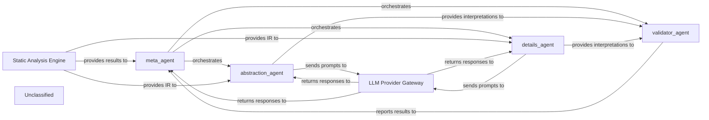
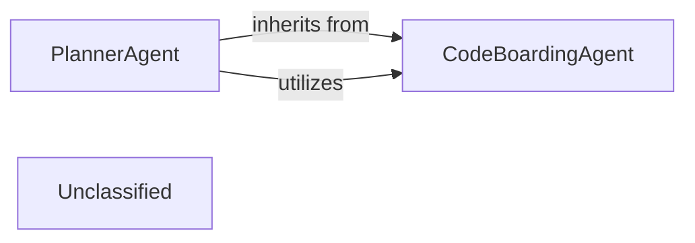
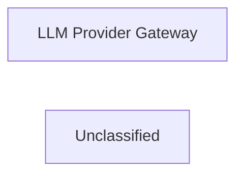
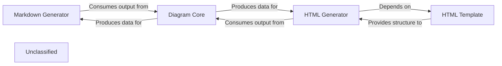
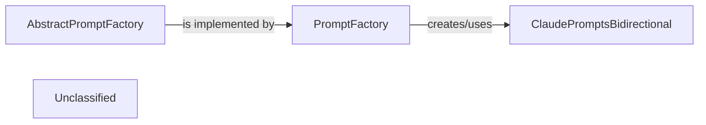
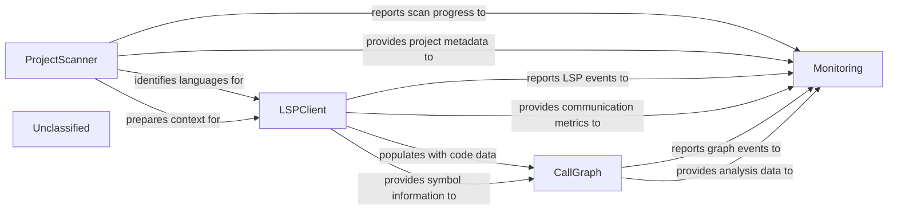
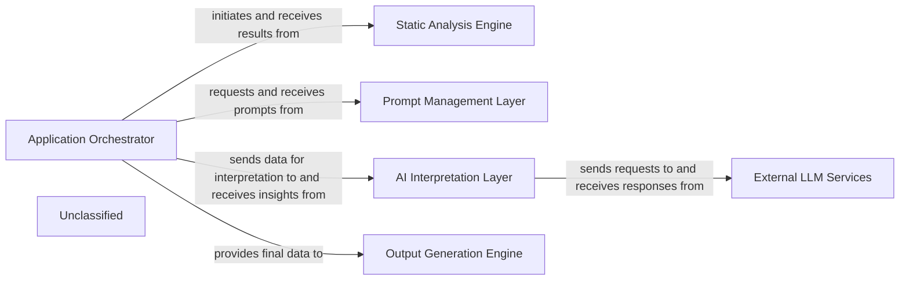

## Details

The AI Interpretation Layer is orchestrated by the `meta_agent`, which directs the flow of analysis. It receives initial static analysis results, including an Intermediate Representation (IR), from the `Static Analysis Engine`. The `meta_agent` then delegates tasks to specialized agents: the `abstraction_agent` for high-level insights and the `details_agent` for granular information. Both `abstraction_agent` and `details_agent` interact with the `LLM Provider Gateway` to leverage Large Language Models for interpretation. Their generated interpretations are then passed to the `validator_agent` for quality assurance. Finally, the `validator_agent` reports its findings back to the `meta_agent`, which aggregates and synthesizes the complete interpretation before delivering it to the `Output Generation Engine` for final presentation. This architecture ensures a structured, multi-faceted approach to code analysis and interpretation.

### meta_agent
Orchestrates the overall interpretation process, invoking other agents, managing information flow, and synthesizing their outputs. It acts as the primary control point for the AI Interpretation Layer.

**Related Classes/Methods**:

- <a href="https://github.com/CodeBoarding/CodeBoarding/blob/main/.codeboardingagents/meta_agent.py" target="_blank" rel="noopener noreferrer">`agents.meta_agent.MetaAgent`</a>

### abstraction_agent
Interprets static analysis results to identify high-level concepts, architectural patterns, and summarized insights.

**Related Classes/Methods**:

- <a href="https://github.com/CodeBoarding/CodeBoarding/blob/main/.codeboardingagents/abstraction_agent.py" target="_blank" rel="noopener noreferrer">`agents.abstraction_agent.AbstractionAgent`</a>

### details_agent
Extracts granular details, specific code characteristics, and detailed explanations from static analysis results.

**Related Classes/Methods**:

- <a href="https://github.com/CodeBoarding/CodeBoarding/blob/main/.codeboardingagents/details_agent.py" target="_blank" rel="noopener noreferrer">`agents.details_agent.DetailsAgent`</a>

### validator_agent
Validates interpretations from `abstraction_agent` and `details_agent` for consistency, accuracy, and completeness.

**Related Classes/Methods**:

- <a href="https://github.com/CodeBoarding/CodeBoarding/blob/main/.codeboardingagents/validator_agent.py" target="_blank" rel="noopener noreferrer">`agents.validator_agent.ValidatorAgent`</a>

### Static Analysis Engine [[Expand]](./Static_Analysis_Engine.md)
Performs static analysis on the codebase, generating an Intermediate Representation (IR) and identifying characteristics, issues, and vulnerabilities. This component implicitly includes the "Intermediate Representation (IR) Generator" functionality.

**Related Classes/Methods**:

- <a href="https://github.com/CodeBoarding/CodeBoarding/blob/main/.codeboardingstatic_analyzer/__init__.py" target="_blank" rel="noopener noreferrer">`static_analyzer`</a>

### LLM Provider Gateway
Provides a standardized interface for all agents to interact with Large Language Models (LLMs) for generating interpretations. This is handled by the `llm` attribute within `CodeBoardingAgent`.

**Related Classes/Methods**:

- <a href="https://github.com/CodeBoarding/CodeBoarding/blob/main/.codeboardingagents/agent.py" target="_blank" rel="noopener noreferrer">`agents.agent.CodeBoardingAgent`</a>

### Unclassified
Component for all unclassified files and utility functions (Utility functions/External Libraries/Dependencies)

**Related Classes/Methods**: _None_

### [FAQ](https://github.com/CodeBoarding/GeneratedOnBoardings/tree/main?tab=readme-ov-file#faq)

## Details

The Application Orchestrator subsystem acts as the central control unit, managing the entire workflow from initiating analysis to integrating results and coordinating output generation. It is primarily encapsulated within the `agents` package, utilizing `agents.planner_agent` and `agents.agent` modules. Within this subsystem, the `PlannerAgent` specializes in managing the initial planning phase of the code analysis, extending the `CodeBoardingAgent` which provides fundamental AI interaction and tool integration capabilities. This hierarchical structure enables specialized agents to coordinate workflow steps built upon a generic AI interaction layer, effectively implementing an "Orchestration Engine" pattern.

### CodeBoardingAgent
This is the foundational, generic AI agent within the system, serving as a core part of the "AI Interpretation Layer." It provides the essential capabilities for interacting with Large Language Models (LLMs) and integrating various specialized tools to gather and process information about the codebase. Its responsibilities include LLM initialization, API key management, and robust invocation and parsing of LLM responses.

**Related Classes/Methods**:

- <a href="https://github.com/CodeBoarding/CodeBoarding/blob/main/.codeboardingagents/agent.py" target="_blank" rel="noopener noreferrer">`agents.agent`</a>

### PlannerAgent
A specialized AI agent that extends `CodeBoardingAgent` to manage the initial planning phase of the code analysis workflow. This component is central to the "Orchestration Engine" as it determines which components of the codebase require deeper investigation based on initial insights, thereby dictating the initial steps and direction of the analysis pipeline.

**Related Classes/Methods**:

- <a href="https://github.com/CodeBoarding/CodeBoarding/blob/main/.codeboardingagents/planner_agent.py" target="_blank" rel="noopener noreferrer">`agents.planner_agent`</a>

### Unclassified
Component for all unclassified files and utility functions (Utility functions/External Libraries/Dependencies)

**Related Classes/Methods**: _None_

### [FAQ](https://github.com/CodeBoarding/GeneratedOnBoardings/tree/main?tab=readme-ov-file#faq)

## Details

This analysis describes the `LLM Provider Gateway` component, which serves as a crucial abstraction layer for the internal system to interact with various external Large Language Model services. Its primary purpose is to simplify and standardize communication with different LLM providers by handling complexities such as request/response formatting, authentication, and provider-specific integration logic, thereby ensuring a unified interface for the internal system.

### LLM Provider Gateway
Provides a unified and abstracted interface for the internal system to interact with various third-party Large Language Model services (e.g., OpenAI, Anthropic, Google Gemini). It handles request/response formatting, authentication, authorization, and encapsulates provider-specific integration logic, thereby abstracting away the complexities of individual LLM APIs.

**Related Classes/Methods**:

- <a href="https://github.com/CodeBoarding/CodeBoarding/blob/main/.codeboardingagents/tools/external_deps.py" target="_blank" rel="noopener noreferrer">`agents.tools.external_deps`</a>

### Unclassified
Component for all unclassified files and utility functions (Utility functions/External Libraries/Dependencies)

**Related Classes/Methods**: _None_

### [FAQ](https://github.com/CodeBoarding/GeneratedOnBoardings/tree/main?tab=readme-ov-file#faq)

## Details

The documentation and diagram generation subsystem is centered around the Diagram Core, which is responsible for processing analysis insights and producing raw diagram data. This data is then consumed by format-specific generators: the Markdown Generator for static Markdown output with Mermaid syntax, and the HTML Generator for interactive web-based documentation. The HTML Generator further relies on the HTML Template to provide the structural and stylistic foundation for the final web pages, embedding the interactive diagrams and detailed component information. This architecture ensures a clear separation of concerns between diagram data generation and output formatting, allowing for flexible and extensible documentation capabilities.

### Markdown Generator
Generates comprehensive documentation in Markdown format. This includes structuring detailed component descriptions, creating Mermaid graph syntax for diagrams, and linking to other generated files. It is a primary output mechanism for the tool.

**Related Classes/Methods**:

- <a href="https://github.com/CodeBoarding/CodeBoarding/blob/main/.codeboardingoutput_generators/markdown.py" target="_blank" rel="noopener noreferrer">`output_generators.markdown`</a>

### HTML Generator
Produces interactive documentation in HTML format. It is responsible for creating the JSON data structure required for Cytoscape.js diagrams, embedding this data within an HTML template, and populating the template with structured component details and navigation links.

**Related Classes/Methods**:

- <a href="https://github.com/CodeBoarding/CodeBoarding/blob/main/.codeboardingoutput_generators/html.py" target="_blank" rel="noopener noreferrer">`output_generators.html`</a>

### Diagram Core
Provides the foundational logic for generating diagram data structures or syntax from analysis insights, independent of the final output format. It abstracts the complexities of different diagramming libraries (e.g., Mermaid, Cytoscape.js) and produces the raw diagram information that format-specific generators then integrate. This component is crucial for the "visual diagrams" aspect of the engine.

**Related Classes/Methods**:

- <a href="https://github.com/CodeBoarding/CodeBoarding/blob/main/.codeboardingdiagram_analysis/diagram_generator.py" target="_blank" rel="noopener noreferrer">`diagram_analysis.diagram_generator`</a>

### HTML Template
Defines the overall HTML structure, layout, and styling for the web-based documentation. It serves as a static foundation that the HTML Generator dynamically populates with content, including component details, descriptions, and embedded interactive diagrams.

**Related Classes/Methods**:

- <a href="https://github.com/CodeBoarding/CodeBoarding/blob/main/.codeboardingoutput_generators/html_template.py" target="_blank" rel="noopener noreferrer">`output_generators.html_template`</a>

### Unclassified
Component for all unclassified files and utility functions (Utility functions/External Libraries/Dependencies)

**Related Classes/Methods**: _None_

### [FAQ](https://github.com/CodeBoarding/GeneratedOnBoardings/tree/main?tab=readme-ov-file#faq)

## Details

The Prompt Management Layer subsystem focuses on the dynamic creation and management of prompts for various LLMs, aligning with the 'AI Interpretation Layer' and 'Modular Design' aspects of the project. This subsystem exhibits a Factory design pattern. The AbstractPromptFactory defines the interface, which PromptFactory implements. PromptFactory then acts as the client that instantiates concrete prompt products, such as ClaudePromptsBidirectional, based on runtime conditions. This structure ensures modularity and allows for easy addition of new LLM-specific prompt implementations without modifying the core PromptFactory logic, aligning with the project's emphasis on extensibility and modular design.

### AbstractPromptFactory
Defines the abstract interface or contract for creating prompts. It establishes a common blueprint for all concrete prompt factories, ensuring consistency and extensibility in prompt generation.

**Related Classes/Methods**:

- <a href="https://github.com/CodeBoarding/CodeBoarding/blob/main/.codeboardingagents/prompts/abstract_prompt_factory.py" target="_blank" rel="noopener noreferrer">`agents.prompts.abstract_prompt_factory`</a>

### PromptFactory
A concrete implementation of the AbstractPromptFactory. This component is responsible for the dynamic creation and selection of appropriate prompts based on the current analysis context and the target LLM. It acts as the primary orchestrator within the prompt management layer.

**Related Classes/Methods**:

- <a href="https://github.com/CodeBoarding/CodeBoarding/blob/main/.codeboardingagents/prompts/prompt_factory.py" target="_blank" rel="noopener noreferrer">`agents.prompts.prompt_factory`</a>

### ClaudePromptsBidirectional
A concrete prompt implementation specifically designed for the Claude LLM. It encapsulates the prompt templates and any specific formatting or interaction logic required for effective communication with Claude.

**Related Classes/Methods**:

- <a href="https://github.com/CodeBoarding/CodeBoarding/blob/main/.codeboardingagents/prompts/claude_prompts_bidirectional.py" target="_blank" rel="noopener noreferrer">`agents.prompts.claude_prompts_bidirectional`</a>

### Unclassified
Component for all unclassified files and utility functions (Utility functions/External Libraries/Dependencies)

**Related Classes/Methods**: _None_

### [FAQ](https://github.com/CodeBoarding/GeneratedOnBoardings/tree/main?tab=readme-ov-file#faq)

## Details

The system's core functionality revolves around static code analysis, orchestrated through a sequence of specialized components. The ProjectScanner initiates the process by identifying project languages and basic statistics. This information then guides the LSPClient to interact with Language Servers, extracting detailed code symbols and relationships. The CallGraph component consumes this data to construct a comprehensive control flow graph of the codebase, representing code entities and their interdependencies. A newly introduced Monitoring subsystem is deeply integrated into the application's main execution flow, observing and collecting operational metrics and events from these core components to provide insights into system performance and behavior.

### ProjectScanner
Scans the project to identify programming languages, gather code statistics (lines of code, percentages), and extract file suffixes. It acts as the initial language detector and high-level metadata extractor.

**Related Classes/Methods**:

- <a href="https://github.com/CodeBoarding/CodeBoarding/blob/main/.codeboardingstatic_analyzer/scanner.py" target="_blank" rel="noopener noreferrer">`ProjectScanner`</a>

### LSPClient
Manages communication with Language Servers (LSPs) for various programming languages. It initiates LSP server processes, sends JSON-RPC requests for detailed code information (symbols, call hierarchy), and processes responses to extract data like symbols, call relationships, and class hierarchies.

**Related Classes/Methods**:

- <a href="https://github.com/CodeBoarding/CodeBoarding/blob/main/.codeboardingstatic_analyzer/lsp_client/client.py" target="_blank" rel="noopener noreferrer">`LSPClient`</a>

### CallGraph
Constructs and maintains the control flow graph (CFG) of the codebase. It stores code elements as `Node` objects and their interdependencies as `Edge` objects, providing functionalities to analyze and summarize these relationships.

**Related Classes/Methods**:

- <a href="https://github.com/CodeBoarding/CodeBoarding/blob/main/.codeboardingstatic_analyzer/graph.py" target="_blank" rel="noopener noreferrer">`CallGraph`</a>
- <a href="https://github.com/CodeBoarding/CodeBoarding/blob/main/.codeboardingstatic_analyzer/graph.py" target="_blank" rel="noopener noreferrer">`Node`</a>
- <a href="https://github.com/CodeBoarding/CodeBoarding/blob/main/.codeboardingstatic_analyzer/graph.py" target="_blank" rel="noopener noreferrer">`Edge`</a>

### Monitoring
Manages the collection, processing, and reporting of system metrics, events, and operational data. It provides mechanisms for callbacks, context management, path tracking, statistics aggregation, and data writing, integrating into the application's core execution flow to observe system operations.

**Related Classes/Methods**:

- <a href="https://github.com/CodeBoarding/CodeBoarding/blob/main/.codeboardingmonitoring/callbacks.py" target="_blank" rel="noopener noreferrer">`monitoring.callbacks`</a>

### Unclassified
Component for all unclassified files and utility functions (Utility functions/External Libraries/Dependencies)

**Related Classes/Methods**: _None_

### [FAQ](https://github.com/CodeBoarding/GeneratedOnBoardings/tree/main?tab=readme-ov-file#faq)

## Details

The CodeBoarding project is an AI-driven code analysis and documentation system. The Application Orchestrator manages the overall workflow, initiating static code analysis, generating prompts, and coordinating AI interpretation. The Static Analysis Engine provides code insights, which the AI Interpretation Layer processes using External LLM Services. The Prompt Management Layer optimizes LLM interactions, and the Output Generation Engine creates documentation and diagrams from the processed insights. This modular design ensures efficient processing and flexible integration with various AI models.

### Application Orchestrator [[Expand]](./Application_Orchestrator.md)
The central control unit managing the entire workflow, from initiating analysis to integrating results and coordinating output generation.

**Related Classes/Methods**:

- <a href="https://github.com/CodeBoarding/CodeBoarding/blob/main/.codeboardingagents/planner_agent.py" target="_blank" rel="noopener noreferrer">`agents.planner_agent`</a>
- <a href="https://github.com/CodeBoarding/CodeBoarding/blob/main/.codeboardingagents/agent.py" target="_blank" rel="noopener noreferrer">`agents.agent`</a>

### Static Analysis Engine [[Expand]](./Static_Analysis_Engine.md)
Performs in-depth static code analysis across multiple languages, extracting structural and semantic information.

**Related Classes/Methods**:

- <a href="https://github.com/CodeBoarding/CodeBoarding/blob/main/.codeboardingstatic_analyzer/scanner.py" target="_blank" rel="noopener noreferrer">`static_analyzer.scanner`</a>
- <a href="https://github.com/CodeBoarding/CodeBoarding/blob/main/.codeboardingstatic_analyzer/lsp_client/client.py" target="_blank" rel="noopener noreferrer">`static_analyzer.lsp_client.client`</a>

### Prompt Management Layer [[Expand]](./Prompt_Management_Layer.md)
Dynamically creates, selects, and contextualizes prompts for various LLMs based on the analysis phase.

**Related Classes/Methods**:

- <a href="https://github.com/CodeBoarding/CodeBoarding/blob/main/.codeboardingagents/prompts/prompt_factory.py" target="_blank" rel="noopener noreferrer">`agents.prompts.prompt_factory`</a>
- <a href="https://github.com/CodeBoarding/CodeBoarding/blob/main/.codeboardingagents/prompts/abstract_prompt_factory.py" target="_blank" rel="noopener noreferrer">`agents.prompts.abstract_prompt_factory`</a>
- <a href="https://github.com/CodeBoarding/CodeBoarding/blob/main/.codeboardingagents/prompts/claude_prompts_bidirectional.py" target="_blank" rel="noopener noreferrer">`agents.prompts.claude_prompts_bidirectional`</a>

### AI Interpretation Layer [[Expand]](./AI_Interpretation_Layer.md)
Interprets static analysis results using LLMs, processing responses to extract insights, classifications, and explanations.

**Related Classes/Methods**:

- <a href="https://github.com/CodeBoarding/CodeBoarding/blob/main/.codeboardingagents/abstraction_agent.py" target="_blank" rel="noopener noreferrer">`agents.abstraction_agent`</a>
- <a href="https://github.com/CodeBoarding/CodeBoarding/blob/main/.codeboardingagents/details_agent.py" target="_blank" rel="noopener noreferrer">`agents.details_agent`</a>
- <a href="https://github.com/CodeBoarding/CodeBoarding/blob/main/.codeboardingagents/meta_agent.py" target="_blank" rel="noopener noreferrer">`agents.meta_agent`</a>
- <a href="https://github.com/CodeBoarding/CodeBoarding/blob/main/.codeboardingagents/validator_agent.py" target="_blank" rel="noopener noreferrer">`agents.validator_agent`</a>

### Output Generation Engine [[Expand]](./Output_Generation_Engine.md)
Transforms interpreted analysis results into human-readable documentation and visual diagrams.

**Related Classes/Methods**:

- <a href="https://github.com/CodeBoarding/CodeBoarding/blob/main/.codeboardingoutput_generators/markdown.py" target="_blank" rel="noopener noreferrer">`output_generators.markdown`</a>
- <a href="https://github.com/CodeBoarding/CodeBoarding/blob/main/.codeboardingoutput_generators/html.py" target="_blank" rel="noopener noreferrer">`output_generators.html`</a>
- <a href="https://github.com/CodeBoarding/CodeBoarding/blob/main/.codeboardingdiagram_analysis/diagram_generator.py" target="_blank" rel="noopener noreferrer">`diagram_analysis.diagram_generator`</a>

### External LLM Services [[Expand]](./External_LLM_Services.md)
Represents the various third-party Large Language Model services (e.g., OpenAI, Anthropic, Google Gemini) integrated with the system.

**Related Classes/Methods**:

- `ExternalLLMServiceAPI`

### Unclassified
Component for all unclassified files and utility functions (Utility functions/External Libraries/Dependencies)

**Related Classes/Methods**: _None_

### [FAQ](https://github.com/CodeBoarding/GeneratedOnBoardings/tree/main?tab=readme-ov-file#faq)

