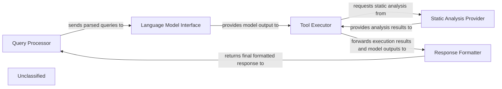
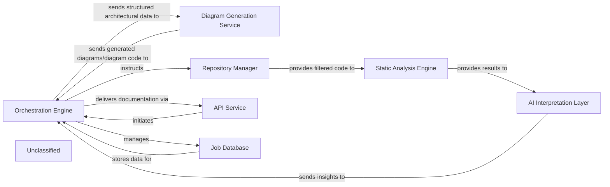
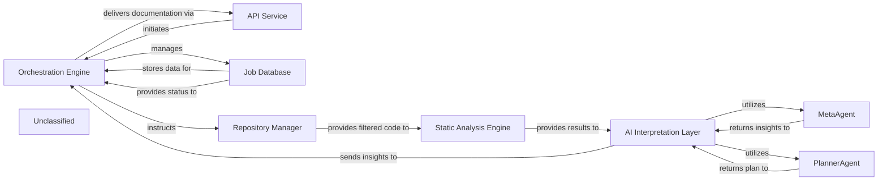
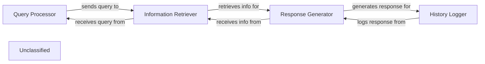
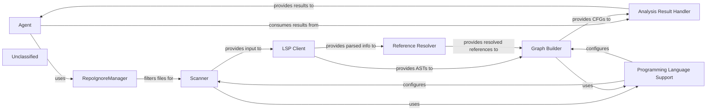

```mermaid
graph LR
    Orchestration_Engine["Orchestration Engine"]
    Static_Analysis_Engine["Static Analysis Engine"]
    AI_Processing_Layer["AI Processing Layer"]
    Output_Generation_Engine["Output Generation Engine"]
    Diagram_Generation_Service["Diagram Generation Service"]
    Unclassified["Unclassified"]
    Unclassified["Unclassified"]
    Orchestration_Engine -- "delegates tasks to" --> Static_Analysis_Engine
    Static_Analysis_Engine -- "provides enhanced structured code to" --> Orchestration_Engine
    Orchestration_Engine -- "orchestrates" --> AI_Processing_Layer
    AI_Processing_Layer -- "provides validated architectural insights to" --> Output_Generation_Engine
    Output_Generation_Engine -- "generates diagram data for" --> Diagram_Generation_Service
    click Orchestration_Engine href "https://github.com/CodeBoarding/CodeBoarding/blob/main/.codeboarding/Orchestration_Engine.md" "Details"
    click Static_Analysis_Engine href "https://github.com/CodeBoarding/CodeBoarding/blob/main/.codeboarding/Static_Analysis_Engine.md" "Details"
    click AI_Processing_Layer href "https://github.com/CodeBoarding/CodeBoarding/blob/main/.codeboarding/AI_Processing_Layer.md" "Details"
    click Output_Generation_Engine href "https://github.com/CodeBoarding/CodeBoarding/blob/main/.codeboarding/Output_Generation_Engine.md" "Details"
    click Diagram_Generation_Service href "https://github.com/CodeBoarding/CodeBoarding/blob/main/.codeboarding/Diagram_Generation_Service.md" "Details"
```

## Details

The system is designed around a core flow that begins with the Query Processor handling incoming user queries. These queries are then passed to the Language Model Interface for interaction with the underlying language model. The generated model output drives the Tool Executor, which orchestrates tool execution, now enhanced with sophisticated validation and the ability to leverage the Static Analysis Provider for deeper code understanding. Finally, the Response Formatter aggregates all information to construct and return the final response to the user. This architecture ensures a clear separation of concerns, enabling modular development and maintainability.

### Query Processor
Handles incoming user queries, including parsing and initial validation, and serves as the entry and exit point for user interaction.

**Related Classes/Methods**:

- <a href="https://github.com/CodeBoarding/CodeBoarding/blob/main/.codeboarding." target="_blank" rel="noopener noreferrer">`QueryParser:parse`</a>

### Language Model Interface
Manages communication with the underlying language model, sending prompts and receiving generated text.

**Related Classes/Methods**:

- <a href="https://github.com/CodeBoarding/CodeBoarding/blob/main/.codeboarding." target="_blank" rel="noopener noreferrer">`LLMClient:receive_response`</a>

### Tool Executor
Orchestrates tool execution, incorporating complex decision-making, enhanced validation, and iterative processing based on language model outputs. It can also leverage static analysis capabilities.

**Related Classes/Methods**:

- <a href="https://github.com/CodeBoarding/CodeBoarding/blob/main/.codeboardingagents/tools/toolkit.py" target="_blank" rel="noopener noreferrer">`ToolRegistry:get_tool`</a>
- <a href="https://github.com/CodeBoarding/CodeBoarding/blob/main/.codeboardingagents/tools/base.py#L57-L96" target="_blank" rel="noopener noreferrer">`Tool:execute`:57-96</a>

### Static Analysis Provider
Offers static analysis and reference resolution services to other components, primarily supporting the Tool Executor in understanding and validating code references.

**Related Classes/Methods**:

- <a href="https://github.com/CodeBoarding/CodeBoarding/blob/main/.codeboardingstatic_analyzer/reference_resolve_mixin.py" target="_blank" rel="noopener noreferrer">`static_analyzer/reference_resolve_mixin.py`</a>

### Response Formatter
Formats the final response by combining information from the language model and tool outputs before returning it to the user.

**Related Classes/Methods**:

### Unclassified
Component for all unclassified files and utility functions (Utility functions/External Libraries/Dependencies)

**Related Classes/Methods**: _None_

### [FAQ](https://github.com/CodeBoarding/GeneratedOnBoardings/tree/main?tab=readme-ov-file#faq)

## Details

The system's architecture is centered around an Orchestration Engine that manages the entire code analysis and documentation generation workflow. It interfaces with an API Service for job initiation and delivery, and a Job Database for status management. Code acquisition and filtering are handled by the Repository Manager, which then feeds into the Static Analysis Engine for initial code analysis. The core intelligence resides in the AI Interpretation Layer, which employs specialized MetaAgent and PlannerAgent components to derive architectural insights and strategic analysis plans from the static analysis results. These insights are then relayed back to the Orchestration Engine for final documentation generation. Finally, the Diagram Generation Service converts structured architectural data into visual diagrams, enhancing comprehension.

### Orchestration Engine [[Expand]](./Orchestration_Engine.md)
Acts as the central coordinator of the analysis and documentation generation pipeline. It initiates requests, manages the flow of data between different services, and aggregates results.

**Related Classes/Methods**:

- <a href="https://github.com/CodeBoarding/CodeBoarding/blob/main/.codeboarding.codeboarding/Orchestration_Engine.md" target="_blank" rel="noopener noreferrer">`Orchestration_Engine`</a>

### Diagram Generation Service [[Expand]](./Diagram_Generation_Service.md)
Specializes in converting structured architectural data into visual diagrams, potentially using tools like Mermaid.js. It enhances comprehension by providing interactive and visual representations of the analyzed architecture.

**Related Classes/Methods**:

- <a href="https://github.com/CodeBoarding/CodeBoarding/blob/main/.codeboardingdiagram_analysis/diagram_generator.py" target="_blank" rel="noopener noreferrer">`diagram_analysis.diagram_generator`</a>
- <a href="https://github.com/CodeBoarding/CodeBoarding/blob/main/.codeboardingdiagram_analysis/analysis_json.py" target="_blank" rel="noopener noreferrer">`diagram_analysis.analysis_json`</a>

### AI Interpretation Layer
Interprets static analysis results and generates insights, encompassing specialized agents like MetaAgent and PlannerAgent.

**Related Classes/Methods**:

- <a href="https://github.com/CodeBoarding/CodeBoarding/blob/main/.codeboardingagents/agent.py" target="_blank" rel="noopener noreferrer">`agents.agent`</a>

### Static Analysis Engine [[Expand]](./Static_Analysis_Engine.md)
Performs static analysis on the provided code, receiving a filtered set of files from the Repository Manager.

**Related Classes/Methods**:

- <a href="https://github.com/CodeBoarding/CodeBoarding/blob/main/.codeboarding.codeboarding/Static_Analysis_Engine.md" target="_blank" rel="noopener noreferrer">`Static_Analysis_Engine`</a>

### Repository Manager
Responsible for fetching code from repositories and managing file and directory exclusions based on .gitignore patterns and default ignored paths.

**Related Classes/Methods**:

- <a href="https://github.com/CodeBoarding/CodeBoarding/blob/main/.codeboarding.codeboarding/Orchestration_Engine.md" target="_blank" rel="noopener noreferrer">`Orchestration_Engine`</a>

### API Service
Handles external job requests and delivers final documentation.

**Related Classes/Methods**:

- <a href="https://github.com/CodeBoarding/CodeBoarding/blob/main/.codeboarding.codeboarding/Orchestration_Engine.md" target="_blank" rel="noopener noreferrer">`Orchestration_Engine`</a>

### Job Database
Stores and manages job status and metadata.

**Related Classes/Methods**:

- <a href="https://github.com/CodeBoarding/CodeBoarding/blob/main/.codeboarding.codeboarding/Orchestration_Engine.md" target="_blank" rel="noopener noreferrer">`Orchestration_Engine`</a>

### Unclassified
Component for all unclassified files and utility functions (Utility functions/External Libraries/Dependencies)

**Related Classes/Methods**: _None_

### [FAQ](https://github.com/CodeBoarding/GeneratedOnBoardings/tree/main?tab=readme-ov-file#faq)

## Details

The system operates with the Orchestration Engine at its core, initiating processes via the API Service and managing job states through the Job Database. The Repository Manager fetches and filters code, which is then passed to the Static Analysis Engine. This engine, now enhanced with advanced reference resolution capabilities, performs detailed code analysis. The results are then forwarded to the AI Interpretation Layer, where specialized agents like MetaAgent and PlannerAgent, supported by refined validation mechanisms from the ValidatorAgent, generate architectural insights and strategic analysis plans. Finally, these insights are returned to the Orchestration Engine for documentation delivery via the API Service.

### Orchestration Engine [[Expand]](./Orchestration_Engine.md)
The central control unit managing the entire code analysis and documentation generation pipeline. It coordinates the execution flow, from static analysis to AI interpretation and final output generation.

**Related Classes/Methods**:

- `Orchestration Engine`:1-10

### API Service
Handles external job requests and delivers final documentation.

**Related Classes/Methods**:

- `API Service`:1-10

### Job Database
Stores and manages job status and metadata.

**Related Classes/Methods**:

- `Job Database`

### Repository Manager
Responsible for fetching code from repositories and managing file and directory exclusions based on `.gitignore` patterns and default ignored paths.

**Related Classes/Methods**:

- `Repository Manager`

### Static Analysis Engine [[Expand]](./Static_Analysis_Engine.md)
Performs static analysis on the provided code, receiving a filtered set of files from the Repository Manager. It now includes enhanced capabilities for resolving code references, significantly improving its ability to understand code relationships through the integration of components like `reference_resolve_mixin`.

**Related Classes/Methods**:

- <a href="https://github.com/CodeBoarding/CodeBoarding/blob/main/.codeboardingstatic_analyzer/reference_resolve_mixin.py" target="_blank" rel="noopener noreferrer">`reference_resolve_mixin`</a>

### AI Interpretation Layer
Interprets static analysis results and generates insights, encompassing specialized agents like `MetaAgent`, `PlannerAgent`, and `ValidatorAgent`. This layer is built upon a modified agent framework, now featuring refined validation mechanisms that enhance the accuracy and robustness of its insights.

**Related Classes/Methods**:

- <a href="https://github.com/CodeBoarding/CodeBoarding/blob/main/.codeboardingagents/agent.py" target="_blank" rel="noopener noreferrer">`AI Interpretation Layer`</a>
- <a href="https://github.com/CodeBoarding/CodeBoarding/blob/main/.codeboardingagents/validator_agent.py" target="_blank" rel="noopener noreferrer">`ValidatorAgent`</a>

### MetaAgent
Analyzes project-level metadata to extract high-level architectural context, project type, domain, and technological biases, guiding subsequent analysis and interpretation. Its behavior is now influenced by the updated agent framework in `agents/agent.py` and benefits from the refined validation capabilities within the `AI Interpretation Layer`.

**Related Classes/Methods**:

- <a href="https://github.com/CodeBoarding/CodeBoarding/blob/main/.codeboardingagents/agent.py" target="_blank" rel="noopener noreferrer">`MetaAgent`</a>

### PlannerAgent
Generates a strategic plan for deeper code analysis based on initial analysis and metadata, identifying key components for detailed examination and determining their expansion scope. Its design and behavior are now influenced by the updated agent framework in `agents/agent.py` and benefits from the refined validation capabilities within the `AI Interpretation Layer`.

**Related Classes/Methods**:

- <a href="https://github.com/CodeBoarding/CodeBoarding/blob/main/.codeboardingagents/agent.py" target="_blank" rel="noopener noreferrer">`PlannerAgent`</a>

### Unclassified
Component for all unclassified files and utility functions (Utility functions/External Libraries/Dependencies)

**Related Classes/Methods**: _None_

### [FAQ](https://github.com/CodeBoarding/GeneratedOnBoardings/tree/main?tab=readme-ov-file#faq)

## Details

The system operates by processing user queries through a series of interconnected components. The `Query Processor` initially handles incoming queries, preparing them for subsequent stages. This processed query is then directed to the `Information Retriever`, which is responsible for fetching relevant data from a knowledge base, now enhanced with capabilities to resolve code references for more accurate information retrieval. The retrieved information is subsequently passed to the `Response Generator`, which leverages a language model to formulate a coherent natural language response. Finally, the `History Logger` records the interaction, storing both the original query and the generated response for future reference.

### Query Processor
Handles incoming user queries and prepares them for further processing. This component may leverage reference resolution capabilities to better understand code-related queries.

**Related Classes/Methods**:

- `QueryHandler.process`

### Information Retriever
Fetches relevant information based on the processed query from a knowledge base. This component is enhanced by the `ReferenceResolveMixin` to accurately navigate and fetch code-related information by resolving references.

**Related Classes/Methods**:

- `KnowledgeBase.retrieve`

### Response Generator
Utilizes a language model to generate a natural language response.

**Related Classes/Methods**:

- <a href="https://github.com/CodeBoarding/CodeBoarding/blob/main/.codeboardingagents/llm_config.py" target="_blank" rel="noopener noreferrer">`LanguageModel.generate_response`</a>

### History Logger
Stores the user query and the generated response for future reference.

**Related Classes/Methods**:

- <a href="https://github.com/CodeBoarding/CodeBoarding/blob/main/.codeboardingmonitoring/callbacks.py#L16-L166" target="_blank" rel="noopener noreferrer">`InteractionLogger.log`:16-166</a>

### Unclassified
Component for all unclassified files and utility functions (Utility functions/External Libraries/Dependencies)

**Related Classes/Methods**: _None_

### [FAQ](https://github.com/CodeBoarding/GeneratedOnBoardings/tree/main?tab=readme-ov-file#faq)

## Details

The system's core functionality revolves around a sophisticated static code analysis pipeline orchestrated by an intelligent `Agent`. The `Scanner` initiates the process, leveraging the `RepoIgnoreManager` for efficient file filtering and `Programming Language Support` for language-specific rules, to feed raw code into the `LSP Client`. The `LSP Client` then provides rich parsed data, including Abstract Syntax Trees (ASTs), to both the `Reference Resolver` and the `Graph Builder`. The `Reference Resolver`, with its enhanced capabilities, plays a crucial role in identifying and linking symbolic references, which are then integrated into the `Graph Builder` to construct comprehensive Control Flow Graphs (CFGs). `Programming Language Support` also guides the `Graph Builder` in this process, ensuring accurate graph construction. All analysis results, including CFGs, are meticulously managed by the `Analysis Result Handler`, which then provides these results to the `Agent`. The `Agent`, now encompassing a specialized `ValidatorAgent`, acts as the central orchestrator, consuming these detailed analysis results to interact with the codebase, process information, and generate responses, potentially utilizing an LLM for advanced reasoning.

### Agent
The `Agent` component, encompassing `CodeBoardingAgent` (from `agents/agent.py`) and the new `ValidatorAgent` (from `agents/validator_agent.py`), acts as the central orchestrator. It leverages static analysis results and a toolkit of specialized tools to interact with the codebase, process information using an LLM, and generate responses. The `ValidatorAgent` specifically handles validation tasks, adding a new stage or type of processing to the overall workflow. The `Agent` manages the overall workflow, including prompt processing, tool invocation, and response parsing.

**Related Classes/Methods**:

- <a href="https://github.com/CodeBoarding/CodeBoarding/blob/main/.codeboardingagents/agent.py#L36-L341" target="_blank" rel="noopener noreferrer">`agents.agent.CodeBoardingAgent`:36-341</a>
- <a href="https://github.com/CodeBoarding/CodeBoarding/blob/main/.codeboardingagents/validator_agent.py" target="_blank" rel="noopener noreferrer">`agents.validator_agent.ValidatorAgent`</a>

### Scanner
The `Scanner` initiates the process with lexical analysis, potentially on a filtered set of files determined by the `RepoIgnoreManager`.

**Related Classes/Methods**:

- <a href="https://github.com/CodeBoarding/CodeBoarding/blob/main/.codeboardingstatic_analyzer/__init__.py" target="_blank" rel="noopener noreferrer">`Scanner`</a>

### LSP Client
The `LSP Client` then provides rich parsed information, including Abstract Syntax Trees (ASTs), by interacting with external Language Servers.

**Related Classes/Methods**:

- <a href="https://github.com/CodeBoarding/CodeBoarding/blob/main/.codeboardingstatic_analyzer/lsp_client/client.py#L58-L1105" target="_blank" rel="noopener noreferrer">`LSPClient`:58-1105</a>

### Reference Resolver
The `Reference Resolver` component (from `static_analyzer/reference_resolve_mixin.py`) is crucial for identifying and linking symbolic references within the code. Its enhanced capabilities improve the accuracy, scope, and efficiency of reference resolution, thereby improving the quality of data fed to the `Graph Builder`.

**Related Classes/Methods**:

- <a href="https://github.com/CodeBoarding/CodeBoarding/blob/main/.codeboardingstatic_analyzer/reference_resolve_mixin.py#L15-L151" target="_blank" rel="noopener noreferrer">`ReferenceResolver`:15-151</a>

### Graph Builder
Both the ASTs from the `LSP Client` and the resolved references from the `Reference Resolver` feed into the `Graph Builder`, which constructs Control Flow Graphs (CFGs).

**Related Classes/Methods**:

- `GraphBuilder`

### Programming Language Support
Throughout this process, the `Programming Language Support` component provides language-specific configurations and rules, ensuring accurate analysis.

**Related Classes/Methods**:

- `ProgrammingLanguageSupport`

### Analysis Result Handler
The `Analysis Result Handler` manages and stores the various outputs, such as CFGs and other static analysis results, making them accessible for further processing or consumption.

**Related Classes/Methods**:

- `AnalysisResultHandler`

### RepoIgnoreManager
The `RepoIgnoreManager` handles the logic for ignoring files and directories based on project-specific configurations, influencing the scope of analysis for other components.

**Related Classes/Methods**:

- <a href="https://github.com/CodeBoarding/CodeBoarding/blob/main/.codeboardingrepo_utils/ignore.py#L8-L107" target="_blank" rel="noopener noreferrer">`repo_utils.ignore.RepoIgnoreManager`:8-107</a>

### Unclassified
Component for all unclassified files and utility functions (Utility functions/External Libraries/Dependencies)

**Related Classes/Methods**: _None_

### [FAQ](https://github.com/CodeBoarding/GeneratedOnBoardings/tree/main?tab=readme-ov-file#faq)

## Details

The system's architecture is centered around an Orchestration Engine that meticulously manages the entire code analysis and documentation generation lifecycle. It initiates a robust Static Analysis Engine, now significantly enhanced with reference resolution capabilities, to produce highly accurate structured code representations. These refined outputs are then channeled to the AI Processing Layer, where specialized agents, including a new `ValidatorAgent`, leverage Large Language Models to derive and validate architectural insights. The validated information subsequently flows to the Output Generation Engine for diverse documentation formatting, culminating in the Diagram Generation Service for intuitive visual representations. This integrated pipeline ensures comprehensive, accurate, and visually accessible architectural documentation.

### Orchestration Engine [[Expand]](./Orchestration_Engine.md)
The central control unit managing the entire code analysis and documentation generation pipeline. It coordinates the execution flow, from static analysis to AI interpretation and final output generation, primarily by delegating to the `CodeBoardingAgent`. It now also integrates the `ValidatorAgent` into its workflow for post-processing validation.

**Related Classes/Methods**:

- <a href="https://github.com/CodeBoarding/CodeBoarding/blob/main/.codeboardingagents/meta_agent.py" target="_blank" rel="noopener noreferrer">`agents.meta_agent.MetaAgent`</a>
- <a href="https://github.com/CodeBoarding/CodeBoarding/blob/main/.codeboardingagents/planner_agent.py" target="_blank" rel="noopener noreferrer">`agents.planner_agent.PlannerAgent`</a>
- <a href="https://github.com/CodeBoarding/CodeBoarding/blob/main/.codeboardingagents/agent.py" target="_blank" rel="noopener noreferrer">`agents.agent.CodeBoardingAgent`</a>

### Static Analysis Engine [[Expand]](./Static_Analysis_Engine.md)
Responsible for parsing source code, building Abstract Syntax Trees (ASTs), generating Control Flow Graphs (CFGs), and applying adaptive clustering algorithms to abstract these graphs into logical architectural components. It now incorporates a `ReferenceResolveMixin` to significantly enhance its capability to resolve references, providing more accurate, structured, clustered, and filtered code representations.

**Related Classes/Methods**:

- <a href="https://github.com/CodeBoarding/CodeBoarding/blob/main/.codeboardingstatic_analyzer" target="_blank" rel="noopener noreferrer">`static_analyzer`</a>
- <a href="https://github.com/CodeBoarding/CodeBoarding/blob/main/.codeboardingstatic_analyzer/graph.py" target="_blank" rel="noopener noreferrer">`static_analyzer.graph.Graph`</a>
- <a href="https://github.com/CodeBoarding/CodeBoarding/blob/main/.codeboardingrepo_utils/ignore.py" target="_blank" rel="noopener noreferrer">`repo_utils/ignore.py`</a>

### AI Processing Layer [[Expand]](./AI_Processing_Layer.md)
This integrated layer processes structured code data using Large Language Models (LLMs) to derive architectural insights, identify components, and understand relationships. It relies on the `CodeBoardingAgent` for prompt generation, LLM interaction, and response parsing. The newly introduced `ValidatorAgent` within this layer ensures the correctness and quality of processed information.

**Related Classes/Methods**:

- <a href="https://github.com/CodeBoarding/CodeBoarding/blob/main/.codeboardingagents/abstraction_agent.py" target="_blank" rel="noopener noreferrer">`agents.abstraction_agent.AbstractionAgent`</a>
- <a href="https://github.com/CodeBoarding/CodeBoarding/blob/main/.codeboardingagents/details_agent.py" target="_blank" rel="noopener noreferrer">`agents.details_agent.DetailsAgent`</a>
- <a href="https://github.com/CodeBoarding/CodeBoarding/blob/main/.codeboardingagents/prompts/prompt_factory.py" target="_blank" rel="noopener noreferrer">`agents.prompts.prompt_factory.PromptFactory`</a>
- <a href="https://github.com/CodeBoarding/CodeBoarding/blob/main/.codeboardingagents/llm_config.py#L14-L52" target="_blank" rel="noopener noreferrer">`agents.llm_config.LLMConfig`:14-52</a>
- <a href="https://github.com/CodeBoarding/CodeBoarding/blob/main/.codeboardingagents/validator_agent.py" target="_blank" rel="noopener noreferrer">`agents.validator_agent.ValidatorAgent`</a>

### Output Generation Engine [[Expand]](./Output_Generation_Engine.md)
Takes the structured architectural insights from the AI Processing Layer and formats them into various output types, such as documentation files (Markdown, JSON), reports, or raw data suitable for diagram generation.

**Related Classes/Methods**:

- <a href="https://github.com/CodeBoarding/CodeBoarding/blob/main/.codeboardingoutput_generators" target="_blank" rel="noopener noreferrer">`output_generators`</a>

### Diagram Generation Service [[Expand]](./Diagram_Generation_Service.md)
Specializes in converting structured architectural data into visual diagrams, potentially using tools like Mermaid.js. It enhances comprehension by providing interactive and visual representations of the analyzed architecture.

**Related Classes/Methods**:

- <a href="https://github.com/CodeBoarding/CodeBoarding/blob/main/.codeboardingdiagram_analysis" target="_blank" rel="noopener noreferrer">`diagram_analysis`</a>

### Unclassified
Component for all unclassified files and utility functions (Utility functions/External Libraries/Dependencies)

**Related Classes/Methods**: _None_

### Unclassified
Component for all unclassified files and utility functions (Utility functions/External Libraries/Dependencies)

**Related Classes/Methods**: _None_

### [FAQ](https://github.com/CodeBoarding/GeneratedOnBoardings/tree/main?tab=readme-ov-file#faq)

