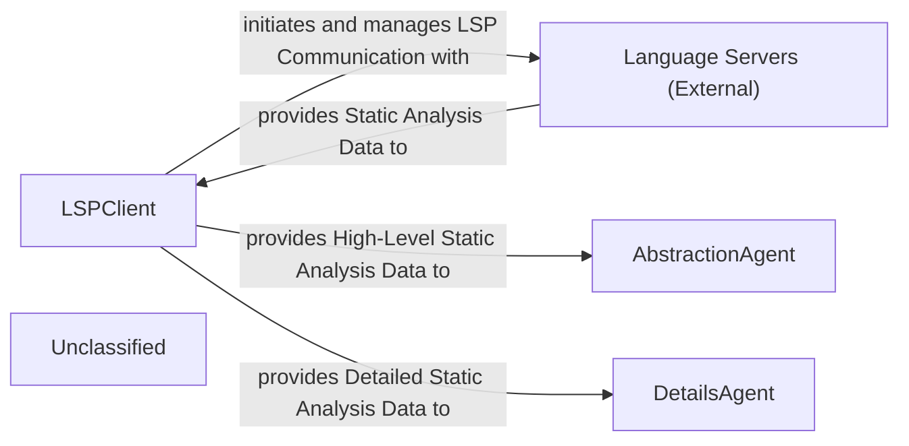
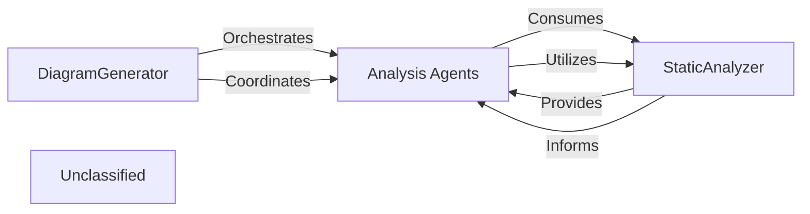
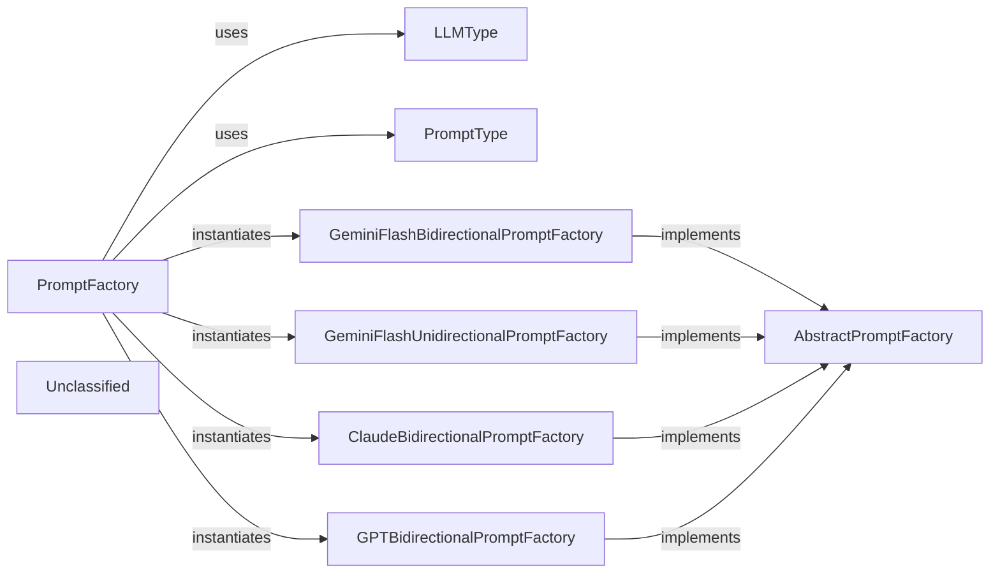
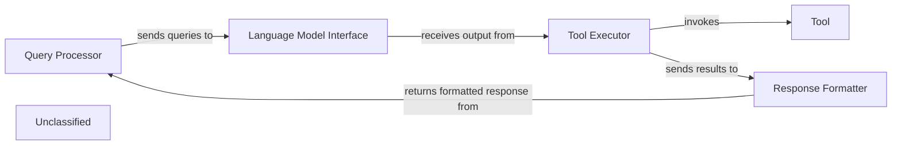
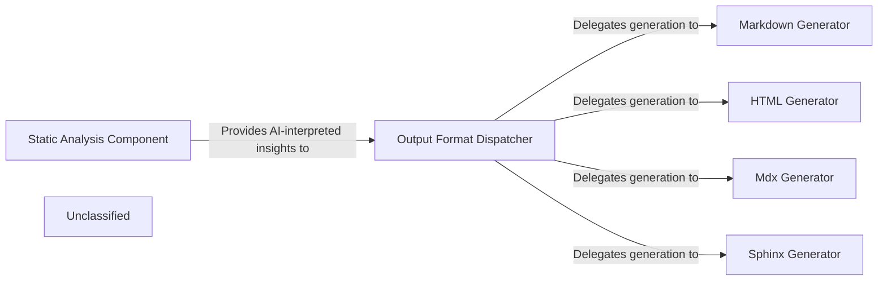
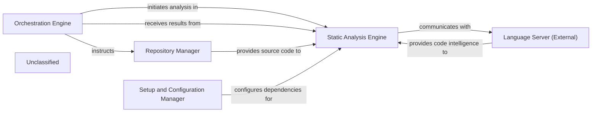
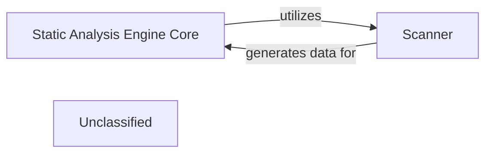
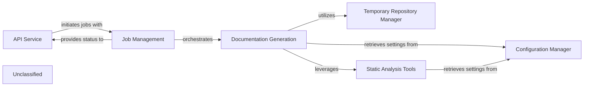
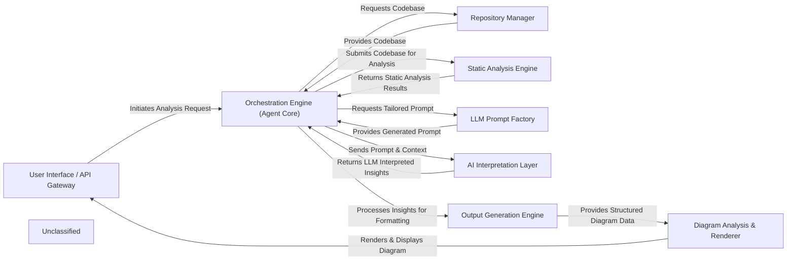

## Details

The static analysis subsystem is anchored by the LSPClient, a pivotal component responsible for interfacing with external Language Servers to gather comprehensive code intelligence. The LSPClient establishes and maintains LSP connections, orchestrating the collection of critical static analysis data such as call graphs, class hierarchies, package dependencies, and symbol references. This data forms the foundational input for the system's analytical capabilities. The AbstractionAgent then processes this information to generate high-level architectural overviews, identifying core components and their interrelationships. Simultaneously, the DetailsAgent delves into the granular static analysis data to provide in-depth insights into specific code structures and design patterns. The recent significant refinements to the LSPClient, including enhanced Windows compatibility, underscore its role as a robust and reliable data acquisition layer, directly impacting the quality and breadth of analysis performed by both the AbstractionAgent and DetailsAgent.

### LSPClient
Establishes and manages communication with external Language Servers using the Language Server Protocol (LSP). Orchestrates the collection of comprehensive static analysis data, including call graphs, class hierarchies, package relations, and symbol references. Filters source files and handles language-specific configurations. The recent changes indicate an expansion and refinement of its capabilities, including improved Windows compatibility, making it a more robust data acquisition layer.

**Related Classes/Methods**:

- <a href="https://github.com/CodeBoarding/CodeBoarding/blob/main/.codeboardingstatic_analyzer/lsp_client/client.py" target="_blank" rel="noopener noreferrer">`static_analyzer/lsp_client/client.py`</a>

### AbstractionAgent
Consumes the static analysis data provided by the LSPClient to identify major system components, their primary responsibilities, and interconnections, forming an abstract architectural representation. It distills complex codebases into understandable, high-level architectural views.

**Related Classes/Methods**:

- <a href="https://github.com/CodeBoarding/CodeBoarding/blob/main/.codeboardingagents/abstraction_agent.py" target="_blank" rel="noopener noreferrer">`agents/abstraction_agent.py`</a>

### DetailsAgent
Utilizes the detailed static analysis data from the LSPClient to perform granular analysis within specific architectural components or code sections. It delves into implementation details, identifies specific design patterns, explains the rationale behind code structures, and highlights areas of interest or concern.

**Related Classes/Methods**:

- <a href="https://github.com/CodeBoarding/CodeBoarding/blob/main/.codeboardingagents/details_agent.py" target="_blank" rel="noopener noreferrer">`agents/details_agent.py`</a>

### Language Servers (External)
External processes that provide static analysis capabilities for specific programming languages. They respond to LSP requests from the LSPClient with code intelligence data such as symbol definitions, references, call hierarchies, and type information.

**Related Classes/Methods**:

- `External.LanguageServers`

### Unclassified
Component for all unclassified files and utility functions (Utility functions/External Libraries/Dependencies)

**Related Classes/Methods**: _None_

### [FAQ](https://github.com/CodeBoarding/GeneratedOnBoardings/tree/main?tab=readme-ov-file#faq)

## Details

The system's architecture is centered around the DiagramGenerator, which acts as the primary orchestrator, initiating and managing the architectural analysis workflow. It coordinates a suite of Analysis Agents, each specialized for different aspects of code analysis, from metadata gathering to detailed structural examination. These Analysis Agents critically depend on the StaticAnalyzer component, which provides foundational static code analysis capabilities by extracting structural and semantic information from the codebase. Recent enhancements to the StaticAnalyzer's Language Server Protocol (LSP) client have further improved its ability to deliver comprehensive code insights, thereby empowering the Analysis Agents to perform more robust and accurate analyses. The DiagramGenerator then consolidates and persists the architectural insights generated through this collaborative process.

### DiagramGenerator
This is the core orchestrator of the architectural analysis process. It initializes, configures, and coordinates various specialized Analysis Agents to perform a multi-stage analysis of the codebase. It manages the parallel execution of component analysis, applies feedback for iterative refinement, and ultimately persists the generated architectural insights into structured Analysis Files.

**Related Classes/Methods**:

- <a href="https://github.com/CodeBoarding/CodeBoarding/blob/main/.codeboardingdiagram_analysis/diagram_generator.py" target="_blank" rel="noopener noreferrer">`diagram_analysis.diagram_generator.DiagramGenerator`</a>

### Analysis Agents
This component represents a collection of intelligent agents (MetaAgent, DetailsAgent, AbstractionAgent, PlannerAgent, ValidatorAgent, DiffAnalyzingAgent) that perform specific tasks within the analysis pipeline. They are responsible for gathering project metadata, conducting detailed code analysis, abstracting architectural components, planning subsequent analysis steps, validating the accuracy of the analysis, and managing incremental updates based on code changes.

**Related Classes/Methods**:

- <a href="https://github.com/CodeBoarding/CodeBoarding/blob/main/.codeboardingagents/meta_agent.py" target="_blank" rel="noopener noreferrer">`agents.meta_agent.MetaAgent`</a>
- <a href="https://github.com/CodeBoarding/CodeBoarding/blob/main/.codeboardingagents/details_agent.py" target="_blank" rel="noopener noreferrer">`agents.details_agent.DetailsAgent`</a>
- <a href="https://github.com/CodeBoarding/CodeBoarding/blob/main/.codeboardingagents/abstraction_agent.py" target="_blank" rel="noopener noreferrer">`agents.abstraction_agent.AbstractionAgent`</a>
- <a href="https://github.com/CodeBoarding/CodeBoarding/blob/main/.codeboardingagents/planner_agent.py" target="_blank" rel="noopener noreferrer">`agents.planner_agent.PlannerAgent`</a>
- <a href="https://github.com/CodeBoarding/CodeBoarding/blob/main/.codeboardingagents/validator_agent.py" target="_blank" rel="noopener noreferrer">`agents.validator_agent.ValidatorAgent`</a>
- <a href="https://github.com/CodeBoarding/CodeBoarding/blob/main/.codeboardingagents/diff_analyzer.py" target="_blank" rel="noopener noreferrer">`agents.diff_analyzer.DiffAnalyzingAgent`</a>

### StaticAnalyzer
Provides foundational static code analysis capabilities. It extracts structural and semantic information from the codebase without executing it, which is then consumed by the Analysis Agents to inform their analytical tasks. Recent enhancements to its internal LSP client have improved its ability to gather comprehensive code information.

**Related Classes/Methods**:

- `static_analyzer.StaticAnalyzer`

### Unclassified
Component for all unclassified files and utility functions (Utility functions/External Libraries/Dependencies)

**Related Classes/Methods**: _None_

### [FAQ](https://github.com/CodeBoarding/GeneratedOnBoardings/tree/main?tab=readme-ov-file#faq)

## Details

The LLM Prompt Factory subsystem is a critical part of the AI Interpretation Layer within the project's Code analysis and documentation generation tool architecture. It adheres to the Factory Method and Strategy patterns, enabling dynamic prompt generation tailored for various LLMs and interaction styles.

### PromptFactory
The primary orchestrator for creating and managing LLM prompts. It acts as the central entry point, dynamically selecting and instantiating the appropriate concrete prompt factory based on the desired `LLMType` and `PromptType`. It provides methods to retrieve specific prompts by name or all available prompts from the selected factory.

**Related Classes/Methods**:

- <a href="https://github.com/CodeBoarding/CodeBoarding/blob/main/.codeboardingagents/prompts/prompt_factory.py" target="_blank" rel="noopener noreferrer">`PromptFactory`</a>
- <a href="https://github.com/CodeBoarding/CodeBoarding/blob/main/.codeboardingagents/prompts/prompt_factory.py#L26-L32" target="_blank" rel="noopener noreferrer">`LLMType`:26-32</a>
- <a href="https://github.com/CodeBoarding/CodeBoarding/blob/main/.codeboardingagents/prompts/prompt_factory.py#L19-L23" target="_blank" rel="noopener noreferrer">`PromptType`:19-23</a>
- <a href="https://github.com/CodeBoarding/CodeBoarding/blob/main/.codeboardingagents/prompts/abstract_prompt_factory.py" target="_blank" rel="noopener noreferrer">`AbstractPromptFactory`</a>
- <a href="https://github.com/CodeBoarding/CodeBoarding/blob/main/.codeboardingagents/prompts/gemini_flash_prompts_bidirectional.py#L369-L433" target="_blank" rel="noopener noreferrer">`GeminiFlashBidirectionalPromptFactory`:369-433</a>
- <a href="https://github.com/CodeBoarding/CodeBoarding/blob/main/.codeboardingagents/prompts/gemini_flash_prompts_unidirectional.py#L369-L434" target="_blank" rel="noopener noreferrer">`GeminiFlashUnidirectionalPromptFactory`:369-434</a>
- <a href="https://github.com/CodeBoarding/CodeBoarding/blob/main/.codeboardingagents/prompts/claude_prompts_bidirectional.py#L382-L446" target="_blank" rel="noopener noreferrer">`ClaudeBidirectionalPromptFactory`:382-446</a>
- <a href="https://github.com/CodeBoarding/CodeBoarding/blob/main/.codeboardingagents/prompts/gpt_prompts_bidirectional.py#L571-L635" target="_blank" rel="noopener noreferrer">`GPTBidirectionalPromptFactory`:571-635</a>

### AbstractPromptFactory
An abstract base class that defines the contract for all concrete prompt factories. It establishes the interface for retrieving prompts, ensuring a consistent API across different LLM and prompt interaction type implementations. This promotes modularity and extensibility.

**Related Classes/Methods**:

- <a href="https://github.com/CodeBoarding/CodeBoarding/blob/main/.codeboardingagents/prompts/abstract_prompt_factory.py" target="_blank" rel="noopener noreferrer">`AbstractPromptFactory`</a>

### LLMType
An enumeration that defines the various Large Language Model types supported by the system (e.g., `GEMINI_FLASH`, `CLAUDE`, `GPT4`). It provides a clear, enumerated set of options for LLM models, used by `PromptFactory` for dynamic factory selection.

**Related Classes/Methods**:

- <a href="https://github.com/CodeBoarding/CodeBoarding/blob/main/.codeboardingagents/prompts/prompt_factory.py#L26-L32" target="_blank" rel="noopener noreferrer">`LLMType`:26-32</a>

### PromptType
An enumeration that defines the interaction patterns for prompts (e.g., `BIDIRECTIONAL`, `UNIDIRECTIONAL`). It provides a clear, enumerated set of options for prompt interaction styles, used by `PromptFactory` for dynamic factory selection.

**Related Classes/Methods**:

- <a href="https://github.com/CodeBoarding/CodeBoarding/blob/main/.codeboardingagents/prompts/prompt_factory.py#L19-L23" target="_blank" rel="noopener noreferrer">`PromptType`:19-23</a>

### GeminiFlashBidirectionalPromptFactory
A concrete implementation of `AbstractPromptFactory` specifically designed for generating bidirectional prompts for Gemini Flash LLMs. This class encapsulates the actual string templates and logic for its designated LLM and prompt style.

**Related Classes/Methods**:

- <a href="https://github.com/CodeBoarding/CodeBoarding/blob/main/.codeboardingagents/prompts/gemini_flash_prompts_bidirectional.py#L369-L433" target="_blank" rel="noopener noreferrer">`GeminiFlashBidirectionalPromptFactory`:369-433</a>
- <a href="https://github.com/CodeBoarding/CodeBoarding/blob/main/.codeboardingagents/prompts/abstract_prompt_factory.py" target="_blank" rel="noopener noreferrer">`AbstractPromptFactory`</a>

### GeminiFlashUnidirectionalPromptFactory
A concrete implementation of `AbstractPromptFactory` for generating unidirectional prompts specifically for Gemini Flash LLMs. It holds the specific prompt templates for this LLM and interaction style.

**Related Classes/Methods**:

- <a href="https://github.com/CodeBoarding/CodeBoarding/blob/main/.codeboardingagents/prompts/gemini_flash_prompts_unidirectional.py#L369-L434" target="_blank" rel="noopener noreferrer">`GeminiFlashUnidirectionalPromptFactory`:369-434</a>
- <a href="https://github.com/CodeBoarding/CodeBoarding/blob/main/.codeboardingagents/prompts/abstract_prompt_factory.py" target="_blank" rel="noopener noreferrer">`AbstractPromptFactory`</a>

### ClaudeBidirectionalPromptFactory
A concrete implementation of `AbstractPromptFactory` for generating bidirectional prompts for Claude LLMs. This class contains the specific prompt templates for Claude's bidirectional interactions.

**Related Classes/Methods**:

- <a href="https://github.com/CodeBoarding/CodeBoarding/blob/main/.codeboardingagents/prompts/claude_prompts_bidirectional.py#L382-L446" target="_blank" rel="noopener noreferrer">`ClaudeBidirectionalPromptFactory`:382-446</a>
- <a href="https://github.com/CodeBoarding/CodeBoarding/blob/main/.codeboardingagents/prompts/abstract_prompt_factory.py" target="_blank" rel="noopener noreferrer">`AbstractPromptFactory`</a>

### GPTBidirectionalPromptFactory
A concrete implementation of `AbstractPromptFactory` for generating bidirectional prompts for GPT LLMs. It manages the prompt templates tailored for GPT's bidirectional communication.

**Related Classes/Methods**:

- <a href="https://github.com/CodeBoarding/CodeBoarding/blob/main/.codeboardingagents/prompts/gpt_prompts_bidirectional.py#L571-L635" target="_blank" rel="noopener noreferrer">`GPTBidirectionalPromptFactory`:571-635</a>
- <a href="https://github.com/CodeBoarding/CodeBoarding/blob/main/.codeboardingagents/prompts/abstract_prompt_factory.py" target="_blank" rel="noopener noreferrer">`AbstractPromptFactory`</a>

### Unclassified
Component for all unclassified files and utility functions (Utility functions/External Libraries/Dependencies)

**Related Classes/Methods**: _None_

### [FAQ](https://github.com/CodeBoarding/GeneratedOnBoardings/tree/main?tab=readme-ov-file#faq)

## Details

This graph represents the core functionality of a system that processes user queries, generates responses using a language model, and interacts with external tools. The main flow involves receiving a query, parsing it, invoking a language model to determine the appropriate action, executing that action (which might involve using a tool), and finally formatting and returning the response to the user. Its purpose is to provide a flexible and extensible framework for building AI-powered applications that can understand and act upon user requests.

### Query Processor
Handles incoming user queries, including parsing and initial validation.

**Related Classes/Methods**:

- `QueryParser:parse`

### Language Model Interface
Manages interactions with the underlying language model, sending prompts and receiving generated text.

**Related Classes/Methods**:

- `LLMClient:send_prompt`
- `LLMClient:receive_response`

### Tool Executor
Executes specific tools based on the language model's output, handling tool invocation and result retrieval.

**Related Classes/Methods**:

- `ToolRegistry:get_tool`
- <a href="https://github.com/CodeBoarding/CodeBoarding/blob/main/.codeboardingagents/agent.py#L60-L148" target="_blank" rel="noopener noreferrer">`Tool:execute`:60-148</a>

### Response Formatter
Formats the final response to be sent back to the user, potentially combining information from the language model and tool outputs.

**Related Classes/Methods**:

- `ResponseBuilder:build`

### Unclassified
Component for all unclassified files and utility functions (Utility functions/External Libraries/Dependencies)

**Related Classes/Methods**: _None_

### [FAQ](https://github.com/CodeBoarding/GeneratedOnBoardings/tree/main?tab=readme-ov-file#faq)

## Details

The system's architecture is centered around an Output Generation Engine that transforms AI-interpreted insights into various documentation formats. This process begins with the Static Analysis Component, which is responsible for generating the core "AI-interpreted insights" from code analysis. These insights are then passed to the Output Format Dispatcher, the central orchestrator of the engine. The Dispatcher, based on the requested output format, delegates the task to specialized generators: the Markdown Generator, HTML Generator, Mdx Generator, and Sphinx Generator. Each generator is responsible for producing high-quality documentation in its specific format, ensuring a flexible and extensible output pipeline. This design promotes a clear separation of concerns, allowing for independent development and enhancement of both the analysis and output generation capabilities.

### Static Analysis Component
This component is responsible for performing static analysis on the codebase and generating "AI-interpreted insights." It acts as a crucial upstream dependency, providing the raw, processed data that the Output Generation Engine transforms into various documentation formats. The significant updates in its LSP client highlight its active development and importance in the overall system.

**Related Classes/Methods**:

- <a href="https://github.com/CodeBoarding/CodeBoarding/blob/main/.codeboardingstatic_analyzer/lsp_client/client.py" target="_blank" rel="noopener noreferrer">`static_analyzer/lsp_client/client.py`</a>

### Output Format Dispatcher
This component serves as the central orchestrator within the Output Generation Engine. It receives AI-interpreted insights along with the desired output format and dispatches the data to the appropriate specialized generator (e.g., Markdown, HTML, MDX, Sphinx). This component is crucial for maintaining a clear separation of concerns and supporting the "Pipeline/Workflow" architectural pattern by managing the flow to specific formatters.

**Related Classes/Methods**:

- <a href="https://github.com/CodeBoarding/CodeBoarding/blob/main/.codeboardingoutput_generators/markdown.py" target="_blank" rel="noopener noreferrer">`output_generators/markdown.py`</a>
- <a href="https://github.com/CodeBoarding/CodeBoarding/blob/main/.codeboardingoutput_generators/html.py" target="_blank" rel="noopener noreferrer">`output_generators/html.py`</a>
- <a href="https://github.com/CodeBoarding/CodeBoarding/blob/main/.codeboardingoutput_generators/mdx.py" target="_blank" rel="noopener noreferrer">`output_generators/mdx.py`</a>
- <a href="https://github.com/CodeBoarding/CodeBoarding/blob/main/.codeboardingoutput_generators/sphinx.py" target="_blank" rel="noopener noreferrer">`output_generators/sphinx.py`</a>

### Markdown Generator
Specializes in converting AI-interpreted insights into a well-structured Markdown format. This output is ideal for human-readable documentation, README files, and integration with Markdown-based rendering tools. It is a fundamental component for generating textual documentation, a primary output of a "Code Analysis and Documentation Generation Tool."

**Related Classes/Methods**:

- <a href="https://github.com/CodeBoarding/CodeBoarding/blob/main/.codeboardingoutput_generators/markdown.py" target="_blank" rel="noopener noreferrer">`output_generators/markdown.py`</a>

### HTML Generator
Focuses on transforming AI-interpreted insights into HTML format. This enables rich, web-based documentation, interactive reports, and seamless integration with web platforms or tools. This component provides an alternative, often more visually rich, documentation output, supporting diverse presentation needs.

**Related Classes/Methods**:

- <a href="https://github.com/CodeBoarding/CodeBoarding/blob/main/.codeboardingoutput_generators/html.py" target="_blank" rel="noopener noreferrer">`output_generators/html.py`</a>

### Mdx Generator
Specializes in converting AI-interpreted insights into MDX (Markdown with JSX) format. This enables the creation of interactive and dynamic documentation, leveraging the power of React components within Markdown.

**Related Classes/Methods**:

- <a href="https://github.com/CodeBoarding/CodeBoarding/blob/main/.codeboardingoutput_generators/mdx.py" target="_blank" rel="noopener noreferrer">`output_generators/mdx.py`</a>

### Sphinx Generator
Focuses on transforming AI-interpreted insights into a format compatible with Sphinx, a popular documentation generator. This allows for the creation of comprehensive and structured documentation, often used for large software projects.

**Related Classes/Methods**:

- <a href="https://github.com/CodeBoarding/CodeBoarding/blob/main/.codeboardingoutput_generators/sphinx.py" target="_blank" rel="noopener noreferrer">`output_generators/sphinx.py`</a>

### Unclassified
Component for all unclassified files and utility functions (Utility functions/External Libraries/Dependencies)

**Related Classes/Methods**: _None_

### [FAQ](https://github.com/CodeBoarding/GeneratedOnBoardings/tree/main?tab=readme-ov-file#faq)

## Details

The system's architecture is driven by the Orchestration Engine, which coordinates the entire static analysis workflow. It directs the Repository Manager to provide project source code and then instructs the Static Analysis Engine to perform the analysis. The Static Analysis Engine is the central component for code intelligence, leveraging an internal LspClient to interact with external Language Servers via the Language Server Protocol. These Language Servers supply language-specific details, enabling the Static Analysis Engine to construct comprehensive call graphs, class hierarchies, and package relationships. Prior to analysis, the Setup and Configuration Manager ensures that the environment is prepared and all necessary external Language Servers are correctly installed and configured. Finally, the Static Analysis Engine delivers its detailed analysis results back to the Orchestration Engine for further processing or reporting.

### Orchestration Engine
Coordinates the entire static analysis workflow, directing other components and receiving final results.

**Related Classes/Methods**:

- `OrchestrationEngine`

### Repository Manager [[Expand]](./Repository_Manager.md)
Provides project source files and context to the Static Analysis Engine.

**Related Classes/Methods**:

- `RepositoryManager`:10-20

### Static Analysis Engine [[Expand]](./Static_Analysis_Engine.md)
The Static Analysis Engine's core functionality for gathering code intelligence is encapsulated within the LspClient class. This client acts as an intermediary, establishing and managing communication with external Language Servers (e.g., for Python, TypeScript) using the Language Server Protocol (LSP). The LspClient initiates a language server process, sends JSON-RPC requests for various code analysis tasks (such as retrieving document symbols, preparing call hierarchies, finding incoming/outgoing calls, and resolving definitions/references), and processes the responses. It orchestrates the building of a comprehensive static analysis by concurrently analyzing source files, extracting package relations, identifying symbol references, constructing call graphs, and determining class hierarchies. This involves a continuous exchange of messages with the external Language Server to gather detailed, language-specific code information.

**Related Classes/Methods**:

- <a href="https://github.com/CodeBoarding/CodeBoarding/blob/main/.codeboardingstatic_analyzer/lsp_client/client.py" target="_blank" rel="noopener noreferrer">`LspClient`</a>

### Setup and Configuration Manager
Ensures that necessary external Language Server dependencies are installed and configured for the Static Analysis Engine.

**Related Classes/Methods**:

- `SetupAndConfigurationManager`:1-10

### Language Server (External)
An external component that provides language-specific code intelligence via the Language Server Protocol.

**Related Classes/Methods**:

- `LanguageServer`:1-10

### Unclassified
Component for all unclassified files and utility functions (Utility functions/External Libraries/Dependencies)

**Related Classes/Methods**: _None_

### [FAQ](https://github.com/CodeBoarding/GeneratedOnBoardings/tree/main?tab=readme-ov-file#faq)

## Details

This system describes the core functionality of a Static Analysis Engine, a distinct subsystem responsible for in-depth static analysis of source code. Its main purpose is to process raw source code, parse it into foundational structural data, and prepare this data for further interpretation. The central flow involves an orchestrating core component that delegates initial parsing to a scanner, which then provides the processed data back to the core.

### Static Analysis Engine Core
This component acts as the orchestrator for the entire static analysis process within the subsystem. It manages the input of source code, coordinates the execution of internal analysis modules, and prepares the extracted structural information (CFGs, ASTs) for downstream components. It ensures the coherent flow of data from raw code to structured analysis output.

**Related Classes/Methods**:

- <a href="https://github.com/CodeBoarding/CodeBoarding/blob/main/.codeboardingstatic_analyzer/__init__.py" target="_blank" rel="noopener noreferrer">`static_analyzer`</a>

### Scanner
The `Scanner` is a fundamental component within the `Static Analysis Engine` responsible for the initial pass over the source code. Its primary function is to read and parse the raw code, identifying language constructs, tokens, and basic syntactic elements. This process forms the foundation upon which more complex structures like Abstract Syntax Trees (ASTs) and Control Flow Graphs (CFGs) are built.

**Related Classes/Methods**:

- <a href="https://github.com/CodeBoarding/CodeBoarding/blob/main/.codeboardingstatic_analyzer/scanner.py" target="_blank" rel="noopener noreferrer">`static_analyzer.scanner.Scanner`</a>

### Unclassified
Component for all unclassified files and utility functions (Utility functions/External Libraries/Dependencies)

**Related Classes/Methods**: _None_

### [FAQ](https://github.com/CodeBoarding/GeneratedOnBoardings/tree/main?tab=readme-ov-file#faq)

## Details

The system is designed to generate documentation from code repositories. It operates through an API Service that handles user requests and initiates documentation generation jobs. These jobs are managed by the Job Management component, which tracks their lifecycle and state. The core Documentation Generation component executes the actual process, involving cloning repositories via the Temporary Repository Manager, performing in-depth code analysis using the Static Analysis Tools (which include an enhanced Language Server Protocol client), and applying system settings provided by the Configuration Manager. This architecture ensures a clear separation of concerns, enabling efficient and scalable documentation generation.

### API Service
Handles all incoming API requests, validates inputs, initiates background jobs, and serves job status and results.

**Related Classes/Methods**:

- `api_service.APIService:handle_request`:1-10

### Job Management
Manages the persistence and state transitions of documentation generation jobs (e.g., PENDING, RUNNING, COMPLETED, FAILED) using a database.

**Related Classes/Methods**:

- `job_management.JobManager:create_job`:1-10

### Documentation Generation
Executes the core logic of cloning repositories, analyzing code, and generating documentation files, leveraging static analysis tools and configuration.

**Related Classes/Methods**:

- `doc_generation.DocGenerator:generate`

### Temporary Repository Manager
Handles the creation and cleanup of temporary directories used for cloning repositories and storing intermediate analysis results.

**Related Classes/Methods**:

- `temp_repo_manager.TempRepoManager:clone_repository`:1-10

### Static Analysis Tools
Provides enhanced language server functionalities (TypeScript, Pyright) and code analysis tools (tokei, gopls) used by the Documentation Generation component. Recent updates have significantly improved its internal LSP client's capabilities and robustness.

**Related Classes/Methods**:

- `static_analysis.Analyzer:run_analysis`

### Configuration Manager
Manages system configuration, including paths to static analysis tools, LLM provider settings, and repository roots, primarily through `static_analysis_config.yml` and `.env` files.

**Related Classes/Methods**:

- `config_manager.ConfigManager:load_config`:1-10

### Unclassified
Component for all unclassified files and utility functions (Utility functions/External Libraries/Dependencies)

**Related Classes/Methods**: _None_

### [FAQ](https://github.com/CodeBoarding/GeneratedOnBoardings/tree/main?tab=readme-ov-file#faq)

## Details

The system is designed around a central `Orchestration Engine` that manages the entire code analysis and documentation generation workflow. User requests are initiated through the `User Interface / API Gateway`, which then delegates the processing to the `Orchestration Engine`. This engine interacts with the `Repository Manager` to access code, the `Static Analysis Engine` to extract structural information, and the `LLM Prompt Factory` to prepare prompts for AI. The `AI Interpretation Layer` processes these prompts and analysis results to generate architectural insights. Finally, the `Output Generation Engine` formats these insights, and the `Diagram Analysis & Renderer` visualizes them, with the results being delivered back through the `User Interface / API Gateway`.

### User Interface / API Gateway [[Expand]](./User_Interface_API_Gateway.md)
The primary interface for users to initiate code analysis and view the generated architectural diagrams. It acts as the system's entry and exit point, handling API requests and responses.

**Related Classes/Methods**:

- <a href="https://github.com/CodeBoarding/CodeBoarding/blob/main/.codeboardinglocal_app.py" target="_blank" rel="noopener noreferrer">`local_app.app`</a>

### Orchestration Engine (Agent Core) [[Expand]](./Orchestration_Engine_Agent_Core_.md)
The central control unit that manages the entire analysis workflow, coordinating interactions between all other components and maintaining the state of the analysis. It orchestrates the various agents to perform their tasks.

**Related Classes/Methods**:

- <a href="https://github.com/CodeBoarding/CodeBoarding/blob/main/.codeboardingagents/meta_agent.py" target="_blank" rel="noopener noreferrer">`agents.meta_agent.MetaAgent`</a>

### Repository Manager [[Expand]](./Repository_Manager.md)
Handles all interactions with code repositories, including cloning, fetching, and providing a standardized interface for accessing the source code. It also manages temporary repository folders.

**Related Classes/Methods**:

- <a href="https://github.com/CodeBoarding/CodeBoarding/blob/main/.codeboardingutils.py" target="_blank" rel="noopener noreferrer">`utils.create_temp_repo_folder`</a>
- <a href="https://github.com/CodeBoarding/CodeBoarding/blob/main/.codeboardingutils.py" target="_blank" rel="noopener noreferrer">`utils.remove_temp_repo_folder`</a>

### Static Analysis Engine [[Expand]](./Static_Analysis_Engine.md)
Performs in-depth static analysis on the source code to extract structural information such as Control Flow Graphs (CFGs) and Abstract Syntax Trees (ASTs).

**Related Classes/Methods**:

- <a href="https://github.com/CodeBoarding/CodeBoarding/blob/main/.codeboardingstatic_analyzer/scanner.py" target="_blank" rel="noopener noreferrer">`static_analyzer.scanner.Scanner`</a>

### LLM Prompt Factory [[Expand]](./LLM_Prompt_Factory.md)
Dynamically generates and manages prompts specifically tailored for various Large Language Models (LLMs) and different code analysis tasks.

**Related Classes/Methods**:

- <a href="https://github.com/CodeBoarding/CodeBoarding/blob/main/.codeboardingagents/prompts/prompt_factory.py" target="_blank" rel="noopener noreferrer">`agents.prompts.prompt_factory.PromptFactory`</a>

### AI Interpretation Layer [[Expand]](./AI_Interpretation_Layer.md)
Interfaces with diverse LLM providers to process static analysis results and prompts, interpreting code context and generating architectural insights. This layer includes agents responsible for abstraction and detailed analysis.

**Related Classes/Methods**:

- <a href="https://github.com/CodeBoarding/CodeBoarding/blob/main/.codeboardingagents/abstraction_agent.py" target="_blank" rel="noopener noreferrer">`agents.abstraction_agent.AbstractionAgent`</a>
- <a href="https://github.com/CodeBoarding/CodeBoarding/blob/main/.codeboardingagents/details_agent.py" target="_blank" rel="noopener noreferrer">`agents.details_agent.DetailsAgent`</a>

### Output Generation Engine [[Expand]](./Output_Generation_Engine.md)
Transforms the AI-interpreted insights into structured output formats, preparing the data for diagram generation and other documentation purposes (e.g., Markdown, HTML).

**Related Classes/Methods**:

- <a href="https://github.com/CodeBoarding/CodeBoarding/blob/main/.codeboardingoutput_generators/markdown.py" target="_blank" rel="noopener noreferrer">`output_generators.markdown.MarkdownGenerator`</a>
- <a href="https://github.com/CodeBoarding/CodeBoarding/blob/main/.codeboardingoutput_generators/html.py" target="_blank" rel="noopener noreferrer">`output_generators.html.HTMLGenerator`</a>

### Diagram Analysis & Renderer [[Expand]](./Diagram_Analysis_Renderer.md)
Refines the structured output into a diagram-specific format (e.g., Mermaid.js syntax) and renders it into visual architectural diagrams.

**Related Classes/Methods**:

- <a href="https://github.com/CodeBoarding/CodeBoarding/blob/main/.codeboardingdiagram_analysis/diagram_generator.py" target="_blank" rel="noopener noreferrer">`diagram_analysis.diagram_generator.DiagramGenerator`</a>

### Unclassified
Component for all unclassified files and utility functions (Utility functions/External Libraries/Dependencies)

**Related Classes/Methods**: _None_

### Unclassified
Component for all unclassified files and utility functions (Utility functions/External Libraries/Dependencies)

**Related Classes/Methods**: _None_

### Unclassified
Component for all unclassified files and utility functions (Utility functions/External Libraries/Dependencies)

**Related Classes/Methods**: _None_

### Unclassified
Component for all unclassified files and utility functions (Utility functions/External Libraries/Dependencies)

**Related Classes/Methods**: _None_

### [FAQ](https://github.com/CodeBoarding/GeneratedOnBoardings/tree/main?tab=readme-ov-file#faq)

