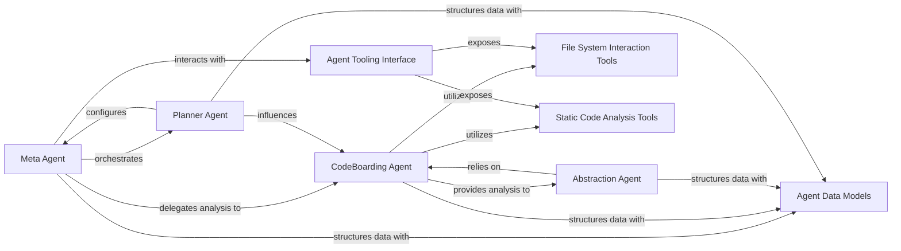
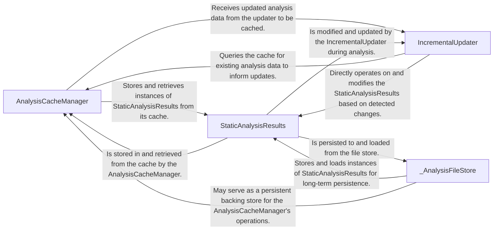
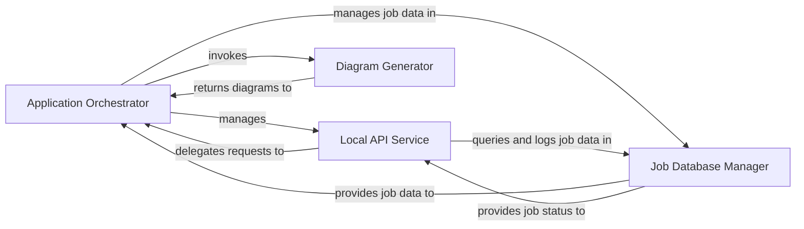
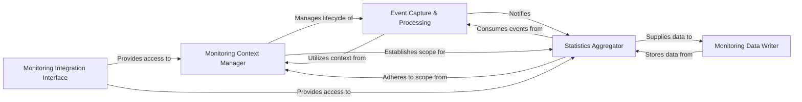
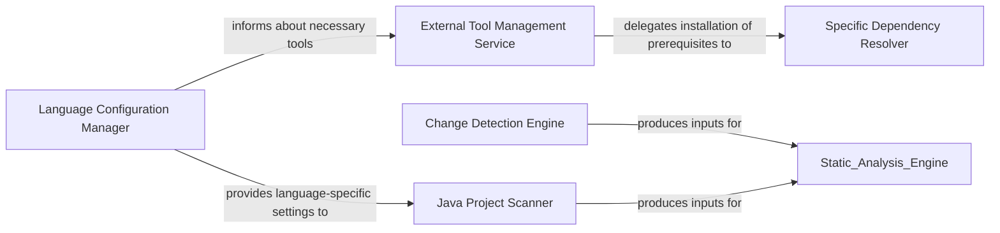
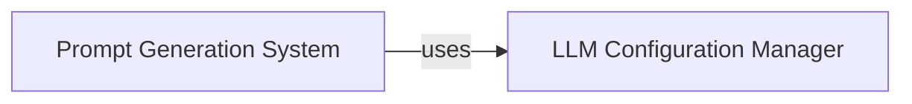
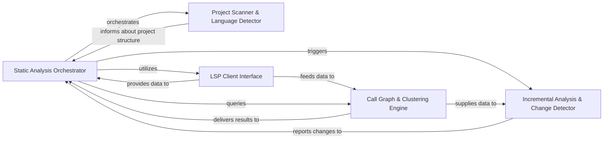
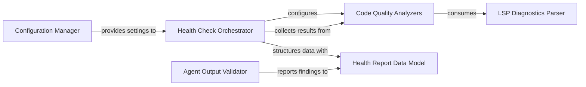

```mermaid
graph LR
    AI_Agent_Orchestration["AI Agent Orchestration"]
    Prompt_LLM_Configuration["Prompt & LLM Configuration"]
    Static_Analysis_Engine["Static Analysis Engine"]
    Analysis_Data_Management["Analysis Data Management"]
    Project_Environment_Setup["Project & Environment Setup"]
    Application_Orchestration_Output["Application Orchestration & Output"]
    Validation_Health_Checks["Validation & Health Checks"]
    Monitoring_Telemetry["Monitoring & Telemetry"]
    Application_Orchestration_Output -- "Initiates project setup." --> Project_Environment_Setup
    Project_Environment_Setup -- "Configures static analysis." --> Static_Analysis_Engine
    Static_Analysis_Engine -- "Stores analysis data." --> Analysis_Data_Management
    Analysis_Data_Management -- "Provides cached data." --> Static_Analysis_Engine
    Analysis_Data_Management -- "Supplies analysis insights." --> AI_Agent_Orchestration
    AI_Agent_Orchestration -- "Requests code details." --> Static_Analysis_Engine
    AI_Agent_Orchestration -- "Utilizes LLM configurations." --> Prompt_LLM_Configuration
    AI_Agent_Orchestration -- "Delivers generated content." --> Application_Orchestration_Output
    Static_Analysis_Engine -- "Provides analysis for validation." --> Validation_Health_Checks
    AI_Agent_Orchestration -- "Provides agent output for validation." --> Validation_Health_Checks
    Application_Orchestration_Output -- "Consumes validation reports." --> Validation_Health_Checks
    AI_Agent_Orchestration -- "Reports agent activity." --> Monitoring_Telemetry
    Application_Orchestration_Output -- "Reports workflow metrics." --> Monitoring_Telemetry
    click AI_Agent_Orchestration href "https://github.com/CodeBoarding/CodeBoarding/blob/main/.codeboarding/AI_Agent_Orchestration.md" "Details"
    click Prompt_LLM_Configuration href "https://github.com/CodeBoarding/CodeBoarding/blob/main/.codeboarding/Prompt_LLM_Configuration.md" "Details"
    click Static_Analysis_Engine href "https://github.com/CodeBoarding/CodeBoarding/blob/main/.codeboarding/Static_Analysis_Engine.md" "Details"
    click Analysis_Data_Management href "https://github.com/CodeBoarding/CodeBoarding/blob/main/.codeboarding/Analysis_Data_Management.md" "Details"
    click Project_Environment_Setup href "https://github.com/CodeBoarding/CodeBoarding/blob/main/.codeboarding/Project_Environment_Setup.md" "Details"
    click Application_Orchestration_Output href "https://github.com/CodeBoarding/CodeBoarding/blob/main/.codeboarding/Application_Orchestration_Output.md" "Details"
    click Validation_Health_Checks href "https://github.com/CodeBoarding/CodeBoarding/blob/main/.codeboarding/Validation_Health_Checks.md" "Details"
    click Monitoring_Telemetry href "https://github.com/CodeBoarding/CodeBoarding/blob/main/.codeboarding/Monitoring_Telemetry.md" "Details"
```

## Details

Manages the lifecycle, coordination, and execution of various AI agents, providing them with tools, prompts, and LLM configurations to perform codebase analysis and generate insights. This component includes the core agent logic, specific tools for interaction, and the overall strategy for agent-based analysis.

### Meta Agent
Acts as the primary orchestrator for the entire codebase analysis workflow. It establishes the initial project context by analyzing metadata, classifies files, and guides the overall analysis strategy.

**Related Classes/Methods**:

- <a href="https://github.com/CodeBoarding/CodeBoarding/blob/main/.codeboardingagents/meta_agent.py" target="_blank" rel="noopener noreferrer">`agents.meta_agent.MetaAgent`</a>

### CodeBoarding Agent
Performs detailed, granular analysis of specific components or clusters identified during the initial phases. It is responsible for grouping files into logical components, managing their assignments, and extracting in-depth information about their internal structure and relationships.

**Related Classes/Methods**:

- <a href="https://github.com/CodeBoarding/CodeBoarding/blob/main/.codeboardingagents/cluster_methods_mixin.py" target="_blank" rel="noopener noreferrer">`agents.codeboarding_agent.CodeBoardingAgent`</a>

### Abstraction Agent
Generates higher-level architectural abstractions and relationships between components based on the detailed analysis provided by other agents. This aids in creating conceptual diagrams and understanding the overall system design.

**Related Classes/Methods**:

- <a href="https://github.com/CodeBoarding/CodeBoarding/blob/main/.codeboardingagents/abstraction_agent.py" target="_blank" rel="noopener noreferrer">`agents.abstraction_agent.AbstractionAgent`</a>

### Planner Agent
Manages the planning of analysis steps, determines component expansion strategies, and provides system-wide constants and configuration settings for the agent system. It ensures an efficient and adaptive analysis workflow.

**Related Classes/Methods**:

- <a href="https://github.com/CodeBoarding/CodeBoarding/blob/main/.codeboardingagents/planner_agent.py" target="_blank" rel="noopener noreferrer">`agents.planner_agent.plan_analysis`</a>

### Agent Tooling Interface
Serves as a unified interface and factory for all specialized analysis tools. It provides a centralized mechanism for agents to access functionalities like reading files, documentation, CFG data, package dependencies, and code structure.

**Related Classes/Methods**:

- <a href="https://github.com/CodeBoarding/CodeBoarding/blob/main/.codeboardingagents/tools/toolkit.py" target="_blank" rel="noopener noreferrer">`agents.tools.toolkit.CodeBoardingToolkit`</a>

### File System Interaction Tools
A collection of tools dedicated to interacting with the file system. They provide capabilities to read documentation files, retrieve project directory structures, read the content of specific files, analyze Git diffs, and manage repository context.

**Related Classes/Methods**:

- <a href="https://github.com/CodeBoarding/CodeBoarding/blob/main/.codeboardingagents/tools/read_git_diff.py" target="_blank" rel="noopener noreferrer">`agents.tools.read_git_diff`</a>
- <a href="https://github.com/CodeBoarding/CodeBoarding/blob/main/.codeboardingagents/tools/read_file.py" target="_blank" rel="noopener noreferrer">`agents.tools.read_file`</a>
- <a href="https://github.com/CodeBoarding/CodeBoarding/blob/main/.codeboardingagents/tools/read_git_diff.py" target="_blank" rel="noopener noreferrer">`agents.tools.get_file_structure`</a>

### Static Code Analysis Tools
A suite of tools focused on static code analysis. They enable the retrieval of source code for specific references, package dependency graphs, Control Flow Graph (CFG) data, class hierarchies, and method invocation details.

**Related Classes/Methods**:

- <a href="https://github.com/CodeBoarding/CodeBoarding/blob/main/.codeboardingagents/tools/get_method_invocations.py" target="_blank" rel="noopener noreferrer">`agents.tools.get_source_code`</a>
- <a href="https://github.com/CodeBoarding/CodeBoarding/blob/main/.codeboardingagents/tools/get_method_invocations.py" target="_blank" rel="noopener noreferrer">`agents.tools.get_package_dependencies`</a>
- <a href="https://github.com/CodeBoarding/CodeBoarding/blob/main/.codeboardingagents/tools/get_method_invocations.py" target="_blank" rel="noopener noreferrer">`agents.tools.get_class_hierarchy`</a>
- <a href="https://github.com/CodeBoarding/CodeBoarding/blob/main/.codeboardingagents/tools/get_method_invocations.py" target="_blank" rel="noopener noreferrer">`agents.tools.get_cfg_data`</a>

### Agent Data Models
Defines the data models and structures for all inputs and outputs within the agent system. This includes models for analysis insights, component definitions, file classifications, and validation results, ensuring consistent data exchange and interoperability.

**Related Classes/Methods**:

- <a href="https://github.com/CodeBoarding/CodeBoarding/blob/main/.codeboardingagents/agent_responses.py" target="_blank" rel="noopener noreferrer">`agents.models.AnalysisInsight`</a>
- <a href="https://github.com/CodeBoarding/CodeBoarding/blob/main/.codeboardingagents/agent_responses.py" target="_blank" rel="noopener noreferrer">`agents.models.ComponentDefinition`</a>
- <a href="https://github.com/CodeBoarding/CodeBoarding/blob/main/.codeboardingagents/agent_responses.py" target="_blank" rel="noopener noreferrer">`agents.models.FileClassification`</a>
- <a href="https://github.com/CodeBoarding/CodeBoarding/blob/main/.codeboardingagents/agent_responses.py" target="_blank" rel="noopener noreferrer">`agents.models.ValidationResult`</a>

### [FAQ](https://github.com/CodeBoarding/GeneratedOnBoardings/tree/main?tab=readme-ov-file#faq)

## Details

Manages the caching, persistence, and incremental updates of static analysis results, ensuring efficient storage and retrieval of codebase insights. This component is crucial for optimizing performance by only re-analyzing changed parts of the codebase.

### AnalysisCacheManager
Manages the caching mechanism for static analysis results. This includes handling the serialization, deserialization, validation, and merging of incremental analysis data to optimize performance and reduce re-computation.

**Related Classes/Methods**:

- <a href="https://github.com/CodeBoarding/CodeBoarding/blob/main/.codeboardingdiagram_analysis/incremental/io_utils.py" target="_blank" rel="noopener noreferrer">`AnalysisCacheManager`</a>

### StaticAnalysisResults
Serves as the central data structure for all static analysis outputs. It encapsulates foundational structural information extracted from the code, such as Control Flow Graphs, class hierarchies, package dependencies, and cross-references.

**Related Classes/Methods**:

- <a href="https://github.com/CodeBoarding/CodeBoarding/blob/main/.codeboardingdiagram_analysis/incremental/io_utils.py" target="_blank" rel="noopener noreferrer">`StaticAnalysisResults`</a>

### IncrementalUpdater
Orchestrates the entire incremental analysis workflow. It determines the scope of changes, identifies affected components, and coordinates the execution of patching, re-classification, and re-expansion processes to update analysis results efficiently.

**Related Classes/Methods**:

- <a href="https://github.com/CodeBoarding/CodeBoarding/blob/main/.codeboardingdiagram_analysis/incremental/io_utils.py" target="_blank" rel="noopener noreferrer">`IncrementalUpdater`</a>

### _AnalysisFileStore
Provides the underlying persistent storage and retrieval mechanism for static analysis outputs. It ensures the long-term availability and organization of analysis results, acting as the foundational storage layer.

**Related Classes/Methods**:

- <a href="https://github.com/CodeBoarding/CodeBoarding/blob/main/.codeboardingdiagram_analysis/incremental/io_utils.py" target="_blank" rel="noopener noreferrer">`_AnalysisFileStore`</a>

### [FAQ](https://github.com/CodeBoarding/GeneratedOnBoardings/tree/main?tab=readme-ov-file#faq)

## Details

Orchestrates the main application workflow, manages analysis jobs, provides an API for external interaction, and generates diverse documentation and diagram outputs from analysis results. This component ties together the analysis results with user-consumable documentation and diagrams.

### Application Orchestrator
The central control unit that initializes the application, parses configurations, and orchestrates the entire codebase analysis and documentation generation pipeline. It coordinates the execution flow, manages repository processing, and initiates the analysis and output phases.

**Related Classes/Methods**:

- <a href="https://github.com/CodeBoarding/CodeBoarding/blob/main/.codeboardingmain.py" target="_blank" rel="noopener noreferrer">`main.main`</a>

### Local API Service
Provides a local web API for users to interact with the application. It handles requests to initiate, manage, and monitor documentation generation jobs, acting as the primary interface for external interaction.

**Related Classes/Methods**:

- <a href="https://github.com/CodeBoarding/CodeBoarding/blob/main/.codeboardingmain.py" target="_blank" rel="noopener noreferrer">`local_app.local_app`</a>

### Diagram Generator
Transforms the structured analysis results into various diagram formats (e.g., component, sequence, activity diagrams). It processes the output from static analysis to create visual representations of the codebase architecture.

**Related Classes/Methods**:

- <a href="https://github.com/CodeBoarding/CodeBoarding/blob/main/.codeboardingdiagram_analysis/diagram_generator.py" target="_blank" rel="noopener noreferrer">`diagram_analysis.diagram_generator.diagram_generator`</a>

### Job Database Manager
Manages the persistence of job-related data, including job status, configuration, and execution history, using a DuckDB database. It provides CRUD operations for job records.

**Related Classes/Methods**:

- <a href="https://github.com/CodeBoarding/CodeBoarding/blob/main/.codeboardingmain.py" target="_blank" rel="noopener noreferrer">`duckdb_crud.duckdb_crud`</a>

### [FAQ](https://github.com/CodeBoarding/GeneratedOnBoardings/tree/main?tab=readme-ov-file#faq)

## Details

Collects and reports runtime statistics and usage data, particularly for LLM and tool interactions. This component is vital for understanding the performance, cost, and behavior of the AI agents and the overall analysis pipeline.

### Monitoring Context Manager
Provides a contextual wrapper for monitoring execution, allowing for the enablement/disablement of monitoring and the management of run-specific statistics and traces. It serves as the entry point for initiating and managing monitoring for a given operation or analysis run.

**Related Classes/Methods**:

- <a href="https://github.com/CodeBoarding/CodeBoarding/blob/main/.codeboardingmonitoring/context.py" target="_blank" rel="noopener noreferrer">`monitoring.context.MonitoringContext`</a>
- <a href="https://github.com/CodeBoarding/CodeBoarding/blob/main/.codeboardingmonitoring/context.py" target="_blank" rel="noopener noreferrer">`monitoring.context.MonitoringSession`</a>
- <a href="https://github.com/CodeBoarding/CodeBoarding/blob/main/.codeboardingmonitoring/context.py" target="_blank" rel="noopener noreferrer">`monitoring.context.enable_monitoring`</a>

### Event Capture & Processing
Responsible for capturing and processing events generated during the execution of LLM calls and tool usage. It records granular metrics such as LLM input/output, tool start/end times, and errors, acting as the primary listener for operational events.

**Related Classes/Methods**:

- <a href="https://github.com/CodeBoarding/CodeBoarding/blob/main/.codeboardingmonitoring/context.py" target="_blank" rel="noopener noreferrer">`monitoring.context.MonitoringCallback`</a>
- <a href="https://github.com/CodeBoarding/CodeBoarding/blob/main/.codeboardingmonitoring/context.py" target="_blank" rel="noopener noreferrer">`monitoring.events.LLMEvent`</a>
- <a href="https://github.com/CodeBoarding/CodeBoarding/blob/main/.codeboardingmonitoring/context.py" target="_blank" rel="noopener noreferrer">`monitoring.events.ToolEvent`</a>
- <a href="https://github.com/CodeBoarding/CodeBoarding/blob/main/.codeboardingmonitoring/context.py" target="_blank" rel="noopener noreferrer">`monitoring.events.EventDispatcher`</a>

### Statistics Aggregator
Aggregates and stores various runtime statistics for a single execution run, including token usage, tool call counts, errors, and latency. It acts as a central data container for transforming raw event data into meaningful metrics.

**Related Classes/Methods**:

- <a href="https://github.com/CodeBoarding/CodeBoarding/blob/main/.codeboardingmonitoring/stats.py" target="_blank" rel="noopener noreferrer">`monitoring.stats.StatsManager`</a>
- <a href="https://github.com/CodeBoarding/CodeBoarding/blob/main/.codeboardingmonitoring/stats.py" target="_blank" rel="noopener noreferrer">`monitoring.stats.RunStatistics`</a>
- <a href="https://github.com/CodeBoarding/CodeBoarding/blob/main/.codeboardingmonitoring/stats.py" target="_blank" rel="noopener noreferrer">`monitoring.stats.MetricCollector`</a>

### Monitoring Data Writer
Handles the persistence and output of collected monitoring data and aggregated statistics to various destinations, such as the console or files. It manages output directories and formats the collected data for storage or display.

**Related Classes/Methods**:

- <a href="https://github.com/CodeBoarding/CodeBoarding/blob/main/.codeboardingmonitoring/writers.py" target="_blank" rel="noopener noreferrer">`monitoring.writers.ConsoleWriter`</a>
- <a href="https://github.com/CodeBoarding/CodeBoarding/blob/main/.codeboardingmonitoring/writers.py" target="_blank" rel="noopener noreferrer">`monitoring.writers.FileWriter`</a>
- <a href="https://github.com/CodeBoarding/CodeBoarding/blob/main/.codeboardingmonitoring/writers.py" target="_blank" rel="noopener noreferrer">`monitoring.writers.StatsFormatter`</a>

### Monitoring Integration Interface
Offers a reusable and standardized interface for integrating monitoring capabilities into other classes and components throughout the project. It provides methods to retrieve monitoring callbacks and access aggregated agent statistics.

**Related Classes/Methods**:

- <a href="https://github.com/CodeBoarding/CodeBoarding/blob/main/.codeboardingmonitoring/mixin.py" target="_blank" rel="noopener noreferrer">`monitoring.api.MonitoringAPI`</a>
- <a href="https://github.com/CodeBoarding/CodeBoarding/blob/main/.codeboardingmonitoring/mixin.py" target="_blank" rel="noopener noreferrer">`monitoring.api.get_current_callback`</a>
- <a href="https://github.com/CodeBoarding/CodeBoarding/blob/main/.codeboardingmonitoring/mixin.py" target="_blank" rel="noopener noreferrer">`monitoring.api.get_current_stats`</a>

### [FAQ](https://github.com/CodeBoarding/GeneratedOnBoardings/tree/main?tab=readme-ov-file#faq)

## Details

Handles the initial project setup, language-specific configurations, installation of necessary tools, and detection of code changes within the repository to prepare for analysis. It ensures the application is correctly configured and capable of supporting various programming languages.

### Change Detection Engine
Identifies, categorizes, and provides detailed information about code changes within a repository (e.g., added, modified, deleted, renamed files, structural changes, uncommitted changes, commit-based changes). It leverages git diff utilities to produce `ChangeSet` objects, which define the scope for subsequent analysis.

**Related Classes/Methods**:

- <a href="https://github.com/CodeBoarding/CodeBoarding/blob/main/.codeboardingstatic_analyzer/programming_language.py" target="_blank" rel="noopener noreferrer">`repo_utils.change_set.ChangeSet`</a>

### Language Configuration Manager
Defines and manages the properties and configurations for various programming languages supported by the system. This includes mapping file extensions, providing language IDs, and configuring parameters for associated Language Server Protocols (LSPs), ensuring the utility can handle diverse language requirements.

**Related Classes/Methods**:

- <a href="https://github.com/CodeBoarding/CodeBoarding/blob/main/.codeboardingstatic_analyzer/programming_language.py" target="_blank" rel="noopener noreferrer">`static_analyzer.programming_language.ProgrammingLanguageBuilder`</a>

### External Tool Management Service
Manages the download, installation, and verification of external binaries and tools (e.g., JDTLS for Java, npm for JavaScript) that are required for language support and static analysis. It also updates the system's static analysis configuration based on the installed tools, ensuring the analysis environment is fully operational.

**Related Classes/Methods**:

- <a href="https://github.com/CodeBoarding/CodeBoarding/blob/main/.codeboardingstatic_analyzer/programming_language.py" target="_blank" rel="noopener noreferrer">`static_analyzer.install.install`</a>

### Specific Dependency Resolver
A specialized sub-component of the `External Tool Management Service` that handles the resolution and installation of specific, common external dependencies like npm (Node.js package manager) and Visual C++ Redistributable. These are often prerequisites for other language tools, ensuring a robust setup for various language analysis capabilities.

**Related Classes/Methods**: _None_

### Java Project Scanner
Specializes in scanning Java projects to identify their build systems (e.g., Maven, Gradle, Eclipse) and extracting relevant project configurations, dependencies, and structural information. This enables the utility to understand the intricate structures of Java projects for accurate codebase analysis.

**Related Classes/Methods**:

- <a href="https://github.com/CodeBoarding/CodeBoarding/blob/main/.codeboardingstatic_analyzer/java_config_scanner.py" target="_blank" rel="noopener noreferrer">`static_analyzer.java_config_scanner.JavaConfigScanner`</a>

### [FAQ](https://github.com/CodeBoarding/GeneratedOnBoardings/tree/main?tab=readme-ov-file#faq)

## Details

Manages the generation of prompts for various Large Language Models (LLMs) and handles their configuration, including API key retrieval and argument resolution. It ensures that AI agents can correctly interact with different LLM providers.

### LLM Configuration Manager
This component is solely responsible for the configuration, initialization, and lifecycle management of various Large Language Model (LLM) instances. This includes retrieving and managing API keys, selecting the appropriate model, and resolving model-specific arguments and settings (e.g., temperature). It ensures that LLMs are properly set up and ready for interaction before consuming prompts.

**Related Classes/Methods**:

- <a href="https://github.com/CodeBoarding/CodeBoarding/blob/main/.codeboardingagents/llm_config.py" target="_blank" rel="noopener noreferrer">`agents.llm_config.get_llm_api_key`</a>
- <a href="https://github.com/CodeBoarding/CodeBoarding/blob/main/.codeboardingagents/llm_config.py" target="_blank" rel="noopener noreferrer">`agents.llm_config.resolve_llm_extra_args`</a>

### Prompt Generation System
This component manages the entire process of generating prompts for various Large Language Models (LLMs). It includes a `PromptFactory` that orchestrates the selection and instantiation of LLM-specific prompt factories (e.g., Claude, DeepSeek, Kimi, Gemini Flash, GLM, GPT). Its primary role is to provide specialized and correctly formatted prompt strings tailored to each LLM, guiding them effectively for codebase analysis tasks.

**Related Classes/Methods**:

- <a href="https://github.com/CodeBoarding/CodeBoarding/blob/main/.codeboardingagents/prompts/prompt_factory.py" target="_blank" rel="noopener noreferrer">`agents.prompts.prompt_factory.LLMType`</a>
- <a href="https://github.com/CodeBoarding/CodeBoarding/blob/main/.codeboardingagents/prompts/prompt_factory.py" target="_blank" rel="noopener noreferrer">`agents.prompts.prompt_factory.PromptFactory`</a>

### [FAQ](https://github.com/CodeBoarding/GeneratedOnBoardings/tree/main?tab=readme-ov-file#faq)

## Details

Performs deep static analysis of the codebase using Language Server Protocols (LSPs) to extract symbols, build call graphs, and identify logical code clusters. It handles communication with various language servers and provides the foundational structural analysis of the code.

### Static Analysis Orchestrator
Coordinates the entire static analysis workflow. It initializes and manages language server clients, orchestrates the collection of analysis data, resolves code references to ensure accuracy, and provides a central point for accessing analysis results. It acts as the main entry point for initiating and managing the analysis process.

**Related Classes/Methods**:

- <a href="https://github.com/CodeBoarding/CodeBoarding/blob/main/.codeboardingstatic_analyzer/incremental_orchestrator.py" target="_blank" rel="noopener noreferrer">`static_analyzer.incremental_orchestrator.IncrementalAnalysisOrchestrator`</a>

### Project Scanner & Language Detector
Scans the project directory to discover all relevant source files, identify the programming languages used, and locate language-specific configuration files (e.g., tsconfig.json for TypeScript projects). This initial scan provides the necessary context for subsequent analysis steps.

**Related Classes/Methods**:

- <a href="https://github.com/CodeBoarding/CodeBoarding/blob/main/.codeboardingstatic_analyzer/scanner.py" target="_blank" rel="noopener noreferrer">`static_analyzer.scanner.ProjectScanner`</a>
- <a href="https://github.com/CodeBoarding/CodeBoarding/blob/main/.codeboardingstatic_analyzer/java_config_scanner.py" target="_blank" rel="noopener noreferrer">`static_analyzer.java_config_scanner.JavaConfigScanner`</a>
- <a href="https://github.com/CodeBoarding/CodeBoarding/blob/main/.codeboardingstatic_analyzer/typescript_config_scanner.py" target="_blank" rel="noopener noreferrer">`static_analyzer.typescript_config_scanner.TypeScriptConfigScanner`</a>

### LSP Client Interface
Provides a standardized interface for communicating with various Language Servers (e.g., JDTLS for Java, TypeScript Language Server). It handles language-specific initialization, sends requests for symbol information, call hierarchies, and diagnostics, and processes the responses. This component abstracts away the complexities of LSP for different languages.

**Related Classes/Methods**:

- <a href="https://github.com/CodeBoarding/CodeBoarding/blob/main/.codeboardingstatic_analyzer/lsp_client/client.py" target="_blank" rel="noopener noreferrer">`static_analyzer.lsp_client.LSPClient`</a>
- <a href="https://github.com/CodeBoarding/CodeBoarding/blob/main/.codeboardingstatic_analyzer/lsp_client/typescript_client.py" target="_blank" rel="noopener noreferrer">`static_analyzer.lsp_client.TypeScriptClient`</a>
- <a href="https://github.com/CodeBoarding/CodeBoarding/blob/main/.codeboardingstatic_analyzer/lsp_client/java_client.py" target="_blank" rel="noopener noreferrer">`static_analyzer.lsp_client.JavaClient`</a>

### Call Graph & Clustering Engine
Constructs a detailed call graph representing the relationships between functions and methods in the codebase. It then applies clustering algorithms to this graph to identify logical components or modules within the code, providing a higher-level structural view. Helper functions assist in managing and retrieving cluster-related data.

**Related Classes/Methods**:

- <a href="https://github.com/CodeBoarding/CodeBoarding/blob/main/.codeboardingstatic_analyzer/graph.py" target="_blank" rel="noopener noreferrer">`static_analyzer.graph.CallGraph`</a>
- <a href="https://github.com/CodeBoarding/CodeBoarding/blob/main/.codeboardingstatic_analyzer/graph.py" target="_blank" rel="noopener noreferrer">`static_analyzer.graph.ClusterResult`</a>
- <a href="https://github.com/CodeBoarding/CodeBoarding/blob/main/.codeboardingstatic_analyzer/cluster_helpers.py" target="_blank" rel="noopener noreferrer">`static_analyzer.cluster_helpers.build_all_cluster_results`</a>
- <a href="https://github.com/CodeBoarding/CodeBoarding/blob/main/.codeboardingstatic_analyzer/cluster_helpers.py" target="_blank" rel="noopener noreferrer">`static_analyzer.cluster_helpers.get_all_cluster_ids`</a>
- <a href="https://github.com/CodeBoarding/CodeBoarding/blob/main/.codeboardingstatic_analyzer/cluster_helpers.py" target="_blank" rel="noopener noreferrer">`static_analyzer.cluster_helpers.get_files_for_cluster_ids`</a>

### Incremental Analysis & Change Detector
Optimizes the analysis process by detecting code changes (using Git) and performing incremental updates. It compares new and old cluster structures to classify changes (e.g., added, removed, modified clusters) and intelligently re-analyzes only affected parts of the codebase, significantly improving efficiency for large projects.

**Related Classes/Methods**:

- <a href="https://github.com/CodeBoarding/CodeBoarding/blob/main/.codeboardingstatic_analyzer/cluster_change_analyzer.py" target="_blank" rel="noopener noreferrer">`static_analyzer.cluster_change_analyzer.ClusterChangeAnalyzer`</a>
- <a href="https://github.com/CodeBoarding/CodeBoarding/blob/main/.codeboardingstatic_analyzer/git_diff_analyzer.py" target="_blank" rel="noopener noreferrer">`static_analyzer.git_diff_analyzer.GitDiffAnalyzer`</a>

### [FAQ](https://github.com/CodeBoarding/GeneratedOnBoardings/tree/main?tab=readme-ov-file#faq)

## Details

Validates the integrity and correctness of analysis results, including cluster coverage and component relationships, and performs various code health checks. This component ensures the quality and reliability of the generated analysis and documentation.

### Health Check Orchestrator
Manages the execution flow of all defined health checks, aggregates their individual results, applies global and check-specific configuration settings, and compiles a comprehensive health report for the codebase. It acts as the central coordinator for all health-related analyses.

**Related Classes/Methods**:

- <a href="https://github.com/CodeBoarding/CodeBoarding/blob/main/.codeboardinghealth/runner.py" target="_blank" rel="noopener noreferrer">`health.runner.run_all_checks`</a>

### Health Report Data Model
Defines the standardized data structures and schemas for representing health check configurations, summaries of individual checks, detailed findings (e.g., `FindingEntity`, `FindingGroup`), and the overall structured health report. This ensures consistency and facilitates automated documentation and structured reporting.

**Related Classes/Methods**:

- <a href="https://github.com/CodeBoarding/CodeBoarding/blob/main/.codeboardinghealth/models.py" target="_blank" rel="noopener noreferrer">`health.models`</a>

### Code Quality Analyzers
A collection of specialized modules, each responsible for performing a specific code quality or structural analysis. Examples include checks for unused code, "god classes," coupling, cohesion, inheritance patterns, function size, circular dependencies, and module instability. These are the analytical engines that identify specific code patterns and potential issues.

**Related Classes/Methods**:

- <a href="https://github.com/CodeBoarding/CodeBoarding/blob/main/.codeboardinghealth/checks/unused_code_diagnostics.py" target="_blank" rel="noopener noreferrer">`health.checks.unused_code_diagnostics`</a>
- <a href="https://github.com/CodeBoarding/CodeBoarding/blob/main/.codeboardinghealth/checks/god_class.py" target="_blank" rel="noopener noreferrer">`health.checks.god_class`</a>

### Configuration Manager
Responsible for loading, parsing, and managing health check configurations and exclusion patterns from project-specific files (e.g., `.healthcheckrc`). This allows developers to customize analysis behavior, set thresholds, and ignore irrelevant findings based on project requirements.

**Related Classes/Methods**:

- <a href="https://github.com/CodeBoarding/CodeBoarding/blob/main/.codeboardinghealth/config.py" target="_blank" rel="noopener noreferrer">`health.config`</a>

### LSP Diagnostics Parser
Processes and structures diagnostic messages received from Language Server Protocols (LSP). It converts raw, language-agnostic LSP data into a standardized, consumable format that can be utilized by various health checks and other analysis components within the system.

**Related Classes/Methods**:

- <a href="https://github.com/CodeBoarding/CodeBoarding/blob/main/.codeboardingstatic_analyzer/lsp_client/diagnostics.py" target="_blank" rel="noopener noreferrer">`static_analyzer.lsp_client.diagnostics.LSPDiagnosticsCollector`</a>

### Agent Output Validator
Validates the accuracy, completeness, and consistency of classifications and analyses generated by AI agents. This includes verifying proper cluster coverage, correct file assignments to components, and the logical relationships between identified components, ensuring the reliability of AI-generated insights.

**Related Classes/Methods**:

- <a href="https://github.com/CodeBoarding/CodeBoarding/blob/main/.codeboardingagents/validation.py" target="_blank" rel="noopener noreferrer">`agents.validation.validate_agent_output`</a>

### [FAQ](https://github.com/CodeBoarding/GeneratedOnBoardings/tree/main?tab=readme-ov-file#faq)

## Details

The CodeBoarding application orchestrates a sophisticated analysis pipeline, starting with Project & Environment Setup to configure the codebase and detect changes. The Static Analysis Engine then performs deep structural analysis, with results managed by Analysis Data Management for caching and incremental updates. AI Agent Orchestration leverages these analysis results, guided by Prompt & LLM Configuration, to interpret code and generate insights. All analysis and agent outputs are subject to Validation & Health Checks to ensure quality, while Monitoring & Telemetry tracks performance. Finally, Application Orchestration & Output manages the overall workflow, exposes an API, and generates comprehensive documentation and diagrams.

### AI Agent Orchestration [[Expand]](./AI_Agent_Orchestration.md)
Manages the lifecycle, coordination, and execution of various AI agents, providing them with tools, prompts, and LLM configurations to perform codebase analysis and generate insights. This component includes the core agent logic, specific tools for interaction, and the overall strategy for agent-based analysis.

**Related Classes/Methods**:

- <a href="https://github.com/CodeBoarding/CodeBoarding/blob/main/.codeboardingagents/tools/read_git_diff.py" target="_blank" rel="noopener noreferrer">`agents.codeboarding_agent.CodeBoardingAgent`</a>
- <a href="https://github.com/CodeBoarding/CodeBoarding/blob/main/.codeboardingagents/abstraction_agent.py" target="_blank" rel="noopener noreferrer">`agents.abstraction_agent.AbstractionAgent`</a>
- <a href="https://github.com/CodeBoarding/CodeBoarding/blob/main/.codeboardingagents/meta_agent.py" target="_blank" rel="noopener noreferrer">`agents.meta_agent.MetaAgent`</a>
- <a href="https://github.com/CodeBoarding/CodeBoarding/blob/main/.codeboardingagents/tools/toolkit.py" target="_blank" rel="noopener noreferrer">`agents.tools.toolkit.CodeBoardingToolkit`</a>
- <a href="https://github.com/CodeBoarding/CodeBoarding/blob/main/.codeboardingagents/planner_agent.py" target="_blank" rel="noopener noreferrer">`agents.planner_agent.plan_analysis`</a>

### Prompt & LLM Configuration [[Expand]](./Prompt_LLM_Configuration.md)
Manages the generation of prompts for various Large Language Models (LLMs) and handles their configuration, including API key retrieval and argument resolution. It ensures that AI agents can correctly interact with different LLM providers.

**Related Classes/Methods**:

- <a href="https://github.com/CodeBoarding/CodeBoarding/blob/main/.codeboardingagents/prompts/prompt_factory.py" target="_blank" rel="noopener noreferrer">`agents.prompts.prompt_factory.LLMType`</a>
- <a href="https://github.com/CodeBoarding/CodeBoarding/blob/main/.codeboardingagents/prompts/prompt_factory.py" target="_blank" rel="noopener noreferrer">`agents.prompts.prompt_factory.PromptFactory`</a>
- <a href="https://github.com/CodeBoarding/CodeBoarding/blob/main/.codeboardingagents/llm_config.py" target="_blank" rel="noopener noreferrer">`agents.llm_config.get_llm_api_key`</a>
- <a href="https://github.com/CodeBoarding/CodeBoarding/blob/main/.codeboardingagents/llm_config.py" target="_blank" rel="noopener noreferrer">`agents.llm_config.resolve_llm_extra_args`</a>

### Static Analysis Engine [[Expand]](./Static_Analysis_Engine.md)
Performs deep static analysis of the codebase using Language Server Protocols (LSPs) to extract symbols, build call graphs, and identify logical code clusters. It handles communication with various language servers and provides the foundational structural analysis of the code.

**Related Classes/Methods**:

- <a href="https://github.com/CodeBoarding/CodeBoarding/blob/main/.codeboardingstatic_analyzer/cluster_change_analyzer.py" target="_blank" rel="noopener noreferrer">`static_analyzer.lsp_client.LSPClient`</a>
- <a href="https://github.com/CodeBoarding/CodeBoarding/blob/main/.codeboardingstatic_analyzer/cluster_change_analyzer.py" target="_blank" rel="noopener noreferrer">`static_analyzer.call_graph.CallGraph`</a>
- <a href="https://github.com/CodeBoarding/CodeBoarding/blob/main/.codeboardingstatic_analyzer/cluster_change_analyzer.py" target="_blank" rel="noopener noreferrer">`static_analyzer.cluster_change_analyzer.ClusterChangeAnalyzer`</a>
- <a href="https://github.com/CodeBoarding/CodeBoarding/blob/main/.codeboardingstatic_analyzer/cluster_change_analyzer.py" target="_blank" rel="noopener noreferrer">`static_analyzer.lsp_client.TypeScriptClient`</a>
- <a href="https://github.com/CodeBoarding/CodeBoarding/blob/main/.codeboardingstatic_analyzer/cluster_change_analyzer.py" target="_blank" rel="noopener noreferrer">`static_analyzer.lsp_client.JavaClient`</a>

### Analysis Data Management [[Expand]](./Analysis_Data_Management.md)
Manages the caching, persistence, and incremental updates of static analysis results, ensuring efficient storage and retrieval of codebase insights. This component is crucial for optimizing performance by only re-analyzing changed parts of the codebase.

**Related Classes/Methods**:

- <a href="https://github.com/CodeBoarding/CodeBoarding/blob/main/.codeboardingdiagram_analysis/incremental/io_utils.py" target="_blank" rel="noopener noreferrer">`static_analyzer.analysis_cache_manager.AnalysisCacheManager`</a>
- <a href="https://github.com/CodeBoarding/CodeBoarding/blob/main/.codeboardingdiagram_analysis/incremental/io_utils.py" target="_blank" rel="noopener noreferrer">`static_analyzer.static_analysis_results.StaticAnalysisResults`</a>
- <a href="https://github.com/CodeBoarding/CodeBoarding/blob/main/.codeboardingdiagram_analysis/incremental/io_utils.py" target="_blank" rel="noopener noreferrer">`diagram_analysis.incremental.incremental_updater.IncrementalUpdater`</a>
- <a href="https://github.com/CodeBoarding/CodeBoarding/blob/main/.codeboardingdiagram_analysis/incremental/io_utils.py" target="_blank" rel="noopener noreferrer">`diagram_analysis.incremental.analysis_file_store._AnalysisFileStore`</a>

### Project & Environment Setup [[Expand]](./Project_Environment_Setup.md)
Handles the initial project setup, language-specific configurations, installation of necessary tools, and detection of code changes within the repository to prepare for analysis. It ensures the application is correctly configured and capable of supporting various programming languages.

**Related Classes/Methods**:

- <a href="https://github.com/CodeBoarding/CodeBoarding/blob/main/.codeboardingstatic_analyzer/programming_language.py" target="_blank" rel="noopener noreferrer">`static_analyzer.install.install`</a>
- <a href="https://github.com/CodeBoarding/CodeBoarding/blob/main/.codeboardingstatic_analyzer/programming_language.py" target="_blank" rel="noopener noreferrer">`repo_utils.change_set.ChangeSet`</a>
- <a href="https://github.com/CodeBoarding/CodeBoarding/blob/main/.codeboardingstatic_analyzer/programming_language.py" target="_blank" rel="noopener noreferrer">`static_analyzer.programming_language.ProgrammingLanguageBuilder`</a>
- <a href="https://github.com/CodeBoarding/CodeBoarding/blob/main/.codeboardingstatic_analyzer/java_config_scanner.py" target="_blank" rel="noopener noreferrer">`static_analyzer.java_config_scanner.JavaConfigScanner`</a>

### Application Orchestration & Output [[Expand]](./Application_Orchestration_Output.md)
Orchestrates the main application workflow, manages analysis jobs, provides an API for external interaction, and generates diverse documentation and diagram outputs from analysis results. This component ties together the analysis results with user-consumable documentation and diagrams.

**Related Classes/Methods**:

- <a href="https://github.com/CodeBoarding/CodeBoarding/blob/main/.codeboardingmain.py" target="_blank" rel="noopener noreferrer">`main.main`</a>
- <a href="https://github.com/CodeBoarding/CodeBoarding/blob/main/.codeboardingdiagram_analysis/diagram_generator.py" target="_blank" rel="noopener noreferrer">`diagram_analysis.diagram_generator.diagram_generator`</a>
- <a href="https://github.com/CodeBoarding/CodeBoarding/blob/main/.codeboardingmain.py" target="_blank" rel="noopener noreferrer">`local_app.local_app`</a>
- <a href="https://github.com/CodeBoarding/CodeBoarding/blob/main/.codeboardingmain.py" target="_blank" rel="noopener noreferrer">`duckdb_crud.duckdb_crud`</a>

### Validation & Health Checks [[Expand]](./Validation_Health_Checks.md)
Validates the integrity and correctness of analysis results, including cluster coverage and component relationships, and performs various code health checks. This component ensures the quality and reliability of the generated analysis and documentation.

**Related Classes/Methods**:

- <a href="https://github.com/CodeBoarding/CodeBoarding/blob/main/.codeboardingstatic_analyzer/lsp_client/diagnostics.py" target="_blank" rel="noopener noreferrer">`static_analyzer.lsp_client.diagnostics.LSPDiagnosticsCollector`</a>
- <a href="https://github.com/CodeBoarding/CodeBoarding/blob/main/.codeboardinghealth/runner.py" target="_blank" rel="noopener noreferrer">`health.runner.run_all_checks`</a>
- <a href="https://github.com/CodeBoarding/CodeBoarding/blob/main/.codeboardingagents/validation.py" target="_blank" rel="noopener noreferrer">`agents.validation.validate_agent_output`</a>

### Monitoring & Telemetry [[Expand]](./Monitoring_Telemetry.md)
Collects and reports runtime statistics and usage data, particularly for LLM and tool interactions. This component is vital for understanding the performance, cost, and behavior of the AI agents and the overall analysis pipeline.

**Related Classes/Methods**:

- <a href="https://github.com/CodeBoarding/CodeBoarding/blob/main/.codeboardingmonitoring/context.py" target="_blank" rel="noopener noreferrer">`monitoring.context.MonitoringCallback`</a>
- <a href="https://github.com/CodeBoarding/CodeBoarding/blob/main/.codeboardingmonitoring/stats.py" target="_blank" rel="noopener noreferrer">`monitoring.stats.StatsManager`</a>
- <a href="https://github.com/CodeBoarding/CodeBoarding/blob/main/.codeboardingmonitoring/writers.py" target="_blank" rel="noopener noreferrer">`monitoring.writers.ConsoleWriter`</a>

### [FAQ](https://github.com/CodeBoarding/GeneratedOnBoardings/tree/main?tab=readme-ov-file#faq)

