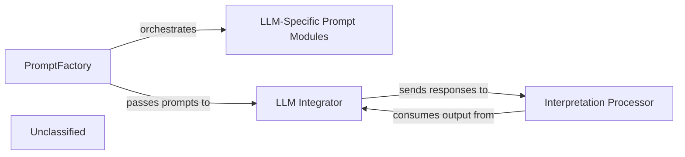
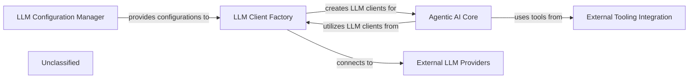
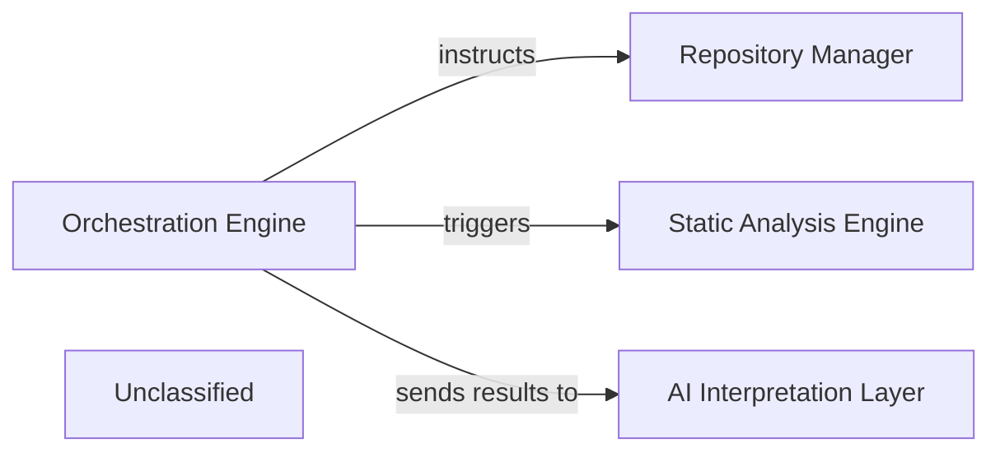
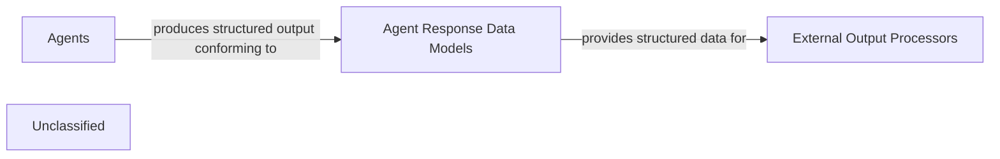
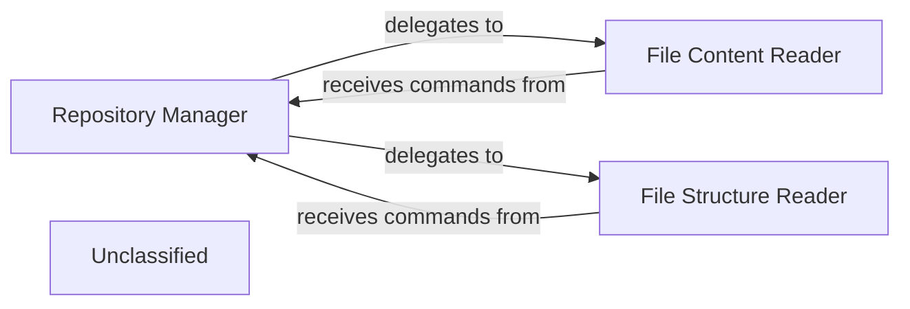
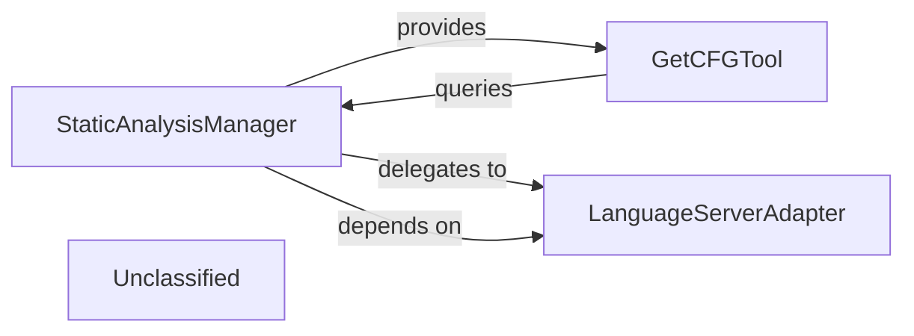
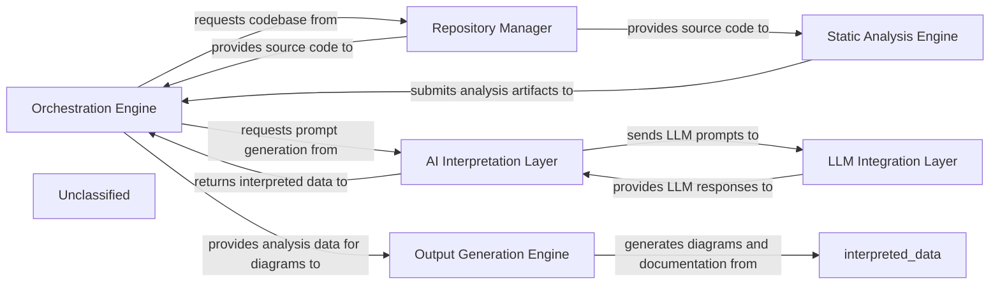

## Details

The system initiates by leveraging the PromptFactory to dynamically generate prompts, which are then specialized by LLM-Specific Prompt Modules to suit the chosen LLM. The LLM Integrator configures and manages the connection to the external LLM service, sending the prepared prompts. Upon receiving responses, the Interpretation Processor, embodied by various agents, processes and interprets the LLM's output, driving the subsequent analytical or operational tasks within the system. The architecture is centered around an intelligent agent system that dynamically interacts with various Large Language Models (LLMs). The PromptFactory and its LLM-Specific Prompt Modules form the core of prompt generation, ensuring adaptability across different LLM providers. The LLM Integrator acts as the crucial interface for external LLM communication, handling configuration and API interactions. Finally, the Interpretation Processor, represented by the Agent and MetaAgent components, is responsible for making sense of the LLM responses, driving the system's analytical and operational capabilities. This modular design allows for flexible integration of new LLMs and prompt strategies, while maintaining a clear separation of concerns for prompt management, LLM interaction, and response interpretation.

### PromptFactory
The primary component for generating and managing prompts. It dynamically constructs prompts tailored to specific LLMs and analysis tasks, incorporating static analysis data and contextual information. This component is crucial for the adaptability of the system to different LLM providers and varying analysis requirements.

**Related Classes/Methods**:

- <a href="https://github.com/CodeBoarding/CodeBoarding/blob/main/.codeboardingagents/prompts/prompt_factory.py" target="_blank" rel="noopener noreferrer">`agents.prompts.prompt_factory.PromptFactory`</a>

### LLM-Specific Prompt Modules
Specializes in creating and managing prompt segments or full prompts for particular LLM providers (e.g., Claude, OpenAI, Google). These modules handle the nuances of each LLM's input format, token limits, and specific prompting strategies (e.g., bidirectional for conversational flows).

**Related Classes/Methods**:

- <a href="https://github.com/CodeBoarding/CodeBoarding/blob/main/.codeboardingagents/prompts/claude_prompts_bidirectional.py" target="_blank" rel="noopener noreferrer">`agents.prompts.claude_prompts_bidirectional.ClaudeBidirectionalPromptFactory`</a>

### LLM Integrator
This component is responsible for configuring and managing the interaction with various external LLM services. It handles the setup of LLM models and their specific parameters, acting as the bridge between the application and the LLM providers.

**Related Classes/Methods**:

- <a href="https://github.com/CodeBoarding/CodeBoarding/blob/main/.codeboardingagents/llm_config.py" target="_blank" rel="noopener noreferrer">`agents.llm_config`</a>

### Interpretation Processor
This component is responsible for processing and interpreting the responses received from the LLMs. It encompasses the logic for agents that utilize LLM outputs to perform specific tasks, such as analysis, planning, or validation, and orchestrates the overall flow of information within the agent system.

**Related Classes/Methods**:

- <a href="https://github.com/CodeBoarding/CodeBoarding/blob/main/.codeboardingagents/agent.py" target="_blank" rel="noopener noreferrer">`agents.agent.Agent`</a>
- <a href="https://github.com/CodeBoarding/CodeBoarding/blob/main/.codeboardingagents/meta_agent.py" target="_blank" rel="noopener noreferrer">`agents.meta_agent.MetaAgent`</a>

### Unclassified
Component for all unclassified files and utility functions (Utility functions/External Libraries/Dependencies)

**Related Classes/Methods**: _None_

### [FAQ](https://github.com/CodeBoarding/GeneratedOnBoardings/tree/main?tab=readme-ov-file#faq)

## Details

The `agents` subsystem forms the intelligent core of the project, orchestrating AI-driven code analysis through a modular architecture. It begins with the **LLM Configuration Manager**, which centralizes the setup for various Large Language Model providers. This configuration is then consumed by the **LLM Client Factory**, responsible for dynamically instantiating LLM clients tailored for both general interactions and structured data extraction. These clients are the primary interface for the **Agentic AI Core**, a collection of specialized agents (e.g., Abstraction, Details, Planner) that perform the actual code analysis by interacting with the LLMs. To gather necessary context from the codebase, the **Agentic AI Core** integrates with **External Tooling Integration**, a suite of tools for reading files, analyzing dependencies, and retrieving source code. Ultimately, the **LLM Client Factory** establishes connections with **External LLM Providers**, facilitating the communication with services like OpenAI, Google, and Anthropic to execute AI tasks. This layered approach ensures flexibility, maintainability, and efficient utilization of AI capabilities for comprehensive code understanding.

### LLM Configuration Manager
Responsible for loading, validating, and providing LLM configurations, including API keys, model names, and provider-specific settings.

**Related Classes/Methods**:

- <a href="https://github.com/CodeBoarding/CodeBoarding/blob/main/.codeboardingagents/llm_config.py#L29-L92" target="_blank" rel="noopener noreferrer">`agents.llm_config.LLMConfig`:29-92</a>
- <a href="https://github.com/CodeBoarding/CodeBoarding/blob/main/.codeboardingagents/llm_config.py" target="_blank" rel="noopener noreferrer">`agents.llm_config.LLM_PROVIDERS`</a>
- <a href="https://github.com/CodeBoarding/CodeBoarding/blob/main/.codeboardingagents/llm_config.py#L20-L26" target="_blank" rel="noopener noreferrer">`agents.llm_config.InstructorProvider`:20-26</a>

### LLM Client Factory
Manages the creation and instantiation of LLM clients (both for general chat and structured output via `instructor`) based on the active configuration. It abstracts the complexities of different LLM APIs.

**Related Classes/Methods**:

- <a href="https://github.com/CodeBoarding/CodeBoarding/blob/main/.codeboardingagents/llm_config.py#L199-L205" target="_blank" rel="noopener noreferrer">`agents.llm_config.create_instructor_client_from_env`:199-205</a>
- <a href="https://github.com/CodeBoarding/CodeBoarding/blob/main/.codeboardingagents/llm_config.py#L208-L229" target="_blank" rel="noopener noreferrer">`agents.llm_config.create_llm_from_env`:208-229</a>
- <a href="https://github.com/CodeBoarding/CodeBoarding/blob/main/.codeboardingagents/llm_config.py" target="_blank" rel="noopener noreferrer">`agents.llm_config.LLMConfig.create_instructor_client`</a>

### Agentic AI Core
Contains the core logic for various AI agents that interact with LLMs to perform tasks like code abstraction, detail analysis, planning, and validation. These agents interpret LLM responses and drive the overall analysis process.

**Related Classes/Methods**:

- <a href="https://github.com/CodeBoarding/CodeBoarding/blob/main/.codeboardingagents/abstraction_agent.py" target="_blank" rel="noopener noreferrer">`agents.abstraction_agent.AbstractionAgent`</a>
- <a href="https://github.com/CodeBoarding/CodeBoarding/blob/main/.codeboardingagents/details_agent.py" target="_blank" rel="noopener noreferrer">`agents.details_agent.DetailsAgent`</a>
- <a href="https://github.com/CodeBoarding/CodeBoarding/blob/main/.codeboardingagents/planner_agent.py" target="_blank" rel="noopener noreferrer">`agents.planner_agent.PlannerAgent`</a>
- <a href="https://github.com/CodeBoarding/CodeBoarding/blob/main/.codeboardingagents/validator_agent.py" target="_blank" rel="noopener noreferrer">`agents.validator_agent.ValidatorAgent`</a>
- <a href="https://github.com/CodeBoarding/CodeBoarding/blob/main/.codeboardingagents/meta_agent.py" target="_blank" rel="noopener noreferrer">`agents.meta_agent.MetaAgent`</a>

### External Tooling Integration
Provides a set of tools that agents can use to interact with the repository, such as reading files, analyzing dependencies, and retrieving source code.

**Related Classes/Methods**:

- <a href="https://github.com/CodeBoarding/CodeBoarding/blob/main/.codeboardingagents/tools/external_deps.py" target="_blank" rel="noopener noreferrer">`agents.tools.external_deps.ExternalDepsTool`</a>
- <a href="https://github.com/CodeBoarding/CodeBoarding/blob/main/.codeboardingagents/tools/read_file.py" target="_blank" rel="noopener noreferrer">`agents.tools.read_file.ReadFileTool`</a>
- <a href="https://github.com/CodeBoarding/CodeBoarding/blob/main/.codeboardingagents/tools/read_source.py" target="_blank" rel="noopener noreferrer">`agents.tools.read_source.ReadSourceTool`</a>

### External LLM Providers
Represents various external Large Language Model services (e.g., OpenAI, Anthropic, Google, AWS Bedrock, Ollama, Cerebras) that are integrated and consumed by the system. These are defined and configured within the `LLM_PROVIDERS` dictionary.

**Related Classes/Methods**:

- <a href="https://github.com/CodeBoarding/CodeBoarding/blob/main/.codeboardingagents/llm_config.py#L20-L26" target="_blank" rel="noopener noreferrer">`agents.llm_config.InstructorProvider`:20-26</a>
- <a href="https://github.com/CodeBoarding/CodeBoarding/blob/main/.codeboardingagents/llm_config.py" target="_blank" rel="noopener noreferrer">`agents.llm_config.LLM_PROVIDERS`</a>

### Unclassified
Component for all unclassified files and utility functions (Utility functions/External Libraries/Dependencies)

**Related Classes/Methods**: _None_

### [FAQ](https://github.com/CodeBoarding/GeneratedOnBoardings/tree/main?tab=readme-ov-file#faq)

## Details

The system is orchestrated by the Orchestration Engine, which serves as the central control for the entire analysis and documentation generation workflow. It directs the Repository Manager to handle code repository interactions, ensuring the necessary source code is available. For code quality and structural insights, the Orchestration Engine triggers the Static Analysis Engine to perform detailed code analysis. The results from these processes are then forwarded by the Orchestration Engine to the AI Interpretation Layer, which processes and interprets the data, potentially leveraging AI models, to generate comprehensive documentation and insights. This architecture ensures a streamlined flow from code acquisition and analysis to intelligent interpretation and output generation.

### Orchestration Engine [[Expand]](./Orchestration_Engine.md)
The central coordinator of the analysis and documentation generation pipeline.

**Related Classes/Methods**:

- <a href="https://github.com/CodeBoarding/CodeBoarding/blob/main/.codeboardingagents/__init__.py" target="_blank" rel="noopener noreferrer">`agents`</a>

### Repository Manager [[Expand]](./Repository_Manager.md)
Manages interactions with code repositories.

**Related Classes/Methods**:

- <a href="https://github.com/CodeBoarding/CodeBoarding/blob/main/.codeboardingrepo_utils/__init__.py" target="_blank" rel="noopener noreferrer">`repo_utils`</a>

### Static Analysis Engine [[Expand]](./Static_Analysis_Engine.md)
Performs static code analysis.

**Related Classes/Methods**:

- <a href="https://github.com/CodeBoarding/CodeBoarding/blob/main/.codeboardingstatic_analyzer/__init__.py" target="_blank" rel="noopener noreferrer">`static_analyzer`</a>

### AI Interpretation Layer [[Expand]](./AI_Interpretation_Layer.md)
Processes and interprets data, potentially using AI models, to generate meaningful outputs.

**Related Classes/Methods**:

- <a href="https://github.com/CodeBoarding/CodeBoarding/blob/main/.codeboardingoutput_generators/__init__.py" target="_blank" rel="noopener noreferrer">`output_generators`</a>

### Unclassified
Component for all unclassified files and utility functions (Utility functions/External Libraries/Dependencies)

**Related Classes/Methods**: _None_

### [FAQ](https://github.com/CodeBoarding/GeneratedOnBoardings/tree/main?tab=readme-ov-file#faq)

## Details

The `agents` subsystem is a core analytical component, where various specialized agents perform static analysis and generate insights. These insights are meticulously structured using the `Agent Response Data Models`, which define a standardized schema for representing complex information such as source code references, inter-component relationships, and comprehensive analysis summaries. This structured output ensures consistency and facilitates seamless integration with downstream processes, enabling the generation of detailed documentation and visual architectural diagrams. The `Agent Response Data Models` act as a crucial interface, ensuring that the raw analytical output from the agents is transformed into a consumable format for higher-level output generation functionalities.

### Agent Response Data Models
This component defines the standardized data structures and schemas used by various agents to encapsulate their analysis results, insights, and references. It includes models for source code references, inter-component relationships, and overall analysis summaries, facilitating consistent data representation for subsequent processing and output generation.

**Related Classes/Methods**:

- <a href="https://github.com/CodeBoarding/CodeBoarding/blob/main/.codeboardingagents/agent_responses.py" target="_blank" rel="noopener noreferrer">`agents.agent_responses.LLMBaseModel`</a>
- <a href="https://github.com/CodeBoarding/CodeBoarding/blob/main/.codeboardingagents/agent_responses.py" target="_blank" rel="noopener noreferrer">`agents.agent_responses.SourceCodeReference`</a>
- <a href="https://github.com/CodeBoarding/CodeBoarding/blob/main/.codeboardingagents/agent_responses.py" target="_blank" rel="noopener noreferrer">`agents.agent_responses.Relation`</a>
- <a href="https://github.com/CodeBoarding/CodeBoarding/blob/main/.codeboardingagents/agent_responses.py" target="_blank" rel="noopener noreferrer">`agents.agent_responses.Component`</a>
- <a href="https://github.com/CodeBoarding/CodeBoarding/blob/main/.codeboardingagents/agent_responses.py" target="_blank" rel="noopener noreferrer">`agents.agent_responses.AnalysisInsights`</a>
- <a href="https://github.com/CodeBoarding/CodeBoarding/blob/main/.codeboardingagents/agent_responses.py" target="_blank" rel="noopener noreferrer">`agents.agent_responses.CFGComponent`</a>
- <a href="https://github.com/CodeBoarding/CodeBoarding/blob/main/.codeboardingagents/agent_responses.py" target="_blank" rel="noopener noreferrer">`agents.agent_responses.CFGAnalysisInsights`</a>
- <a href="https://github.com/CodeBoarding/CodeBoarding/blob/main/.codeboardingagents/agent_responses.py" target="_blank" rel="noopener noreferrer">`agents.agent_responses.ValidationInsights`</a>
- <a href="https://github.com/CodeBoarding/CodeBoarding/blob/main/.codeboardingagents/agent_responses.py" target="_blank" rel="noopener noreferrer">`agents.agent_responses.UpdateAnalysis`</a>

### Agents
The `agents` subsystem is a core analytical component, where various specialized agents perform static analysis and generate insights.

**Related Classes/Methods**:

- <a href="https://github.com/CodeBoarding/CodeBoarding/blob/main/.codeboardingagents/__init__.py" target="_blank" rel="noopener noreferrer">`agents`</a>

### External Output Processors
External components (e.g., documentation generators, diagram renderers) that consume and transform structured data into human-readable documentation and visual representations.

**Related Classes/Methods**:

- `external_output_processors`

### Unclassified
Component for all unclassified files and utility functions (Utility functions/External Libraries/Dependencies)

**Related Classes/Methods**: _None_

### [FAQ](https://github.com/CodeBoarding/GeneratedOnBoardings/tree/main?tab=readme-ov-file#faq)

## Details

The Repository Manager subsystem is responsible for managing all interactions with code repositories, encompassing fetching source code and handling file system access. It acts as the primary interface for the project to retrieve and navigate the codebase under analysis. Within this subsystem, the File Content Reader and File Structure Reader are specialized tools that perform distinct but complementary functions. The Repository Manager itself acts as the coordinating entity, routing requests to the appropriate reader component. Both reader components directly interface with the underlying file system to fulfill their responsibilities, providing the foundational data necessary for the broader code analysis and documentation generation process.

### Repository Manager [[Expand]](./Repository_Manager.md)
Orchestrates and abstracts all file system and repository interactions, ensuring efficient and controlled access to project code and structure. It acts as a facade for external components needing repository data.

**Related Classes/Methods**:

- <a href="https://github.com/CodeBoarding/CodeBoarding/blob/main/.codeboardingagents/tools/read_file.py" target="_blank" rel="noopener noreferrer">`File Content Reader`</a>
- <a href="https://github.com/CodeBoarding/CodeBoarding/blob/main/.codeboardingagents/tools/read_file_structure.py" target="_blank" rel="noopener noreferrer">`File Structure Reader`</a>

### File Content Reader
This component is dedicated to retrieving the raw content of individual files from the code repository. It serves as the direct access point for obtaining the textual data of source code files.

**Related Classes/Methods**:

- <a href="https://github.com/CodeBoarding/CodeBoarding/blob/main/.codeboardingagents/tools/read_file.py" target="_blank" rel="noopener noreferrer">`File Content Reader`</a>

### File Structure Reader
This component is responsible for providing a hierarchical representation of the repository's file system. It enables the system to understand the project's layout, including directories and files, which is crucial for contextual analysis and navigation.

**Related Classes/Methods**:

- <a href="https://github.com/CodeBoarding/CodeBoarding/blob/main/.codeboardingagents/tools/read_file_structure.py" target="_blank" rel="noopener noreferrer">`File Structure Reader`</a>

### Unclassified
Component for all unclassified files and utility functions (Utility functions/External Libraries/Dependencies)

**Related Classes/Methods**: _None_

### [FAQ](https://github.com/CodeBoarding/GeneratedOnBoardings/tree/main?tab=readme-ov-file#faq)

## Details

The Static Analysis Engine subsystem is a critical part of the "Code Analysis and Documentation Generation Tool," focusing on extracting deep structural, control flow, and semantic information from source code. It operates as a modular unit, providing essential data to other components of the larger system.

### StaticAnalysisManager
This is the orchestrator of the entire static analysis process within the subsystem. It coordinates the analysis workflow, manages the interaction with language-specific parsers, and is responsible for storing and providing the generated analysis data, such as Control Flow Graphs (CFGs). It embodies the "Orchestration Engine" pattern for this specific domain.

**Related Classes/Methods**:

- <a href="https://github.com/CodeBoarding/CodeBoarding/blob/main/.codeboardingstatic_analyzer/scanner.py#L13-L85" target="_blank" rel="noopener noreferrer">`StaticAnalysisManager`:13-85</a>

### GetCFGTool
This component acts as the primary interface for other parts of the system to access the static analysis results, specifically Control Flow Graphs. It queries the `StaticAnalysisManager` to retrieve CFG data, filters it for component-specific information, and formats it for external consumption. It serves as an internal "API Service" for analysis data.

**Related Classes/Methods**:

- <a href="https://github.com/CodeBoarding/CodeBoarding/blob/main/.codeboardingagents/tools/read_cfg.py" target="_blank" rel="noopener noreferrer">`GetCFGTool`</a>

### LanguageServerAdapter
This component is responsible for abstracting and managing interactions with various external Language Servers. It handles language-specific parsing and analysis tasks, translating requests from the `StaticAnalysisManager` into calls to the appropriate language tools and processing their responses. This aligns with the "External Service Integration" pattern.

**Related Classes/Methods**:

- <a href="https://github.com/CodeBoarding/CodeBoarding/blob/main/.codeboardingstatic_analyzer/lsp_client/client.py#L59-L94" target="_blank" rel="noopener noreferrer">`LanguageServerAdapter`:59-94</a>

### Unclassified
Component for all unclassified files and utility functions (Utility functions/External Libraries/Dependencies)

**Related Classes/Methods**: _None_

### [FAQ](https://github.com/CodeBoarding/GeneratedOnBoardings/tree/main?tab=readme-ov-file#faq)

## Details

The CodeBoarding project operates through a sophisticated multi-component architecture designed for automated code analysis and documentation generation. At its core, the Orchestration Engine acts as the central control unit, managing the entire workflow from initial code ingestion to final output. It delegates tasks to specialized components: the Repository Manager handles all interactions with the codebase, providing raw source files and structural information. The Static Analysis Engine then processes this code to extract critical structural and control flow data. This analyzed data, along with user queries, is fed into the AI Interpretation Layer, which dynamically crafts prompts for various Large Language Models (LLMs). The LLM Integration Layer facilitates secure communication with these external LLMs, retrieving their responses. These responses are then processed by the AI Interpretation Layer and returned to the Orchestration Engine. Finally, the Output Generation Engine takes the interpreted data and analysis artifacts to produce comprehensive documentation, including diagrams, ensuring a cohesive and informative output.

### Orchestration Engine [[Expand]](./Orchestration_Engine.md)
The central coordinator managing the entire code analysis and documentation generation workflow, orchestrating tasks and data flow.

**Related Classes/Methods**:

- <a href="https://github.com/CodeBoarding/CodeBoarding/blob/main/.codeboardingagents/agent.py" target="_blank" rel="noopener noreferrer">`agents.agent`</a>
- <a href="https://github.com/CodeBoarding/CodeBoarding/blob/main/.codeboardingagents/meta_agent.py" target="_blank" rel="noopener noreferrer">`agents.meta_agent`</a>

### Repository Manager [[Expand]](./Repository_Manager.md)
Handles all interactions with code repositories, including fetching source code and managing file system access.

**Related Classes/Methods**:

- <a href="https://github.com/CodeBoarding/CodeBoarding/blob/main/.codeboardingagents/tools/read_file.py" target="_blank" rel="noopener noreferrer">`agents.tools.read_file`</a>
- <a href="https://github.com/CodeBoarding/CodeBoarding/blob/main/.codeboardingagents/tools/read_file_structure.py" target="_blank" rel="noopener noreferrer">`agents.tools.read_file_structure`</a>

### Static Analysis Engine [[Expand]](./Static_Analysis_Engine.md)
Performs in-depth static analysis on source code to extract structural, control flow, and semantic information.

**Related Classes/Methods**:

- <a href="https://github.com/CodeBoarding/CodeBoarding/blob/main/.codeboardingagents/tools/read_cfg.py" target="_blank" rel="noopener noreferrer">`agents.tools.read_cfg`</a>

### AI Interpretation Layer [[Expand]](./AI_Interpretation_Layer.md)
Dynamically constructs and manages prompts tailored for various Large Language Models (LLMs) and specific analysis tasks.

**Related Classes/Methods**:

- <a href="https://github.com/CodeBoarding/CodeBoarding/blob/main/.codeboardingagents/prompts/prompt_factory.py" target="_blank" rel="noopener noreferrer">`agents.prompts.prompt_factory`</a>
- <a href="https://github.com/CodeBoarding/CodeBoarding/blob/main/.codeboardingagents/prompts/claude_prompts_bidirectional.py" target="_blank" rel="noopener noreferrer">`agents.prompts.claude_prompts_bidirectional`</a>

### LLM Integration Layer [[Expand]](./LLM_Integration_Layer.md)
Manages secure and efficient communication with various external Large Language Model providers.

**Related Classes/Methods**:

- <a href="https://github.com/CodeBoarding/CodeBoarding/blob/main/.codeboardingagents/llm_config.py" target="_blank" rel="noopener noreferrer">`agents.llm_config`</a>
- <a href="https://github.com/CodeBoarding/CodeBoarding/blob/main/.codeboardingagents/tools/external_deps.py" target="_blank" rel="noopener noreferrer">`agents.tools.external_deps`</a>

### Output Generation Engine [[Expand]](./Output_Generation_Engine.md)
Formats and produces the final documentation, reports, or other output artifacts based on processed analysis and LLM interpretations, including the generation of diagrams.

**Related Classes/Methods**:

- <a href="https://github.com/CodeBoarding/CodeBoarding/blob/main/.codeboardingagents/agent_responses.py" target="_blank" rel="noopener noreferrer">`agents.agent_responses`</a>

### Unclassified
Component for all unclassified files and utility functions (Utility functions/External Libraries/Dependencies)

**Related Classes/Methods**: _None_

### [FAQ](https://github.com/CodeBoarding/GeneratedOnBoardings/tree/main?tab=readme-ov-file#faq)

