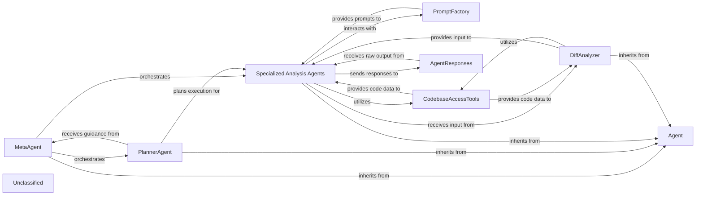
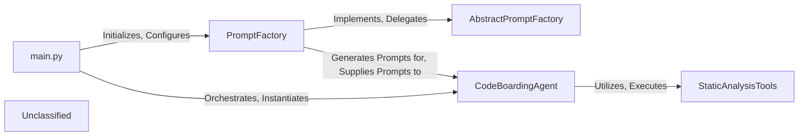
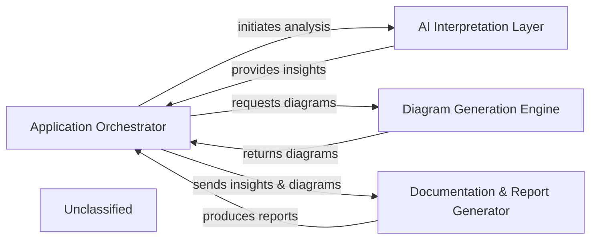
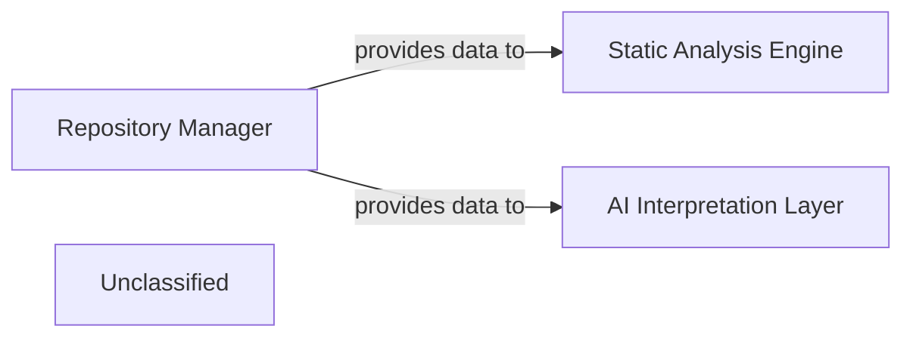
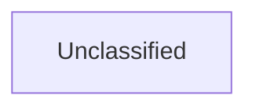

```mermaid
graph LR
    CLI_and_Environment_Setup["CLI and Environment Setup"]
    Repository_Acquisition_Management["Repository Acquisition & Management"]
    Static_Analysis_Orchestrator["Static Analysis Orchestrator"]
    Documentation_Generation_Orchestrator["Documentation Generation Orchestrator"]
    Output_Publication_Cleanup["Output Publication & Cleanup"]
    Unclassified["Unclassified"]
    CLI_and_Environment_Setup -- "provides configuration to" --> Repository_Acquisition_Management
    CLI_and_Environment_Setup -- "provides configuration to" --> Static_Analysis_Orchestrator
    Repository_Acquisition_Management -- "receives configuration from" --> CLI_and_Environment_Setup
    Repository_Acquisition_Management -- "invokes" --> Static_Analysis_Orchestrator
    Repository_Acquisition_Management -- "invokes" --> Documentation_Generation_Orchestrator
    Repository_Acquisition_Management -- "calls" --> Output_Publication_Cleanup
    Static_Analysis_Orchestrator -- "receives codebase from" --> Repository_Acquisition_Management
    Static_Analysis_Orchestrator -- "produces AnalysisInsights for" --> Documentation_Generation_Orchestrator
    Documentation_Generation_Orchestrator -- "receives AnalysisInsights from" --> Static_Analysis_Orchestrator
    Documentation_Generation_Orchestrator -- "produces markdown files for" --> Output_Publication_Cleanup
    Output_Publication_Cleanup -- "receives files from" --> Documentation_Generation_Orchestrator
    Output_Publication_Cleanup -- "receives upload instructions from" --> Repository_Acquisition_Management
```

```mermaid
graph LR
    Application_Orchestrator["Application Orchestrator"]
    Analysis_Diagram_Generator["Analysis & Diagram Generator"]
    Code_Analysis_Agent["Code Analysis Agent"]
    LLM_Provider_Manager["LLM Provider Manager"]
    External_LLM_Integrations["External LLM Integrations"]
    Unclassified["Unclassified"]
    Application_Orchestrator -- "initiates analysis workflow" --> Analysis_Diagram_Generator
    Application_Orchestrator -- "manages output of" --> Analysis_Diagram_Generator
    Analysis_Diagram_Generator -- "configures and invokes analysis" --> Code_Analysis_Agent
    Code_Analysis_Agent -- "requests LLM client" --> LLM_Provider_Manager
    LLM_Provider_Manager -- "instantiates and configures LLM client" --> External_LLM_Integrations
    Code_Analysis_Agent -- "sends prompts and receives responses" --> External_LLM_Integrations
    Analysis_Diagram_Generator -- "returns analysis results" --> Application_Orchestrator
    click Application_Orchestrator href "https://github.com/CodeBoarding/CodeBoarding/blob/main/.codeboarding/Application_Orchestrator.md" "Details"
```

```mermaid
graph LR
    Application_Orchestrator["Application Orchestrator"]
    Repository_Manager["Repository Manager"]
    Static_Analysis_Engine["Static Analysis Engine"]
    LLM_Prompt_Factory["LLM Prompt Factory"]
    LLM_Provider_Gateway["LLM Provider Gateway"]
    AI_Interpretation_Layer["AI Interpretation Layer"]
    Output_Generation_Engine["Output Generation Engine"]
    Unclassified["Unclassified"]
    User_External_Systems -- "Initiates Request" --> Application_Orchestrator
    Application_Orchestrator -- "Manages Repository Access" --> Repository_Manager
    Application_Orchestrator -- "Triggers Analysis" --> AI_Interpretation_Layer
    Application_Orchestrator -- "Coordinates Documentation Generation" --> Output_Generation_Engine
    Repository_Manager -- "Provides Source Code" --> Static_Analysis_Engine
    Static_Analysis_Engine -- "Delivers Analysis Data" --> AI_Interpretation_Layer
    AI_Interpretation_Layer -- "Requests Formatted Prompts" --> LLM_Prompt_Factory
    LLM_Prompt_Factory -- "Returns Formatted Prompts" --> AI_Interpretation_Layer
    AI_Interpretation_Layer -- "Sends LLM Queries" --> LLM_Provider_Gateway
    LLM_Provider_Gateway -- "Returns LLM Responses" --> AI_Interpretation_Layer
    AI_Interpretation_Layer -- "Provides Architectural Insights" --> Output_Generation_Engine
    Output_Generation_Engine -- "Delivers Documentation & Diagrams" --> User_External_Systems
    click Application_Orchestrator href "https://github.com/CodeBoarding/CodeBoarding/blob/main/.codeboarding/Application_Orchestrator.md" "Details"
    click Repository_Manager href "https://github.com/CodeBoarding/CodeBoarding/blob/main/.codeboarding/Repository_Manager.md" "Details"
    click Static_Analysis_Engine href "https://github.com/CodeBoarding/CodeBoarding/blob/main/.codeboarding/Static_Analysis_Engine.md" "Details"
    click LLM_Prompt_Factory href "https://github.com/CodeBoarding/CodeBoarding/blob/main/.codeboarding/LLM_Prompt_Factory.md" "Details"
    click LLM_Provider_Gateway href "https://github.com/CodeBoarding/CodeBoarding/blob/main/.codeboarding/LLM_Provider_Gateway.md" "Details"
    click AI_Interpretation_Layer href "https://github.com/CodeBoarding/CodeBoarding/blob/main/.codeboarding/AI_Interpretation_Layer.md" "Details"
    click Output_Generation_Engine href "https://github.com/CodeBoarding/CodeBoarding/blob/main/.codeboarding/Output_Generation_Engine.md" "Details"
```

## Details

The AI Interpretation Layer is the core intelligence component responsible for orchestrating AI-driven analysis, interpreting LLM responses, and deriving architectural insights. It is primarily composed of various agents and their supporting utilities, all residing within the `agents` directory.

### Agent
The foundational component, defining the base interface and common functionalities for all specialized agents, acting as the core orchestrator for individual AI-driven analysis tasks.

**Related Classes/Methods**:

- <a href="https://github.com/CodeBoarding/CodeBoarding/blob/main/.codeboardingagents/agent.py" target="_blank" rel="noopener noreferrer">`Agent`</a>

### MetaAgent
Responsible for higher-level orchestration and coordination of multiple specialized agents, guiding the overall analysis workflow. It acts as the primary entry point for initiating complex analysis tasks.

**Related Classes/Methods**:

- <a href="https://github.com/CodeBoarding/CodeBoarding/blob/main/.codeboardingagents/meta_agent.py" target="_blank" rel="noopener noreferrer">`MetaAgent`</a>

### PlannerAgent
Determines the strategic sequence of analysis steps and the specific agents to be invoked based on the analysis goals, effectively creating an execution plan.

**Related Classes/Methods**:

- <a href="https://github.com/CodeBoarding/CodeBoarding/blob/main/.codeboardingagents/planner_agent.py" target="_blank" rel="noopener noreferrer">`PlannerAgent`</a>

### Specialized Analysis Agents
A group of agents (AbstractionAgent, DetailsAgent, ValidatorAgent) that perform specific AI-driven analysis tasks: identifying high-level architectural concepts, delving into granular code details, and verifying insights against architectural principles.

**Related Classes/Methods**:

- <a href="https://github.com/CodeBoarding/CodeBoarding/blob/main/.codeboardingagents/abstraction_agent.py" target="_blank" rel="noopener noreferrer">`AbstractionAgent`</a>
- <a href="https://github.com/CodeBoarding/CodeBoarding/blob/main/.codeboardingagents/details_agent.py" target="_blank" rel="noopener noreferrer">`DetailsAgent`</a>
- <a href="https://github.com/CodeBoarding/CodeBoarding/blob/main/.codeboardingagents/validator_agent.py" target="_blank" rel="noopener noreferrer">`ValidatorAgent`</a>

### DiffAnalyzer
Analyzes code differences (e.g., from Git commits) to provide targeted input for agents, enabling incremental analysis and integration with CI/CD pipelines.

**Related Classes/Methods**:

- <a href="https://github.com/CodeBoarding/CodeBoarding/blob/main/.codeboardingagents/diff_analyzer.py" target="_blank" rel="noopener noreferrer">`DiffAnalyzer`</a>

### PromptFactory
Manages the dynamic generation and selection of appropriate prompts for interacting with various Large Language Models (LLMs), adapting to different LLM providers and analysis contexts.

**Related Classes/Methods**:

- <a href="https://github.com/CodeBoarding/CodeBoarding/blob/main/.codeboardingagents/prompts/prompt_factory.py" target="_blank" rel="noopener noreferrer">`PromptFactory`</a>

### CodebaseAccessTools
Provides agents with the capability to programmatically access and interpret different aspects of the codebase, including source code, Control Flow Graphs, and file structures.

**Related Classes/Methods**:

- <a href="https://github.com/CodeBoarding/CodeBoarding/blob/main/.codeboardingagents/tools/read_source.py" target="_blank" rel="noopener noreferrer">`read_source`</a>
- <a href="https://github.com/CodeBoarding/CodeBoarding/blob/main/.codeboardingagents/tools/read_cfg.py" target="_blank" rel="noopener noreferrer">`read_cfg`</a>
- <a href="https://github.com/CodeBoarding/CodeBoarding/blob/main/.codeboardingagents/tools/read_file_structure.py" target="_blank" rel="noopener noreferrer">`read_file_structure`</a>

### AgentResponses
Handles the structured parsing, interpretation, and transformation of raw LLM outputs into actionable architectural insights or data structures.

**Related Classes/Methods**:

- <a href="https://github.com/CodeBoarding/CodeBoarding/blob/main/.codeboardingagents/agent_responses.py" target="_blank" rel="noopener noreferrer">`AgentResponses`</a>

### Unclassified
Component for all unclassified files and utility functions (Utility functions/External Libraries/Dependencies)

**Related Classes/Methods**: _None_

### [FAQ](https://github.com/CodeBoarding/GeneratedOnBoardings/tree/main?tab=readme-ov-file#faq)

## Details

The CodeBoarding application is designed to automate the generation of onboarding documentation for both local and remote Git repositories. It operates by first setting up the command-line interface and validating environment variables. Subsequently, it acquires and manages the specified code repositories, either by cloning remote ones or processing local paths. The core functionality involves orchestrating static code analysis to extract insights, which are then used to generate comprehensive markdown documentation. Finally, the generated outputs are published to a designated directory, with an option to upload them to a remote repository, followed by the cleanup of temporary resources. This modular design ensures a clear separation of concerns, facilitating maintainability and extensibility.

### CLI and Environment Setup
This component is responsible for defining, parsing, and validating command-line arguments and ensuring that all necessary environment variables (e.g., API keys) are correctly configured before the main application logic proceeds.

**Related Classes/Methods**:

- <a href="https://github.com/CodeBoarding/CodeBoarding/blob/main/.codeboardingmain.py#L296-L337" target="_blank" rel="noopener noreferrer">`main.define_cli_arguments`:296-337</a>
- <a href="https://github.com/CodeBoarding/CodeBoarding/blob/main/.codeboardingmain.py#L273-L293" target="_blank" rel="noopener noreferrer">`main.validate_arguments`:273-293</a>
- <a href="https://github.com/CodeBoarding/CodeBoarding/blob/main/.codeboardingmain.py#L24-L41" target="_blank" rel="noopener noreferrer">`main.validate_env_vars`:24-41</a>
- <a href="https://github.com/CodeBoarding/CodeBoarding/blob/main/.codeboarding." target="_blank" rel="noopener noreferrer">`os.getenv`</a>

### Repository Acquisition & Management
Manages the entire lifecycle of code repositories, including cloning remote repositories, setting up and tearing down temporary working directories, and checking for the existence of previously generated documentation. It orchestrates both remote and local repository processing flows.

**Related Classes/Methods**:

- <a href="https://github.com/CodeBoarding/CodeBoarding/blob/main/.codeboardingmain.py#L162-L216" target="_blank" rel="noopener noreferrer">`main.process_remote_repository`:162-216</a>
- <a href="https://github.com/CodeBoarding/CodeBoarding/blob/main/.codeboardingmain.py#L219-L247" target="_blank" rel="noopener noreferrer">`main.process_local_repository`:219-247</a>
- <a href="https://github.com/CodeBoarding/CodeBoarding/blob/main/.codeboardingmain.py#L44-L50" target="_blank" rel="noopener noreferrer">`main.onboarding_materials_exist`:44-50</a>
- <a href="https://github.com/CodeBoarding/CodeBoarding/blob/main/.codeboardingrepo_utils/__init__.py#L87-L91" target="_blank" rel="noopener noreferrer">`repo_utils.get_repo_name`:87-91</a>
- <a href="https://github.com/CodeBoarding/CodeBoarding/blob/main/.codeboardingrepo_utils/__init__.py#L94-L111" target="_blank" rel="noopener noreferrer">`repo_utils.clone_repository`:94-111</a>
- <a href="https://github.com/CodeBoarding/CodeBoarding/blob/main/.codeboarding." target="_blank" rel="noopener noreferrer">`repo_utils.get_branch`</a>
- <a href="https://github.com/CodeBoarding/CodeBoarding/blob/main/.codeboardingutils.py#L18-L22" target="_blank" rel="noopener noreferrer">`utils.create_temp_repo_folder`:18-22</a>
- <a href="https://github.com/CodeBoarding/CodeBoarding/blob/main/.codeboardingutils.py#L25-L29" target="_blank" rel="noopener noreferrer">`utils.remove_temp_repo_folder`:25-29</a>
- <a href="https://github.com/CodeBoarding/CodeBoarding/blob/main/.codeboarding." target="_blank" rel="noopener noreferrer">`requests`</a>

### Static Analysis Orchestrator
This component initiates and manages the static code analysis process. It delegates the actual analysis tasks to the `DiagramGenerator` and handles scenarios for both initial full analysis and subsequent partial updates of specific components.

**Related Classes/Methods**:

- <a href="https://github.com/CodeBoarding/CodeBoarding/blob/main/.codeboardingmain.py#L53-L66" target="_blank" rel="noopener noreferrer">`main.generate_analysis`:53-66</a>
- <a href="https://github.com/CodeBoarding/CodeBoarding/blob/main/.codeboardingmain.py#L99-L146" target="_blank" rel="noopener noreferrer">`main.partial_update`:99-146</a>
- <a href="https://github.com/CodeBoarding/CodeBoarding/blob/main/.codeboardingdiagram_analysis/diagram_generator.py#L34-L293" target="_blank" rel="noopener noreferrer">`diagram_analysis.DiagramGenerator`:34-293</a>
- <a href="https://github.com/CodeBoarding/CodeBoarding/blob/main/.codeboardingagents/agent_responses.py" target="_blank" rel="noopener noreferrer">`agents.agent_responses.AnalysisInsights`</a>

### Documentation Generation Orchestrator
Responsible for transforming the structured insights obtained from the static analysis into user-friendly markdown documentation. It coordinates the generation of individual markdown files based on the analysis results.

**Related Classes/Methods**:

- <a href="https://github.com/CodeBoarding/CodeBoarding/blob/main/.codeboardingmain.py#L69-L96" target="_blank" rel="noopener noreferrer">`main.generate_markdown_docs`:69-96</a>
- <a href="https://github.com/CodeBoarding/CodeBoarding/blob/main/.codeboardingoutput_generators/markdown.py" target="_blank" rel="noopener noreferrer">`output_generators.markdown.generate_markdown_file`</a>
- <a href="https://github.com/CodeBoarding/CodeBoarding/blob/main/.codeboarding." target="_blank" rel="noopener noreferrer">`repo_utils.get_branch`</a>

### Output Publication & Cleanup
Manages the final stages of the workflow, including copying all generated markdown and JSON files from temporary locations to the designated output directory and, if applicable, uploading the generated onboarding materials to a remote destination. It also handles the cleanup of temporary resources.

**Related Classes/Methods**:

- <a href="https://github.com/CodeBoarding/CodeBoarding/blob/main/.codeboardingmain.py#L250-L270" target="_blank" rel="noopener noreferrer">`main.copy_files`:250-270</a>
- <a href="https://github.com/CodeBoarding/CodeBoarding/blob/main/.codeboarding." target="_blank" rel="noopener noreferrer">`shutil.copy2`</a>
- <a href="https://github.com/CodeBoarding/CodeBoarding/blob/main/.codeboardingrepo_utils/__init__.py#L135-L162" target="_blank" rel="noopener noreferrer">`repo_utils.upload_onboarding_materials`:135-162</a>
- <a href="https://github.com/CodeBoarding/CodeBoarding/blob/main/.codeboardingutils.py#L25-L29" target="_blank" rel="noopener noreferrer">`utils.remove_temp_repo_folder`:25-29</a>

### Unclassified
Component for all unclassified files and utility functions (Utility functions/External Libraries/Dependencies)

**Related Classes/Methods**: _None_

### [FAQ](https://github.com/CodeBoarding/GeneratedOnBoardings/tree/main?tab=readme-ov-file#faq)

## Details

The application's architecture is centered around an AI-driven code analysis pipeline. The `main.py` component initiates the process, responsible for setting up the environment and orchestrating the core components. It initializes the `PromptFactory`, which serves as the primary orchestrator for dynamically generating and formatting LLM-optimized prompts. These prompts are then consumed by the `CodeBoardingAgent`, the central intelligence component. The `CodeBoardingAgent` leverages an `LLM` for interpretation and generation, and a suite of `StaticAnalysisTools` to gather comprehensive information about the codebase. The `AbstractPromptFactory` defines the contract for prompt generation, ensuring modularity and extensibility within the prompt generation mechanism. This design allows for a flexible and extensible system where prompt generation is decoupled from the agent's core logic, enabling dynamic adaptation to various analysis tasks and LLM types, forming the core of the "AI Interpretation Layer."

### main.py
The central orchestrator responsible for initializing the PromptFactory and managing the CodeBoardingAgent.

**Related Classes/Methods**:

- <a href="https://github.com/CodeBoarding/CodeBoarding/blob/main/.codeboardingmain.py#L340-L431" target="_blank" rel="noopener noreferrer">`main`:340-431</a>

### PromptFactory
Primary orchestrator for dynamically generating and formatting LLM-optimized prompts.

**Related Classes/Methods**:

- <a href="https://github.com/CodeBoarding/CodeBoarding/blob/main/.codeboardingagents/prompts/prompt_factory.py" target="_blank" rel="noopener noreferrer">`PromptFactory`</a>

### AbstractPromptFactory
Defines the interface and contract for prompt generation, ensuring consistency and extensibility.

**Related Classes/Methods**:

- <a href="https://github.com/CodeBoarding/CodeBoarding/blob/main/.codeboardingagents/prompts/abstract_prompt_factory.py" target="_blank" rel="noopener noreferrer">`AbstractPromptFactory`</a>

### CodeBoardingAgent
The central intelligence component that interacts with the LLM, executes tools, and processes information to perform static code analysis and generate insights.

**Related Classes/Methods**:

- <a href="https://github.com/CodeBoarding/CodeBoarding/blob/main/.codeboardingagents/agent.py" target="_blank" rel="noopener noreferrer">`CodeBoardingAgent`</a>

### StaticAnalysisTools
A collection of specialized tools (e.g., CodeReferenceReader, GetCFGTool, FileStructureTool) used by the CodeBoardingAgent to gather information about the codebase.

**Related Classes/Methods**:

- <a href="https://github.com/CodeBoarding/CodeBoarding/blob/main/.codeboardingagents/tools/read_source.py#L26-L114" target="_blank" rel="noopener noreferrer">`CodeReferenceReader`:26-114</a>
- <a href="https://github.com/CodeBoarding/CodeBoarding/blob/main/.codeboardingagents/tools/read_cfg.py#L11-L68" target="_blank" rel="noopener noreferrer">`GetCFGTool`:11-68</a>
- <a href="https://github.com/CodeBoarding/CodeBoarding/blob/main/.codeboardingagents/tools/read_file_structure.py#L21-L126" target="_blank" rel="noopener noreferrer">`FileStructureTool`:21-126</a>

### Unclassified
Component for all unclassified files and utility functions (Utility functions/External Libraries/Dependencies)

**Related Classes/Methods**: _None_

### [FAQ](https://github.com/CodeBoarding/GeneratedOnBoardings/tree/main?tab=readme-ov-file#faq)

## Details

The system's architecture is driven by the Application Orchestrator, which manages the end-to-end process of generating architectural documentation from code repositories. It delegates the core analysis tasks to the Analysis & Diagram Generator, which in turn configures and invokes the Code Analysis Agent. This agent, the intelligent core, performs detailed code understanding and interacts with various Large Language Models through the LLM Provider Manager. The LLM Provider Manager dynamically selects and initializes specific External LLM Integrations, enabling the agent to send prompts and receive responses from different LLM services. Finally, the analysis results are returned to the Application Orchestrator for documentation generation and output. This layered approach ensures modularity, flexibility in LLM integration, and a clear separation of concerns across the system.

### Application Orchestrator [[Expand]](./Application_Orchestrator.md)
The central control point of the application, responsible for managing the overall workflow from input (remote/local repositories) to output (analysis and documentation). It handles argument parsing, environment setup, repository cloning, and the high-level coordination of analysis and documentation generation.

**Related Classes/Methods**:

- <a href="https://github.com/CodeBoarding/CodeBoarding/blob/main/.codeboardingmain.py" target="_blank" rel="noopener noreferrer">`main:process_remote_repository`</a>
- <a href="https://github.com/CodeBoarding/CodeBoarding/blob/main/.codeboardingmain.py" target="_blank" rel="noopener noreferrer">`main:process_local_repository`</a>
- <a href="https://github.com/CodeBoarding/CodeBoarding/blob/main/.codeboardingmain.py" target="_blank" rel="noopener noreferrer">`main:generate_analysis`</a>
- <a href="https://github.com/CodeBoarding/CodeBoarding/blob/main/.codeboardingmain.py" target="_blank" rel="noopener noreferrer">`main:generate_markdown_docs`</a>

### Analysis & Diagram Generator
This component orchestrates the static analysis of the codebase and the generation of architectural diagrams and insights. It acts as an interface between the Application Orchestrator and the Code Analysis Agent, preparing the context and processing the results for documentation.

**Related Classes/Methods**:

- <a href="https://github.com/CodeBoarding/CodeBoarding/blob/main/.codeboardingdiagram_analysis/diagram_generator.py#L34-L293" target="_blank" rel="noopener noreferrer">`diagram_analysis.DiagramGenerator`:34-293</a>

### Code Analysis Agent
The intelligent core responsible for understanding the codebase, performing static analysis, and generating architectural insights. It leverages various internal tools and interacts with external LLMs to fulfill its analysis tasks.

**Related Classes/Methods**:

- <a href="https://github.com/CodeBoarding/CodeBoarding/blob/main/.codeboardingagents/agent.py" target="_blank" rel="noopener noreferrer">`agents.agent.CodeBoardingAgent`</a>

### LLM Provider Manager
Manages the dynamic selection and initialization of different Large Language Model clients. It abstracts the complexities of integrating with various LLM providers, allowing the Code Analysis Agent to interact with a unified interface.

**Related Classes/Methods**:

- <a href="https://github.com/CodeBoarding/CodeBoarding/blob/main/.codeboardingagents/agent.py" target="_blank" rel="noopener noreferrer">`agents.agent.CodeBoardingAgent:_initialize_llm`</a>

### External LLM Integrations
Concrete implementations that provide the interface to specific external Large Language Models (e.g., OpenAI, Anthropic, Google Gemini). Each integration handles the unique API calls, authentication, and data formatting required for its respective LLM.

**Related Classes/Methods**:

- `langchain_openai.ChatOpenAI`
- `langchain_anthropic.ChatAnthropic`
- `langchain_google_genai.ChatGoogleGenerativeAI`

### Unclassified
Component for all unclassified files and utility functions (Utility functions/External Libraries/Dependencies)

**Related Classes/Methods**: _None_

### [FAQ](https://github.com/CodeBoarding/GeneratedOnBoardings/tree/main?tab=readme-ov-file#faq)

## Details

The system operates through a centralized Application Orchestrator that manages the end-to-end process of architectural analysis and documentation. It initiates the AI Interpretation Layer to extract insights from the codebase. These insights are then used by the Diagram Generation Engine to create visual representations. Finally, both the insights and diagrams are passed to the Documentation & Report Generator to produce comprehensive, human-readable outputs. This orchestration ensures a streamlined flow from code analysis to final documentation and diagram generation.

### Application Orchestrator [[Expand]](./Application_Orchestrator.md)
Manages the overall application lifecycle, coordinating the execution and data flow between the AI Interpretation Layer, Diagram Generation Engine, and Documentation & Report Generator. It acts as the central control point, initiating processes and integrating results.

**Related Classes/Methods**:

- <a href="https://github.com/CodeBoarding/CodeBoarding/blob/main/.codeboardingmain.py" target="_blank" rel="noopener noreferrer">`main.py`</a>

### AI Interpretation Layer [[Expand]](./AI_Interpretation_Layer.md)
Analyzes the codebase to extract structured architectural insights and understanding. It serves as the primary intelligence source for the system.

**Related Classes/Methods**:

- <a href="https://github.com/CodeBoarding/CodeBoarding/blob/main/.codeboardingagents/agent.py" target="_blank" rel="noopener noreferrer">`agents.agent`</a>

### Diagram Generation Engine
Generates visual architectural diagrams from the structured insights provided by the AI Interpretation Layer, often utilizing external rendering tools.

**Related Classes/Methods**:

- <a href="https://github.com/CodeBoarding/CodeBoarding/blob/main/.codeboardingdiagram_analysis/diagram_generator.py" target="_blank" rel="noopener noreferrer">`diagram_analysis.diagram_generator`</a>

### Documentation & Report Generator
Compiles architectural insights and generated diagrams into comprehensive, human-readable documentation and reports in various formats.

**Related Classes/Methods**:

- <a href="https://github.com/CodeBoarding/CodeBoarding/blob/main/.codeboardingoutput_generators/markdown.py" target="_blank" rel="noopener noreferrer">`output_generators.markdown`</a>
- <a href="https://github.com/CodeBoarding/CodeBoarding/blob/main/.codeboardingoutput_generators/html.py" target="_blank" rel="noopener noreferrer">`output_generators.html`</a>
- <a href="https://github.com/CodeBoarding/CodeBoarding/blob/main/.codeboardingoutput_generators/mdx.py" target="_blank" rel="noopener noreferrer">`output_generators.mdx`</a>
- <a href="https://github.com/CodeBoarding/CodeBoarding/blob/main/.codeboardingoutput_generators/sphinx.py" target="_blank" rel="noopener noreferrer">`output_generators.sphinx`</a>

### Unclassified
Component for all unclassified files and utility functions (Utility functions/External Libraries/Dependencies)

**Related Classes/Methods**: _None_

### [FAQ](https://github.com/CodeBoarding/GeneratedOnBoardings/tree/main?tab=readme-ov-file#faq)

## Details

The core of this code analysis system revolves around the Repository Manager, which serves as the primary interface for all code repository operations. It is responsible for cloning, managing, and providing access to local copies of code from Remote Git Services, storing them on the Local File System. The raw code and repository data managed by the Repository Manager are then fed into two subsequent processing stages: the Static Analysis Engine, which performs automated code analysis, and the AI Interpretation Layer, which applies advanced AI/ML models for deeper insights. This architecture ensures a clear separation of concerns, with the Repository Manager handling all source code acquisition and management, enabling other components to focus on analysis and interpretation.

### Repository Manager [[Expand]](./Repository_Manager.md)
Manages the local copies of code repositories, provides access to raw source code content, facilitates navigation within the repository's file system, and handles Git-specific operations, including diff generation. It acts as the primary interface for all repository-related data and operations, feeding raw code to subsequent analysis stages. This component is fundamental for a code analysis tool, providing the essential input data.

**Related Classes/Methods**:

- <a href="https://github.com/CodeBoarding/CodeBoarding/blob/main/.codeboardingrepo_utils/__init__.py" target="_blank" rel="noopener noreferrer">`repo_utils`</a>
- <a href="https://github.com/CodeBoarding/CodeBoarding/blob/main/.codeboardingrepo_utils/git_diff.py" target="_blank" rel="noopener noreferrer">`repo_utils.git_diff`</a>
- <a href="https://github.com/CodeBoarding/CodeBoarding/blob/main/.codeboardingrepo_utils/errors.py" target="_blank" rel="noopener noreferrer">`repo_utils.errors`</a>

### Static Analysis Engine [[Expand]](./Static_Analysis_Engine.md)
This component is responsible for performing various static code analyses on the source code provided by the Repository Manager. It identifies patterns, potential issues, and extracts structural information without executing the code.

**Related Classes/Methods**:

- `StaticAnalysisEngine.conceptual_interface`:1-10

### AI Interpretation Layer [[Expand]](./AI_Interpretation_Layer.md)
This component consumes the output from the Static Analysis Engine and potentially raw code from the Repository Manager to apply AI/ML models for deeper understanding, code summarization, or vulnerability prediction.

**Related Classes/Methods**:

- `AIInterpretationLayer.conceptual_interface`

### Unclassified
Component for all unclassified files and utility functions (Utility functions/External Libraries/Dependencies)

**Related Classes/Methods**: _None_

### [FAQ](https://github.com/CodeBoarding/GeneratedOnBoardings/tree/main?tab=readme-ov-file#faq)

## Details

The user has indicated a significant architectural shift due to changes in `main.py` and `agents/agent.py`. The original analysis identified `Data Normalizer/Formatter` as the central orchestration component. However, the feedback suggests `main.py` now plays a more critical role in orchestration, and `agents/agent.py` introduces a new functional module. To address this, I need to understand the new orchestration logic in `main.py`, identify the purpose and interactions of the new module in `agents/agent.py`, re-evaluate the role of the `Data Normalizer/Formatter` in light of these changes, and update component relationships to reflect the new architecture. I will start by examining the content of `main.py` to understand its orchestration responsibilities. Then, I will investigate `agents/agent.py`.

### Unclassified
Component for all unclassified files and utility functions (Utility functions/External Libraries/Dependencies)

**Related Classes/Methods**: _None_

### [FAQ](https://github.com/CodeBoarding/GeneratedOnBoardings/tree/main?tab=readme-ov-file#faq)

## Details

The system operates with the Application Orchestrator as its central control, initiated by User/External Systems. This orchestrator first interacts with the Repository Manager to access the target codebase. The core intelligence resides within the AI Interpretation Layer, which is triggered by the orchestrator to perform architectural analysis. This layer leverages the Static Analysis Engine for structural code data and dynamically generates prompts via the LLM Prompt Factory before querying external LLM Provider Gateway for insights. Once architectural insights are derived, the Output Generation Engine transforms these into consumable documentation and diagrams, which are then delivered back to User/External Systems. The orchestrator also directly coordinates with the Output Generation Engine for the final documentation output.

### Application Orchestrator [[Expand]](./Application_Orchestrator.md)
The central control unit that manages the overall execution flow, handling repository input, orchestrating analysis, and coordinating documentation generation. It serves as the main entry point for the application.

**Related Classes/Methods**:

- <a href="https://github.com/CodeBoarding/CodeBoarding/blob/main/.codeboardingmain.py" target="_blank" rel="noopener noreferrer">`main.py`</a>

### Repository Manager [[Expand]](./Repository_Manager.md)
Manages all interactions with code repositories, including cloning, reading files, and navigating the project structure. It provides the raw source code for analysis.

**Related Classes/Methods**:

- <a href="https://github.com/CodeBoarding/CodeBoarding/blob/main/.codeboardingrepo_utils/__init__.py" target="_blank" rel="noopener noreferrer">`repo_utils/__init__.py`</a>
- <a href="https://github.com/CodeBoarding/CodeBoarding/blob/main/.codeboardingrepo_utils/git_diff.py" target="_blank" rel="noopener noreferrer">`repo_utils/git_diff.py`</a>

### Static Analysis Engine [[Expand]](./Static_Analysis_Engine.md)
Performs in-depth static analysis on the codebase to extract structural information, control flow graphs (CFG), abstract syntax trees (AST), and dependencies.

**Related Classes/Methods**:

- <a href="https://github.com/CodeBoarding/CodeBoarding/blob/main/.codeboardingstatic_analyzer/__init__.py" target="_blank" rel="noopener noreferrer">`static_analyzer/__init__.py`</a>
- <a href="https://github.com/CodeBoarding/CodeBoarding/blob/main/.codeboardingstatic_analyzer/scanner.py" target="_blank" rel="noopener noreferrer">`static_analyzer/scanner.py`</a>
- <a href="https://github.com/CodeBoarding/CodeBoarding/blob/main/.codeboardingstatic_analyzer/graph.py" target="_blank" rel="noopener noreferrer">`static_analyzer/graph.py`</a>

### LLM Prompt Factory [[Expand]](./LLM_Prompt_Factory.md)
Dynamically generates and formats prompts tailored for various Large Language Models (LLMs) and specific analysis tasks.

**Related Classes/Methods**:

- <a href="https://github.com/CodeBoarding/CodeBoarding/blob/main/.codeboardingagents/prompts/__init__.py" target="_blank" rel="noopener noreferrer">`agents/prompts/__init__.py`</a>
- <a href="https://github.com/CodeBoarding/CodeBoarding/blob/main/.codeboardingagents/prompts/prompt_factory.py" target="_blank" rel="noopener noreferrer">`agents/prompts/prompt_factory.py`</a>
- <a href="https://github.com/CodeBoarding/CodeBoarding/blob/main/.codeboardingagents/prompts/abstract_prompt_factory.py" target="_blank" rel="noopener noreferrer">`agents/prompts/abstract_prompt_factory.py`</a>

### LLM Provider Gateway [[Expand]](./LLM_Provider_Gateway.md)
Manages communication and interaction with external Large Language Model (LLM) providers, handling API calls and model selection.

**Related Classes/Methods**:

- <a href="https://github.com/CodeBoarding/CodeBoarding/blob/main/.codeboardingagents/prompts/claude_prompts_bidirectional.py" target="_blank" rel="noopener noreferrer">`agents/prompts/claude_prompts_bidirectional.py`</a>
- <a href="https://github.com/CodeBoarding/CodeBoarding/blob/main/.codeboardingagents/prompts/gpt_prompts_unidirectional.py" target="_blank" rel="noopener noreferrer">`agents/prompts/gpt_prompts_unidirectional.py`</a>
- <a href="https://github.com/CodeBoarding/CodeBoarding/blob/main/.codeboardingagents/prompts/gemini_flash_prompts_bidirectional.py" target="_blank" rel="noopener noreferrer">`agents/prompts/gemini_flash_prompts_bidirectional.py`</a>

### AI Interpretation Layer [[Expand]](./AI_Interpretation_Layer.md)
The core intelligence component that orchestrates AI-driven analysis, interprets LLM responses, and derives architectural insights. This layer utilizes various agents to perform its tasks, with agents/agent.py being central to its logic.

**Related Classes/Methods**:

- <a href="https://github.com/CodeBoarding/CodeBoarding/blob/main/.codeboardingagents/__init__.py" target="_blank" rel="noopener noreferrer">`agents/__init__.py`</a>
- <a href="https://github.com/CodeBoarding/CodeBoarding/blob/main/.codeboardingagents/agent.py" target="_blank" rel="noopener noreferrer">`agents/agent.py`</a>
- <a href="https://github.com/CodeBoarding/CodeBoarding/blob/main/.codeboardingagents/meta_agent.py" target="_blank" rel="noopener noreferrer">`agents/meta_agent.py`</a>
- <a href="https://github.com/CodeBoarding/CodeBoarding/blob/main/.codeboardingagents/abstraction_agent.py" target="_blank" rel="noopener noreferrer">`agents/abstraction_agent.py`</a>
- <a href="https://github.com/CodeBoarding/CodeBoarding/blob/main/.codeboardingagents/details_agent.py" target="_blank" rel="noopener noreferrer">`agents/details_agent.py`</a>
- <a href="https://github.com/CodeBoarding/CodeBoarding/blob/main/.codeboardingagents/planner_agent.py" target="_blank" rel="noopener noreferrer">`agents/planner_agent.py`</a>
- <a href="https://github.com/CodeBoarding/CodeBoarding/blob/main/.codeboardingagents/validator_agent.py" target="_blank" rel="noopener noreferrer">`agents/validator_agent.py`</a>

### Output Generation Engine [[Expand]](./Output_Generation_Engine.md)
Transforms architectural insights into various consumable formats, including human-readable documentation and visual diagrams.

**Related Classes/Methods**:

- <a href="https://github.com/CodeBoarding/CodeBoarding/blob/main/.codeboardingoutput_generators/__init__.py" target="_blank" rel="noopener noreferrer">`output_generators/__init__.py`</a>
- <a href="https://github.com/CodeBoarding/CodeBoarding/blob/main/.codeboardingoutput_generators/markdown.py" target="_blank" rel="noopener noreferrer">`output_generators/markdown.py`</a>
- <a href="https://github.com/CodeBoarding/CodeBoarding/blob/main/.codeboardingoutput_generators/html.py" target="_blank" rel="noopener noreferrer">`output_generators/html.py`</a>
- <a href="https://github.com/CodeBoarding/CodeBoarding/blob/main/.codeboardingdiagram_analysis/__init__.py" target="_blank" rel="noopener noreferrer">`diagram_analysis/__init__.py`</a>
- <a href="https://github.com/CodeBoarding/CodeBoarding/blob/main/.codeboardingdiagram_analysis/diagram_generator.py" target="_blank" rel="noopener noreferrer">`diagram_analysis/diagram_generator.py`</a>

### Unclassified
Component for all unclassified files and utility functions (Utility functions/External Libraries/Dependencies)

**Related Classes/Methods**: _None_

### [FAQ](https://github.com/CodeBoarding/GeneratedOnBoardings/tree/main?tab=readme-ov-file#faq)

