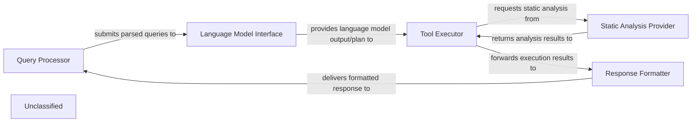
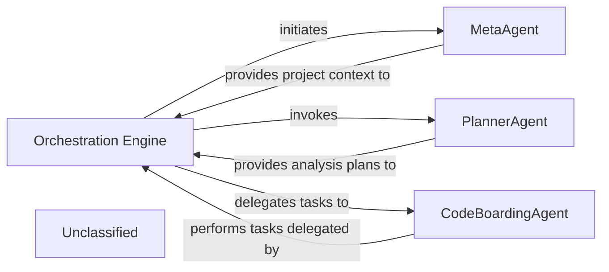
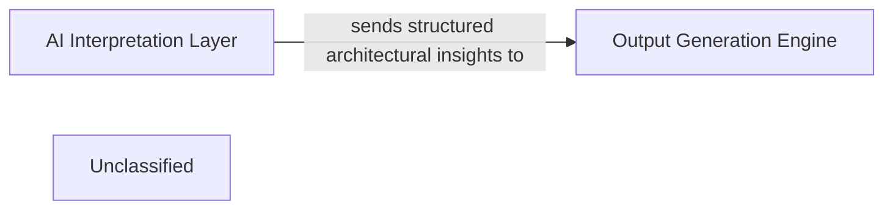
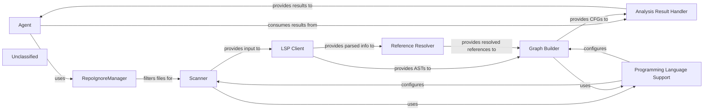

```mermaid
graph LR
    API_Service["API Service"]
    Orchestration_Engine["Orchestration Engine"]
    Repository_Manager["Repository Manager"]
    Static_Analysis_Engine["Static Analysis Engine"]
    AI_Interpretation_Layer["AI Interpretation Layer"]
    Job_Database["Job Database"]
    Diagram_Generation_Service["Diagram Generation Service"]
    Output_Generation_Engine["Output Generation Engine"]
    Unclassified["Unclassified"]
    API_Service -- "initiates requests to" --> Orchestration_Engine
    Orchestration_Engine -- "coordinates tasks with" --> Repository_Manager
    Orchestration_Engine -- "coordinates tasks with" --> Static_Analysis_Engine
    Orchestration_Engine -- "coordinates tasks with" --> AI_Interpretation_Layer
    Orchestration_Engine -- "coordinates tasks with" --> Diagram_Generation_Service
    Orchestration_Engine -- "coordinates tasks with" --> Output_Generation_Engine
    Orchestration_Engine -- "updates and retrieves job status from" --> Job_Database
    Repository_Manager -- "provides source code to" --> Static_Analysis_Engine
    Static_Analysis_Engine -- "provides analysis data to" --> AI_Interpretation_Layer
    Static_Analysis_Engine -- "provides analysis data to" --> Diagram_Generation_Service
    AI_Interpretation_Layer -- "provides architectural insights to" --> Diagram_Generation_Service
    AI_Interpretation_Layer -- "provides architectural insights to" --> Output_Generation_Engine
    Diagram_Generation_Service -- "provides visual diagrams to" --> Output_Generation_Engine
    Output_Generation_Engine -- "receives data from" --> AI_Interpretation_Layer
    Output_Generation_Engine -- "receives data from" --> Diagram_Generation_Service
    click Orchestration_Engine href "https://github.com/CodeBoarding/CodeBoarding/blob/main/.codeboarding/Orchestration_Engine.md" "Details"
    click Static_Analysis_Engine href "https://github.com/CodeBoarding/CodeBoarding/blob/main/.codeboarding/Static_Analysis_Engine.md" "Details"
    click Diagram_Generation_Service href "https://github.com/CodeBoarding/CodeBoarding/blob/main/.codeboarding/Diagram_Generation_Service.md" "Details"
    click Output_Generation_Engine href "https://github.com/CodeBoarding/CodeBoarding/blob/main/.codeboarding/Output_Generation_Engine.md" "Details"
```

```mermaid
graph LR
    Orchestration_Engine["Orchestration Engine"]
    Static_Analysis_Engine["Static Analysis Engine"]
    AI_Processing_Layer["AI Processing Layer"]
    Output_Generation_Engine["Output Generation Engine"]
    Diagram_Generation_Service["Diagram Generation Service"]
    Unclassified["Unclassified"]
    Unclassified["Unclassified"]
    Orchestration_Engine -- "delegates tasks to" --> Static_Analysis_Engine
    Static_Analysis_Engine -- "provides enhanced structured code to" --> Orchestration_Engine
    Orchestration_Engine -- "orchestrates" --> AI_Processing_Layer
    AI_Processing_Layer -- "provides validated architectural insights to" --> Output_Generation_Engine
    Output_Generation_Engine -- "generates diagram data for" --> Diagram_Generation_Service
    click Orchestration_Engine href "https://github.com/CodeBoarding/CodeBoarding/blob/main/.codeboarding/Orchestration_Engine.md" "Details"
    click Static_Analysis_Engine href "https://github.com/CodeBoarding/CodeBoarding/blob/main/.codeboarding/Static_Analysis_Engine.md" "Details"
    click AI_Processing_Layer href "https://github.com/CodeBoarding/CodeBoarding/blob/main/.codeboarding/AI_Processing_Layer.md" "Details"
    click Output_Generation_Engine href "https://github.com/CodeBoarding/CodeBoarding/blob/main/.codeboarding/Output_Generation_Engine.md" "Details"
    click Diagram_Generation_Service href "https://github.com/CodeBoarding/CodeBoarding/blob/main/.codeboarding/Diagram_Generation_Service.md" "Details"
```

## Details

The system processes user queries through a structured flow, leveraging a language model and specialized tools, with static analysis capabilities. The Query Processor initiates the interaction, passing parsed queries to the Language Model Interface. The language model's output then guides the Tool Executor, which orchestrates tool usage, potentially consulting the Static Analysis Provider for validation or information. Finally, the Response Formatter synthesizes all outputs into a coherent response, delivered back via the Query Processor.

### Query Processor
Manages initial user query parsing, validation, and serves as the system's entry and exit point.

**Related Classes/Methods**:

### Language Model Interface
Handles all communication with the underlying language model, sending prompts and receiving generated responses.

**Related Classes/Methods**:

- `LanguageModelInterface`

### Tool Executor
Orchestrates the execution of tools, making decisions based on language model outputs, performing validation, and integrating static analysis.

**Related Classes/Methods**:

### Static Analysis Provider
Provides static analysis and code reference resolution services, primarily to support the Tool Executor.

**Related Classes/Methods**:

- `StaticAnalysisProvider`:1-10

### Response Formatter
Combines language model outputs and tool execution results to construct and format the final response for the user.

**Related Classes/Methods**:

- `ResponseFormatter`

### Unclassified
Component for all unclassified files and utility functions (Utility functions/External Libraries/Dependencies)

**Related Classes/Methods**: _None_

### [FAQ](https://github.com/CodeBoarding/GeneratedOnBoardings/tree/main?tab=readme-ov-file#faq)

## Details

The CodeBoarding project provides an automated system for generating architectural documentation and diagrams from source code. The API Service acts as the entry point, receiving requests for repository analysis. The Orchestration Engine then takes charge, coordinating the entire workflow. It first utilizes the Repository Manager to clone the target repository, which then feeds the source code to the Static Analysis Engine for initial structural analysis. The raw analysis data is then passed to the AI Interpretation Layer, a suite of intelligent agents that leverage Large Language Models to derive high-level architectural insights and contextual understanding. Concurrently, the Job Database maintains the state and results of ongoing and completed analysis jobs. Once architectural insights are generated, the Diagram Generation Service transforms this data into visual representations. Finally, the Output Generation Engine compiles all insights, diagrams, and raw analysis into comprehensive documentation in various formats.

### API Service
Serves as the primary external interface, handling all incoming requests and acting as the entry point for users or other systems to initiate code analysis and documentation generation tasks.

**Related Classes/Methods**:

- <a href="https://github.com/CodeBoarding/CodeBoarding/blob/main/.codeboardingmain.py#L176-L234" target="_blank" rel="noopener noreferrer">`main.process_remote_repository`:176-234</a>
- <a href="https://github.com/CodeBoarding/CodeBoarding/blob/main/.codeboardingmain.py#L237-L267" target="_blank" rel="noopener noreferrer">`main.process_local_repository`:237-267</a>

### Orchestration Engine [[Expand]](./Orchestration_Engine.md)
The central coordinator of the entire analysis pipeline. It manages the workflow, dispatches tasks to other components, monitors their progress, and ensures the sequential or parallel execution of analysis steps.

**Related Classes/Methods**:

- <a href="https://github.com/CodeBoarding/CodeBoarding/blob/main/.codeboardingdiagram_analysis/diagram_generator.py" target="_blank" rel="noopener noreferrer">`diagram_analysis.diagram_generator.DiagramGenerator`</a>

### Repository Manager
Responsible for interacting with code repositories. It handles tasks such as cloning, fetching, and managing access to the source code that needs to be analyzed.

**Related Classes/Methods**:

- <a href="https://github.com/CodeBoarding/CodeBoarding/blob/main/.codeboardingrepo_utils/__init__.py" target="_blank" rel="noopener noreferrer">`repo_utils.clone_repository`</a>

### Static Analysis Engine [[Expand]](./Static_Analysis_Engine.md)
Performs initial, rule-based analysis of the source code. It identifies structural patterns, dependencies, and other static properties without executing the code, providing foundational data for further interpretation.

**Related Classes/Methods**:

- <a href="https://github.com/CodeBoarding/CodeBoarding/blob/main/.codeboardingstatic_analyzer/scanner.py#L13-L85" target="_blank" rel="noopener noreferrer">`static_analyzer.scanner.ProjectScanner`:13-85</a>

### AI Interpretation Layer
Leverages Large Language Models (LLMs) to derive higher-level architectural insights and contextual understanding from the raw static analysis data. It translates technical details into human-readable explanations and identifies architectural patterns.

**Related Classes/Methods**:

- <a href="https://github.com/CodeBoarding/CodeBoarding/blob/main/.codeboardingagents/meta_agent.py" target="_blank" rel="noopener noreferrer">`agents.meta_agent.MetaAgent`</a>
- <a href="https://github.com/CodeBoarding/CodeBoarding/blob/main/.codeboardingagents/abstraction_agent.py" target="_blank" rel="noopener noreferrer">`agents.abstraction_agent.AbstractionAgent`</a>
- <a href="https://github.com/CodeBoarding/CodeBoarding/blob/main/.codeboardingagents/details_agent.py" target="_blank" rel="noopener noreferrer">`agents.details_agent.DetailsAgent`</a>
- <a href="https://github.com/CodeBoarding/CodeBoarding/blob/main/.codeboardingagents/planner_agent.py" target="_blank" rel="noopener noreferrer">`agents.planner_agent.PlannerAgent`</a>
- <a href="https://github.com/CodeBoarding/CodeBoarding/blob/main/.codeboardingagents/validator_agent.py" target="_blank" rel="noopener noreferrer">`agents.validator_agent.ValidatorAgent`</a>
- <a href="https://github.com/CodeBoarding/CodeBoarding/blob/main/.codeboardingagents/diff_analyzer.py" target="_blank" rel="noopener noreferrer">`agents.diff_analyzer.DiffAnalyzingAgent`</a>

### Job Database
Persistently stores information related to ongoing and completed analysis jobs, including their status, configuration, intermediate results, and final outputs. It ensures data integrity and allows for job tracking and retrieval.

**Related Classes/Methods**:

- <a href="https://github.com/CodeBoarding/CodeBoarding/blob/main/.codeboardingduckdb_crud.py#L16-L45" target="_blank" rel="noopener noreferrer">`duckdb_crud.init_db`:16-45</a>
- <a href="https://github.com/CodeBoarding/CodeBoarding/blob/main/.codeboardingduckdb_crud.py#L49-L65" target="_blank" rel="noopener noreferrer">`duckdb_crud.insert_job`:49-65</a>
- <a href="https://github.com/CodeBoarding/CodeBoarding/blob/main/.codeboardingduckdb_crud.py#L68-L77" target="_blank" rel="noopener noreferrer">`duckdb_crud.update_job`:68-77</a>
- <a href="https://github.com/CodeBoarding/CodeBoarding/blob/main/.codeboardingduckdb_crud.py#L80-L99" target="_blank" rel="noopener noreferrer">`duckdb_crud.fetch_job`:80-99</a>
- <a href="https://github.com/CodeBoarding/CodeBoarding/blob/main/.codeboardingduckdb_crud.py#L102-L124" target="_blank" rel="noopener noreferrer">`duckdb_crud.fetch_all_jobs`:102-124</a>

### Diagram Generation Service [[Expand]](./Diagram_Generation_Service.md)
Specializes in converting structured architectural data (from static analysis and AI interpretation) into visual diagrams, potentially using tools like Mermaid.js. It enhances comprehension by providing interactive and visual representations of the analyzed architecture.

**Related Classes/Methods**:

- <a href="https://github.com/CodeBoarding/CodeBoarding/blob/main/.codeboardingdiagram_analysis/diagram_generator.py#L199-L298" target="_blank" rel="noopener noreferrer">`diagram_analysis.diagram_generator.DiagramGenerator.generate_analysis`:199-298</a>

### Output Generation Engine [[Expand]](./Output_Generation_Engine.md)
Compiles all analysis results, AI interpretations, and generated diagrams into various final output formats (e.g., Markdown, HTML, PDF). It is responsible for formatting and presenting the comprehensive documentation.

**Related Classes/Methods**:

- <a href="https://github.com/CodeBoarding/CodeBoarding/blob/main/.codeboardingoutput_generators/markdown.py#L104-L117" target="_blank" rel="noopener noreferrer">`output_generators.markdown.generate_markdown_file`:104-117</a>
- <a href="https://github.com/CodeBoarding/CodeBoarding/blob/main/.codeboardingoutput_generators/markdown.py#L44-L101" target="_blank" rel="noopener noreferrer">`output_generators.markdown.generate_markdown`:44-101</a>

### Unclassified
Component for all unclassified files and utility functions (Utility functions/External Libraries/Dependencies)

**Related Classes/Methods**: _None_

### [FAQ](https://github.com/CodeBoarding/GeneratedOnBoardings/tree/main?tab=readme-ov-file#faq)

## Details

The CodeBoarding system is orchestrated by the `Orchestration Engine`, which acts as the central control unit for the entire code analysis and documentation generation pipeline. It initiates the process by interacting with the `MetaAgent` to gather architectural context and project metadata. Subsequently, it invokes the `PlannerAgent` to generate a structured plan for analyzing various components of the codebase. The `Orchestration Engine` then delegates specific analysis and execution tasks to the `CodeBoardingAgent`, which serves as a foundational worker agent. The `CodeBoardingAgent` provides core capabilities such as interacting with Large Language Models (LLMs), accessing various tools for reading source code, file structures, and Control Flow Graphs (CFGs), and handling robust invocation mechanisms with error handling. This collaborative interaction between the `Orchestration Engine` and its specialized agents ensures a comprehensive and structured approach to code analysis and documentation.

### Orchestration Engine [[Expand]](./Orchestration_Engine.md)
The central control unit managing the entire code analysis and documentation generation pipeline. It coordinates the execution flow, from static analysis to AI interpretation and final output generation, primarily by delegating to the `CodeBoardingAgent`. It now also integrates the `ValidatorAgent` into its workflow for post-processing validation.

**Related Classes/Methods**:

- <a href="https://github.com/CodeBoarding/CodeBoarding/blob/main/.codeboardingagents/meta_agent.py#L15-L39" target="_blank" rel="noopener noreferrer">`agents.meta_agent.MetaAgent`:15-39</a>
- <a href="https://github.com/CodeBoarding/CodeBoarding/blob/main/.codeboardingagents/planner_agent.py#L12-L32" target="_blank" rel="noopener noreferrer">`agents.planner_agent.PlannerAgent`:12-32</a>
- <a href="https://github.com/CodeBoarding/CodeBoarding/blob/main/.codeboardingagents/agent.py#L35-L329" target="_blank" rel="noopener noreferrer">`agents.agent.CodeBoardingAgent`:35-329</a>

### MetaAgent
Responsible for analyzing project metadata to establish architectural context and bias, supplying foundational understanding to initiate the analysis pipeline.

**Related Classes/Methods**:

- <a href="https://github.com/CodeBoarding/CodeBoarding/blob/main/.codeboardingagents/meta_agent.py#L15-L39" target="_blank" rel="noopener noreferrer">`agents.meta_agent.MetaAgent`:15-39</a>

### PlannerAgent
Generates a structured plan for analyzing components, serving as the strategic planning unit for the `Orchestration Engine` to determine the sequence and scope of subsequent analysis tasks.

**Related Classes/Methods**:

- <a href="https://github.com/CodeBoarding/CodeBoarding/blob/main/.codeboardingagents/planner_agent.py#L12-L32" target="_blank" rel="noopener noreferrer">`agents.planner_agent.PlannerAgent`:12-32</a>

### CodeBoardingAgent
A foundational agent providing core capabilities such as LLM interaction, tool access (e.g., reading source code, file structure, CFG), and robust invocation mechanisms with error handling. It acts as a base worker agent or a toolkit provider that the `Orchestration Engine` delegates specific execution tasks to, or that other specialized agents extend or compose.

**Related Classes/Methods**:

- <a href="https://github.com/CodeBoarding/CodeBoarding/blob/main/.codeboardingagents/agent.py#L35-L329" target="_blank" rel="noopener noreferrer">`agents.agent.CodeBoardingAgent`:35-329</a>

### Unclassified
Component for all unclassified files and utility functions (Utility functions/External Libraries/Dependencies)

**Related Classes/Methods**: _None_

### [FAQ](https://github.com/CodeBoarding/GeneratedOnBoardings/tree/main?tab=readme-ov-file#faq)

## Details

This subsystem is designed to translate complex architectural analysis into clear, structured documentation and visual representations. The primary flow begins with the AI Interpretation Layer, which processes raw project data to extract and formulate structured architectural insights. These insights represent the core understanding of the system's design and components. The critical interaction pathway involves the AI Interpretation Layer sending these structured architectural insights directly to the Output Generation Engine. The Output Generation Engine then takes on the responsibility of transforming these insights into various consumable formats. This includes generating human-readable documentation (e.g., Markdown reports) and machine-readable data (e.g., JSON) that can be used for automated diagram generation. This ensures a consistent and automated pipeline from AI-driven analysis to final architectural documentation.

### AI Interpretation Layer
This component is responsible for processing raw data and generating structured architectural insights. It acts as the source of high-level understanding derived from the project's analysis, providing the foundational data for documentation and diagram generation.

**Related Classes/Methods**:

- `ai_interpretation_layer`:1-10

### Output Generation Engine [[Expand]](./Output_Generation_Engine.md)
This component is the core of the subsystem. It receives structured architectural insights from the AI Interpretation Layer and is responsible for formatting these insights into diverse output types, such as Markdown, JSON, reports, or raw data suitable for diagram generation. It ensures that the generated documentation adheres to specified standards and acts as the crucial bridge between AI-processed data and the final end-user documentation.

**Related Classes/Methods**:

- <a href="https://github.com/CodeBoarding/CodeBoarding/blob/main/.codeboardingoutput_generators/__init__.py" target="_blank" rel="noopener noreferrer">`output_generators`</a>

### Unclassified
Component for all unclassified files and utility functions (Utility functions/External Libraries/Dependencies)

**Related Classes/Methods**: _None_

### [FAQ](https://github.com/CodeBoarding/GeneratedOnBoardings/tree/main?tab=readme-ov-file#faq)

## Details

The system's core functionality revolves around a sophisticated static code analysis pipeline orchestrated by an intelligent `Agent`. The `Scanner` initiates the process, leveraging the `RepoIgnoreManager` for efficient file filtering and `Programming Language Support` for language-specific rules, to feed raw code into the `LSP Client`. The `LSP Client` then provides rich parsed data, including Abstract Syntax Trees (ASTs), to both the `Reference Resolver` and the `Graph Builder`. The `Reference Resolver`, with its enhanced capabilities, plays a crucial role in identifying and linking symbolic references, which are then integrated into the `Graph Builder` to construct comprehensive Control Flow Graphs (CFGs). `Programming Language Support` also guides the `Graph Builder` in this process, ensuring accurate graph construction. All analysis results, including CFGs, are meticulously managed by the `Analysis Result Handler`, which then provides these results to the `Agent`. The `Agent`, now encompassing a specialized `ValidatorAgent`, acts as the central orchestrator, consuming these detailed analysis results to interact with the codebase, process information, and generate responses, potentially utilizing an LLM for advanced reasoning.

### Agent
The `Agent` component, encompassing `CodeBoardingAgent` (from `agents/agent.py`) and the new `ValidatorAgent` (from `agents/validator_agent.py`), acts as the central orchestrator. It leverages static analysis results and a toolkit of specialized tools to interact with the codebase, process information using an LLM, and generate responses. The `ValidatorAgent` specifically handles validation tasks, adding a new stage or type of processing to the overall workflow. The `Agent` manages the overall workflow, including prompt processing, tool invocation, and response parsing.

**Related Classes/Methods**:

- <a href="https://github.com/CodeBoarding/CodeBoarding/blob/main/.codeboardingagents/agent.py#L36-L341" target="_blank" rel="noopener noreferrer">`agents.agent.CodeBoardingAgent`:36-341</a>
- <a href="https://github.com/CodeBoarding/CodeBoarding/blob/main/.codeboardingagents/validator_agent.py" target="_blank" rel="noopener noreferrer">`agents.validator_agent.ValidatorAgent`</a>

### Scanner
The `Scanner` initiates the process with lexical analysis, potentially on a filtered set of files determined by the `RepoIgnoreManager`.

**Related Classes/Methods**:

- <a href="https://github.com/CodeBoarding/CodeBoarding/blob/main/.codeboardingstatic_analyzer/__init__.py" target="_blank" rel="noopener noreferrer">`Scanner`</a>

### LSP Client
The `LSP Client` then provides rich parsed information, including Abstract Syntax Trees (ASTs), by interacting with external Language Servers.

**Related Classes/Methods**:

- <a href="https://github.com/CodeBoarding/CodeBoarding/blob/main/.codeboardingstatic_analyzer/lsp_client/client.py#L58-L1105" target="_blank" rel="noopener noreferrer">`LSPClient`:58-1105</a>

### Reference Resolver
The `Reference Resolver` component (from `static_analyzer/reference_resolve_mixin.py`) is crucial for identifying and linking symbolic references within the code. Its enhanced capabilities improve the accuracy, scope, and efficiency of reference resolution, thereby improving the quality of data fed to the `Graph Builder`.

**Related Classes/Methods**:

- <a href="https://github.com/CodeBoarding/CodeBoarding/blob/main/.codeboardingstatic_analyzer/reference_resolve_mixin.py#L15-L151" target="_blank" rel="noopener noreferrer">`ReferenceResolver`:15-151</a>

### Graph Builder
Both the ASTs from the `LSP Client` and the resolved references from the `Reference Resolver` feed into the `Graph Builder`, which constructs Control Flow Graphs (CFGs).

**Related Classes/Methods**:

- `GraphBuilder`

### Programming Language Support
Throughout this process, the `Programming Language Support` component provides language-specific configurations and rules, ensuring accurate analysis.

**Related Classes/Methods**:

- `ProgrammingLanguageSupport`

### Analysis Result Handler
The `Analysis Result Handler` manages and stores the various outputs, such as CFGs and other static analysis results, making them accessible for further processing or consumption.

**Related Classes/Methods**:

- `AnalysisResultHandler`

### RepoIgnoreManager
The `RepoIgnoreManager` handles the logic for ignoring files and directories based on project-specific configurations, influencing the scope of analysis for other components.

**Related Classes/Methods**:

- <a href="https://github.com/CodeBoarding/CodeBoarding/blob/main/.codeboardingrepo_utils/ignore.py#L8-L107" target="_blank" rel="noopener noreferrer">`repo_utils.ignore.RepoIgnoreManager`:8-107</a>

### Unclassified
Component for all unclassified files and utility functions (Utility functions/External Libraries/Dependencies)

**Related Classes/Methods**: _None_

### [FAQ](https://github.com/CodeBoarding/GeneratedOnBoardings/tree/main?tab=readme-ov-file#faq)

## Details

The system's architecture is centered around an Orchestration Engine that meticulously manages the entire code analysis and documentation generation lifecycle. It initiates a robust Static Analysis Engine, now significantly enhanced with reference resolution capabilities, to produce highly accurate structured code representations. These refined outputs are then channeled to the AI Processing Layer, where specialized agents, including a new `ValidatorAgent`, leverage Large Language Models to derive and validate architectural insights. The validated information subsequently flows to the Output Generation Engine for diverse documentation formatting, culminating in the Diagram Generation Service for intuitive visual representations. This integrated pipeline ensures comprehensive, accurate, and visually accessible architectural documentation.

### Orchestration Engine [[Expand]](./Orchestration_Engine.md)
The central control unit managing the entire code analysis and documentation generation pipeline. It coordinates the execution flow, from static analysis to AI interpretation and final output generation, primarily by delegating to the `CodeBoardingAgent`. It now also integrates the `ValidatorAgent` into its workflow for post-processing validation.

**Related Classes/Methods**:

- <a href="https://github.com/CodeBoarding/CodeBoarding/blob/main/.codeboardingagents/meta_agent.py" target="_blank" rel="noopener noreferrer">`agents.meta_agent.MetaAgent`</a>
- <a href="https://github.com/CodeBoarding/CodeBoarding/blob/main/.codeboardingagents/planner_agent.py" target="_blank" rel="noopener noreferrer">`agents.planner_agent.PlannerAgent`</a>
- <a href="https://github.com/CodeBoarding/CodeBoarding/blob/main/.codeboardingagents/agent.py" target="_blank" rel="noopener noreferrer">`agents.agent.CodeBoardingAgent`</a>

### Static Analysis Engine [[Expand]](./Static_Analysis_Engine.md)
Responsible for parsing source code, building Abstract Syntax Trees (ASTs), generating Control Flow Graphs (CFGs), and applying adaptive clustering algorithms to abstract these graphs into logical architectural components. It now incorporates a `ReferenceResolveMixin` to significantly enhance its capability to resolve references, providing more accurate, structured, clustered, and filtered code representations.

**Related Classes/Methods**:

- <a href="https://github.com/CodeBoarding/CodeBoarding/blob/main/.codeboardingstatic_analyzer" target="_blank" rel="noopener noreferrer">`static_analyzer`</a>
- <a href="https://github.com/CodeBoarding/CodeBoarding/blob/main/.codeboardingstatic_analyzer/graph.py" target="_blank" rel="noopener noreferrer">`static_analyzer.graph.Graph`</a>
- <a href="https://github.com/CodeBoarding/CodeBoarding/blob/main/.codeboardingrepo_utils/ignore.py" target="_blank" rel="noopener noreferrer">`repo_utils/ignore.py`</a>

### AI Processing Layer [[Expand]](./AI_Processing_Layer.md)
This integrated layer processes structured code data using Large Language Models (LLMs) to derive architectural insights, identify components, and understand relationships. It relies on the `CodeBoardingAgent` for prompt generation, LLM interaction, and response parsing. The newly introduced `ValidatorAgent` within this layer ensures the correctness and quality of processed information.

**Related Classes/Methods**:

- <a href="https://github.com/CodeBoarding/CodeBoarding/blob/main/.codeboardingagents/abstraction_agent.py" target="_blank" rel="noopener noreferrer">`agents.abstraction_agent.AbstractionAgent`</a>
- <a href="https://github.com/CodeBoarding/CodeBoarding/blob/main/.codeboardingagents/details_agent.py" target="_blank" rel="noopener noreferrer">`agents.details_agent.DetailsAgent`</a>
- <a href="https://github.com/CodeBoarding/CodeBoarding/blob/main/.codeboardingagents/prompts/prompt_factory.py" target="_blank" rel="noopener noreferrer">`agents.prompts.prompt_factory.PromptFactory`</a>
- <a href="https://github.com/CodeBoarding/CodeBoarding/blob/main/.codeboardingagents/llm_config.py#L14-L52" target="_blank" rel="noopener noreferrer">`agents.llm_config.LLMConfig`:14-52</a>
- <a href="https://github.com/CodeBoarding/CodeBoarding/blob/main/.codeboardingagents/validator_agent.py" target="_blank" rel="noopener noreferrer">`agents.validator_agent.ValidatorAgent`</a>

### Output Generation Engine [[Expand]](./Output_Generation_Engine.md)
Takes the structured architectural insights from the AI Processing Layer and formats them into various output types, such as documentation files (Markdown, JSON), reports, or raw data suitable for diagram generation.

**Related Classes/Methods**:

- <a href="https://github.com/CodeBoarding/CodeBoarding/blob/main/.codeboardingoutput_generators" target="_blank" rel="noopener noreferrer">`output_generators`</a>

### Diagram Generation Service [[Expand]](./Diagram_Generation_Service.md)
Specializes in converting structured architectural data into visual diagrams, potentially using tools like Mermaid.js. It enhances comprehension by providing interactive and visual representations of the analyzed architecture.

**Related Classes/Methods**:

- <a href="https://github.com/CodeBoarding/CodeBoarding/blob/main/.codeboardingdiagram_analysis" target="_blank" rel="noopener noreferrer">`diagram_analysis`</a>

### Unclassified
Component for all unclassified files and utility functions (Utility functions/External Libraries/Dependencies)

**Related Classes/Methods**: _None_

### Unclassified
Component for all unclassified files and utility functions (Utility functions/External Libraries/Dependencies)

**Related Classes/Methods**: _None_

### Unclassified
Component for all unclassified files and utility functions (Utility functions/External Libraries/Dependencies)

**Related Classes/Methods**: _None_

### Unclassified
Component for all unclassified files and utility functions (Utility functions/External Libraries/Dependencies)

**Related Classes/Methods**: _None_

### [FAQ](https://github.com/CodeBoarding/GeneratedOnBoardings/tree/main?tab=readme-ov-file#faq)

