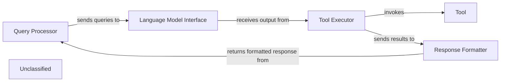
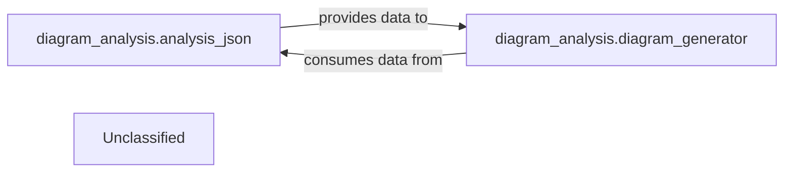
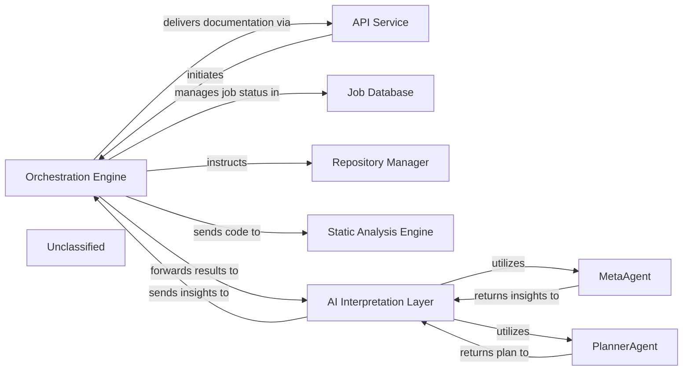
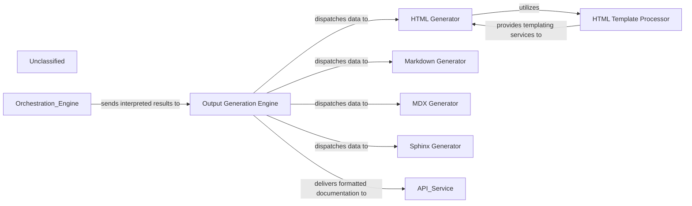
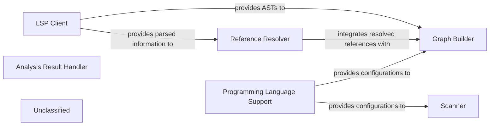

```mermaid
graph LR
    Orchestration_Engine["Orchestration Engine"]
    Static_Analysis_Engine["Static Analysis Engine"]
    AI_Processing_Layer["AI Processing Layer"]
    Output_Generation_Engine["Output Generation Engine"]
    Diagram_Generation_Service["Diagram Generation Service"]
    Unclassified["Unclassified"]
    Unclassified["Unclassified"]
    Orchestration_Engine -- "initiates code analysis in" --> Static_Analysis_Engine
    Static_Analysis_Engine -- "provides clustered architectural components to" --> AI_Processing_Layer
    AI_Processing_Layer -- "sends interpreted architectural data to" --> Output_Generation_Engine
    Output_Generation_Engine -- "provides diagram data to" --> Diagram_Generation_Service
    Orchestration_Engine -- "triggers the interpretation phase in" --> AI_Processing_Layer
    Orchestration_Engine -- "commands output generation from" --> Output_Generation_Engine
    click Orchestration_Engine href "https://github.com/CodeBoarding/CodeBoarding/blob/main/.codeboarding/Orchestration_Engine.md" "Details"
    click Static_Analysis_Engine href "https://github.com/CodeBoarding/CodeBoarding/blob/main/.codeboarding/Static_Analysis_Engine.md" "Details"
    click AI_Processing_Layer href "https://github.com/CodeBoarding/CodeBoarding/blob/main/.codeboarding/AI_Processing_Layer.md" "Details"
    click Output_Generation_Engine href "https://github.com/CodeBoarding/CodeBoarding/blob/main/.codeboarding/Output_Generation_Engine.md" "Details"
    click Diagram_Generation_Service href "https://github.com/CodeBoarding/CodeBoarding/blob/main/.codeboarding/Diagram_Generation_Service.md" "Details"
```

## Details

This graph represents the core functionality of a system that processes user queries, generates responses using a language model, and interacts with external tools. The main flow involves receiving a query, parsing it, invoking a language model to determine the appropriate action, executing that action (which might involve using a tool), and finally formatting and returning the response to the user. Its purpose is to provide a flexible and extensible framework for building AI-powered applications that can understand and act upon user requests.

### Query Processor
Handles incoming user queries, including parsing and initial validation.

**Related Classes/Methods**:

- `QueryParser:parse`

### Language Model Interface
Manages interactions with the underlying language model, sending prompts and receiving generated text.

**Related Classes/Methods**:

- `LLMClient:send_prompt`
- `LLMClient:receive_response`

### Tool Executor
Executes specific tools based on the language model's output, handling tool invocation and result retrieval.

**Related Classes/Methods**:

- <a href="https://github.com/CodeBoarding/CodeBoarding/blob/main/.codeboardingagents/tools/toolkit.py" target="_blank" rel="noopener noreferrer">`ToolRegistry:get_tool`</a>
- `Tool:execute`

### Response Formatter
Formats the final response to be sent back to the user, potentially combining information from the language model and tool outputs.

**Related Classes/Methods**:

- `ResponseBuilder:build`

### Unclassified
Component for all unclassified files and utility functions (Utility functions/External Libraries/Dependencies)

**Related Classes/Methods**: _None_

### [FAQ](https://github.com/CodeBoarding/GeneratedOnBoardings/tree/main?tab=readme-ov-file#faq)

## Details

The Diagram Generation Service subsystem is encapsulated within the diagram_analysis package. Its primary function is to transform structured architectural data into visual diagrams, enhancing comprehension through interactive representations.

### diagram_analysis.analysis_json
This component is responsible for processing and structuring raw architectural data into a standardized, machine-readable format (likely JSON). It acts as a crucial data preparation layer, ensuring that the input for diagram generation is consistent and well-formed.

**Related Classes/Methods**:

- <a href="https://github.com/CodeBoarding/CodeBoarding/blob/main/.codeboardingdiagram_analysis/analysis_json.py" target="_blank" rel="noopener noreferrer">`diagram_analysis.analysis_json`</a>

### diagram_analysis.diagram_generator
This is the core engine of the subsystem, tasked with taking the structured architectural data (prepared by analysis_json) and transforming it into a visual diagram format. It likely leverages external tools like Mermaid.js for rendering the visual output.

**Related Classes/Methods**:

- <a href="https://github.com/CodeBoarding/CodeBoarding/blob/main/.codeboardingdiagram_analysis/diagram_generator.py" target="_blank" rel="noopener noreferrer">`diagram_analysis.diagram_generator`</a>

### Unclassified
Component for all unclassified files and utility functions (Utility functions/External Libraries/Dependencies)

**Related Classes/Methods**: _None_

### [FAQ](https://github.com/CodeBoarding/GeneratedOnBoardings/tree/main?tab=readme-ov-file#faq)

## Details

The system is designed around a central `Orchestration Engine` that drives the entire code analysis and documentation generation workflow. External requests are handled by the `API Service`, which initiates jobs within the `Orchestration Engine`. The `Orchestration Engine` first leverages the `Repository Manager` to acquire the target codebase and then dispatches it to the `Static Analysis Engine` for initial processing. The results are then fed into the `AI Interpretation Layer`, an intelligent component that utilizes specialized `MetaAgent` and `PlannerAgent` sub-components to derive architectural insights and formulate a detailed analysis strategy. Throughout this pipeline, the `Job Database` maintains a persistent record of job statuses and metadata. Upon completion, the `Orchestration Engine` compiles the final documentation and delivers it back through the `API Service`, providing a comprehensive and automated solution for understanding and documenting software projects.

### Orchestration Engine [[Expand]](./Orchestration_Engine.md)
The central control unit managing the entire code analysis and documentation generation pipeline. It coordinates the execution flow, from static analysis to AI interpretation and final output generation.

**Related Classes/Methods**:

- <a href="https://github.com/CodeBoarding/CodeBoarding/blob/main/.codeboardingmain.py#L55-L72" target="_blank" rel="noopener noreferrer">`main.generate_analysis`:55-72</a>

### API Service
Handles external job requests and delivers final documentation.

**Related Classes/Methods**:

- <a href="https://github.com/CodeBoarding/CodeBoarding/blob/main/.codeboardinglocal_app.py" target="_blank" rel="noopener noreferrer">`local_app.start_generation_job`</a>

### Job Database
Stores and manages job status and metadata.

**Related Classes/Methods**:

- <a href="https://github.com/CodeBoarding/CodeBoarding/blob/main/.codeboardingduckdb_crud.py" target="_blank" rel="noopener noreferrer">`duckdb_crud.update_job`</a>

### Repository Manager
Responsible for fetching code from repositories.

**Related Classes/Methods**:

- <a href="https://github.com/CodeBoarding/CodeBoarding/blob/main/.codeboardingrepo_utils/__init__.py" target="_blank" rel="noopener noreferrer">`repo_utils.clone_repository`</a>

### Static Analysis Engine [[Expand]](./Static_Analysis_Engine.md)
Performs static analysis on the provided code.

**Related Classes/Methods**:

- <a href="https://github.com/CodeBoarding/CodeBoarding/blob/main/.codeboardingstatic_analyzer/scanner.py" target="_blank" rel="noopener noreferrer">`static_analyzer.scanner.StaticAnalysisEngine.analyze_code`</a>

### AI Interpretation Layer
Interprets static analysis results and generates insights, encompassing specialized agents like MetaAgent and PlannerAgent. This layer is orchestrated by the `DiagramGenerator`.

**Related Classes/Methods**:

- <a href="https://github.com/CodeBoarding/CodeBoarding/blob/main/.codeboardingdiagram_analysis/diagram_generator.py" target="_blank" rel="noopener noreferrer">`diagram_analysis.diagram_generator.DiagramGenerator.generate_analysis`</a>

### MetaAgent
Analyzes project-level metadata to extract high-level architectural context, project type, domain, and technological biases, guiding subsequent analysis and interpretation.

**Related Classes/Methods**:

- <a href="https://github.com/CodeBoarding/CodeBoarding/blob/main/.codeboardingagents/meta_agent.py#L31-L40" target="_blank" rel="noopener noreferrer">`agents.meta_agent.MetaAgent.analyze_metadata`:31-40</a>

### PlannerAgent
Generates a strategic plan for deeper code analysis based on initial analysis and metadata, identifying key components for detailed examination and determining their expansion scope.

**Related Classes/Methods**:

- <a href="https://github.com/CodeBoarding/CodeBoarding/blob/main/.codeboardingagents/planner_agent.py#L22-L33" target="_blank" rel="noopener noreferrer">`agents.planner_agent.PlannerAgent.generate_plan`:22-33</a>

### Unclassified
Component for all unclassified files and utility functions (Utility functions/External Libraries/Dependencies)

**Related Classes/Methods**: _None_

### [FAQ](https://github.com/CodeBoarding/GeneratedOnBoardings/tree/main?tab=readme-ov-file#faq)

## Details

The Output Generation Engine subsystem is responsible for converting interpreted architectural results into a variety of documentation formats. It acts as a central dispatcher, receiving processed data from an external Orchestration Engine and routing it to specialized generators for HTML, Markdown, MDX, and Sphinx formats. The generated documentation is then delivered to an external API Service. Within the subsystem, the HTML Generator leverages an HTML Template Processor to ensure consistent and structured HTML output. This design promotes modularity, allowing for easy extension with new output formats and maintaining a clear separation of concerns between content generation and formatting.

### Output Generation Engine [[Expand]](./Output_Generation_Engine.md)
The primary entry point for the subsystem, coordinating the selection and execution of specific format generators based on the desired output type. It receives processed insights and dispatches them to the appropriate internal generator.

**Related Classes/Methods**:

- <a href="https://github.com/CodeBoarding/CodeBoarding/blob/main/.codeboardingoutput_generators/__init__.py" target="_blank" rel="noopener noreferrer">`output_generators`</a>

### HTML Generator
Responsible for transforming architectural insights into well-structured HTML documentation. It leverages templates for consistent presentation.

**Related Classes/Methods**:

- <a href="https://github.com/CodeBoarding/CodeBoarding/blob/main/.codeboardingoutput_generators/html.py" target="_blank" rel="noopener noreferrer">`output_generators.html`</a>

### HTML Template Processor
Manages and applies HTML templates to the data provided by the HTML Generator, ensuring consistent styling and structure across HTML outputs.

**Related Classes/Methods**:

- <a href="https://github.com/CodeBoarding/CodeBoarding/blob/main/.codeboardingoutput_generators/html_template.py" target="_blank" rel="noopener noreferrer">`output_generators.html_template`</a>

### Markdown Generator
Converts architectural insights into standard Markdown format, suitable for various platforms and easy readability.

**Related Classes/Methods**:

- <a href="https://github.com/CodeBoarding/CodeBoarding/blob/main/.codeboardingoutput_generators/markdown.py" target="_blank" rel="noopener noreferrer">`output_generators.markdown`</a>

### MDX Generator
Generates documentation in MDX format, combining Markdown with JSX for interactive and dynamic content.

**Related Classes/Methods**:

- <a href="https://github.com/CodeBoarding/CodeBoarding/blob/main/.codeboardingoutput_generators/mdx.py" target="_blank" rel="noopener noreferrer">`output_generators.mdx`</a>

### Sphinx Generator
Produces documentation compatible with the Sphinx documentation generator, often used for Python projects.

**Related Classes/Methods**:

- <a href="https://github.com/CodeBoarding/CodeBoarding/blob/main/.codeboardingoutput_generators/sphinx.py" target="_blank" rel="noopener noreferrer">`output_generators.sphinx`</a>

### Unclassified
Component for all unclassified files and utility functions (Utility functions/External Libraries/Dependencies)

**Related Classes/Methods**: _None_

### [FAQ](https://github.com/CodeBoarding/GeneratedOnBoardings/tree/main?tab=readme-ov-file#faq)

## Details

The static analysis subsystem is designed to transform raw source code into structured Control Flow Graphs (CFGs) for subsequent architectural analysis. At its core, the `LSP Client` leverages external Language Servers to acquire comprehensive parsed information, including Abstract Syntax Trees (ASTs) and symbolic references, thereby centralizing complex parsing. This parsed information is then utilized by the `Reference Resolver` to accurately identify and resolve all symbolic connections within the codebase. For the generation of CFGs, the `Graph Builder` critically depends on the ASTs supplied by the `LSP Client` and the resolved references from the `Reference Resolver`. The `Scanner` performs lexical analysis, primarily for configuration files, under the guidance of `Programming Language Support`, which also provides essential language-specific configurations to both the `Scanner` and the `Graph Builder`. All resulting analysis artifacts, including the generated CFGs, are managed and made accessible through the `Analysis Result Handler`. This integrated approach ensures a robust and language-aware pipeline for deep code understanding.

### Scanner
Performs lexical analysis, breaking down source code into a stream of tokens. It handles language-specific tokenization, with specialized handling for configuration files (e.g., TypeScript).

**Related Classes/Methods**:

- <a href="https://github.com/CodeBoarding/CodeBoarding/blob/main/.codeboardingstatic_analyzer/scanner.py" target="_blank" rel="noopener noreferrer">`scanner`</a>
- <a href="https://github.com/CodeBoarding/CodeBoarding/blob/main/.codeboardingstatic_analyzer/typescript_config_scanner.py" target="_blank" rel="noopener noreferrer">`typescript_config_scanner`</a>

### LSP Client
Facilitates communication with Language Servers (e.g., TypeScript Language Server) to obtain rich parsed information, including Abstract Syntax Trees (ASTs), symbol tables, and references. This component offloads complex parsing logic to external language services, providing the primary source of ASTs for graph generation.

**Related Classes/Methods**:

- <a href="https://github.com/CodeBoarding/CodeBoarding/blob/main/.codeboardingstatic_analyzer/lsp_client/client.py" target="_blank" rel="noopener noreferrer">`client`</a>
- <a href="https://github.com/CodeBoarding/CodeBoarding/blob/main/.codeboardingstatic_analyzer/lsp_client/typescript_client.py" target="_blank" rel="noopener noreferrer">`typescript_client`</a>

### Reference Resolver
Resolves symbolic references within the code, utilizing parsed information from the LSP Client to ensure all connections between code elements are correctly identified. This is crucial for accurate graph generation and component identification.

**Related Classes/Methods**:

- <a href="https://github.com/CodeBoarding/CodeBoarding/blob/main/.codeboardingstatic_analyzer/reference_resolve_mixin.py" target="_blank" rel="noopener noreferrer">`reference_resolve_mixin`</a>

### Graph Builder
Generates Control Flow Graphs (CFGs) from the ASTs provided by the LSP Client and the resolved references from the Reference Resolver. This is a critical step in understanding program execution flow and preparing the code for architectural clustering.

**Related Classes/Methods**:

- <a href="https://github.com/CodeBoarding/CodeBoarding/blob/main/.codeboardingstatic_analyzer/graph.py" target="_blank" rel="noopener noreferrer">`graph`</a>

### Programming Language Support
Manages language-specific configurations, rules, and utilities, enabling the static analysis engine to support multiple programming languages effectively. It provides the necessary context for tokenization, parsing, and graph generation.

**Related Classes/Methods**:

- <a href="https://github.com/CodeBoarding/CodeBoarding/blob/main/.codeboardingstatic_analyzer/programming_language.py" target="_blank" rel="noopener noreferrer">`programming_language`</a>

### Analysis Result Handler
Defines and manages the data structures used to store the various outputs of the static analysis process, including ASTs, CFGs, and the final clustered component representations. It acts as the interface for consuming analysis results.

**Related Classes/Methods**:

- <a href="https://github.com/CodeBoarding/CodeBoarding/blob/main/.codeboardingstatic_analyzer/analysis_result.py" target="_blank" rel="noopener noreferrer">`analysis_result`</a>

### Unclassified
Component for all unclassified files and utility functions (Utility functions/External Libraries/Dependencies)

**Related Classes/Methods**: _None_

### [FAQ](https://github.com/CodeBoarding/GeneratedOnBoardings/tree/main?tab=readme-ov-file#faq)

## Details

The system operates through a pipeline orchestrated by the `Orchestration Engine`. This engine first activates the `Static Analysis Engine`, which is responsible for parsing source code, generating Control Flow Graphs (CFGs), and critically, applying advanced adaptive clustering algorithms to abstract these CFGs into logical architectural components. These refined, clustered components are then passed to the `AI Processing Layer`, where Large Language Models interpret them to derive architectural insights and identify relationships. Subsequently, the `Output Generation Engine` takes these insights and formats them into various outputs, including data specifically structured for the `Diagram Generation Service`, which visualizes the architecture. This re-engineered `Static Analysis Engine` plays a pivotal role in transforming raw code into actionable architectural representations, significantly enhancing the overall analysis quality.

### Orchestration Engine [[Expand]](./Orchestration_Engine.md)
The central control unit managing the entire code analysis and documentation generation pipeline. It coordinates the execution flow, from static analysis to AI interpretation and final output generation.

**Related Classes/Methods**:

- <a href="https://github.com/CodeBoarding/CodeBoarding/blob/main/.codeboardingagents/meta_agent.py" target="_blank" rel="noopener noreferrer">`agents/meta_agent.py`</a>
- <a href="https://github.com/CodeBoarding/CodeBoarding/blob/main/.codeboardingagents/planner_agent.py" target="_blank" rel="noopener noreferrer">`agents/planner_agent.py`</a>

### Static Analysis Engine [[Expand]](./Static_Analysis_Engine.md)
Responsible for parsing source code, building Abstract Syntax Trees (ASTs), generating Control Flow Graphs (CFGs), and applying adaptive clustering algorithms to abstract these graphs into logical architectural components. It provides structured, clustered code representations.

**Related Classes/Methods**:

- <a href="https://github.com/CodeBoarding/CodeBoarding/blob/main/.codeboardingstatic_analyzer" target="_blank" rel="noopener noreferrer">`static_analyzer/`</a>
- <a href="https://github.com/CodeBoarding/CodeBoarding/blob/main/.codeboardingstatic_analyzer/graph.py" target="_blank" rel="noopener noreferrer">`static_analyzer/graph.py`</a>

### AI Processing Layer [[Expand]](./AI_Processing_Layer.md)
This integrated layer processes structured code data using Large Language Models (LLMs) to derive architectural insights, identify components, and understand relationships. It includes prompt generation and management, and handles interactions with various LLM providers.

**Related Classes/Methods**:

- <a href="https://github.com/CodeBoarding/CodeBoarding/blob/main/.codeboardingagents/abstraction_agent.py" target="_blank" rel="noopener noreferrer">`agents/abstraction_agent.py`</a>
- <a href="https://github.com/CodeBoarding/CodeBoarding/blob/main/.codeboardingagents/details_agent.py" target="_blank" rel="noopener noreferrer">`agents/details_agent.py`</a>
- <a href="https://github.com/CodeBoarding/CodeBoarding/blob/main/.codeboardingagents/prompts/prompt_factory.py" target="_blank" rel="noopener noreferrer">`agents/prompts/prompt_factory.py`</a>
- <a href="https://github.com/CodeBoarding/CodeBoarding/blob/main/.codeboardingagents/llm_config.py" target="_blank" rel="noopener noreferrer">`agents/llm_config.py`</a>

### Output Generation Engine [[Expand]](./Output_Generation_Engine.md)
Takes the structured architectural insights from the AI Processing Layer and formats them into various output types, such as documentation files (Markdown, JSON), reports, or raw data suitable for diagram generation.

**Related Classes/Methods**:

- <a href="https://github.com/CodeBoarding/CodeBoarding/blob/main/.codeboardingoutput_generators" target="_blank" rel="noopener noreferrer">`output_generators/`</a>

### Diagram Generation Service [[Expand]](./Diagram_Generation_Service.md)
Specializes in converting structured architectural data into visual diagrams, potentially using tools like Mermaid.js. It enhances comprehension by providing interactive and visual representations of the analyzed architecture.

**Related Classes/Methods**:

- <a href="https://github.com/CodeBoarding/CodeBoarding/blob/main/.codeboardingdiagram_analysis" target="_blank" rel="noopener noreferrer">`diagram_analysis/`</a>

### Unclassified
Component for all unclassified files and utility functions (Utility functions/External Libraries/Dependencies)

**Related Classes/Methods**: _None_

### Unclassified
Component for all unclassified files and utility functions (Utility functions/External Libraries/Dependencies)

**Related Classes/Methods**: _None_

### [FAQ](https://github.com/CodeBoarding/GeneratedOnBoardings/tree/main?tab=readme-ov-file#faq)

