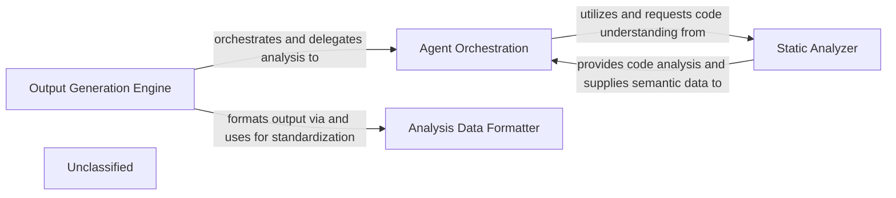
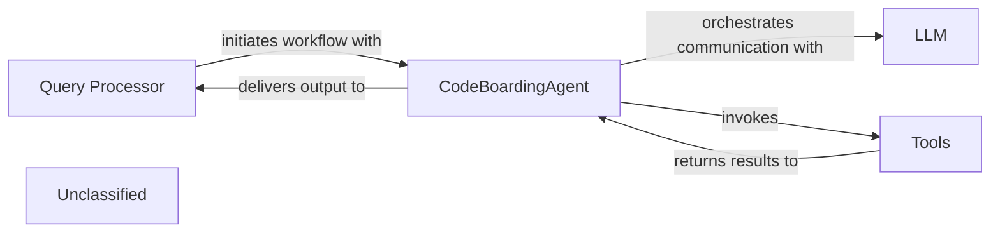

## Details

The core of the system revolves around two primary agents, `AbstractionAgent` and `DetailsAgent`, which collaboratively perform AI-driven architectural analysis. The `AbstractionAgent` initiates the process by transforming raw static analysis data into high-level architectural concepts, leveraging LLMs for interpretation. Subsequently, the `DetailsAgent` refines these abstractions, extracting granular insights. Both agents rely on a `LLM Interaction Handler` to manage communication with various LLM providers, ensuring consistent API calls and response processing. A `Prompt Factory` component is crucial for both agents, providing optimized prompt templates and strategies to ensure effective and consistent interactions with the LLMs, thereby maintaining the quality and relevance of the architectural interpretations. This modular design allows for flexible integration of different LLM technologies and robust prompt management.

### AbstractionAgent
Responsible for abstracting raw static analysis data into higher-level architectural concepts, identifying components, patterns, and relationships by formulating prompts for LLMs. This agent initiates the AI-driven analysis.

**Related Classes/Methods**:

- <a href="https://github.com/CodeBoarding/CodeBoarding/blob/main/.codeboardingagents/abstraction_agent.py" target="_blank" rel="noopener noreferrer">`AbstractionAgent`</a>

### DetailsAgent
Complements the AbstractionAgent by refining initial abstractions, extracting specific details, or providing granular insights into the architecture using LLMs. It acts on the insights provided by the AbstractionAgent.

**Related Classes/Methods**:

- <a href="https://github.com/CodeBoarding/CodeBoarding/blob/main/.codeboardingagents/details_agent.py" target="_blank" rel="noopener noreferrer">`DetailsAgent`</a>

### LLM Interaction Handler
This component is responsible for abstracting away the specifics of various LLM APIs, handling API calls, authentication, and response normalization for diverse LLM providers. It ensures the system's adaptability to different LLM technologies.

**Related Classes/Methods**:

- <a href="https://github.com/CodeBoarding/CodeBoarding/blob/main/.codeboardingagents/agent.py" target="_blank" rel="noopener noreferrer">`agents.agent.Agent`</a>

### Prompt Factory [[Expand]](./Prompt_Factory.md)
Manages prompt templates, context windows, and strategies to optimize LLM responses, ensuring consistent and effective communication with LLMs for architectural interpretation. This component ensures the quality and consistency of LLM interactions.

**Related Classes/Methods**:

- <a href="https://github.com/CodeBoarding/CodeBoarding/blob/main/.codeboardingagents/prompts/prompt_factory.py" target="_blank" rel="noopener noreferrer">`agents.prompts.prompt_factory.PromptFactory`</a>

### Unclassified
Component for all unclassified files and utility functions (Utility functions/External Libraries/Dependencies)

**Related Classes/Methods**: _None_

### [FAQ](https://github.com/CodeBoarding/GeneratedOnBoardings/tree/main?tab=readme-ov-file#faq)

## Details

The system's primary objective is to generate structured architectural analysis outputs. This process is initiated and managed by the Output Generation Engine, which orchestrates the entire workflow. It delegates the complex task of code interpretation and detailed analysis to the Agent Orchestration component. The Agent Orchestration component, in turn, relies heavily on the Static Analyzer to acquire foundational and semantic understanding of the codebase. Once the analysis is complete, the Output Generation Engine utilizes the Analysis Data Formatter to convert the internal analysis objects into a standardized JSON format, suitable for external consumption and diagram rendering.

### Output Generation Engine [[Expand]](./Output_Generation_Engine.md)
The Output Generation Engine serves as the central orchestrator, managing the overall analysis workflow and coordinating the other components. It initiates and manages the process of generating structured architectural analysis outputs and utilizes the Analysis Data Formatter to convert internal analysis objects into a standardized JSON format.

**Related Classes/Methods**:

- `OutputGenerationEngine`

### Agent Orchestration
The Agent Orchestration component is responsible for the complex task of code interpretation and detailed analysis. It relies on the Static Analyzer for foundational and semantic understanding of the codebase and has been enhanced with refined agent behaviors and expanded task capabilities.

**Related Classes/Methods**:

- <a href="https://github.com/CodeBoarding/CodeBoarding/blob/main/.codeboardingagents/agent.py#L40-L267" target="_blank" rel="noopener noreferrer">`AgentOrchestration`:40-267</a>

### Static Analyzer
The Static Analyzer provides foundational code understanding, leveraging its advanced capabilities to extract structural and semantic information from the codebase, which is then used by the Agent Orchestration component.

**Related Classes/Methods**:

- <a href="https://github.com/CodeBoarding/CodeBoarding/blob/main/.codeboardingstatic_analyzer/__init__.py#L44-L67" target="_blank" rel="noopener noreferrer">`StaticAnalyzer`:44-67</a>

### Analysis Data Formatter
The Analysis Data Formatter ensures that all generated analysis data is converted into a standardized JSON format, making it readily consumable for documentation and diagram generation.

**Related Classes/Methods**:

- `AnalysisDataFormatter`

### Unclassified
Component for all unclassified files and utility functions (Utility functions/External Libraries/Dependencies)

**Related Classes/Methods**: _None_

### [FAQ](https://github.com/CodeBoarding/GeneratedOnBoardings/tree/main?tab=readme-ov-file#faq)

## Details

The system's architecture is centered around an Agent that orchestrates static code analysis and decision-making. The Agent utilizes a PromptFactory to dynamically generate context-aware prompts, guiding its interactions and analysis tasks. To perform code analysis, the Agent invokes the Scanner, which acts as the primary interface for static analysis. The Scanner relies on the LSP Client to communicate with external Language Servers, thereby acquiring rich, language-specific code insights. All findings from the static analysis are then structured and encapsulated within an AnalysisResult object, which the Agent subsequently consumes to inform its actions and refine its understanding of the codebase. This modular design ensures clear separation of concerns, enabling flexible integration with various language servers and adaptable agent behaviors.

### Agent
Drives the overall analysis process, makes decisions based on analysis results, and orchestrates interactions with other components. It utilizes PromptFactory for dynamic prompt generation and Scanner to initiate code analysis.

**Related Classes/Methods**:

- <a href="https://github.com/CodeBoarding/CodeBoarding/blob/main/.codeboardingagents/abstraction_agent.py" target="_blank" rel="noopener noreferrer">`agents.abstraction_agent`</a>
- <a href="https://github.com/CodeBoarding/CodeBoarding/blob/main/.codeboardingagents/agent.py" target="_blank" rel="noopener noreferrer">`agents.agent`</a>
- <a href="https://github.com/CodeBoarding/CodeBoarding/blob/main/.codeboardingagents/agent_responses.py" target="_blank" rel="noopener noreferrer">`agents.agent_responses`</a>
- <a href="https://github.com/CodeBoarding/CodeBoarding/blob/main/.codeboardingagents/details_agent.py" target="_blank" rel="noopener noreferrer">`agents.details_agent`</a>
- <a href="https://github.com/CodeBoarding/CodeBoarding/blob/main/.codeboardingagents/tools/" target="_blank" rel="noopener noreferrer">`agents.tools`</a>
- <a href="https://github.com/CodeBoarding/CodeBoarding/blob/main/.codeboardingagents/prompts/" target="_blank" rel="noopener noreferrer">`agents.prompts`</a>

### PromptFactory
Dynamically generates LLM prompts based on specified types and models, providing structured input for the Agent.

**Related Classes/Methods**:

- <a href="https://github.com/CodeBoarding/CodeBoarding/blob/main/.codeboardingagents/prompts/" target="_blank" rel="noopener noreferrer">`agents.prompts`</a>

### Scanner
Acts as the entry point for static analysis, parsing source code, extracting relevant information, and orchestrating the data gathering from language servers.

**Related Classes/Methods**:

- <a href="https://github.com/CodeBoarding/CodeBoarding/blob/main/.codeboardingstatic_analyzer/scanner.py" target="_blank" rel="noopener noreferrer">`static_analyzer.scanner`</a>

### LSP Client
Integrates with Language Server Protocol (LSP) to communicate with external language servers, obtaining rich analysis data such as definitions, references, and diagnostics.

**Related Classes/Methods**:

- <a href="https://github.com/CodeBoarding/CodeBoarding/blob/main/.codeboardingstatic_analyzer/lsp_client/client.py" target="_blank" rel="noopener noreferrer">`static_analyzer.lsp_client.client`</a>

### AnalysisResult
Encapsulates the structured output of the static analysis, including code graphs, findings, and other relevant data, providing a standardized format for consumption.

**Related Classes/Methods**:

- <a href="https://github.com/CodeBoarding/CodeBoarding/blob/main/.codeboardingstatic_analyzer/analysis_result.py" target="_blank" rel="noopener noreferrer">`static_analyzer.analysis_result`</a>

### Unclassified
Component for all unclassified files and utility functions (Utility functions/External Libraries/Dependencies)

**Related Classes/Methods**: _None_

### [FAQ](https://github.com/CodeBoarding/GeneratedOnBoardings/tree/main?tab=readme-ov-file#faq)

## Details

The system's architecture is centered around the `CodeBoardingAgent`, which acts as the intelligent core for processing user queries. The `Query Processor` initiates the workflow by forwarding user requests to the `CodeBoardingAgent`. The `CodeBoardingAgent` then orchestrates complex interactions with a Large Language Model (LLM) and a suite of specialized `Tools`. It dynamically selects and invokes these `Tools` to gather necessary information and perform static code analysis. After receiving results from the `Tools` and further refining its understanding with the LLM, the `CodeBoardingAgent` is responsible for parsing and formatting the final response, which is then delivered back to the `Query Processor` for presentation to the user. This design ensures a clear separation of concerns, with the `CodeBoardingAgent` managing the intelligent reasoning and execution, while `Tools` provide specific functionalities and the `Query Processor` handles user interaction.

### Query Processor
Manages user interactions and initiates the overall workflow.

**Related Classes/Methods**:

- `QueryProcessor.handle_request`:10-20

### CodeBoardingAgent
Serves as the central orchestrator, managing communication with the Large Language Model (LLM), directing the invocation of specialized tools, and processing/formatting the LLM's output. It embodies the core logic for intelligent reasoning and task execution.

**Related Classes/Methods**:

- <a href="https://github.com/CodeBoarding/CodeBoarding/blob/main/.codeboardingagents/agent.py#L155-L191" target="_blank" rel="noopener noreferrer">`agents.agent.CodeBoardingAgent._invoke`:155-191</a>
- <a href="https://github.com/CodeBoarding/CodeBoarding/blob/main/.codeboardingagents/agent.py#L198-L224" target="_blank" rel="noopener noreferrer">`agents.agent.CodeBoardingAgent._parse_response`:198-224</a>

### Tools
A collection of specialized utilities that execute advanced static code analysis and data retrieval. These tools perform advanced information gathering and static analysis as directed by the `CodeBoardingAgent`.

**Related Classes/Methods**:

- <a href="https://github.com/CodeBoarding/CodeBoarding/blob/main/.codeboarding." target="_blank" rel="noopener noreferrer">`Tools.read_tools`</a>
- `Tools.lsp_client`

### Unclassified
Component for all unclassified files and utility functions (Utility functions/External Libraries/Dependencies)

**Related Classes/Methods**: _None_

### [FAQ](https://github.com/CodeBoarding/GeneratedOnBoardings/tree/main?tab=readme-ov-file#faq)

## Details

The system operates as a sophisticated documentation generation pipeline, orchestrated by the central `Agent Component`. This component, having undergone recent enhancements, now more robustly coordinates the entire workflow. It initiates by leveraging the `Static Analysis Component` to acquire AI-interpreted insights from the codebase. These refined insights are then intelligently dispatched by the `Agent Component` to either the `Output Format Dispatcher` for conversion into various textual documentation formats (Markdown, HTML, MDX, Sphinx) or to the `Diagram Generation Component` for visual representations. This architecture ensures a clear separation of concerns, allowing for flexible and extensible documentation and diagram generation capabilities.

### Agent Component
This component serves as the primary orchestrator, driving the overall process of static analysis and documentation generation. Recent architectural changes have further evolved and enhanced its core orchestration logic and capabilities. It now refines its information gathering processes through internal tools and more precisely coordinates with other components. It interacts with the `Static Analysis Component` to obtain AI-interpreted insights and then directs these insights to the `Output Format Dispatcher` for conversion into various documentation formats, and to the `Diagram Generation Component` for visualization. This component embodies the core workflow logic, coordinating the different stages of the documentation pipeline with enhanced precision.

**Related Classes/Methods**:

- <a href="https://github.com/CodeBoarding/CodeBoarding/blob/main/.codeboardingagents/agent.py" target="_blank" rel="noopener noreferrer">`agents/agent.py`</a>

### Static Analysis Component
This component is responsible for performing robust static analysis on the codebase and generating "AI-interpreted insights." It acts as a crucial upstream dependency, providing the raw, processed data that the `Agent Component` then utilizes. Its strengthened LSP client integration and sophisticated understanding of various programming languages enhance its ability to identify, parse, and process code, delivering deeper insights within the development environment.

**Related Classes/Methods**:

- <a href="https://github.com/CodeBoarding/CodeBoarding/blob/main/.codeboardingstatic_analyzer/lsp_client/client.py" target="_blank" rel="noopener noreferrer">`static_analyzer/lsp_client/client.py`</a>

### Output Format Dispatcher
This component serves as the central orchestrator within the Output Generation Engine. It receives AI-interpreted insights along with the desired output format from the `Agent Component` and dispatches the data to the appropriate specialized generator (e.g., Markdown, HTML, MDX, Sphinx). This component is crucial for maintaining a clear separation of concerns and supporting the "Pipeline/Workflow" architectural pattern by managing the flow to specific formatters.

**Related Classes/Methods**:

- <a href="https://github.com/CodeBoarding/CodeBoarding/blob/main/.codeboardingoutput_generators/markdown.py" target="_blank" rel="noopener noreferrer">`output_generators/markdown.py`</a>
- <a href="https://github.com/CodeBoarding/CodeBoarding/blob/main/.codeboardingoutput_generators/html.py" target="_blank" rel="noopener noreferrer">`output_generators/html.py`</a>
- <a href="https://github.com/CodeBoarding/CodeBoarding/blob/main/.codeboardingoutput_generators/mdx.py" target="_blank" rel="noopener noreferrer">`output_generators/mdx.py`</a>
- <a href="https://github.com/CodeBoarding/CodeBoarding/blob/main/.codeboardingoutput_generators/sphinx.py" target="_blank" rel="noopener noreferrer">`output_generators/sphinx.py`</a>

### Markdown Generator
Specializes in converting AI-interpreted insights into a well-structured Markdown format. This output is ideal for human-readable documentation, README files, and integration with Markdown-based rendering tools. It is a fundamental component for generating textual documentation, a primary output of a "Code Analysis and Documentation Generation Tool."

**Related Classes/Methods**:

- <a href="https://github.com/CodeBoarding/CodeBoarding/blob/main/.codeboardingoutput_generators/markdown.py" target="_blank" rel="noopener noreferrer">`output_generators/markdown.py`</a>

### HTML Generator
Focuses on transforming AI-interpreted insights into HTML format. This enables rich, web-based documentation, interactive reports, and seamless integration with web platforms or tools. This component provides an alternative, often more visually rich, documentation output, supporting diverse presentation needs.

**Related Classes/Methods**:

- <a href="https://github.com/CodeBoarding/CodeBoarding/blob/main/.codeboardingoutput_generators/html.py" target="_blank" rel="noopener noreferrer">`output_generators/html.py`</a>

### Mdx Generator
Specializes in converting AI-interpreted insights into MDX (Markdown with JSX) format. This enables the creation of interactive and dynamic documentation, leveraging the power of React components within Markdown.

**Related Classes/Methods**:

- <a href="https://github.com/CodeBoarding/CodeBoarding/blob/main/.codeboardingoutput_generators/mdx.py" target="_blank" rel="noopener noreferrer">`output_generators/mdx.py`</a>

### Sphinx Generator
Focuses on transforming AI-interpreted insights into a format compatible with Sphinx, a popular documentation generator. This allows for the creation of comprehensive and structured documentation, often used for large software projects.

**Related Classes/Methods**:

- <a href="https://github.com/CodeBoarding/CodeBoarding/blob/main/.codeboardingoutput_generators/sphinx.py" target="_blank" rel="noopener noreferrer">`output_generators/sphinx.py`</a>

### Diagram Generation Component
This component is responsible for generating diagrams and visualizations from the AI-interpreted insights. It provides a new way to present and understand the analysis results, complementing the textual documentation outputs.

**Related Classes/Methods**:

- <a href="https://github.com/CodeBoarding/CodeBoarding/blob/main/.codeboardingdiagram_analysis/diagram_generator.py" target="_blank" rel="noopener noreferrer">`diagram_analysis/diagram_generator.py`</a>

### Unclassified
Component for all unclassified files and utility functions (Utility functions/External Libraries/Dependencies)

**Related Classes/Methods**: _None_

### [FAQ](https://github.com/CodeBoarding/GeneratedOnBoardings/tree/main?tab=readme-ov-file#faq)

## Details

The static analysis subsystem is centered around the ProjectScanner, which acts as the primary orchestrator. The ProjectScanner is responsible for initiating the code scanning process, leveraging external tools like Tokei to gather raw code statistics and identify programming languages. It then delegates the construction of detailed ProgrammingLanguage objects to the ProgrammingLanguageBuilder, which encapsulates language-specific properties and configurations. Finally, the ProjectScanner collects and manages these ProgrammingLanguage objects, representing the detected languages and their associated metrics within the codebase. This clear separation of concerns ensures that scanning, language object creation, and data encapsulation are handled by distinct, focused components.

### ProjectScanner
The central component responsible for orchestrating the static analysis process. It scans the code repository, identifies programming languages, gathers code statistics using external tools (e.g., Tokei), and extracts unique file suffixes. It then uses the ProgrammingLanguageBuilder to prepare language-specific data for further processing.

**Related Classes/Methods**:

- <a href="https://github.com/CodeBoarding/CodeBoarding/blob/main/.codeboardingstatic_analyzer/scanner.py#L12-L84" target="_blank" rel="noopener noreferrer">`static_analyzer.scanner.ProjectScanner`:12-84</a>

### ProgrammingLanguageBuilder
Responsible for constructing and configuring ProgrammingLanguage objects based on the data gathered by the ProjectScanner. It ensures that language-specific properties, such as associated LSP servers, are correctly initialized.

**Related Classes/Methods**:

- <a href="https://github.com/CodeBoarding/CodeBoarding/blob/main/.codeboardingstatic_analyzer/programming_language.py#L58-L122" target="_blank" rel="noopener noreferrer">`static_analyzer.programming_language.ProgrammingLanguageBuilder`:58-122</a>

### ProgrammingLanguage
Represents a detected programming language within the codebase. It encapsulates properties such as the language name, associated file suffixes, collected code statistics (e.g., lines of code), and configuration for its Language Server Protocol (LSP) server.

**Related Classes/Methods**:

- <a href="https://github.com/CodeBoarding/CodeBoarding/blob/main/.codeboardingstatic_analyzer/programming_language.py#L6-L55" target="_blank" rel="noopener noreferrer">`static_analyzer.programming_language.ProgrammingLanguage`:6-55</a>

### Unclassified
Component for all unclassified files and utility functions (Utility functions/External Libraries/Dependencies)

**Related Classes/Methods**: _None_

### [FAQ](https://github.com/CodeBoarding/GeneratedOnBoardings/tree/main?tab=readme-ov-file#faq)

## Details

The system is designed around a clear separation of concerns, with the API Service handling external requests and the Job Management component orchestrating the overall documentation generation workflow. The Documentation Generation component delegates core analysis and content creation to the CodeBoardingAgent, which serves as the central intelligence. The CodeBoardingAgent is supported by specialized components: Static Analysis Tools for deep code understanding and the Temporary Repository Manager for managing code repositories. A Configuration Manager provides centralized settings across the system, ensuring consistent operation. This architecture allows for robust, scalable documentation generation, with the CodeBoardingAgent continuously evolving its internal capabilities to improve analysis quality.

### API Service
Acts as the external entry point for the system, initiating and monitoring documentation generation jobs.

**Related Classes/Methods**:

- `api_service.start_job`:10-25

### Job Management
Manages the lifecycle of documentation jobs, tracking their progress, status, and orchestrating the overall generation process.

**Related Classes/Methods**:

- `job_manager.create_job`:1-10

### Documentation Generation
Orchestrates the detailed process of generating documentation content by delegating specific tasks to the CodeBoardingAgent.

**Related Classes/Methods**:

- `doc_generator.generate`:10-20

### CodeBoardingAgent
The central intelligence component, now with significantly refined internal mechanisms, responsible for deeply understanding the codebase, efficiently retrieving information, and generating robust documentation content. Its internal tools for information retrieval and response formulation have been substantially enhanced.

**Related Classes/Methods**:

- `codeboarding_agent.analyze`:1-10

### Temporary Repository Manager
Supports the CodeBoardingAgent by managing the cloning of repositories and handling temporary file storage for analysis.

**Related Classes/Methods**:

### Static Analysis Tools
Provides enhanced, in-depth code understanding capabilities to the CodeBoardingAgent through a significantly overhauled Language Server Protocol (LSP) client, improving the quality and depth of code analysis for various programming languages.

**Related Classes/Methods**:

### Configuration Manager
Centralized component for providing all system settings and configurations to other components, ensuring consistent operational parameters.

**Related Classes/Methods**:

- `config_manager.get_setting`:10-25

### Unclassified
Component for all unclassified files and utility functions (Utility functions/External Libraries/Dependencies)

**Related Classes/Methods**: _None_

### [FAQ](https://github.com/CodeBoarding/GeneratedOnBoardings/tree/main?tab=readme-ov-file#faq)

## Details

The system operates with the Orchestration Engine (Agent Core) as its central control unit, dynamically managing the entire code analysis workflow. It initiates analysis requests received from the User Interface / API Gateway, then coordinates with the Repository Manager for codebase access. The Orchestration Engine directs the codebase to the Static Analysis Engine for structural analysis and leverages the LLM Prompt Factory to generate context-aware prompts. These prompts and analysis results are then processed by the AI Interpretation Layer to generate architectural insights. Finally, the Orchestration Engine guides these insights through the Output Generation Engine and Diagram Analysis & Renderer for structured output and visualization, which are ultimately presented back via the User Interface / API Gateway. The recent enhancements within the Orchestration Engine reflect an evolution in its internal logic, leading to more sophisticated state management and refined coordination mechanisms across all components.

### User Interface / API Gateway [[Expand]](./User_Interface_API_Gateway.md)
The system's primary interface for users, handling analysis requests and displaying results, with expanded integration for VS Code.

**Related Classes/Methods**:

- <a href="https://github.com/CodeBoarding/CodeBoarding/blob/main/.codeboardinglocal_app.py" target="_blank" rel="noopener noreferrer">`local_app.app`</a>

### Orchestration Engine (Agent Core) [[Expand]](./Orchestration_Engine_Agent_Core_.md)
The central control unit, dynamically managing the entire analysis workflow. It coordinates all components, maintains a sophisticated analysis state, and leverages refined internal logic to orchestrate enhanced capabilities and the overall analysis process.

**Related Classes/Methods**:

- <a href="https://github.com/CodeBoarding/CodeBoarding/blob/main/.codeboardingagents/agent.py" target="_blank" rel="noopener noreferrer">`agents.agent.CodeBoardingAgent`</a>

### Repository Manager
Manages all interactions with code repositories, providing a standardized interface for source code access and temporary folder management.

**Related Classes/Methods**:

- <a href="https://github.com/CodeBoarding/CodeBoarding/blob/main/.codeboardingutils.py" target="_blank" rel="noopener noreferrer">`utils.create_temp_repo_folder`</a>
- <a href="https://github.com/CodeBoarding/CodeBoarding/blob/main/.codeboardingutils.py" target="_blank" rel="noopener noreferrer">`utils.remove_temp_repo_folder`</a>

### Static Analysis Engine [[Expand]](./Static_Analysis_Engine.md)
Performs in-depth static analysis on source code to extract structural information like CFGs and ASTs, now with significantly enhanced programming language support, more robust scanning mechanisms, and improved interaction with Language Server Protocols (LSP).

**Related Classes/Methods**:

- <a href="https://github.com/CodeBoarding/CodeBoarding/blob/main/.codeboardingstatic_analyzer/scanner.py" target="_blank" rel="noopener noreferrer">`static_analyzer.scanner.Scanner`</a>

### LLM Prompt Factory [[Expand]](./LLM_Prompt_Factory.md)
Dynamically generates and manages prompts tailored for various LLMs and code analysis tasks.

**Related Classes/Methods**:

- <a href="https://github.com/CodeBoarding/CodeBoarding/blob/main/.codeboardingagents/prompts/prompt_factory.py" target="_blank" rel="noopener noreferrer">`agents.prompts.prompt_factory.PromptFactory`</a>

### AI Interpretation Layer [[Expand]](./AI_Interpretation_Layer.md)
Interfaces with LLM providers to process analysis results and prompts, interpreting code context and generating architectural insights with more sophisticated logic for processing analysis results and prompts.

**Related Classes/Methods**:

- <a href="https://github.com/CodeBoarding/CodeBoarding/blob/main/.codeboardingagents/abstraction_agent.py" target="_blank" rel="noopener noreferrer">`agents.abstraction_agent.AbstractionAgent`</a>
- <a href="https://github.com/CodeBoarding/CodeBoarding/blob/main/.codeboardingagents/details_agent.py" target="_blank" rel="noopener noreferrer">`agents.details_agent.DetailsAgent`</a>

### Output Generation Engine [[Expand]](./Output_Generation_Engine.md)
Transforms AI-interpreted insights into structured output formats for diagram generation and documentation.

**Related Classes/Methods**:

- <a href="https://github.com/CodeBoarding/CodeBoarding/blob/main/.codeboardingoutput_generators/markdown.py" target="_blank" rel="noopener noreferrer">`output_generators.markdown.MarkdownGenerator`</a>
- <a href="https://github.com/CodeBoarding/CodeBoarding/blob/main/.codeboardingoutput_generators/html.py" target="_blank" rel="noopener noreferrer">`output_generators.html.HTMLGenerator`</a>

### Diagram Analysis & Renderer [[Expand]](./Diagram_Analysis_Renderer.md)
Refines structured output into diagram-specific formats and renders visual architectural diagrams, with enhanced capabilities for transforming AI-interpreted insights and rendering.

**Related Classes/Methods**:

- <a href="https://github.com/CodeBoarding/CodeBoarding/blob/main/.codeboardingdiagram_analysis/diagram_generator.py" target="_blank" rel="noopener noreferrer">`diagram_analysis.diagram_generator.DiagramGenerator`</a>

### Unclassified
Component for all unclassified files and utility functions (Utility functions/External Libraries/Dependencies)

**Related Classes/Methods**: _None_

### [FAQ](https://github.com/CodeBoarding/GeneratedOnBoardings/tree/main?tab=readme-ov-file#faq)

