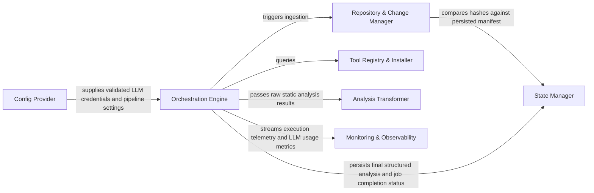
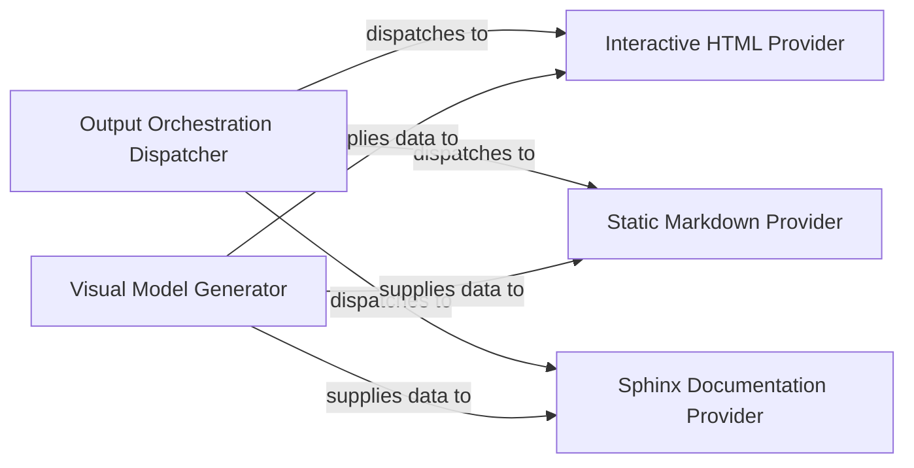

[](https://github.com/CodeBoarding/CodeBoarding)[](https://www.codeboarding.org/diagrams)[](mailto:contact@codeboarding.org)

## Details

Provides a set of specialized tools that allow the LLM Agent Core to interact with the codebase, query static analysis results, and perform specific actions within the project context.

### Tool Registry & Orchestrator
Acts as the central factory and dispatcher; it aggregates all specialized tools into a unified interface, managing tool registration and lifecycle for the LLM Agent.


**Related Classes/Methods**:

- `repos.codeboarding.tools.ToolRegistry`
- `repos.codeboarding.tools.AgentToolFactory`
- `repos.codeboarding.tools.ToolDispatcher`


### Static Analysis Engine
Extracts high-level code intelligence, including Control Flow Graphs (CFG), class hierarchies, and method signatures to provide structural understanding.


**Related Classes/Methods**:

- `repos.codeboarding.tools.GetCFGTool`
- `repos.codeboarding.tools.CodeStructureTool`
- `repos.codeboarding.analysis.ClassHierarchyAnalyzer`


### File System & Source Access
Provides low-level access to the project's physical structure, enabling directory exploration and granular file content retrieval.


**Related Classes/Methods**:

- `repos.codeboarding.tools.ReadFileTool`
- `repos.codeboarding.tools.DirectoryTreeGenerator`
- `repos.codeboarding.tools.FileSystemExplorer`


### Dependency & Ecosystem Mapper
Maps internal package relationships and identifies external library dependencies to define the project's architectural boundaries.


**Related Classes/Methods**:

- `repos.codeboarding.tools.DependencyMapperTool`
- `repos.codeboarding.analysis.PackageRelationshipAnalyzer`
- `repos.codeboarding.analysis.ExternalLibraryScanner`


### Documentation & Git Context Provider
Retrieves non-code context, such as Markdown documentation and Git diffs, to provide historical grounding and design intent.


**Related Classes/Methods**:

- `repos.codeboarding.tools.MarkdownDocTool`
- `repos.codeboarding.tools.GitDiffTool`
- `repos.codeboarding.tools.ContextRetriever`


### Infrastructure & State Manager
Manages repository-level state, including the DuckDB metadata store, caching mechanisms, and global ignore-pattern enforcement.


**Related Classes/Methods**: _None_


### [FAQ](https://github.com/CodeBoarding/GeneratedOnBoardings/tree/main?tab=readme-ov-file#faq)


[](https://github.com/CodeBoarding/CodeBoarding)[](https://www.codeboarding.org/diagrams)[](mailto:contact@codeboarding.org)

## Details

Persistently stores and retrieves static analysis results, preventing re-computation on unchanged code and supporting performance optimization.

### Analysis Cache
Persistently stores and retrieves static analysis results, preventing re-computation on unchanged code and supporting performance optimization.


**Related Classes/Methods**:

- <a href="https://github.com/CodeBoarding/CodeBoarding/blob/main/.codeboardingdiagram_analysis/incremental/updater.py" target="_blank" rel="noopener noreferrer">`repos.codeboarding.incremental.AnalysisCache`</a>


### Analysis Cache Manager
Manages the lifecycle of the Analysis Cache. It handles serialization and deserialization of complex analysis objects, orchestrates their storage into and retrieval from the Analysis Cache, and implements cache invalidation strategies.


**Related Classes/Methods**:

- <a href="https://github.com/CodeBoarding/CodeBoarding/blob/main/.codeboardingstatic_analyzer/analysis_cache.py" target="_blank" rel="noopener noreferrer">`static_analyzer.analysis_cache.AnalysisCacheManager`</a>


### Incremental Update Engine
Orchestrates the process of detecting code changes, assessing their impact, and triggering selective re-analysis or updates. It relies on the Analysis Cache Manager to fetch existing analysis data and store new or updated results.


**Related Classes/Methods**:

- <a href="https://github.com/CodeBoarding/CodeBoarding/blob/main/.codeboardingdiagram_analysis/incremental/updater.py" target="_blank" rel="noopener noreferrer">`diagram_analysis.incremental.updater.IncrementalUpdater`</a>


### Static Analysis Engine
The core component responsible for performing deep analysis of source code to extract structural, semantic, and behavioral information. It produces raw analysis artifacts that are then consumed by other components for storage or further processing.


**Related Classes/Methods**: _None_

### Repository Manager
Manages access to the project's source code repositories. It handles fetching code, tracking file changes, and providing the necessary code context to the analysis components.


**Related Classes/Methods**: _None_

### Output Generation Engine
Transforms the analysis results into various user-consumable formats, such as interactive diagrams (e.g., Mermaid.js), documentation, or reports. It is the final step in presenting the insights derived from the code analysis.


**Related Classes/Methods**: _None_


### [FAQ](https://github.com/CodeBoarding/GeneratedOnBoardings/tree/main?tab=readme-ov-file#faq)


[](https://github.com/CodeBoarding/CodeBoarding)[](https://www.codeboarding.org/diagrams)[](mailto:contact@codeboarding.org)

## Details

Coordinates the overall workflow of the documentation and diagram generation process. It acts as the high-level entry point, parsing command-line arguments, managing repository interactions, and triggering the various output generators after analysis data is available.

### Orchestration Engine
The central control unit that manages the entire workflow, from initial setup to final output generation. It orchestrates the sequence of operations, delegating tasks to other components based on parsed arguments and repository state.


**Related Classes/Methods**:

- <a href="https://github.com/CodeBoarding/CodeBoarding/blob/main/.codeboardinggithub_action.py" target="_blank" rel="noopener noreferrer">`repos.codeboarding.orchestrator.AnalysisOrchestrator`</a>
- <a href="https://github.com/CodeBoarding/CodeBoarding/blob/main/.codeboardingmain.py" target="_blank" rel="noopener noreferrer">`main.main`</a>


### CLI & Configuration Manager
Responsible for defining, parsing, and validating command-line arguments, and ensuring all necessary environment variables are correctly set for the application's operation. It prepares the runtime configuration.


**Related Classes/Methods**:

- <a href="https://github.com/CodeBoarding/CodeBoarding/blob/main/.codeboardinggithub_action.py" target="_blank" rel="noopener noreferrer">`repos.codeboarding.cli.CLIParser`</a>
- <a href="https://github.com/CodeBoarding/CodeBoarding/blob/main/.codeboardingmain.py" target="_blank" rel="noopener noreferrer">`main.define_cli_arguments`</a>
- <a href="https://github.com/CodeBoarding/CodeBoarding/blob/main/.codeboardingmain.py" target="_blank" rel="noopener noreferrer">`main.validate_arguments`</a>
- <a href="https://github.com/CodeBoarding/CodeBoarding/blob/main/.codeboardingmain.py" target="_blank" rel="noopener noreferrer">`main.validate_env_vars`</a>


### Repository Manager
Handles all interactions with code repositories, including cloning remote repositories, copying necessary files, checking for existing onboarding materials, and preparing both local and remote codebases for analysis.


**Related Classes/Methods**:

- <a href="https://github.com/CodeBoarding/CodeBoarding/blob/main/.codeboardinggithub_action.py" target="_blank" rel="noopener noreferrer">`repos.codeboarding.repository.RepositoryManager`</a>
- <a href="https://github.com/CodeBoarding/CodeBoarding/blob/main/.codeboardingmain.py" target="_blank" rel="noopener noreferrer">`main.process_remote_repository`</a>
- <a href="https://github.com/CodeBoarding/CodeBoarding/blob/main/.codeboardingmain.py" target="_blank" rel="noopener noreferrer">`main.copy_files`</a>
- <a href="https://github.com/CodeBoarding/CodeBoarding/blob/main/.codeboardingmain.py" target="_blank" rel="noopener noreferrer">`main.onboarding_materials_exist`</a>
- <a href="https://github.com/CodeBoarding/CodeBoarding/blob/main/.codeboardingmain.py" target="_blank" rel="noopener noreferrer">`main.process_local_repository`</a>


### Static Analysis Engine
Performs the core static analysis of the codebase, extracting structural and functional insights. It also supports incremental updates to existing analysis results.


**Related Classes/Methods**:

- <a href="https://github.com/CodeBoarding/CodeBoarding/blob/main/.codeboardingmain.py" target="_blank" rel="noopener noreferrer">`main.generate_analysis`</a>
- <a href="https://github.com/CodeBoarding/CodeBoarding/blob/main/.codeboardingmain.py" target="_blank" rel="noopener noreferrer">`main.partial_update`</a>


### Documentation Generator
Transforms the raw analysis results provided by the Static Analysis Engine into various human-readable documentation formats, such as Markdown or platform-specific outputs.


**Related Classes/Methods**:

- <a href="https://github.com/CodeBoarding/CodeBoarding/blob/main/.codeboardingmain.py" target="_blank" rel="noopener noreferrer">`main.generate_docs_remote`</a>
- <a href="https://github.com/CodeBoarding/CodeBoarding/blob/main/.codeboardingmain.py" target="_blank" rel="noopener noreferrer">`main.generate_markdown_docs`</a>


### [FAQ](https://github.com/CodeBoarding/GeneratedOnBoardings/tree/main?tab=readme-ov-file#faq)


[](https://github.com/CodeBoarding/CodeBoarding)[](https://www.codeboarding.org/diagrams)[](mailto:contact@codeboarding.org)

## Details

Defines canonical data structures and schemas for representing analysis results, intermediate states, and architectural insights, ensuring consistent data exchange across the subsystem.

### Analysis Data Models (ADM)
Defines canonical data structures and schemas for representing analysis results, intermediate states, and architectural insights, ensuring consistent data exchange across the subsystem.


**Related Classes/Methods**: _None_

### LLM Response Formatter (LRF)
Converts structured analysis data into human‑readable or LLM‑consumable string formats. Manages representation of CFG‑specific components and clusters, ensuring complex data can be communicated to AI agents or documentation.


**Related Classes/Methods**: _None_

### LLM Base Utilities (LBU)
Provides foundational utilities for interacting with LLMs, including a base model for LLM responses and mechanisms for extracting relevant strings.


**Related Classes/Methods**:

- <a href="https://github.com/CodeBoarding/CodeBoarding/blob/main/.codeboardingagents/agent_responses.py" target="_blank" rel="noopener noreferrer">`repos.codeboarding.llm_utils.LLMBaseModel`</a>
- <a href="https://github.com/CodeBoarding/CodeBoarding/blob/main/.codeboardingagents/agent_responses.py" target="_blank" rel="noopener noreferrer">`repos.codeboarding.llm_utils.extractor_str`</a>


### Source Code Reference Manager (SCRM)
Manages references to specific parts of source code (file paths, line numbers) enabling agents to point to relevant snippets.


**Related Classes/Methods**: _None_

### Component ID Service (CIS)
Ensures unique identification and tracking of components by providing functions for assigning and hashing component IDs.


**Related Classes/Methods**: _None_


### [FAQ](https://github.com/CodeBoarding/GeneratedOnBoardings/tree/main?tab=readme-ov-file#faq)


[](https://github.com/CodeBoarding/CodeBoarding)[](https://www.codeboarding.org/diagrams)[](mailto:contact@codeboarding.org)

## Details

Strategically determines the optimal plan and sequence for the analysis workflow, deciding which code entities need deeper investigation based on current insights and goals.

### Analysis Planner Agent
Core component of the Analysis Planning Engine that strategically determines the optimal plan and sequence for the analysis workflow, deciding which code entities need deeper investigation based on current insights and goals. It orchestrates tasks, interacts with other engines, and monitors progress.


**Related Classes/Methods**:

- <a href="https://github.com/CodeBoarding/CodeBoarding/blob/main/.codeboardingagents/planner_agent.py" target="_blank" rel="noopener noreferrer">`agents.planner_agent.AnalysisPlannerAgent`</a>


### [FAQ](https://github.com/CodeBoarding/GeneratedOnBoardings/tree/main?tab=readme-ov-file#faq)


[](https://github.com/CodeBoarding/CodeBoarding)[](https://www.codeboarding.org/diagrams)[](mailto:contact@codeboarding.org)

## Details

Performs comprehensive validation of generated analysis results, checking consistency, completeness, and correctness, including cluster coverage and component relationship integrity.

### Validation Orchestrator
Manages the overall validation workflow, coordinating different validation checks and aggregating their results. It acts as the entry point for initiating validation processes.


**Related Classes/Methods**:

- <a href="https://github.com/CodeBoarding/CodeBoarding/blob/main/.codeboardingagents/validation.py" target="_blank" rel="noopener noreferrer">`agents.validation.ValidationOrchestrator`</a>


### Consistency Validator
Checks for logical consistency across various analysis artifacts, ensuring that different views or representations of the codebase do not contradict each other.


**Related Classes/Methods**:

- <a href="https://github.com/CodeBoarding/CodeBoarding/blob/main/.codeboardingagents/validation.py" target="_blank" rel="noopener noreferrer">`agents.validation.ConsistencyValidator`</a>


### Completeness Validator
Verifies that all expected elements, relationships, or coverage metrics are present in the analysis results, identifying any missing information.


**Related Classes/Methods**:

- <a href="https://github.com/CodeBoarding/CodeBoarding/blob/main/.codeboardingagents/validation.py" target="_blank" rel="noopener noreferrer">`agents.validation.CompletenessValidator`</a>


### Relationship Integrity Validator
Focuses on validating the correctness and integrity of identified component relationships, ensuring they are well-formed and accurately reflect the codebase's structure.


**Related Classes/Methods**:

- <a href="https://github.com/CodeBoarding/CodeBoarding/blob/main/.codeboardingagents/validation.py" target="_blank" rel="noopener noreferrer">`agents.validation.RelationshipIntegrityValidator`</a>


### Result Aggregator/Reporter
Collects the outcomes from individual validation checks, compiles a comprehensive validation report, and potentially flags critical issues.


**Related Classes/Methods**:

- <a href="https://github.com/CodeBoarding/CodeBoarding/blob/main/.codeboardingagents/validation.py" target="_blank" rel="noopener noreferrer">`agents.validation.ResultAggregator`</a>


### [FAQ](https://github.com/CodeBoarding/GeneratedOnBoardings/tree/main?tab=readme-ov-file#faq)


[](https://github.com/CodeBoarding/CodeBoarding)[](https://www.codeboarding.org/diagrams)[](mailto:contact@codeboarding.org)

## Details

The primary control unit responsible for initiating and coordinating the entire analysis pipeline. It manages the overall application lifecycle, including project initialization, orchestrating the workflow, and managing temporary folders. It delegates specific setup and repository tasks to other components.

### Application Orchestrator / CLI Interface
Primary entry point for the CodeBoarding tool; parses CLI arguments, validates environment, performs health checks, coordinates the analysis workflow, initiates the Repository & Analysis Orchestrator, reports to Monitoring & Telemetry, interacts with Configuration Manager and Job Management Database, and manages temporary folders.


**Related Classes/Methods**:

- <a href="https://github.com/CodeBoarding/CodeBoarding/blob/main/.codeboardingmain.py" target="_blank" rel="noopener noreferrer">`repos.codeboarding.main.main`</a>


### [FAQ](https://github.com/CodeBoarding/GeneratedOnBoardings/tree/main?tab=readme-ov-file#faq)



[](https://github.com/CodeBoarding/CodeBoarding)[](https://www.codeboarding.org/diagrams)[](mailto:contact@codeboarding.org)

## Details

Manages the overall application lifecycle, including project initialization, repository operations (cloning, updating), change detection, and orchestrating the analysis workflow. It also handles the initial setup and environment configuration for the analysis tools.

### Orchestration Engine
Acts as the central controller for the agentic pipeline. It validates CLI arguments, manages the high‑level workflow (Clone → Analyze → Document), and updates environment‑specific configurations like VS Code settings.


**Related Classes/Methods**:

- `codeboarding.main.main`
- `codeboarding.orchestrator.PipelineManager`
- `codeboarding.vscode_config.VSCodeConfigUpdater`


### Repository & Change Manager
Manages the lifecycle of the target source code. It handles Git operations (cloning/checkout), applies exclusion filters (.gitignore), and performs structural diffing to identify modified components for incremental analysis.


**Related Classes/Methods**:

- `codeboarding.repo_utils.change_detector.ChangeDetector`
- `codeboarding.repo_utils.git_operations.GitHandler`
- `codeboarding.repo_utils.filter.PathFilter`


### Tool Registry & Installer
A plugin‑style registry that manages the lifecycle of Language Server Protocol (LSP) binaries and other static analysis tools. It handles platform‑specific dependency checks (e.g., NPM, VCPP) and automated installations.


**Related Classes/Methods**:

- `codeboarding.tool_registry.Registry`
- `codeboarding.installers.base_installer.BaseInstaller`
- `codeboarding.installers.npm_installer.NPMInstaller`


### Analysis Transformer
Normalizes raw output from various static analysis tools into a UnifiedAnalysisJson schema. It also calculates component hierarchies and generates Mermaid.js diagrams for visual documentation.


**Related Classes/Methods**:

- `codeboarding.transformers.unified_transformer.UnifiedTransformer`
- `codeboarding.transformers.mermaid_generator.MermaidGenerator`
- `codeboarding.transformers.hierarchy_builder.HierarchyBuilder`


### State Manager
Provides a persistence layer for job metadata, file hashes, and analysis results using DuckDB. It ensures that the system can recover from interruptions and track the status of long‑running documentation tasks.


**Related Classes/Methods**:

- `codeboarding.state.duckdb_store.DuckDBStore`
- `codeboarding.state.manifest.ManifestManager`
- `codeboarding.state.job_repository.JobRepository`


### Config Provider
Centralizes the loading and validation of system environment variables and LLM‑specific configurations (OpenAI, Anthropic, Ollama, etc.). It ensures that credentials and model parameters are correctly injected into the orchestrator.


**Related Classes/Methods**:

- `codeboarding.config.llm_config.LLMConfig`
- `codeboarding.config.env_loader.EnvLoader`
- `codeboarding.config.validator.ConfigValidator`


### Monitoring & Observability
A tracing framework specifically designed for LLM‑powered systems. It tracks token usage, execution costs, and step‑by‑step agentic reasoning, persisting telemetry for audit and debugging.


**Related Classes/Methods**:

- `codeboarding.monitoring.tracer.Tracer`
- `codeboarding.monitoring.usage_tracker.UsageTracker`
- `codeboarding.monitoring.logger.TelemetryLogger`


### [FAQ](https://github.com/CodeBoarding/GeneratedOnBoardings/tree/main?tab=readme-ov-file#faq)


[](https://github.com/CodeBoarding/CodeBoarding)[](https://www.codeboarding.org/diagrams)[](mailto:contact@codeboarding.org)

## Details

Tool that provides the LLM Agent Core with the capability to query and retrieve Control Flow Graph (CFG) data, offering insights into execution paths and program logic. It acts as an interface to the CFG Analysis Engine.

### CodeReferenceReader
Retrieves raw source code content from various references (files, modules, specific lines). It serves as the foundational data access layer for static analysis, providing the raw text needed for further processing by other analysis tools.


**Related Classes/Methods**:

- <a href="https://github.com/CodeBoarding/CodeBoarding/blob/main/.codeboardingagents/tools/read_source.py" target="_blank" rel="noopener noreferrer">`agents.tools.read_source`</a>


### GetCFGTool
Generates Control Flow Graphs (CFGs) for specified code components, abstracting execution flow into a graphical representation. This tool is crucial for understanding program logic and potential execution paths without actual execution.


**Related Classes/Methods**:

- <a href="https://github.com/CodeBoarding/CodeBoarding/blob/main/.codeboardingagents/tools/read_cfg.py" target="_blank" rel="noopener noreferrer">`agents.tools.read_cfg`</a>


### MethodInvocationsTool
Identifies and reports method invocation instances across the codebase, mapping call hierarchies and dependencies. It provides insights into how different parts of the code interact, complementing CFG analysis by detailing inter-component communication.


**Related Classes/Methods**:

- <a href="https://github.com/CodeBoarding/CodeBoarding/blob/main/.codeboardingagents/tools/get_method_invocations.py" target="_blank" rel="noopener noreferrer">`agents.tools.get_method_invocations`</a>


### [FAQ](https://github.com/CodeBoarding/GeneratedOnBoardings/tree/main?tab=readme-ov-file#faq)


[](https://github.com/CodeBoarding/CodeBoarding)[](https://www.codeboarding.org/diagrams)[](mailto:contact@codeboarding.org)

## Details

Constructs and maintains the call graph of the analyzed codebase by processing structural and semantic information obtained from the LSPClient.

### CallGraphBuilder
Orchestrates the construction of the call graph by integrating structural and semantic information obtained from various sources, such as LSP clients and language‑specific configurators. It populates the core graph data structure.


**Related Classes/Methods**:

- <a href="https://github.com/CodeBoarding/CodeBoarding/blob/main/.codeboardingstatic_analyzer/java_config_scanner.py" target="_blank" rel="noopener noreferrer">`repos.codeboarding.static_analysis.CallGraphBuilder`</a>


### Call Graph Management
Provides the foundational data structure for the call graph, offering interfaces for adding nodes and edges, querying graph elements, and initiating graph‑wide operations like clustering. It serves as the central repository for the graph's state.


**Related Classes/Methods**:

- <a href="https://github.com/CodeBoarding/CodeBoarding/blob/main/.codeboardingstatic_analyzer/graph.py" target="_blank" rel="noopener noreferrer">`static_analyzer.graph.CallGraph`</a>


### Java Project Configurator
Specializes in scanning Java projects to identify build systems (e.g., Maven, Gradle) and extract configuration details, providing language‑specific context for accurate call graph construction.


**Related Classes/Methods**:

- <a href="https://github.com/CodeBoarding/CodeBoarding/blob/main/.codeboardingstatic_analyzer/java_config_scanner.py" target="_blank" rel="noopener noreferrer">`static_analyzer.java_config_scanner.JavaConfigScanner`</a>


### Code Reference Resolver
Normalizes and resolves code references across the codebase, ensuring that all links within the call graph are accurate and consistent regardless of their original format or location.


**Related Classes/Methods**:

- <a href="https://github.com/CodeBoarding/CodeBoarding/blob/main/.codeboardingstatic_analyzer/reference_resolve_mixin.py" target="_blank" rel="noopener noreferrer">`static_analyzer.reference_resolve_mixin.ReferenceResolverMixin`</a>


### Graph Clustering Engine
Applies algorithms to group related nodes within the call graph, transforming the detailed, raw graph into a more abstract and manageable representation for documentation and visualization.


**Related Classes/Methods**:

- <a href="https://github.com/CodeBoarding/CodeBoarding/blob/main/.codeboardingstatic_analyzer/graph.py" target="_blank" rel="noopener noreferrer">`static_analyzer.graph._adaptive_clustering`</a>
- <a href="https://github.com/CodeBoarding/CodeBoarding/blob/main/.codeboardingstatic_analyzer/graph.py" target="_blank" rel="noopener noreferrer">`static_analyzer.graph._balance_clusters`</a>


### Clustering Result Accessor
Offers a standardized interface for retrieving and interpreting the outcomes of the graph clustering process, enabling access by file, cluster ID, or other criteria.


**Related Classes/Methods**:

- <a href="https://github.com/CodeBoarding/CodeBoarding/blob/main/.codeboardingstatic_analyzer/graph.py" target="_blank" rel="noopener noreferrer">`static_analyzer.graph.ClusterResult`</a>


### [FAQ](https://github.com/CodeBoarding/GeneratedOnBoardings/tree/main?tab=readme-ov-file#faq)


[](https://github.com/CodeBoarding/CodeBoarding)[](https://www.codeboarding.org/diagrams)[](mailto:contact@codeboarding.org)

## Details

Identifies modifications, additions, and deletions of files between different commits within a repository. It utilizes low-level Git diff utilities to provide a precise list of changed files, enabling focused analysis on only the relevant parts of the codebase.

### ChangeDetector
The primary orchestrator of the change detection process. It initiates Git diff operations, parses the raw output, and constructs a high‑level ChangeSet object containing detailed DetectedChange instances. It serves as the main entry point for clients seeking repository change information.


**Related Classes/Methods**:

- <a href="https://github.com/CodeBoarding/CodeBoarding/blob/main/.codeboardingrepo_utils/change_detector.py" target="_blank" rel="noopener noreferrer">`repos.codeboarding.repository.ChangeDetector`</a>
- <a href="https://github.com/CodeBoarding/CodeBoarding/blob/main/.codeboardingrepo_utils/change_detector.py" target="_blank" rel="noopener noreferrer">`repos.codeboarding.repository.ChangeDetector.detect_changes`</a>
- <a href="https://github.com/CodeBoarding/CodeBoarding/blob/main/.codeboardingrepo_utils/change_detector.py" target="_blank" rel="noopener noreferrer">`repos.codeboarding.repository.ChangeDetector.detect_changes_from_commit`</a>
- <a href="https://github.com/CodeBoarding/CodeBoarding/blob/main/.codeboardingrepo_utils/change_detector.py" target="_blank" rel="noopener noreferrer">`repos.codeboarding.repository.ChangeDetector.detect_uncommitted_changes`</a>


### GitDiffUtility
Provides a low‑level abstraction for executing Git diff commands and parsing their raw output. It transforms raw Git CLI responses into structured FileChange objects, acting as the interface to the version control system.


**Related Classes/Methods**:

- <a href="https://github.com/CodeBoarding/CodeBoarding/blob/main/.codeboardingrepo_utils/git_diff.py" target="_blank" rel="noopener noreferrer">`repo_utils.git_diff.get_git_diff`</a>


### FileChange
A data model representing granular modifications within a single file, derived directly from the raw output of a Git diff. It captures details like lines added, deleted, or modified within a file.


**Related Classes/Methods**:

- <a href="https://github.com/CodeBoarding/CodeBoarding/blob/main/.codeboardingrepo_utils/git_diff.py" target="_blank" rel="noopener noreferrer">`repo_utils.git_diff.FileChange`</a>


### DetectedChange
Represents a single, semantic file change event (e.g., file added, deleted, modified, or renamed). It encapsulates the change type, old and new file paths, and a flag indicating structural changes, often leveraging RenameAnalysisHelper.


**Related Classes/Methods**:

- <a href="https://github.com/CodeBoarding/CodeBoarding/blob/main/.codeboardingrepo_utils/change_detector.py" target="_blank" rel="noopener noreferrer">`repo_utils.change_detector.DetectedChange`</a>


### RenameAnalysisHelper
A utility component providing specialized functions for identifying and categorizing file renames. It assists DetectedChange and ChangeSet in accurately distinguishing renames from simple deletions and additions.


**Related Classes/Methods**:

- <a href="https://github.com/CodeBoarding/CodeBoarding/blob/main/.codeboardingrepo_utils/change_detector.py" target="_blank" rel="noopener noreferrer">`repo_utils.change_detector.RenameAnalysisHelper.has_only_renames`</a>
- <a href="https://github.com/CodeBoarding/CodeBoarding/blob/main/.codeboardingrepo_utils/change_detector.py" target="_blank" rel="noopener noreferrer">`repo_utils.change_detector.RenameAnalysisHelper.is_rename`</a>
- <a href="https://github.com/CodeBoarding/CodeBoarding/blob/main/.codeboardingrepo_utils/change_detector.py" target="_blank" rel="noopener noreferrer">`repo_utils.change_detector.RenameAnalysisHelper.renames`</a>


### ChangeSet
A comprehensive container for a collection of DetectedChange objects, representing all identified modifications within a specific scope. It offers methods for querying and filtering changes based on type or other attributes, providing a structured, queryable model of repository modifications.


**Related Classes/Methods**:

- <a href="https://github.com/CodeBoarding/CodeBoarding/blob/main/.codeboardingrepo_utils/change_detector.py" target="_blank" rel="noopener noreferrer">`repo_utils.change_detector.ChangeSet`</a>


### [FAQ](https://github.com/CodeBoarding/GeneratedOnBoardings/tree/main?tab=readme-ov-file#faq)


[](https://github.com/CodeBoarding/CodeBoarding)[](https://www.codeboarding.org/diagrams)[](mailto:contact@codeboarding.org)

## Details

Identifies and analyzes logical code clusters that have been modified, providing precise information on which parts require re-analysis.

### IncrementalUpdater
Orchestrates the overall incremental update process for diagram analysis. It identifies affected components, applies necessary changes, and ensures that only modified parts trigger re-analysis, optimizing performance.


**Related Classes/Methods**:

- <a href="https://github.com/CodeBoarding/CodeBoarding/blob/main/.codeboardingdiagram_analysis/incremental/updater.py" target="_blank" rel="noopener noreferrer">`diagram_analysis.incremental.updater.IncrementalUpdater`</a>


### ClusterChangeAnalyzer
The core engine for detecting, classifying, and quantifying structural changes within logical code clusters. It analyzes differences between code versions and identifies the nature of modifications.


**Related Classes/Methods**:

- <a href="https://github.com/CodeBoarding/CodeBoarding/blob/main/.codeboardingstatic_analyzer/cluster_change_analyzer.py" target="_blank" rel="noopener noreferrer">`static_analyzer.cluster_change_analyzer.ClusterChangeAnalyzer`</a>


### ClusterChangeResult
A data transfer object (DTO) that encapsulates the outcome of a cluster change analysis. It contains information such as matched clusters, classified changes, and associated quantitative metrics.


**Related Classes/Methods**:

- <a href="https://github.com/CodeBoarding/CodeBoarding/blob/main/.codeboardingstatic_analyzer/cluster_change_analyzer.py" target="_blank" rel="noopener noreferrer">`static_analyzer.cluster_change_analyzer.ClusterChangeResult`</a>


### ChangeMetrics
Responsible for calculating specific quantitative metrics related to code changes, such as node movement ratios. These metrics provide numerical insights into the extent and type of modifications.


**Related Classes/Methods**:

- <a href="https://github.com/CodeBoarding/CodeBoarding/blob/main/.codeboardingstatic_analyzer/cluster_change_analyzer.py" target="_blank" rel="noopener noreferrer">`static_analyzer.cluster_change_analyzer.ChangeMetrics`</a>


### [FAQ](https://github.com/CodeBoarding/GeneratedOnBoardings/tree/main?tab=readme-ov-file#faq)


[](https://github.com/CodeBoarding/CodeBoarding)[](https://www.codeboarding.org/diagrams)[](mailto:contact@codeboarding.org)

## Details

Provides reusable utility functions for manipulating and processing clusters of code entities, supporting assignment, representation building, and data integrity maintenance.

### Clustering Orchestrator
Orchestrates the overall process of defining, refining, and managing code clusters. Provides high-level control over cluster creation, validation, representation, ensures uniqueness of assignments and entities, sanitizes identifiers, and manages the lifecycle of clusters.


**Related Classes/Methods**:

- <a href="https://github.com/CodeBoarding/CodeBoarding/blob/main/.codeboardingagents/cluster_methods_mixin.py" target="_blank" rel="noopener noreferrer">`agents.cluster_methods_mixin.ClusterMethodsMixin`</a>


### File-to-Component Mapper
Manages the concrete assignment of individual source code files to specific code components or clusters, linking physical file structure to logical component organization and ensuring consistency and accuracy.


**Related Classes/Methods**:

- <a href="https://github.com/CodeBoarding/CodeBoarding/blob/main/.codeboardingagents/cluster_methods_mixin.py" target="_blank" rel="noopener noreferrer">`agents.cluster_methods_mixin.FileAssignmentHandler`</a>


### [FAQ](https://github.com/CodeBoarding/GeneratedOnBoardings/tree/main?tab=readme-ov-file#faq)


[](https://github.com/CodeBoarding/CodeBoarding)[](https://www.codeboarding.org/diagrams)[](mailto:contact@codeboarding.org)

## Details

Allows the LLM Agent Core to access high‑level code structure information, such as class hierarchies, package relationships, and source snippets. It interfaces with the Code Structure Analysis Engine.

### LLM Agent Core
The primary consumer of code structure analysis. It initiates requests for structural information to understand the codebase and inform its decision-making processes.


**Related Classes/Methods**: _None_

### Orchestrator
Manages the workflow of code analysis requests. It determines which tools to invoke, in what sequence, and aggregates their outputs to fulfill the LLM Agent Core's requests.


**Related Classes/Methods**: _None_

### FileStructureTool
Provides a hierarchical tree view of the project's directory structure, respecting specified depth limits and ignore patterns. Essential for initial project exploration and locating relevant files.


**Related Classes/Methods**:

- <a href="https://github.com/CodeBoarding/CodeBoarding/blob/main/.codeboardingagents/tools/read_file_structure.py" target="_blank" rel="noopener noreferrer">`agents.tools.read_file_structure.FileStructureTool._run`</a>


### PackageRelationsTool
Analyzes and presents high-level package-level dependencies, offering an architectural map of the codebase. Provides essential architectural context beyond individual files.


**Related Classes/Methods**:

- <a href="https://github.com/CodeBoarding/CodeBoarding/blob/main/.codeboardingagents/tools/read_packages.py" target="_blank" rel="noopener noreferrer">`agents.tools.read_packages.PackageRelationsTool._run`</a>


### CodeReferenceReader
Resolves fully-qualified code references and retrieves the corresponding source code snippets. Primary mechanism for obtaining raw code for other analysis tools.


**Related Classes/Methods**:

- <a href="https://github.com/CodeBoarding/CodeBoarding/blob/main/.codeboardingagents/tools/read_source.py" target="_blank" rel="noopener noreferrer">`agents.tools.read_source.CodeReferenceReader._run`</a>


### CodeStructureTool
Inspects a given class (identified by its fully-qualified name) and extracts detailed structural information, including inheritance hierarchy, methods, and attributes.


**Related Classes/Methods**:

- <a href="https://github.com/CodeBoarding/CodeBoarding/blob/main/.codeboardingagents/tools/read_structure.py" target="_blank" rel="noopener noreferrer">`agents.tools.read_structure.CodeStructureTool._run`</a>


### ReadDocsTool
Extracts content from documentation files based on supplied paths and line ranges. Supports the LLM by providing human-written context.


**Related Classes/Methods**:

- <a href="https://github.com/CodeBoarding/CodeBoarding/blob/main/.codeboardingagents/tools/read_docs.py" target="_blank" rel="noopener noreferrer">`agents.tools.read_docs.ReadDocsTool._run`</a>


### [FAQ](https://github.com/CodeBoarding/GeneratedOnBoardings/tree/main?tab=readme-ov-file#faq)


[](https://github.com/CodeBoarding/CodeBoarding)[](https://www.codeboarding.org/diagrams)[](mailto:contact@codeboarding.org)

## Details

Specializes in converting structured analysis data into visual architectural diagrams, primarily using formats like Mermaid.js syntax. It produces diagram definitions that can be embedded into various documentation formats by other generators.

### Diagram Generation Orchestrator
Orchestrates the core analysis process, initiating analysis, handling incremental updates, processing individual components, and managing the overall flow of diagram generation. Converts structured analysis data into visual diagrams, primarily using Mermaid.js syntax.


**Related Classes/Methods**:

- <a href="https://github.com/CodeBoarding/CodeBoarding/blob/main/.codeboardingdiagram_analysis/diagram_generator.py" target="_blank" rel="noopener noreferrer">`repos.codeboarding.diagram_analysis.diagram_generator.MermaidGenerator`</a>
- <a href="https://github.com/CodeBoarding/CodeBoarding/blob/main/.codeboardingoutput_generators/sphinx.py" target="_blank" rel="noopener noreferrer">`repos.codeboarding.output.DiagramGenerator`</a>


### Analysis Manifest Manager
Maintains a structured record of analysis results, mapping files to components and providing methods to query and update this manifest. Acts as the system's memory for what has been analyzed.


**Related Classes/Methods**:

- <a href="https://github.com/CodeBoarding/CodeBoarding/blob/main/.codeboardingdiagram_analysis/manifest.py" target="_blank" rel="noopener noreferrer">`diagram_analysis.manifest`</a>


### File Coverage Tracker
Manages and tracks coverage of files during analysis, handling loading, saving, and updating information about which parts of the codebase have been processed or modified. Supports efficient incremental analysis.


**Related Classes/Methods**:

- <a href="https://github.com/CodeBoarding/CodeBoarding/blob/main/.codeboardingdiagram_analysis/file_coverage.py" target="_blank" rel="noopener noreferrer">`diagram_analysis.file_coverage`</a>


### Sphinx Documentation Generator
Generates documentation output in reStructuredText (RST) format for Sphinx, creating component headers and embedding generated Mermaid diagrams. Translates internal analysis results into user-consumable documentation.


**Related Classes/Methods**:

- <a href="https://github.com/CodeBoarding/CodeBoarding/blob/main/.codeboardingoutput_generators/sphinx.py" target="_blank" rel="noopener noreferrer">`output_generators.sphinx`</a>


### [FAQ](https://github.com/CodeBoarding/GeneratedOnBoardings/tree/main?tab=readme-ov-file#faq)



[](https://github.com/CodeBoarding/CodeBoarding)[](https://www.codeboarding.org/diagrams)[](mailto:contact@codeboarding.org)

## Details

Transforms the processed analysis data and insights into user-friendly documentation formats (e.g., Markdown, HTML) and generates visual representations like architectural diagrams.

### Output Orchestration Dispatcher
The central controller that receives the final analysis manifest and routes data to the appropriate output generators based on user-defined configurations (e.g., `--format html,markdown`).


**Related Classes/Methods**:

- `repos.codeboarding.output.MultiFormatDocumenter`
- `repos.codeboarding.output.OutputGenerator`


### Visual Model Generator
The engine responsible for translating static analysis relationships into graph‑based syntax. It generates the raw Mermaid.js strings and Cytoscape JSON structures used by the providers.


**Related Classes/Methods**:

- `repos.codeboarding.output.DiagramGenerator`
- `repos.codeboarding.output.MermaidGenerator`


### Interactive HTML Provider
Generates standalone, interactive web documentation. It embeds Cytoscape.js for dynamic diagram manipulation and manages CSS/JS assets for the UI.


**Related Classes/Methods**:

- `repos.codeboarding.output.html.HTMLOutputGenerator`
- `repos.codeboarding.output.html.CytoscapeGenerator`
- `repos.codeboarding.output.html.TemplateEngine`


### Static Markdown Provider
Produces Markdown and MDX files optimized for static hosting (GitHub, Docusaurus). It embeds Mermaid.js code blocks for native rendering.


**Related Classes/Methods**:

- `repos.codeboarding.output.markdown.MarkdownOutputGenerator`
- `repos.codeboarding.output.markdown.MdxOutputGenerator`


### Sphinx Documentation Provider
A specialized generator that produces ReStructuredText (RST) files, allowing the tool's output to be seamlessly integrated into existing Python Sphinx documentation suites.


**Related Classes/Methods**:

- `repos.codeboarding.output.sphinx.SphinxOutputGenerator`
- `repos.codeboarding.output.sphinx.RstGenerator`


### [FAQ](https://github.com/CodeBoarding/GeneratedOnBoardings/tree/main?tab=readme-ov-file#faq)


[](https://github.com/CodeBoarding/CodeBoarding)[](https://www.codeboarding.org/diagrams)[](mailto:contact@codeboarding.org)

## Details

Manages the setup and configuration of the analysis environment. This includes downloading, installing, and configuring external language servers, package managers (e.g., npm, uv), and other necessary tools required for static analysis and code comprehension.

### Core Binary Management
Responsible for the secure downloading, verification, and initial placement of critical binaries, such as Java Development Tools Language Server (JDTLS) or other assets released via GitHub, that are essential for the static analysis process.


**Related Classes/Methods**:

- <a href="https://github.com/CodeBoarding/CodeBoarding/blob/main/.codeboardinginstall.py" target="_blank" rel="noopener noreferrer">`repos.codeboarding.environment.ToolingManager.CoreBinaryManagement`</a>


### NPM Dependency Management
Manages the installation, configuration, and ensures the availability of Node Package Manager (npm) and associated JavaScript/TypeScript tooling, which are prerequisites for supporting JavaScript/TypeScript language servers.


**Related Classes/Methods**:

- <a href="https://github.com/CodeBoarding/CodeBoarding/blob/main/.codeboardinginstall.py" target="_blank" rel="noopener noreferrer">`repos.codeboarding.environment.ToolingManager.NpmDependencyManagement`</a>


### System Dependency Resolver
Identifies and installs platform-specific system-level prerequisites, such as Visual C++ Redistributables on Windows, that are required by other binaries or tools within the analysis environment.


**Related Classes/Methods**:

- <a href="https://github.com/CodeBoarding/CodeBoarding/blob/main/.codeboardinginstall.py" target="_blank" rel="noopener noreferrer">`repos.codeboarding.environment.ToolingManager.SystemDependencyResolver`</a>


### Platform Environment Configurator
Provides operating system-specific directory paths for storing downloaded binaries and configuration files. It also updates static analysis configuration files to reflect the installed tools and environment settings.


**Related Classes/Methods**:

- <a href="https://github.com/CodeBoarding/CodeBoarding/blob/main/.codeboardinginstall.py" target="_blank" rel="noopener noreferrer">`repos.codeboarding.environment.ToolingManager.PlatformEnvironmentConfigurator`</a>


### Language Support Auditor
Evaluates the status and availability of installed language support components. It verifies the presence and correctness of language-specific tools and binaries, providing a summary of the environment's readiness for analysis.


**Related Classes/Methods**:

- <a href="https://github.com/CodeBoarding/CodeBoarding/blob/main/.codeboardinginstall.py" target="_blank" rel="noopener noreferrer">`repos.codeboarding.environment.ToolingManager.LanguageSupportAuditor`</a>


### Installation Context Manager
Determines the operational context of the installation process, specifically whether it is running in an interactive (user-guided) or non-interactive (automated) mode, guiding other components in adapting their installation strategies.


**Related Classes/Methods**:

- <a href="https://github.com/CodeBoarding/CodeBoarding/blob/main/.codeboardinginstall.py" target="_blank" rel="noopener noreferrer">`repos.codeboarding.environment.ToolingManager.InstallationContextManager`</a>


### [FAQ](https://github.com/CodeBoarding/GeneratedOnBoardings/tree/main?tab=readme-ov-file#faq)


[](https://github.com/CodeBoarding/CodeBoarding)[](https://www.codeboarding.org/diagrams)[](mailto:contact@codeboarding.org)

## Details

Specialized tool that enables the LLM Agent Core to read specific file contents from the repository, providing direct access to source code. It serves as an interface to the underlying File System Interaction Layer.

### LLM Agent Core
The intelligent core responsible for interpreting user queries, planning actions, and making decisions on what information to retrieve or analyze. It orchestrates the use of various tools, including ReadFileTool.


**Related Classes/Methods**:

- <a href="https://github.com/CodeBoarding/CodeBoarding/blob/main/.codeboardingagents/abstraction_agent.py#L35-L144" target="_blank" rel="noopener noreferrer">`Agent`:35-144</a>
- <a href="https://github.com/CodeBoarding/CodeBoarding/blob/main/.codeboardingagents/abstraction_agent.py" target="_blank" rel="noopener noreferrer">`LLM`</a>
- <a href="https://github.com/CodeBoarding/CodeBoarding/blob/main/.codeboardingagents/agent.py#L64-L66" target="_blank" rel="noopener noreferrer">`Tool`:64-66</a>


### Orchestration Engine
Manages the workflow and execution of tasks across different components, ensuring that operations are performed in the correct sequence and that data flows appropriately.


**Related Classes/Methods**: _None_

### File System Interaction Tool (ReadFileTool)
Specialized tool that enables the LLM Agent Core to read specific file contents from the repository, providing direct access to source code. It serves as an interface to the underlying File System Interaction Layer.


**Related Classes/Methods**:

- <a href="https://github.com/CodeBoarding/CodeBoarding/blob/main/.codeboardingagents/tools/read_file.py#L19-L90" target="_blank" rel="noopener noreferrer">`ReadFileTool`:19-90</a>
- <a href="https://github.com/CodeBoarding/CodeBoarding/blob/main/.codeboardingagents/tools/external_deps.py#L51-L94" target="_blank" rel="noopener noreferrer">`_run`:51-94</a>
- <a href="https://github.com/CodeBoarding/CodeBoarding/blob/main/.codeboardingagents/tools/read_file.py" target="_blank" rel="noopener noreferrer">`FileContentSchema`</a>
- <a href="https://github.com/CodeBoarding/CodeBoarding/blob/main/.codeboardingagents/tools/read_file.py" target="_blank" rel="noopener noreferrer">`ToolInputSchema`</a>


### Repository Manager
The underlying layer responsible for abstracting and managing access to code repositories. It handles the actual file system operations.


**Related Classes/Methods**: _None_

### Static Analysis Engine
A component dedicated to performing in-depth analysis of source code to extract structural information, identify patterns, and detect potential issues without executing the code.


**Related Classes/Methods**:

- <a href="https://github.com/CodeBoarding/CodeBoarding/blob/main/.codeboardingstatic_analyzer/incremental_orchestrator.py#L27-L671" target="_blank" rel="noopener noreferrer">`AnalysisOrchestrator`:27-671</a>


### [FAQ](https://github.com/CodeBoarding/GeneratedOnBoardings/tree/main?tab=readme-ov-file#faq)


[](https://github.com/CodeBoarding/CodeBoarding)[](https://www.codeboarding.org/diagrams)[](mailto:contact@codeboarding.org)

## Details

Produces interactive HTML documentation, rendering analysis insights and diagrams into a web-friendly format. It utilizes templates and potentially libraries like Cytoscape for dynamic visualizations.

### HTMLOutputGenerator
Produces interactive HTML documentation, rendering analysis insights and diagrams into a web-friendly format. It utilizes templates and potentially libraries like Cytoscape for dynamic visualizations.


**Related Classes/Methods**:

- <a href="https://github.com/CodeBoarding/CodeBoarding/blob/main/.codeboardingoutput_generators/html.py" target="_blank" rel="noopener noreferrer">`repos.codeboarding.output.html.generate_html`</a>
- <a href="https://github.com/CodeBoarding/CodeBoarding/blob/main/.codeboardingoutput_generators/html.py" target="_blank" rel="noopener noreferrer">`repos.codeboarding.output.html.generate_html_file`</a>


### TemplateRenderer
A utility component responsible for applying HTML templates to data. It abstracts the templating logic, allowing HTMLGenerator to focus on content assembly.


**Related Classes/Methods**:

- <a href="https://github.com/CodeBoarding/CodeBoarding/blob/main/.codeboardingoutput_generators/html_template.py" target="_blank" rel="noopener noreferrer">`repos.codeboarding.output.html_template.populate_html_template`</a>


### CytoscapeRenderer
Specializes in generating interactive graph visualizations using the Cytoscape.js library. It transforms graph-like analysis data into a format suitable for dynamic display within the HTML output.


**Related Classes/Methods**:

- <a href="https://github.com/CodeBoarding/CodeBoarding/blob/main/.codeboardingoutput_generators/html.py" target="_blank" rel="noopener noreferrer">`repos.codeboarding.output.html.generate_cytoscape_data`</a>


### [FAQ](https://github.com/CodeBoarding/GeneratedOnBoardings/tree/main?tab=readme-ov-file#faq)


[](https://github.com/CodeBoarding/CodeBoarding)[](https://www.codeboarding.org/diagrams)[](mailto:contact@codeboarding.org)

## Details

Acts as the central orchestrator for the incremental analysis process, coordinating change detection, cache interactions, and targeted re-analysis of modified code sections.

### Incremental Update Orchestrator
Acts as the central orchestrator for the incremental analysis process, coordinating change detection, cache interactions, and targeted re-analysis of modified code sections. It determines the overall strategy for an update.


**Related Classes/Methods**:

- <a href="https://github.com/CodeBoarding/CodeBoarding/blob/main/.codeboardingdiagram_analysis/incremental/updater.py" target="_blank" rel="noopener noreferrer">`diagram_analysis.incremental.updater.IncrementalUpdater.run_update`</a>
- <a href="https://github.com/CodeBoarding/CodeBoarding/blob/main/.codeboardingdiagram_analysis/incremental/updater.py" target="_blank" rel="noopener noreferrer">`diagram_analysis.incremental.updater.IncrementalUpdater.coordinate_pipeline`</a>
- <a href="https://github.com/CodeBoarding/CodeBoarding/blob/main/.codeboardingdiagram_analysis/incremental/updater.py" target="_blank" rel="noopener noreferrer">`diagram_analysis.incremental.updater.IncrementalUpdater.determine_strategy`</a>


### Analysis Data Store
Manages persistence and retrieval of analysis results and manifest data, handling loading previous states and saving updates to enable incremental processing. It acts as the system's memory for past analysis.


**Related Classes/Methods**:

- <a href="https://github.com/CodeBoarding/CodeBoarding/blob/main/.codeboardingdiagram_analysis/incremental/io_utils.py" target="_blank" rel="noopener noreferrer">`diagram_analysis.incremental.io_utils.AnalysisCacheManager.load_manifest`</a>
- <a href="https://github.com/CodeBoarding/CodeBoarding/blob/main/.codeboardingdiagram_analysis/incremental/io_utils.py" target="_blank" rel="noopener noreferrer">`diagram_analysis.incremental.io_utils.AnalysisCacheManager.save_results`</a>
- <a href="https://github.com/CodeBoarding/CodeBoarding/blob/main/.codeboardingdiagram_analysis/incremental/io_utils.py" target="_blank" rel="noopener noreferrer">`diagram_analysis.incremental.io_utils.AnalysisCacheManager.get_component_data`</a>


### File Change Manager
Identifies, categorizes, and manages file changes (additions, deletions, renames) within components, ensuring correct assignment of new files and removal of deleted ones from analysis scope.


**Related Classes/Methods**:

- <a href="https://github.com/CodeBoarding/CodeBoarding/blob/main/.codeboardingdiagram_analysis/incremental/file_manager.py" target="_blank" rel="noopener noreferrer">`diagram_analysis.incremental.file_manager.FileChangeDetector.detect_changes`</a>
- <a href="https://github.com/CodeBoarding/CodeBoarding/blob/main/.codeboardingdiagram_analysis/incremental/file_manager.py" target="_blank" rel="noopener noreferrer">`diagram_analysis.incremental.file_manager.FileChangeDetector.categorize_changes`</a>
- <a href="https://github.com/CodeBoarding/CodeBoarding/blob/main/.codeboardingdiagram_analysis/incremental/file_manager.py" target="_blank" rel="noopener noreferrer">`diagram_analysis.incremental.file_manager.FileChangeDetector.map_files_to_components`</a>


### Impact & State Analyzer
Assesses the impact of code changes on component structure and relationships, determining affected components and required update actions (patch, re-analyze, full re-analysis). It also evaluates the nature of changes to decide if incremental patching is possible or if a full re-expansion is required.


**Related Classes/Methods**:

- <a href="https://github.com/CodeBoarding/CodeBoarding/blob/main/.codeboardingdiagram_analysis/incremental/impact_analyzer.py" target="_blank" rel="noopener noreferrer">`diagram_analysis.incremental.impact_analyzer.ImpactAnalyzer.assess_impact`</a>
- <a href="https://github.com/CodeBoarding/CodeBoarding/blob/main/.codeboardingdiagram_analysis/incremental/impact_analyzer.py" target="_blank" rel="noopener noreferrer">`diagram_analysis.incremental.impact_analyzer.ImpactAnalyzer.determine_update_action`</a>
- <a href="https://github.com/CodeBoarding/CodeBoarding/blob/main/.codeboardingdiagram_analysis/incremental/component_checker.py" target="_blank" rel="noopener noreferrer">`diagram_analysis.incremental.component_checker.ComponentStateChecker.evaluate_component_changes`</a>
- <a href="https://github.com/CodeBoarding/CodeBoarding/blob/main/.codeboardingdiagram_analysis/incremental/component_checker.py" target="_blank" rel="noopener noreferrer">`diagram_analysis.incremental.component_checker.ComponentStateChecker.is_incremental_possible`</a>


### Analysis Execution Engine
Executes targeted analysis for specific impacted components or subgraphs when full re-expansion is unnecessary, and manages full re-analysis of components that cannot be incrementally updated, orchestrating re-execution of the analysis pipeline.


**Related Classes/Methods**:

- <a href="https://github.com/CodeBoarding/CodeBoarding/blob/main/.codeboardingdiagram_analysis/incremental/scoped_analysis.py" target="_blank" rel="noopener noreferrer">`diagram_analysis.incremental.scoped_analysis.ScopedAnalysisExecutor.execute_scoped_analysis`</a>
- <a href="https://github.com/CodeBoarding/CodeBoarding/blob/main/.codeboardingdiagram_analysis/incremental/reexpansion.py" target="_blank" rel="noopener noreferrer">`diagram_analysis.incremental.reexpansion.ComponentReexpansionEngine.run_full_reanalysis`</a>
- <a href="https://github.com/CodeBoarding/CodeBoarding/blob/main/.codeboardingdiagram_analysis/incremental/scoped_analysis.py" target="_blank" rel="noopener noreferrer">`diagram_analysis.incremental.analysis_engine.AnalysisExecutionEngine.dispatch_analysis_task`</a>


### Path Patching Processor
Updates file paths within analysis results and manifest to reflect renames or moves, ensuring consistency after structural codebase changes.


**Related Classes/Methods**:

- <a href="https://github.com/CodeBoarding/CodeBoarding/blob/main/.codeboardingdiagram_analysis/incremental/path_patching.py" target="_blank" rel="noopener noreferrer">`diagram_analysis.incremental.path_patching.PathPatcher.apply_path_updates`</a>
- <a href="https://github.com/CodeBoarding/CodeBoarding/blob/main/.codeboardingdiagram_analysis/incremental/path_patching.py" target="_blank" rel="noopener noreferrer">`diagram_analysis.incremental.path_patching.PathPatcher.update_manifest_paths`</a>
- <a href="https://github.com/CodeBoarding/CodeBoarding/blob/main/.codeboardingdiagram_analysis/incremental/path_patching.py" target="_blank" rel="noopener noreferrer">`diagram_analysis.incremental.path_patching.PathPatcher.adjust_result_paths`</a>


### Incremental Models & Constants
Defines data structures, enums (e.g., ChangeImpact, UpdateAction), and constants used across the subsystem, providing a common language and configuration.


**Related Classes/Methods**:

- <a href="https://github.com/CodeBoarding/CodeBoarding/blob/main/.codeboardingdiagram_analysis/incremental/models.py" target="_blank" rel="noopener noreferrer">`diagram_analysis.incremental.models.ChangeImpact`</a>
- <a href="https://github.com/CodeBoarding/CodeBoarding/blob/main/.codeboardingdiagram_analysis/incremental/models.py" target="_blank" rel="noopener noreferrer">`diagram_analysis.incremental.models.UpdateAction`</a>
- <a href="https://github.com/CodeBoarding/CodeBoarding/blob/main/.codeboardingdiagram_analysis/incremental/models.py" target="_blank" rel="noopener noreferrer">`diagram_analysis.incremental.models.AnalysisManifest`</a>
- <a href="https://github.com/CodeBoarding/CodeBoarding/blob/main/.codeboardingdiagram_analysis/incremental/models.py" target="_blank" rel="noopener noreferrer">`diagram_analysis.incremental.models.IncrementalConfig`</a>


### Incremental Validation
Validates the integrity and correctness of the incremental update process and its generated results, ensuring analysis remains accurate and consistent.


**Related Classes/Methods**:

- <a href="https://github.com/CodeBoarding/CodeBoarding/blob/main/.codeboardingdiagram_analysis/incremental/validation.py" target="_blank" rel="noopener noreferrer">`diagram_analysis.incremental.validation.IncrementalValidator.validate_integrity`</a>
- <a href="https://github.com/CodeBoarding/CodeBoarding/blob/main/.codeboardingdiagram_analysis/incremental/validation.py" target="_blank" rel="noopener noreferrer">`diagram_analysis.incremental.validation.IncrementalValidator.check_consistency`</a>
- <a href="https://github.com/CodeBoarding/CodeBoarding/blob/main/.codeboardingdiagram_analysis/incremental/validation.py" target="_blank" rel="noopener noreferrer">`diagram_analysis.incremental.validation.IncrementalValidator.verify_results`</a>


### [FAQ](https://github.com/CodeBoarding/GeneratedOnBoardings/tree/main?tab=readme-ov-file#faq)

```mermaid
graph LR
    Incremental_Update_Orchestrator["Incremental Update Orchestrator"]
    Static_Analysis_Cache_Manager["Static Analysis Cache Manager"]
    Structural_Change_Analyzer["Structural Change Analyzer"]
    Agentic_Re_expansion_Engine["Agentic Re‑expansion Engine"]
    File_Path_Patching_Service["File & Path Patching Service"]
    Incremental_Persistence_Layer["Incremental Persistence Layer"]
    Integrity_Validator["Integrity Validator"]
    Incremental_Update_Orchestrator -- "triggers analysis to define UpdateAction" --> Structural_Change_Analyzer
    Incremental_Update_Orchestrator -- "invokes engine when changes exceed SMALL threshold" --> Agentic_Re_expansion_Engine
    Agentic_Re_expansion_Engine -- "streams updated component fragments to persistence layer" --> Incremental_Persistence_Layer
    File_Path_Patching_Service -- "directly modifies cache's file‑to‑component mappings" --> Static_Analysis_Cache_Manager
    Integrity_Validator -- "inspects final state of cache before update completion" --> Static_Analysis_Cache_Manager
```

[](https://github.com/CodeBoarding/CodeBoarding)[](https://www.codeboarding.org/diagrams)[](mailto:contact@codeboarding.org)

## Details

Optimizes analysis performance by managing the caching of static analysis results and orchestrating re-analysis only for changed parts of the codebase, ensuring efficiency and speed.

### Incremental Update Orchestrator
Central controller (IncrementalUpdater) that manages the update lifecycle, deciding between patching, re‑expansion, or full re‑analysis.


**Related Classes/Methods**:

- `diagram_analysis.incremental.updater.IncrementalUpdater`


### Static Analysis Cache Manager
Manages the AnalysisCache, acting as the source‑of‑truth for call graphs, class hierarchies, and previous diagnostics.


**Related Classes/Methods**:

- `diagram_analysis.incremental.updater.AnalysisCache`


### Structural Change Analyzer
Evaluates differences (ClusterChangeAnalyzer) between iterations to classify changes (SMALL/MEDIUM/BIG) and map file diffs to architectural impacts.


**Related Classes/Methods**:

- `diagram_analysis.incremental.updater.ClusterChangeAnalyzer`


### Agentic Re‑expansion Engine
LLM‑driven component that re‑synthesizes descriptions and relationships for "dirty" components using meta‑agents.


**Related Classes/Methods**:

- `diagram_analysis.incremental.updater.AgenticReexpansionEngine`


### File & Path Patching Service
Handles low‑level state updates such as file renames and deletions that do not require LLM intervention.


**Related Classes/Methods**:

- `diagram_analysis.incremental.updater.FilePathPatchingService`


### Incremental Persistence Layer
Provides thread‑safe I/O (_AnalysisFileStore) for atomic loading and saving of root and sub‑analysis fragments.


**Related Classes/Methods**:

- `diagram_analysis.incremental.updater._AnalysisFileStore`


### Integrity Validator
Performs post‑update consistency checks on the merged call graph and component mappings to prevent state corruption.


**Related Classes/Methods**:

- `diagram_analysis.incremental.updater.IntegrityValidator`


### [FAQ](https://github.com/CodeBoarding/GeneratedOnBoardings/tree/main?tab=readme-ov-file#faq)

```mermaid
graph LR
    Agent_Orchestration_Engine["Agent Orchestration Engine"]
    Specialized_Semantic_Agents["Specialized Semantic Agents"]
    Prompt_Management_System["Prompt Management System"]
    Semantic_Validation_Engine["Semantic Validation Engine"]
    LLM_Infrastructure_Config["LLM Infrastructure & Config"]
    Static_Analysis_Cluster_Utils["Static Analysis & Cluster Utils"]
    Semantic_Data_Models["Semantic Data Models"]
    Dependency_Discovery_Service["Dependency Discovery Service"]
    Agent_Orchestration_Engine -- "delegates granular analysis tasks" --> Specialized_Semantic_Agents
    Specialized_Semantic_Agents -- "retrieves task‑specific templates" --> Prompt_Management_System
    Specialized_Semantic_Agents -- "fetches code snippets and subgraph data for context" --> Static_Analysis_Cluster_Utils
    Semantic_Validation_Engine -- "validates LLM‑derived components against CFG facts" --> Static_Analysis_Cluster_Utils
    LLM_Infrastructure_Config -- "supplies initialized model clients for execution" --> Specialized_Semantic_Agents
    Specialized_Semantic_Agents -- "serializes LLM responses into structured objects" --> Semantic_Data_Models
    Dependency_Discovery_Service -- "provides high‑level project metadata to seed the analysis" --> Agent_Orchestration_Engine
```

[](https://github.com/CodeBoarding/CodeBoarding)[](https://www.codeboarding.org/diagrams)[](mailto:contact@codeboarding.org)

## Details

The intelligent core responsible for driving the code analysis and documentation generation using large language models. It orchestrates agent workflows, manages interactions with various tools, and structures the analysis insights.

### Agent Orchestration Engine
Coordinates the analysis workflow, manages agent lifecycles, and ensures full coverage of CFG clusters.


**Related Classes/Methods**:

- `agents.code_boarding.CodeBoardingAgent`


### Specialized Semantic Agents
Task‑specific agents (Abstraction, Meta, Details) that perform targeted analysis of code components.


**Related Classes/Methods**:

- `agents.abstraction.AbstractionAgent`
- `agents.meta.MetaAgent`
- `agents.details.DetailsAgent`


### Prompt Management System
Decouples prompt engineering from logic, providing provider‑specific templates (OpenAI, Gemini, etc.).


**Related Classes/Methods**:

- `prompts.prompt_generator.PromptGenerator`
- `prompts.prompt_factory.PromptFactory`:49-99


### Semantic Validation Engine
Cross‑references LLM interpretations with static analysis facts to ensure no clusters are missed or hallucinated.


**Related Classes/Methods**:

- `validation.ValidationContext`:14-27


### LLM Infrastructure & Config
Manages provider configurations, API keys, and model initialization (Ollama, Anthropic, etc.).


**Related Classes/Methods**:

- `config.llm_config.LLMConfig`
- `config.initialize_llms`:319-322


### Static Analysis & Cluster Utils
Provides utility methods for agents to map clusters to file sets and extract relevant code subgraphs.


**Related Classes/Methods**:

- `utils.cluster_utils`


### Semantic Data Models
Defines the structured Pydantic schemas for LLM communication and final documentation output.


**Related Classes/Methods**:

- `models.analysis_insights.AnalysisInsights`
- `models.component.Component`
- `models.relation.Relation`


### Dependency Discovery Service
Scans for manifest files (e.g., package.json) to provide ecosystem context to the agents.


**Related Classes/Methods**:

- `discovery.discover_dependency_files`:103-159


### [FAQ](https://github.com/CodeBoarding/GeneratedOnBoardings/tree/main?tab=readme-ov-file#faq)

```mermaid
graph LR
    LLM_Configuration_Data_Model_Access["LLM Configuration Data Model & Access"]
    LLM_Instance_Provisioner["LLM Instance Provisioner"]
    LLM_Instance_Provisioner -- "requests configuration from" --> LLM_Configuration_Data_Model_Access
    LLM_Configuration_Data_Model_Access -- "provides configuration to" --> LLM_Instance_Provisioner
```

[](https://github.com/CodeBoarding/CodeBoarding)[](https://www.codeboarding.org/diagrams)[](mailto:contact@codeboarding.org)

## Details

Handles configuration, initialization, and management of different LLMs, storing API keys, model names, temperature settings, and provider‑specific parameters.

### LLM Configuration Data Model & Access
Defines the canonical data model for LLM configurations, manages secure storage and retrieval of API keys, resolves additional parameters, and determines the active status of LLM configurations, acting as the single source of truth for all LLM‑related settings.


**Related Classes/Methods**:

- <a href="https://github.com/CodeBoarding/CodeBoarding/blob/main/.codeboardingagents/llm_config.py" target="_blank" rel="noopener noreferrer">`agents.llm_config`</a>


### LLM Instance Provisioner
Orchestrates the creation and instantiation of diverse LLM instances (generic chat models, agent‑specific LLMs, parsing‑focused LLMs) by consuming configuration data, selecting the appropriate chat class or LLM implementation, and building concrete, usable LLM objects.


**Related Classes/Methods**: _None_


### [FAQ](https://github.com/CodeBoarding/GeneratedOnBoardings/tree/main?tab=readme-ov-file#faq)

```mermaid
graph LR
    LSP_Client_Core["LSP Client Core"]
    Java_LSP_Client["Java LSP Client"]
    TypeScript_LSP_Client["TypeScript LSP Client"]
    Java_Project_Configuration_Scanner["Java Project Configuration Scanner"]
    Static_Analysis_Orchestrator["Static Analysis Orchestrator"]
    LSP_Diagnostic_Data_Model["LSP Diagnostic Data Model"]
    Java_LSP_Client -- "extends" --> LSP_Client_Core
    LSP_Client_Core -- "provides base functionality for" --> Java_LSP_Client
    TypeScript_LSP_Client -- "extends" --> LSP_Client_Core
    LSP_Client_Core -- "provides base functionality for" --> TypeScript_LSP_Client
    LSP_Client_Core -- "utilizes" --> LSP_Diagnostic_Data_Model
    LSP_Diagnostic_Data_Model -- "defines data types consumed by" --> LSP_Client_Core
    Static_Analysis_Orchestrator -- "invokes" --> LSP_Client_Core
    LSP_Client_Core -- "performs analysis as directed by" --> Static_Analysis_Orchestrator
    Java_LSP_Client -- "consumes" --> Java_Project_Configuration_Scanner
    Java_Project_Configuration_Scanner -- "provides" --> Java_LSP_Client
    Static_Analysis_Orchestrator -- "triggers" --> Java_LSP_Client
    Java_LSP_Client -- "executes analysis tasks for" --> Static_Analysis_Orchestrator
    Static_Analysis_Orchestrator -- "triggers" --> TypeScript_LSP_Client
    TypeScript_LSP_Client -- "executes analysis tasks for" --> Static_Analysis_Orchestrator
    Static_Analysis_Orchestrator -- "initiates scanning via" --> Java_Project_Configuration_Scanner
    Java_Project_Configuration_Scanner -- "provides insights to" --> Static_Analysis_Orchestrator
```

[](https://github.com/CodeBoarding/CodeBoarding)[](https://www.codeboarding.org/diagrams)[](mailto:contact@codeboarding.org)

## Details

Communicates with Language Server Protocol servers to extract language‑specific structural information such as ASTs, symbol definitions, and references.

### LSP Client Core
Provides the foundational Language Server Protocol (LSP) communication layer. It manages the connection lifecycle with LSP servers, handles generic LSP requests, responses, and notifications, and offers core functionalities for querying code elements such as symbols, definitions, references, and call hierarchies.


**Related Classes/Methods**:

- <a href="https://github.com/CodeBoarding/CodeBoarding/blob/main/.codeboardingstatic_analyzer/lsp_client/__init__.py" target="_blank" rel="noopener noreferrer">`repos.codeboarding.static_analysis.LSPClient`</a>
- <a href="https://github.com/CodeBoarding/CodeBoarding/blob/main/.codeboardingstatic_analyzer/lsp_client/__init__.py" target="_blank" rel="noopener noreferrer">`repos.codeboarding.static_analysis.LSPConnectionManager`</a>
- <a href="https://github.com/CodeBoarding/CodeBoarding/blob/main/.codeboardingstatic_analyzer/lsp_client/__init__.py" target="_blank" rel="noopener noreferrer">`repos.codeboarding.static_analysis.LSPRequestSender`</a>


### Java LSP Client
Specializes the LSP Client Core for Java language servers. It supplies Java-specific initialization parameters, loads Java projects, and tailors communication for Java code analysis.


**Related Classes/Methods**:

- <a href="https://github.com/CodeBoarding/CodeBoarding/blob/main/.codeboardingstatic_analyzer/lsp_client/java_client.py" target="_blank" rel="noopener noreferrer">`repos.codeboarding.static_analysis.JavaLSPClient`</a>
- <a href="https://github.com/CodeBoarding/CodeBoarding/blob/main/.codeboardingstatic_analyzer/lsp_client/java_client.py" target="_blank" rel="noopener noreferrer">`repos.codeboarding.static_analysis.JavaProjectInitializer`</a>
- <a href="https://github.com/CodeBoarding/CodeBoarding/blob/main/.codeboardingstatic_analyzer/lsp_client/java_client.py" target="_blank" rel="noopener noreferrer">`repos.codeboarding.static_analysis.JavaLSPMethodHandler`</a>
- <a href="https://github.com/CodeBoarding/CodeBoarding/blob/main/.codeboardingstatic_analyzer/lsp_client/java_client.py" target="_blank" rel="noopener noreferrer">`repos.codeboarding.static_analysis.JavaWorkspaceManager`</a>


### TypeScript LSP Client
Specializes the LSP Client Core for TypeScript/JavaScript language servers. It handles TypeScript-specific project bootstrapping, configuration, and communication.


**Related Classes/Methods**:

- <a href="https://github.com/CodeBoarding/CodeBoarding/blob/main/.codeboardingstatic_analyzer/lsp_client/typescript_client.py" target="_blank" rel="noopener noreferrer">`repos.codeboarding.static_analysis.TypeScriptLSPClient`</a>
- <a href="https://github.com/CodeBoarding/CodeBoarding/blob/main/.codeboardingstatic_analyzer/lsp_client/typescript_client.py" target="_blank" rel="noopener noreferrer">`repos.codeboarding.static_analysis.TypeScriptProjectConfigurator`</a>
- <a href="https://github.com/CodeBoarding/CodeBoarding/blob/main/.codeboardingstatic_analyzer/lsp_client/typescript_client.py" target="_blank" rel="noopener noreferrer">`repos.codeboarding.static_analysis.TypeScriptLSPMethodHandler`</a>
- <a href="https://github.com/CodeBoarding/CodeBoarding/blob/main/.codeboardingstatic_analyzer/lsp_client/typescript_client.py" target="_blank" rel="noopener noreferrer">`repos.codeboarding.static_analysis.TypeScriptWorkspaceManager`</a>


### Java Project Configuration Scanner
Scans the codebase for Java build configurations (Maven, Gradle, Eclipse, etc.) and extracts project structure information. This data is required by the Java LSP Client to correctly initialise its workspace.


**Related Classes/Methods**:

- <a href="https://github.com/CodeBoarding/CodeBoarding/blob/main/.codeboardingstatic_analyzer/java_config_scanner.py" target="_blank" rel="noopener noreferrer">`static_analyzer.java_config_scanner`</a>
- <a href="https://github.com/CodeBoarding/CodeBoarding/blob/main/.codeboardingstatic_analyzer/java_config_scanner.py" target="_blank" rel="noopener noreferrer">`static_analyzer.java_config_scanner.MavenConfigParser`</a>
- <a href="https://github.com/CodeBoarding/CodeBoarding/blob/main/.codeboardingstatic_analyzer/java_config_scanner.py" target="_blank" rel="noopener noreferrer">`static_analyzer.java_config_scanner.GradleConfigParser`</a>
- <a href="https://github.com/CodeBoarding/CodeBoarding/blob/main/.codeboardingstatic_analyzer/java_config_scanner.py" target="_blank" rel="noopener noreferrer">`static_analyzer.java_config_scanner.ProjectStructureExtractor`</a>


### Static Analysis Orchestrator
Coordinates the overall static-analysis workflow. It identifies source files, prepares them for analysis, and triggers specific analysis tasks by invoking the appropriate LSP client.


**Related Classes/Methods**: _None_

### LSP Diagnostic Data Model
Defines structured data types and utilities for representing, parsing, and managing diagnostic information (errors, warnings, suggestions) received from language servers.


**Related Classes/Methods**:

- <a href="https://github.com/CodeBoarding/CodeBoarding/blob/main/.codeboardingstatic_analyzer/lsp_client/diagnostics.py" target="_blank" rel="noopener noreferrer">`repos.codeboarding.lsp_data.Diagnostic`</a>
- <a href="https://github.com/CodeBoarding/CodeBoarding/blob/main/.codeboardingstatic_analyzer/lsp_client/diagnostics.py" target="_blank" rel="noopener noreferrer">`repos.codeboarding.lsp_data.DiagnosticParser`</a>
- <a href="https://github.com/CodeBoarding/CodeBoarding/blob/main/.codeboardingstatic_analyzer/lsp_client/diagnostics.py" target="_blank" rel="noopener noreferrer">`repos.codeboarding.lsp_data.DiagnosticManager`</a>
- <a href="https://github.com/CodeBoarding/CodeBoarding/blob/main/.codeboardingstatic_analyzer/lsp_client/diagnostics.py" target="_blank" rel="noopener noreferrer">`repos.codeboarding.lsp_data.DiagnosticSeverity`</a>


### [FAQ](https://github.com/CodeBoarding/GeneratedOnBoardings/tree/main?tab=readme-ov-file#faq)

```mermaid
graph LR
    MDXGenerator["MDXGenerator"]
    FrontMatterProcessor["FrontMatterProcessor"]
    MermaidEmbedder["MermaidEmbedder"]
    MDXGenerator -- "orchestrates" --> FrontMatterProcessor
    MDXGenerator -- "integrates content from" --> FrontMatterProcessor
    MDXGenerator -- "orchestrates" --> MermaidEmbedder
    MDXGenerator -- "integrates content from" --> MermaidEmbedder
```

[](https://github.com/CodeBoarding/CodeBoarding)[](https://www.codeboarding.org/diagrams)[](mailto:contact@codeboarding.org)

## Details

Creates documentation files in MDX format, which combines Markdown with JSX. This allows for rich, interactive content and seamless integration into modern documentation sites, handling front-matter and embedding diagrams.

### MDXGenerator
The primary orchestrator for MDX documentation generation. It takes processed data (e.g., code analysis results, diagram definitions) and assembles them into a final MDX file, coordinating the integration of front‑matter and embedded diagrams.


**Related Classes/Methods**:

- <a href="https://github.com/CodeBoarding/CodeBoarding/blob/main/.codeboardingoutput_generators/mdx.py" target="_blank" rel="noopener noreferrer">`repos.codeboarding.output.mdx.MDXGenerator`</a>


### FrontMatterProcessor
Manages the creation and insertion of metadata (front‑matter) into the MDX files. This includes essential documentation attributes such as title, author, and date, ensuring proper categorization and display of the generated content.


**Related Classes/Methods**:

- <a href="https://github.com/CodeBoarding/CodeBoarding/blob/main/.codeboardingoutput_generators/mdx.py" target="_blank" rel="noopener noreferrer">`repos.codeboarding.output.mdx.FrontMatterProcessor`</a>


### MermaidEmbedder
Handles the embedding of Mermaid diagrams within the MDX output. It processes Mermaid diagram definitions, formats them appropriately for MDX rendering, and ensures their seamless integration into the documentation.


**Related Classes/Methods**:

- <a href="https://github.com/CodeBoarding/CodeBoarding/blob/main/.codeboardingoutput_generators/mdx.py" target="_blank" rel="noopener noreferrer">`repos.codeboarding.output.mdx.MermaidEmbedder`</a>


### [FAQ](https://github.com/CodeBoarding/GeneratedOnBoardings/tree/main?tab=readme-ov-file#faq)

```mermaid
graph LR
    Markdown_Document_Orchestrator["Markdown Document Orchestrator"]
    Markdown_Content_Assembler["Markdown Content Assembler"]
    Diagram_Integration_Handler["Diagram Integration Handler"]
    Markdown_File_Persistor["Markdown File Persistor"]
    Markdown_Document_Orchestrator -- "directs" --> Markdown_Content_Assembler
    Markdown_Document_Orchestrator -- "instructs" --> Diagram_Integration_Handler
    Markdown_Document_Orchestrator -- "delegates" --> Markdown_File_Persistor
    Markdown_Content_Assembler -- "provides structured markdown to" --> Markdown_Document_Orchestrator
    Diagram_Integration_Handler -- "returns formatted diagram markdown to" --> Markdown_Document_Orchestrator
    Markdown_File_Persistor -- "receives complete markdown content from" --> Markdown_Document_Orchestrator
```

[](https://github.com/CodeBoarding/CodeBoarding)[](https://www.codeboarding.org/diagrams)[](mailto:contact@codeboarding.org)

## Details

Generates documentation content in Markdown format. It incorporates textual explanations, code snippets, and embeds diagrams provided by the DiagramGenerator to create comprehensive Markdown files.

### Markdown Document Orchestrator
The primary component that orchestrates the entire Markdown documentation generation workflow. It coordinates the sequence of operations, from assembling textual content and headers to embedding diagrams and finally persisting the document to a file.


**Related Classes/Methods**:

- <a href="https://github.com/CodeBoarding/CodeBoarding/blob/main/.codeboardingoutput_generators/markdown.py" target="_blank" rel="noopener noreferrer">`repos.codeboarding.output.markdown.output_generators.markdown.generate_markdown`</a>
- <a href="https://github.com/CodeBoarding/CodeBoarding/blob/main/.codeboardingoutput_generators/markdown.py" target="_blank" rel="noopener noreferrer">`repos.codeboarding.output.markdown.output_generators.markdown.MarkdownOutputGenerator`</a>


### Markdown Content Assembler
Constructs the textual and structural elements of the Markdown document, generating component headers, incorporating code snippets, and formatting explanatory text, leveraging utilities like MarkdownBuilder for low‑level syntax generation.


**Related Classes/Methods**: _None_

### Diagram Integration Handler
Specializes in embedding diagram data (e.g., Mermaid strings) into the Markdown document, ensuring diagrams are correctly formatted and positioned within the generated content.


**Related Classes/Methods**: _None_

### Markdown File Persistor
Handles the final step of writing the complete Markdown document string to a specified file path on the file system, ensuring the generated content is saved persistently.


**Related Classes/Methods**: _None_


### [FAQ](https://github.com/CodeBoarding/GeneratedOnBoardings/tree/main?tab=readme-ov-file#faq)

```mermaid
graph LR
    Prompt_Orchestrator["Prompt Orchestrator"]
    LLM_Specific_Prompt_Template_Repository["LLM‑Specific Prompt Template Repository"]
    Prompt_Orchestrator -- "configures" --> LLM_Specific_Prompt_Template_Repository
    Prompt_Orchestrator -- "retrieves prompts from" --> LLM_Specific_Prompt_Template_Repository
```

[](https://github.com/CodeBoarding/CodeBoarding)[](https://www.codeboarding.org/diagrams)[](mailto:contact@codeboarding.org)

## Details

Dynamically generates and manages context‑specific prompts for various LLMs and analysis tasks, ensuring precise instructions for effective code interpretation.

### Prompt Orchestrator
Dynamically selects and manages LLM‑specific prompt factories, providing a central interface for retrieving tailored prompts for various analysis tasks. It acts as the entry point for the system to obtain the correct prompt based on the target LLM.


**Related Classes/Methods**:

- <a href="https://github.com/CodeBoarding/CodeBoarding/blob/main/.codeboardingagents/prompts/prompt_factory.py" target="_blank" rel="noopener noreferrer">`agents.prompts.prompt_factory.PromptFactory`</a>
- <a href="https://github.com/CodeBoarding/CodeBoarding/blob/main/.codeboardingagents/prompts/prompt_factory.py" target="_blank" rel="noopener noreferrer">`agents.prompts.prompt_factory.LLMType`</a>
- <a href="https://github.com/CodeBoarding/CodeBoarding/blob/main/.codeboardingagents/prompts/prompt_factory.py" target="_blank" rel="noopener noreferrer">`agents.prompts.prompt_factory.PromptFactory._create_prompt_factory`</a>
- <a href="https://github.com/CodeBoarding/CodeBoarding/blob/main/.codeboardingagents/prompts/prompt_factory.py" target="_blank" rel="noopener noreferrer">`agents.prompts.prompt_factory.PromptFactory.get_prompt`</a>
- <a href="https://github.com/CodeBoarding/CodeBoarding/blob/main/.codeboardingagents/prompts/prompt_factory.py" target="_blank" rel="noopener noreferrer">`agents.prompts.prompt_factory.initialize_global_factory`</a>


### LLM‑Specific Prompt Template Repository
Manages a collection of predefined prompt templates, each specifically designed and formatted for different Large Language Models, ensuring optimal interaction and performance. This component encapsulates the actual prompt content and its LLM‑specific structure.


**Related Classes/Methods**:

- <a href="https://github.com/CodeBoarding/CodeBoarding/blob/main/.codeboardingagents/prompts/abstract_prompt_factory.py" target="_blank" rel="noopener noreferrer">`agents.prompts.abstract_prompt_factory.AbstractPromptFactory`</a>
- <a href="https://github.com/CodeBoarding/CodeBoarding/blob/main/.codeboardingagents/prompts/gemini_flash_prompts.py" target="_blank" rel="noopener noreferrer">`agents.prompts.gemini_flash_prompts.GeminiFlashPromptFactory`</a>
- <a href="https://github.com/CodeBoarding/CodeBoarding/blob/main/.codeboardingagents/prompts/gpt_prompts.py" target="_blank" rel="noopener noreferrer">`agents.prompts.gpt_prompts.GPTPromptFactory`</a>
- <a href="https://github.com/CodeBoarding/CodeBoarding/blob/main/.codeboardingagents/prompts/claude_prompts.py" target="_blank" rel="noopener noreferrer">`agents.prompts.claude_prompts.ClaudePromptFactory`</a>
- <a href="https://github.com/CodeBoarding/CodeBoarding/blob/main/.codeboardingagents/prompts/abstract_prompt_factory.py" target="_blank" rel="noopener noreferrer">`agents.prompts.abstract_prompt_factory.AbstractPromptFactory.get_system_message`</a>


### [FAQ](https://github.com/CodeBoarding/GeneratedOnBoardings/tree/main?tab=readme-ov-file#faq)

```mermaid
graph LR
    BaseRepoTool["BaseRepoTool"]
    FileCache["FileCache"]
    GitignoreHandler["GitignoreHandler"]
    ReadDiffTool["ReadDiffTool"]
    CodeReferenceReader["CodeReferenceReader"]
    BaseRepoTool -- "uses" --> FileCache
    BaseRepoTool -- "uses" --> GitignoreHandler
    ReadDiffTool -- "inherits from" --> BaseRepoTool
    CodeReferenceReader -- "uses" --> BaseRepoTool
```

[](https://github.com/CodeBoarding/CodeBoarding)[](https://www.codeboarding.org/diagrams)[](mailto:contact@codeboarding.org)

## Details

Supplies shared utilities such as file caching, .gitignore handling, and path resolution. It ensures consistent and optimized repository interaction across all analysis components, acting as a foundational service.

### BaseRepoTool
Core repository context manager that provides file caching, .gitignore filtering, and normalized path resolution for all analysis components.


**Related Classes/Methods**:

- <a href="https://github.com/CodeBoarding/CodeBoarding/blob/main/.codeboardingagents/tools/read_source.py" target="_blank" rel="noopener noreferrer">`agents.tools.read_source.BaseRepoTool`</a>


### FileCache
Utility that stores and retrieves file contents to reduce redundant I/O and speed up repository interactions.


**Related Classes/Methods**:

- <a href="https://github.com/CodeBoarding/CodeBoarding/blob/main/.codeboardingagents/tools/read_source.py" target="_blank" rel="noopener noreferrer">`agents.tools.read_source.FileCache`</a>


### GitignoreHandler
Parses .gitignore files and provides filtering logic to exclude irrelevant paths from analysis.


**Related Classes/Methods**:

- <a href="https://github.com/CodeBoarding/CodeBoarding/blob/main/.codeboardingagents/tools/read_source.py" target="_blank" rel="noopener noreferrer">`agents.tools.read_source.GitignoreHandler`</a>


### ReadDiffTool
Tool that extends BaseRepoTool to read and parse git diff output, exposing structured change information for incremental analysis.


**Related Classes/Methods**:

- <a href="https://github.com/CodeBoarding/CodeBoarding/blob/main/.codeboardingagents/tools/read_source.py" target="_blank" rel="noopener noreferrer">`agents.tools.read_source.ReadDiffTool`</a>


### CodeReferenceReader
Component that resolves abstract code references to concrete file paths and returns raw source code strings for downstream processing.


**Related Classes/Methods**:

- <a href="https://github.com/CodeBoarding/CodeBoarding/blob/main/.codeboardingagents/tools/read_source.py" target="_blank" rel="noopener noreferrer">`agents.tools.read_source.CodeReferenceReader`</a>


### [FAQ](https://github.com/CodeBoarding/GeneratedOnBoardings/tree/main?tab=readme-ov-file#faq)

```mermaid
graph LR
    Repository_Operations_Manager["Repository Operations Manager"]
    Change_Detection_Engine["Change Detection Engine"]
    Ignore_Rules_Processor["Ignore Rules Processor"]
    Repository_Exception_Handler["Repository Exception Handler"]
    Repository_Operations_Manager -- "uses" --> Repository_Exception_Handler
    Repository_Operations_Manager -- "consults" --> Ignore_Rules_Processor
    Change_Detection_Engine -- "relies on" --> Repository_Operations_Manager
    Change_Detection_Engine -- "uses" --> Repository_Exception_Handler
    Change_Detection_Engine -- "consults" --> Ignore_Rules_Processor
    Repository_Exception_Handler -- "provides exceptions to" --> Repository_Operations_Manager
    Repository_Exception_Handler -- "provides exceptions to" --> Change_Detection_Engine
```

[](https://github.com/CodeBoarding/CodeBoarding)[](https://www.codeboarding.org/diagrams)[](mailto:contact@codeboarding.org)

## Details

Handles all interactions with code repositories, including cloning, updating, fetching branches, committing changes, and managing token storage. It also processes ignore rules and normalizes file system paths for consistent access across the system.

### Repository Operations Manager
Primary interface for all fundamental Git repository interactions, handling cloning, checkout, fetching updates, committing changes, token management, and path normalization.


**Related Classes/Methods**:

- <a href="https://github.com/CodeBoarding/CodeBoarding/blob/main/.codeboardingrepo_utils/__init__.py" target="_blank" rel="noopener noreferrer">`repo_utils.__init__`</a>


### Change Detection Engine
Identifies modifications within a repository by performing diff analysis between commits or the working directory, categorizing changes as added, modified, deleted, renamed, or type‑changed files.


**Related Classes/Methods**:

- <a href="https://github.com/CodeBoarding/CodeBoarding/blob/main/.codeboardingrepo_utils/change_detector.py" target="_blank" rel="noopener noreferrer">`repo_utils.change_detector`</a>


### Ignore Rules Processor
Parses .gitignore‑style and custom .codeboardingignore files, providing filtering logic to exclude irrelevant files and directories from repository operations and analysis.


**Related Classes/Methods**:

- <a href="https://github.com/CodeBoarding/CodeBoarding/blob/main/.codeboardingrepo_utils/ignore.py" target="_blank" rel="noopener noreferrer">`repo_utils.ignore`</a>


### Repository Exception Handler
Defines and manages custom exception types for repository‑related failures, such as missing tokens, non‑existent repositories, or Git operation errors, enabling structured error reporting.


**Related Classes/Methods**:

- <a href="https://github.com/CodeBoarding/CodeBoarding/blob/main/.codeboardingrepo_utils/errors.py" target="_blank" rel="noopener noreferrer">`repo_utils.errors`</a>


### [FAQ](https://github.com/CodeBoarding/GeneratedOnBoardings/tree/main?tab=readme-ov-file#faq)

```mermaid
graph LR
    CodeBoarding_Orchestrator["CodeBoarding Orchestrator"]
    Abstraction_Agent["Abstraction Agent"]
    Details_Agent["Details Agent"]
    Metadata_Agent["Metadata Agent"]
    Response_Parser["Response Parser"]
    CodeBoarding_Orchestrator -- "initiates analysis tasks for" --> Abstraction_Agent
    CodeBoarding_Orchestrator -- "initiates analysis tasks for" --> Details_Agent
    CodeBoarding_Orchestrator -- "initiates analysis tasks for" --> Metadata_Agent
    CodeBoarding_Orchestrator -- "utilizes" --> Response_Parser
    Abstraction_Agent -- "utilizes" --> Response_Parser
    Details_Agent -- "utilizes" --> Response_Parser
    Metadata_Agent -- "utilizes" --> Response_Parser
```

[](https://github.com/CodeBoarding/CodeBoarding)[](https://www.codeboarding.org/diagrams)[](mailto:contact@codeboarding.org)

## Details

Collection of distinct agents (Metadata, Abstraction, Details) each focused on a specific phase or type of code analysis, leveraging LLMs to extract domain‑specific insights.

### CodeBoarding Orchestrator
Central control unit that initiates and manages the entire code analysis workflow, classifies files, dispatches tasks to specialized agents, and coordinates the overall process.


**Related Classes/Methods**:

- <a href="https://github.com/CodeBoarding/CodeBoarding/blob/main/.codeboardingagents/agent.py" target="_blank" rel="noopener noreferrer">`agents.agent`</a>


### Abstraction Agent
Generates high-level summaries and conceptual groupings from code, receiving tasks from the Orchestrator and producing abstract representations of code structures and functionalities.


**Related Classes/Methods**:

- <a href="https://github.com/CodeBoarding/CodeBoarding/blob/main/.codeboardingagents/abstraction_agent.py" target="_blank" rel="noopener noreferrer">`agents.abstraction_agent`</a>


### Details Agent
Performs granular analysis of specific code segments or clusters, extracting fine-grained insights and detailed information under the direction of the Orchestrator.


**Related Classes/Methods**:

- <a href="https://github.com/CodeBoarding/CodeBoarding/blob/main/.codeboardingagents/details_agent.py" target="_blank" rel="noopener noreferrer">`agents.details_agent`</a>


### Metadata Agent
Extracts and interprets project-level metadata such as project type, domain, technology stack, and architectural patterns, providing essential contextual information.


**Related Classes/Methods**:

- <a href="https://github.com/CodeBoarding/CodeBoarding/blob/main/.codeboardingagents/meta_agent.py" target="_blank" rel="noopener noreferrer">`agents.meta_agent`</a>


### Response Parser
Utility component that interprets and standardizes structured responses from LLMs or external APIs, transforming raw outputs into usable data formats for the Orchestrator and agents.


**Related Classes/Methods**:

- <a href="https://github.com/CodeBoarding/CodeBoarding/blob/main/.codeboardingagents/agent.py" target="_blank" rel="noopener noreferrer">`agents.agent._parse_response`</a>
- <a href="https://github.com/CodeBoarding/CodeBoarding/blob/main/.codeboardingagents/agent.py" target="_blank" rel="noopener noreferrer">`agents.agent._try_parse`</a>


### [FAQ](https://github.com/CodeBoarding/GeneratedOnBoardings/tree/main?tab=readme-ov-file#faq)

```mermaid
graph LR
    Static_Analysis_Core_Engine_SA_Core_["Static Analysis Core Engine (SA Core)"]
    Incremental_Analysis_Orchestrator_IAO_["Incremental Analysis Orchestrator (IAO)"]
    Language_Project_Scanners_LPS_["Language Project Scanners (LPS)"]
    Language_Tooling_Support_LTS_["Language & Tooling Support (LTS)"]
    Git_Change_Analyzer_GCA_["Git Change Analyzer (GCA)"]
    Health_Check_Runner_HCR_["Health Check Runner (HCR)"]
    Code_Health_Checks_CHC_["Code Health Checks (CHC)"]
    Health_Configuration_Models_HCM_["Health Configuration & Models (HCM)"]
    Static_Analysis_Core_Engine_SA_Core_ -- "requests project structure from" --> Language_Project_Scanners_LPS_
    Static_Analysis_Core_Engine_SA_Core_ -- "delegates incremental analysis tasks to" --> Incremental_Analysis_Orchestrator_IAO_
    Static_Analysis_Core_Engine_SA_Core_ -- "initiates health check execution via" --> Health_Check_Runner_HCR_
    Static_Analysis_Core_Engine_SA_Core_ -- "utilizes language-specific configurations and utilities from" --> Language_Tooling_Support_LTS_
    Incremental_Analysis_Orchestrator_IAO_ -- "requests code changes from" --> Git_Change_Analyzer_GCA_
    Incremental_Analysis_Orchestrator_IAO_ -- "consults for project context related to changed files" --> Language_Project_Scanners_LPS_
    Language_Project_Scanners_LPS_ -- "uses for language-specific parsing and build tool integration" --> Language_Tooling_Support_LTS_
    Health_Check_Runner_HCR_ -- "executes individual" --> Code_Health_Checks_CHC_
    Health_Check_Runner_HCR_ -- "retrieves configuration settings and utilizes data models from" --> Health_Configuration_Models_HCM_
    Code_Health_Checks_CHC_ -- "uses for check-specific configurations and to format their findings" --> Health_Configuration_Models_HCM_
```

[](https://github.com/CodeBoarding/CodeBoarding)[](https://www.codeboarding.org/diagrams)[](mailto:contact@codeboarding.org)

## Details

Orchestrates the entire static analysis process, coordinating code retrieval, call graph construction, quality checks, and aggregation of findings.

### Static Analysis Core Engine (SA Core)
Orchestrates the overall static analysis process, serving as the central hub for initiating analysis, managing language-specific scanners, and integrating with incremental analysis. It provides core static analysis configurations and constants.


**Related Classes/Methods**:

- <a href="https://github.com/CodeBoarding/CodeBoarding/blob/main/.codeboardingstatic_analyzer/constants.py" target="_blank" rel="noopener noreferrer">`static_analyzer.constants`</a>
- <a href="https://github.com/CodeBoarding/CodeBoarding/blob/main/.codeboardingstatic_analyzer/__init__.py" target="_blank" rel="noopener noreferrer">`static_analyzer.__init__.StaticAnalyzer`</a>
- <a href="https://github.com/CodeBoarding/CodeBoarding/blob/main/.codeboardingstatic_analyzer/scanner.py" target="_blank" rel="noopener noreferrer">`static_analyzer.scanner.ProjectScanner`</a>


### Incremental Analysis Orchestrator (IAO)
Optimizes static analysis by performing incremental updates. It manages caching of analysis results, detects code changes, and intelligently re-analyzes only affected parts of the codebase, also handling mapping and merging of cluster results.


**Related Classes/Methods**:

- <a href="https://github.com/CodeBoarding/CodeBoarding/blob/main/.codeboardingstatic_analyzer/incremental_orchestrator.py" target="_blank" rel="noopener noreferrer">`static_analyzer.incremental_orchestrator`</a>
- <a href="https://github.com/CodeBoarding/CodeBoarding/blob/main/.codeboardingstatic_analyzer/cluster_helpers.py" target="_blank" rel="noopener noreferrer">`static_analyzer.cluster_helpers`</a>


### Language Project Scanners (LPS)
Specializes in understanding project structure and build configurations for different languages (Java, TypeScript). It identifies relevant source files and project settings.


**Related Classes/Methods**:

- <a href="https://github.com/CodeBoarding/CodeBoarding/blob/main/.codeboardingstatic_analyzer/java_config_scanner.py" target="_blank" rel="noopener noreferrer">`static_analyzer.java_config_scanner`</a>
- <a href="https://github.com/CodeBoarding/CodeBoarding/blob/main/.codeboardingstatic_analyzer/typescript_config_scanner.py" target="_blank" rel="noopener noreferrer">`static_analyzer.typescript_config_scanner`</a>


### Language & Tooling Support (LTS)
Provides foundational support for various programming languages, defining language properties, managing LSP server configurations, and offering language-specific utilities such as JDK detection and command creation.


**Related Classes/Methods**:

- <a href="https://github.com/CodeBoarding/CodeBoarding/blob/main/.codeboardingstatic_analyzer/programming_language.py" target="_blank" rel="noopener noreferrer">`static_analyzer.programming_language`</a>
- <a href="https://github.com/CodeBoarding/CodeBoarding/blob/main/.codeboardingstatic_analyzer/java_utils.py" target="_blank" rel="noopener noreferrer">`static_analyzer.java_utils`</a>


### Git Change Analyzer (GCA)
Interacts with the Git version control system to identify code changes between commits or uncommitted modifications. It supplies the necessary input for incremental analysis to focus on modified files.


**Related Classes/Methods**:

- <a href="https://github.com/CodeBoarding/CodeBoarding/blob/main/.codeboardingstatic_analyzer/git_diff_analyzer.py" target="_blank" rel="noopener noreferrer">`static_analyzer.git_diff_analyzer`</a>


### Health Check Runner (HCR)
Central component for executing and managing code health checks. It orchestrates the running of individual checks, aggregates their findings, and applies project-defined exclusion patterns to filter results.


**Related Classes/Methods**:

- <a href="https://github.com/CodeBoarding/CodeBoarding/blob/main/.codeboardinghealth/runner.py" target="_blank" rel="noopener noreferrer">`health.runner`</a>


### Code Health Checks (CHC)
Collection of specialized modules, each implementing a specific code quality or architectural health check (unused code, God classes, cohesion, inheritance, coupling, instability, function size, circular dependencies).


**Related Classes/Methods**:

- <a href="https://github.com/CodeBoarding/CodeBoarding/blob/main/.codeboardinghealth/checks/__init__.py" target="_blank" rel="noopener noreferrer">`health.checks`</a>


### Health Configuration & Models (HCM)
Manages configuration settings for all health checks, including thresholds and ignore rules, and defines data structures (models) used to represent health findings, summaries, and overall reports.


**Related Classes/Methods**:

- <a href="https://github.com/CodeBoarding/CodeBoarding/blob/main/.codeboardinghealth/models.py" target="_blank" rel="noopener noreferrer">`health.models`</a>
- <a href="https://github.com/CodeBoarding/CodeBoarding/blob/main/.codeboardinghealth/config.py" target="_blank" rel="noopener noreferrer">`health.config`</a>
- <a href="https://github.com/CodeBoarding/CodeBoarding/blob/main/.codeboardinghealth/constants.py" target="_blank" rel="noopener noreferrer">`health.constants`</a>


### [FAQ](https://github.com/CodeBoarding/GeneratedOnBoardings/tree/main?tab=readme-ov-file#faq)

```mermaid
graph LR
    Analysis_Result_Manager["Analysis Result Manager"]
    Analysis_Data_Cache["Analysis Data Cache"]
    Source_File_Provider["Source File Provider"]
    Java_Project_Configuration_Scanner["Java Project Configuration Scanner"]
    Java_Project_Configuration_Model["Java Project Configuration Model"]
    Analysis_Result_Manager -- "manages" --> Analysis_Data_Cache
    Analysis_Result_Manager -- "consumes" --> Source_File_Provider
    Analysis_Result_Manager -- "receives/stores" --> Java_Project_Configuration_Scanner
    Analysis_Data_Cache -- "used by" --> Analysis_Result_Manager
    Source_File_Provider -- "provides" --> Analysis_Result_Manager
    Java_Project_Configuration_Scanner -- "creates/uses" --> Java_Project_Configuration_Model
    Java_Project_Configuration_Scanner -- "provides" --> Analysis_Result_Manager
    Java_Project_Configuration_Model -- "used by" --> Java_Project_Configuration_Scanner
```

[](https://github.com/CodeBoarding/CodeBoarding)[](https://www.codeboarding.org/diagrams)[](mailto:contact@codeboarding.org)

## Details

Acts as a data repository for all outputs generated during static analysis, storing call graphs, code structures, and analyzer findings.

### Analysis Result Manager
Acts as the central repository and orchestrator for all static analysis outcomes, managing artifacts such as CFGs, class hierarchies, package dependencies, code references, and source file information. It coordinates the overall analysis data flow.


**Related Classes/Methods**:

- <a href="https://github.com/CodeBoarding/CodeBoarding/blob/main/.codeboardingstatic_analyzer/analysis_result.py" target="_blank" rel="noopener noreferrer">`static_analyzer.analysis_result.StaticAnalysisResults`</a>


### Analysis Data Cache
Provides a caching mechanism for static analysis results, storing and retrieving previously computed data to avoid redundant computation.


**Related Classes/Methods**:

- <a href="https://github.com/CodeBoarding/CodeBoarding/blob/main/.codeboardingstatic_analyzer/analysis_result.py" target="_blank" rel="noopener noreferrer">`static_analyzer.analysis_result.AnalysisCache`</a>


### Source File Provider
Supplies utilities to discover and retrieve source files within a project, feeding file lists to the Analysis Result Manager for further processing.


**Related Classes/Methods**:

- <a href="https://github.com/CodeBoarding/CodeBoarding/blob/main/.codeboardingstatic_analyzer/analysis_result.py" target="_blank" rel="noopener noreferrer">`static_analyzer.analysis_result.get_all_source_files`</a>
- <a href="https://github.com/CodeBoarding/CodeBoarding/blob/main/.codeboardingstatic_analyzer/analysis_result.py" target="_blank" rel="noopener noreferrer">`static_analyzer.analysis_result.get_source_files`</a>


### Java Project Configuration Scanner
Scans and parses Java project configuration files (e.g., Maven pom.xml, Gradle build.gradle, Eclipse .project) to understand project structure, dependencies, and build settings.


**Related Classes/Methods**:

- <a href="https://github.com/CodeBoarding/CodeBoarding/blob/main/.codeboardingstatic_analyzer/java_config_scanner.py" target="_blank" rel="noopener noreferrer">`static_analyzer.java_config_scanner.JavaConfigScanner`</a>


### Java Project Configuration Model
A data model encapsulating parsed configuration details of a single Java project, providing structured access to information like dependencies, source directories, and build specifics.


**Related Classes/Methods**:

- <a href="https://github.com/CodeBoarding/CodeBoarding/blob/main/.codeboardingstatic_analyzer/java_config_scanner.py" target="_blank" rel="noopener noreferrer">`static_analyzer.java_config_scanner.JavaProjectConfig`</a>


### [FAQ](https://github.com/CodeBoarding/GeneratedOnBoardings/tree/main?tab=readme-ov-file#faq)

```mermaid
graph LR
    Static_Analysis_Orchestrator["Static Analysis Orchestrator"]
    LSP_Protocol_Handler["LSP Protocol Handler"]
    Language_Specialists["Language Specialists"]
    Incremental_State_Manager["Incremental State Manager"]
    Graph_Abstraction_Engine["Graph & Abstraction Engine"]
    Code_Quality_Analyzer["Code Quality Analyzer"]
    Analysis_Data_Store["Analysis Data Store"]
    Static_Analysis_Orchestrator -- "invokes" --> Incremental_State_Manager
    LSP_Protocol_Handler -- "uses" --> Language_Specialists
    Language_Specialists -- "feeds" --> Graph_Abstraction_Engine
    Graph_Abstraction_Engine -- "provides" --> Code_Quality_Analyzer
    Code_Quality_Analyzer -- "pushes" --> Analysis_Data_Store
    Incremental_State_Manager -- "updates" --> Analysis_Data_Store
```

[](https://github.com/CodeBoarding/CodeBoarding)[](https://www.codeboarding.org/diagrams)[](mailto:contact@codeboarding.org)

## Details

Performs deep structural and behavioral analysis of the codebase across multiple programming languages. It extracts information like call graphs, code structure, and identifies code quality issues, including unused code.

### Static Analysis Orchestrator
The central entry point that manages the lifecycle of analysis runs. It coordinates project discovery, determines the programming languages present, and triggers the incremental update logic to minimize processing time.


**Related Classes/Methods**:

- `ProjectScanner`:13-95
- `ProgrammingLanguage`:23-75


### LSP Protocol Handler
Manages low-level communication with Language Servers. It abstracts JSON-RPC messaging, document synchronization, and provides a mixin-based approach for resolving semantic references across files.


**Related Classes/Methods**:

- `LSPClient`:64-1650
- `ReferenceResolverMixin`:13-166


### Language Specialists
Concrete strategies that handle the nuances of specific languages and their build systems (e.g., Maven, Gradle, tsconfig). They provide the necessary environment bootstrapping for the LSP servers.


**Related Classes/Methods**:

- `JavaConfigScanner`:33-218
- `TSConfigScanner`


### Incremental State Manager
Optimizes performance by tracking changes in the codebase. It uses Git history to identify modified files and manages a local cache to ensure only affected components are re-analyzed.


**Related Classes/Methods**:

- `GitDiffAnalyzer`:16-224
- `AnalysisCache`:14-50


### Graph & Abstraction Engine
The "brain" of the subsystem that constructs a global Call Graph from raw symbols. It applies adaptive clustering to group low-level code elements into high-level architectural modules.


**Related Classes/Methods**:

- `CallGraphBuilder`
- `AdaptiveClustering`


### Code Quality Analyzer
A composite engine that runs diagnostic checks. It identifies structural flaws such as circular dependencies, "God Classes," and dead code, contributing to the overall health score of the project.


**Related Classes/Methods**:

- `HealthCheckRunner`
- `UnusedCodeAnalyzer`
- `CircularDependencyDetector`


### Analysis Data Store
Manages the persistence of all analysis outputs. It defines unified Data Transfer Objects (DTOs) that allow both the VS Code UI and LLM agents to query the results of the static analysis.


**Related Classes/Methods**:

- `StaticAnalysisResults`:53-269
- `HealthReport`:122-135


### [FAQ](https://github.com/CodeBoarding/GeneratedOnBoardings/tree/main?tab=readme-ov-file#faq)

```mermaid
graph LR
    Java_Project_Scanner["Java Project Scanner"]
    Java_Project_Configuration["Java Project Configuration"]
    Java_Project_Scanner -- "Instantiation" --> Java_Project_Configuration
    Java_Project_Scanner -- "Delegation" --> Java_Project_Configuration
```

[](https://github.com/CodeBoarding/CodeBoarding)[](https://www.codeboarding.org/diagrams)[](mailto:contact@codeboarding.org)

## Details

Identifies and reports code elements that are defined but never invoked or referenced, leveraging the call graph and structural information.

### Java Project Scanner
Discovers Java projects (Maven, Gradle, Eclipse) in a given directory, identifies project roots, and initiates creation of project-specific configuration objects.


**Related Classes/Methods**:

- <a href="https://github.com/CodeBoarding/CodeBoarding/blob/main/.codeboardingstatic_analyzer/java_config_scanner.py" target="_blank" rel="noopener noreferrer">`static_analyzer.java_config_scanner.JavaConfigScanner`</a>
- <a href="https://github.com/CodeBoarding/CodeBoarding/blob/main/.codeboardingstatic_analyzer/java_config_scanner.py" target="_blank" rel="noopener noreferrer">`static_analyzer.java_config_scanner.scan`</a>
- <a href="https://github.com/CodeBoarding/CodeBoarding/blob/main/.codeboardingstatic_analyzer/java_config_scanner.py" target="_blank" rel="noopener noreferrer">`static_analyzer.java_config_scanner.scan_java_projects`</a>


### Java Project Configuration
Encapsulates configuration details for a single Java project, parsing build files (pom.xml, build.gradle) to extract dependencies, source directories, and other metadata required for analysis.


**Related Classes/Methods**:

- <a href="https://github.com/CodeBoarding/CodeBoarding/blob/main/.codeboardingstatic_analyzer/java_config_scanner.py" target="_blank" rel="noopener noreferrer">`static_analyzer.java_config_scanner.JavaProjectConfig`</a>
- <a href="https://github.com/CodeBoarding/CodeBoarding/blob/main/.codeboardingstatic_analyzer/java_config_scanner.py" target="_blank" rel="noopener noreferrer">`static_analyzer.java_config_scanner._analyze_gradle_project`</a>
- <a href="https://github.com/CodeBoarding/CodeBoarding/blob/main/.codeboardingstatic_analyzer/java_config_scanner.py" target="_blank" rel="noopener noreferrer">`static_analyzer.java_config_scanner._analyze_maven_project`</a>


### [FAQ](https://github.com/CodeBoarding/GeneratedOnBoardings/tree/main?tab=readme-ov-file#faq)

```mermaid
graph LR
    Application_Orchestrator_Repository_Manager["Application Orchestrator & Repository Manager"]
    LLM_Agent_Core["LLM Agent Core"]
    Static_Code_Analyzer["Static Code Analyzer"]
    Agent_Tooling_Interface["Agent Tooling Interface"]
    Incremental_Analysis_Engine["Incremental Analysis Engine"]
    Documentation_Diagram_Generator["Documentation & Diagram Generator"]
    Application_Orchestrator_Repository_Manager -- "Orchestrator initiates analysis workflow, leveraging incremental updates based on detected code changes." --> Incremental_Analysis_Engine
    Application_Orchestrator_Repository_Manager -- "Orchestrator passes project context and triggers the main analysis workflow for the LLM Agent." --> LLM_Agent_Core
    Incremental_Analysis_Engine -- "Incremental engine requests static analysis for specific code segments (new or changed)." --> Static_Code_Analyzer
    Static_Code_Analyzer -- "Static analyzer provides analysis results to the incremental engine for caching." --> Incremental_Analysis_Engine
    LLM_Agent_Core -- "LLM Agent invokes specialized tools to interact with the codebase and analysis data." --> Agent_Tooling_Interface
    Agent_Tooling_Interface -- "Agent tools query the static analysis engine for detailed code insights." --> Static_Code_Analyzer
    Static_Code_Analyzer -- "Static analysis engine provides requested data to the agent tools." --> Agent_Tooling_Interface
    LLM_Agent_Core -- "LLM Agent delivers structured analysis insights for documentation and diagram generation." --> Documentation_Diagram_Generator
    click Application_Orchestrator_Repository_Manager href "https://github.com/CodeBoarding/CodeBoarding/blob/main/.codeboarding/Application_Orchestrator_Repository_Manager.md" "Details"
    click LLM_Agent_Core href "https://github.com/CodeBoarding/CodeBoarding/blob/main/.codeboarding/LLM_Agent_Core.md" "Details"
    click Static_Code_Analyzer href "https://github.com/CodeBoarding/CodeBoarding/blob/main/.codeboarding/Static_Code_Analyzer.md" "Details"
    click Agent_Tooling_Interface href "https://github.com/CodeBoarding/CodeBoarding/blob/main/.codeboarding/Agent_Tooling_Interface.md" "Details"
    click Incremental_Analysis_Engine href "https://github.com/CodeBoarding/CodeBoarding/blob/main/.codeboarding/Incremental_Analysis_Engine.md" "Details"
    click Documentation_Diagram_Generator href "https://github.com/CodeBoarding/CodeBoarding/blob/main/.codeboarding/Documentation_Diagram_Generator.md" "Details"
```

[](https://github.com/CodeBoarding/CodeBoarding)[](https://www.codeboarding.org/diagrams)[](mailto:contact@codeboarding.org)

## Details

The CodeBoarding system orchestrates a comprehensive code analysis and documentation generation workflow. It begins with the Application Orchestrator & Repository Manager initializing projects, managing code repositories, and detecting changes. This orchestrator leverages the Incremental Analysis Engine to optimize performance by caching and re-analyzing only modified code. The core intelligence resides in the LLM Agent Core, which uses large language models to interpret code and analysis results. The agent interacts with the codebase and static analysis data through the Agent Tooling Interface, which in turn queries the Static Code Analyzer for deep structural and behavioral insights. Finally, the LLM Agent's findings are passed to the Documentation & Diagram Generator to produce user-friendly documentation and visual architectural diagrams.

### Application Orchestrator & Repository Manager [[Expand]](./Application_Orchestrator_Repository_Manager.md)
Manages the overall application lifecycle, including project initialization, repository operations (cloning, updating), change detection, and orchestrating the analysis workflow. It also handles the initial setup and environment configuration for the analysis tools.


**Related Classes/Methods**:

- `repos.codeboarding.main.main`
- `repos.codeboarding.repository.RepositoryManager`
- `repos.codeboarding.repository.ChangeDetector`


### LLM Agent Core [[Expand]](./LLM_Agent_Core.md)
The intelligent core responsible for driving the code analysis and documentation generation using large language models. It orchestrates agent workflows, manages interactions with various tools, and structures the analysis insights.


**Related Classes/Methods**:

- `repos.codeboarding.agent.CodeBoardingAgent`
- `repos.codeboarding.prompts.PromptGenerator`
- `repos.codeboarding.models.AnalysisInsights`


### Static Code Analyzer [[Expand]](./Static_Code_Analyzer.md)
Performs deep structural and behavioral analysis of the codebase across multiple programming languages. It extracts information like call graphs, code structure, and identifies code quality issues, including unused code.


**Related Classes/Methods**:

- `repos.codeboarding.static_analysis.LSPClient`
- `repos.codeboarding.static_analysis.CallGraphBuilder`
- `repos.codeboarding.static_analysis.StaticAnalysisResults`
- `repos.codeboarding.static_analysis.UnusedCodeAnalyzer`


### Agent Tooling Interface [[Expand]](./Agent_Tooling_Interface.md)
Provides a set of specialized tools that allow the LLM Agent Core to interact with the codebase, query static analysis results, and perform specific actions within the project context.


**Related Classes/Methods**:

- `repos.codeboarding.tools.ReadFileTool`
- `repos.codeboarding.tools.GetCFGTool`
- `repos.codeboarding.tools.CodeStructureTool`


### Incremental Analysis Engine [[Expand]](./Incremental_Analysis_Engine.md)
Optimizes analysis performance by managing the caching of static analysis results and orchestrating re-analysis only for changed parts of the codebase, ensuring efficiency and speed.


**Related Classes/Methods**:

- `repos.codeboarding.incremental.IncrementalUpdater`
- `repos.codeboarding.incremental.AnalysisCache`
- `repos.codeboarding.incremental.ClusterChangeAnalyzer`


### Documentation & Diagram Generator [[Expand]](./Documentation_Diagram_Generator.md)
Transforms the processed analysis data and insights into user-friendly documentation formats (e.g., Markdown, HTML) and generates visual representations like architectural diagrams.


**Related Classes/Methods**:

- `repos.codeboarding.output.DiagramGenerator`
- `repos.codeboarding.output.MarkdownOutputGenerator`


### [FAQ](https://github.com/CodeBoarding/GeneratedOnBoardings/tree/main?tab=readme-ov-file#faq)
