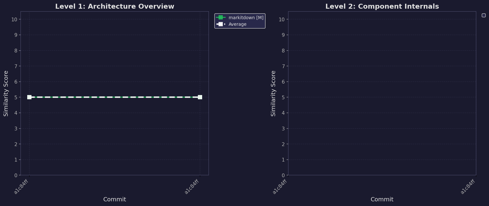

# Accuracy Evaluation

**Generated:** 2026-01-17T15:03:16.489323+00:00

**Duration:** N/A

This report tracks the structural accuracy of CodeBoarding's generated diagrams against a curated ground-truth dataset. We measure how well the agent captures system topology, component relationships, and architectural hierarchy.

## Methodology & Scoring

Our evaluation uses a **"Model-as-a-Judge"** approach to compare the `analysis.json` generated by CodeBoarding against a human-verified `train.json`.

### Scoring Criteria (1-10)

- **Node Coverage:** Overlap of identified components and nodes.
- **Relationship Fidelity:** Correctness of edges (source, target, and type).
- **Structural Coherence:** Overall topology and flow alignment.

### Glossary

- **Small (S):** < 10k lines of code.
- **Medium (M):** 10k - 100k lines of code.
- **Large (L):** 100k - 1M lines of code.
- **Huge (H):** > 1M lines of code.

---

## Level 1: Architecture Overview

### Similarity Scores by Code Size

| Commit | markitdown [M] | pytorch_geometric [L] | Avg | User | Cores |
|---|---|---|---|---|---|
| a1c84ff | 5.00 | N/A | 5.00 | brovatten | 10 |
| a1c84ff | 5.00 | N/A | 5.00 | brovatten | 10 |
| 84e830c | 5.00 | N/A | 5.00 | brovatten | 10 |
| 84e830c | 5.00 | N/A | 5.00 | brovatten | 10 |

---

## Level 2: Component Internals

### Similarity Scores by Code Size

| Commit | markitdown [M] | pytorch_geometric [L] | Avg | User | Cores |
|---|---|---|---|---|---|
| a1c84ff | N/A | N/A | N/A | brovatten | 10 |
| a1c84ff | N/A | N/A | N/A | brovatten | 10 |
| 84e830c | N/A | N/A | N/A | brovatten | 10 |
| 84e830c | N/A | N/A | N/A | brovatten | 10 |

*Note: To avoid compounding errors from a faulty level 1 generation, we use our ground truth for level 1, and then generate level 2 from that.*

---

### Score History

### Judge Reasoning

| Commit | Project | Depth | Score | Node Coverage | Relationship Fidelity | Structural Coherence |
|--------|---------|-------|-------|---------------|----------------------|---------------------|
| a1c84ff | markitdown | 1 | 5.00 | Both diagrams include a similar set of components related to document conversion, but they differ in naming and specific implementations of converters. | The relationships between nodes in both diagrams show some alignment in purpose, but the specific connections and types of relationships differ significantly. | While both diagrams depict a conversion framework, the overall architecture and flow differ, with the generated diagram introducing additional layers and components not present in the dataset diagram. |
| a1c84ff | markitdown | 1 | 5.00 | Both diagrams include a similar set of components related to document conversion, but they differ in naming and specific implementations of converters. | The relationships between nodes in both diagrams show some alignment in purpose, but the specific connections and types of relationships differ significantly. | While both diagrams depict a conversion framework, the overall architecture and flow differ, with the generated diagram introducing additional layers and components not present in the dataset diagram. |
| 84e830c | markitdown | 1 | 5.00 | Both diagrams include a similar set of components related to document conversion, but they differ in naming and specific implementations of converters. | The relationships between nodes in both diagrams show some alignment in purpose, but the specific connections and types of relationships differ significantly. | While both diagrams depict a conversion framework, the overall architecture and flow differ, with the generated diagram introducing additional layers and components not present in the dataset diagram. |
| 84e830c | markitdown | 1 | 5.00 | Both diagrams include a similar set of components related to document conversion, but they differ in naming and specific implementations of converters. | The relationships between nodes in both diagrams show some alignment in purpose, but the specific connections and types of relationships differ significantly. | While both diagrams depict a conversion framework, the overall architecture and flow differ, with the generated diagram introducing additional layers and components not present in the dataset diagram. |