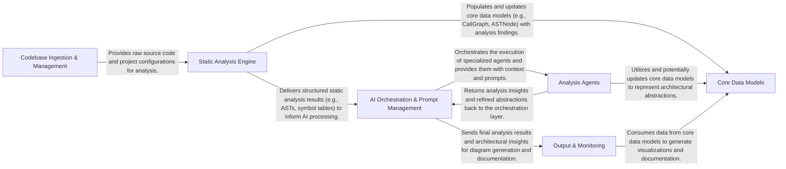
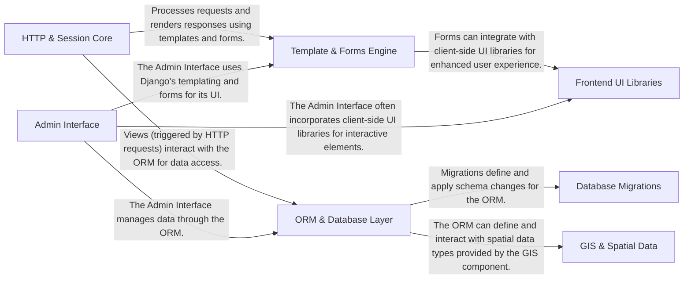

# End-to-End Pipeline Evaluation

**Generated:** 2026-01-17T17:35:50.355961+00:00

### Summary

| Project | Language | Status | Time (s) | Total Tokens | Tool Calls |
|---------|----------|--------|----------|--------------|------------|
| markitdown | Python | ✅ Success | 185.0 | 74,846 | 6 |
| codeboarding | Python | ✅ Success | 1010.6 | 319,883 | 65 |
| django | Python | ✅ Success | 1046.4 | 559,172 | 19 |

**Success:** 3/3
**Total Tokens:** 953,901
**Total Tool Calls:** 90

## Generated Top-Level Diagrams

### markitdown

### codeboarding

### django

## System Specifications

**Operating System:** Darwin (macOS-26.2-arm64-arm-64bit)
**Processor:** arm
**CPU Cores:** 14
**Git User:** ivanmilevtues
