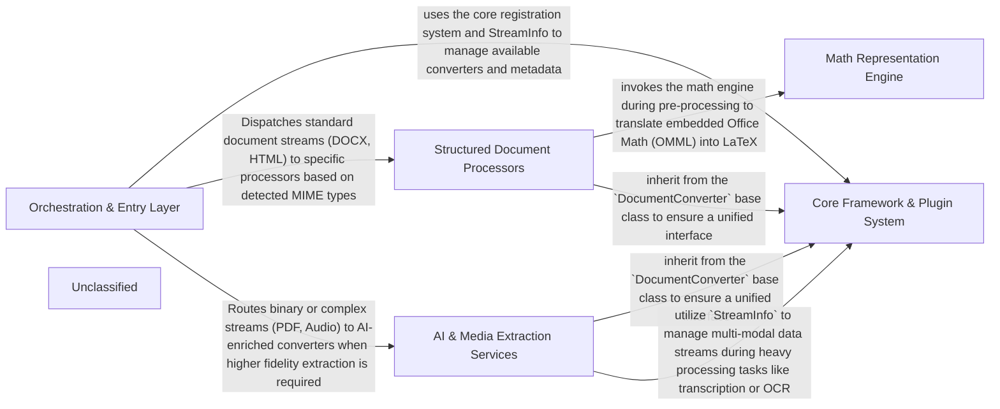

# End-to-End Pipeline Evaluation

**Generated:** 2026-01-01T23:16:52.961160+00:00

### Summary

| Project | Language | Status | Time (s) | Total Tokens | Tool Calls |
|---------|----------|--------|----------|--------------|------------|
| markitdown | Python | ✅ Success | 450.0 | 1,661,125 | 97 |
| codeboarding | Python | ✅ Success | 381.5 | 1,536,205 | 66 |
| django | Python | ❌ Failed | 53454.4 | 0 | 0 |

**Success:** 2/3
**Total Tokens:** 3,197,330
**Total Tool Calls:** 163

## Generated Top-Level Diagrams

### markitdown



### codeboarding

```mermaid
graph LR
    Job_Orchestration_Repo_Manager["Job Orchestration & Repo Manager"]
    LSP_Static_Analysis_Provider["LSP Static Analysis Provider"]
    Agent_Intelligence_Framework["Agent Intelligence Framework"]
    Multi_Stage_Analysis_Agents["Multi-Stage Analysis Agents"]
    Semantic_Graph_Output_Engine["Semantic Graph & Output Engine"]
    Unclassified["Unclassified"]
    Job_Orchestration -- "Triggers the initial multi-language scan to establish the semantic "ground truth" and symbol map." --> LSP_Static_Analysis_Provider
    Job_Orchestration -- "Orchestrates the agentic decomposition loop (Abstraction -> Details -> Validation) and manages parallel task execution." --> Multi_Stage_Analysis_Agents
    Multi_Stage_Analysis_Agents -- "Queries verified symbol data and call graphs (via the Toolkit) to ground LLM hallucinations in actual source code." --> LSP_Static_Analysis_Provider
    Multi_Stage_Analysis_Agents -- "Inherits core agentic capabilities and retrieves specialized prompt templates (e.g., `AbstractionAgent` uses `get_system_message`)." --> Agent_Intelligence_Framework
    Multi_Stage_Analysis_Agents -- "Passes structured analysis insights (`AnalysisInsights`) to the clustering and rendering pipeline." --> Semantic_Graph_Output_Engine
    Semantic_Graph_Output_Engine -- "Resolves call graph references to validate the generated architecture and cluster boundaries." --> LSP_Static_Analysis_Provider
```

### django

*No diagram generated for this project.*


## System Specifications

**Operating System:** Darwin (macOS-26.2-arm64-arm-64bit)
**Processor:** arm
**CPU Cores:** 14
**Git User:** ivanmilevtues
