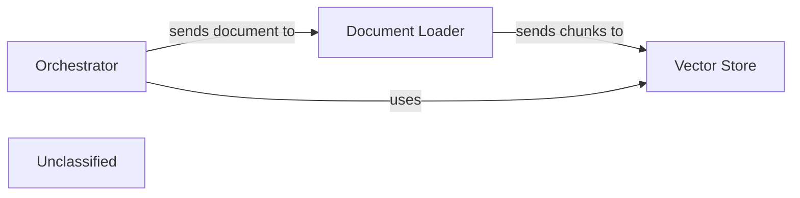
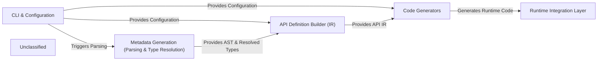
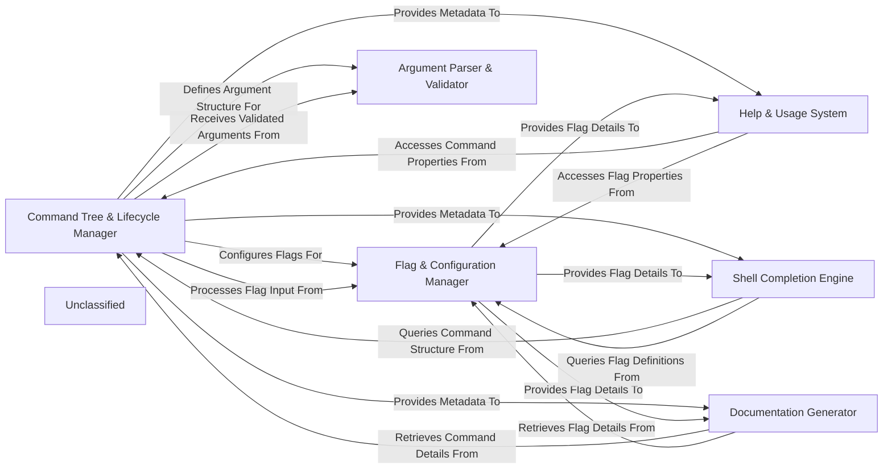

# End-to-End Pipeline Evaluation

**Generated:** 2025-10-26T16:36:10.598456

**Evaluation Time:** 1906.51 seconds

### Summary

| Project | Language | Status | Time (s) | Total Tokens | Tool Calls |
|---------|----------|--------|----------|--------------|------------|
| markitdown | Python | ✅ Success | 819.11 | 0 | 0 |
| tsoa | TypeScript | ✅ Success | 601.31 | 0 | 0 |
| cobra | Go | ✅ Success | 486.09 | 0 | 0 |

## Generated Top-Level Diagrams

### markitdown

### tsoa

### cobra

## System Specifications

**Operating System:** Darwin (macOS-15.6-arm64-arm-64bit-Mach-O)
**Processor:** arm
**CPU Cores:** 10
**Git User:** brovatten
