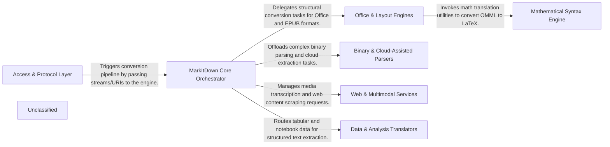
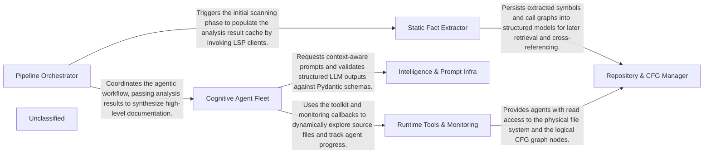

# End-to-End Pipeline Evaluation

**Generated:** 2025-12-27T00:05:32.012040+00:00

### Summary

| Project | Language | Status | Time (s) | Total Tokens | Tool Calls |
|---------|----------|--------|----------|--------------|------------|
| markitdown | Python | ✅ Success | 356.2 | 808,081 | 69 |
| codeboarding | Python | ✅ Success | 315.7 | 497,793 | 46 |
| django | Python | ❌ Failed | 1800.0 | 0 | 0 |

**Success:** 2/3
**Total Tokens:** 1,305,874
**Total Tool Calls:** 115

## Generated Top-Level Diagrams

### markitdown

### codeboarding

### django

*No diagram generated for this project.*

## System Specifications

**Operating System:** Darwin (macOS-26.2-arm64-arm-64bit)
**Processor:** arm
**CPU Cores:** 14
**Git User:** ivanmilevtues
