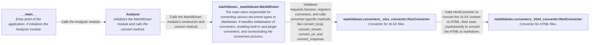

```mermaid
flowchart LR
    __main__[<b>__main__</b><br><i>Entry point of the application. It initializes the Analyzer module.</i>] -- Calls the Analyzer module. --> Analyzer[<b>Analyzer</b><br><i>Initializes the MarkItDown module and calls the convert method.</i>]
    Analyzer[<b>Analyzer</b><br><i>Initializes the MarkItDown module and calls the convert method.</i>] -- Calls the MarkItDown module's constructor and convert method. --> markitdown._markitdown.MarkItDown[<b>markitdown._markitdown.MarkItDown</b><br><i>The main class responsible for converting various document types to Markdown. It handles initialization of converters, enabling built-in and plugin converters, and orchestrating the conversion process.</i>]
    markitdown._markitdown.MarkItDown[<b>markitdown._markitdown.MarkItDown</b><br><i>The main class responsible for converting various document types to Markdown. It handles initialization of converters, enabling built-in and plugin converters, and orchestrating the conversion process.</i>] -- Initializes requests.Session, registers converters, and calls converter-specific methods like convert_local, convert_stream, convert_url, and convert_response. --> markitdown.converters._xlsx_converter.XlsxConverter[<b>markitdown.converters._xlsx_converter.XlsxConverter</b><br><i>Converter for XLSX files.</i>]
    markitdown.converters._xlsx_converter.XlsxConverter[<b>markitdown.converters._xlsx_converter.XlsxConverter</b><br><i>Converter for XLSX files.</i>] -- Calls HtmlConverter to convert the XLSX content to HTML, then uses _markdownify to convert the HTML to markdown. --> markitdown.converters._html_converter.HtmlConverter[<b>markitdown.converters._html_converter.HtmlConverter</b><br><i>Converter for HTML files.</i>]
```