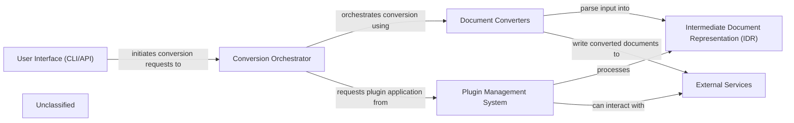

# End-to-End Pipeline Evaluation

**Generated:** 2025-12-22T18:00:22.916882+00:00

### Summary

| Project | Language | Status | Time (s) | Total Tokens | Tool Calls |
|---------|----------|--------|----------|--------------|------------|
| markitdown | Python | ✅ Success | 28.4 | 0 | 0 |

**Success:** 1/1
**Total Tokens:** 0
**Total Tool Calls:** 0

## Generated Top-Level Diagrams

### markitdown

## System Specifications

**Operating System:** Darwin (macOS-15.6-arm64-arm-64bit-Mach-O)
**Processor:** arm
**CPU Cores:** 10
**Git User:** brovatten
